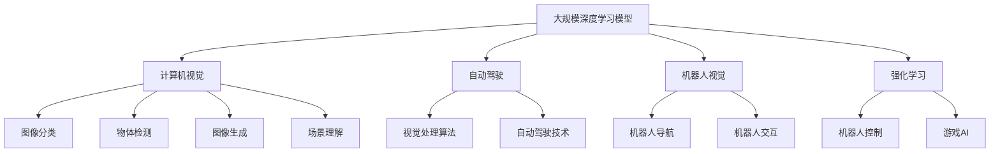
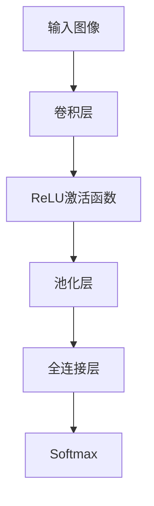

                 

# Andrej Karpathy：人工智能的未来影响

## 1. 背景介绍

Andrej Karpathy，斯坦福大学教授，被广泛认为是大规模深度学习模型的先驱之一，尤其以其在计算机视觉领域的研究闻名。他的工作涉及图像识别、自动驾驶、机器人视觉等诸多方面。Karpathy博士的许多研究被引述超过千次，他还担任特斯拉公司的首席AI科学家，与特斯拉CEO Elon Musk共同推动自动驾驶技术的研发。本文将从他的学术生涯和工业经历入手，探讨其对人工智能未来发展趋势的深刻见解。

## 2. 核心概念与联系

### 2.1 核心概念概述

Andrej Karpathy的研究领域涵盖了多个前沿领域，其中最核心的包括：

- **大规模深度学习模型**：主要研究基于深度神经网络的模型，如卷积神经网络（CNN）、循环神经网络（RNN）及其变体。
- **计算机视觉**：在图像分类、物体检测、图像生成、场景理解等方面做出重要贡献。
- **自动驾驶**：开发了用于特斯拉自动驾驶项目的视觉处理算法。
- **机器人视觉**：研究和开发用于机器人导航和交互的视觉算法。
- **强化学习**：应用于机器人控制、游戏AI等方面。

### 2.2 核心概念的关系

Andrej Karpathy的研究成果和工业经历密不可分，其核心概念间的关系如下图所示：



该图展示了Andrej Karpathy研究的核心领域和具体应用。大规模深度学习模型是其研究工具和方法，计算机视觉是其研究的主要方向，自动驾驶和机器人视觉是其工业应用的代表，强化学习是其探索的复杂决策问题的解决方案。这些领域相互交织，共同推动了人工智能的不断进步。

## 3. 核心算法原理 & 具体操作步骤

### 3.1 算法原理概述

Karpathy教授的工作集中在深度学习模型在视觉任务中的应用。其中，卷积神经网络（CNN）是他在计算机视觉领域的主要工具。CNN通过多层卷积和池化操作，能够有效地从图像中提取特征，用于分类、检测等任务。

### 3.2 算法步骤详解

以图像分类为例，CNN模型的训练过程主要包括以下步骤：

1. **数据准备**：收集和标注大量图像数据，并将其分为训练集和测试集。
2. **模型构建**：设计CNN模型架构，包含卷积层、池化层、全连接层等。
3. **模型训练**：使用训练集数据对模型进行训练，通过反向传播算法更新模型参数。
4. **模型评估**：在测试集上评估模型性能，如准确率、召回率等指标。
5. **模型优化**：根据评估结果调整模型参数，如增加卷积层深度、调整学习率等。

### 3.3 算法优缺点

**优点**：
- **高效特征提取**：CNN能够自动提取图像的高级特征，降低特征工程的复杂度。
- **并行计算**：由于卷积和池化操作具有局部连接和空间不变性，可以高效利用GPU等硬件资源。
- **可解释性强**：通过可视化卷积核，可以直观理解模型对图像的理解方式。

**缺点**：
- **参数量大**：深度网络通常有上千万甚至亿级的参数，增加了训练和推理的复杂度。
- **过拟合风险**：随着网络深度的增加，容易发生过拟合现象，需要进行正则化处理。
- **依赖标注数据**：需要大量标注数据进行训练，获取标注数据成本较高。

### 3.4 算法应用领域

Karpathy教授的研究成果广泛应用于多个领域，包括：

- **计算机视觉**：图像分类、物体检测、图像分割等。
- **自动驾驶**：车辆感知、路径规划、障碍物识别等。
- **机器人视觉**：目标识别、环境理解、导航路径规划等。
- **游戏AI**：角色动作捕捉、游戏内物理模拟等。

## 4. 数学模型和公式 & 详细讲解

### 4.1 数学模型构建

在图像分类任务中，CNN模型的输出层通常是一个softmax分类器，用于将输入图像映射到多个类别上。设输入图像为 $x$，模型参数为 $\theta$，则模型的预测概率为：

$$
P(y|x;\theta) = \frac{\exp(\theta^T f(x))}{\sum_k \exp(\theta^T f_k(x))}
$$

其中 $f(x)$ 为卷积神经网络的前向传播过程，$y$ 为类别标签，$\theta$ 为模型参数。

### 4.2 公式推导过程

以简单的CNN模型为例，其前向传播过程如图：



卷积层使用卷积核 $k$ 对输入图像进行卷积操作，得到特征图 $C_k$：

$$
C_k = \sum_{i,j} x_{i,j} * k_{i,j}
$$

激活函数（如ReLU）用于引入非线性特性，池化层用于降低特征图的维度，全连接层将特征图映射到类别概率分布上，Softmax函数将概率分布映射到类别标签。

### 4.3 案例分析与讲解

以Karpathy教授在2015年发表的ImageNet论文为例，其使用VGG-16模型在图像分类任务上取得了突破性的结果。论文中，作者通过增加网络深度和宽度，大幅提高了模型性能。同时，作者还使用了数据增强技术，如随机裁剪、水平翻转等，进一步提升了模型的泛化能力。

## 5. 项目实践：代码实例和详细解释说明

### 5.1 开发环境搭建

- **Python环境**：安装最新版本的Python和相关的科学计算库，如NumPy、Pandas等。
- **深度学习框架**：安装TensorFlow或PyTorch等深度学习框架，并确保其与GPU环境兼容。
- **数据准备**：收集和准备图像数据，并使用ImageNet等标准数据集进行训练和测试。

### 5.2 源代码详细实现

以下是一个使用PyTorch框架构建CNN模型的示例代码：

```python
import torch
import torch.nn as nn
import torchvision.transforms as transforms
from torchvision.datasets import CIFAR10

# 定义卷积层
class ConvNet(nn.Module):
    def __init__(self):
        super(ConvNet, self).__init__()
        self.conv1 = nn.Conv2d(3, 6, 5)
        self.pool = nn.MaxPool2d(2, 2)
        self.conv2 = nn.Conv2d(6, 16, 5)
        self.fc1 = nn.Linear(16 * 5 * 5, 120)
        self.fc2 = nn.Linear(120, 84)
        self.fc3 = nn.Linear(84, 10)

    def forward(self, x):
        x = self.pool(F.relu(self.conv1(x)))
        x = self.pool(F.relu(self.conv2(x)))
        x = x.view(-1, 16 * 5 * 5)
        x = F.relu(self.fc1(x))
        x = F.relu(self.fc2(x))
        x = self.fc3(x)
        return x

# 加载数据集
transform = transforms.Compose([
    transforms.ToTensor(),
    transforms.Normalize((0.5, 0.5, 0.5), (0.5, 0.5, 0.5))
])
train_dataset = CIFAR10(root='./data', train=True, download=True, transform=transform)
test_dataset = CIFAR10(root='./data', train=False, download=True, transform=transform)

# 定义模型和优化器
model = ConvNet()
criterion = nn.CrossEntropyLoss()
optimizer = torch.optim.SGD(model.parameters(), lr=0.001, momentum=0.9)

# 训练过程
for epoch in range(10):
    running_loss = 0.0
    for i, data in enumerate(train_loader, 0):
        inputs, labels = data
        optimizer.zero_grad()
        outputs = model(inputs)
        loss = criterion(outputs, labels)
        loss.backward()
        optimizer.step()
        running_loss += loss.item()
    print('Epoch %d loss: %.3f' % (epoch+1, running_loss/len(train_loader)))
```

### 5.3 代码解读与分析

- **卷积层定义**：使用`nn.Conv2d`定义卷积层，并设置输入、输出通道和卷积核大小。
- **池化层定义**：使用`nn.MaxPool2d`定义最大池化层，用于降低特征图维度。
- **全连接层定义**：使用`nn.Linear`定义全连接层，将特征图映射到类别概率上。
- **前向传播**：在`forward`方法中定义模型的前向传播过程，包括卷积、激活、池化和全连接等步骤。
- **数据加载和预处理**：使用`torchvision.transforms`对数据进行增强和标准化处理。
- **模型定义和优化器设置**：定义CNN模型并设置优化器和损失函数。
- **训练过程**：通过循环迭代训练集，使用优化器更新模型参数，并计算损失。

### 5.4 运行结果展示

在训练过程中，可以使用以下代码计算模型在测试集上的准确率：

```python
correct = 0
total = 0
with torch.no_grad():
    for data in test_loader:
        images, labels = data
        outputs = model(images)
        _, predicted = torch.max(outputs.data, 1)
        total += labels.size(0)
        correct += (predicted == labels).sum().item()

print('Accuracy: %d %%' % (100 * correct / total))
```

通过对比训练前后的准确率变化，可以直观地观察到模型的学习效果。

## 6. 实际应用场景

### 6.1 自动驾驶

自动驾驶技术是Karpathy教授研究的重要方向之一。特斯拉的Autopilot系统中，图像处理算法是其核心组成部分。具体应用包括：

- **环境感知**：通过摄像头和激光雷达获取车辆周围环境的图像和点云数据。
- **障碍物识别**：使用CNN模型对图像进行实时处理，识别道路标志、行人、车辆等障碍物。
- **路径规划**：根据识别结果进行路径规划和决策，确保车辆安全行驶。

### 6.2 机器人视觉

Karpathy教授在机器人视觉领域的研究主要集中在目标识别和环境理解上。通过机器人视觉技术，可以实现机器人对周围环境的实时监控和自主导航。具体应用包括：

- **目标检测**：使用CNN模型对机器人视角范围内的图像进行目标检测，识别出感兴趣的物体。
- **环境理解**：通过多角度摄像头的信息融合，构建机器人的环境地图，进行路径规划。
- **导航路径规划**：根据环境地图和目标位置，规划机器人的运动路径，避开障碍物，到达目标地点。

### 6.3 游戏AI

Karpathy教授在游戏AI领域的研究主要集中在强化学习和自动生成游戏内容上。通过深度学习技术，可以开发出更加智能的游戏AI，提升玩家的游戏体验。具体应用包括：

- **角色动作捕捉**：使用CNN模型对游戏角色进行动作捕捉，生成逼真的游戏动作。
- **游戏内物理模拟**：使用CNN模型模拟游戏内物体的物理行为，如碰撞、摩擦等。
- **游戏生成**：使用生成对抗网络（GAN）生成新的游戏场景和角色，增加游戏多样性。

## 7. 工具和资源推荐

### 7.1 学习资源推荐

- **深度学习课程**：Stanford大学的CS231n课程，详细介绍了卷积神经网络在计算机视觉中的应用。
- **开源项目**：Karpathy教授在GitHub上发布了多个深度学习项目，包括VGG、ResNet、Game AI等，供开发者学习和参考。
- **研究论文**：Karpathy教授的研究论文覆盖了深度学习、计算机视觉、自动驾驶等多个领域，是了解最新研究进展的重要资源。

### 7.2 开发工具推荐

- **深度学习框架**：TensorFlow、PyTorch等深度学习框架，支持GPU加速，方便模型训练和推理。
- **数据增强工具**： Albumentations、Kornia等库，用于数据增强和图像预处理。
- **可视化工具**： TensorBoard、Weights & Biases等工具，用于模型训练和性能监控。

### 7.3 相关论文推荐

- Karpathy等人，《Visualizing and Understanding Convolutional Networks》，深入浅出地介绍了卷积神经网络的结构和可视化方法。
- Gao等人，《Recurrent Neural Networks for Robust Visual-Textual Interaction》，研究了深度学习在视觉-文本交互中的应用。
- Dever等人，《Learning to Play the Game of Go Without Human Knowledge》，展示了AlphaGo在围棋游戏中的表现。

## 8. 总结：未来发展趋势与挑战

### 8.1 研究成果总结

Andrej Karpathy教授在深度学习领域的研究成果丰硕，主要集中在卷积神经网络、计算机视觉、自动驾驶、机器人视觉和游戏AI等方面。其研究不仅推动了学术界的发展，还为工业界带来了显著的进步。

### 8.2 未来发展趋势

- **多模态学习**：未来深度学习模型将更多地融合视觉、文本、声音等多模态信息，提升对复杂场景的理解能力。
- **自监督学习**：利用无监督数据进行预训练，减少对标注数据的依赖，提高模型的泛化能力。
- **强化学习**：结合深度学习和强化学习，开发更加智能的决策系统，如自动驾驶、机器人导航等。
- **实时计算**：随着硬件性能的提升，深度学习模型的实时计算和推理能力将进一步增强。
- **边缘计算**：将深度学习模型部署到边缘设备上，减少数据传输延迟，提升系统响应速度。

### 8.3 面临的挑战

- **数据稀缺**：深度学习模型需要大量的标注数据进行训练，数据获取成本较高。
- **模型复杂度**：深度学习模型的参数量和计算复杂度较高，训练和推理速度较慢。
- **模型可解释性**：深度学习模型通常是"黑盒"系统，难以解释其内部工作机制和决策逻辑。
- **硬件资源**：深度学习模型的训练和推理需要高性能的硬件支持，成本较高。
- **伦理和安全问题**：深度学习模型可能存在偏见、歧视等伦理问题，需要在算法设计中加以防范。

### 8.4 研究展望

未来，深度学习的研究方向将继续朝着更高效、更智能、更可解释、更安全的目标发展。通过多学科交叉、多方协作，相信深度学习将为人类带来更加广泛的应用和更加深刻的影响。

## 9. 附录：常见问题与解答

**Q1：什么是卷积神经网络？**

A：卷积神经网络（Convolutional Neural Network, CNN）是一种深度神经网络结构，主要用于图像处理和计算机视觉任务。它通过多层卷积和池化操作，能够自动提取图像的高级特征，显著提高了图像分类、物体检测等任务的精度。

**Q2：深度学习模型的训练需要多少数据？**

A：深度学习模型的训练需要大量标注数据。一般而言，标注数据的数量越大，模型的泛化能力越强。对于特定的任务，需要根据具体问题选择合适的数据量和标注策略。

**Q3：深度学习模型的可解释性问题如何解决？**

A：深度学习模型的可解释性问题可以通过可视化技术、特征提取技术等手段进行缓解。如使用热图、梯度图等可视化方法，直观展示模型的内部决策过程。通过引入先验知识，如知识图谱、逻辑规则等，对模型进行约束，提升模型的可解释性和可控性。

**Q4：深度学习在自动驾驶中的应用前景如何？**

A：深度学习在自动驾驶领域具有广泛的应用前景。通过深度学习，可以实现车辆感知、障碍物识别、路径规划等核心功能。然而，深度学习模型的复杂性和资源需求也带来了挑战，需要进一步优化模型结构和算法。

**Q5：游戏AI的未来发展方向是什么？**

A：游戏AI的未来发展方向主要集中在以下几个方面：

- **智能对手**：开发更加智能的对手，提升游戏难度和挑战性。
- **游戏生成**：通过深度学习生成新的游戏场景和角色，增加游戏多样性。
- **人机交互**：开发更加智能的交互系统，提升玩家的游戏体验。

总之，Andrej Karpathy教授在深度学习领域的研究成果不仅推动了学术界的发展，还为工业界带来了显著的进步。他的工作展示了深度学习在多个领域的巨大潜力，为未来的研究方向提供了宝贵的参考。

