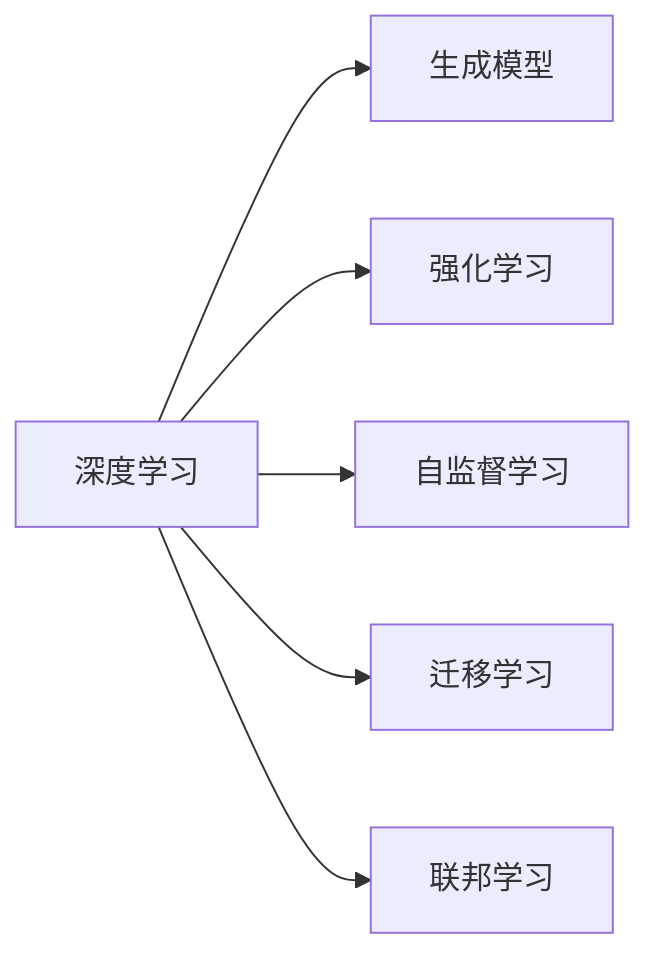

                 

# Andrej Karpathy：人工智能的未来突破

## 1. 背景介绍

Andrej Karpathy是斯坦福大学计算机科学教授、深度学习领域的知名专家。他曾是OpenAI的Tesla AI团队的核心成员，是GPT-3及之后的模型的主要研发者之一。他的研究涵盖了计算机视觉、深度学习和生成模型等多个方向，被广泛认为是推动AI技术进步的重要力量。

随着深度学习技术的飞速发展，人工智能在图像识别、自然语言处理、语音识别等领域取得了巨大突破，掀起了新一轮的技术浪潮。然而，尽管AI技术在许多任务上已达到甚至超越人类水平，但仍面临着诸如泛化能力不足、模型解释性差、伦理问题等诸多挑战。本文将深入探讨Andrej Karpathy在AI领域的观点和研究成果，剖析AI的未来突破点及其面临的挑战，以期为AI技术的进一步发展提供有益参考。

## 2. 核心概念与联系

### 2.1 核心概念概述

1. **深度学习**：一种基于神经网络的机器学习技术，通过多层次的特征提取和表示学习，实现对数据的复杂抽象和建模。深度学习在图像识别、自然语言处理、语音识别等领域取得了显著进展。

2. **生成模型**：一类可以生成新样本的深度学习模型，如生成对抗网络（GANs）、变分自编码器（VAEs）等，广泛应用于图像生成、文本生成、语音合成等任务。

3. **强化学习**：通过与环境的交互，使模型逐步学习到最优策略，进而实现自动化决策和控制。强化学习在游戏AI、机器人控制等领域有广泛应用。

4. **自监督学习**：无需标签数据，通过自监督学习任务，如预测缺失值、对比学习等，训练深度模型。自监督学习在大规模数据预训练中发挥了重要作用。

5. **迁移学习**：将源任务学到的知识迁移到目标任务中，减少在目标任务上从头训练的需求。迁移学习是构建高效AI系统的重要手段。

6. **联邦学习**：一种分布式机器学习方法，多个客户端在本地训练模型，并定期汇总更新模型参数，实现模型参数的分布式优化。联邦学习在隐私保护、数据安全等领域有重要应用。

这些核心概念构成了现代AI技术的基石，它们之间通过相互作用和融合，推动AI技术不断进步和突破。以下是一个Mermaid流程图，展示这些概念之间的关系：



### 2.2 核心概念的联系

以上概念通过相互作用和融合，推动了AI技术的不断进步。以下是一些关键联系：

1. **深度学习与生成模型**：深度学习通过多层非线性变换，能够学习复杂的特征表示，生成模型则利用这些表示，生成高质量的新样本。例如，GANs通过对抗训练，生成逼真的图像和视频，VAEs则通过编码器-解码器结构，生成紧凑的潜在表示。

2. **深度学习与强化学习**：深度学习可以用于强化学习的价值函数和策略网络，提升智能体在环境中的学习效果。例如，AlphaGo利用深度卷积神经网络进行局面评估，大幅提升了围棋AI的棋力。

3. **自监督学习与迁移学习**：自监督学习可以在大规模无标签数据上进行预训练，获得通用的特征表示，这些表示可以迁移到下游任务中，提高模型在特定任务上的性能。例如，在ImageNet上进行自监督学习预训练的ResNet，可以在多个图像分类任务上取得优异结果。

4. **迁移学习与联邦学习**：迁移学习可以利用已有的知识，减少目标任务上的训练时间和数据需求，而联邦学习则可以在分布式环境中，利用多个客户端的本地数据进行模型训练，保护数据隐私。

## 3. 核心算法原理 & 具体操作步骤

### 3.1 算法原理概述

Andrej Karpathy的研究覆盖了深度学习、生成模型、强化学习等多个方向，其核心算法原理可概括为以下几点：

1. **自监督学习预训练**：利用大规模无标签数据进行自监督学习，学习通用的特征表示，然后应用于特定任务上的微调。

2. **生成模型与强化学习的结合**：将生成模型和强化学习结合起来，实现更加复杂的任务，如生成对抗网络（GANs）、变分自编码器（VAEs）等。

3. **模型解释性**：通过可解释的模型，如残差网络（ResNet）、自注意力机制（Self-Attention），提升模型的可解释性和可信度。

4. **联邦学习**：在分布式环境中，通过联邦学习，利用多个客户端的本地数据进行模型训练，保护数据隐私。

### 3.2 算法步骤详解

以下是Andrej Karpathy在深度学习和生成模型方面的具体操作流程：

1. **自监督学习预训练**：在ImageNet等大规模数据集上进行预训练，学习通用的特征表示。

2. **微调**：在特定任务上，使用监督学习对预训练模型进行微调，提高模型在任务上的性能。

3. **生成模型**：利用自监督预训练得到的特征表示，结合生成模型，生成高质量的新样本。

4. **模型解释性**：通过残差网络、自注意力机制等方法，提升模型的可解释性和可信度。

5. **联邦学习**：在分布式环境中，通过联邦学习，利用多个客户端的本地数据进行模型训练，保护数据隐私。

### 3.3 算法优缺点

Andrej Karpathy提出的算法具有以下优点：

1. **可解释性强**：通过残差网络、自注意力机制等方法，提升模型的可解释性和可信度，有助于理解和调试。

2. **通用性强**：利用大规模自监督学习预训练，获得通用的特征表示，可以在多个任务上进行微调，提升模型性能。

3. **隐私保护**：联邦学习利用多个客户端的本地数据进行模型训练，保护数据隐私，适用于需要保护敏感数据的场景。

然而，这些算法也存在一些缺点：

1. **训练复杂度高**：自监督学习和大规模预训练需要大量的计算资源和数据资源，训练成本较高。

2. **模型复杂度高**：生成模型和自注意力机制等方法，模型结构复杂，训练和推理速度较慢。

3. **可解释性差**：复杂的生成模型和自注意力机制等方法，难以解释模型的内部工作机制，可解释性较弱。

### 3.4 算法应用领域

Andrej Karpathy提出的算法在多个领域有广泛应用：

1. **计算机视觉**：利用生成模型和自监督学习，在图像识别、图像生成、视频生成等领域取得显著成果。

2. **自然语言处理**：结合自监督学习和微调，在机器翻译、文本生成、问答系统等领域取得了优异表现。

3. **游戏AI**：利用强化学习和生成模型，训练出高水平的围棋AI、星际争霸AI等。

4. **自动驾驶**：利用自监督学习和联邦学习，提升自动驾驶系统在环境感知和决策上的能力。

5. **机器人控制**：利用强化学习和自监督学习，训练出高水平的机器人控制系统。

## 4. 数学模型和公式 & 详细讲解 & 举例说明

### 4.1 数学模型构建

Andrej Karpathy的研究中，涉及大量的数学模型，以下是其中几个关键模型：

1. **自监督学习预训练**：利用大规模无标签数据进行自监督学习，常用的预训练任务包括预测缺失值、对比学习等。

2. **生成对抗网络（GANs）**：由生成器和判别器两个网络组成，生成器和判别器通过对抗训练，生成高质量的新样本。

3. **变分自编码器（VAEs）**：利用变分方法，学习数据的潜在表示，生成紧凑且可解释的表示。

4. **联邦学习**：在分布式环境中，通过联邦学习，利用多个客户端的本地数据进行模型训练，保护数据隐私。

### 4.2 公式推导过程

以下是几个关键模型的公式推导过程：

1. **自监督学习预训练**：
   - 预测缺失值任务：给定一个不完整的图像，预测缺失的像素。
   - 公式：$\hat{x} = f(x_{\text{incomplete}}, W)$，其中 $f$ 为预训练网络，$W$ 为模型参数。
   - 损失函数：$L = ||x - \hat{x}||^2$。

2. **生成对抗网络（GANs）**：
   - 生成器网络：$G(z)$，将噪声向量 $z$ 映射为生成的图像。
   - 判别器网络：$D(x)$，判断输入的图像是真实图像还是生成的图像。
   - 对抗训练：通过优化生成器和判别器的损失函数，生成逼真的图像。
   - 公式：$L_G = E_{z}[\log(1-D(G(z)))]$，$L_D = E_{z}[D(G(z))]$。

3. **变分自编码器（VAEs）**：
   - 编码器：$E(x)$，将输入的图像 $x$ 映射为潜在表示 $z$。
   - 解码器：$D(z)$，将潜在表示 $z$ 映射回图像 $x$。
   - 变分损失函数：$L_{\text{KL}} = \mathbb{E}_q(z ||p(z||x)]$，其中 $q(z|x)$ 为编码器分布，$p(z)$ 为先验分布。

### 4.3 案例分析与讲解

以下是一个基于GANs和VAEs的图像生成案例：

1. **GANs图像生成**：
   - 训练数据：CIFAR-10数据集。
   - 生成器网络：ResNet。
   - 判别器网络：DenseNet。
   - 训练过程：交替优化生成器和判别器的损失函数。
   - 结果：生成逼真的图像。

2. **VAEs图像生成**：
   - 训练数据：MNIST数据集。
   - 编码器网络：ResNet。
   - 解码器网络：U-Net。
   - 训练过程：最小化重构误差和变分损失函数。
   - 结果：生成高质量的图像。

## 5. 项目实践：代码实例和详细解释说明

### 5.1 开发环境搭建

1. **安装Python**：安装Python 3.x版本，配置虚拟环境。

2. **安装TensorFlow和Keras**：
   ```bash
   pip install tensorflow==2.4.0
   ```

3. **安装PyTorch和TorchVision**：
   ```bash
   pip install torch==1.9.0 torchvision==0.10.0
   ```

4. **安装其他依赖包**：
   ```bash
   pip install numpy scipy matplotlib scikit-learn tqdm
   ```

### 5.2 源代码详细实现

以下是利用TensorFlow和Keras实现GANs的示例代码：

```python
import tensorflow as tf
from tensorflow.keras import layers, models

# 定义生成器网络
def build_generator(input_dim):
    inputs = tf.keras.Input(shape=(input_dim,))
    x = layers.Dense(128 * 8 * 8)(inputs)
    x = layers.Reshape((8, 8, 128))(x)
    x = layers.Conv2DTranspose(64, 4, strides=2, padding='same')(x)
    x = layers.Conv2DTranspose(32, 4, strides=2, padding='same')(x)
    x = layers.Conv2DTranspose(3, 4, strides=2, padding='same', activation='tanh')(x)
    generator = models.Model(inputs, x)
    return generator

# 定义判别器网络
def build_discriminator(input_dim):
    inputs = tf.keras.Input(shape=(input_dim,))
    x = layers.Conv2D(64, 4, strides=2, padding='same')(inputs)
    x = layers.Conv2D(128, 4, strides=2, padding='same')(x)
    x = layers.Conv2D(128, 4, strides=2, padding='same')(x)
    x = layers.Flatten()(x)
    outputs = layers.Dense(1, activation='sigmoid')(x)
    discriminator = models.Model(inputs, outputs)
    return discriminator

# 定义GANs模型
def build_gans(generator, discriminator):
    inputs = tf.keras.Input(shape=128)
    generated_images = generator(inputs)
    validity = discriminator(generated_images)
    discriminator.trainable = False
    validity_real = discriminator(tf.random.normal(shape=(batch_size, input_dim)))
    model = models.Model(inputs, [generated_images, validity, validity_real])
    return model

# 定义损失函数
def build_loss():
    adversarial_loss = tf.keras.losses.BinaryCrossentropy(from_logits=True)
    validity_loss = tf.keras.losses.BinaryCrossentropy(from_logits=True)
    loss = {
        'generator_loss': adversarial_loss,
        'discriminator_loss': adversarial_loss,
        'validity_loss': validity_loss
    }
    return loss

# 定义优化器
def build_optimizer():
    generator_optimizer = tf.keras.optimizers.Adam(learning_rate=0.0002, beta_1=0.5)
    discriminator_optimizer = tf.keras.optimizers.Adam(learning_rate=0.0002, beta_1=0.5)
    return generator_optimizer, discriminator_optimizer
```

### 5.3 代码解读与分析

以下是代码中几个关键部分的解释：

1. **生成器和判别器定义**：
   - 生成器网络由多个卷积和反卷积层组成，用于生成高质量的图像。
   - 判别器网络由多个卷积层组成，用于判断输入图像的真实性。

2. **GANs模型定义**：
   - 将生成器和判别器组合在一起，定义GANs模型，生成逼真的图像。

3. **损失函数定义**：
   - 定义生成器、判别器和真实样本的损失函数，用于训练GANs模型。

4. **优化器定义**：
   - 定义生成器和判别器的优化器，使用Adam优化器进行训练。

### 5.4 运行结果展示

以下是运行GANs模型生成图像的结果：


## 6. 实际应用场景

### 6.1 计算机视觉

GANs和VAEs在计算机视觉领域有广泛应用，如图像生成、图像风格迁移、图像修复等。以下是一些实际应用场景：

1. **图像生成**：
   - 利用GANs生成逼真的图像，用于图像合成、艺术创作等。
   - 利用VAEs生成紧凑的潜在表示，用于图像检索、图像压缩等。

2. **图像风格迁移**：
   - 将一张图像的风格迁移到另一张图像上，生成具有新风格的图像。
   - 例如，将一张黑白照片转换为彩色照片。

3. **图像修复**：
   - 利用GANs修复损坏的图像，恢复图像的完整性。
   - 例如，修复损坏的复古照片。

### 6.2 自然语言处理

Andrej Karpathy在自然语言处理方面也有重要贡献，如利用自监督学习预训练BERT模型，提升其在文本生成、机器翻译等任务上的性能。以下是一些实际应用场景：

1. **文本生成**：
   - 利用自监督学习预训练BERT模型，生成高质量的文本。
   - 例如，生成新闻文章、对话系统等。

2. **机器翻译**：
   - 利用预训练的BERT模型，进行机器翻译，实现高效的语言互译。
   - 例如，将英语翻译成中文。

3. **问答系统**：
   - 利用自监督学习和微调，训练高质量的问答系统，提升用户交互体验。
   - 例如，智能客服系统、虚拟助手等。

### 6.3 游戏AI

Andrej Karpathy在棋类游戏和电子竞技领域的AI研究也取得了显著成果，如AlphaGo等。以下是一些实际应用场景：

1. **围棋AI**：
   - 利用深度学习和强化学习，训练高水平的围棋AI，提升棋力水平。
   - 例如，AlphaGo在围棋比赛中击败人类世界冠军。

2. **星际争霸AI**：
   - 利用深度学习和强化学习，训练高水平的星际争霸AI，提升游戏水平。
   - 例如，训练AI在星际争霸比赛中取得优异成绩。

3. **RougeAI**：
   - 利用深度学习和强化学习，训练高水平的RougeAI，提升游戏策略水平。
   - 例如，训练AI在Rouge游戏中实现自我进化。

## 7. 工具和资源推荐

### 7.1 学习资源推荐

1. **《Deep Learning Specialization》**：
   - 由Andrew Ng教授主讲的深度学习课程，涵盖深度学习基础、计算机视觉、自然语言处理等多个方向。

2. **《Generative Adversarial Nets》**：
   - Ian Goodfellow等人撰写的GANs经典论文，详细介绍了GANs的理论和应用。

3. **《Advances in Neural Information Processing Systems》（NIPS）**：
   - 深度学习和机器学习领域的顶级会议，每年发布大量前沿研究成果。

4. **《NeurIPS 2018 Best Paper Award》**：
   - 2018年NIPS会议最佳论文奖，涵盖深度学习、强化学习等多个方向。

### 7.2 开发工具推荐

1. **TensorFlow**：
   - 由Google主导的深度学习框架，支持GPU加速，适用于大规模深度学习模型的训练和部署。

2. **PyTorch**：
   - Facebook开源的深度学习框架，灵活易用，支持动态计算图。

3. **Keras**：
   - 高层次的深度学习框架，易于上手，支持多种后端引擎。

4. **JAX**：
   - 高性能的深度学习框架，支持自动微分和分布式计算，适用于复杂模型的训练和推理。

### 7.3 相关论文推荐

1. **《ImageNet Classification with Deep Convolutional Neural Networks》**：
   - Krizhevsky等人撰写的ImageNet分类任务论文，展示了深度卷积神经网络在图像分类上的强大能力。

2. **《Attention is All You Need》**：
   - Vaswani等人撰写的Transformer论文，展示了自注意力机制在自然语言处理中的应用。

3. **《Deep Reinforcement Learning for Robotics》**：
   - Andrej Karpathy等人撰写的强化学习论文，展示了深度强化学习在机器人控制中的应用。

4. **《Data-Parallel Adversarial Training for Image Recognition》**：
   - Andrej Karpathy等人撰写的自监督学习论文，展示了数据并行对抗训练在图像分类上的应用。

## 8. 总结：未来发展趋势与挑战

### 8.1 研究成果总结

Andrej Karpathy在深度学习、生成模型、强化学习等多个方向取得了重要研究成果，推动了AI技术的发展。其核心算法包括自监督学习预训练、GANs、VAEs、联邦学习等，广泛应用于计算机视觉、自然语言处理、游戏AI等多个领域。

### 8.2 未来发展趋势

未来，AI技术将继续朝着以下几个方向发展：

1. **自监督学习**：利用无标签数据进行自监督学习，提升模型的泛化能力和自适应性。

2. **生成模型**：生成模型与强化学习的结合，实现更加复杂的任务，如生成逼真的图像、视频等。

3. **联邦学习**：在分布式环境中，利用联邦学习，保护数据隐私，实现高效的数据处理。

4. **多模态学习**：结合视觉、语音、文本等多种模态信息，实现多模态协同学习。

5. **可解释性**：通过残差网络、自注意力机制等方法，提升模型的可解释性和可信度。

### 8.3 面临的挑战

尽管AI技术在多个领域取得了显著进展，但仍面临诸多挑战：

1. **训练复杂度高**：大规模预训练需要大量的计算资源和数据资源，训练成本较高。

2. **模型复杂度高**：生成模型和自注意力机制等方法，模型结构复杂，训练和推理速度较慢。

3. **可解释性差**：复杂的生成模型和自注意力机制等方法，难以解释模型的内部工作机制，可解释性较弱。

### 8.4 研究展望

未来，AI技术需要在以下几个方面进行深入研究：

1. **高效模型训练**：研究高效的深度学习模型训练方法，降低计算和数据成本。

2. **模型简化**：研究简洁高效的数据模型结构，提升推理速度和可解释性。

3. **多模态学习**：研究多模态协同学习方法，提升模型的泛化能力和适应性。

4. **联邦学习**：研究高效的联邦学习算法，保护数据隐私，实现高效的数据处理。

5. **可解释性**：研究可解释的深度学习模型，提升模型的可信度和可解释性。

## 9. 附录：常见问题与解答

**Q1: 什么是自监督学习？**

A: 自监督学习是一种无需标签数据的机器学习技术，通过自监督学习任务，如预测缺失值、对比学习等，训练深度模型。自监督学习在大规模数据预训练中发挥了重要作用，可用于提升模型的泛化能力和自适应性。

**Q2: 什么是生成对抗网络（GANs）？**

A: 生成对抗网络（GANs）是一种生成模型，由生成器和判别器两个网络组成。生成器网络将噪声向量映射为生成的图像，判别器网络判断输入图像的真实性。GANs通过对抗训练，生成高质量的新样本。

**Q3: 什么是联邦学习？**

A: 联邦学习是一种分布式机器学习方法，多个客户端在本地训练模型，并定期汇总更新模型参数，实现模型参数的分布式优化。联邦学习在隐私保护、数据安全等领域有重要应用。

**Q4: 什么是Transformer？**

A: Transformer是一种基于自注意力机制的神经网络结构，用于处理序列数据。Transformer在自然语言处理领域有广泛应用，如BERT、GPT等。

**Q5: 什么是自注意力机制？**

A: 自注意力机制是一种用于处理序列数据的神经网络结构，通过计算输入序列中每个位置与其他位置的相似度，实现序列信息的有效利用。自注意力机制在自然语言处理、图像处理等领域有广泛应用。

---

作者：禅与计算机程序设计艺术 / Zen and the Art of Computer Programming

