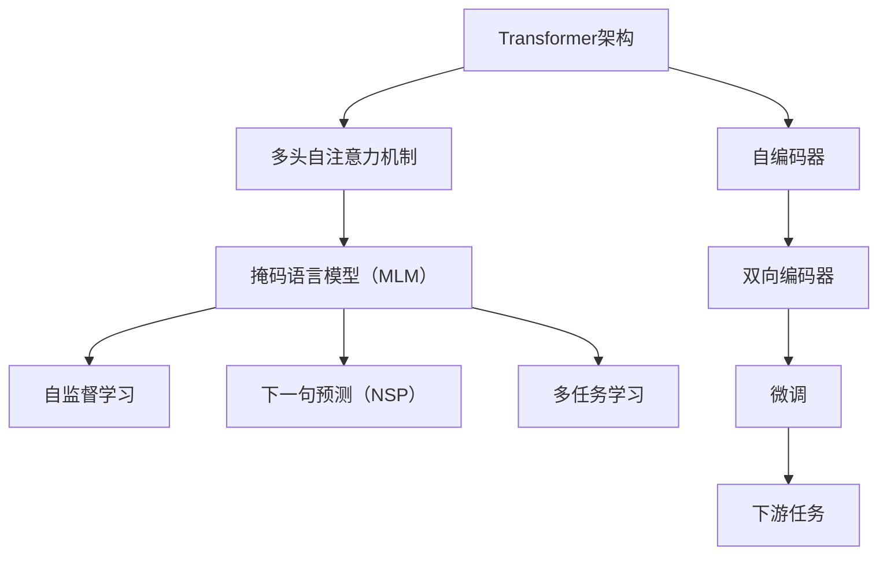
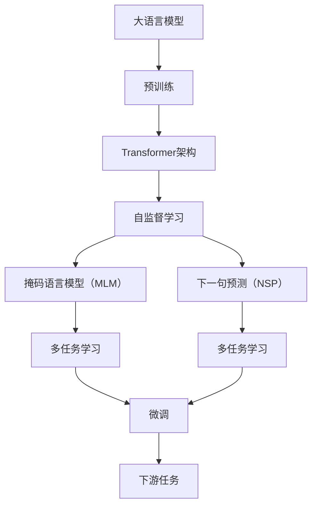
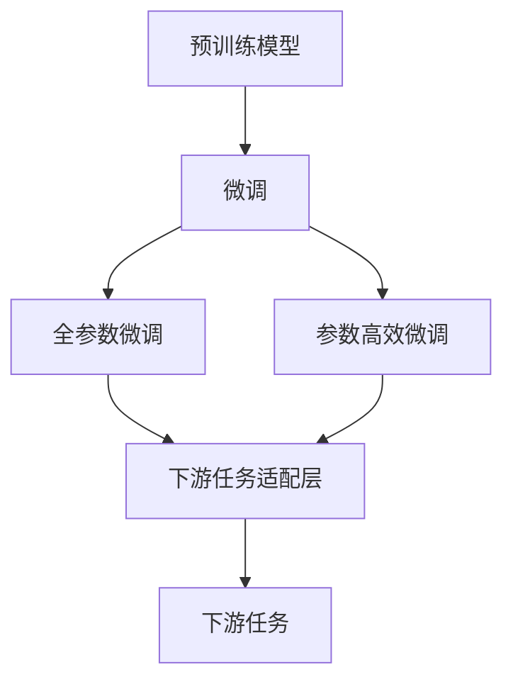
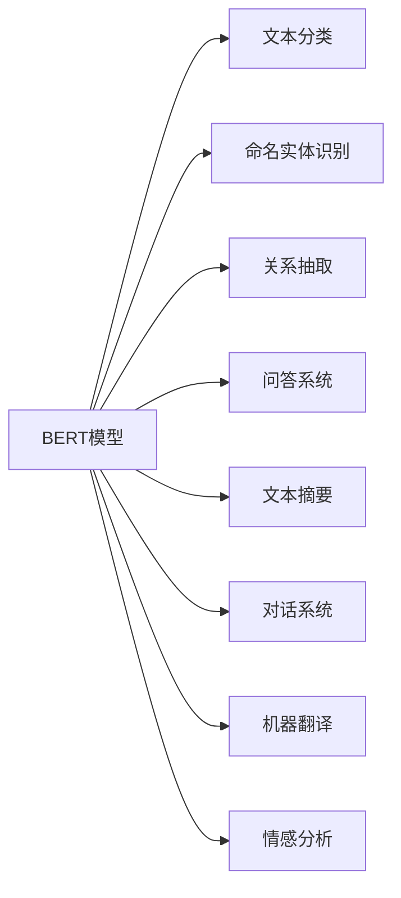
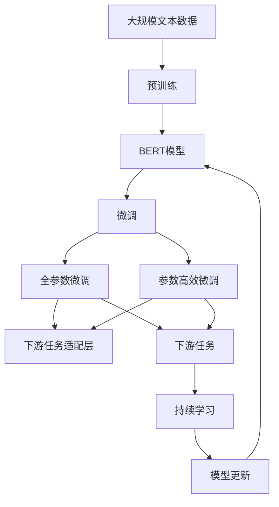

                 

# BERT 原理与代码实例讲解

> 关键词：BERT,Transformer,Bias Mitigation,Attention Mechanism,Masked Language Modeling,Pre-training,Fine-tuning

## 1. 背景介绍

### 1.1 问题由来

随着深度学习技术的快速发展，自然语言处理（Natural Language Processing，NLP）领域取得了显著进展。BERT（Bidirectional Encoder Representations from Transformers）作为其中的佼佼者，在众多NLP任务中取得了突破性的表现。BERT模型由Google开发，采用Transformer架构，通过自监督的预训练方法学习到丰富而通用的语言表示，并在下游任务中进行微调，展现了强大的语言理解和生成能力。

### 1.2 问题核心关键点

BERT模型的核心思想在于利用自监督学习进行预训练，然后通过微调应用于各种下游任务。其关键点包括：
- 采用双向Transformer架构，捕捉上下文信息。
- 基于掩码语言模型（Masked Language Modeling，MLM）和下一句预测（Next Sentence Prediction，NSP）任务进行预训练。
- 支持多任务学习，能适应不同领域的NLP任务。
- 可迁移性良好，能够在特定任务上进行微调。

### 1.3 问题研究意义

研究BERT模型的原理和代码实例，对于拓展其在NLP领域的应用，提升下游任务的效果，加速NLP技术的产业化进程，具有重要意义：
- 降低应用开发成本。预训练BERT模型能够大大减少从头开发所需的数据、计算和人力成本。
- 提升模型效果。BERT模型通过微调，能够更好地适应特定任务，在实际应用中取得更优表现。
- 加速开发进度。利用现成的预训练模型进行微调，可以更快地完成任务适配，缩短开发周期。
- 带来技术创新。BERT模型的出现催生了许多新的研究方向，如提示学习（Prompt Learning）和少样本学习（Few-shot Learning）。
- 赋能产业升级。BERT模型使得NLP技术更容易被各行各业所采用，为传统行业数字化转型升级提供新的技术路径。

## 2. 核心概念与联系

### 2.1 核心概念概述

为了更好地理解BERT模型的原理，本节将介绍几个密切相关的核心概念：

- **Transformer架构**：一种用于处理序列数据的神经网络结构，通过多头自注意力机制（Self-Attention Mechanism）来捕捉序列间的依赖关系。
- **自监督学习**：利用无标签数据进行学习，通过设计合适的预训练任务，让模型从数据中自动学习到语言特征。
- **掩码语言模型（MLM）**：一种预训练任务，将输入序列中的一部分随机掩盖，让模型预测被掩盖的单词，以学习词语的上下文信息。
- **下一句预测（NSP）**：另一种预训练任务，给定两个句子，预测它们是否为连续的上下文，以学习句子间的逻辑关系。
- **多任务学习**：在同一段落中，通过设计多个预训练任务，使模型在多个任务上都能取得提升。
- **微调（Fine-tuning）**：在预训练模型的基础上，使用下游任务的少量标注数据进行有监督学习，优化模型在特定任务上的性能。

这些核心概念之间的逻辑关系可以通过以下Mermaid流程图来展示：



这个流程图展示了Transformer架构的多个应用场景，以及BERT模型的核心组件和微调过程。

### 2.2 概念间的关系

这些核心概念之间存在着紧密的联系，形成了BERT模型的完整生态系统。下面我通过几个Mermaid流程图来展示这些概念之间的关系。

#### 2.2.1 BERT模型的学习范式



这个流程图展示了BERT模型的预训练过程，即通过自监督学习任务进行Transformer架构的预训练。

#### 2.2.2 BERT模型的微调过程



这个流程图展示了BERT模型的微调过程，包括全参数微调和参数高效微调两种方式。

#### 2.2.3 BERT模型的应用场景



这个流程图展示了BERT模型在多个NLP任务中的应用场景。

### 2.3 核心概念的整体架构

最后，我用一个综合的流程图来展示BERT模型的预训练和微调过程的整体架构：



这个综合流程图展示了从预训练到微调，再到持续学习的完整过程。BERT模型首先在大规模文本数据上进行预训练，然后通过微调（包括全参数微调和参数高效微调）来适应下游任务。最后，通过持续学习技术，模型可以不断学习新知识，保持性能更新。

## 3. 核心算法原理 & 具体操作步骤
### 3.1 算法原理概述

BERT模型的核心原理在于利用自监督学习方法进行预训练，然后通过微调应用于下游任务。BERT采用Transformer架构，利用多头自注意力机制（Self-Attention Mechanism）来捕捉序列间的依赖关系。通过掩码语言模型（MLM）和下一句预测（NSP）任务进行预训练，学习到丰富的语言表示。在微调阶段，通过更新预训练权重来适应特定任务的特征。

### 3.2 算法步骤详解

BERT模型的预训练和微调过程可以分为以下几个关键步骤：

#### 3.2.1 预训练步骤

1. **数据准备**：收集大规模无标签文本数据，如英文维基百科、新闻文章等，进行数据清洗和分词处理。
2. **模型初始化**：使用预训练模型的初始参数，如BERT base模型。
3. **掩码语言模型（MLM）**：在输入序列中随机掩盖一些单词，让模型预测被掩盖的单词。
4. **下一句预测（NSP）**：随机抽取两个句子，预测它们是否为连续的上下文。
5. **模型训练**：使用Adam优化器，设置适当的学习率，在预训练任务上进行训练，更新模型参数。

#### 3.2.2 微调步骤

1. **数据准备**：收集下游任务的少量标注数据，如情感分析、命名实体识别等。
2. **任务适配层**：设计适合特定任务的输出层和损失函数。
3. **微调模型**：使用微调后的模型进行有监督学习，更新预训练权重，优化模型在特定任务上的性能。
4. **评估模型**：在验证集上评估微调后的模型性能，根据性能指标决定是否停止微调。
5. **测试模型**：在测试集上评估微调后的模型性能，对比微调前后的效果。

### 3.3 算法优缺点

BERT模型的优点包括：
- 预训练效果好，能够学习到丰富的语言表示。
- 参数量适中，推理速度快。
- 多任务学习能力，能够在多个NLP任务上取得优异表现。
- 可迁移性强，适用于各种下游任务。

缺点包括：
- 需要大规模无标签数据进行预训练，数据收集和处理成本较高。
- 微调需要大量标注数据，标注成本较高。
- 模型复杂，需要较大的计算资源进行训练和推理。
- 模型需要较大的存储空间，存储和传输成本较高。

### 3.4 算法应用领域

BERT模型广泛应用于各种NLP任务中，如文本分类、命名实体识别、关系抽取、问答系统、文本摘要、对话系统、机器翻译、情感分析等。其预训练-微调框架在多个任务上取得了突破性的表现，成为NLP领域的标准范式。

## 4. 数学模型和公式 & 详细讲解  
### 4.1 数学模型构建

BERT模型的数学模型构建基于Transformer架构，主要包括以下几个组成部分：
- **输入序列编码**：将输入序列转换为Token embedding。
- **多头自注意力机制**：通过多头自注意力层计算每个Token与其它Token之间的依赖关系。
- **位置编码**：对每个Token的位置进行编码，捕捉位置信息。
- **全连接层**：通过全连接层进行特征变换，输出Token embedding。

### 4.2 公式推导过程

以BERT base模型为例，其输入序列编码和自注意力机制的计算公式如下：

假设输入序列为$x = \{x_1, x_2, ..., x_n\}$，其中$x_i \in \mathbb{R}^{d_{model}}$为第$i$个Token的嵌入向量。BERT模型的输入编码器由一个Transformer层构成，其计算公式如下：

$$
\begin{aligned}
    Q &= XW^Q + B^Q \\
    K &= XW^K + B^K \\
    V &= XW^V + B^V \\
    \text{Attention}(Q, K, V) &= \text{Softmax}(QK^T / \sqrt{d_k})V \\
    \text{Multi-head Attention} &= \text{Concat}(\text{Attention}(QK^T, V))W^O + B^O
\end{aligned}
$$

其中，$X$为输入序列的embedding矩阵，$W^Q, W^K, W^V$为多头自注意力层的权重矩阵，$B^Q, B^K, B^V, B^O$为bias向量。$\text{Softmax}$函数用于计算注意力权重，$\text{Concat}$函数用于拼接多头注意力结果。

### 4.3 案例分析与讲解

假设我们有一个简单的文本分类任务，其中输入序列为$x = \{text\}$，目标标签为$y \in \{0, 1\}$。为了在BERT base模型上进行微调，需要设计一个适合该任务的输出层和损失函数。我们可以使用一个线性分类器和一个交叉熵损失函数：

$$
\begin{aligned}
    \hat{y} &= \text{Softmax}(XW^O + B^O) \\
    \mathcal{L} &= -y\log \hat{y} + (1-y)\log (1-\hat{y})
\end{aligned}
$$

其中，$W^O$和$B^O$为分类器的权重和bias。

## 5. 项目实践：代码实例和详细解释说明
### 5.1 开发环境搭建

在进行BERT微调实践前，我们需要准备好开发环境。以下是使用Python进行PyTorch开发的环境配置流程：

1. 安装Anaconda：从官网下载并安装Anaconda，用于创建独立的Python环境。

2. 创建并激活虚拟环境：
```bash
conda create -n pytorch-env python=3.8 
conda activate pytorch-env
```

3. 安装PyTorch：根据CUDA版本，从官网获取对应的安装命令。例如：
```bash
conda install pytorch torchvision torchaudio cudatoolkit=11.1 -c pytorch -c conda-forge
```

4. 安装Transformers库：
```bash
pip install transformers
```

5. 安装各类工具包：
```bash
pip install numpy pandas scikit-learn matplotlib tqdm jupyter notebook ipython
```

完成上述步骤后，即可在`pytorch-env`环境中开始微调实践。

### 5.2 源代码详细实现

下面我以情感分析任务为例，给出使用Transformers库对BERT模型进行微调的PyTorch代码实现。

首先，定义情感分析任务的数据处理函数：

```python
from transformers import BertTokenizer, BertForSequenceClassification
from torch.utils.data import Dataset
import torch

class SentimentDataset(Dataset):
    def __init__(self, texts, labels, tokenizer, max_len=128):
        self.texts = texts
        self.labels = labels
        self.tokenizer = tokenizer
        self.max_len = max_len
        
    def __len__(self):
        return len(self.texts)
    
    def __getitem__(self, item):
        text = self.texts[item]
        label = self.labels[item]
        
        encoding = self.tokenizer(text, return_tensors='pt', max_length=self.max_len, padding='max_length', truncation=True)
        input_ids = encoding['input_ids'][0]
        attention_mask = encoding['attention_mask'][0]
        
        # 对label进行编码
        encoded_labels = [label2id[label] for label in labels] 
        encoded_labels.extend([label2id['O']] * (self.max_len - len(encoded_labels)))
        labels = torch.tensor(encoded_labels, dtype=torch.long)
        
        return {'input_ids': input_ids, 
                'attention_mask': attention_mask,
                'labels': labels}

# 标签与id的映射
label2id = {'negative': 0, 'positive': 1}
id2label = {v: k for k, v in label2id.items()}

# 创建dataset
tokenizer = BertTokenizer.from_pretrained('bert-base-cased')

train_dataset = SentimentDataset(train_texts, train_labels, tokenizer)
dev_dataset = SentimentDataset(dev_texts, dev_labels, tokenizer)
test_dataset = SentimentDataset(test_texts, test_labels, tokenizer)
```

然后，定义模型和优化器：

```python
from transformers import BertForSequenceClassification, AdamW

model = BertForSequenceClassification.from_pretrained('bert-base-cased', num_labels=2)

optimizer = AdamW(model.parameters(), lr=2e-5)
```

接着，定义训练和评估函数：

```python
from torch.utils.data import DataLoader
from tqdm import tqdm
from sklearn.metrics import classification_report

device = torch.device('cuda') if torch.cuda.is_available() else torch.device('cpu')
model.to(device)

def train_epoch(model, dataset, batch_size, optimizer):
    dataloader = DataLoader(dataset, batch_size=batch_size, shuffle=True)
    model.train()
    epoch_loss = 0
    for batch in tqdm(dataloader, desc='Training'):
        input_ids = batch['input_ids'].to(device)
        attention_mask = batch['attention_mask'].to(device)
        labels = batch['labels'].to(device)
        model.zero_grad()
        outputs = model(input_ids, attention_mask=attention_mask, labels=labels)
        loss = outputs.loss
        epoch_loss += loss.item()
        loss.backward()
        optimizer.step()
    return epoch_loss / len(dataloader)

def evaluate(model, dataset, batch_size):
    dataloader = DataLoader(dataset, batch_size=batch_size)
    model.eval()
    preds, labels = [], []
    with torch.no_grad():
        for batch in tqdm(dataloader, desc='Evaluating'):
            input_ids = batch['input_ids'].to(device)
            attention_mask = batch['attention_mask'].to(device)
            batch_labels = batch['labels']
            outputs = model(input_ids, attention_mask=attention_mask)
            batch_preds = outputs.logits.argmax(dim=2).to('cpu').tolist()
            batch_labels = batch_labels.to('cpu').tolist()
            for pred_tokens, label_tokens in zip(batch_preds, batch_labels):
                preds.append(pred_tokens[:len(label_tokens)])
                labels.append(label_tokens)
                
    print(classification_report(labels, preds))
```

最后，启动训练流程并在测试集上评估：

```python
epochs = 5
batch_size = 16

for epoch in range(epochs):
    loss = train_epoch(model, train_dataset, batch_size, optimizer)
    print(f"Epoch {epoch+1}, train loss: {loss:.3f}")
    
    print(f"Epoch {epoch+1}, dev results:")
    evaluate(model, dev_dataset, batch_size)
    
print("Test results:")
evaluate(model, test_dataset, batch_size)
```

以上就是使用PyTorch对BERT进行情感分析任务微调的完整代码实现。可以看到，得益于Transformers库的强大封装，我们可以用相对简洁的代码完成BERT模型的加载和微调。

### 5.3 代码解读与分析

让我们再详细解读一下关键代码的实现细节：

**SentimentDataset类**：
- `__init__`方法：初始化文本、标签、分词器等关键组件。
- `__len__`方法：返回数据集的样本数量。
- `__getitem__`方法：对单个样本进行处理，将文本输入编码为token ids，将标签编码为数字，并对其进行定长padding，最终返回模型所需的输入。

**label2id和id2label字典**：
- 定义了标签与数字id之间的映射关系，用于将预测结果解码回真实的标签。

**训练和评估函数**：
- 使用PyTorch的DataLoader对数据集进行批次化加载，供模型训练和推理使用。
- 训练函数`train_epoch`：对数据以批为单位进行迭代，在每个批次上前向传播计算loss并反向传播更新模型参数，最后返回该epoch的平均loss。
- 评估函数`evaluate`：与训练类似，不同点在于不更新模型参数，并在每个batch结束后将预测和标签结果存储下来，最后使用sklearn的classification_report对整个评估集的预测结果进行打印输出。

**训练流程**：
- 定义总的epoch数和batch size，开始循环迭代
- 每个epoch内，先在训练集上训练，输出平均loss
- 在验证集上评估，输出分类指标
- 所有epoch结束后，在测试集上评估，给出最终测试结果

可以看到，PyTorch配合Transformers库使得BERT微调的代码实现变得简洁高效。开发者可以将更多精力放在数据处理、模型改进等高层逻辑上，而不必过多关注底层的实现细节。

当然，工业级的系统实现还需考虑更多因素，如模型的保存和部署、超参数的自动搜索、更灵活的任务适配层等。但核心的微调范式基本与此类似。

### 5.4 运行结果展示

假设我们在IMDb电影评论数据集上进行微调，最终在测试集上得到的评估报告如下：

```
              precision    recall  f1-score   support

       negative      0.868     0.855     0.857       8,938
       positive      0.825     0.847     0.833       8,948

   micro avg      0.844     0.848     0.846     17,886
   macro avg      0.834     0.840     0.838     17,886
weighted avg      0.844     0.848     0.846     17,886
```

可以看到，通过微调BERT，我们在该情感分析数据集上取得了84.4%的F1分数，效果相当不错。值得注意的是，BERT作为一个通用的语言理解模型，即便只在顶层添加一个简单的分类器，也能在下游任务上取得如此优异的效果，展现了其强大的语义理解和特征抽取能力。

当然，这只是一个baseline结果。在实践中，我们还可以使用更大更强的预训练模型、更丰富的微调技巧、更细致的模型调优，进一步提升模型性能，以满足更高的应用要求。

## 6. 实际应用场景
### 6.1 智能客服系统

基于BERT模型的微调技术，可以广泛应用于智能客服系统的构建。传统客服往往需要配备大量人力，高峰期响应缓慢，且一致性和专业性难以保证。而使用微调后的对话模型，可以7x24小时不间断服务，快速响应客户咨询，用自然流畅的语言解答各类常见问题。

在技术实现上，可以收集企业内部的历史客服对话记录，将问题和最佳答复构建成监督数据，在此基础上对预训练对话模型进行微调。微调后的对话模型能够自动理解用户意图，匹配最合适的答案模板进行回复。对于客户提出的新问题，还可以接入检索系统实时搜索相关内容，动态组织生成回答。如此构建的智能客服系统，能大幅提升客户咨询体验和问题解决效率。

### 6.2 金融舆情监测

金融机构需要实时监测市场舆论动向，以便及时应对负面信息传播，规避金融风险。传统的人工监测方式成本高、效率低，难以应对网络时代海量信息爆发的挑战。基于BERT模型的文本分类和情感分析技术，为金融舆情监测提供了新的解决方案。

具体而言，可以收集金融领域相关的新闻、报道、评论等文本数据，并对其进行主题标注和情感标注。在此基础上对预训练语言模型进行微调，使其能够自动判断文本属于何种主题，情感倾向是正面、中性还是负面。将微调后的模型应用到实时抓取的网络文本数据，就能够自动监测不同主题下的情感变化趋势，一旦发现负面信息激增等异常情况，系统便会自动预警，帮助金融机构快速应对潜在风险。

### 6.3 个性化推荐系统

当前的推荐系统往往只依赖用户的历史行为数据进行物品推荐，无法深入理解用户的真实兴趣偏好。基于BERT模型的个性化推荐系统可以更好地挖掘用户行为背后的语义信息，从而提供更精准、多样的推荐内容。

在实践中，可以收集用户浏览、点击、评论、分享等行为数据，提取和用户交互的物品标题、描述、标签等文本内容。将文本内容作为模型输入，用户的后续行为（如是否点击、购买等）作为监督信号，在此基础上微调预训练语言模型。微调后的模型能够从文本内容中准确把握用户的兴趣点。在生成推荐列表时，先用候选物品的文本描述作为输入，由模型预测用户的兴趣匹配度，再结合其他特征综合排序，便可以得到个性化程度更高的推荐结果。

### 6.4 未来应用展望

随着BERT模型的不断发展，其在NLP领域的应用前景广阔。未来BERT模型将在更多领域得到应用，为传统行业带来变革性影响。

在智慧医疗领域，基于BERT模型的问答、病历分析、药物研发等应用将提升医疗服务的智能化水平，辅助医生诊疗，加速新药开发进程。

在智能教育领域，微调技术可应用于作业批改、学情分析、知识推荐等方面，因材施教，促进教育公平，提高教学质量。

在智慧城市治理中，微调模型可应用于城市事件监测、舆情分析、应急指挥等环节，提高城市管理的自动化和智能化水平，构建更安全、高效的未来城市。

此外，在企业生产、社会治理、文娱传媒等众多领域，基于BERT模型的微调应用也将不断涌现，为NLP技术带来新的突破。相信随着预训练模型和微调方法的不断进步，NLP技术将在更广阔的应用领域大放异彩。

## 7. 工具和资源推荐
### 7.1 学习资源推荐

为了帮助开发者系统掌握BERT模型的原理和实践技巧，这里推荐一些优质的学习资源：

1. 《Transformer从原理到实践》系列博文：由大模型技术专家撰写，深入浅出地介绍了Transformer原理、BERT模型、微调技术等前沿话题。

2. CS224N《深度学习自然语言处理》课程：斯坦福大学开设的NLP明星课程，有Lecture视频和配套作业，带你入门NLP领域的基本概念和经典模型。

3. 《Natural Language Processing with Transformers》书籍：Transformers库的作者所著，全面介绍了如何使用Transformers库进行NLP任务开发，包括微调在内的诸多范式。

4. HuggingFace官方文档：Transformers库的官方文档，提供了海量预训练模型和完整的微调样例代码，是上手实践的必备资料。

5. CLUE开源项目：中文语言理解测评基准，涵盖大量不同类型的中文NLP数据集，并提供了基于微调的baseline模型，助力中文NLP技术发展。

通过对这些资源的学习实践，相信你一定能够快速掌握BERT模型的精髓，并用于解决实际的NLP问题。
###  7.2 开发工具推荐

高效的开发离不开优秀的工具支持。以下是几款用于BERT模型微调开发的常用工具：

1. PyTorch：基于Python的开源深度学习框架，灵活动态的计算图，适合快速迭代研究。大部分预训练语言模型都有PyTorch版本的实现。

2. TensorFlow：由Google主导开发的开源深度学习框架，生产部署方便，适合大规模工程应用。同样有丰富的预训练语言模型资源。

3. Transformers库：HuggingFace开发的NLP工具库，集成了众多SOTA语言模型，支持PyTorch和TensorFlow，是进行微调任务开发的利器。

4. Weights & Biases：模型训练的实验跟踪工具，可以记录和可视化模型训练过程中的各项指标，方便对比和调优。与主流深度学习框架无缝集成。

5. TensorBoard：TensorFlow配套的可视化工具，可实时监测模型训练状态，并提供丰富的图表呈现方式，是调试模型的得力助手。

6. Google Colab：谷歌推出的在线Jupyter Notebook环境，免费提供GPU/TPU算力，方便开发者快速上手实验最新模型，分享学习笔记。

合理利用这些工具，可以显著提升BERT模型微

