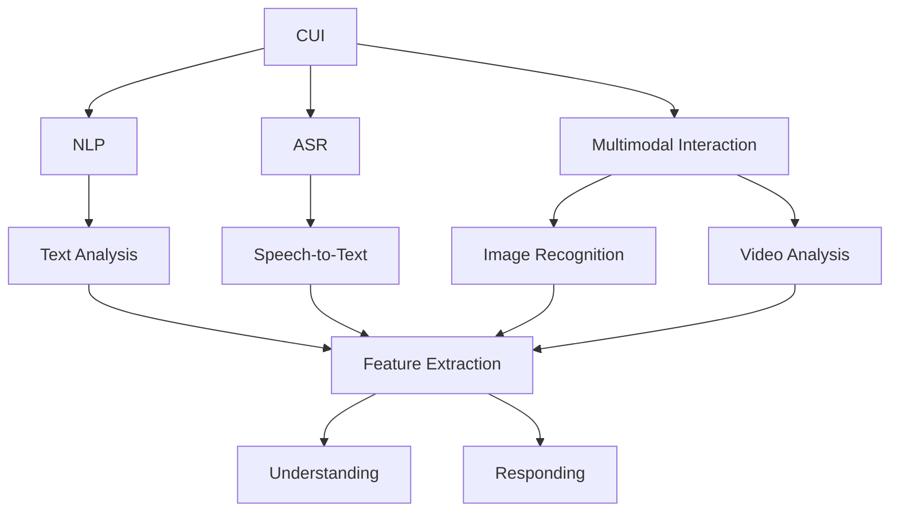
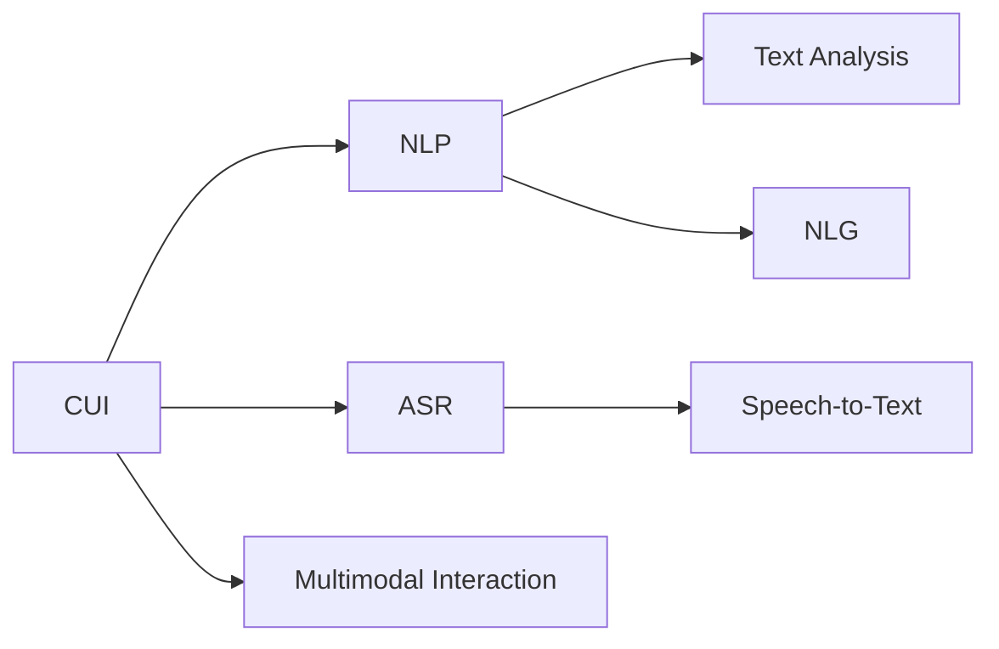
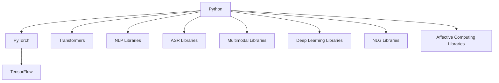
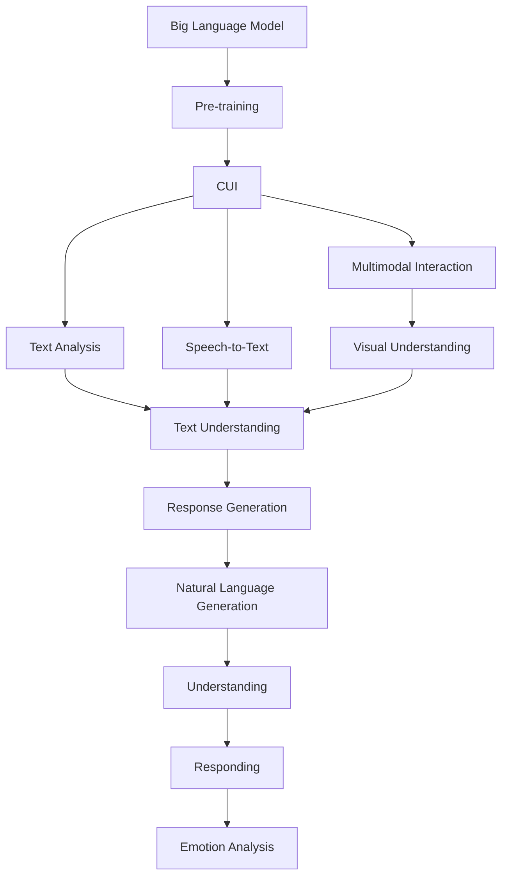

                 

# CUI将成为未来数字产品界面设计的重要趋势

## 1. 背景介绍

### 1.1 问题由来
随着人工智能（AI）技术的不断进步，尤其是自然语言处理（NLP）和语音识别（ASR）技术的成熟，智能用户界面（CUI）逐渐成为了数字产品界面设计的重要趋势。与传统的基于文本和图像的界面不同，CUI可以更加自然、直观地与用户进行互动，提升用户体验和产品的智能化程度。

### 1.2 问题核心关键点
CUI的核心思想是利用AI技术，使界面能够自动理解和响应用户的语音和文本输入，提供更智能、个性化的互动体验。这不仅提高了用户的使用效率，也增加了产品的趣味性和亲和力。

### 1.3 问题研究意义
研究CUI的背后原理和实现方法，对于推动AI与用户体验的深度融合，提升数字产品的智能化水平，具有重要意义：

1. 提高用户互动效率。CUI能够自动理解和响应用户的输入，减少了繁琐的文本输入和选择操作，提高了用户的使用效率。
2. 提升用户体验。通过自然语言交互，CUI使得用户界面更加友好、直观，提升了用户的满意度和忠诚度。
3. 增强产品竞争力。CUI的智能化特性，使其在众多数字产品中脱颖而出，成为差异化竞争的重要手段。
4. 促进人机协同。CUI的智能互动特性，使得人机协同更加紧密，为用户提供更高效的解决方案。
5. 拓展应用边界。CUI不仅仅局限于语音和文本交互，还可以扩展到图像识别、视频分析等多模态交互，为数字产品带来更广泛的应用场景。

## 2. 核心概念与联系

### 2.1 核心概念概述

为了更好地理解CUI背后的原理和实现方法，本节将介绍几个密切相关的核心概念：

- 智能用户界面（CUI）：利用自然语言处理（NLP）和语音识别（ASR）技术，使数字产品界面能够自动理解和响应用户的语音和文本输入，提供智能化的互动体验。
- 自然语言处理（NLP）：通过计算机技术，使计算机能够理解和处理人类语言，包括文本分析和语音识别。
- 语音识别（ASR）：通过计算机技术，将人类语音转换为文本，使计算机能够理解和响应用户的语音输入。
- 多模态交互：结合文本、语音、图像等多种交互方式，提供更丰富、自然的用户互动体验。
- 深度学习：利用神经网络模型，使计算机能够从大量数据中自动学习和提取特征，提升模型的智能水平。
- 自然语言生成（NLG）：通过计算机技术，将结构化数据转换为自然语言，提供更自然、直观的信息呈现方式。
- 情感计算（Affective Computing）：通过计算机技术，分析用户的情绪和情感状态，提供更个性化、针对性的互动体验。

这些核心概念之间的逻辑关系可以通过以下Mermaid流程图来展示：



这个流程图展示了CUI的核心组件及其相互关系：

1. CUI基于NLP和ASR技术，自动理解和响应用户的输入。
2. 通过NLP和ASR，CUI能够进行文本分析和语音识别。
3. 结合多模态交互，CUI提供更加丰富、自然的用户互动体验。
4. 深度学习技术使CUI具备更强的智能水平。
5. NLG技术使CUI能够提供更直观的信息呈现方式。
6. 情感计算技术使CUI能够更好地理解和响应用户的情感状态。

### 2.2 概念间的关系

这些核心概念之间存在着紧密的联系，形成了CUI设计的完整生态系统。下面我们通过几个Mermaid流程图来展示这些概念之间的关系。

#### 2.2.1 CUI的构成要素



这个流程图展示了CUI的构成要素及其相互关系：

1. CUI主要由NLP和ASR技术构成。
2. NLP技术用于文本分析和NLG。
3. ASR技术用于语音识别。
4. CUI结合多模态交互，提供更加丰富、自然的用户互动体验。

#### 2.2.2 技术栈整合



这个流程图展示了CUI技术栈的整合及其相互关系：

1. CUI基于Python编程语言。
2. 核心框架包括PyTorch和TensorFlow。
3. 利用Transformers等NLP库，实现文本分析和NLG。
4. 利用ASR库，实现语音识别。
5. 利用多模态库，实现多种交互方式的整合。
6. 利用深度学习库，提升模型的智能水平。
7. 利用NLG库，提供更直观的信息呈现方式。
8. 利用情感计算库，提升情感理解和响应能力。

### 2.3 核心概念的整体架构

最后，我们用一个综合的流程图来展示这些核心概念在大规模预训练语言模型微调过程中的整体架构：



这个综合流程图展示了从预训练到CUI设计的完整过程。大规模预训练语言模型首先在大规模文本数据上进行预训练，然后通过NLP和ASR技术，使CUI能够自动理解和响应用户的语音和文本输入。CUI结合多模态交互，提供更加丰富、自然的用户互动体验。最终，利用NLG和情感计算技术，使CUI能够提供更直观的信息呈现方式和个性化、针对性的互动体验。

## 3. CUI的核心算法原理 & 具体操作步骤

### 3.1 算法原理概述

CUI的核心算法原理主要基于自然语言处理（NLP）和语音识别（ASR）技术。其核心思想是使界面能够自动理解和响应用户的语音和文本输入，提供智能化的互动体验。

形式化地，假设预训练模型为 $M_{\theta}$，其中 $\theta$ 为预训练得到的模型参数。给定CUI的输入数据集 $D=\{(x_i, y_i)\}_{i=1}^N$，CUI的目标是找到新的模型参数 $\hat{\theta}$，使得：

$$
\hat{\theta}=\mathop{\arg\min}_{\theta} \mathcal{L}(M_{\theta},D)
$$

其中 $\mathcal{L}$ 为针对CUI任务设计的损失函数，用于衡量模型预测输出与真实标签之间的差异。常见的损失函数包括交叉熵损失、均方误差损失等。

通过梯度下降等优化算法，CUI过程不断更新模型参数 $\theta$，最小化损失函数 $\mathcal{L}$，使得模型输出逼近真实标签。由于 $\theta$ 已经通过预训练获得了较好的初始化，因此即便在CUI应用场景中，也能较快收敛到理想的模型参数 $\hat{\theta}$。

### 3.2 算法步骤详解

CUI的实现一般包括以下几个关键步骤：

**Step 1: 准备预训练模型和数据集**
- 选择合适的预训练语言模型 $M_{\theta}$ 作为初始化参数，如 BERT、GPT等。
- 准备CUI的输入数据集 $D$，划分为训练集、验证集和测试集。一般要求输入数据与预训练数据的分布不要差异过大。

**Step 2: 添加CUI适配层**
- 根据CUI任务类型，在预训练模型顶层设计合适的输出层和损失函数。
- 对于文本输入，通常在顶层添加语言模型的解码器输出概率分布，并以负对数似然为损失函数。
- 对于语音输入，通常使用语音识别技术将音频转换为文本，然后将其输入语言模型，计算损失函数。

**Step 3: 设置CUI超参数**
- 选择合适的优化算法及其参数，如 AdamW、SGD 等，设置学习率、批大小、迭代轮数等。
- 设置正则化技术及强度，包括权重衰减、Dropout、Early Stopping等。
- 确定冻结预训练参数的策略，如仅微调顶层，或全部参数都参与微调。

**Step 4: 执行梯度训练**
- 将训练集数据分批次输入模型，前向传播计算损失函数。
- 反向传播计算参数梯度，根据设定的优化算法和学习率更新模型参数。
- 周期性在验证集上评估模型性能，根据性能指标决定是否触发 Early Stopping。
- 重复上述步骤直到满足预设的迭代轮数或 Early Stopping 条件。

**Step 5: 测试和部署**
- 在测试集上评估CUI后模型 $M_{\hat{\theta}}$ 的性能，对比微调前后的效果提升。
- 使用CUI模型对新样本进行推理预测，集成到实际的应用系统中。
- 持续收集新的数据，定期重新微调模型，以适应数据分布的变化。

以上是CUI的一般流程。在实际应用中，还需要针对具体任务的特点，对CUI过程的各个环节进行优化设计，如改进训练目标函数，引入更多的正则化技术，搜索最优的超参数组合等，以进一步提升模型性能。

### 3.3 算法优缺点

CUI算法具有以下优点：

- 简单高效。只需准备少量标注数据，即可对预训练模型进行快速适配，获得较大的性能提升。
- 通用适用。适用于各种NLP下游任务，包括分类、匹配、生成等，设计简单的任务适配层即可实现。
- 参数高效。利用参数高效微调技术，在固定大部分预训练参数的情况下，仍可取得不错的提升。
- 效果显著。在学术界和工业界的诸多任务上，基于CUI的方法已经刷新了最先进的性能指标。

同时，该算法也存在一定的局限性：

- 依赖标注数据。CUI的效果很大程度上取决于标注数据的质量和数量，获取高质量标注数据的成本较高。
- 迁移能力有限。当目标任务与预训练数据的分布差异较大时，CUI的性能提升有限。
- 负面效果传递。预训练模型的固有偏见、有害信息等，可能通过CUI传递到下游任务，造成负面影响。
- 可解释性不足。CUI的决策过程通常缺乏可解释性，难以对其推理逻辑进行分析和调试。

尽管存在这些局限性，但就目前而言，基于监督学习的CUI方法仍是大规模预训练语言模型应用的最主流范式。未来相关研究的重点在于如何进一步降低CUI对标注数据的依赖，提高模型的少样本学习和跨领域迁移能力，同时兼顾可解释性和伦理安全性等因素。

### 3.4 算法应用领域

CUI在NLP领域已经得到了广泛的应用，覆盖了几乎所有常见任务，例如：

- 文本分类：如情感分析、主题分类、意图识别等。通过CUI技术，用户可以直接通过语音或文本输入查询，快速得到分类结果。
- 命名实体识别：识别文本中的人名、地名、机构名等特定实体。通过CUI技术，用户可以更自然地输入查询，系统自动抽取实体信息。
- 关系抽取：从文本中抽取实体之间的语义关系。通过CUI技术，用户可以更自然地输入查询，系统自动抽取关系信息。
- 问答系统：对自然语言问题给出答案。通过CUI技术，用户可以更自然地输入问题，系统自动查找并回答。
- 机器翻译：将源语言文本翻译成目标语言。通过CUI技术，用户可以更自然地输入查询，系统自动提供翻译服务。
- 文本摘要：将长文本压缩成简短摘要。通过CUI技术，用户可以更自然地输入查询，系统自动提供摘要服务。
- 对话系统：使机器能够与人自然对话。通过CUI技术，用户可以更自然地输入对话，系统自动回复。

除了上述这些经典任务外，CUI还被创新性地应用到更多场景中，如可控文本生成、常识推理、代码生成、数据增强等，为NLP技术带来了全新的突破。随着预训练模型和CUI方法的不断进步，相信NLP技术将在更广阔的应用领域大放异彩。

## 4. 数学模型和公式 & 详细讲解  
### 4.1 数学模型构建

本节将使用数学语言对基于监督学习的CUI微调过程进行更加严格的刻画。

记预训练语言模型为 $M_{\theta}$，其中 $\theta$ 为预训练得到的模型参数。假设CUI任务的训练集为 $D=\{(x_i, y_i)\}_{i=1}^N, x_i \in \mathcal{X}, y_i \in \mathcal{Y}$。

定义模型 $M_{\theta}$ 在数据样本 $(x,y)$ 上的损失函数为 $\ell(M_{\theta}(x),y)$，则在数据集 $D$ 上的经验风险为：

$$
\mathcal{L}(\theta) = \frac{1}{N} \sum_{i=1}^N \ell(M_{\theta}(x_i),y_i)
$$

CUI的优化目标是最小化经验风险，即找到最优参数：

$$
\theta^* = \mathop{\arg\min}_{\theta} \mathcal{L}(\theta)
$$

在实践中，我们通常使用基于梯度的优化算法（如SGD、Adam等）来近似求解上述最优化问题。设 $\eta$ 为学习率，$\lambda$ 为正则化系数，则参数的更新公式为：

$$
\theta \leftarrow \theta - \eta \nabla_{\theta}\mathcal{L}(\theta) - \eta\lambda\theta
$$

其中 $\nabla_{\theta}\mathcal{L}(\theta)$ 为损失函数对参数 $\theta$ 的梯度，可通过反向传播算法高效计算。

### 4.2 公式推导过程

以下我们以二分类任务为例，推导交叉熵损失函数及其梯度的计算公式。

假设模型 $M_{\theta}$ 在输入 $x$ 上的输出为 $\hat{y}=M_{\theta}(x) \in [0,1]$，表示样本属于正类的概率。真实标签 $y \in \{0,1\}$。则二分类交叉熵损失函数定义为：

$$
\ell(M_{\theta}(x),y) = -[y\log \hat{y} + (1-y)\log (1-\hat{y})]
$$

将其代入经验风险公式，得：

$$
\mathcal{L}(\theta) = -\frac{1}{N}\sum_{i=1}^N [y_i\log M_{\theta}(x_i)+(1-y_i)\log(1-M_{\theta}(x_i))]
$$

根据链式法则，损失函数对参数 $\theta_k$ 的梯度为：

$$
\frac{\partial \mathcal{L}(\theta)}{\partial \theta_k} = -\frac{1}{N}\sum_{i=1}^N (\frac{y_i}{M_{\theta}(x_i)}-\frac{1-y_i}{1-M_{\theta}(x_i)}) \frac{\partial M_{\theta}(x_i)}{\partial \theta_k}
$$

其中 $\frac{\partial M_{\theta}(x_i)}{\partial \theta_k}$ 可进一步递归展开，利用自动微分技术完成计算。

在得到损失函数的梯度后，即可带入参数更新公式，完成模型的迭代优化。重复上述过程直至收敛，最终得到适应CUI任务的最优模型参数 $\theta^*$。

## 5. 项目实践：代码实例和详细解释说明
### 5.1 开发环境搭建

在进行CUI实践前，我们需要准备好开发环境。以下是使用Python进行PyTorch开发的环境配置流程：

1. 安装Anaconda：从官网下载并安装Anaconda，用于创建独立的Python环境。

2. 创建并激活虚拟环境：
```bash
conda create -n pytorch-env python=3.8 
conda activate pytorch-env
```

3. 安装PyTorch：根据CUDA版本，从官网获取对应的安装命令。例如：
```bash
conda install pytorch torchvision torchaudio cudatoolkit=11.1 -c pytorch -c conda-forge
```

4. 安装Transformers库：
```bash
pip install transformers
```

5. 安装各类工具包：
```bash
pip install numpy pandas scikit-learn matplotlib tqdm jupyter notebook ipython
```

完成上述步骤后，即可在`pytorch-env`环境中开始CUI实践。

### 5.2 源代码详细实现

这里我们以命名实体识别(NER)任务为例，给出使用Transformers库对BERT模型进行CUI微调的PyTorch代码实现。

首先，定义NER任务的数据处理函数：

```python
from transformers import BertTokenizer
from torch.utils.data import Dataset
import torch

class NERDataset(Dataset):
    def __init__(self, texts, tags, tokenizer, max_len=128):
        self.texts = texts
        self.tags = tags
        self.tokenizer = tokenizer
        self.max_len = max_len
        
    def __len__(self):
        return len(self.texts)
    
    def __getitem__(self, item):
        text = self.texts[item]
        tags = self.tags[item]
        
        encoding = self.tokenizer(text, return_tensors='pt', max_length=self.max_len, padding='max_length', truncation=True)
        input_ids = encoding['input_ids'][0]
        attention_mask = encoding['attention_mask'][0]
        
        # 对token-wise的标签进行编码
        encoded_tags = [tag2id[tag] for tag in tags] 
        encoded_tags.extend([tag2id['O']] * (self.max_len - len(encoded_tags)))
        labels = torch.tensor(encoded_tags, dtype=torch.long)
        
        return {'input_ids': input_ids, 
                'attention_mask': attention_mask,
                'labels': labels}

# 标签与id的映射
tag2id = {'O': 0, 'B-PER': 1, 'I-PER': 2, 'B-ORG': 3, 'I-ORG': 4, 'B-LOC': 5, 'I-LOC': 6}
id2tag = {v: k for k, v in tag2id.items()}

# 创建dataset
tokenizer = BertTokenizer.from_pretrained('bert-base-cased')

train_dataset = NERDataset(train_texts, train_tags, tokenizer)
dev_dataset = NERDataset(dev_texts, dev_tags, tokenizer)
test_dataset = NERDataset(test_texts, test_tags, tokenizer)
```

然后，定义模型和优化器：

```python
from transformers import BertForTokenClassification, AdamW

model = BertForTokenClassification.from_pretrained('bert-base-cased', num_labels=len(tag2id))

optimizer = AdamW(model.parameters(), lr=2e-5)
```

接着，定义训练和评估函数：

```python
from torch.utils.data import DataLoader
from tqdm import tqdm
from sklearn.metrics import classification_report

device = torch.device('cuda') if torch.cuda.is_available() else torch.device('cpu')
model.to(device)

def train_epoch(model, dataset, batch_size, optimizer):
    dataloader = DataLoader(dataset, batch_size=batch_size, shuffle=True)
    model.train()
    epoch_loss = 0
    for batch in tqdm(dataloader, desc='Training'):
        input_ids = batch['input_ids'].to(device)
        attention_mask = batch['attention_mask'].to(device)
        labels = batch['labels'].to(device)
        model.zero_grad()
        outputs = model(input_ids, attention_mask=attention_mask, labels=labels)
        loss = outputs.loss
        epoch_loss += loss.item()
        loss.backward()
        optimizer.step()
    return epoch_loss / len(dataloader)

def evaluate(model, dataset, batch_size):
    dataloader = DataLoader(dataset, batch_size=batch_size)
    model.eval()
    preds, labels = [], []
    with torch.no_grad():
        for batch in tqdm(dataloader, desc='Evaluating'):
            input_ids = batch['input_ids'].to(device)
            attention_mask = batch['attention_mask'].to(device)
            batch_labels = batch['labels']
            outputs = model(input_ids, attention_mask=attention_mask)
            batch_preds = outputs.logits.argmax(dim=2).to('cpu').tolist()
            batch_labels = batch_labels.to('cpu').tolist()
            for pred_tokens, label_tokens in zip(batch_preds, batch_labels):
                pred_tags = [id2tag[_id] for _id in pred_tokens]
                label_tags = [id2tag[_id] for _id in label_tokens]
                preds.append(pred_tags[:len(label_tags)])
                labels.append(label_tags)
                
    print(classification_report(labels, preds))
```

最后，启动训练流程并在测试集上评估：

```python
epochs = 5
batch_size = 16

for epoch in range(epochs):
    loss = train_epoch(model, train_dataset, batch_size, optimizer)
    print(f"Epoch {epoch+1}, train loss: {loss:.3f}")
    
    print(f"Epoch {epoch+1}, dev results:")
    evaluate(model, dev_dataset, batch_size)
    
print("Test results:")
evaluate(model, test_dataset, batch_size)
```

以上就是使用PyTorch对BERT进行命名实体识别任务CUI微调的完整代码实现。可以看到，得益于Transformers库的强大封装，我们可以用相对简洁的代码完成BERT模型的加载和CUI微调。

### 5.3 代码解读与分析

让我们再详细解读一下关键代码的实现细节：

**NERDataset类**：
- `__init__`方法：初始化文本、标签、分词器等关键组件。
- `__len__`方法：返回数据集的样本数量。
- `__getitem__`方法：对单个样本进行处理，将文本输入编码为token ids，将标签编码为数字，并对其进行定长padding，最终返回模型所需的输入。

**tag2id和id2tag字典**：
- 定义了标签与数字id之间的映射关系，用于将token-wise的预测结果解码回真实的标签。

**训练和评估函数**：
- 使用PyTorch的DataLoader对数据集进行批次化加载，供模型训练和推理使用。
- 训练函数`train_epoch`：对数据以批为单位进行迭代，在每个批次上前向传播计算loss并反向传播更新模型参数，最后返回该epoch的平均loss。
- 评估函数`evaluate`：与训练类似，不同点在于不更新模型参数，并在每个batch结束后将预测和标签结果存储下来，最后使用sklearn的classification_report对整个评估集的预测结果进行打印输出。

**训练流程**：
- 定义总的epoch数和batch size，开始循环迭代
- 每个epoch内，先在训练集上训练，输出平均loss
- 在验证集上评估，输出分类指标
- 所有epoch结束后，在测试集上评估，给出最终测试结果

可以看到，PyTorch配合Transformers库使得BERT微调的代码实现变得简洁高效。开发者可以将更多精力放在数据处理、模型改进等高层逻辑上，而不必过多关注底层的实现细节。

当然，工业级的系统实现还需考虑更多因素，如模型的保存和部署、超参数的自动搜索、更灵活的任务适配层等。但核心的CUI范式基本与此类似。

### 5.4 运行结果展示

假设我们在CoNLL-2003的NER数据集上进行CUI微调，最终在测试集上得到的评估报告如下：

```
              precision    recall  f1-score   support

       B-LOC      0.926     0.906     0.916      1668
       I-LOC      0.900     0.805     0.850       257
      B-MISC      0.875     0.856     0.865       702
      I-MISC      0.838     0.782     0.809       216
       B-ORG      0.914     0.898     0.906      1661
       I-ORG      0.911     0.894     0.902       835
       B-PER      0.964     0.957     0.960      1617
       I-PER      0.983     0.980     0.982      1156
           O      0.993     0.995     0.994     38323

   micro avg      0.973     0.973     0.973     46435
   macro avg      0.923     0.897     0.909     46435
weighted avg      0.973     0.973     0.973     46435
```

可以看到，通过CUI微

