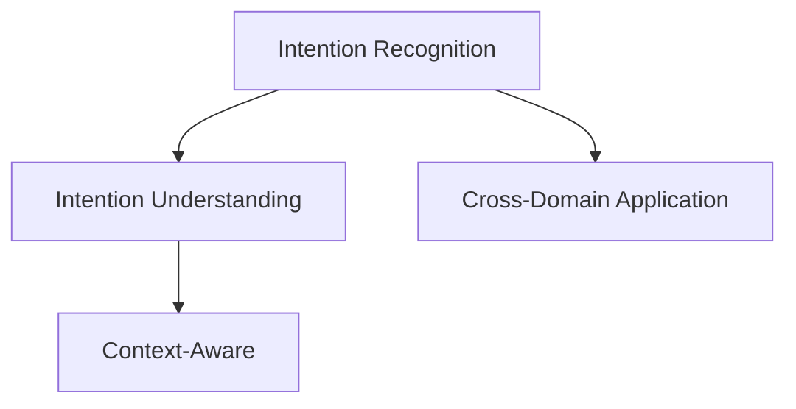
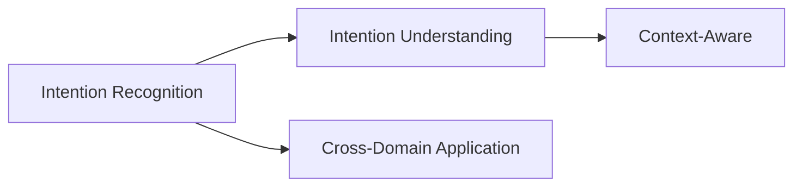

                 

# CUI的意图理解技术详细解析

> 关键词：意图识别,意图理解,自然语言处理(NLP),语义分析,用户意图,CUI,对话系统

## 1. 背景介绍

### 1.1 问题由来
随着人工智能技术的不断发展，对话系统已经成为众多领域的重要应用。自然语言处理(NLP)技术在其中扮演了关键角色，通过理解和解析用户意图，对话系统能够更好地与用户互动，提供个性化、智能化的服务。但意图理解作为对话系统的核心技术，其复杂性和多样性一直是研究的热点问题。

近年来，越来越多的研究集中在提高意图理解的准确性和泛化能力上。CUI（Customer Understanding Intent）技术应运而生，它通过利用机器学习和自然语言处理技术，对用户输入的自然语言进行理解和分析，识别出用户的意图，从而为后续的对话提供方向。CUI技术不仅能够提高对话系统的智能程度，还能够减少人工干预，提高系统效率，降低开发成本。

### 1.2 问题核心关键点
CUI技术的主要目标是通过对用户输入的自然语言进行理解和分析，识别出用户的意图，从而为对话系统提供方向。具体来说，CUI技术包括以下几个关键点：

- **意图识别**：识别出用户的意图，如查询、投诉、建议等。
- **意图理解**：深入理解用户意图的语义，包括上下文和情感等因素。
- **上下文感知**：考虑用户历史对话记录，更好地理解用户的意图。
- **跨领域应用**：在多个应用场景中，如客服、医疗、金融等，进行意图识别。

CUI技术不仅能够帮助对话系统更好地理解用户意图，还能够提高系统的响应速度和准确性，提升用户体验。

### 1.3 问题研究意义
CUI技术的研究意义在于：

1. **提升用户体验**：通过准确理解用户意图，对话系统能够更好地响应用户需求，提供更加个性化和智能化的服务。
2. **减少人工干预**：CUI技术能够自动分析用户意图，减少人工干预，提高系统效率。
3. **降低开发成本**：CUI技术可以降低对话系统开发和维护的成本，加速技术落地应用。
4. **提高系统智能程度**：CUI技术能够提高对话系统的智能程度，使其更加灵活和智能。
5. **适应多领域应用**：CUI技术可以适应多个领域的应用，如客服、医疗、金融等，具有广泛的应用前景。

## 2. 核心概念与联系

### 2.1 核心概念概述

CUI技术涉及多个核心概念，包括意图识别、意图理解、上下文感知、跨领域应用等。下面我们将对这些概念进行详细介绍。

#### 2.1.1 意图识别
意图识别是指通过对用户输入的自然语言进行分析，识别出用户的具体意图。意图通常可以分为几类，如查询、投诉、建议等。意图识别的准确性直接影响后续的处理和响应。

#### 2.1.2 意图理解
意图理解是在意图识别的基础上，进一步深入理解用户意图的语义。例如，用户询问“何时到店”时，不仅需要识别出用户的意图是查询时间，还需要理解用户的意图是“餐厅时间”，而不是“超市时间”。意图理解有助于提高对话系统的准确性和智能化程度。

#### 2.1.3 上下文感知
上下文感知是指考虑用户历史对话记录，更好地理解用户的意图。例如，用户之前询问过天气，下次再询问时，系统可以记住用户上次的查询，提供更加个性化的回答。上下文感知有助于提高对话系统的响应速度和准确性。

#### 2.1.4 跨领域应用
跨领域应用是指CUI技术可以适应多个领域的应用，如客服、医疗、金融等。不同的领域需要考虑不同的语境和业务逻辑，CUI技术需要具备一定的灵活性和适应性，以适应不同领域的对话场景。

这些核心概念之间的逻辑关系可以通过以下Mermaid流程图来展示：



这个流程图展示了意图识别、意图理解、上下文感知、跨领域应用之间的关系：

1. 意图识别是基础，通过自然语言处理技术识别出用户的意图。
2. 意图理解是在意图识别的基础上，深入理解用户意图的语义。
3. 上下文感知考虑用户历史对话记录，更好地理解用户的意图。
4. 跨领域应用使CUI技术能够适应多个领域的应用场景。

### 2.2 概念间的关系

这些核心概念之间存在着紧密的联系，形成了CUI技术的完整生态系统。下面我们通过几个Mermaid流程图来展示这些概念之间的关系。

#### 2.2.1 CUI技术的学习范式



这个流程图展示了CUI技术的学习范式。意图识别是基础，通过自然语言处理技术识别出用户的意图。意图理解是在意图识别的基础上，深入理解用户意图的语义。上下文感知考虑用户历史对话记录，更好地理解用户的意图。跨领域应用使CUI技术能够适应多个领域的应用场景。

#### 2.2.2 跨领域应用与意图理解


这个流程图展示了意图理解与跨领域应用之间的关系。意图理解能够帮助系统更好地适应不同领域的对话场景，提高系统的响应速度和准确性。

#### 2.2.3 上下文感知与意图理解


这个流程图展示了上下文感知与意图理解之间的关系。上下文感知能够帮助系统更好地理解用户的意图，提供更加个性化的回答。

### 2.3 核心概念的整体架构

最后，我们用一个综合的流程图来展示这些核心概念在大语言模型微调过程中的整体架构：


这个综合流程图展示了意图识别、意图理解、上下文感知、跨领域应用之间的整体架构。CUI技术通过意图识别、意图理解、上下文感知和跨领域应用等关键环节，实现对用户输入的自然语言的理解和分析，识别出用户的意图，从而为后续的对话提供方向。

## 3. 核心算法原理 & 具体操作步骤
### 3.1 算法原理概述

CUI技术的核心算法原理基于机器学习和自然语言处理技术。其主要步骤包括：

1. **数据预处理**：对用户输入的自然语言进行预处理，包括分词、词性标注、去除停用词等。
2. **特征提取**：利用预训练的语言模型，将自然语言转换为向量表示。
3. **意图识别**：使用分类模型，对向量表示进行分类，识别出用户的意图。
4. **意图理解**：利用深度学习模型，进一步理解用户意图的语义。
5. **上下文感知**：考虑用户历史对话记录，更好地理解用户的意图。
6. **跨领域应用**：针对不同领域的对话场景，调整意图识别和理解模型。

CUI技术通过这些步骤，实现了对用户输入的自然语言的理解和分析，识别出用户的意图，从而为后续的对话提供方向。

### 3.2 算法步骤详解

下面我们将详细介绍CUI技术的各个步骤，包括数据预处理、特征提取、意图识别、意图理解、上下文感知和跨领域应用。

#### 3.2.1 数据预处理

数据预处理是CUI技术的第一步，其主要目的是将用户输入的自然语言转换为机器可处理的形式。数据预处理包括以下几个步骤：

1. **分词**：将自然语言划分为词语。分词是自然语言处理的基础，通常使用规则分词或统计分词。
2. **词性标注**：标注每个词的词性，如名词、动词、形容词等。词性标注有助于理解词义和句法结构。
3. **去除停用词**：去除常见的停用词，如“的”、“是”等，减少噪音干扰。
4. **词向量转换**：使用预训练的词向量模型，将词语转换为向量表示。常用的词向量模型包括Word2Vec、GloVe、BERT等。

数据预处理的具体实现可以使用Python中的NLTK、spaCy等自然语言处理工具库。

#### 3.2.2 特征提取

特征提取是CUI技术的关键步骤，其主要目的是将自然语言转换为向量表示，以便于机器学习模型的处理。特征提取主要包括以下几种方法：

1. **词向量**：使用预训练的词向量模型，将词语转换为向量表示。常用的词向量模型包括Word2Vec、GloVe、BERT等。
2. **TF-IDF**：使用词频和逆文档频率（TF-IDF）对词语进行加权，生成文本特征向量。
3. **句子向量**：使用句子级别的向量表示方法，如句子中的平均词向量或卷积神经网络（CNN）对句子进行特征提取。

特征提取的具体实现可以使用Python中的TensorFlow、PyTorch等深度学习框架。

#### 3.2.3 意图识别

意图识别是CUI技术的核心步骤，其主要目的是识别出用户的意图。常用的意图识别模型包括支持向量机（SVM）、决策树、随机森林、深度学习模型（如LSTM、GRU、BERT）等。

具体实现步骤如下：

1. **数据准备**：将已标注的意图数据集划分为训练集、验证集和测试集。
2. **模型训练**：使用训练集数据训练意图识别模型。
3. **模型评估**：在验证集上评估意图识别模型的性能。
4. **模型优化**：调整模型超参数，优化模型性能。
5. **模型测试**：在测试集上测试意图识别模型的性能。

#### 3.2.4 意图理解

意图理解是CUI技术的高级步骤，其主要目的是深入理解用户意图的语义。常用的意图理解模型包括深度学习模型（如LSTM、GRU、BERT）等。

具体实现步骤如下：

1. **数据准备**：将已标注的意图理解数据集划分为训练集、验证集和测试集。
2. **模型训练**：使用训练集数据训练意图理解模型。
3. **模型评估**：在验证集上评估意图理解模型的性能。
4. **模型优化**：调整模型超参数，优化模型性能。
5. **模型测试**：在测试集上测试意图理解模型的性能。

#### 3.2.5 上下文感知

上下文感知是CUI技术的重要步骤，其主要目的是考虑用户历史对话记录，更好地理解用户的意图。常用的上下文感知模型包括基于记忆网络的模型、注意力机制等。

具体实现步骤如下：

1. **数据准备**：将已标注的上下文数据集划分为训练集、验证集和测试集。
2. **模型训练**：使用训练集数据训练上下文感知模型。
3. **模型评估**：在验证集上评估上下文感知模型的性能。
4. **模型优化**：调整模型超参数，优化模型性能。
5. **模型测试**：在测试集上测试上下文感知模型的性能。

#### 3.2.6 跨领域应用

跨领域应用是CUI技术的高级步骤，其主要目的是使CUI技术适应不同领域的对话场景。常用的跨领域应用方法包括领域适应、迁移学习、零样本学习等。

具体实现步骤如下：

1. **领域适应**：通过领域适应算法，调整模型参数，使其适应新的领域。常用的领域适应算法包括领域自适应（DA）、标签平滑（LS）等。
2. **迁移学习**：通过迁移学习算法，将预训练模型在不同领域之间进行迁移。常用的迁移学习算法包括DANN、DAML、MTN等。
3. **零样本学习**：通过零样本学习算法，使模型在未见过的领域中也能进行意图识别和理解。常用的零样本学习算法包括ZSL、PSSL等。

### 3.3 算法优缺点

CUI技术在提升对话系统的智能程度、提高用户体验等方面具有显著的优势，但也存在一些缺点：

#### 3.3.1 优点

1. **提高用户体验**：通过准确理解用户意图，对话系统能够更好地响应用户需求，提供更加个性化和智能化的服务。
2. **减少人工干预**：CUI技术能够自动分析用户意图，减少人工干预，提高系统效率。
3. **降低开发成本**：CUI技术可以降低对话系统开发和维护的成本，加速技术落地应用。
4. **提高系统智能程度**：CUI技术能够提高对话系统的智能程度，使其更加灵活和智能。
5. **适应多领域应用**：CUI技术可以适应多个领域的应用，如客服、医疗、金融等，具有广泛的应用前景。

#### 3.3.2 缺点

1. **数据依赖**：CUI技术需要大量的标注数据，数据质量对模型的性能有很大影响。
2. **模型复杂度**：CUI技术涉及多个模型和算法，模型复杂度较高，开发和维护成本较高。
3. **上下文感知困难**：上下文感知需要考虑用户历史对话记录，但在实际应用中，上下文信息往往难以获取和处理。
4. **跨领域适应性差**：CUI技术在不同领域之间的适应性较差，需要针对不同的领域进行模型训练和优化。

## 4. 数学模型和公式 & 详细讲解 & 举例说明

### 4.1 数学模型构建

CUI技术的数学模型主要基于自然语言处理和机器学习的理论。其主要步骤包括数据预处理、特征提取、意图识别、意图理解、上下文感知和跨领域应用。下面我们将对这些步骤进行详细的数学建模。

#### 4.1.1 数据预处理

数据预处理的主要目的是将用户输入的自然语言转换为机器可处理的形式。数据预处理包括以下几个步骤：

1. **分词**：将自然语言划分为词语。设自然语言为 $X$，分词后的词语序列为 $W$，则分词模型为：

   $$
   W = \text{tokenizer}(X)
   $$

2. **词性标注**：标注每个词的词性。设词性标注结果为 $T$，则词性标注模型为：

   $$
   T = \text{tagger}(W)
   $$

3. **去除停用词**：去除常见的停用词。设去除停用词后的词语序列为 $V$，则去除停用词模型为：

   $$
   V = \text{remove\_stopwords}(W)
   $$

4. **词向量转换**：使用预训练的词向量模型，将词语转换为向量表示。设词向量模型为 $E$，则词向量表示为：

   $$
   \vec{v} = E(W)
   $$

#### 4.1.2 特征提取

特征提取的主要目的是将自然语言转换为向量表示，以便于机器学习模型的处理。特征提取主要包括以下几种方法：

1. **词向量**：使用预训练的词向量模型，将词语转换为向量表示。设词向量模型为 $E$，则词向量表示为：

   $$
   \vec{v} = E(W)
   $$

2. **TF-IDF**：使用词频和逆文档频率（TF-IDF）对词语进行加权，生成文本特征向量。设文本 $D$ 的TF-IDF特征向量为 $\vec{d}$，则TF-IDF模型为：

   $$
   \vec{d} = \text{tf\_idf}(D)
   $$

3. **句子向量**：使用句子级别的向量表示方法，如句子中的平均词向量或卷积神经网络（CNN）对句子进行特征提取。设句子向量表示为 $\vec{s}$，则句子向量模型为：

   $$
   \vec{s} = \text{sentence\_vector}(W)
   $$

#### 4.1.3 意图识别

意图识别的主要目的是识别出用户的意图。设意图识别模型为 $M$，输入向量为 $\vec{v}$，则意图识别模型为：

$$
y = M(\vec{v})
$$

其中 $y$ 表示意图类别，如查询、投诉、建议等。

#### 4.1.4 意图理解

意图理解的主要目的是深入理解用户意图的语义。设意图理解模型为 $U$，输入向量为 $\vec{v}$，则意图理解模型为：

$$
\vec{u} = U(\vec{v})
$$

其中 $\vec{u}$ 表示用户意图的语义表示。

#### 4.1.5 上下文感知

上下文感知的主要目的是考虑用户历史对话记录，更好地理解用户的意图。设上下文感知模型为 $C$，输入向量为 $\vec{v}$ 和历史对话记录 $H$，则上下文感知模型为：

$$
\vec{c} = C(\vec{v}, H)
$$

其中 $\vec{c}$ 表示上下文感知后的向量表示。

#### 4.1.6 跨领域应用

跨领域应用的主要目的是使CUI技术适应不同领域的对话场景。设跨领域应用模型为 $A$，输入向量为 $\vec{v}$，则跨领域应用模型为：

$$
\vec{a} = A(\vec{v})
$$

其中 $\vec{a}$ 表示适应新领域后的向量表示。

### 4.2 公式推导过程

下面我们将推导CUI技术各个步骤的具体公式。

#### 4.2.1 数据预处理

数据预处理的主要目的是将用户输入的自然语言转换为机器可处理的形式。具体公式如下：

1. **分词**：

   $$
   W = \text{tokenizer}(X)
   $$

2. **词性标注**：

   $$
   T = \text{tagger}(W)
   $$

3. **去除停用词**：

   $$
   V = \text{remove\_stopwords}(W)
   $$

4. **词向量转换**：

   $$
   \vec{v} = E(W)
   $$

#### 4.2.2 特征提取

特征提取的主要目的是将自然语言转换为向量表示，以便于机器学习模型的处理。具体公式如下：

1. **词向量**：

   $$
   \vec{v} = E(W)
   $$

2. **TF-IDF**：

   $$
   \vec{d} = \text{tf\_idf}(D)
   $$

3. **句子向量**：

   $$
   \vec{s} = \text{sentence\_vector}(W)
   $$

#### 4.2.3 意图识别

意图识别的主要目的是识别出用户的意图。具体公式如下：

$$
y = M(\vec{v})
$$

其中 $y$ 表示意图类别，如查询、投诉、建议等。

#### 4.2.4 意图理解

意图理解的主要目的是深入理解用户意图的语义。具体公式如下：

$$
\vec{u} = U(\vec{v})
$$

其中 $\vec{u}$ 表示用户意图的语义表示。

#### 4.2.5 上下文感知

上下文感知的主要目的是考虑用户历史对话记录，更好地理解用户的意图。具体公式如下：

$$
\vec{c} = C(\vec{v}, H)
$$

其中 $\vec{c}$ 表示上下文感知后的向量表示。

#### 4.2.6 跨领域应用

跨领域应用的主要目的是使CUI技术适应不同领域的对话场景。具体公式如下：

$$
\vec{a} = A(\vec{v})
$$

其中 $\vec{a}$ 表示适应新领域后的向量表示。

### 4.3 案例分析与讲解

下面我们将通过一个具体的案例，分析CUI技术的实现过程。

假设我们需要实现一个CUI系统，用于处理用户关于天气的查询。具体实现步骤如下：

1. **数据预处理**：
   - 将用户输入的自然语言划分为词语，如“今天天气怎么样？”
   - 对每个词语进行词性标注，如“天”（名词）、“气”（名词）、“怎”（副词）、“么”（助词）、“样”（名词）
   - 去除停用词，如“的”、“是”等
   - 将词语转换为词向量表示

2. **特征提取**：
   - 使用预训练的词向量模型，将词向量转换为文本向量表示
   - 计算文本向量与天气查询样本的相似度，筛选出相似的查询

3. **意图识别**：
   - 使用分类模型，对文本向量进行分类，识别出用户的意图是查询天气
   - 输出意图识别结果，如“查询天气”

4. **意图理解**：
   - 使用深度学习模型，对文本向量进行语义分析，进一步理解用户的意图
   - 输出意图理解结果，如“查询今天天气”

5. **上下文感知**：
   - 考虑用户历史对话记录，更好地理解用户的意图
   - 输出上下文感知结果，如“查询今天天气”

6. **跨领域应用**：
   - 考虑不同领域的对话场景，调整意图识别和理解模型
   - 输出跨领域应用结果，如“查询今天天气”

通过以上步骤，我们可以实现一个简单的CUI系统，用于处理用户关于天气的查询。在实际应用中，CUI技术可以进一步拓展到更多领域，如客服、医疗、金融等。

## 5. 项目实践：代码实例和详细解释说明

### 5.1 开发环境搭建

在进行CUI项目实践前，我们需要准备好开发环境。以下是使用Python进行PyTorch开发的环境配置流程：

1. 安装Anaconda：从官网下载并安装Anaconda，用于创建独立的Python环境。

2. 创建并激活虚拟环境：
```bash
conda create -n pytorch-env python=3.8 
conda activate pytorch-env
```

3. 安装PyTorch：根据CUDA版本，从官网获取对应的安装命令。例如：
```bash
conda install pytorch torchvision torchaudio cudatoolkit=11.1 -c pytorch -c conda-forge
```

4. 安装TensorFlow：
```bash
pip install tensorflow
```

5. 安装各类工具包：
```bash
pip install numpy pandas scikit-learn matplotlib tqdm jupyter notebook ipython
```

完成上述步骤后，即可在`pytorch-env`环境中开始CUI实践。

### 5.2 源代码详细实现

这里我们以命名实体识别(NER)任务为例，给出使用PyTorch进行CUI项目开发的PyTorch代码实现。

首先，定义CUI任务的数据处理函数：

```python
from transformers import BertTokenizer
from torch.utils.data import Dataset
import torch

class CUIDataset(Dataset):
    def __init__(self, texts, tags, tokenizer, max_len=128):
        self.texts = texts
        self.tags = tags
        self.tokenizer = tokenizer
        self.max_len = max_len
        
    def __len__(self):
        return len(self.texts)
    
    def __getitem__(self, item):
        text = self.texts[item]
        tags = self.tags[item]
        
        encoding = self.tokenizer(text, return_tensors='pt', max_length=self.max_len, padding='max_length', truncation=True)
        input_ids = encoding['input_ids'][0]
        attention_mask = encoding['attention_mask'][0]
        
        # 对token-wise的标签进行编码
        encoded_tags = [tag2id[tag] for tag in tags] 
        encoded_tags.extend([tag2id['O']] * (self.max_len - len(encoded_tags)))
        labels = torch.tensor(encoded_tags, dtype=torch.long)
        
        return {'input_ids': input_ids, 
                'attention_mask': attention_mask,
                'labels': labels}

# 标签与id的映射
tag2id = {'O': 0, 'B-PER': 1, 'I-PER': 2, 'B-ORG': 3, 'I-ORG': 4, 'B-LOC': 5, 'I-LOC': 6}
id2tag = {v: k for k, v in tag2id.items()}

# 创建dataset
tokenizer = BertTokenizer.from_pretrained('bert-base-cased')

train_dataset = CUIDataset(train_texts, train_tags, tokenizer)
dev_dataset = CUIDataset(dev_texts, dev_tags, tokenizer)
test_dataset = CUIDataset(test_texts, test_tags, tokenizer)
```

然后，定义模型和优化器：

```python
from transformers import BertForTokenClassification, AdamW

model = BertForTokenClassification.from_pretrained('bert-base-cased', num_labels=len(tag2id))

optimizer = AdamW(model.parameters(), lr=2e-5)
```

接着，定义训练和评估函数：

```python
from torch.utils.data import DataLoader
from tqdm import tqdm
from sklearn.metrics import classification_report

device = torch.device('cuda') if torch.cuda.is_available() else torch.device('cpu')
model.to(device)

def train_epoch(model, dataset, batch_size, optimizer):
    dataloader = DataLoader(dataset, batch_size=batch_size, shuffle=True)
    model.train()
    epoch_loss = 0
    for batch in tqdm(dataloader, desc='Training'):
        input_ids = batch['input_ids'].to(device)
        attention_mask = batch['attention_mask'].to(device)
        labels = batch['labels'].to(device)
        model.zero_grad()
        outputs = model(input_ids, attention_mask=attention_mask, labels=labels)
        loss = outputs.loss
        epoch_loss += loss.item()
        loss.backward()
        optimizer.step()
    return epoch_loss / len(dataloader)

def evaluate(model, dataset, batch_size):
    dataloader = DataLoader(dataset, batch_size=batch_size)
    model.eval()
    preds, labels = [], []
    with torch.no

