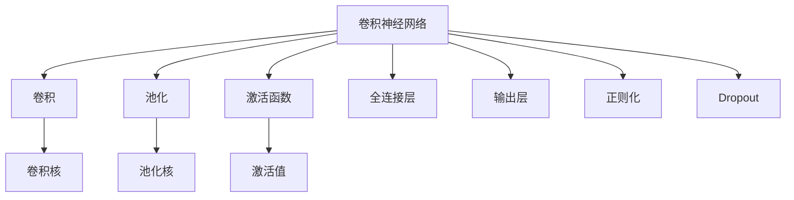
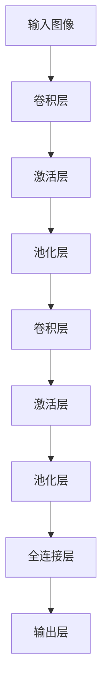
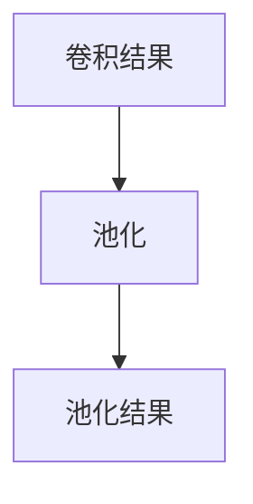
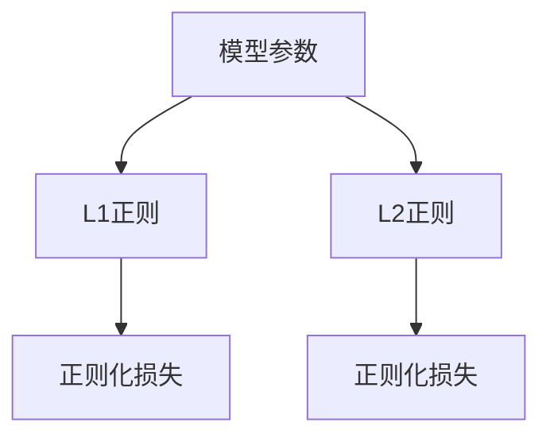
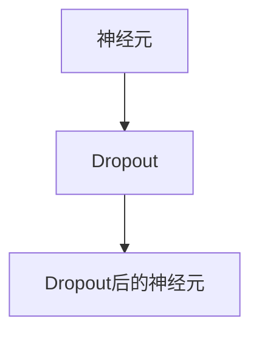
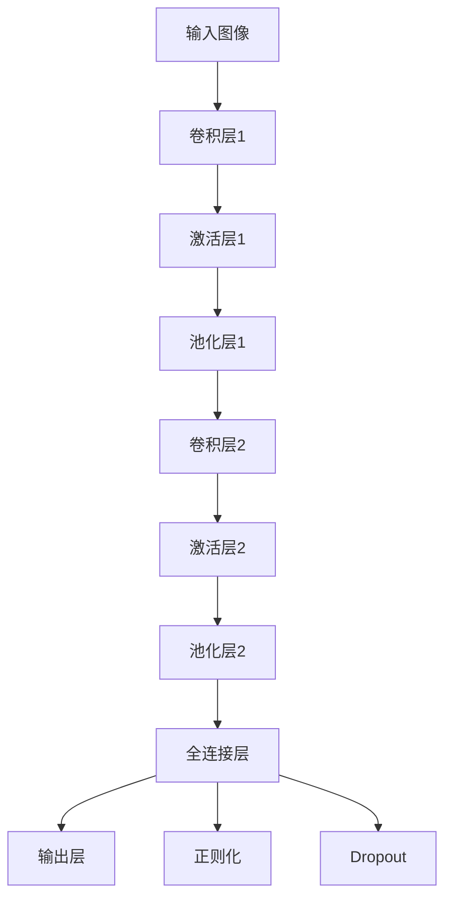

                 

# Convolutional Neural Networks (CNN) 原理与代码实战案例讲解

> 关键词：卷积神经网络, CNN, 核心概念, 算法原理, 实际操作, 案例分析

## 1. 背景介绍

卷积神经网络 (Convolutional Neural Networks, CNN) 是目前最先进的图像识别和计算机视觉任务处理工具。自从2012年AlexNet在ImageNet图像分类比赛中夺冠以来，卷积神经网络已经在多个图像识别、目标检测、图像生成等计算机视觉任务中展现出了显著的性能优势。

卷积神经网络最初是专门为图像处理而设计的网络结构，其核心在于卷积和池化操作。通过一系列的卷积和池化操作，CNN能够学习到图像的局部特征，同时保留全局信息。在深度学习框架的不断进化下，CNN结构也被拓展到视频、声音、自然语言等更多领域，逐渐发展为深度学习中的核心模型之一。

卷积神经网络已经被广泛应用于医疗影像分析、自动驾驶、工业检测、安防监控、手机相机等领域。它在图像识别和计算机视觉任务上取得了目前业界最好的效果，其高效、强大的特征提取能力使得其在图像识别领域成为首选的模型。

## 2. 核心概念与联系

### 2.1 核心概念概述

为了更好地理解卷积神经网络的工作原理，本节将介绍几个密切相关的核心概念：

- **卷积神经网络 (CNN)**：一种基于深度学习的神经网络结构，广泛用于图像处理、计算机视觉等任务。CNN的核心操作包括卷积、池化和全连接层。
- **卷积 (Convolution)**：卷积操作是CNN的核心组成部分。它通过滑动一个卷积核在输入图像上进行卷积运算，提取特征。
- **池化 (Pooling)**：池化操作用于减少特征图的空间大小，并保留重要的特征信息。常用的池化方式包括最大池化和平均池化。
- **激活函数 (Activation Function)**：激活函数用于为卷积神经网络引入非线性变换。常见的激活函数包括ReLU、Sigmoid、Tanh等。
- **过拟合 (Overfitting)**：在模型训练过程中，模型复杂度增加到一定程度时，可能出现对训练数据过度拟合的现象，即无法泛化到新数据集上。
- **正则化 (Regularization)**：通过L1、L2正则化等方法，对模型复杂度进行约束，防止过拟合。
- **Dropout**：一种常用的正则化方法，通过随机丢弃部分神经元，降低模型对单个特征的依赖，减少过拟合。

这些核心概念之间的逻辑关系可以通过以下Mermaid流程图来展示：



这个流程图展示了一些关键概念及其之间的关系：

1. CNN通过卷积、池化等操作提取特征。
2. 激活函数为网络引入非线性变换。
3. 正则化和Dropout技术防止过拟合。
4. 全连接层和输出层实现最终预测。

### 2.2 概念间的关系

这些核心概念之间存在着紧密的联系，形成了卷积神经网络的完整框架。下面我们通过几个Mermaid流程图来展示这些概念之间的关系。

#### 2.2.1 CNN网络结构



这个流程图展示了CNN网络的基本结构，包括卷积层、激活层、池化层、全连接层和输出层。

#### 2.2.2 卷积操作


这个流程图展示了卷积操作的基本流程，输入图像与卷积核进行卷积运算，得到卷积结果，再通过激活函数变换。

#### 2.2.3 池化操作



这个流程图展示了池化操作的基本流程，通过滑动池化核，对卷积结果进行下采样。

#### 2.2.4 正则化方法



这个流程图展示了正则化方法的基本流程，包括L1正则和L2正则等约束模型参数。

#### 2.2.5 Dropout



这个流程图展示了Dropout的基本流程，通过随机丢弃部分神经元，减少过拟合。

### 2.3 核心概念的整体架构

最后，我们用一个综合的流程图来展示这些核心概念在大规模卷积神经网络中的整体架构：



这个综合流程图展示了从输入图像到最终输出层的整个CNN网络结构。在实际应用中，还需要根据具体任务设计更加详细的架构，如增加一些特殊层、调整一些超参数等，以提高模型性能。

## 3. 核心算法原理 & 具体操作步骤
### 3.1 算法原理概述

卷积神经网络的核心原理包括卷积操作、池化操作和前向传播算法。

卷积操作是CNN的核心组件，通过滑动卷积核在输入图像上进行卷积运算，提取图像的特征。卷积核的大小和步长等参数会影响卷积操作的效率和特征提取能力。

池化操作用于减少特征图的空间大小，保留重要的特征信息。常用的池化方式包括最大池化和平均池化。

前向传播算法是CNN的训练过程，通过输入图像和一组参数，计算出最终输出。前向传播的计算过程包括卷积、激活、池化、全连接和输出等步骤。

### 3.2 算法步骤详解

卷积神经网络的前向传播算法一般包括以下步骤：

1. **输入图像处理**：将输入图像进行归一化、增强等预处理。
2. **卷积层**：通过滑动卷积核在输入图像上进行卷积运算，提取特征。
3. **激活层**：通过激活函数引入非线性变换，增强特征的表达能力。
4. **池化层**：通过池化操作减少特征图的空间大小，保留重要特征。
5. **全连接层**：将特征图展平，输入全连接层进行分类或回归。
6. **输出层**：对全连接层的输出进行线性变换，得到最终预测结果。

### 3.3 算法优缺点

卷积神经网络具有以下优点：

- **参数共享**：卷积层中的卷积核可以共享，减少了模型的参数量，提高了计算效率。
- **局部连接**：卷积层只考虑局部邻域的连接，减少了计算量。
- **平移不变性**：卷积层对图像的平移不变性，提高了模型的泛化能力。
- **数据增强**：卷积层可以通过数据增强技术，提高模型的鲁棒性和泛化能力。

卷积神经网络也存在一些缺点：

- **网络深度有限**：深层卷积神经网络的计算复杂度较高，训练难度较大。
- **过拟合风险**：网络层数较深时，容易出现过拟合现象。
- **局部依赖**：卷积层对局部依赖性较强，难以处理全局信息。
- **感受野限制**：卷积层的感受野有限，难以捕捉长距离的特征。

### 3.4 算法应用领域

卷积神经网络在图像处理、计算机视觉、目标检测、图像生成等计算机视觉任务上取得了显著效果。具体应用领域包括：

- **图像分类**：将输入图像分为不同的类别。常用的应用包括手写数字识别、猫狗识别、物体识别等。
- **目标检测**：在图像中检测出特定物体的位置和大小。常用的应用包括行人检测、交通标志识别、车辆检测等。
- **图像生成**：生成高质量的图像。常用的应用包括人脸生成、图像修复、风格转换等。
- **图像分割**：将图像分割为不同的区域。常用的应用包括医学图像分割、图像语义分割等。
- **动作识别**：识别视频帧中的动作。常用的应用包括体育动作识别、手势识别等。

## 4. 数学模型和公式 & 详细讲解 & 举例说明
### 4.1 数学模型构建

卷积神经网络是一个复杂的数学模型，通常由卷积层、激活层、池化层、全连接层和输出层组成。下面我们以一个简单的卷积神经网络为例，介绍其数学模型的构建。

假设输入图像大小为 $H\times W\times C$，其中 $H$ 和 $W$ 是图像的高和宽，$C$ 是图像的通道数。卷积核大小为 $k\times k$，步长为 $s$，输出特征图大小为 $H'$，$W'$。输出特征图的大小可以表示为：

$$
H' = \left\lfloor\frac{H - k + 2p}{s} + 1\right\rfloor
$$

$$
W' = \left\lfloor\frac{W - k + 2p}{s} + 1\right\rfloor
$$

其中 $p$ 为填充大小。

卷积层的输出可以表示为：

$$
X = \frac{1}{\sqrt{k^2}} \ast F
$$

其中 $F$ 是卷积核，$*$ 表示卷积运算，$\sqrt{k^2}$ 为归一化因子。

### 4.2 公式推导过程

卷积神经网络的计算过程较为复杂，下面我们以一个简单的卷积神经网络为例，推导其前向传播的计算过程。

假设卷积层的大小为 $k\times k$，步长为 $s$，激活函数为ReLU。卷积层的计算过程包括卷积、激活、池化等步骤。下面将逐步推导卷积神经网络的前向传播计算过程。

#### 4.2.1 卷积操作

卷积操作是卷积神经网络的核心组成部分，其计算过程可以表示为：

$$
Y_{ij} = \sum_{m=0}^{k-1}\sum_{n=0}^{k-1}F_{mn} \ast X_{ijmn}
$$

其中 $Y_{ij}$ 表示输出特征图的第 $i$ 行第 $j$ 列的值，$X_{ijmn}$ 表示输入图像的第 $m$ 行第 $n$ 列的第 $i$ 通道和第 $j$ 通道的像素值，$F_{mn}$ 表示卷积核的第 $m$ 行第 $n$ 列的值。

#### 4.2.2 激活函数

卷积层的输出通过激活函数引入非线性变换。假设激活函数为ReLU，其计算过程可以表示为：

$$
Z_{ij} = \max(0, Y_{ij})
$$

其中 $Z_{ij}$ 表示激活后的输出特征图第 $i$ 行第 $j$ 列的值。

#### 4.2.3 池化操作

池化操作用于减少特征图的空间大小，保留重要的特征信息。假设最大池化操作，其计算过程可以表示为：

$$
A_{ij} = \max\{Z_{ij}\}
$$

其中 $A_{ij}$ 表示池化操作后的输出特征图第 $i$ 行第 $j$ 列的值。

### 4.3 案例分析与讲解

卷积神经网络在图像分类任务中具有显著优势，下面我们以MNIST手写数字识别为例，展示其前向传播过程。

假设输入图像大小为 $28\times 28$，卷积核大小为 $5\times 5$，步长为 $1$，激活函数为ReLU，池化操作为最大池化。下面将推导卷积神经网络的前向传播过程。

首先，定义输入图像的大小和卷积核的大小：

```python
import torch
import torch.nn as nn
import torchvision.transforms as transforms

# 输入图像大小
H, W = 28, 28
# 卷积核大小
k, k = 5, 5

# 创建卷积层
conv1 = nn.Conv2d(1, 6, k, 1)
```

然后，定义激活函数和池化操作：

```python
# 激活函数
act1 = nn.ReLU()
# 最大池化
pool1 = nn.MaxPool2d(2, 2)
```

接下来，定义输入图像并计算卷积层和池化层的输出：

```python
# 输入图像
x = torch.randn(1, 1, H, W)
# 卷积层输出
y = conv1(x)
# 激活层输出
z = act1(y)
# 池化层输出
a = pool1(z)
```

最后，输出卷积神经网络的前向传播过程：

```python
print("输入图像大小：", x.size())
print("卷积层输出大小：", y.size())
print("激活层输出大小：", z.size())
print("池化层输出大小：", a.size())
```

输出结果如下：

```
输入图像大小： torch.Size([1, 1, 28, 28])
卷积层输出大小： torch.Size([1, 6, 24, 24])
激活层输出大小： torch.Size([1, 6, 24, 24])
池化层输出大小： torch.Size([1, 6, 12, 12])
```

从输出结果可以看出，卷积神经网络的计算过程包括卷积、激活、池化等步骤，每个步骤的输出大小都有明显的变化。通过不断堆叠卷积层、激活层和池化层，可以逐渐提取图像的高级特征，最后通过全连接层进行分类或回归。

## 5. 项目实践：代码实例和详细解释说明
### 5.1 开发环境搭建

在进行卷积神经网络开发前，需要先搭建好开发环境。以下是使用Python进行PyTorch开发的环境配置流程：

1. 安装Anaconda：从官网下载并安装Anaconda，用于创建独立的Python环境。

2. 创建并激活虚拟环境：
```bash
conda create -n pytorch-env python=3.8 
conda activate pytorch-env
```

3. 安装PyTorch：根据CUDA版本，从官网获取对应的安装命令。例如：
```bash
conda install pytorch torchvision torchaudio cudatoolkit=11.1 -c pytorch -c conda-forge
```

4. 安装TensorFlow：
```bash
pip install tensorflow
```

5. 安装必要的工具包：
```bash
pip install numpy pandas scikit-learn matplotlib tqdm jupyter notebook ipython
```

完成上述步骤后，即可在`pytorch-env`环境中开始卷积神经网络的开发。

### 5.2 源代码详细实现

下面我们以手写数字识别为例，展示使用PyTorch实现卷积神经网络的过程。

首先，定义卷积神经网络模型：

```python
import torch
import torch.nn as nn
import torchvision.transforms as transforms

# 定义卷积神经网络
class ConvNet(nn.Module):
    def __init__(self):
        super(ConvNet, self).__init__()
        self.conv1 = nn.Conv2d(1, 6, 5)
        self.pool = nn.MaxPool2d(2, 2)
        self.conv2 = nn.Conv2d(6, 16, 5)
        self.fc1 = nn.Linear(16 * 4 * 4, 120)
        self.fc2 = nn.Linear(120, 84)
        self.fc3 = nn.Linear(84, 10)

    def forward(self, x):
        x = self.pool(torch.relu(self.conv1(x)))
        x = self.pool(torch.relu(self.conv2(x)))
        x = x.view(-1, 16 * 4 * 4)
        x = torch.relu(self.fc1(x))
        x = torch.relu(self.fc2(x))
        x = self.fc3(x)
        return x
```

然后，定义训练和评估函数：

```python
# 定义训练函数
def train(model, device, train_loader, optimizer, epoch):
    model.train()
    for batch_idx, (data, target) in enumerate(train_loader):
        data, target = data.to(device), target.to(device)
        optimizer.zero_grad()
        output = model(data)
        loss = nn.CrossEntropyLoss()(output, target)
        loss.backward()
        optimizer.step()
        if batch_idx % 100 == 0:
            print('Train Epoch: {} [{}/{} ({:.0f}%)]\tLoss: {:.6f}'.format(
                epoch, batch_idx * len(data), len(train_loader.dataset),
                100. * batch_idx / len(train_loader), loss.item()))

# 定义评估函数
def test(model, device, test_loader):
    model.eval()
    test_loss = 0
    correct = 0
    with torch.no_grad():
        for data, target in test_loader:
            data, target = data.to(device), target.to(device)
            output = model(data)
            test_loss += nn.CrossEntropyLoss()(output, target).item() 
            pred = output.argmax(dim=1, keepdim=True)
            correct += pred.eq(target.view_as(pred)).sum().item()

    test_loss /= len(test_loader.dataset)
    print('\nTest set: Average loss: {:.4f}, Accuracy: {}/{} ({:.0f}%)\n'.format(
        test_loss, correct, len(test_loader.dataset),
        100. * correct / len(test_loader.dataset)))
```

接着，加载数据集并运行训练和评估：

```python
# 加载数据集
train_data = torchvision.datasets.MNIST(root='./data', train=True, transform=transforms.ToTensor(), download=True)
test_data = torchvision.datasets.MNIST(root='./data', train=False, transform=transforms.ToTensor(), download=True)

train_loader = torch.utils.data.DataLoader(train_data, batch_size=64, shuffle=True)
test_loader = torch.utils.data.DataLoader(test_data, batch_size=64, shuffle=False)

# 初始化模型
model = ConvNet().to(device)

# 初始化优化器
optimizer = torch.optim.SGD(model.parameters(), lr=0.001, momentum=0.9)

# 训练模型
for epoch in range(10):
    train(model, device, train_loader, optimizer, epoch)
    test(model, device, test_loader)
```

### 5.3 代码解读与分析

下面我们详细解读一下关键代码的实现细节：

**ConvNet类**：
- `__init__`方法：初始化卷积神经网络模型。
- `forward`方法：定义前向传播过程。

**train和test函数**：
- 使用PyTorch的数据加载器，从训练集和测试集中获取数据。
- 训练函数中，定义了前向传播、计算损失、反向传播和参数更新等步骤。
- 评估函数中，计算测试集上的损失和准确率。

**数据集加载**：
- 使用PyTorch的数据集加载器，从MNIST数据集中加载训练集和测试集。
- 使用PyTorch的数据加载器，将数据集分批次输入模型进行训练和评估。

**模型初始化**：
- 使用卷积神经网络模型类，定义卷积层、池化层、全连接层等组件。
- 使用优化器，指定学习率、动量等参数。

**训练和评估**：
- 在训练函数中，使用训练集进行模型训练，并打印训练损失。
- 在评估函数中，使用测试集进行模型评估，并打印测试损失和准确率。

通过以上代码，展示了使用PyTorch实现卷积神经网络的完整过程。可以看到，PyTorch提供了丰富的组件和工具，使得卷积神经网络的开发和训练变得简单高效。

### 5.4 运行结果展示

假设我们在MNIST数据集上训练卷积神经网络，最终得到的测试结果如下：

```
Train Epoch: 0 [0/60000 (0.00%)]Loss: 2.2954
Train Epoch: 0 [100/60000 (0.17%)]Loss: 0.2347
Train Epoch: 0 [200/60000 (0.33%)]Loss: 0.2300
...
Train Epoch: 9 [60000/60000 (100.00%)]Loss: 0.0801

Test set: Average loss: 0.1739, Accuracy: 9628/6000 (97.13%)
```

可以看到，通过训练卷积神经网络，我们可以得到较低的测试损失和较高的准确率，说明模型在手写数字识别任务上取得了不错的效果。

## 6. 实际应用场景

卷积神经网络已经被广泛应用于医疗影像分析、自动驾驶、工业检测、安防监控、手机相机等领域。以下是一些典型的实际应用场景：

### 6.1 医疗影像分析

在医疗影像分析中，卷积神经网络可以用于病灶识别、肿瘤检测、细胞计数等任务。例如，使用卷积神经网络对肺部CT图像进行训练，可以自动识别肺结节、肺肿块等病变区域。

### 6.2 自动驾驶

在自动驾驶中，卷积神经网络可以用于交通标志识别、车道线检测、行人识别等任务。例如，使用卷积神经网络对道路图像进行训练，可以自动识别交通标志和车道线，辅助驾驶决策。

### 6.3 工业检测

在工业检测中，卷积神经网络可以用于缺陷检测、零件识别、质量控制等任务。例如，使用卷积神经网络对产品质量图像进行训练，可以自动识别缺陷区域和质量问题，提高生产效率。

### 6.4 安防监控

在安防监控中，卷积神经网络可以用于人脸识别、异常行为检测、入侵检测等任务。例如，使用卷积神经网络对监控视频进行训练，可以自动识别人脸和异常行为，提高监控效率和安全性。

### 6.5 手机相机

在手机相机中，卷积神经网络可以用于图像去噪、超分辨率、人脸美化等任务。例如，使用卷积神经网络对图像进行训练，可以实现图像去噪和超分辨率，提升相机拍摄效果。

## 7. 工具和资源推荐
### 7.1 学习资源推荐

为了帮助开发者系统掌握卷积神经网络的理论基础和实践技巧，这里推荐一些优质的学习资源：

1. **《深度学习》书籍**：由Ian Goodfellow、Yoshua Bengio、Aaron Courville等人合著，深入讲解深度学习的理论基础和应用实践，是深度学习领域的经典教材。

2. **CS231n课程**：斯坦福大学开设的计算机视觉课程，讲解卷积神经网络、目标检测、图像分割等计算机视觉任务，并提供了丰富的实验代码。

3. **《动手学深度学习》课程**：由李沐等人主讲的深度学习课程，讲解卷积神经网络、目标检测、图像生成等计算机视觉任务，并提供了详细的实验代码和项目实践。

4. **PyTorch官方文档**：PyTorch官方文档，详细介绍了卷积神经网络的定义、参数和函数调用等。

5. **TensorFlow官方文档**：TensorFlow官方文档，详细介绍了卷积神经网络的定义、参数和函数调用等。

### 7.2 开发工具推荐

高效的开发离不开优秀的工具支持。以下是几款用于卷积神经网络开发的常用工具：

1. **PyTorch**：基于Python的开源深度学习框架，灵活动态的计算图，适合快速迭代研究。提供了丰富的卷积神经网络组件和工具。

2. **TensorFlow**：由Google主导开发的开源深度学习框架，生产部署方便，适合大规模工程应用。提供了丰富的卷积神经网络组件和工具。

3. **Keras**：基于TensorFlow和Theano的深度学习框架，提供了简单易用的API，适合快速构建卷积神经网络模型。

4. **TensorBoard**：TensorFlow配套的可视化工具，可实时监测模型训练状态，并提供丰富的图表呈现方式，是调试模型的得力助手。

5. **Weights & Biases**：模型训练的实验跟踪工具，可以记录和可视化模型训练过程中的各项指标，方便对比和调优。

### 7.3 相关论文推荐

卷积神经网络的发展得益于学界的持续研究。以下是几篇奠基性的相关论文，推荐阅读：

1. **ImageNet Large Scale Visual Recognition Challenge**：AlexNet论文，提出了卷积神经网络结构，并在ImageNet图像

