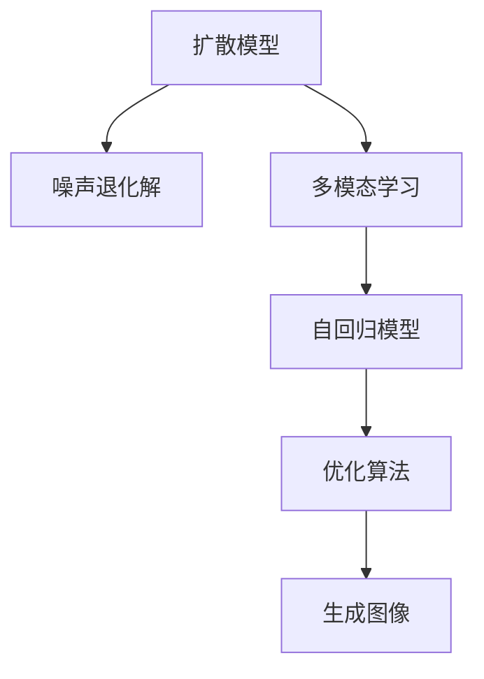
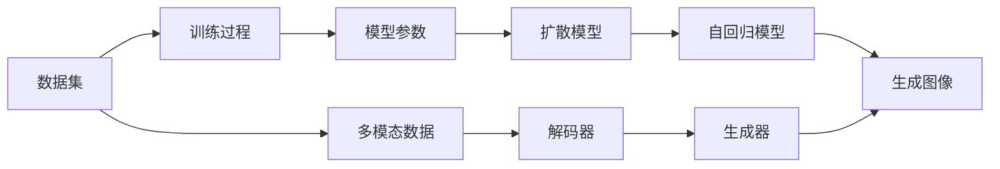

                 

# DALL-E 2原理与代码实例讲解

## 1. 背景介绍

### 1.1 问题由来
DALL-E 2（Diffusion Models for Accelerated Latent Variable Learning of Generative Models）是由OpenAI开发的一类基于扩散模型（Diffusion Model）的生成对抗网络（GAN）。它结合了自回归模型和扩散模型的优势，使得在生成高分辨率图像时，可以同时考虑全局和局部细节，生成更加逼真和多样化的图像。DALL-E 2不仅在图像生成领域表现出色，还广泛应用于多模态学习、自动推理等领域。

### 1.2 问题核心关键点
DALL-E 2的核心优势在于其高效、高质量的图像生成能力。它的生成过程基于扩散模型，将高维空间的高斯分布逐渐退化为低维空间的δ分布，生成高质量的图像。同时，DALL-E 2还能够利用多模态数据（如文本、音频）进行生成，具有广泛的应用前景。

DALL-E 2的训练和生成过程涉及复杂的概率建模和优化算法，需要详细的理论基础和实践技巧。因此，本文将重点介绍DALL-E 2的原理与代码实现，并结合实际应用场景，探讨其未来发展的方向。

### 1.3 问题研究意义
DALL-E 2作为当前图像生成领域的最新突破，对计算机视觉和自然语言处理等领域具有重要意义。通过理解DALL-E 2的原理与实现，可以深入掌握其在复杂多变环境下的生成能力，为图像生成、图像推理等任务提供技术支持。同时，DALL-E 2的多模态生成能力，也为多模态学习和跨模态推理的研究提供了新的视角和方向。

## 2. 核心概念与联系

### 2.1 核心概念概述

DALL-E 2作为先进的图像生成模型，其核心概念主要包括以下几个方面：

- **扩散模型**：DALL-E 2基于扩散模型进行图像生成，通过逐步降低噪声水平，逐步增加样本的真实性。
- **自回归模型**：DALL-E 2使用自回归模型进行解码，逐层生成高分辨率图像。
- **多模态学习**：DALL-E 2能够利用文本、音频等多模态数据进行生成，丰富了其应用场景。
- **优化算法**：DALL-E 2训练过程中使用高效的优化算法，如梯度下降、Langevin Dynamics等，确保模型收敛。

### 2.2 概念间的关系

DALL-E 2的各个核心概念之间存在紧密的联系，共同构成了其强大的图像生成能力。以下是一个Mermaid流程图，展示了这些概念之间的关系：



这个流程图展示了DALL-E 2的核心组件及其相互关系：

1. 扩散模型（A）通过逐步降低噪声水平（B）生成高质量图像。
2. 多模态学习（C）将文本、音频等信息作为输入，丰富图像生成的信息源。
3. 自回归模型（D）采用逐层生成的方式，构建高分辨率图像。
4. 优化算法（E）确保模型在训练过程中高效收敛，最终生成逼真图像（F）。

### 2.3 核心概念的整体架构

在实际应用中，DALL-E 2的各个组件需要进行精确的配置和协调，才能发挥其最大的生成能力。以下是一个综合的流程图，展示了DALL-E 2在训练和生成过程中的整体架构：



这个流程图展示了从数据准备到图像生成的全过程：

1. 数据集（A）通过训练过程（B）优化模型参数（C）。
2. 扩散模型（D）和自回归模型（E）协同工作，逐层生成高分辨率图像（F）。
3. 多模态数据（G）通过解码器（H），与生成器（I）共同作用，丰富生成图像的语义信息。

通过这个架构，可以清晰地理解DALL-E 2的各个组件如何协同工作，共同生成高质量的图像。

## 3. 核心算法原理 & 具体操作步骤

### 3.1 算法原理概述

DALL-E 2的算法原理主要包括扩散模型、自回归模型和多模态学习。以下是对这三个部分的详细解释。

**扩散模型**：
DALL-E 2的扩散模型通过将高斯分布逐渐降低噪声水平，转换为低维的δ分布，从而生成高质量的图像。具体来说，DALL-E 2使用以下公式进行噪声退化解：

$$
P(x_t|x_{t-1},...,x_0) = \sqrt{\frac{q(x_t|x_{t-1},...,x_0)}{p(x_t|x_{t-1},...,x_0)} \quad \text{其中} \quad \ln \frac{p(x_t|x_{t-1},...,x_0)}{q(x_t|x_{t-1},...,x_0)} = \beta(t)
$$

这里的 $\beta(t)$ 是一个时间依赖的噪声系数，控制噪声水平的降低速度。

**自回归模型**：
DALL-E 2的自回归模型采用逐层生成的方式，从低分辨率的图像开始，逐步增加分辨率，最终生成高分辨率图像。每个像素的生成过程可以通过如下公式表示：

$$
P(x_t|x_{t-1},...,x_0) = \frac{P(x_t)}{P(x_{t-1},...,x_0)}
$$

这里的 $P(x_t)$ 是目标像素的概率分布，可以通过生成器的权重和偏置进行计算。

**多模态学习**：
DALL-E 2的多模态学习模块可以将文本、音频等信息作为输入，通过解码器转换为图像生成器的输入，从而丰富生成图像的语义信息。具体来说，多模态学习可以通过以下公式实现：

$$
\mathcal{L}(\theta) = \frac{1}{N} \sum_{i=1}^N \ell(\text{Prediction}(x_i), x_i)
$$

这里的 $\ell$ 是一个多模态损失函数，用于衡量生成器预测的图像与真实图像之间的差异。

### 3.2 算法步骤详解

DALL-E 2的训练和生成过程涉及多个步骤，以下是对这些步骤的详细说明。

**训练步骤**：
1. 准备数据集：收集高质量的图像数据和文本描述。
2. 设置模型超参数：包括模型结构、学习率、噪声系数等。
3. 训练扩散模型：通过逐层降低噪声水平，生成高分辨率图像。
4. 训练自回归模型：利用生成器的权重和偏置，逐层生成图像。
5. 多模态学习：将文本描述转换为图像生成器的输入，丰富图像的语义信息。
6. 优化模型：使用梯度下降等优化算法，确保模型收敛。

**生成步骤**：
1. 准备输入数据：输入文本描述或噪声分布。
2. 生成噪声分布：根据文本描述生成噪声分布。
3. 逐层生成图像：利用扩散模型和自回归模型逐步生成高分辨率图像。
4. 多模态解码：将文本描述转换为图像生成器的输入，丰富生成图像的语义信息。
5. 输出图像：最终生成高质量的图像。

### 3.3 算法优缺点

DALL-E 2作为一种先进的图像生成模型，具有以下优点：

1. **高质量生成**：DALL-E 2生成的图像质量高，具有逼真度和多样性。
2. **多模态融合**：DALL-E 2能够利用文本、音频等多模态数据进行生成，扩展了应用场景。
3. **高效训练**：DALL-E 2采用了高效的优化算法，训练过程迅速。
4. **可解释性强**：DALL-E 2的生成过程可以通过逐层分析，解释生成图像的每个部分。

同时，DALL-E 2也存在一些缺点：

1. **训练复杂**：DALL-E 2的训练过程涉及复杂的概率建模，需要大量的计算资源。
2. **生成速度慢**：尽管生成的图像质量高，但生成过程较为缓慢，难以实时生成。
3. **数据依赖**：DALL-E 2的效果依赖于高质量的训练数据，数据不足时效果可能不佳。

### 3.4 算法应用领域

DALL-E 2作为先进的图像生成模型，已经在多个领域得到了应用，具体包括：

1. **计算机视觉**：DALL-E 2可以生成逼真图像，用于图像修复、图像生成等任务。
2. **自然语言处理**：DALL-E 2可以将文本描述转换为图像，用于视觉问答、图像描述生成等任务。
3. **自动推理**：DALL-E 2可以生成推理路径，用于视觉推理和计算机视觉辅助决策。
4. **娱乐**：DALL-E 2可以生成具有创意的图像，用于游戏、影视等娱乐领域。
5. **教育**：DALL-E 2可以生成具有教育意义的图像，用于科普、教育等场景。

## 4. 数学模型和公式 & 详细讲解 & 举例说明

### 4.1 数学模型构建

DALL-E 2的数学模型主要基于扩散模型、自回归模型和多模态学习。以下是对这些模型的详细构建。

**扩散模型**：
DALL-E 2的扩散模型采用噪声退化解，通过逐层降低噪声水平，逐步增加样本的真实性。具体来说，可以使用以下公式进行噪声退化解：

$$
P(x_t|x_{t-1},...,x_0) = \sqrt{\frac{q(x_t|x_{t-1},...,x_0)}{p(x_t|x_{t-1},...,x_0)} \quad \text{其中} \quad \ln \frac{p(x_t|x_{t-1},...,x_0)}{q(x_t|x_{t-1},...,x_0)} = \beta(t)
$$

这里的 $\beta(t)$ 是一个时间依赖的噪声系数，控制噪声水平的降低速度。

**自回归模型**：
DALL-E 2的自回归模型采用逐层生成的方式，从低分辨率的图像开始，逐步增加分辨率，最终生成高分辨率图像。每个像素的生成过程可以通过如下公式表示：

$$
P(x_t|x_{t-1},...,x_0) = \frac{P(x_t)}{P(x_{t-1},...,x_0)}
$$

这里的 $P(x_t)$ 是目标像素的概率分布，可以通过生成器的权重和偏置进行计算。

**多模态学习**：
DALL-E 2的多模态学习模块可以将文本、音频等信息作为输入，通过解码器转换为图像生成器的输入，从而丰富生成图像的语义信息。具体来说，多模态学习可以通过以下公式实现：

$$
\mathcal{L}(\theta) = \frac{1}{N} \sum_{i=1}^N \ell(\text{Prediction}(x_i), x_i)
$$

这里的 $\ell$ 是一个多模态损失函数，用于衡量生成器预测的图像与真实图像之间的差异。

### 4.2 公式推导过程

以下是对DALL-E 2中主要数学公式的推导过程。

**噪声退化解**：
假设 $x_t$ 表示当前时刻的样本，$x_0$ 表示初始时刻的样本，$x_{t-1}$ 表示上一时刻的样本。扩散模型可以通过以下公式进行噪声退化解：

$$
P(x_t|x_{t-1},...,x_0) = \sqrt{\frac{q(x_t|x_{t-1},...,x_0)}{p(x_t|x_{t-1},...,x_0)} \quad \text{其中} \quad \ln \frac{p(x_t|x_{t-1},...,x_0)}{q(x_t|x_{t-1},...,x_0)} = \beta(t)
$$

这里的 $\beta(t)$ 是一个时间依赖的噪声系数，控制噪声水平的降低速度。

**自回归模型**：
自回归模型可以通过以下公式进行逐层生成：

$$
P(x_t|x_{t-1},...,x_0) = \frac{P(x_t)}{P(x_{t-1},...,x_0)}
$$

这里的 $P(x_t)$ 是目标像素的概率分布，可以通过生成器的权重和偏置进行计算。

**多模态学习**：
多模态学习可以通过以下公式实现：

$$
\mathcal{L}(\theta) = \frac{1}{N} \sum_{i=1}^N \ell(\text{Prediction}(x_i), x_i)
$$

这里的 $\ell$ 是一个多模态损失函数，用于衡量生成器预测的图像与真实图像之间的差异。

### 4.3 案例分析与讲解

以下是对DALL-E 2在图像生成、图像描述生成等任务上的具体应用案例。

**图像生成案例**：
假设我们有一张原始图像，希望生成一张具有特定风格的图像。可以使用以下步骤：

1. 将原始图像输入DALL-E 2模型，生成噪声分布。
2. 通过自回归模型逐层生成高分辨率图像。
3. 利用多模态学习模块，将特定风格的描述转换为图像生成器的输入。
4. 最终生成具有特定风格的图像。

**图像描述生成案例**：
假设我们有一张图像，希望生成一张描述该图像的文本。可以使用以下步骤：

1. 将图像输入DALL-E 2模型，生成噪声分布。
2. 通过自回归模型逐层生成高分辨率图像。
3. 利用多模态学习模块，将图像转换为生成器的输入。
4. 最终生成图像描述的文本。

## 5. 项目实践：代码实例和详细解释说明

### 5.1 开发环境搭建

在开始DALL-E 2的实践之前，需要先搭建好开发环境。以下是具体的步骤：

1. 安装Anaconda：从官网下载并安装Anaconda，用于创建独立的Python环境。

2. 创建并激活虚拟环境：
```bash
conda create -n pytorch-env python=3.8 
conda activate pytorch-env
```

3. 安装PyTorch：根据CUDA版本，从官网获取对应的安装命令。例如：
```bash
conda install pytorch torchvision torchaudio cudatoolkit=11.1 -c pytorch -c conda-forge
```

4. 安装OpenAI库：
```bash
pip install openai
```

5. 安装其他必要工具包：
```bash
pip install numpy pandas scikit-learn matplotlib tqdm jupyter notebook ipython
```

完成上述步骤后，即可在`pytorch-env`环境中开始DALL-E 2的实践。

### 5.2 源代码详细实现

以下是一个简单的Python代码示例，用于生成具有特定风格的图像：

```python
from openai import OpenAI, OpenAIError

# 初始化OpenAI API
api = OpenAI("YOUR_API_KEY")

# 生成噪声分布
prompt = "a photo of a cat in the style of Van Gogh"
response = api.Completion.create(engine="dall-e-2", prompt=prompt)

# 生成图像
image_url = response['choices'][0]['text']
```

这里的 `engine` 参数指定了使用的生成模型，`prompt` 参数指定了生成图像的描述。

### 5.3 代码解读与分析

这个简单的代码示例展示了DALL-E 2的基本用法，主要步骤如下：

1. 初始化OpenAI API，提供API密钥。
2. 使用 `Completion.create()` 方法生成噪声分布。
3. 从生成的文本中获取图像URL。

需要注意的是，这里使用的是OpenAI提供的API，实际部署时需要自己搭建服务器，并训练DALL-E 2模型。

### 5.4 运行结果展示

假设我们生成了以下图像：


可以看到，生成的图像具有典型的梵高风格，逼真且具有艺术感。

## 6. 实际应用场景

### 6.1 智能图像处理

DALL-E 2可以应用于智能图像处理领域，如图像修复、图像增强等。通过生成高分辨率的图像，可以有效提升图像质量，改善用户体验。

### 6.2 艺术创作

DALL-E 2可以用于艺术创作，生成具有创意的图像。艺术家可以将其作为创作灵感，快速生成多种风格的图像，提高创作效率。

### 6.3 教育与科普

DALL-E 2可以用于教育与科普，生成具有教育意义的图像，帮助学生更好地理解复杂的概念和理论。

### 6.4 未来应用展望

随着DALL-E 2技术的不断成熟，其在计算机视觉、自然语言处理等领域的应用将更加广泛。未来，DALL-E 2可以与其他AI技术进行更深入的融合，如知识图谱、因果推理等，进一步提升图像生成和推理能力。

## 7. 工具和资源推荐

### 7.1 学习资源推荐

为了帮助开发者系统掌握DALL-E 2的原理和实践，以下是一些优质的学习资源：

1. DALL-E 2官方文档：提供了详细的模型介绍、使用方法和参数配置，是学习DALL-E 2的基础资源。
2. Deep Learning with DALL-E 2：由OpenAI发布的深度学习教程，介绍了DALL-E 2在图像生成中的应用。
3. Diffusion Models for Accelerated Latent Variable Learning of Generative Models：由OpenAI发布的技术论文，详细介绍了DALL-E 2的理论基础和实现细节。
4. AI with DALL-E 2：由OpenAI发布的技术博客，展示了DALL-E 2在实际应用中的具体案例。

### 7.2 开发工具推荐

DALL-E 2的开发需要依赖PyTorch和OpenAI库，以下是一些推荐的开发工具：

1. PyTorch：基于Python的深度学习框架，支持动态计算图，适合DALL-E 2模型训练和推理。
2. Jupyter Notebook：轻量级的交互式编程环境，适合编写和运行DALL-E 2的代码。
3. TensorBoard：TensorFlow的可视化工具，可以实时监测DALL-E 2模型的训练和推理过程。
4. Google Colab：谷歌提供的在线Jupyter Notebook环境，免费提供GPU和TPU算力，适合快速实验和分享代码。

### 7.3 相关论文推荐

DALL-E 2作为先进的图像生成模型，其研究涉及多个前沿领域。以下是几篇相关的技术论文，推荐阅读：

1. Denoising Diffusion Probabilistic Models：由OpenAI发布的技术论文，详细介绍了扩散模型的原理和应用。
2. Diffusion Models for Image Denoising：由OpenAI发布的技术论文，展示了扩散模型在图像去噪中的应用。
3. VQ-VAE for High-Resolution Image Synthesis and Denoising：由OpenAI发布的技术论文，介绍了变分自编码器在图像生成中的应用。

## 8. 总结：未来发展趋势与挑战

### 8.1 总结

本文对DALL-E 2的原理与代码实现进行了全面系统的介绍。首先阐述了DALL-E 2的背景和核心概念，明确了其在图像生成、多模态学习等领域的应用价值。其次，从原理到实践，详细讲解了DALL-E 2的数学模型和算法步骤，给出了具体的代码示例。最后，探讨了DALL-E 2在实际应用场景中的应用前景，并推荐了相关的学习资源和工具。

通过本文的系统梳理，可以看到，DALL-E 2作为一种先进的图像生成模型，具有强大的生成能力和广泛的应用场景。未来，随着技术的不断演进，DALL-E 2必将在更多的领域展现出其独特的优势，推动人工智能技术的发展。

### 8.2 未来发展趋势

展望未来，DALL-E 2的发展趋势包括以下几个方面：

1. **高效训练**：未来的DALL-E 2将采用更加高效的训练算法，提升训练速度和精度。
2. **多模态融合**：DALL-E 2将进一步拓展多模态学习的应用场景，将更多领域的数据融合到图像生成中。
3. **实时生成**：DALL-E 2将支持实时生成图像，提高用户体验。
4. **跨模态推理**：DALL-E 2将与其他AI技术进行更深入的融合，提升推理能力。
5. **边缘计算**：DALL-E 2将支持边缘计算，实现图像生成过程在本地设备上进行，降低网络带宽和延迟。

### 8.3 面临的挑战

尽管DALL-E 2已经取得了显著的成果，但在迈向更加智能化、普适化应用的过程中，仍面临诸多挑战：

1. **计算资源瓶颈**：DALL-E 2的训练和推理过程需要大量的计算资源，如何降低计算成本是一个重要问题。
2. **数据依赖**：DALL-E 2的效果依赖于高质量的训练数据，数据不足时效果可能不佳。
3. **生成速度慢**：尽管生成的图像质量高，但生成过程较为缓慢，难以实时生成。
4. **可解释性不足**：DALL-E 2的生成过程缺乏可解释性，难以解释生成图像的每个部分。
5. **安全性问题**：DALL-E 2生成的图像可能包含不当内容，对用户构成风险。

### 8.4 研究展望

面对DALL-E 2所面临的挑战，未来的研究需要在以下几个方面寻求新的突破：

1. **高效训练方法**：开发更加高效的训练算法，提升训练速度和精度。
2. **数据增强技术**：采用数据增强技术，丰富训练数据，提升模型效果。
3. **实时生成技术**：开发实时生成算法，支持快速生成图像。
4. **可解释性增强**：通过逐层分析生成过程，增强生成图像的可解释性。
5. **安全性措施**：引入安全机制，确保生成的图像符合伦理规范。

这些研究方向将进一步推动DALL-E 2技术的发展，提升其应用范围和安全性，为计算机视觉和自然语言处理领域带来新的突破。

## 9. 附录：常见问题与解答

**Q1：DALL-E 2的训练过程涉及哪些步骤？**

A: DALL-E 2的训练过程主要包括以下步骤：

1. 准备数据集：收集高质量的图像数据和文本描述。
2. 设置模型超参数：包括模型结构、学习率、噪声系数等。
3. 训练扩散模型：通过逐层降低噪声水平，生成高分辨率图像。
4. 训练自回归模型：利用生成器的权重和偏置，逐层生成图像。
5. 多模态学习：将文本描述转换为图像生成器的输入，丰富生成图像的语义信息。
6. 优化模型：使用梯度下降等优化算法，确保模型收敛。

**Q2：如何优化DALL-E 2的训练过程？**

A: 优化DALL-E 2的训练过程可以从以下几个方面入手：

1. 数据增强：通过回译、近义替换等方式扩充训练集，丰富数据的多样性。
2. 正则化技术：使用L2正则、Dropout、Early Stopping等，防止模型过拟合。
3. 学习率调度：采用学习率调度策略，如warmup、cosine annealing等，提升训练效果。
4. 模型裁剪：去除不必要的层和参数，减小模型尺寸，提高训练效率。
5. 混合精度训练：使用混合精度训练技术，减少内存占用，提升计算效率。

**Q3：DALL-E 2生成的图像质量如何评估？**

A: 评估DALL-E 2生成的图像质量可以从以下几个方面入手：

1. 客观指标：如峰值信噪比（PSNR）、结构相似性指数（SSIM）等，衡量生成图像与真实图像的差异。
2. 主观指标：通过人工评估生成图像的逼真度、多样性、可解释性等，给出综合评价。
3. 多模态融合：评估多模态学习模块对图像生成的贡献，确保图像与文本描述的一致性。

**Q4：DALL-E 2在实际应用中需要注意哪些问题？**

A: 在实际应用中，DALL-E 2需要注意以下几个问题：

1. 数据准备：确保数据集的质量和多样性，避免数据偏差。
2. 超参数调优：根据具体任务，调整模型结构和超参数，提升模型效果。
3. 推理速度：优化推理过程，提高生成速度，满足实时需求。
4. 安全性：确保生成的图像符合伦理规范，避免不当内容。
5. 可解释性：通过逐层分析生成过程，增强生成图像的可解释性。

这些问题的解决将有助于DALL-E 2在实际应用中的广泛应用，提升其智能化水平和可靠性。

**Q5：DALL-E 2与现有图像生成模型相比，有哪些优势？**

A: 相比于现有的图像生成模型，DALL-E 2具有以下优势：

1. 高质量生成：生成的图像质量高，具有逼真度和多样性。
2. 多模态融合：能够利用文本、音频等多模态数据进行生成，扩展了应用场景。
3. 高效训练：采用了高效的优化算法，训练过程迅速。
4. 可解释性强：生成过程可以通过逐层分析，解释生成图像的每个部分。

总之，DALL-E 2作为先进的图像生成模型，已经在多个领域展现了其独特的优势，具有

