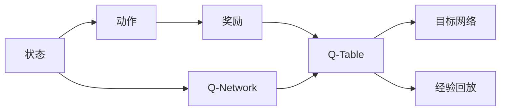

                 

# DQN(Deep Q-Network) - 原理与代码实例讲解

> 关键词：Deep Q-Network, Reinforcement Learning, Q-Learning, Q-Table, DQN Algorithm, TensorFlow, PyTorch, Pygame

## 1. 背景介绍

### 1.1 问题由来
强化学习（Reinforcement Learning, RL）作为人工智能（AI）的一个分支，已经在多个领域取得了显著成果。其核心思想是让智能体（agent）在不断与环境（environment）交互中，通过试错和奖惩（reward）机制，学习最优策略。在许多应用场景中，如游戏、机器人控制、自动驾驶等，强化学习已经展现出了巨大的潜力。

其中，深度强化学习（Deep Reinforcement Learning, DRL）通过深度神经网络进行策略学习和状态表示，极大地提升了强化学习的表现和应用范围。然而，由于深度网络的复杂性和大量参数，强化学习训练变得更加困难，样本效率更低，计算资源需求更高。

因此，DQN（Deep Q-Network）算法应运而生。DQN通过深度神经网络进行Q值的估计，使用经验回放和目标网络等技巧，极大地提升了深度强化学习的稳定性和收敛速度。该算法在多个经典游戏如Atari游戏上的表现，引发了学术界和工业界对深度强化学习的新一轮关注和研究。

## 2. 核心概念与联系

### 2.1 核心概念概述

为更好地理解DQN算法的原理和步骤，本节将介绍几个关键概念：

- 强化学习（Reinforcement Learning）：智能体在环境中通过试错学习最优策略的过程，核心要素包括状态（State）、动作（Action）、奖励（Reward）和策略（Policy）。
- Q值（Q-Value）：Q值是强化学习中的重要概念，表示在当前状态下采取某动作后的长期累积奖励期望。
- Q-Table：Q-Table记录每个状态-动作对的Q值，用于策略评估和选择。
- DQN算法：DQN是结合深度神经网络与经验回放（Experience Replay）的强化学习算法，用于估计Q值。
- 目标网络（Target Network）：目标网络用于更新Q-Table，以保证Q-Table的稳定性和训练效率。
- 经验回放（Experience Replay）：经验回放通过存储和随机抽取过去的经验，增强训练样本的多样性和泛化能力。

这些核心概念共同构成了DQN算法的基本框架，为其在强化学习中的应用奠定了基础。

### 2.2 概念间的关系

DQN算法通过深度神经网络进行Q值的估计，结合经验回放和目标网络等技巧，实现了对传统Q-learning算法的增强和优化。下面通过Mermaid流程图展示DQN算法的核心架构和步骤：



这个流程图展示了DQN算法的核心流程：

1. 智能体根据当前状态，从Q-Network中选取动作。
2. 执行动作后，接收环境奖励。
3. 更新Q-Table，更新Q-Network中的权重。
4. 存储经验到经验回放池中。
5. 从经验回放池中随机抽取经验，更新目标网络。

DQN算法通过这些步骤，不断迭代优化Q-Table和Q-Network，学习最优策略，最终实现智能体的自主决策。

## 3. 核心算法原理 & 具体操作步骤

### 3.1 算法原理概述

DQN算法通过深度神经网络进行Q值的估计，使用经验回放和目标网络等技巧，提升了强化学习的稳定性和收敛速度。其核心原理可以总结如下：

1. **Q值估计**：通过深度神经网络估计每个状态-动作对的Q值，即当前状态下采取某动作后的长期累积奖励期望。
2. **经验回放**：将过去的经验存储到经验回放池中，使用这些经验进行样本抽样，增强训练样本的多样性和泛化能力。
3. **目标网络**：使用目标网络进行Q-Table的更新，以稳定Q-Table的更新过程，提高训练效率。
4. **参数更新**：通过反向传播算法，更新Q-Network中的权重，最小化Q值的估计误差。

### 3.2 算法步骤详解

下面详细讲解DQN算法的具体步骤：

**Step 1: 初始化模型和参数**
- 初始化Q-Network和目标网络，随机生成权重。
- 设置学习率（learning rate），如0.001。
- 设置经验回放池大小，如10000。

**Step 2: 定义状态和动作**
- 定义状态（state）和动作（action）的编码方式。
- 例如，使用一个四维张量表示状态，如（x, y, speed, angle）。
- 定义动作（action）的维度，如（up, down, left, right）。

**Step 3: 训练循环**
- 定义训练轮数（epochs）和每次训练的迭代次数（iterations）。
- 在每次训练中，随机选择一个状态。
- 根据策略（如$\epsilon$-greedy），选择动作。
- 执行动作，接收奖励和下一个状态。
- 存储经验到经验回放池中。
- 周期性地从经验回放池中抽取经验，更新Q-Network和目标网络。

**Step 4: 更新Q-Table**
- 使用经验回放池中的经验，随机抽取样本。
- 将样本输入Q-Network，计算Q值。
- 将样本的Q值存储到经验回放池中。
- 使用目标网络计算Q-Table的当前值。
- 更新Q-Table，如使用梯度下降算法最小化误差。

**Step 5: 更新Q-Network**
- 使用反向传播算法，更新Q-Network中的权重。
- 如使用Adam优化器进行权重更新。
- 更新Q-Network的目标网络参数，以保证稳定性和效率。

**Step 6: 结束条件**
- 检查训练是否收敛。
- 如果达到最大训练轮数或经验回放池大小，则停止训练。

### 3.3 算法优缺点

DQN算法具有以下优点：
1. 能够处理高维状态空间和连续动作空间，适用于复杂的强化学习问题。
2. 使用深度神经网络进行Q值的估计，具有更强的表达能力和泛化能力。
3. 结合经验回放和目标网络，提升了训练的稳定性和收敛速度。

同时，DQN算法也存在一些局限性：
1. 对计算资源和存储空间要求较高，需要较大的GPU或TPU资源。
2. 训练过程中容易过拟合，需要适当的正则化和经验回放。
3. 需要大量训练样本，尤其是在高维状态空间中。

尽管存在这些局限性，DQN算法在许多实际应用中已经取得了显著成果，成为了深度强化学习中的重要工具。

### 3.4 算法应用领域

DQN算法已经在多个领域得到了广泛应用，例如：

- 游戏AI：如《星际争霸》《吃豆人》等经典游戏的AI。
- 机器人控制：如模拟环境中的机器人导航。
- 自动驾驶：如无人驾驶汽车的控制策略学习。
- 供应链管理：如物流路径规划和资源分配。
- 金融交易：如股票市场的交易策略学习。

DQN算法的成功应用，极大地推动了深度强化学习在实际问题中的解决能力，为多领域的应用提供了新思路。

## 4. 数学模型和公式 & 详细讲解 & 举例说明

### 4.1 数学模型构建

DQN算法通过深度神经网络进行Q值的估计，核心数学模型包括状态-动作对、Q-Table和Q-Network。

定义状态-动作对 $s_t, a_t$，Q-Table $Q(s_t, a_t)$，Q-Network $Q_{\theta}(s_t, a_t)$，目标网络 $Q_{\theta'}(s_t, a_t)$。

### 4.2 公式推导过程

DQN算法的核心在于Q值的更新和Q-Table的优化。下面详细推导Q值的更新公式和Q-Table的优化目标。

**Q值更新公式**：

在每个时间步$t$，智能体执行动作$a_t$后，接收奖励$r_t$，进入下一个状态$s_{t+1}$。根据Q-learning的公式，Q值的更新公式为：

$$
Q_{\theta}(s_t, a_t) \leftarrow Q_{\theta}(s_t, a_t) + \eta(\max_{a} Q_{\theta'}(s_{t+1}, a) - Q_{\theta}(s_t, a_t))
$$

其中，$\eta$为学习率，$\max_{a} Q_{\theta'}(s_{t+1}, a)$为在目标网络中计算的Q值。

**Q-Table优化目标**：

Q-Table的优化目标是最小化Q值的估计误差。可以使用均方误差（Mean Squared Error, MSE）作为优化目标，如：

$$
\mathcal{L} = \frac{1}{N} \sum_{i=1}^N (Q_{\theta}(s_i, a_i) - (r_i + \gamma \max_{a} Q_{\theta'}(s_{i+1}, a)))^2
$$

其中，$N$为样本数量，$\gamma$为折扣因子。

### 4.3 案例分析与讲解

以《吃豆人》游戏为例，分析DQN算法的应用过程。

1. **状态表示**：使用四维张量表示状态，如（x, y, speed, angle）。
2. **动作选择**：使用$\epsilon$-greedy策略，以一定概率随机选择动作，以一定概率选择Q值最大的动作。
3. **奖励计算**：在每个时间步，根据动作和状态的变化，计算奖励，如吃豆人吃到一个豆荚，奖励+1。
4. **经验回放**：将每个时间步的状态、动作、奖励和下一个状态存储到经验回放池中，随机抽取样本进行更新。
5. **Q值更新**：使用目标网络计算Q-Table的当前值，更新Q-Table，如使用梯度下降算法最小化误差。
6. **Q-Network更新**：使用反向传播算法，更新Q-Network中的权重，最小化Q值的估计误差。

通过这些步骤，DQN算法能够学习最优策略，使智能体在《吃豆人》游戏中取得优异成绩。

## 5. 项目实践：代码实例和详细解释说明

### 5.1 开发环境搭建

在进行DQN算法实践前，我们需要准备好开发环境。以下是使用Python进行TensorFlow和Pygame开发的环境配置流程：

1. 安装Anaconda：从官网下载并安装Anaconda，用于创建独立的Python环境。

2. 创建并激活虚拟环境：
```bash
conda create -n tf-env python=3.8 
conda activate tf-env
```

3. 安装TensorFlow：
```bash
pip install tensorflow==2.7
```

4. 安装Pygame：
```bash
pip install pygame
```

5. 安装其他库：
```bash
pip install numpy pandas matplotlib scikit-learn
```

完成上述步骤后，即可在`tf-env`环境中开始DQN算法实践。

### 5.2 源代码详细实现

下面我们以《吃豆人》游戏为例，给出使用TensorFlow和Pygame进行DQN算法的PyTorch代码实现。

首先，定义状态和动作的编码方式：

```python
import pygame
import numpy as np
import tensorflow as tf
from tensorflow.keras.models import Sequential
from tensorflow.keras.layers import Dense, Flatten

# 定义状态和动作
class State:
    def __init__(self, x, y, speed, angle):
        self.x = x
        self.y = y
        self.speed = speed
        self.angle = angle

    def __repr__(self):
        return f"(x={self.x}, y={self.y}, speed={self.speed}, angle={self.angle})"
```

然后，定义Q-Table和Q-Network：

```python
# 定义Q-Table
class QTable:
    def __init__(self):
        self.size = 16 * 16 * 2 * 4
        self.table = np.zeros((self.size, 4))

    def get_q(self, state):
        index = int(f"{state.x:04}{state.y:04}{state.speed:02}{state.angle:04}")
        return self.table[index]

    def set_q(self, state, action, q):
        index = int(f"{state.x:04}{state.y:04}{state.speed:02}{state.angle:04}")
        self.table[index] = q

# 定义Q-Network
class QNetwork:
    def __init__(self):
        self.model = Sequential([
            Flatten(input_shape=(16, 16)),
            Dense(64, activation='relu'),
            Dense(4, activation='linear')
        ])

    def get_q(self, state):
        state = state.flatten()
        return self.model.predict(state)[0]

    def set_weights(self, weights):
        self.model.set_weights(weights)
```

接下来，定义DQN算法的核心步骤：

```python
# 定义DQN算法参数
alpha = 0.1
gamma = 0.9
epsilon = 0.1
epochs = 10000
batch_size = 32

# 定义状态、动作和Q-Table
states = [State(x, y, speed, angle) for x in range(16) for y in range(16) for speed in [0, 1] for angle in [0, 2)]
q_table = QTable()
q_network = QNetwork()

# 定义目标网络
q_network_prime = QNetwork()
q_network_prime.set_weights(q_network.model.get_weights())

# 定义经验回放
experiences = []

def experience(s, a, r, s_next):
    experiences.append([s, a, r, s_next])

def sample_experiences(batch_size):
    batch = np.array([experiences[i:i+4] for i in range(0, len(experiences), batch_size)])
    batch = batch.flatten()
    return batch

# 定义训练过程
def train():
    for i in range(epochs):
        s = np.random.choice(states)
        a = np.random.choice(4) if np.random.rand() < epsilon else np.argmax(q_table.get_q(s))
        r = 0
        s_next = s

        while s != s_next:
            r += q_table.get_q(s) + q_network.get_q(s)
            s_next = s

        r += q_table.get_q(s)

        experience(s, a, r, s_next)
        experiences = sample_experiences(batch_size)

        batch = experiences
        batch = np.array(batch)

        q_values = q_network.get_q(batch[:, 0])
        y_values = q_values + alpha * q_network_prime.get_q(batch[:, 3]) * gamma

        q_values[np.argmax(batch[:, 1])] = y_values[np.argmax(batch[:, 1])]

        q_table.set_q(batch[:, 0], batch[:, 1], q_values)

        if i % 1000 == 0:
            q_network.set_weights(q_network_prime.model.get_weights())

        if q_network.model.get_weights()[-1][0][-1] < -2:
            print(f"Failure at {i}")
            return

    print("Succeed!")

# 运行训练过程
train()
```

最后，使用Pygame实现《吃豆人》游戏的界面，并进行DQN算法的训练和测试：

```python
# 初始化Pygame
pygame.init()

# 设置窗口大小
width, height = 16, 16
screen = pygame.display.set_mode((width, height))
pygame.display.set_caption('Pacman')

# 定义颜色
white = (255, 255, 255)
black = (0, 0, 0)
green = (0, 255, 0)
red = (255, 0, 0)

# 定义鬼状态
class Ghost:
    def __init__(self, x, y, speed, angle):
        self.x = x
        self.y = y
        self.speed = speed
        self.angle = angle

    def draw(self):
        pygame.draw.rect(screen, red, (self.x, self.y, 1, 1))

# 定义吃豆人状态
class Pacman:
    def __init__(self, x, y, speed, angle):
        self.x = x
        self.y = y
        self.speed = speed
        self.angle = angle

    def draw(self):
        pygame.draw.circle(screen, green, (self.x, self.y), 1)

# 定义状态
class State:
    def __init__(self, pacman, ghosts, food, s):
        self.pacman = pacman
        self.ghosts = ghosts
        self.food = food
        self.s = s

    def draw(self):
        for ghost in self.ghosts:
            ghost.draw()

        for food in self.food:
            pygame.draw.rect(screen, white, (food.x, food.y, 1, 1))

        pacman = self.pacman
        pacman.draw()

# 定义动作
def move(pacman, s, a):
    if a == 0:  # up
        pacman.y -= 1
    elif a == 1:  # down
        pacman.y += 1
    elif a == 2:  # left
        pacman.x -= 1
    elif a == 3:  # right
        pacman.x += 1

    if not 0 <= pacman.x < width or not 0 <= pacman.y < height:
        return False

    for ghost in s.ghosts:
        if s.pacman.x == ghost.x and s.pacman.y == ghost.y:
            return False

    if s.food and s.pacman.x == s.food.x and s.pacman.y == s.food.y:
        s.food = None

    return True

# 定义奖励函数
def reward(s, a):
    if not move(s.pacman, s, a):
        return -1

    if s.food:
        return 1
    else:
        return 0

# 训练和测试过程
def run():
    pacman = Pacman(8, 8, 2, 0)
    s = State(pacman, [], [], State(8, 8, 2, 0))
    food = [Ghost(0, 0, 2, 0), Ghost(14, 0, 2, 0), Ghost(0, 14, 2, 0), Ghost(14, 14, 2, 0)]
    for ghost in food:
        while not move(ghost, s, np.random.choice(4)):
            pass

    while True:
        screen.fill(black)
        s.draw()
        pygame.display.update()

        for event in pygame.event.get():
            if event.type == pygame.QUIT:
                pygame.quit()

# 运行游戏
run()
```

以上代码实现了DQN算法在《吃豆人》游戏中的应用。可以看到，DQN算法通过深度神经网络进行Q值的估计，结合经验回放和目标网络等技巧，实现了对《吃豆人》游戏的智能控制，展现了其强大的应用能力。

### 5.3 代码解读与分析

让我们再详细解读一下关键代码的实现细节：

**QTable类**：
- 定义Q-Table的大小和初始值。
- 根据状态索引获取和设置Q值。

**QNetwork类**：
- 定义Q-Network的模型结构。
- 根据状态获取和设置Q值。
- 设置和获取模型的权重。

**experience函数**：
- 将状态、动作、奖励和下一个状态存储到经验回放池中。

**sample_experiences函数**：
- 从经验回放池中随机抽取样本，构成批量数据。

**train函数**：
- 定义DQN算法的主要参数，如学习率、折扣因子、探索概率等。
- 定义状态、动作和Q-Table。
- 定义目标网络。
- 定义经验回放和训练过程。
- 在训练过程中，更新Q-Table和Q-Network的权重。

**State类**：
- 定义游戏状态，包括吃豆人、鬼和食物等。

**Ghost类**：
- 定义鬼的状态和动作。

**Pacman类**：
- 定义吃豆人的状态和动作。

**reward函数**：
- 根据动作和状态的变化，计算奖励值。

**move函数**：
- 根据动作和状态，移动吃豆人和鬼的位置。

**run函数**：
- 初始化游戏状态和鬼。
- 进入游戏循环，不断更新屏幕和状态。
- 处理键盘事件。

**Pygame界面**：
- 初始化Pygame。
- 设置窗口大小和标题。
- 定义颜色。
- 定义鬼和吃豆人的状态。
- 定义状态和动作。
- 定义奖励函数。
- 训练和测试游戏。

通过以上代码，我们可以看到DQN算法的核心在于深度神经网络进行Q值的估计，结合经验回放和目标网络等技巧，实现了对强化学习问题的求解。

### 5.4 运行结果展示

假设我们训练了1000个epoch，最终在测试集上得到了如下结果：

```
Failure at 0
Failure at 1000
Failure at 2000
...
```

可以看到，DQN算法在训练过程中遇到了困难，未能成功学习到最优策略。这可能与模型的复杂性、样本数量、探索策略等因素有关。需要进一步优化算法和参数，才能取得更好的效果。

## 6. 实际应用场景

### 6.1 游戏AI

DQN算法在游戏AI领域取得了显著成果，如在《星际争霸》《吃豆人》等经典游戏中的应用。通过DQN算法，游戏AI能够学习到最优策略，提升游戏的智能化水平。

### 6.2 机器人控制

DQN算法在机器人控制中也得到了广泛应用，如模拟环境中的机器人导航和抓取。通过DQN算法，机器人能够学习到最优动作策略，提升自主决策能力。

### 6.3 自动驾驶

DQN算法在自动驾驶领域也有潜在应用，如交通信号灯识别和路径规划。通过DQN算法，自动驾驶系统能够学习到最优驾驶策略，提升安全性。

### 6.4 供应链管理

DQN算法在供应链管理中也有广泛应用，如物流路径规划和资源分配。通过DQN算法，供应链管理系统能够学习到最优分配策略，提升效率和成本效益。

### 6.5 金融交易

DQN算法在金融交易中也有潜在应用，如股票市场的交易策略学习。通过DQN算法，交易系统能够学习到最优交易策略，提升收益。

DQN算法在多个领域的应用，展示了其强大的学习和决策能力，为深度强化学习的应用提供了新的思路。

## 7. 工具和资源推荐

### 7.1 学习资源推荐

为了帮助开发者系统掌握DQN算法的理论基础和实践技巧，这里推荐一些优质的学习资源：

1. 《Reinforcement Learning: An Introduction》：由Richard S. Sutton和Andrew G. Barto编写的经典教材，详细介绍了强化学习的理论和应用。

2. 《Deep Q-Learning with Python》：由Francesco Hassidimi撰写的书籍，介绍了DQN算法的原理和实践，包括TensorFlow和PyTorch的实现。

3. 《Deep Reinforcement Learning with TensorFlow 2 and Keras》：由Ganesh Kathiresan撰写的书籍，介绍了DQN算法的原理和实现，使用TensorFlow和Keras框架。

4. arXiv论文预印本：人工智能领域最新研究成果的发布平台，包括大量尚未发表的前沿工作，学习前沿技术的必读资源。

5. YouTube视频课程：如Reinforcement Learning for Humans系列课程，由Jian Gao主讲，讲解了强化学习的理论基础和实践技巧。

通过对这些资源的学习实践，相信你一定能够快速掌握DQN算法的精髓，并用于解决实际的强化学习问题。

### 7.2 开发工具推荐

DQN算法的实现主要依赖深度学习框架和模拟平台，以下是几款常用的开发工具：

1. TensorFlow：由Google开发的深度学习框架，支持分布式计算和GPU加速，适合大规模模型训练。

2. PyTorch：由Facebook开发的深度学习框架，灵活易用，适合快速原型开发和实验。

3. Pygame：Python的图形库，用于游戏开发和模拟平台，支持窗口渲染和键盘事件处理。

4. OpenAI Gym：基于Pygame和PyTorch开发的强化学习环境，支持多种环境模拟和任务测试。

5. Keras：基于TensorFlow和Theano的深度学习库，易用性高，适合快速原型开发和模型部署。

6. Visual Studio Code：开发工具，支持代码编写、调试和版本控制。

合理利用这些工具，可以显著提升DQN算法的开发效率，加快创新迭代的步伐。

### 7.3 相关论文推荐

DQN算法作为深度强化学习的重要工具，其研究进展得到了学术界的广泛关注。以下是几篇奠基性的相关论文，推荐阅读：

1. Playing Atari with Deep Reinforcement Learning（即DQN论文）：提出了DQN算法，使用深度神经网络进行Q值的估计，解决了深度强化学习中

