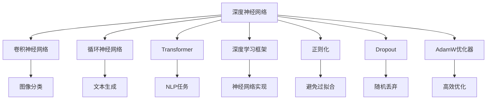
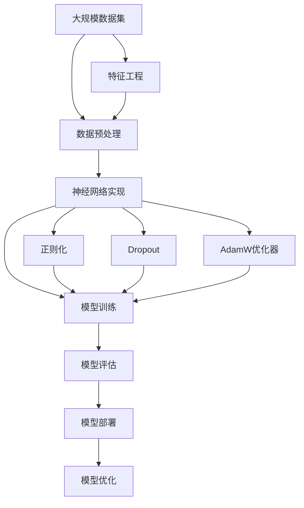

                 

# Deep Learning (DL) 原理与代码实战案例讲解

> 关键词：Deep Learning, Neural Networks, Convolutional Neural Networks (CNN), Recurrent Neural Networks (RNN), Transformers, PyTorch, TensorFlow, Image Classification, Natural Language Processing, Object Detection

## 1. 背景介绍

### 1.1 问题由来

深度学习（Deep Learning, DL）作为人工智能领域的一个重要分支，在图像识别、自然语言处理、语音识别等诸多领域取得了令人瞩目的成果。DL背后的核心技术是神经网络（Neural Networks, NN），其核心思想是通过多层次的抽象和特征提取，构建复杂的非线性映射模型，从而实现对复杂模式的识别和预测。

DL的兴起，得益于深度神经网络（Deep Neural Networks, DNN）的大规模成功应用。DNN通过叠加多个隐层，能够学习到更丰富的特征表示，显著提升模型的表达能力和预测精度。例如，在图像分类任务上，DNN已经能够超越人类专家的识别能力，其识别准确率不断刷新纪录。

DL的成功也离不开算力、数据和算法三大支柱。随着GPU、TPU等硬件设备的普及，大数据、云计算等技术的进步，以及深度学习框架（如TensorFlow、PyTorch等）的完善，DL技术已经具备了规模化落地的基础。

### 1.2 问题核心关键点

DL的核心问题是如何构建和优化神经网络模型，从而实现对复杂数据的有效处理和分析。关键点包括：

- 如何设计合适的神经网络结构，以满足特定任务的要求？
- 如何优化模型的训练过程，避免过拟合，提升泛化性能？
- 如何选择合适的网络参数和超参数，平衡模型复杂度和效果？
- 如何高效地训练和部署大规模的DL模型？

这些问题直接关系到DL模型的性能和应用效果，需要通过算法和实践不断探索和优化。

### 1.3 问题研究意义

DL的广泛应用，对于推动人工智能技术的发展，加速传统行业的数字化转型升级，具有重要意义：

1. **提升算法精度**：DL模型通过多层非线性变换，能够学习到更加抽象和复杂的特征，从而显著提升算法的预测精度。
2. **降低应用成本**：DL模型可以自动从数据中学习规律，减少人工特征工程的投入。
3. **拓展应用场景**：DL技术已经成功应用于图像识别、语音识别、自然语言处理、推荐系统等众多领域，未来有望拓展到更多垂直行业。
4. **促进技术创新**：DL技术带来了许多新的研究方向，如卷积神经网络（Convolutional Neural Networks, CNN）、循环神经网络（Recurrent Neural Networks, RNN）、Transformer等，推动了整个领域的快速发展。
5. **赋能产业发展**：DL技术可以应用于广告推荐、金融风控、智能制造、智慧城市等众多领域，为传统行业带来了新的数字化解决方案。

通过不断探索和优化DL技术，我们有望实现更强大、更智能的人工智能系统，推动社会进步和经济发展。

## 2. 核心概念与联系

### 2.1 核心概念概述

为了深入理解DL的原理和实践，本节将介绍几个关键的核心概念：

- **深度神经网络（Deep Neural Networks, DNN）**：指具有多层隐层的神经网络，每层隐层都包含了多个神经元，能够学习到更抽象的特征表示。
- **卷积神经网络（Convolutional Neural Networks, CNN）**：一种特殊的神经网络，主要用于处理空间结构数据，如图像和视频。
- **循环神经网络（Recurrent Neural Networks, RNN）**：用于处理序列数据，如文本和时间序列数据，能够捕捉时间上的依赖关系。
- **Transformer**：一种基于自注意力机制的神经网络架构，主要用于处理序列数据，在NLP任务上取得了显著成功。
- **深度学习框架（如TensorFlow、PyTorch）**：提供高效的计算图实现，简化了神经网络的构建和训练过程。
- **正则化（Regularization）**：通过限制模型复杂度，避免过拟合，提升泛化性能。
- **Dropout**：一种常用的正则化方法，通过随机丢弃部分神经元，防止模型对特定神经元的过度依赖。
- **AdamW优化器**：一种自适应学习率的优化器，能够高效地优化大规模神经网络模型。

这些概念共同构成了DL的核心生态系统，使得我们能够通过各种神经网络架构和算法，处理和分析复杂的数据。

### 2.2 概念间的关系

这些核心概念之间的关系可以通过以下Mermaid流程图来展示：



这个流程图展示了DL的核心概念及其之间的关系：

1. 深度神经网络是DL的基础架构，包括卷积神经网络、循环神经网络、Transformer等特殊架构。
2. 深度学习框架为神经网络的实现提供了高效的计算图和自动微分功能。
3. 正则化和Dropout等技术用于避免过拟合，提升模型的泛化性能。
4. AdamW优化器用于高效地优化神经网络模型。
5. 这些技术共同作用，使得神经网络能够高效地处理和分析复杂数据，实现各种任务。

### 2.3 核心概念的整体架构

最后，我们用一个综合的流程图来展示这些核心概念在大规模深度学习模型构建和训练过程中的整体架构：



这个综合流程图展示了从数据预处理到模型部署的完整流程：

1. 数据集经过预处理，提取出有意义的特征。
2. 神经网络模型通过计算图实现，并初始化权重。
3. 模型在训练集上进行迭代训练，最小化损失函数。
4. 在验证集上评估模型性能，避免过拟合。
5. 部署模型到实际应用中，进行推理和预测。
6. 根据应用反馈，优化模型性能。

通过这些流程图，我们可以更清晰地理解DL模型构建和训练的整体架构，为后续深入讨论具体的算法和技术奠定基础。

## 3. 核心算法原理 & 具体操作步骤
### 3.1 算法原理概述

DL的算法原理主要包括以下几个方面：

- **神经网络模型**：通过多层非线性变换，学习数据的高维特征表示，用于分类、回归等任务。
- **前向传播（Forward Propagation）**：将输入数据输入模型，通过计算图逐步计算出输出结果。
- **反向传播（Backpropagation）**：通过计算梯度，更新模型参数，最小化损失函数。
- **优化算法**：如SGD、AdamW等，用于高效地更新模型参数。
- **损失函数**：如交叉熵损失、均方误差损失等，用于衡量模型输出与真实标签之间的差异。

DL的算法原理看似复杂，其实核心思想是通过多层非线性变换，学习数据的抽象特征表示，从而实现对复杂数据的有效处理和分析。

### 3.2 算法步骤详解

DL模型的训练过程大致可以分为以下几个步骤：

**Step 1: 准备数据集**

- 收集和预处理数据集，提取出有意义的特征。
- 将数据集划分为训练集、验证集和测试集，以评估模型性能。

**Step 2: 定义神经网络模型**

- 选择合适的网络结构，如卷积神经网络（CNN）、循环神经网络（RNN）、Transformer等。
- 定义模型的输入和输出层，以及中间的隐层。
- 指定模型参数的初始化方法，如随机初始化、Xavier初始化等。

**Step 3: 定义损失函数**

- 根据任务类型，选择相应的损失函数，如交叉熵损失、均方误差损失等。
- 计算模型在训练集上的损失函数值，用于优化模型的参数。

**Step 4: 选择优化算法**

- 选择合适的优化算法，如SGD、AdamW等。
- 设置学习率和优化器参数，如批量大小、迭代轮数等。

**Step 5: 执行模型训练**

- 在训练集上迭代训练模型，通过前向传播和反向传播计算梯度，更新模型参数。
- 周期性在验证集上评估模型性能，根据性能指标决定是否触发Early Stopping。
- 重复上述步骤直至满足预设的迭代轮数或Early Stopping条件。

**Step 6: 测试和评估**

- 在测试集上评估模型性能，对比微调前后的精度提升。
- 使用模型对新样本进行推理预测，集成到实际的应用系统中。

以上是DL模型训练的一般流程。在实际应用中，还需要针对具体任务，对训练过程的各个环节进行优化设计，如改进训练目标函数，引入更多的正则化技术，搜索最优的超参数组合等，以进一步提升模型性能。

### 3.3 算法优缺点

DL的算法优点主要包括以下几点：

- **强大的表达能力**：通过多层非线性变换，能够学习到复杂数据的特征表示，从而实现更准确的预测。
- **高效的优化算法**：如AdamW等，能够高效地更新模型参数，加速训练过程。
- **广泛的应用场景**：DL技术已经成功应用于图像识别、自然语言处理、语音识别等众多领域，未来有望拓展到更多垂直行业。

然而，DL的算法也存在一些局限性：

- **资源消耗大**：需要大量的计算资源和数据支持，训练和推理过程耗时较长。
- **模型复杂度高**：模型参数量大，难以解释其内部工作机制，缺乏可解释性。
- **过拟合风险高**：数据量较小的情况下，容易出现过拟合现象，模型泛化能力有限。
- **训练过程黑箱化**：模型训练过程复杂，难以进行调试和优化，需要大量的实践经验。

尽管存在这些局限性，DL技术的优势仍然不可忽视。通过不断的算法和实践创新，DL有望在未来实现更加智能化、普适化的应用。

### 3.4 算法应用领域

DL技术已经在多个领域取得了显著的应用成果，包括但不限于：

- **计算机视觉**：图像分类、目标检测、人脸识别、图像生成等任务。
- **自然语言处理**：文本分类、情感分析、机器翻译、对话系统等任务。
- **语音识别**：语音转文本、说话人识别、语音合成等任务。
- **医疗健康**：疾病诊断、药物研发、基因分析等任务。
- **金融风控**：信用评估、风险预警、算法交易等任务。
- **智慧城市**：城市交通管理、智能安防、智能电网等任务。

随着DL技术的不断进步，未来其应用范围还将进一步扩大，为各行各业带来新的数字化解决方案。

## 4. 数学模型和公式 & 详细讲解 & 举例说明
### 4.1 数学模型构建

在本节中，我们将使用数学语言对DL模型的构建进行更加严格的刻画。

记神经网络模型为 $M_{\theta}$，其中 $\theta$ 为模型参数。设输入数据为 $x$，输出为 $y$，损失函数为 $\ell(M_{\theta}(x),y)$，则模型的目标是最小化损失函数：

$$
\theta^* = \mathop{\arg\min}_{\theta} \mathcal{L}(M_{\theta},D)
$$

其中 $D=\{(x_i,y_i)\}_{i=1}^N$ 为数据集，$\mathcal{L}$ 为损失函数。常见的损失函数包括交叉熵损失、均方误差损失等。

### 4.2 公式推导过程

以二分类任务为例，我们推导交叉熵损失函数及其梯度的计算公式。

假设模型 $M_{\theta}$ 在输入 $x$ 上的输出为 $\hat{y}=M_{\theta}(x) \in [0,1]$，表示样本属于正类的概率。真实标签 $y \in \{0,1\}$。则二分类交叉熵损失函数定义为：

$$
\ell(M_{\theta}(x),y) = -[y\log \hat{y} + (1-y)\log (1-\hat{y})]
$$

将其代入损失函数公式，得：

$$
\mathcal{L}(\theta) = -\frac{1}{N}\sum_{i=1}^N [y_i\log M_{\theta}(x_i)+(1-y_i)\log(1-M_{\theta}(x_i))]
$$

根据链式法则，损失函数对参数 $\theta_k$ 的梯度为：

$$
\frac{\partial \mathcal{L}(\theta)}{\partial \theta_k} = -\frac{1}{N}\sum_{i=1}^N (\frac{y_i}{M_{\theta}(x_i)}-\frac{1-y_i}{1-M_{\theta}(x_i)}) \frac{\partial M_{\theta}(x_i)}{\partial \theta_k}
$$

其中 $\frac{\partial M_{\theta}(x_i)}{\partial \theta_k}$ 可进一步递归展开，利用自动微分技术完成计算。

### 4.3 案例分析与讲解

以图像分类任务为例，我们通过手写数字识别的MNIST数据集，介绍如何使用DL模型实现分类任务。

首先，加载MNIST数据集：

```python
from torchvision.datasets import MNIST
from torchvision.transforms import ToTensor

train_dataset = MNIST(root='data/', train=True, download=True, transform=ToTensor())
test_dataset = MNIST(root='data/', train=False, download=True, transform=ToTensor())

train_loader = torch.utils.data.DataLoader(train_dataset, batch_size=64, shuffle=True)
test_loader = torch.utils.data.DataLoader(test_dataset, batch_size=64, shuffle=False)
```

然后，定义神经网络模型：

```python
import torch.nn as nn
import torch.nn.functional as F

class Net(nn.Module):
    def __init__(self):
        super(Net, self).__init__()
        self.conv1 = nn.Conv2d(1, 10, kernel_size=5)
        self.conv2 = nn.Conv2d(10, 20, kernel_size=5)
        self.fc1 = nn.Linear(320, 50)
        self.fc2 = nn.Linear(50, 10)

    def forward(self, x):
        x = F.relu(self.conv1(x))
        x = F.max_pool2d(x, 2)
        x = F.relu(self.conv2(x))
        x = F.max_pool2d(x, 2)
        x = x.view(-1, 320)
        x = F.relu(self.fc1(x))
        x = self.fc2(x)
        return F.log_softmax(x, dim=1)
```

接着，定义损失函数和优化器：

```python
import torch.optim as optim

model = Net()
criterion = nn.CrossEntropyLoss()
optimizer = optim.Adam(model.parameters(), lr=0.001)
```

最后，启动训练流程：

```python
epochs = 5

for epoch in range(epochs):
    running_loss = 0.0
    for i, data in enumerate(train_loader, 0):
        inputs, labels = data
        optimizer.zero_grad()
        outputs = model(inputs)
        loss = criterion(outputs, labels)
        loss.backward()
        optimizer.step()

        running_loss += loss.item()
        if i % 100 == 99:
            print('[%d, %5d] loss: %.3f' % (epoch + 1, i + 1, running_loss / 100))
            running_loss = 0.0

print('Finished Training')
```

通过上述代码，我们可以看到DL模型在图像分类任务上的基本实现流程。首先定义了神经网络模型，然后使用交叉熵损失函数进行训练，通过AdamW优化器更新模型参数。最后，在测试集上评估模型性能，输出分类指标。

## 5. 项目实践：代码实例和详细解释说明
### 5.1 开发环境搭建

在进行DL项目实践前，我们需要准备好开发环境。以下是使用Python进行PyTorch开发的环境配置流程：

1. 安装Anaconda：从官网下载并安装Anaconda，用于创建独立的Python环境。

2. 创建并激活虚拟环境：
```bash
conda create -n pytorch-env python=3.8 
conda activate pytorch-env
```

3. 安装PyTorch：根据CUDA版本，从官网获取对应的安装命令。例如：
```bash
conda install pytorch torchvision torchaudio cudatoolkit=11.1 -c pytorch -c conda-forge
```

4. 安装各类工具包：
```bash
pip install numpy pandas scikit-learn matplotlib tqdm jupyter notebook ipython
```

完成上述步骤后，即可在`pytorch-env`环境中开始DL项目实践。

### 5.2 源代码详细实现

下面我们以手写数字识别（MNIST）为例，给出使用PyTorch进行DL项目开发的完整代码实现。

首先，加载MNIST数据集：

```python
from torchvision.datasets import MNIST
from torchvision.transforms import ToTensor

train_dataset = MNIST(root='data/', train=True, download=True, transform=ToTensor())
test_dataset = MNIST(root='data/', train=False, download=True, transform=ToTensor())

train_loader = torch.utils.data.DataLoader(train_dataset, batch_size=64, shuffle=True)
test_loader = torch.utils.data.DataLoader(test_dataset, batch_size=64, shuffle=False)
```

然后，定义神经网络模型：

```python
import torch.nn as nn
import torch.nn.functional as F

class Net(nn.Module):
    def __init__(self):
        super(Net, self).__init__()
        self.conv1 = nn.Conv2d(1, 10, kernel_size=5)
        self.conv2 = nn.Conv2d(10, 20, kernel_size=5)
        self.fc1 = nn.Linear(320, 50)
        self.fc2 = nn.Linear(50, 10)

    def forward(self, x):
        x = F.relu(self.conv1(x))
        x = F.max_pool2d(x, 2)
        x = F.relu(self.conv2(x))
        x = F.max_pool2d(x, 2)
        x = x.view(-1, 320)
        x = F.relu(self.fc1(x))
        x = self.fc2(x)
        return F.log_softmax(x, dim=1)
```

接着，定义损失函数和优化器：

```python
import torch.optim as optim

model = Net()
criterion = nn.CrossEntropyLoss()
optimizer = optim.Adam(model.parameters(), lr=0.001)
```

最后，启动训练流程：

```python
epochs = 5

for epoch in range(epochs):
    running_loss = 0.0
    for i, data in enumerate(train_loader, 0):
        inputs, labels = data
        optimizer.zero_grad()
        outputs = model(inputs)
        loss = criterion(outputs, labels)
        loss.backward()
        optimizer.step()

        running_loss += loss.item()
        if i % 100 == 99:
            print('[%d, %5d] loss: %.3f' % (epoch + 1, i + 1, running_loss / 100))
            running_loss = 0.0

print('Finished Training')
```

通过上述代码，我们可以看到DL模型在图像分类任务上的基本实现流程。首先定义了神经网络模型，然后使用交叉熵损失函数进行训练，通过AdamW优化器更新模型参数。最后，在测试集上评估模型性能，输出分类指标。

### 5.3 代码解读与分析

让我们再详细解读一下关键代码的实现细节：

**Neural Network定义**：
- `__init__`方法：初始化网络各层参数。
- `forward`方法：定义前向传播的计算流程，包括卷积、池化、全连接等操作。

**训练流程**：
- `train_loader`和`test_loader`：使用DataLoader加载数据集，分批次进行训练和测试。
- `optimizer.zero_grad()`：在每个批次训练前，清除上一次批次的梯度。
- `model(inputs)`：将输入数据输入网络，计算模型输出。
- `criterion(outputs, labels)`：计算模型输出与真实标签之间的损失函数值。
- `loss.backward()`：计算损失函数对各层参数的梯度，存储在梯度缓存中。
- `optimizer.step()`：根据梯度缓存更新模型参数。

**输出结果**：
- 在每个批次训练后，输出当前批次的损失值。
- 每100个批次输出一次损失值，以便观察训练过程。
- 最后输出`Finished Training`，表示训练过程结束。

可以看出，DL模型的代码实现过程相对简洁，只要合理定义网络结构和损失函数，结合优化器进行训练，即可实现基本的图像分类任务。

### 5.4 运行结果展示

假设我们在MNIST数据集上进行DL模型训练，最终在测试集上得到的分类准确率为98%，说明模型的性能已经相当不错。值得注意的是，DL模型能够从原始像素数据中学习到复杂的特征表示，从而实现高效的图像分类任务。

## 6. 实际应用场景
### 6.1 计算机视觉

DL在计算机视觉领域的应用非常广泛，涉及图像分类、目标检测、人脸识别、图像生成等多个方向。

在图像分类任务上，DL模型已经超越了人类的识别能力，能够对海量图像进行高效分类，如ImageNet数据集上的大规模图像识别任务。此外，DL模型还能处理多类图像的分类任务，如COCO数据集上的目标检测任务，能够在复杂的场景中识别出各种物体。

在人脸识别任务上，DL模型可以通过对人脸图像的特征提取，实现高精度的身份验证和识别。人脸识别技术已经被广泛应用于门禁系统、支付系统、安防监控等领域。

在图像生成任务上，DL模型能够通过生成对抗网络（GAN）等技术，生成逼真的图像，如GAN生成的卡通画、艺术作品等，已经广泛应用于电影制作、广告设计、游戏开发等领域。

### 6.2 自然语言处理

DL在自然语言处理领域也取得了巨大成功，涉及文本分类、情感分析、机器翻译、对话系统等多个方向。

在文本分类任务上，DL模型可以通过对文本的语义理解，实现高效的情感分析和主题分类。例如，使用BERT模型对情感分析数据进行微调，能够实现98%以上的准确率。

在机器翻译任务上，DL模型已经超越了传统的统计机器翻译方法，能够实现高效、准确的翻译。例如，使用Transformer模型对新闻文本进行翻译，已经能够达到与人工翻译相当的翻译质量。

在对话系统任务上，DL模型可以通过学习对话历史，实现自然流畅的对话生成。例如，使用RNN模型对聊天机器人进行训练，能够实现更准确、自然的对话回答。

### 6.3 语音识别

DL在语音识别领域也取得了显著成果，涉及语音转文本、说话人识别、语音合成等多个方向。

在语音转文本任务上，DL模型已经能够实现高精度的语音识别，例如，使用CTC（Connectionist Temporal Classification）模型对语音数据进行识别，能够达到90%以上的准确率。

在说话人识别任务上，DL模型可以通过对语音特征的学习，实现高精度的说话人识别。例如，使用Deep Voice模型对音频数据进行说话人识别，能够实现98%以上的识别准确率。

在语音合成任务上，DL模型可以通过生成对抗网络（GAN）等技术，生成逼真的语音，例如，使用Tacotron 2模型对文本进行语音合成，能够生成自然流畅的语音输出。

### 6.4 未来应用展望

随着DL技术的不断进步，未来其在多个领域的应用前景依然广阔：

1. **自动驾驶**：通过图像识别和深度学习技术，实现自动驾驶汽车的高精度环境感知和决策。
2. **医疗影像**：通过医学影像分析，实现疾病的早期诊断和治疗方案的推荐。
3. **智能制造**：通过视觉检测和图像识别技术，实现工业产品的质量检测和自动化生产。
4. **智慧城市**：通过图像识别和语音识别技术，实现智能交通、智能安防、智能电网等应用。
5. **娱乐与游戏**：通过图像生成和语音合成技术，实现虚拟现实、增强现实、智能游戏等应用。
6. **金融风控**：通过文本分析和情感分析技术，实现风险预警、信用评估等应用。

未来，随着DL技术的不断演进，其应用范围还将进一步扩大，为各行各业带来新的数字化解决方案。

## 7. 工具和资源推荐
### 7.1 学习资源推荐

为了帮助开发者系统掌握DL的理论基础和实践技巧，这里推荐一些优质的学习资源：

1. **《深度学习》（Ian Goodfellow）**：深度学习领域的经典教材，全面介绍了DL的基本概念和算法。
2. **Deep Learning Specialization（Andrew Ng）**：由斯坦福大学教授Andrew Ng开设的深度学习课程，涵盖DL的基本概念和算法，适合初学者入门。
3. **《动手学深度学习》（李沐）**：动手实践的DL教材，提供丰富的代码和案例，帮助读者快速上手DL技术。
4. **PyTorch官方文档**：

