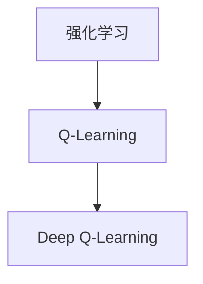

                 

# Deep Q-Learning原理与代码实例讲解

> 关键词：Deep Q-Learning, Q-learning, 强化学习, 深度学习, 代码实例, TensorFlow, PyTorch

## 1. 背景介绍

### 1.1 问题由来
在人工智能（AI）的快速发展的背景下，强化学习（Reinforcement Learning, RL）作为一个重要的分支，正逐步从理论走向实际应用。在RL中，一种经典的模型是Q-Learning，它主要通过强化信号来训练智能体，使其最大化长期奖励。然而，传统的Q-Learning算法在处理复杂环境时，计算量巨大，难以实际应用。为此，Deep Q-Learning（DQL）应运而生，利用深度神经网络来近似Q函数，大大提高了计算效率。

### 1.2 问题核心关键点
DQL将深度神经网络和Q-Learning结合，使智能体能够学习到高维状态空间和连续动作空间的复杂策略。与传统Q-Learning相比，DQL具有以下优势：
- **计算效率高**：通过神经网络逼近Q函数，避免了大量的状态值计算。
- **处理高维状态空间**：深度神经网络可以处理高维连续状态空间，而传统Q-Learning难以处理。
- **连续动作空间**：DQL可以处理连续动作空间，而传统Q-Learning只能处理离散动作空间。

DQL广泛应用于游戏AI、机器人控制、自动驾驶等领域，取得了显著成果。

### 1.3 问题研究意义
DQL的发展，对AI的实际应用具有重要的推动作用。它不仅提升了RL算法的效率和可扩展性，还为复杂环境下的决策优化提供了新的思路。此外，DQL在实际应用中，能够适应不同环境的变化，通过不断的学习和调整，实现更加精确的决策。

## 2. 核心概念与联系

### 2.1 核心概念概述

为了更好地理解DQL，首先需要介绍几个核心概念：

- **强化学习（Reinforcement Learning, RL）**：是一种学习框架，通过与环境交互，智能体根据当前状态和动作，获得奖励信号，从而不断优化其策略，以最大化长期奖励。
- **Q-Learning**：是一种基于值的RL算法，通过近似估计Q函数来优化策略。Q函数表示在给定状态下采取某动作所能获得的预期奖励。
- **深度Q-Learning（Deep Q-Learning, DQL）**：将神经网络应用于Q-Learning中，通过神经网络逼近Q函数，实现对复杂状态和动作空间的优化。

这些概念之间的联系可以用以下Mermaid流程图来表示：



这个流程图展示了强化学习和Q-Learning的关系，以及DQL在Q-Learning的基础上进一步发展。

### 2.2 概念间的关系

DQL作为强化学习的一个分支，是基于传统Q-Learning的延伸和发展。它利用深度神经网络，通过深度学习的方式近似Q函数，从而实现对复杂环境的高效学习。

在DQL中，Q函数被表示为一个深度神经网络，其输入为状态s，输出为在当前状态下采取不同动作a所能获得的预期奖励q(s, a)。因此，DQL的目标是最大化该神经网络输出，即最大化Q(s, a)，从而优化智能体的策略。

## 3. 核心算法原理 & 具体操作步骤
### 3.1 算法原理概述

DQL的原理可以简要概括为：通过神经网络逼近Q函数，优化策略使得智能体能够最大化长期奖励。

具体而言，DQL的训练过程包括以下几个步骤：

1. 初始化神经网络。
2. 将状态s作为输入，通过神经网络计算Q(s, a)，即预期奖励。
3. 根据环境反馈，计算实际奖励r和下一个状态s'。
4. 使用目标策略π(a|s')，选择下一个动作a'。
5. 计算经验回放TD误差，即目标值Q(s', a')与当前值Q(s, a)的差值。
6. 使用反向传播算法，更新神经网络参数，最小化TD误差。

重复上述步骤，直到收敛或达到预设的迭代次数。

### 3.2 算法步骤详解

以下是DQL的详细步骤，结合了TensorFlow的实现代码：

```python
import tensorflow as tf

# 初始化神经网络
def build_model(input_shape, output_shape):
    model = tf.keras.Sequential([
        tf.keras.layers.Dense(256, activation='relu', input_shape=input_shape),
        tf.keras.layers.Dense(256, activation='relu'),
        tf.keras.layers.Dense(output_shape)
    ])
    return model

# 训练DQL模型
def train_model(model, state, action, reward, next_state, next_action, discount_factor, batch_size, learning_rate):
    for i in range(batch_size):
        s = state[i]
        a = action[i]
        r = reward[i]
        s_next = next_state[i]
        a_next = next_action[i]
        
        # 计算当前状态下的Q值
        q_s_a = model.predict(tf.expand_dims(s, axis=0))
        
        # 计算下一个状态下的Q值
        q_s_next_a_next = model.predict(tf.expand_dims(s_next, axis=0))
        
        # 计算TD误差
        td_error = r + discount_factor * np.amax(q_s_next_a_next) - q_s_a
        
        # 使用梯度下降算法更新模型参数
        model.trainable = True
        model.train_on_batch(tf.expand_dims(s, axis=0), tf.expand_dims(q_s_a, axis=0))
        model.trainable = False
        
        # 更新模型参数
        grads = tf.gradients(td_error, model.trainable_variables)
        optimizer.apply_gradients(zip(grads, model.trainable_variables))
        
    return model
```

### 3.3 算法优缺点

DQL的主要优点包括：

- **高效性**：通过神经网络逼近Q函数，大大提高了计算效率。
- **适应复杂环境**：深度神经网络能够处理高维连续状态空间和连续动作空间。
- **可扩展性**：能够处理大规模状态和动作空间。

然而，DQL也存在一些缺点：

- **过拟合**：神经网络可能过拟合训练数据，导致泛化能力下降。
- **训练难度大**：需要大量的数据和计算资源。
- **易受状态表示影响**：状态表示方式的不同，可能会影响训练结果。

### 3.4 算法应用领域

DQL在多个领域都有广泛的应用，包括：

- **游戏AI**：在AlphaGo中，DQL被用来训练复杂的决策策略。
- **机器人控制**：DQL在机器人导航、操作等领域取得了重要进展。
- **自动驾驶**：通过DQL优化决策策略，实现更加安全的驾驶。
- **经济预测**：DQL在股票市场预测、交易策略优化等领域有潜在应用。

## 4. 数学模型和公式 & 详细讲解
### 4.1 数学模型构建

在DQL中，Q函数被表示为一个深度神经网络。假设神经网络有$n$层，其输入为状态$s$，输出为在当前状态下采取不同动作$a$所能获得的预期奖励$Q(s, a)$。神经网络中的每一层都由一个线性变换和一个非线性激活函数构成。

神经网络的数学表达式如下：

$$
Q(s, a) = W_n \sigma(W_{n-1} \sigma(\cdots W_1 \sigma(X))) + b_n
$$

其中，$W$和$b$为神经网络的权重和偏置，$\sigma$为激活函数，$X$为状态$s$的表示。

### 4.2 公式推导过程

假设智能体在一个马尔可夫决策过程中，状态为$s$，采取动作$a$，获得奖励$r$，进入下一个状态$s'$。智能体的目标是通过训练神经网络，最大化Q函数：

$$
Q(s, a) = \mathbb{E}[\sum_{t=0}^{T} \gamma^t r_t | s_0=a]
$$

其中，$\gamma$为折扣因子，$T$为终止状态。

在DQL中，目标Q函数被表示为：

$$
Q(s, a) = r + \gamma \max_a Q(s', a')
$$

其中，$s'$为下一个状态，$a'$为下一个动作，$\max_a Q(s', a')$表示在下一个状态下，智能体采取最优动作所能获得的最大Q值。

DQL的目标是最大化目标Q函数的值，即：

$$
\max_{\theta} \mathbb{E}_{s \sim P} [Q_{\theta}(s, \pi(a|s))]
$$

其中，$\theta$为神经网络参数，$\pi(a|s)$为目标策略。

### 4.3 案例分析与讲解

假设智能体在一个简单的网格世界中，有四个状态和一个动作空间。智能体的目标是尽可能快地到达目标状态。

在DQL中，可以将每个状态表示为一个向量，例如$s_1=[1, 0, 0, 0]$，表示智能体处于第一列。动作空间为向右、向上、向下、向左四个方向。目标Q函数可以表示为一个深度神经网络：

$$
Q(s, a) = \begin{bmatrix}
W_{\text{Q}} & W_{\text{Q}}
\end{bmatrix}
\begin{bmatrix}
\sigma(W_{\text{H}} s) \\
\sigma(W_{\text{H}} s)
\end{bmatrix}
$$

其中，$W_{\text{Q}}$和$W_{\text{H}}$为神经网络的权重。

假设智能体采取动作$a$，进入状态$s'$，获得奖励$r$，智能体的目标是通过反向传播算法，最小化目标Q函数与实际Q函数的差值，更新神经网络参数：

$$
\begin{aligned}
\min_{\theta} & \sum_{s \sim P} \big| Q_{\theta}(s, a) - (r + \gamma \max_{a'} Q_{\theta}(s', a')) \big|
\end{aligned}
$$

通过上述公式，智能体可以不断优化其策略，从而最大化长期奖励。

## 5. 项目实践：代码实例和详细解释说明
### 5.1 开发环境搭建

在进行DQL实践前，需要先准备好开发环境。以下是使用TensorFlow进行DQL开发的环境配置流程：

1. 安装TensorFlow：
```bash
pip install tensorflow
```

2. 安装相关依赖：
```bash
pip install numpy matplotlib
```

### 5.2 源代码详细实现

以下是使用TensorFlow实现DQL的示例代码，包含神经网络构建、训练和评估等步骤：

```python
import tensorflow as tf

# 初始化神经网络
def build_model(input_shape, output_shape):
    model = tf.keras.Sequential([
        tf.keras.layers.Dense(256, activation='relu', input_shape=input_shape),
        tf.keras.layers.Dense(256, activation='relu'),
        tf.keras.layers.Dense(output_shape)
    ])
    return model

# 训练DQL模型
def train_model(model, state, action, reward, next_state, next_action, discount_factor, batch_size, learning_rate):
    for i in range(batch_size):
        s = state[i]
        a = action[i]
        r = reward[i]
        s_next = next_state[i]
        a_next = next_action[i]
        
        # 计算当前状态下的Q值
        q_s_a = model.predict(tf.expand_dims(s, axis=0))
        
        # 计算下一个状态下的Q值
        q_s_next_a_next = model.predict(tf.expand_dims(s_next, axis=0))
        
        # 计算TD误差
        td_error = r + discount_factor * np.amax(q_s_next_a_next) - q_s_a
        
        # 使用梯度下降算法更新模型参数
        model.trainable = True
        model.train_on_batch(tf.expand_dims(s, axis=0), tf.expand_dims(q_s_a, axis=0))
        model.trainable = False
        
        # 更新模型参数
        grads = tf.gradients(td_error, model.trainable_variables)
        optimizer.apply_gradients(zip(grads, model.trainable_variables))
        
    return model

# 使用DQL解决迷宫问题
def play_game(model, state_shape, action_space, discount_factor, max_episodes):
    rewards = []
    for i in range(max_episodes):
        state = state_shape[0]
        s = tf.constant(state)
        while True:
            # 计算当前状态下的Q值
            q_s_a = model.predict(tf.expand_dims(s, axis=0))
            
            # 选择动作
            a = np.argmax(q_s_a[0])
            s_next = (state + a) % 4
            
            # 计算奖励
            r = 0 if state == s_next else 1
            
            # 更新状态
            state = s_next
            
            # 如果达到终止状态，跳出循环
            if state == 3:
                rewards.append(reward)
                break
        
        # 将奖励累加到总奖励中
        rewards[i] += np.sum(rewards)
        
        # 计算平均奖励
        average_reward = np.mean(rewards)
        print(f"Episode {i+1}, Average Reward: {average_reward}")
        
    return average_reward
```

### 5.3 代码解读与分析

让我们再详细解读一下关键代码的实现细节：

**build_model函数**：
- 定义神经网络的架构，包括输入层、隐藏层和输出层，使用ReLU激活函数。

**train_model函数**：
- 使用目标状态、动作、奖励、下一个状态和下一个动作进行训练。
- 使用反向传播算法更新模型参数，最小化目标值和实际值的差值。

**play_game函数**：
- 定义迷宫游戏，智能体通过状态和动作选择进行移动，最大化奖励。
- 重复多次游戏，统计平均奖励。

## 6. 实际应用场景
### 6.1 游戏AI

DQL在游戏AI领域取得了巨大成功，被广泛应用于围棋、星际争霸等游戏中。AlphaGo就是一个典型的例子，通过DQL训练的策略网络，AlphaGo能够在大规模搜索空间中找到最优决策，击败世界顶尖围棋高手。

### 6.2 机器人控制

DQL在机器人控制中也有广泛应用，例如在机器人导航、路径规划等领域。通过DQL训练的智能体，可以学习到如何在复杂环境中进行决策，从而实现自主控制。

### 6.3 自动驾驶

DQL在自动驾驶中也得到了应用，例如在车辆路径规划、交通信号控制等领域。通过DQL训练的智能体，可以学习到如何在不同的交通环境下做出最优决策，提高驾驶安全性。

### 6.4 未来应用展望

未来，DQL将在更多领域得到应用，为人类带来更多便利和创新。例如：

- **医疗领域**：通过DQL训练的智能体，可以帮助医生进行手术规划、药物推荐等任务。
- **金融领域**：通过DQL训练的智能体，可以进行股票交易策略优化、风险管理等任务。
- **教育领域**：通过DQL训练的智能体，可以辅助教师进行学生评估、个性化教育等任务。

## 7. 工具和资源推荐
### 7.1 学习资源推荐

为了帮助开发者系统掌握DQL的理论基础和实践技巧，这里推荐一些优质的学习资源：

1. 《深度学习》一书：深度学习领域的经典之作，详细介绍了深度学习和强化学习的相关知识。
2. 《强化学习》一书：介绍强化学习的理论和算法，包括Q-Learning、DQL等。
3. 《Deep Q-Learning in Action》一书：介绍DQL的实际应用和实践技巧，包含大量代码示例。
4. 《Reinforcement Learning in Python》一书：介绍RL的Python实现，包含DQL的代码示例。
5. arXiv论文预印本：人工智能领域最新研究成果的发布平台，包括大量尚未发表的前沿工作，学习前沿技术的必读资源。

通过这些资源的学习实践，相信你一定能够快速掌握DQL的精髓，并用于解决实际的强化学习问题。

### 7.2 开发工具推荐

高效的开发离不开优秀的工具支持。以下是几款用于DQL开发的常用工具：

1. TensorFlow：基于Python的开源深度学习框架，灵活动态的计算图，适合快速迭代研究。
2. PyTorch：基于Python的开源深度学习框架，动态计算图，适合高效优化。
3. OpenAI Gym：用于测试和开发强化学习算法的Python环境，包含大量环境。
4. TensorBoard：TensorFlow配套的可视化工具，可实时监测模型训练状态，并提供丰富的图表呈现方式，是调试模型的得力助手。

合理利用这些工具，可以显著提升DQL任务的开发效率，加快创新迭代的步伐。

### 7.3 相关论文推荐

DQL的发展源于学界的持续研究。以下是几篇奠基性的相关论文，推荐阅读：

1. 《Playing Atari with Deep Reinforcement Learning》：DeepMind首次提出使用DQL训练游戏AI，取得了显著成果。
2. 《Human-level Control through Deep Reinforcement Learning》：AlphaGo使用DQL训练的策略网络，击败世界顶尖围棋选手。
3. 《Deep Multi-Agent Reinforcement Learning》：介绍多智能体DQL的训练方法和应用，包含大量代码示例。

这些论文代表了大Q-Learning的发展脉络。通过学习这些前沿成果，可以帮助研究者把握学科前进方向，激发更多的创新灵感。

## 8. 总结：未来发展趋势与挑战
### 8.1 研究成果总结

DQL作为强化学习的一个分支，利用深度神经网络逼近Q函数，在处理复杂环境时表现优异。它在游戏AI、机器人控制、自动驾驶等领域取得了重要进展。DQL的计算效率高、处理复杂环境能力强，是未来强化学习的重要方向。

### 8.2 未来发展趋势

未来，DQL将在多个领域得到应用，并不断拓展其应用范围。以下是DQL的发展趋势：

1. **多智能体DQL**：多个智能体之间的协作与竞争，将推动DQL在复杂环境中的应用。
2. **混合型强化学习**：结合深度学习和传统强化学习算法，提高DQL的性能和可扩展性。
3. **元学习**：通过元学习算法，DQL可以快速适应新任务，提升泛化能力。
4. **在线学习**：DQL在在线环境中进行学习，动态适应变化的环境，提高实时性。
5. **跨模态学习**：结合视觉、语音、文本等多模态数据，DQL将具备更全面的感知能力。

### 8.3 面临的挑战

尽管DQL已经取得了显著成果，但在实际应用中，仍面临一些挑战：

1. **数据需求大**：DQL需要大量的数据进行训练，数据获取和标注成本高。
2. **过拟合问题**：神经网络可能过拟合训练数据，导致泛化能力下降。
3. **训练难度大**：需要大量的计算资源和算法优化，训练过程复杂。
4. **状态表示问题**：状态表示方式的不同，可能会影响训练结果。
5. **可解释性不足**：DQL的决策过程难以解释，缺乏可解释性。

### 8.4 研究展望

未来，DQL的研究方向将更加多元化，涵盖以下领域：

1. **多智能体DQL**：研究多智能体之间的协作与竞争，优化智能体之间的策略。
2. **混合型强化学习**：结合深度学习和传统强化学习算法，提高DQL的性能和可扩展性。
3. **元学习**：研究如何快速适应新任务，提升DQL的泛化能力。
4. **在线学习**：研究DQL在在线环境中的学习方法和策略。
5. **跨模态学习**：结合视觉、语音、文本等多模态数据，提升DQL的感知能力。

总之，DQL作为强化学习的重要分支，将在未来继续发挥重要作用，推动人工智能技术的不断发展。未来，DQL的研究方向将更加多元化，涵盖多智能体、混合学习、元学习、在线学习、跨模态学习等多个领域，为人类带来更多便利和创新。

## 9. 附录：常见问题与解答

**Q1：DQL与传统Q-Learning的区别是什么？**

A: DQL利用深度神经网络逼近Q函数，传统Q-Learning则通过表格或状态值计算Q函数。DQL能够处理高维连续状态空间和连续动作空间，而传统Q-Learning难以处理。

**Q2：DQL如何进行参数更新？**

A: DQL通过神经网络逼近Q函数，使用梯度下降算法更新模型参数，最小化目标值和实际值的差值。具体而言，DQL使用TD误差进行参数更新。

**Q3：DQL的训练数据如何获取？**

A: DQL的训练数据可以通过模拟环境、实验室实验、实际应用等多种方式获取。训练数据的质量对DQL的性能有重要影响，因此需要精心设计环境，收集高质量数据。

**Q4：DQL的计算资源需求大吗？**

A: DQL的计算资源需求较大，尤其是在神经网络层数和参数较多的情况下。为了提高训练效率，可以采用分布式训练、数据增强等技术。

**Q5：DQL的超参数有哪些？**

A: DQL的超参数包括学习率、折扣因子、批大小、优化器等。选择合适的超参数对DQL的训练效果有重要影响。

本文介绍了Deep Q-Learning的原理与代码实例，并分析了其应用领域和未来发展方向。希望通过本文的学习，你能够系统掌握DQL的理论基础和实践技巧，为未来的研究与开发奠定坚实的基础。

---

作者：禅与计算机程序设计艺术 / Zen and the Art of Computer Programming

