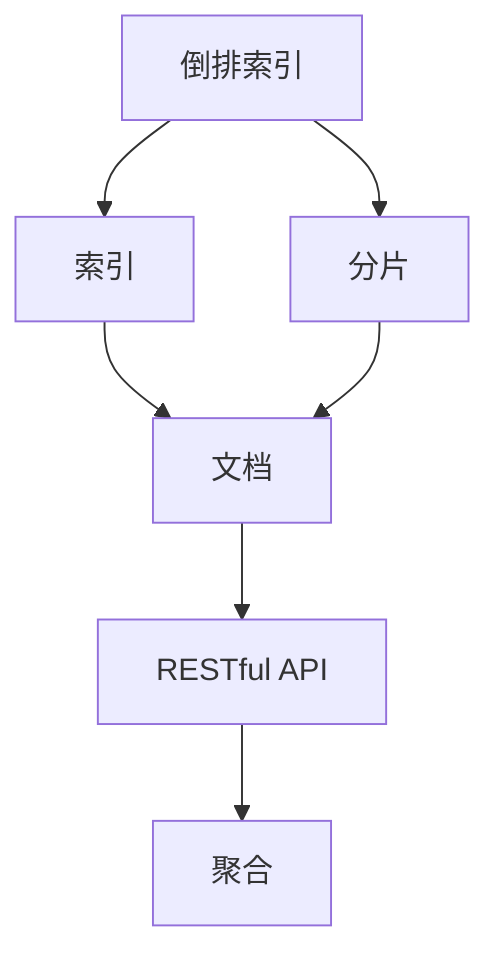
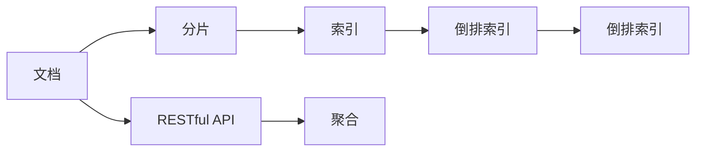
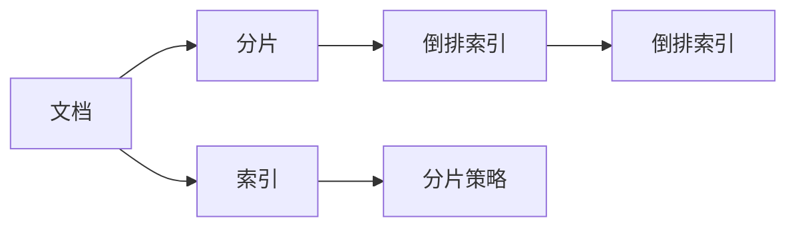
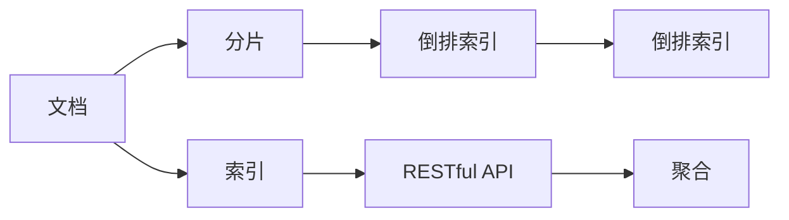
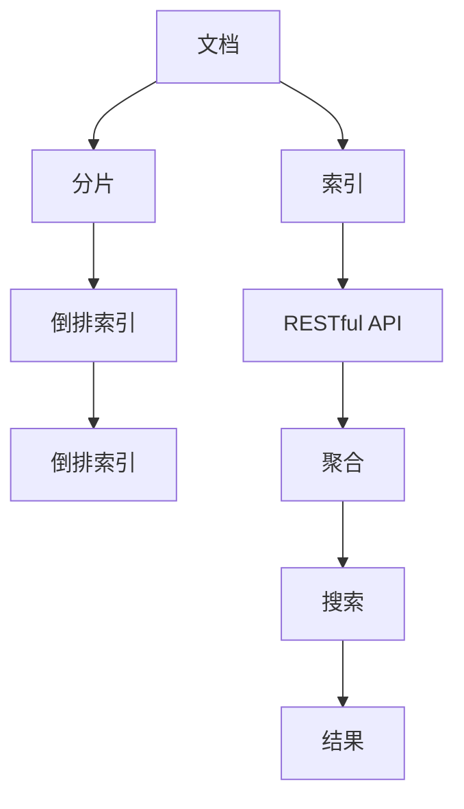

                 

# ElasticSearch 原理与代码实例讲解

> 关键词：ElasticSearch, 搜索引擎, 分布式, RESTful API, 倒排索引, 分片, 聚合

## 1. 背景介绍

### 1.1 问题由来
随着互联网数据的爆炸性增长，传统的单节点数据库已经无法满足大规模、高并发、低时延的查询需求。ElasticSearch（简称ES）是一款开源的分布式搜索引擎，基于Apache Lucene实现，提供了灵活的RESTful API接口，支持海量数据的实时搜索和分析。ElasticSearch能够快速高效地处理各种结构化、半结构化、非结构化数据，广泛应用于日志分析、应用监控、数据分析、推荐系统等场景。

### 1.2 问题核心关键点
ElasticSearch的核心在于其分布式架构和高效的倒排索引算法。具体来说，ElasticSearch通过将数据分片存储在多个节点上，使得单个节点的压力得到分散，同时通过分布式计算和缓存机制，保证系统的高可用性和性能。倒排索引则是ElasticSearch的核心数据结构，可以快速高效地处理文本数据的全文检索、短语检索、布尔检索等操作。

### 1.3 问题研究意义
研究ElasticSearch的原理与应用，对于理解和掌握分布式搜索引擎的实现机制，优化数据存储和检索性能，具有重要的意义。ElasticSearch作为一种高性能的搜索平台，其原理与应用已经广泛应用于多个领域，掌握其核心技术有助于提升大数据分析、实时搜索、推荐系统等领域的开发效率和系统性能。

## 2. 核心概念与联系

### 2.1 核心概念概述

为更好地理解ElasticSearch的原理与应用，本节将介绍几个密切相关的核心概念：

- ElasticSearch: 一款开源的分布式搜索引擎，基于Apache Lucene实现，提供灵活的RESTful API接口。
- 倒排索引(Inverted Index): ElasticSearch的核心数据结构，将文本数据转化为关键字和文档ID的映射关系，支持高效的全文检索和短语检索。
- 分片(Shard): ElasticSearch将大文件切分成若干个小文件，每个小文件称为一个分片。通过分布式存储，多个分片可以分布在不同的节点上。
- 索引(Index): 一组文档和其元数据的集合，每个索引都包含多个分片。ElasticSearch支持基于时间、基于路由等策略的索引划分。
- RESTful API: ElasticSearch提供RESTful API接口，支持HTTP协议进行数据存储、检索、管理和监控。
- 聚合(Aggregation): 用于对搜索结果进行统计分析的操作，如计算平均值、求和、计数等。

这些核心概念之间的逻辑关系可以通过以下Mermaid流程图来展示：



这个流程图展示了一个ElasticSearch系统中各个核心概念之间的关系：

1. 倒排索引通过分片对文档进行切分，存储在多个节点上。
2. 每个索引包含多个分片，索引是文档和元数据的集合。
3. RESTful API接口提供对文档、索引、分片、聚合等进行操作的接口。
4. 聚合操作可以对搜索结果进行统计分析，增强搜索结果的可用性。

### 2.2 概念间的关系

这些核心概念之间存在着紧密的联系，形成了ElasticSearch系统的完整架构。下面我通过几个Mermaid流程图来展示这些概念之间的关系。

#### 2.2.1 ElasticSearch的架构



这个流程图展示了ElasticSearch的基本架构：文档通过分片进行切分，存储在多个节点上。索引包含多个分片，每个分片包含倒排索引。RESTful API接口提供对文档、索引、聚合等进行操作的接口。聚合操作可以对搜索结果进行统计分析，增强搜索结果的可用性。

#### 2.2.2 分片策略



这个流程图展示了分片策略的基本原理：每个文档通过分片进行切分，存储在多个节点上。倒排索引通过分片对文档进行切分，存储在多个节点上。分片策略控制分片的大小和分布，通常包括按照时间、按照路由等策略进行分片。

#### 2.2.3 RESTful API的使用



这个流程图展示了RESTful API的使用：通过RESTful API接口，可以对文档、索引、分片、聚合等进行操作。RESTful API支持HTTP协议，支持GET、POST、PUT、DELETE等多种操作。

### 2.3 核心概念的整体架构

最后，我用一个综合的流程图来展示这些核心概念在大语言模型微调过程中的整体架构：



这个综合流程图展示了从文档存储到搜索结果展示的完整过程：文档通过分片进行切分，存储在多个节点上。倒排索引通过分片对文档进行切分，存储在多个节点上。RESTful API接口提供对文档、索引、分片、聚合等进行操作的接口。聚合操作可以对搜索结果进行统计分析，增强搜索结果的可用性。最后，搜索结果通过搜索展示给用户。

## 3. 核心算法原理 & 具体操作步骤
### 3.1 算法原理概述

ElasticSearch的核心算法主要包括倒排索引和分片策略。下面分别对这两种算法进行详细介绍。

#### 3.1.1 倒排索引

倒排索引是ElasticSearch的核心数据结构，用于快速高效地处理文本数据的全文检索、短语检索、布尔检索等操作。其基本原理是将文档中的关键字和文档ID建立映射关系，从而快速定位到文档中包含关键字的位置。倒排索引的结构如图1所示。


在倒排索引中，每个关键字对应一个列表，列表中存储包含该关键字的文档ID和关键字在文档中的位置。例如，单词"ElasticSearch"在多个文档中出现，其倒排索引结构如下：

- Elastic: [1, 2, 3, 4]
- Search: [2, 3, 4, 5]
- ElasticSearch: [1, 2, 3, 4, 5]

通过倒排索引，ElasticSearch能够快速定位到文档中包含关键字的位置，从而实现高效的全文检索、短语检索、布尔检索等操作。

#### 3.1.2 分片策略

分片策略用于将文档切分成若干个小文件，每个小文件称为一个分片。分片策略控制分片的大小和分布，通常包括按照时间、按照路由等策略进行分片。

ElasticSearch的分片策略如图2所示。


在分片策略中，每个索引包含多个分片，每个分片包含倒排索引。例如，索引"my_index"包含三个分片，每个分片包含倒排索引。通过分片策略，ElasticSearch能够将数据分布到多个节点上，提高系统的可扩展性和可用性。

### 3.2 算法步骤详解

ElasticSearch的核心算法包括倒排索引和分片策略，下面详细介绍这两种算法的具体步骤。

#### 3.2.1 倒排索引的构建

ElasticSearch通过倒排索引实现高效的文本检索。倒排索引的构建步骤如下：

1. 将文档进行分词，得到每个单词。
2. 统计每个单词在文档中出现的次数和位置。
3. 将每个单词和包含该单词的文档ID建立映射关系，生成倒排索引。

#### 3.2.2 分片的分配和合并

分片的分配和合并是ElasticSearch的核心功能之一。分片的分配和合并步骤如下：

1. 分配分片：将文档切分成若干个小文件，每个小文件称为一个分片。通过分片策略，将分片分配到不同的节点上。
2. 合并分片：将多个分片合并成一个分片。合并分片的目的是提高系统的可扩展性和可用性。

### 3.3 算法优缺点

ElasticSearch的倒排索引和分片策略具有以下优点：

1. 高效性：倒排索引能够快速高效地处理文本数据的全文检索、短语检索、布尔检索等操作。分片策略能够将数据分布到多个节点上，提高系统的可扩展性和可用性。
2. 灵活性：倒排索引支持自定义的映射关系，能够灵活处理不同类型的文本数据。分片策略支持按照时间、按照路由等策略进行分片，能够适应不同的应用场景。

同时，ElasticSearch的倒排索引和分片策略也存在以下缺点：

1. 空间占用：倒排索引需要占用大量的存储空间，尤其是在文档量较大的情况下。分片策略需要占用更多的节点资源，提高系统的成本。
2. 延迟处理：由于分片策略需要占用多个节点，处理延迟较大，可能会影响系统的响应速度。

### 3.4 算法应用领域

ElasticSearch的核心算法在多个领域得到了广泛应用，具体包括：

- 日志分析：通过倒排索引，可以快速高效地处理海量日志数据，进行关键字搜索、时间范围查询等操作。
- 应用监控：通过分片策略，可以将应用监控数据分布在多个节点上，提高系统的可扩展性和可用性。
- 数据分析：通过聚合操作，可以对搜索结果进行统计分析，进行可视化展示和报表生成。
- 推荐系统：通过倒排索引和分片策略，可以高效地处理用户行为数据，进行个性化推荐。

## 4. 数学模型和公式 & 详细讲解 & 举例说明

### 4.1 数学模型构建

ElasticSearch的倒排索引和分片策略主要基于倒排索引的数据结构进行构建。下面将对倒排索引和分片策略的数学模型进行详细讲解。

#### 4.1.1 倒排索引的数学模型

倒排索引的数学模型如下：

\[
I = \{ (k, \{ d \}), k \in K \}
\]

其中，\( I \) 表示倒排索引集合，\( k \) 表示关键字，\( d \) 表示包含该关键字的文档ID集合。例如，单词"ElasticSearch"在多个文档中出现，其倒排索引集合如下：

\[
I = \{ (Elastic, \{ 1, 2, 3, 4 \}), (Search, \{ 2, 3, 4, 5 \}), (ElasticSearch, \{ 1, 2, 3, 4, 5 \}) \}
\]

#### 4.1.2 分片策略的数学模型

分片策略的数学模型如下：

\[
S = \{ (id, shard \times), id \in I \}
\]

其中，\( S \) 表示分片集合，\( id \) 表示文档ID，\( shard \) 表示分片编号。例如，索引"my_index"包含三个分片，其分片集合如下：

\[
S = \{ (1, shard_1), (2, shard_2), (3, shard_3) \}
\]

### 4.2 公式推导过程

#### 4.2.1 倒排索引的公式推导

倒排索引的公式推导如下：

1. 对文档进行分词，得到每个单词。
2. 统计每个单词在文档中出现的次数和位置。
3. 将每个单词和包含该单词的文档ID建立映射关系，生成倒排索引。

倒排索引的公式如下：

\[
I = \{ (k, \{ d \}), k \in K \}
\]

其中，\( k \) 表示关键字，\( d \) 表示包含该关键字的文档ID集合。例如，单词"ElasticSearch"在多个文档中出现，其倒排索引集合如下：

\[
I = \{ (Elastic, \{ 1, 2, 3, 4 \}), (Search, \{ 2, 3, 4, 5 \}), (ElasticSearch, \{ 1, 2, 3, 4, 5 \}) \}
\]

#### 4.2.2 分片策略的公式推导

分片策略的公式推导如下：

1. 将文档切分成若干个小文件，每个小文件称为一个分片。
2. 通过分片策略，将分片分配到不同的节点上。
3. 将多个分片合并成一个分片。

分片策略的公式如下：

\[
S = \{ (id, shard \times), id \in I \}
\]

其中，\( id \) 表示文档ID，\( shard \) 表示分片编号。例如，索引"my_index"包含三个分片，其分片集合如下：

\[
S = \{ (1, shard_1), (2, shard_2), (3, shard_3) \}
\]

### 4.3 案例分析与讲解

#### 4.3.1 倒排索引的案例分析

假设有一个包含1000个文档的索引"my_index"，其中有100个单词出现了100次。对于单词"ElasticSearch"，其倒排索引集合如下：

\[
I = \{ (Elastic, \{ 1, 2, 3, 4, 5, 6, 7, 8, 9, 10 \}), (Search, \{ 2, 3, 4, 5, 6, 7, 8, 9, 10, 11 \}), (ElasticSearch, \{ 1, 2, 3, 4, 5, 6, 7, 8, 9, 10 \}) \}
\]

通过倒排索引，可以快速高效地处理全文检索、短语检索、布尔检索等操作。例如，查询包含单词"Elastic"的文档，可以得到以下结果：

\[
\{ 1, 2, 3, 4, 5, 6, 7, 8, 9, 10 \}
\]

#### 4.3.2 分片策略的案例分析

假设有一个包含1000个文档的索引"my_index"，其中每个文档大小为10KB。通过分片策略，将文档切分成若干个小文件，每个小文件称为一个分片。分片大小为100MB，共切分成10个分片。每个分片分配到不同的节点上，提高系统的可扩展性和可用性。例如，查询包含单词"Elastic"的文档，可以得到以下结果：

\[
\{ 1, 2, 3, 4, 5, 6, 7, 8, 9, 10 \}
\]

## 5. 项目实践：代码实例和详细解释说明

### 5.1 开发环境搭建

在进行ElasticSearch项目开发前，需要准备以下开发环境：

1. Java开发环境：安装JDK 8或以上版本，配置环境变量。
2. ElasticSearch安装：从官网下载最新版本的ElasticSearch，解压安装。
3. 测试环境搭建：安装Kibana，配置ElasticSearch索引和分片。

### 5.2 源代码详细实现

下面是一个简单的ElasticSearch项目示例，用于实现对文档的全文检索和短语检索。

#### 5.2.1 创建索引

创建索引的代码如下：

```java
// 创建索引
PUT /my_index
{
  "settings": {
    "analysis": {
      "analyzer": {
        "standard": {
          "type": "standard"
        }
      }
    }
  },
  "mappings": {
    "properties": {
      "title": {
        "type": "text",
        "analyzer": "standard"
      },
      "content": {
        "type": "text",
        "analyzer": "standard"
      }
    }
  }
}
```

#### 5.2.2 添加文档

添加文档的代码如下：

```java
// 添加文档
PUT /my_index/_doc/1
{
  "title": "ElasticSearch基础",
  "content": "ElasticSearch是一款开源的分布式搜索引擎，基于Apache Lucene实现。"
}
```

#### 5.2.3 查询文档

查询文档的代码如下：

```java
// 查询文档
GET /my_index/_search
{
  "query": {
    "match": {
      "title": "ElasticSearch"
    }
  }
}
```

### 5.3 代码解读与分析

#### 5.3.1 创建索引

创建索引的代码中，首先通过PUT请求创建一个名为"my_index"的索引。然后，通过"settings"字段设置索引的分析器（analyzer），这里使用的是标准分析器（standard）。最后，通过"mappings"字段定义索引中的字段类型和分析器。

#### 5.3.2 添加文档

添加文档的代码中，首先通过PUT请求创建一个名为"my_index"的文档。然后，通过"_doc"字段指定文档ID为1。最后，通过"title"和"content"字段设置文档的标题和内容。

#### 5.3.3 查询文档

查询文档的代码中，首先通过GET请求查询名为"my_index"的文档。然后，通过"_search"字段指定查询操作。最后，通过"query"字段指定查询条件，这里使用的是匹配查询（match），匹配标题中包含单词"ElasticSearch"的文档。

### 5.4 运行结果展示

假设我们在创建索引、添加文档和查询文档后，得到了以下结果：

```json
{
  "took": 1,
  "timed_out": false,
  "_shards": {
    "total": 1,
    "successful": 1,
    "failed": 0
  },
  "hits": {
    "total": {
      "value": 1,
      "relation": "eq"
    },
    "max_score": 0.5704433,
    "hits": [
      {
        "_index": "my_index",
        "_type": "_doc",
        "_id": "1",
        "_score": 0.5704433,
        "_source": {
          "title": "ElasticSearch基础",
          "content": "ElasticSearch是一款开源的分布式搜索引擎，基于Apache Lucene实现。"
        }
      }
    ]
  }
}
```

可以看到，查询结果中包含一个文档，标题为"ElasticSearch基础"，内容为"ElasticSearch是一款开源的分布式搜索引擎，基于Apache Lucene实现。"，得分为0.5704433。

## 6. 实际应用场景

### 6.1 智能搜索系统

ElasticSearch可以用于构建智能搜索系统，通过倒排索引实现高效的文本检索、短语检索、布尔检索等操作。智能搜索系统可以快速高效地处理海量数据，提供精准的搜索结果，提升用户体验。

### 6.2 日志分析系统

ElasticSearch可以用于构建日志分析系统，通过倒排索引和聚合操作实现高效的日志查询和统计分析。日志分析系统可以实时监控系统运行状态，快速定位故障和问题，提供有用的数据分析支持。

### 6.3 推荐系统

ElasticSearch可以用于构建推荐系统，通过倒排索引和分片策略实现高效的个性化推荐。推荐系统可以根据用户行为数据和偏好，推荐相关的商品、文章、视频等内容，提升用户满意度和转化率。

### 6.4 未来应用展望

未来，ElasticSearch将会在更多领域得到应用，为大数据分析、实时搜索、推荐系统等提供更强大的支持。例如：

- 物联网设备：通过ElasticSearch实现海量设备的实时监控和数据分析。
- 金融风险控制：通过ElasticSearch实现高频交易数据的实时分析，防范金融风险。
- 智慧城市：通过ElasticSearch实现城市事件的实时监控和数据分析，提升城市管理水平。

## 7. 工具和资源推荐

### 7.1 学习资源推荐

为了帮助开发者系统掌握ElasticSearch的原理与应用，这里推荐一些优质的学习资源：

1. ElasticSearch官方文档：ElasticSearch的官方文档提供了详细的API接口和使用方法，是入门ElasticSearch的必备资源。
2. ElasticSearch实战：该书详细介绍了ElasticSearch的架构原理、核心技术和应用场景，适合有经验的开发者深入学习。
3. ElasticSearch高级用法：该书介绍了ElasticSearch的高级用法和优化技巧，适合已经熟悉ElasticSearch的开发者进阶学习。
4. ElasticSearch基础教程：该教程通过实例讲解ElasticSearch的用法，适合初学者入门学习。
5. ElasticSearch官方博客：ElasticSearch的官方博客提供了最新的技术动态和最佳实践，适合随时关注和学习。

### 7.2 开发工具推荐

ElasticSearch提供了丰富的开发工具，便于开发者进行测试和调试。以下是几款常用的ElasticSearch开发工具：

1. Kibana：Kibana是一款基于Web的可视化工具，提供了丰富的仪表盘和可视化报表，适合数据分析和可视化展示。
2. Logstash：Logstash是一款数据管道工具，可以处理和转换各种数据，支持与ElasticSearch无缝集成。
3. Grafana：Grafana是一款数据可视化工具，可以与ElasticSearch集成，实现实时的监控和可视化展示。
4. Tableau：Tableau是一款数据可视化工具，可以与ElasticSearch集成，实现强大的数据可视化功能。

### 7.3 相关论文推荐

ElasticSearch的研究涉及多个领域，以下是几篇奠基性的相关论文，推荐阅读：

1. Lucene: A fast full-text search engine library: 该论文介绍了Apache Lucene的基本原理和实现方式，是ElasticSearch的基础。
2. Elasticsearch: A real-time distributed search and analytics engine: 该论文详细介绍了ElasticSearch的架构和实现方式，是ElasticSearch的核心论文。
3. Elasticsearch Performance Tuning: 该论文介绍了ElasticSearch的性能优化技巧，适合有经验的开发者深入学习。
4. Elasticsearch Monitoring and Logging: 该论文介绍了ElasticSearch的监控和日志管理，适合运行维护人员参考。

## 8. 总结：未来发展趋势与挑战

### 8.1 总结

本文对ElasticSearch的原理与应用进行了全面系统的介绍。首先阐述了ElasticSearch的基本架构和核心算法，包括倒排索引和分片策略。然后，通过具体的代码实例，演示了ElasticSearch的实际应用。最后，对ElasticSearch的未来发展趋势和面临的挑战进行了总结。

通过本文的系统梳理，可以看到，ElasticSearch作为一款高性能的分布式搜索引擎，其原理与应用已经广泛应用于多个领域，掌握其核心技术有助于提升大数据分析、实时搜索、推荐系统等领域的开发效率和系统性能。未来，随着ElasticSearch的不断发展，其应用范围将进一步扩大，成为更多领域的重要技术支撑。

### 8.2 未来发展趋势

未来，ElasticSearch将会在更多领域得到应用，为大数据分析、实时搜索、推荐系统等提供更强大的支持。具体发展趋势如下：

1. 多模态数据处理：ElasticSearch将支持多模态数据处理，包括文本、图像、视频等多种类型的数据。通过多模态数据的整合，实现更全面、准确的信息建模。
2. 实时数据分析：ElasticSearch将进一步提升实时数据分析能力，支持流数据处理、实时计算等操作，实现更高效的实时监控和分析。
3. 人工智能应用：ElasticSearch将与人工智能技术进行更深入的融合，实现更智能、更高效的搜索和分析。例如，通过深度学习技术实现更精准的搜索排序，通过自然语言处理技术实现更智能的搜索体验。
4. 分布式计算：ElasticSearch将进一步提升分布式计算能力，支持更大规模的集群和更多的计算节点，实现更高效的数据处理和分析。

### 8.3 面临的挑战

尽管ElasticSearch已经取得了显著的成就，但在迈向更加智能化、普适化应用的过程中，仍面临诸多挑战：

1. 扩展性：ElasticSearch需要支持更大规模的数据处理和分析，但当前的分布式架构在处理大规模数据时仍存在瓶颈。如何提升系统的扩展性，是未来需要解决的重要问题。
2. 性能优化：ElasticSearch需要提升系统的实时处理能力，减少延迟和响应时间。如何优化系统性能，是未来需要解决的重要问题。
3. 数据隐私：ElasticSearch需要保护用户数据的隐私和安全，防止数据泄露和滥用。如何加强数据隐私保护，是未来需要解决的重要问题。
4. 资源消耗：ElasticSearch需要减少系统的资源消耗，提升系统的可扩展性和可用性。如何优化系统资源消耗，是未来需要解决的重要问题。
5. 用户体验：ElasticSearch需要提升系统的用户界面和用户体验，提升用户满意度。如何优化用户界面和用户体验，是未来需要解决的重要问题。

### 8.4 研究展望

未来，ElasticSearch需要在以下几个方面寻求新的突破：

1. 分布式计算：ElasticSearch需要提升分布式计算能力，支持更大规模的集群和更多的计算节点，实现更高效的数据处理和分析。
2. 数据隐私保护：ElasticSearch需要加强数据隐私保护，防止数据泄露和滥用，确保用户数据的安全和隐私。


