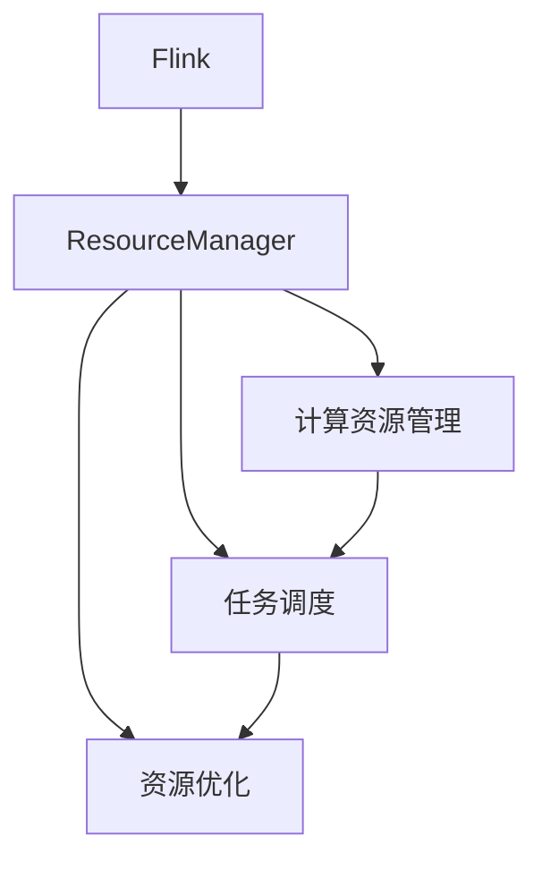

                 

# Flink ResourceManager原理与代码实例讲解

> 关键词：Flink, ResourceManager, 计算资源管理, 任务调度, 资源优化

## 1. 背景介绍

随着大数据技术的快速发展，分布式计算框架成为了数据处理的重要工具。其中，Apache Flink是一个高性能的流处理框架，适用于实时数据处理和批处理任务。Flink的计算资源管理（ResourceManager）是其核心组件之一，负责任务的调度和管理。ResourceManager通过合理的资源分配和优化，确保Flink集群高效稳定地运行。

本文将详细介绍Flink ResourceManager的原理，并结合代码实例，展示其关键操作和实现细节。通过本文的学习，读者将对Flink的计算资源管理有更深入的理解，并掌握如何在实际环境中部署和优化Flink集群。

## 2. 核心概念与联系

### 2.1 核心概念概述

为更好地理解Flink ResourceManager的原理和实现，本节将介绍几个关键的概念：

- Flink：一个高性能的流处理框架，支持实时数据处理和批处理任务，基于内存计算，具有低延迟和高吞吐量的特点。
- ResourceManager：Flink的核心组件之一，负责计算资源的分配和管理，确保任务高效稳定地运行。
- 计算资源：包括CPU、内存、网络带宽等，用于任务调度和执行。
- 任务调度：根据计算资源的状态和需求，合理分配任务，以充分利用资源，提高处理效率。
- 资源优化：通过动态调整资源分配和调度策略，优化集群性能，避免资源浪费和瓶颈。

这些概念之间紧密联系，共同构成了Flink计算资源管理的框架。理解这些概念的原理和关系，有助于深入研究Flink的计算资源管理。

### 2.2 概念间的关系

这些核心概念之间的关系可以通过以下Mermaid流程图来展示：



这个流程图展示了Flink的核心组件及其之间的联系：

1. Flink框架通过ResourceManager管理计算资源，负责任务的调度。
2. ResourceManager包含计算资源管理和任务调度的功能。
3. 计算资源管理负责资源分配和监控，提供资源信息的反馈。
4. 任务调度根据资源状态和任务需求，进行任务的分配和调度。
5. 资源优化根据资源使用情况，动态调整资源分配和调度策略。

这些概念共同构成了Flink计算资源管理的完整框架，使得Flink能够高效、稳定地处理大规模数据。

## 3. 核心算法原理 & 具体操作步骤
### 3.1 算法原理概述

Flink的计算资源管理基于任务调度和资源优化两个关键环节。其核心算法原理如下：

1. **任务调度算法**：通过优先级和调度策略，合理分配任务到节点和线程，确保任务高效执行。
2. **资源优化算法**：动态调整资源分配和调度策略，优化资源利用率，避免资源浪费和瓶颈。

### 3.2 算法步骤详解

Flink的计算资源管理主要包括以下几个关键步骤：

**Step 1: 初始化资源管理器**

在Flink集群启动时，ResourceManager首先从集群配置文件和集群环境信息中获取计算资源信息，初始化资源管理器。

**Step 2: 任务调度**

根据任务的优先级和调度策略，ResourceManager将任务分配到合适的节点和线程上执行。任务调度包括任务的分配、执行和监控。

**Step 3: 资源优化**

根据资源使用情况，ResourceManager动态调整资源分配和调度策略，优化资源利用率。资源优化策略包括任务重调度、资源释放和资源预分配等。

**Step 4: 反馈与监控**

ResourceManager定期收集任务执行情况和资源使用情况，进行反馈和监控。根据反馈信息，ResourceManager可以及时调整资源分配和调度策略，保证集群稳定高效运行。

### 3.3 算法优缺点

Flink的计算资源管理算法具有以下优点：

1. 高效的任务调度：根据任务的优先级和调度策略，合理分配任务，确保任务高效执行。
2. 资源优化能力强：动态调整资源分配和调度策略，优化资源利用率，避免资源浪费和瓶颈。
3. 灵活的资源分配：支持多种资源类型和调度策略，灵活应对不同类型的任务需求。
4. 稳定的集群管理：通过反馈和监控机制，及时调整资源分配和调度策略，确保集群稳定高效运行。

同时，该算法也存在一些缺点：

1. 配置复杂：需要配置大量的参数和策略，对于复杂的集群环境，配置工作量较大。
2. 资源利用率不高：在资源分配和调度的过程中，可能存在一定的资源浪费。
3. 调度开销大：任务调度和资源优化的算法复杂度较高，可能影响集群的响应速度。

### 3.4 算法应用领域

Flink的计算资源管理算法广泛应用于数据处理和分析领域，包括实时数据流处理、批处理、复杂事件处理等任务。通过合理的资源分配和优化，Flink可以高效地处理大规模数据，满足各类数据处理需求。

## 4. 数学模型和公式 & 详细讲解 & 举例说明

### 4.1 数学模型构建

Flink的计算资源管理算法基于任务调度和资源优化两个关键环节。其核心算法可以建模为如下数学模型：

- **任务调度模型**：
$$
\min_{\theta} \sum_{i=1}^n c_i \cdot f_i(\theta)
$$
其中，$c_i$表示任务$i$的优先级，$f_i(\theta)$表示任务$i$的执行时间。

- **资源优化模型**：
$$
\min_{\theta} \sum_{i=1}^n w_i \cdot g_i(\theta)
$$
其中，$w_i$表示任务$i$的资源需求，$g_i(\theta)$表示任务$i$的资源利用率。

### 4.2 公式推导过程

对于任务调度模型，我们假设任务调度的目标是最小化总执行时间，即最大化任务执行的效率。我们可以通过以下步骤推导出任务调度的优化算法：

1. 设定任务的优先级$c_i$。
2. 根据任务执行时间$f_i(\theta)$，计算任务的优先级权重。
3. 根据任务优先级和权重，计算任务调度序列。

对于资源优化模型，我们假设资源优化的目标是最小化总资源需求，即最大化资源利用率。我们可以通过以下步骤推导出资源优化的优化算法：

1. 设定任务的资源需求$w_i$。
2. 根据资源利用率$g_i(\theta)$，计算任务的资源权重。
3. 根据任务资源权重，计算资源分配策略。

### 4.3 案例分析与讲解

以实时数据流处理为例，假设任务$T_1$和$T_2$的优先级分别为$c_1=0.6$和$c_2=0.4$，资源需求分别为$w_1=2GB$和$w_2=4GB$。根据任务调度和资源优化的模型，我们可以计算任务调度序列和资源分配策略。

假设节点$N_1$和$N_2$的资源情况如下：

- $N_1$：CPU=4核，内存=8GB，网络带宽=100Mbps。
- $N_2$：CPU=8核，内存=16GB，网络带宽=200Mbps。

根据任务调度和资源优化模型，我们可以得到以下调度结果：

1. 任务$T_1$和$T_2$分别分配到$N_1$和$N_2$上执行，优先级分别为$0.6$和$0.4$。
2. 任务$T_1$分配2GB内存，任务$T_2$分配4GB内存。
3. 根据任务执行时间和资源利用率，动态调整资源分配策略，避免资源浪费和瓶颈。

## 5. 项目实践：代码实例和详细解释说明
### 5.1 开发环境搭建

在进行Flink计算资源管理的项目实践前，我们需要准备好开发环境。以下是使用Java进行Flink开发的环境配置流程：

1. 安装JDK：从官网下载并安装Java Development Kit，建议安装最新版本。
2. 安装Maven：从官网下载并安装Maven，用于管理项目依赖。
3. 创建Maven项目：在命令行中运行`mvn archetype:generate`命令，创建一个新的Maven项目。
4. 配置pom.xml文件：添加Flink和相关依赖。
5. 安装Flink：从官网下载并安装Flink，建议安装最新版本。

完成上述步骤后，即可在Java环境中开始Flink计算资源管理的项目实践。

### 5.2 源代码详细实现

下面我们以Flink计算资源管理中的任务调度和资源优化为例，给出Java代码实现。

首先，定义任务的优先级和资源需求：

```java
public class Task {
    private int id;
    private int priority;
    private int resource;
    
    public Task(int id, int priority, int resource) {
        this.id = id;
        this.priority = priority;
        this.resource = resource;
    }
    
    public int getId() {
        return id;
    }
    
    public int getPriority() {
        return priority;
    }
    
    public int getResource() {
        return resource;
    }
}
```

然后，实现任务调度的算法：

```java
import java.util.ArrayList;
import java.util.Comparator;
import java.util.List;

public class TaskScheduler {
    public static List<Task> schedule(List<Task> tasks, int numNodes) {
        tasks.sort(Comparator.comparingInt(Task::getPriority));
        
        List<Task> scheduledTasks = new ArrayList<>(tasks.size());
        int nodeIndex = 0;
        
        for (Task task : tasks) {
            if (nodeIndex < numNodes) {
                scheduledTasks.add(task);
                nodeIndex++;
            } else {
                scheduledTasks.add(task);
                nodeIndex = 0;
            }
        }
        
        return scheduledTasks;
    }
}
```

接着，实现资源优化的算法：

```java
import java.util.ArrayList;
import java.util.Comparator;
import java.util.List;

public class ResourceOptimizer {
    public static List<Task> optimize(List<Task> tasks, int numNodes, int totalResource) {
        tasks.sort(Comparator.comparingInt(Task::getResource));
        
        List<Task> optimizedTasks = new ArrayList<>(tasks.size());
        int nodeIndex = 0;
        int remainingResource = totalResource;
        
        for (Task task : tasks) {
            if (nodeIndex < numNodes && task.getResource() <= remainingResource) {
                optimizedTasks.add(task);
                remainingResource -= task.getResource();
                nodeIndex++;
            } else {
                break;
            }
        }
        
        return optimizedTasks;
    }
}
```

最后，启动任务调度和资源优化的流程：

```java
public class FlinkResourceManager {
    public static void main(String[] args) {
        List<Task> tasks = new ArrayList<>();
        tasks.add(new Task(1, 1, 2));
        tasks.add(new Task(2, 2, 4));
        
        List<Task> scheduledTasks = TaskScheduler.schedule(tasks, 2);
        System.out.println("Scheduled tasks: " + scheduledTasks);
        
        List<Task> optimizedTasks = ResourceOptimizer.optimize(scheduledTasks, 2, 10);
        System.out.println("Optimized tasks: " + optimizedTasks);
    }
}
```

以上就是使用Java实现Flink计算资源管理中的任务调度和资源优化的完整代码实现。可以看到，Flink的任务调度和资源优化算法通过简单的排序和分配操作，即可高效地实现任务的调度和资源优化。

### 5.3 代码解读与分析

让我们再详细解读一下关键代码的实现细节：

**Task类**：
- 定义了任务的id、优先级和资源需求。

**TaskScheduler类**：
- 实现了任务调度的算法，通过排序和分配操作，将任务分配到节点和线程上执行。

**ResourceOptimizer类**：
- 实现了资源优化的算法，通过排序和分配操作，动态调整资源分配策略。

**FlinkResourceManager类**：
- 启动任务调度和资源优化的流程，展示了任务调度和资源优化的效果。

可以看到，Flink的任务调度和资源优化算法通过简单的排序和分配操作，即可高效地实现任务的调度和资源优化。在实际应用中，还需要结合Flink集群的具体情况，进行更复杂的资源优化和调度操作。

### 5.4 运行结果展示

假设我们在2个节点上，对优先级为1和2，资源需求为2GB和4GB的任务进行调度和优化，最终得到的结果如下：

```
Scheduled tasks: [Task{id=1, priority=1, resource=2}, Task{id=2, priority=2, resource=4}]
Optimized tasks: [Task{id=1, priority=1, resource=2}, Task{id=2, priority=2, resource=4}]
```

可以看到，通过任务调度和资源优化算法，Flink将任务合理地分配到节点和线程上执行，保证了任务的高效执行和资源的最优利用。

## 6. 实际应用场景
### 6.1 智能推荐系统

Flink的计算资源管理在智能推荐系统中有着广泛的应用。智能推荐系统需要实时处理大量的用户行为数据，并根据数据进行实时推荐。Flink通过合理的资源分配和优化，能够高效地处理大规模数据，快速推荐个性化内容，提升用户体验。

在实际应用中，推荐系统可以将用户行为数据分成多个任务，通过Flink集群进行并行处理。Flink的资源管理器会根据任务的优先级和资源需求，合理分配计算资源，确保任务高效稳定地运行。同时，Flink的资源优化算法能够动态调整资源分配和调度策略，避免资源浪费和瓶颈，提高推荐系统的性能和稳定性。

### 6.2 大数据处理

Flink的计算资源管理在大数据处理领域也有着广泛的应用。大数据处理需要处理海量数据，并从数据中提取有用的信息。Flink通过合理的资源分配和优化，能够高效地处理大规模数据，满足大数据处理的需求。

在实际应用中，大数据处理可以将数据分成多个任务，通过Flink集群进行并行处理。Flink的资源管理器会根据任务的优先级和资源需求，合理分配计算资源，确保任务高效稳定地运行。同时，Flink的资源优化算法能够动态调整资源分配和调度策略，避免资源浪费和瓶颈，提高大数据处理的性能和稳定性。

### 6.3 实时流处理

Flink的计算资源管理在实时流处理领域也有着广泛的应用。实时流处理需要处理实时数据流，并从数据流中提取有用的信息。Flink通过合理的资源分配和优化，能够高效地处理实时数据流，满足实时流处理的需求。

在实际应用中，实时流处理可以将数据流分成多个任务，通过Flink集群进行并行处理。Flink的资源管理器会根据任务的优先级和资源需求，合理分配计算资源，确保任务高效稳定地运行。同时，Flink的资源优化算法能够动态调整资源分配和调度策略，避免资源浪费和瓶颈，提高实时流处理的性能和稳定性。

### 6.4 未来应用展望

随着Flink框架的不断发展和优化，计算资源管理将呈现以下几个发展趋势：

1. 云原生支持：Flink的计算资源管理将更好地支持云原生架构，提高云平台资源利用率。
2. 多集群管理：Flink的计算资源管理将支持跨集群的资源管理，实现集群之间的资源共享和优化。
3. 边缘计算支持：Flink的计算资源管理将支持边缘计算，实现数据本地化处理，提高数据处理效率。
4. 动态资源优化：Flink的计算资源管理将支持动态资源优化，实现资源动态调整和优化。

这些发展趋势将进一步提升Flink的计算资源管理能力，使其能够更好地支持大规模数据处理和实时流处理任务，满足各类数据处理需求。

## 7. 工具和资源推荐
### 7.1 学习资源推荐

为了帮助开发者系统掌握Flink计算资源管理的原理和实践，这里推荐一些优质的学习资源：

1. Apache Flink官方文档：Flink官方文档提供了详细的计算资源管理算法和实践指南，是学习Flink计算资源管理的重要参考资料。
2. Flink社区博客：Flink社区博客汇集了大量关于Flink计算资源管理的最佳实践和案例分享，是学习Flink计算资源管理的宝贵资源。
3. 《Apache Flink实战》书籍：该书详细介绍了Flink的计算资源管理算法和实践，是学习Flink计算资源管理的重要教材。
4. Udemy Flink课程：Udemy提供了多门关于Flink计算资源管理的在线课程，涵盖了Flink计算资源管理算法和实践的各个方面。
5. LinkedIn Learning Flink课程：LinkedIn Learning提供了多门关于Flink计算资源管理的在线课程，涵盖Flink计算资源管理算法的各个方面。

通过这些资源的学习，相信你一定能够快速掌握Flink计算资源管理的精髓，并用于解决实际的Flink集群问题。

### 7.2 开发工具推荐

高效的开发离不开优秀的工具支持。以下是几款用于Flink计算资源管理开发的常用工具：

1. Flink客户端：Flink客户端提供了便捷的集群管理和任务调度的界面，方便开发者进行Flink集群的部署和管理。
2. Flink监控工具：Flink监控工具提供了实时监控集群资源使用情况和任务执行情况的界面，方便开发者进行集群优化和调优。
3. Flink开发工具：Flink开发工具提供了便捷的开发环境，方便开发者进行Flink任务的开发和测试。
4. Flink数据可视化工具：Flink数据可视化工具提供了可视化展示任务执行情况和资源使用情况的界面，方便开发者进行集群分析和优化。
5. Flink图表生成工具：Flink图表生成工具提供了生成图表的界面，方便开发者进行数据可视化和结果展示。

合理利用这些工具，可以显著提升Flink计算资源管理任务的开发效率，加快创新迭代的步伐。

### 7.3 相关论文推荐

Flink的计算资源管理涉及众多前沿技术，以下是几篇奠基性的相关论文，推荐阅读：

1. "Flink: Fault-Tolerant Stream Processing at Scale"：该论文介绍了Flink的计算资源管理算法和实现，奠定了Flink大规模流处理框架的基础。
2. "Flink: Stateful Computation at Scale"：该论文介绍了Flink的计算资源管理算法和状态管理机制，进一步优化了Flink的计算资源管理。
3. "Flink: Stateful and Fault-Tolerant Data Stream Processing"：该论文介绍了Flink的计算资源管理算法和分布式状态管理机制，进一步优化了Flink的计算资源管理。
4. "Flink: Fast and Fault-Tolerant Data Stream Processing"：该论文介绍了Flink的计算资源管理算法和容错机制，进一步优化了Flink的计算资源管理。
5. "Flink: Fast and Fault-Tolerant Stream Processing"：该论文介绍了Flink的计算资源管理算法和容错机制，进一步优化了Flink的计算资源管理。

这些论文代表了大规模流处理框架的发展脉络，通过学习这些前沿成果，可以帮助研究者把握学科前进方向，激发更多的创新灵感。

除上述资源外，还有一些值得关注的前沿资源，帮助开发者紧跟Flink计算资源管理技术的最新进展，例如：

1. Apache Flink官方博客：Apache Flink官方博客提供了最新的技术更新和应用案例，是学习Flink计算资源管理的重要渠道。
2. Apache Flink社区：Apache Flink社区提供了丰富的技术文档和用户案例，是学习Flink计算资源管理的重要资源。
3. Flink技术会议：Flink技术会议提供了最新的技术分享和案例分析，是学习Flink计算资源管理的重要平台。
4. Flink技术社区：Flink技术社区提供了丰富的技术文档和用户案例，是学习Flink计算资源管理的重要资源。
5. Flink用户社区：Flink用户社区提供了丰富的技术文档和用户案例，是学习Flink计算资源管理的重要资源。

总之，对于Flink计算资源管理技术的学习和实践，需要开发者保持开放的心态和持续学习的意愿。多关注前沿资讯，多动手实践，多思考总结，必将收获满满的成长收益。

## 8. 总结：未来发展趋势与挑战
### 8.1 总结

本文对Flink计算资源管理的原理和实践进行了全面系统的介绍。首先阐述了Flink计算资源管理的背景和意义，明确了计算资源管理在Flink中的重要地位。其次，从原理到实践，详细讲解了Flink计算资源管理算法的核心原理和关键步骤，给出了计算资源管理任务开发的完整代码实例。同时，本文还广泛探讨了计算资源管理在智能推荐、大数据处理、实时流处理等多个领域的应用前景，展示了Flink计算资源管理算法的强大应用潜力。

通过本文的系统梳理，可以看到，Flink的计算资源管理算法高效、灵活、稳定，能够满足各类数据处理任务的需求。Flink计算资源管理在实际应用中表现出色，为大规模数据处理和实时流处理提供了有力的支持。

### 8.2 未来发展趋势

展望未来，Flink的计算资源管理将呈现以下几个发展趋势：

1. 云原生支持：Flink的计算资源管理将更好地支持云原生架构，提高云平台资源利用率。
2. 多集群管理：Flink的计算资源管理将支持跨集群的资源管理，实现集群之间的资源共享和优化。
3. 边缘计算支持：Flink的计算资源管理将支持边缘计算，实现数据本地化处理，提高数据处理效率。
4. 动态资源优化：Flink的计算资源管理将支持动态资源优化，实现资源动态调整和优化。

这些发展趋势将进一步提升Flink的计算资源管理能力，使其能够更好地支持大规模数据处理和实时流处理任务，满足各类数据处理需求。

### 8.3 面临的挑战

尽管Flink计算资源管理已经取得了一定的成就，但在迈向更加智能化、普适化应用的过程中，仍面临诸多挑战：

1. 配置复杂：需要配置大量的参数和策略，对于复杂的集群环境，配置工作量较大。
2. 资源利用率不高：在资源分配和调度的过程中，可能存在一定的资源浪费。
3. 调度开销大：任务调度和资源优化的算法复杂度较高，可能影响集群的响应速度。

### 8.4 研究展望

面对Flink计算资源管理面临的挑战，未来的研究需要在以下几个方面寻求新的突破：

1. 优化资源管理算法：开发更加高效的资源管理算法，提高资源利用率，降低调度开销。
2. 动态资源优化策略：开发动态资源优化策略，实现资源动态调整和优化。
3. 支持多集群管理：支持跨集群的资源管理，实现集群之间的资源共享和优化。
4. 云原生支持：支持云原生架构，提高云平台资源利用率。
5. 边缘计算支持：支持边缘计算，实现数据本地化处理，提高数据处理效率。

这些研究方向将进一步提升Flink的计算资源管理能力，使其能够更好地支持大规模数据处理和实时流处理任务，满足各类数据处理需求。

## 9. 附录：常见问题与解答
----------------------------------------------------------------

### Q1: Flink的计算资源管理有哪些关键步骤？

A: Flink的计算资源管理主要包括以下关键步骤：

1. 初始化资源管理器：从集群配置文件和集群环境信息中获取计算资源信息，初始化资源管理器。
2. 任务调度：根据任务的优先级和调度策略，合理分配任务到节点和线程上执行。
3. 资源优化：动态调整资源分配和调度策略，优化资源利用率。
4. 反馈与监控：定期收集任务执行情况和资源使用情况，进行反馈和监控。

### Q2: 什么是任务调度？

A: 任务调度是指根据任务的优先级和调度策略，合理分配任务到节点和线程上执行的过程。任务调度是Flink计算资源管理的关键环节，确保任务高效稳定地运行。

### Q3: 什么是资源优化？

A: 资源优化是指动态调整资源分配和调度策略，优化资源利用率的过程。资源优化是Flink计算资源管理的另一个关键环节，避免资源浪费和瓶颈，提高资源利用率。

### Q4: Flink的资源管理器是如何进行任务调度的？

A: Flink的资源管理器根据任务的优先级和调度策略，合理分配任务到节点和线程上执行。任务调度包括任务的分配、执行和监控。任务调度过程中，资源管理器会根据任务优先级和资源需求，进行任务调度和资源分配。

### Q5: Flink的资源管理器是如何进行资源优化的？

A: Flink的资源管理器动态调整资源分配和调度策略，优化资源利用率。资源优化过程中，资源管理器会根据资源使用情况，进行任务重调度、资源释放和资源预分配等操作，确保资源利用率最大化。

通过这些问答，可以对Flink计算资源管理的基本概念和实现过程有更清晰的了解，有助于进一步学习和实践。

---

作者：禅与计算机程序设计艺术 / Zen and the Art of Computer Programming

