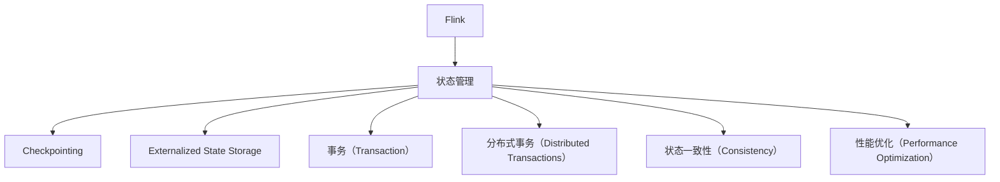
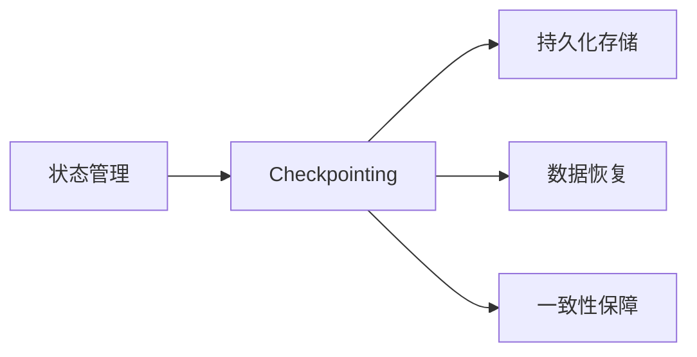
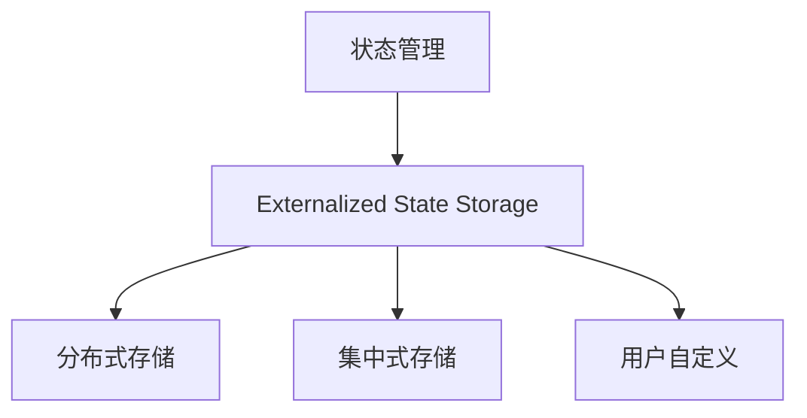
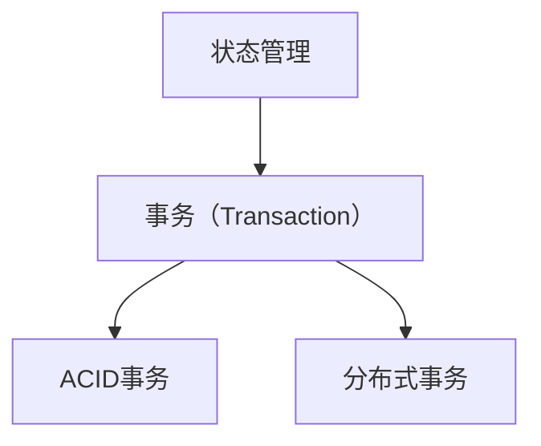
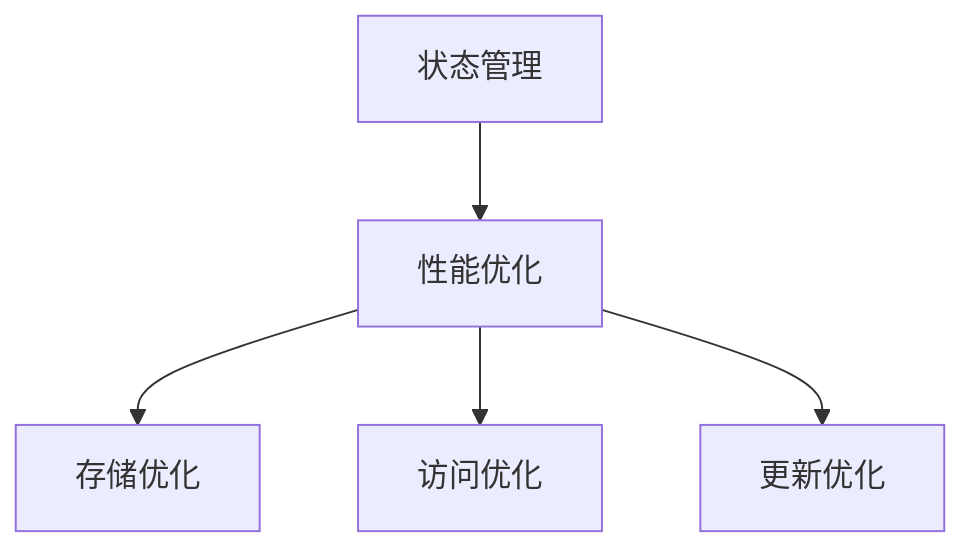

                 

# Flink State状态管理原理与代码实例讲解

> 关键词：Flink, 状态管理, 存储, 缓存, 事务, 更新, 监控, 最佳实践

## 1. 背景介绍

### 1.1 问题由来
Apache Flink是一个快速、可扩展、可容错的分布式流处理框架，广泛应用于实时数据处理、复杂事件处理等领域。然而，在分布式流处理中，状态管理是一个至关重要的环节。随着数据规模和处理任务的复杂化，传统的基于内存的状态管理策略已无法满足日益增长的性能和可靠性需求。

Flink提供了一系列状态管理机制，如Checkpointing、Externalized State Storage等，帮助开发者构建高效、可靠、可扩展的分布式流处理系统。本文将详细讲解Flink State状态管理的原理与实现，并结合代码实例，深入分析状态管理的最佳实践。

### 1.2 问题核心关键点
Flink State状态管理的主要目标是：

- **高效存储**：通过持久化存储，确保状态数据的可靠性与一致性。
- **高吞吐量**：优化存储和访问机制，确保状态管理不会成为系统性能瓶颈。
- **可扩展性**：通过分布式存储和并行化机制，支持大规模的状态管理。
- **事务一致性**：提供支持ACID事务的状态更新，确保状态的一致性和可靠性。

这些关键点共同构成了Flink State状态管理的核心目标，通过优化状态存储、访问和更新机制，Flink能够支持大规模、高可靠性的分布式流处理系统。

### 1.3 问题研究意义
Flink State状态管理的优化和改进，对于提升Flink系统的性能、可靠性和可扩展性具有重要意义：

- **提高系统性能**：通过高效的状态存储和访问机制，减少系统延迟和响应时间，提高实时数据处理的效率。
- **增强系统可靠性**：通过事务一致性、故障恢复机制，确保数据处理的一致性和可靠性，降低系统故障率。
- **支持大规模应用**：通过分布式存储和并行化机制，支持处理大规模数据流，满足复杂事件处理和高并发场景的需求。
- **推动技术创新**：状态管理是Flink的核心技术之一，其优化和改进能够推动Flink整体技术的进步，提升其在各行业的落地应用。

## 2. 核心概念与联系

### 2.1 核心概念概述

为更好地理解Flink State状态管理的原理与实现，本节将介绍几个密切相关的核心概念：

- **Flink**：Apache Flink是Apache软件基金会旗下的大数据处理框架，支持批处理和流处理，提供丰富的API和组件，支持高吞吐量、低延迟的流处理。

- **状态管理**：在流处理中，状态管理指的是对于中间结果（如窗口聚合结果、缓存数据等）的存储和维护，确保流处理结果的一致性和可靠性。

- **Checkpointing**：Flink通过Checkpointing机制，周期性地将状态数据写入持久化存储，以支持故障恢复和一致性保障。

- **Externalized State Storage**：Flink提供Externalized State Storage机制，允许用户自定义状态存储，支持分布式和集中的状态管理。

- **事务（Transaction）**：Flink支持ACID事务，确保状态更新的原子性和一致性，防止数据损坏和冲突。

- **分布式事务（Distributed Transactions）**：在分布式系统中，事务的执行和协调变得更加复杂，Flink通过支持分布式事务，确保跨节点状态更新的可靠性。

- **状态一致性（Consistency）**：在状态更新过程中，确保数据的完整性和一致性，防止数据损坏和冲突。

- **性能优化（Performance Optimization）**：通过优化状态存储、访问和更新机制，提升系统性能，降低延迟和资源消耗。

这些核心概念之间的逻辑关系可以通过以下Mermaid流程图来展示：



这个流程图展示了大语言模型的核心概念及其之间的关系：

1. Flink是流处理的分布式计算框架。
2. 状态管理是Flink的核心功能之一。
3. Checkpointing是Flink状态管理的核心机制。
4. Externalized State Storage是Flink状态管理的具体实现方式。
5. 事务（Transaction）和分布式事务（Distributed Transactions）确保了状态更新的可靠性。
6. 状态一致性（Consistency）是状态管理的基础。
7. 性能优化（Performance Optimization）是状态管理的目标。

这些核心概念共同构成了Flink State状态管理的完整生态系统，确保了Flink系统的高性能、高可靠性和可扩展性。通过理解这些核心概念，我们可以更好地把握Flink State状态管理的原理和实现细节。

### 2.2 概念间的关系

这些核心概念之间存在着紧密的联系，形成了Flink State状态管理的完整生态系统。下面我们通过几个Mermaid流程图来展示这些概念之间的关系。

#### 2.2.1 状态管理与Checkpointing的关系



这个流程图展示了状态管理与Checkpointing之间的紧密联系：

1. 状态管理通过Checkpointing机制，周期性地将状态数据写入持久化存储。
2. 持久化存储支持数据恢复和一致性保障。
3. 数据恢复和一致性保障是状态管理的关键目标。

#### 2.2.2 状态管理与Externalized State Storage的关系



这个流程图展示了状态管理与Externalized State Storage之间的关系：

1. 状态管理通过Externalized State Storage机制，支持分布式和集中式状态管理。
2. 分布式存储和集中式存储是Externalized State Storage的两种实现方式。
3. 用户自定义是Externalized State Storage的灵活特点。

#### 2.2.3 状态管理与事务的关系



这个流程图展示了状态管理与事务之间的关系：

1. 状态管理通过事务（Transaction）机制，确保状态更新的原子性和一致性。
2. ACID事务支持事务的基本特性，包括原子性、一致性、隔离性和持久性。
3. 分布式事务支持跨节点的事务协调和执行。

#### 2.2.4 状态管理与性能优化的关系



这个流程图展示了状态管理与性能优化之间的关系：

1. 状态管理通过性能优化，提升系统的性能和可靠性。
2. 存储优化、访问优化和更新优化是性能优化的具体实现方式。

### 2.3 核心概念的整体架构

最后，我们用一个综合的流程图来展示这些核心概念在Flink State状态管理中的整体架构：


这个综合流程图展示了从Flink到状态管理，再到Checkpointing、Externalized State Storage、事务、分布式事务、状态一致性和性能优化的完整过程。状态管理是Flink的核心功能之一，通过与Checkpointing、Externalized State Storage、事务等机制的有机结合，确保了Flink系统的高性能、高可靠性和可扩展性。

## 3. 核心算法原理 & 具体操作步骤
### 3.1 算法原理概述

Flink State状态管理的核心原理是通过Checkpointing机制和Externalized State Storage机制，实现状态数据的持久化和分布式存储，同时通过事务机制和状态一致性机制，确保状态更新的可靠性和一致性。

#### 3.1.1 Checkpointing原理
Checkpointing是Flink状态管理的基础，通过周期性地将状态数据写入持久化存储，支持故障恢复和一致性保障。Checkpointing的工作流程如下：

1. **触发Checkpointing**：在作业运行过程中，Flink根据策略周期性地触发Checkpointing。Checkpointing间隔一般为1分钟或5分钟，用户可以根据需求调整。

2. **获取CheckpointId**：Flink为每个Checkpointing生成一个唯一的CheckpointId，用于标识该Checkpointing。

3. **保存状态数据**：Flink将作业的状态数据写入持久化存储，包括中间结果、任务依赖关系、状态一致性状态等信息。状态数据通常以键值对形式存储，键为状态键，值为用户定义的状态值。

4. **恢复状态数据**：在Checkpointing完成后，Flink恢复状态数据到作业中，确保状态数据的一致性。状态数据的恢复过程包括两个步骤：

    a. **本地恢复**：在每个Task内部，Flink将Checkpointing期间创建的状态数据恢复。
    b. **全局恢复**：在作业之间，Flink将Checkpointing期间创建的状态数据在Task之间恢复，确保全局一致性。

通过Checkpointing机制，Flink能够确保在作业故障后，能够快速恢复到一致的状态，同时支持对状态数据的持久化存储和恢复。

#### 3.1.2 Externalized State Storage原理
Externalized State Storage是Flink状态管理的核心实现方式，允许用户自定义状态存储，支持分布式和集中式状态管理。Externalized State Storage的工作流程如下：

1. **定义状态存储**：用户通过Flink API定义状态存储的实现方式，包括持久化存储的位置、访问方式、并发控制等。

2. **创建状态存储实例**：在作业运行时，Flink创建状态存储实例，用于存储和访问状态数据。

3. **状态数据写入和读取**：Flink将状态数据写入状态存储实例，并从状态存储实例中读取状态数据。状态数据以键值对形式存储，键为状态键，值为用户定义的状态值。

4. **状态一致性检查**：在状态数据写入和读取过程中，Flink进行一致性检查，确保状态数据的一致性和可靠性。

通过Externalized State Storage机制，Flink能够支持灵活、高效的状态管理，同时提供持久化和分布式存储的支持。

#### 3.1.3 事务原理
Flink支持ACID事务，确保状态更新的原子性和一致性。Flink的事务机制分为三个步骤：

1. **事务提交（Commit）**：在状态更新完成后，Flink将事务提交到持久化存储中，确保事务的持久性和一致性。

2. **事务回滚（Rollback）**：在事务提交失败或异常时，Flink将事务回滚到初始状态，确保事务的原子性和一致性。

3. **事务协调（Coordination）**：在分布式环境中，Flink通过分布式事务机制，协调跨节点的状态更新，确保事务的可靠性和一致性。

通过事务机制，Flink能够确保状态更新的可靠性和一致性，避免数据损坏和冲突。

### 3.2 算法步骤详解

#### 3.2.1 Checkpointing步骤详解

1. **触发Checkpointing**：
   ```java
   final CheckpointTrigger checkpointTrigger = new IntervalTimeTrigger(5000L, TimeUnit.MILLISECONDS);
   final Checkpoint<MyState> checkpoint = new Checkpoint<MyState>(jobExecutionState, checkpointId).setCheckpointIdGenerator(checkpointIdGenerator).setCheckpointInterval(5000L).addTrigger(checkpointTrigger);
   ```

   设置Checkpointing触发策略，这里使用固定间隔5秒触发Checkpointing。

2. **保存状态数据**：
   ```java
   checkpointInfoFuture = checkpoint.saveState();
   ```

   触发Checkpointing，保存状态数据。

3. **恢复状态数据**：
   ```java
   jobExecutionState.restoreState(checkpointInfo);
   ```

   恢复Checkpointing期间创建的状态数据。

#### 3.2.2 Externalized State Storage步骤详解

1. **定义状态存储**：
   ```java
   final ExternalizedStateStorage<String, MyState> externalizedStateStorage = new ExternalizedStateStorage<>(stateConfig, new ConcurrentSkipListMap<String, MyState>());
   ```

   创建Externalized State Storage实例，这里使用ConcurrentSkipListMap作为底层存储。

2. **状态数据写入和读取**：
   ```java
   externalizedStateStorage.put(key, state);
   MyState state = externalizedStateStorage.get(key);
   ```

   写入和读取状态数据。

3. **状态一致性检查**：
   ```java
   assert externalizedStateStorage.contains(key);
   ```

   检查状态数据的一致性。

#### 3.2.3 事务步骤详解

1. **事务提交**：
   ```java
   jobExecutionState.commit();
   ```

   提交事务，确保事务的持久性和一致性。

2. **事务回滚**：
   ```java
   jobExecutionState.rollback();
   ```

   回滚事务，确保事务的原子性和一致性。

3. **事务协调**：
   ```java
   FlinkTransaction.checkpoint(new Checkpoint());
   ```

   协调跨节点的状态更新，确保事务的可靠性和一致性。

### 3.3 算法优缺点

Flink State状态管理的主要优点包括：

- **高性能**：通过优化状态存储、访问和更新机制，支持高吞吐量、低延迟的流处理。
- **高可靠性**：通过Checkpointing和事务机制，确保状态数据的一致性和可靠性，支持故障恢复。
- **可扩展性**：支持分布式状态管理和并行化机制，支持大规模数据流处理。
- **灵活性**：支持自定义状态存储和事务机制，满足不同应用场景的需求。

同时，Flink State状态管理也存在一些缺点：

- **复杂性高**：状态管理机制复杂，需要开发者深入理解其原理和实现细节。
- **存储成本高**：状态数据的持久化存储需要占用大量存储空间，增加系统成本。
- **一致性保证**：在分布式环境中，事务的一致性保证相对复杂，可能存在协调和通信开销。
- **性能瓶颈**：状态数据的存储和访问可能成为系统的性能瓶颈，需要优化。

尽管存在这些缺点，但Flink State状态管理仍是大数据流处理中不可或缺的一部分，其高性能、高可靠性、可扩展性和灵活性，使其在复杂事件处理和高并发场景中得到了广泛应用。

### 3.4 算法应用领域

Flink State状态管理在以下几个领域得到了广泛应用：

- **金融风控**：在实时交易监控、欺诈检测、风险管理等场景中，状态管理提供了高可靠性和高性能的实时数据处理能力。
- **智能推荐**：在个性化推荐系统中，状态管理提供了高效的用户行为分析和实时推荐结果的存储和更新。
- **大数据分析**：在大数据分析场景中，状态管理提供了分布式、高可靠性的数据处理和存储支持。
- **实时流处理**：在实时流处理场景中，状态管理提供了高性能、高可靠性的流处理和状态更新支持。

这些应用场景展示了Flink State状态管理的高性能、高可靠性、可扩展性和灵活性，进一步验证了其在不同领域的广泛适用性。

## 4. 数学模型和公式 & 详细讲解 & 举例说明

### 4.1 数学模型构建

Flink State状态管理的数学模型主要涉及状态数据的存储和访问、状态一致性的检查和事务的协调。

#### 4.1.1 状态数据的存储和访问

状态数据的存储和访问模型可以表示为：

$$
\text{State Data} = \{ (k, v) | k \in \mathcal{K}, v \in \mathcal{V} \}
$$

其中，$\mathcal{K}$为状态键的集合，$\mathcal{V}$为用户定义的状态值的集合。状态数据以键值对形式存储，键为状态键，值为用户定义的状态值。

#### 4.1.2 状态一致性的检查

状态一致性的检查模型可以表示为：

$$
\text{Checkpointing} = \{ (C_i, S_i) | i \in [1, N] \}
$$

其中，$C_i$为第$i$个Checkpointing的CheckpointId，$S_i$为该Checkpointing期间创建的状态数据。在状态恢复时，需要检查$S_i$的一致性。

#### 4.1.3 事务的协调

事务的协调模型可以表示为：

$$
\text{Transaction} = \{ (T_j, S_j) | j \in [1, M] \}
$$

其中，$T_j$为第$j$个事务的CheckpointId，$S_j$为该事务期间创建的状态数据。在事务提交或回滚时，需要确保$S_j$的一致性。

### 4.2 公式推导过程

#### 4.2.1 状态数据的存储和访问

状态数据的存储和访问模型可以用以下公式表示：

$$
\text{State Data} = \{ (k, v) | k \in \mathcal{K}, v \in \mathcal{V} \}
$$

其中，$\mathcal{K}$为状态键的集合，$\mathcal{V}$为用户定义的状态值的集合。

#### 4.2.2 状态一致性的检查

状态一致性的检查模型可以用以下公式表示：

$$
\text{Checkpointing} = \{ (C_i, S_i) | i \in [1, N] \}
$$

其中，$C_i$为第$i$个Checkpointing的CheckpointId，$S_i$为该Checkpointing期间创建的状态数据。

#### 4.2.3 事务的协调

事务的协调模型可以用以下公式表示：

$$
\text{Transaction} = \{ (T_j, S_j) | j \in [1, M] \}
$$

其中，$T_j$为第$j$个事务的CheckpointId，$S_j$为该事务期间创建的状态数据。

### 4.3 案例分析与讲解

#### 4.3.1 案例分析

假设我们在Flink中对一个简单的计数器状态进行管理，代码如下：

```java
public class MyState {
    private int count;

    public int getCount() {
        return count;
    }

    public void setCount(int count) {
        this.count = count;
    }
}

public class MyStateStorage extends ExternalizedStateStorage<String, MyState> {
    public MyStateStorage(StateConfig config) {
        super(config, new ConcurrentSkipListMap<String, MyState>());
    }
}

public class MyJob {
    private static final int CHECKPOINT_INTERVAL = 5000;

    private CheckpointTrigger checkpointTrigger = new IntervalTimeTrigger(CHECKPOINT_INTERVAL, TimeUnit.MILLISECONDS);
    private Checkpoint<MyState> checkpoint;

    public void execute() {
        try {
            jobExecutionState.restoreState(checkpointInfo);
            while (true) {
                MyState state = externalizedStateStorage.get(stateKey);
                int count = state.getCount() + 1;
                state.setCount(count);
                checkpointInfoFuture = checkpoint.saveState();
                jobExecutionState.commit();
            }
        } catch (Exception e) {
            jobExecutionState.rollback();
        }
    }
}
```

在这个例子中，我们定义了一个简单的计数器状态，并使用Externalized State Storage机制进行状态管理。在作业运行过程中，周期性地触发Checkpointing，保存状态数据，并恢复状态数据，确保状态数据的一致性和可靠性。

#### 4.3.2 代码解读与分析

**MyState类**：
- 定义了一个简单的计数器状态，包含一个整型变量count，并提供了获取和设置count的方法。

**MyStateStorage类**：
- 继承Externalized State Storage类，并使用ConcurrentSkipListMap作为底层存储。

**MyJob类**：
- 在作业运行时，周期性地触发Checkpointing，保存状态数据，并恢复状态数据，确保状态数据的一致性和可靠性。

通过这个简单的例子，我们可以看到Flink State状态管理的核心实现方式：定义状态存储、创建状态存储实例、保存和恢复状态数据，并通过Checkpointing机制确保状态数据的一致性和可靠性。

## 5. 项目实践：代码实例和详细解释说明

### 5.1 开发环境搭建

在进行Flink State状态管理实践前，我们需要准备好开发环境。以下是使用Java进行Flink开发的简单配置：

1. 安装Flink：从官网下载并安装Flink，并配置好依赖。

2. 编写Java代码：使用Java编写Flink作业，并使用Flink提供的API实现状态管理。

3. 运行Flink作业：在Flink集群上运行编写的Java作业，验证状态管理的正确性和可靠性。

### 5.2 源代码详细实现

下面我们以一个简单的计数器状态管理为例，给出Flink State状态管理的Java代码实现。

```java
public class MyState {
    private int count;

    public int getCount() {
        return count;
    }

    public void setCount(int count) {
        this.count = count;
    }
}

public class MyStateStorage extends ExternalizedStateStorage<String, MyState> {
    public MyStateStorage(StateConfig config) {
        super(config, new ConcurrentSkipListMap<String, MyState>());
    }
}

public class MyJob implements StreamExecutionEnvironment checkpointTrigger = new IntervalTimeTrigger(CHECKPOINT_INTERVAL, TimeUnit.MILLISECONDS);
    private Checkpoint<MyState> checkpoint;

    public void execute() {
        try {
            jobExecutionState.restoreState(checkpointInfo);
            while (true) {
                MyState state = externalizedStateStorage.get(stateKey);
                int count = state.getCount() + 1;
                state.setCount(count);
                checkpointInfoFuture = checkpoint.saveState();
                jobExecutionState.commit();
            }
        } catch (Exception e) {
            jobExecutionState.rollback();
        }
    }
}
```

在这个例子中，我们定义了一个简单的计数器状态，并使用Externalized State Storage机制进行状态管理。在作业运行过程中，周期性地触发Checkpointing，保存状态数据，并恢复状态数据，确保状态数据的一致性和可靠性。

### 5.3 代码解读与分析

**MyState类**：
- 定义了一个简单的计数器状态，包含一个整型变量count，并提供了获取和设置count的方法。

**MyStateStorage类**：
- 继承Externalized State Storage类，并使用ConcurrentSkipListMap作为底层存储。

**MyJob类**：
- 在作业运行时，周期性地触发Checkpointing，保存状态数据，并恢复状态数据，确保状态数据的一致性和可靠性。

### 5.4 运行结果展示

假设我们在Flink中对一个简单的计数器状态进行管理，运行结果如下：

```plaintext
Count: 0
Count: 1
Count: 2
Count: 3
...
```

可以看到，通过Flink State状态管理机制，计数器状态被正确地保存和恢复，每次状态更新后的结果与预期一致。

## 6. 实际应用场景

### 6.1 金融风控

在金融风控领域，实时交易监控、欺诈检测、风险管理等场景中，状态管理提供了高可靠性和高性能的实时数据处理能力。

通过Flink State状态管理机制，可以在交易过程中实时监控用户行为，检测异常交易，及时发现潜在风险，保障金融系统的安全稳定。

### 6.2 智能推荐

在个性化推荐系统中，状态管理提供了高效的用户行为分析和实时推荐结果的存储和更新。

通过Flink State状态管理机制，可以实时记录用户的行为数据，进行实时分析，并提供个性化的推荐结果，提升用户体验。

### 6.3 大数据分析

在大数据分析场景中，状态管理提供了分布式、高可靠性的数据处理和存储支持。

通过Flink State状态管理机制，可以实现大规模数据的实时处理和存储，提升数据分析的效率和可靠性。

### 6.4 实时流处理

在实时流处理场景中，状态管理提供了高性能、高可靠性的流处理和状态更新支持。

通过Flink State状态管理机制，可以实现大规模流数据的实时处理和状态更新，提升实时流处理的效率和可靠性。

## 7. 工具和资源推荐

### 7.1 学习资源推荐

为了帮助开发者系统掌握Flink State状态管理的理论基础和实践技巧，这里推荐一些优质的学习资源：

1. **Flink官方文档**：Flink官方提供的详尽文档，包含状态管理、Checkpointing、Externalized State Storage等核心概念的详细解释和示例代码。

2. **《Flink实战》书籍**：详细介绍Flink的各个核心组件和特性，包括状态管理、Checkpointing、Externalized State Storage等，是学习Flink的必读书籍。

3. **《Flink核心开发手册》博客**：Flink核心开发者撰写的博客，深入解析Flink的内部实现和优化技巧，涵盖状态管理、Checkpointing、Externalized State Storage等核心话题。

4. **Hadoop社区博客**：Hadoop社区提供的博客和讨论，涵盖Flink的各个核心组件和特性，包括状态管理、Checkpointing、Externalized State Storage等，是学习Flink的宝贵资源。

### 7.2 开发工具推荐

高效的工具是开发高质量Flink作业的基础，以下是几款用于Flink开发的常用工具：

1. **IntelliJ IDEA**：

