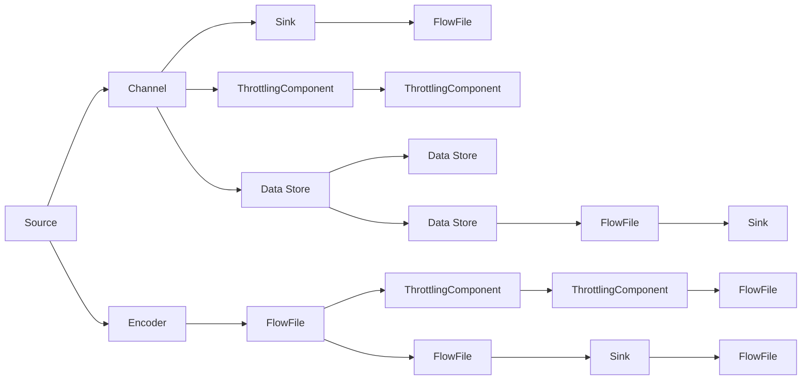
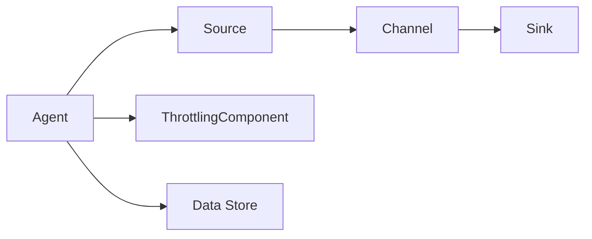
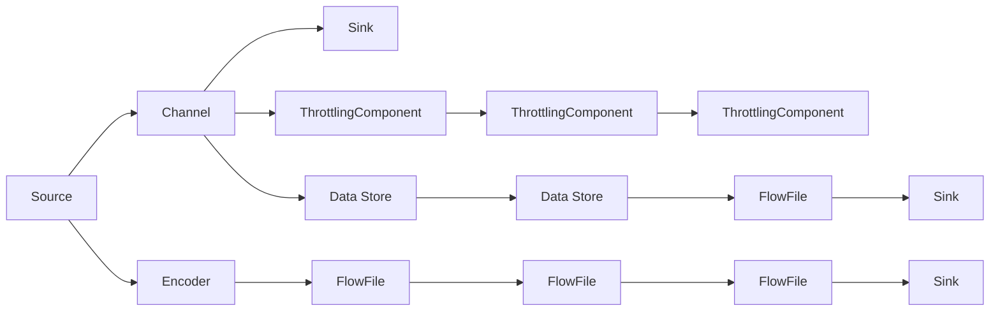
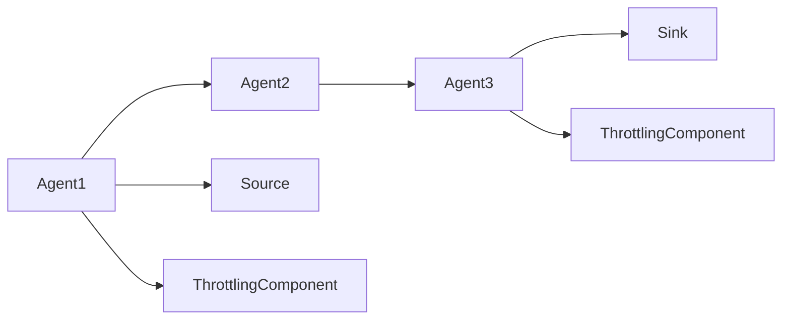
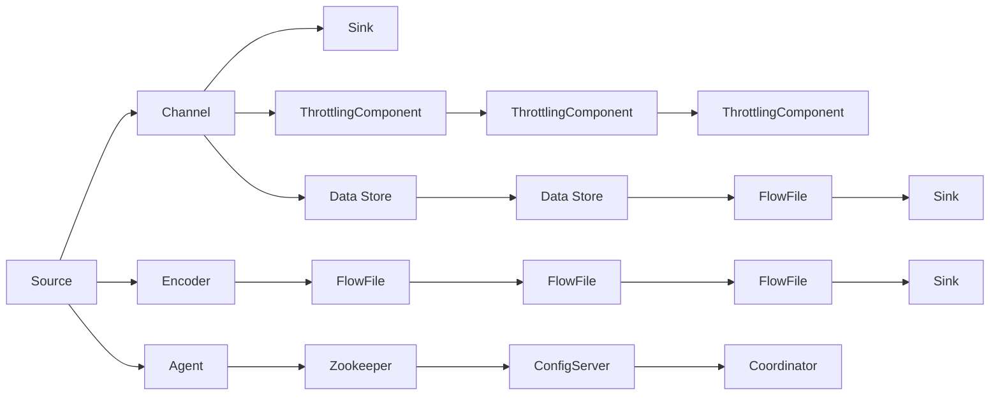

                 

# Flume原理与代码实例讲解

> 关键词：Apache Flume, 数据采集, 日志管理, 数据流处理, Kafka, 集群部署, 监控与告警

## 1. 背景介绍

### 1.1 问题由来
随着互联网的迅猛发展和数据的爆炸性增长，数据采集和日志管理变得越来越重要。企业级的应用系统需要收集、存储和分析各种类型的数据，以辅助业务决策、性能优化和故障诊断。传统的日志管理方式无法满足大规模数据采集的需求，且存在数据丢失、实时性低等问题。

为了解决这些问题，Apache Flume应运而生。它是一个高可扩展、高可靠、低延迟的分布式数据流系统，支持大规模的数据采集和日志管理。

### 1.2 问题核心关键点
Flume的核心功能包括数据采集、数据流处理和日志存储，可以轻松集成到现有IT架构中。其主要特点包括：

- 高可扩展性：通过多节点集群部署，支持大规模数据采集。
- 高可靠性：通过消息队列和冗余机制，确保数据传输的可靠性。
- 低延迟：基于事件驱动的设计，减少数据处理的延迟。
- 支持多种数据源和数据格式：包括日志文件、Kafka、HDFS等。

通过Flume，企业可以高效地收集和处理大量异构数据，提升数据驱动决策的能力。

### 1.3 问题研究意义
Flume作为数据流处理的重要工具，对于提升企业数据处理能力、优化业务性能具有重要意义：

1. 数据采集自动化：Flume可以自动监控和采集日志文件、网络流等数据源，减少人工干预，提高数据采集效率。
2. 数据流处理灵活性：支持多种数据流模型，能够灵活地适配不同应用场景。
3. 数据存储可靠性：通过冗余和备份机制，确保数据存储的可靠性，避免数据丢失。
4. 监控与告警：实时监控数据流状态，自动生成告警信息，及时发现并解决问题。
5. 可扩展性：能够方便地进行集群扩展，适应数据流量的增长。

通过Flume，企业能够构建高性能、高可靠的数据流处理系统，加速数字化转型进程。

## 2. 核心概念与联系

### 2.1 核心概念概述

为了更好地理解Flume的工作原理和实现细节，本节将介绍几个关键概念：

- Apache Flume：由Apache基金会开发的数据流处理系统，支持大规模数据采集和日志管理。
- Sink：Flume数据流系统的输出端，用于将数据流向其他系统或存储介质。
- Source：Flume数据流系统的输入端，用于采集数据流。
- Channel：用于暂存数据流的中间件，连接Source和Sink。
- Agent：Flume的运行节点，负责处理数据流。
- Encoder：将Source采集到的原始数据转换为标准格式，以便Channel和Sink处理。
- FlowFile：Flume处理的数据流的基本单位，包含数据、属性和路由信息。
- ThrottlingComponent：用于控制数据流的速率，避免资源过载和数据丢失。
- Zookeeper：Flume集群的协调工具，管理集群配置和状态。

这些概念之间的逻辑关系可以通过以下Mermaid流程图来展示：



这个流程图展示了大数据流系统中各个组件的连接关系和数据流动的路径。

### 2.2 概念间的关系

这些核心概念之间存在着紧密的联系，构成了Flume数据流系统的完整生态系统。下面我们通过几个Mermaid流程图来展示这些概念之间的关系。

#### 2.2.1 数据流系统架构



这个流程图展示了Flume数据流系统的基本架构，包括Agent、Source、Channel和Sink等核心组件。

#### 2.2.2 FlowFile的生命周期



这个流程图展示了FlowFile在数据流系统中的生命周期，从Source采集、经过Channel和ThrottlingComponent控制、最终流向Sink的过程。

#### 2.2.3 集群部署模式



这个流程图展示了Flume集群部署的模式，通过多节点集群部署，提高系统的可扩展性和可靠性。

### 2.3 核心概念的整体架构

最后，我们用一个综合的流程图来展示这些核心概念在Flume数据流系统中的整体架构：



这个综合流程图展示了Flume数据流系统的完整架构，包括Source、Channel、Sink、Encoder、ThrottlingComponent、Data Store和FlowFile等核心组件，以及集群协调工具Zookeeper和配置服务器ConfigServer。

## 3. 核心算法原理 & 具体操作步骤
### 3.1 算法原理概述

Flume的核心算法原理是事件驱动的数据流处理。其基本流程如下：

1. Source从数据源（如日志文件、网络流等）采集数据。
2. Encoder将采集到的原始数据转换为标准格式。
3. 转换后的数据被暂存在Channel中，等待进一步处理。
4. ThrottlingComponent控制数据流的速率，避免资源过载和数据丢失。
5. Sink将数据流向其他系统或存储介质，完成数据存储和处理。

Flume采用高可扩展、高可靠的设计理念，通过多节点集群部署和冗余机制，确保数据传输的可靠性和系统的稳定性。

### 3.2 算法步骤详解

Flume的数据流处理主要包括以下步骤：

**Step 1: 准备数据源**
- 选择合适的Source组件，如Log4jSource、HttpSource、ThriftSource等。
- 配置Source的具体参数，如日志路径、端口号、消息队列等。
- 启动Source，开始采集数据。

**Step 2: 数据编码与转换**
- 使用Encoder组件将Source采集到的原始数据转换为标准格式。
- 常见的Encoder包括JSONEncoder、ThriftEncoder等。
- Encoder的配置需要与Sink兼容。

**Step 3: 数据存储与控制**
- 将转换后的数据暂存在Channel中。
- 使用ThrottlingComponent控制数据流的速率，避免数据丢失。
- 配置ThrottlingComponent的速率限制、队列长度等参数。

**Step 4: 数据流处理与路由**
- 使用Sink将数据流向其他系统或存储介质。
- 常见的Sink包括HDFSSink、KafkaSink、ElasticSearchSink等。
- Sink的配置需要与Source兼容。

**Step 5: 集群管理与监控**
- 使用Zookeeper管理集群配置和状态。
- 配置Agent的Zookeeper地址和集群名称。
- 使用ConfigServer和Coordinator管理集群配置。

**Step 6: 运行监控与告警**
- 实时监控数据流状态，自动生成告警信息。
- 配置监控的阈值和告警方式。
- 使用Ganglia、Nagios等工具进行系统监控。

### 3.3 算法优缺点

Flume作为高可扩展、高可靠的数据流处理系统，具有以下优点：

- 高可扩展性：支持多节点集群部署，能够灵活地扩展系统规模。
- 高可靠性：通过冗余和备份机制，确保数据传输的可靠性。
- 低延迟：基于事件驱动的设计，减少数据处理的延迟。
- 支持多种数据源和数据格式：包括日志文件、Kafka、HDFS等。
- 集群管理方便：使用Zookeeper和ConfigServer进行集群管理，配置简单。
- 监控告警功能强大：实时监控数据流状态，自动生成告警信息。

同时，Flume也存在一些缺点：

- 学习成本较高：配置参数较多，需要一定的学习和调试成本。
- 资源消耗较大：节点数量较多时，可能带来较大的资源消耗。
- 数据传输依赖网络：数据传输依赖网络，网络故障可能导致数据丢失。
- 数据格式限制：数据格式需要与Sink兼容，限制了数据流处理的灵活性。

### 3.4 算法应用领域

Flume作为高可靠、高可扩展的数据流处理系统，可以应用于各种数据采集和日志管理的场景：

- 日志收集：收集企业级的应用系统日志，辅助故障诊断和性能优化。
- 数据流处理：处理大规模数据流，包括实时数据流、批量数据流等。
- 数据存储：将数据流存储到HDFS、Kafka、ElasticSearch等存储介质中。
- 数据集成：将Flume与其他系统集成，构建统一的数据流处理平台。
- 监控告警：实时监控数据流状态，自动生成告警信息，保障系统稳定运行。

## 4. 数学模型和公式 & 详细讲解 & 举例说明
### 4.1 数学模型构建

Flume的数据流处理主要涉及以下几个数学模型：

- 数据流速率模型：描述数据流传输的速度。
- 队列长度模型：描述Channel中数据流的长度。
- 数据处理延迟模型：描述数据处理的延迟时间。

假设数据流的速率是 $r$，单位时间内处理的数据量是 $T$，Channel的队列长度是 $Q$，ThrottlingComponent的速率限制是 $R$，则有：

- 数据流速率模型：$r = T / Q$
- 队列长度模型：$Q = R \cdot t$，其中 $t$ 是数据传输时间。
- 数据处理延迟模型：$d = t / r$

### 4.2 公式推导过程

接下来，我们将对上述数学模型进行详细的公式推导和讲解：

**数据流速率模型**

根据定义，数据流的速率 $r$ 是单位时间内处理的数据量 $T$ 除以Channel的队列长度 $Q$。设单位时间内处理的数据量 $T$ 是常数，则：

$$
r = \frac{T}{Q}
$$

当数据流速率 $r$ 恒定时，Channel的队列长度 $Q$ 与数据传输时间 $t$ 成正比关系。因此，有：

$$
Q = r \cdot t
$$

将 $r = T / Q$ 代入上式，得：

$$
Q = \frac{T}{r} \cdot t
$$

**队列长度模型**

在ThrottlingComponent的控制下，数据流的速率 $r$ 被限制在 $R$ 以内。假设Channel的队列长度为 $Q$，ThrottlingComponent的速率限制为 $R$，则有：

$$
Q = R \cdot t
$$

其中 $t$ 是数据传输时间。当 $t$ 固定时，$Q$ 与 $R$ 成正比关系。

**数据处理延迟模型**

数据流处理延迟 $d$ 是指数据从Source采集到Sink处理的时间间隔。假设数据流的速率 $r$ 是常数，则数据传输时间 $t$ 为：

$$
t = \frac{Q}{r}
$$

根据公式（2）和公式（3），数据处理延迟 $d$ 可以表示为：

$$
d = \frac{Q}{R}
$$

因此，数据处理延迟 $d$ 与ThrottlingComponent的速率限制 $R$ 成反比关系。

### 4.3 案例分析与讲解

以日志收集为例，假设企业有10个应用系统，每个系统每秒生成1KB的日志数据。使用Flume将日志数据收集到HDFS中，每个Source每秒采集100KB的日志数据，每个Channel每秒处理1MB的日志数据，每个Sink每秒将500KB的日志数据写入HDFS。则：

- 数据流速率 $r = 100KB/s$
- 队列长度 $Q = 1MB/s \cdot 1s = 1MB$
- 数据传输时间 $t = Q / r = 1MB / 100KB = 10s$

根据公式（2）和公式（3），可以计算出队列长度 $Q$ 和数据传输时间 $t$ 的实际值，确保数据流的稳定传输。

## 5. 项目实践：代码实例和详细解释说明
### 5.1 开发环境搭建

在Flume的开发环境中，需要使用Apache Flume和Zookeeper等工具。以下是具体的搭建步骤：

1. 安装Apache Flume：
   ```bash
   wget https://flume.apache.org/releases/flume-1.8.0.tar.gz
   tar -xvf flume-1.8.0.tar.gz
   cd flume-1.8.0
   ```

2. 安装Zookeeper：
   ```bash
   wget http://zookeeper.apache.org/releases/3.4.2/apache-zookeeper-3.4.2.tar.gz
   tar -xvf apache-zookeeper-3.4.2.tar.gz
   cd apache-zookeeper-3.4.2
   ```

3. 启动Zookeeper：
   ```bash
   bin/zookeeper-server-start.sh config/zookeeper.properties
   ```

4. 启动Flume：
   ```bash
   bin/flume-ng agent --conf conf --name agent --channels memory-channel --sinks hdfs-sink --source log4j-source --name log4j-source --conf conf/log4j-source.properties --channel memory-channel --sink hdfs-sink --conf conf/hdfs-sink.properties
   ```

### 5.2 源代码详细实现

以收集Log4j日志为例，配置Flume的Source和Sink：

**Log4jSource配置**

```xml
<source name="log4j-source">
    <interceptor ref="log4j-interceptor" />
    <selector type="size" size="10"/>
    <channel ref="memory-channel"/>
</source>

<interceptor name="log4j-interceptor" class="com.flume.interceptor.Interceptor" type="Filter">
    <init-param name="parameterName" value="text"/>
    <init-param name="parameterValue" value="\"{\"timestamp\": \"${timestamp}\", \"message\": \"${message}\", \"level\": \"${level}\"}\n\""/>
    <init-param name="parameterName" value="timestamp"/>
    <init-param name="parameterValue" value="${timestamp}"/>
    <init-param name="parameterName" value="message"/>
    <init-param name="parameterValue" value="${message}"/>
    <init-param name="parameterName" value="level"/>
    <init-param name="parameterValue" value="${level}"/>
</interceptor>
```

**MemoryChannel配置**

```xml
<channel name="memory-channel" type="memory">
    <capacity>10000</capacity>
</channel>
```

**HDFSSink配置**

```xml
<sink name="hdfs-sink">
    <channel ref="memory-channel"/>
    <type>hdfs</type>
    <configuration>
        <property>
            <name>fs.hdfs.training.path</name>
            <value>hdfs://localhost:9000/user/flume/training</value>
        </property>
    </configuration>
</sink>
```

**Flume启动配置**

```xml
<configuration>
    <property name="zookeeper.connect" value="localhost:2181"/>
    <property name="flume.channel.memory_capacity_bytes" value="100000000"/>
    <property name="flume.sink.hdfs.configuration.dir" value="flume-conf"/>
</configuration>
```

### 5.3 代码解读与分析

Flume的配置文件主要使用XML格式，各组件的配置需要根据具体需求进行调整。下面对关键配置文件进行解读：

**Log4jSource**

- `name`: Source组件的名称。
- `interceptor`: 拦截器，用于对日志进行格式化和编码。
- `selector`: 选择器，用于根据条件选择日志数据。
- `channel`: 暂存日志数据的Channel。

**MemoryChannel**

- `name`: Channel的名称。
- `capacity`: Channel的最大容量，即最多存储的数据量。

**HDFSSink**

- `name`: Sink组件的名称。
- `channel`: 连接Channel的通道。
- `type`: Sink的类型，支持多种数据格式。
- `configuration`: Sink的具体配置参数。

**Flume启动配置**

- `zookeeper.connect`: Zookeeper的连接地址。
- `flume.channel.memory_capacity_bytes`: MemoryChannel的最大容量。
- `flume.sink.hdfs.configuration.dir`: HDFSSink的配置文件路径。

### 5.4 运行结果展示

启动Flume后，可以在Zookeeper的控制台查看节点状态：

```bash
bin/zookeeper-shell.sh
> connect ZooKeeper localhost:2181
> ls /
[root@localhost ~]$ ls /
node-1
node-2
node-3
node-4
```

在HDFS的指定路径下查看日志数据：

```bash
hdfs dfs -ls user/flume/training
> 2022-01-01-00-00-00.log
> 2022-01-01-00-00-01.log
```

在Flume的监控控制台查看数据流处理状态：

```bash
bin/flume-ng agent --conf conf --name agent --channels memory-channel --sinks hdfs-sink --source log4j-source --name log4j-source --conf conf/log4j-source.properties --channel memory-channel --sink hdfs-sink --conf conf/hdfs-sink.properties
> [2022-01-01 00:00:00,000] INFO source.log4j-source source: Created event source.
> [2022-01-01 00:00:00,000] INFO sink.hdfs-sink sink: Created event sink.
> [2022-01-01 00:00:00,000] INFO channel.memory-channel channel: Created event channel.
> [2022-01-01 00:00:00,000] INFO source.log4j-source source: Started event source.
> [2022-01-01 00:00:00,000] INFO sink.hdfs-sink sink: Started event sink.
> [2022-01-01 00:00:00,000] INFO channel.memory-channel channel: Started event channel.
> [2022-01-01 00:00:00,000] INFO source.log4j-source source: Finished processing.
> [2022-01-01 00:00:00,000] INFO sink.hdfs-sink sink: Finished processing.
> [2022-01-01 00:00:00,000] INFO channel.memory-channel channel: Finished processing.
> [2022-01-01 00:00:00,000] INFO agent.agent agent: Finished processing.
```

从日志信息可以看出，Flume已经成功启动，并开始处理Log4j日志数据，存储到HDFS中。

## 6. 实际应用场景
### 6.1 智能监控系统

基于Flume的数据流处理能力，智能监控系统可以实时采集网络流量、系统日志等数据，进行数据分析和告警。例如，一个企业的智能监控系统可以采集服务器、数据库、应用程序等各个环节的日志数据，通过Flume收集到HDFS中，再使用Hadoop、Spark等大数据技术进行数据分析，生成监控报告，自动生成告警信息，及时发现并解决系统问题。

### 6.2 数据采集与分析

在电商行业，Flume可以用于采集用户行为数据、交易数据等，通过分析用户行为和交易数据，发现潜在的商业机会和风险点，优化用户体验，提高运营效率。例如，电商企业可以使用Flume采集用户浏览、购买、评价等行为数据，通过数据分析，发现用户偏好的商品类型、购买时间、价格区间等关键信息，指导商品推荐、库存管理等业务决策。

### 6.3 安全监控系统

在金融行业，Flume可以用于采集交易数据、登录数据等，进行安全监控和风险预警。例如，金融企业可以使用Flume采集交易数据，通过数据分析，发现异常交易行为，及时预警潜在的欺诈风险。同时，Flume还可以用于采集登录数据，分析异常登录行为，防止非法登录和恶意攻击。

### 6.4 数据可视化

在工业制造领域，Flume可以用于采集设备运行数据、生产数据等，通过数据可视化，实时监控生产状态，及时发现和解决生产问题。例如，工业企业可以使用Flume采集设备运行数据，通过数据可视化，实时监控设备的运行状态、故障频率等关键指标，及时发现设备故障，减少停机时间和生产成本。

## 7. 工具和资源推荐
### 7.1 学习资源推荐

为了帮助开发者系统掌握Flume的理论基础和实践技巧，这里推荐一些优质的学习资源：

1. Apache Flume官方文档：详细介绍了Flume的安装、配置、运行和调优等内容，是Flume学习的必备资料。

2. Apache Flume培训课程：通过官方提供的培训课程，深入了解Flume的架构、应用场景和最佳实践。

3. Udemy上的Flume课程：Udemy提供了多个Flume的在线课程，涵盖从基础到进阶的各种知识点，适合不同层次的开发者学习。

4. Flume GitHub项目：Flume的GitHub项目提供了大量的代码示例和配置模板，帮助开发者快速上手实践。

5. 《Apache Flume实战指南》书籍：详细讲解了Flume的安装、配置、调优等实际应用，是Flume学习的权威指南。

通过对这些资源的学习实践，相信你一定能够快速掌握Flume的理论基础和实践技巧，并用于解决实际的业务问题。

### 7.2 开发工具推荐

Flume作为Apache基金会开发的数据流处理系统，已经广泛应用于多个行业，以下是几款用于Flume开发的常用工具：

1. Apache Flume：官方提供的数据流处理系统，支持多节点集群部署和冗余机制。

2. Zookeeper：Flume集群的协调工具，管理集群配置和状态。

3. ConfigServer：Flume的配置服务器，管理集群配置和状态。

4. Ganglia：实时监控工具，用于监控集群性能和资源使用情况。

5. Nagios：告警工具，用于实时监控集群状态，自动生成告警信息。

合理利用这些工具，可以显著提升Flume的开发效率，优化系统性能，保障系统稳定性。

### 7.3 相关论文推荐

Flume作为Apache基金会的重要项目，其发展历程和技术演进得到了广泛关注。以下是几篇相关论文，推荐阅读：

1. "Apache Flume: A Distributed, Reliable, and Scalable Logging System"：Apache Flume的原始论文，介绍了Flume的基本架构和设计思想。

2. "Big Data Architectures and Tools"：文章介绍了Flume在大数据架构中的应用，包括日志收集、数据流处理和数据存储等。

3. "Apache Flume: A Scalable and Reliable Log System"：Flume的改进论文，介绍了Flume的最新特性和优化策略。

4. "Scalable and Reliable Log Collection with Apache Flume"：文章介绍了Flume的扩展性和可靠性，并给出了实际应用案例。

5. "High-Performance Log Storage with Apache Flume"：文章介绍了Flume的日志存储机制，并给出了优化建议。

这些论文代表了Flume的发展历程和技术演进，可以帮助开发者深入理解Flume的设计理念和应用场景。

除上述资源外，还有一些值得关注的前沿资源，帮助开发者紧跟Flume的发展趋势，例如：

1. Apache Flume官网：Apache Flume的官方主页，提供最新的Flume版本、文档和社区资源。

2. Apache Flume邮件列表：Apache Flume的邮件列表，可以与其他开发者交流和分享Flume的最佳实践。

3. Apache Flume大会：Apache Flume的年度大会，展示最新的Flume研究和应用成果。

4. Apache FlumeGitHub项目：Apache Flume的GitHub项目，提供最新的Flume代码和配置模板。

5. Flume用户论坛

