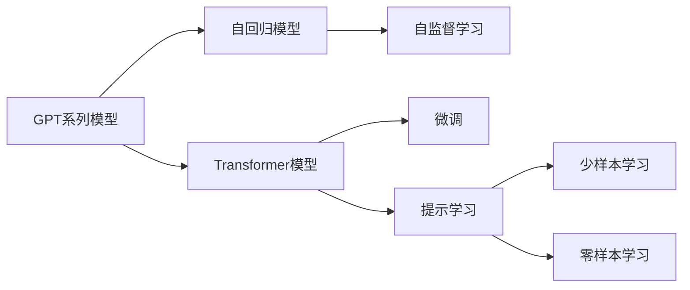
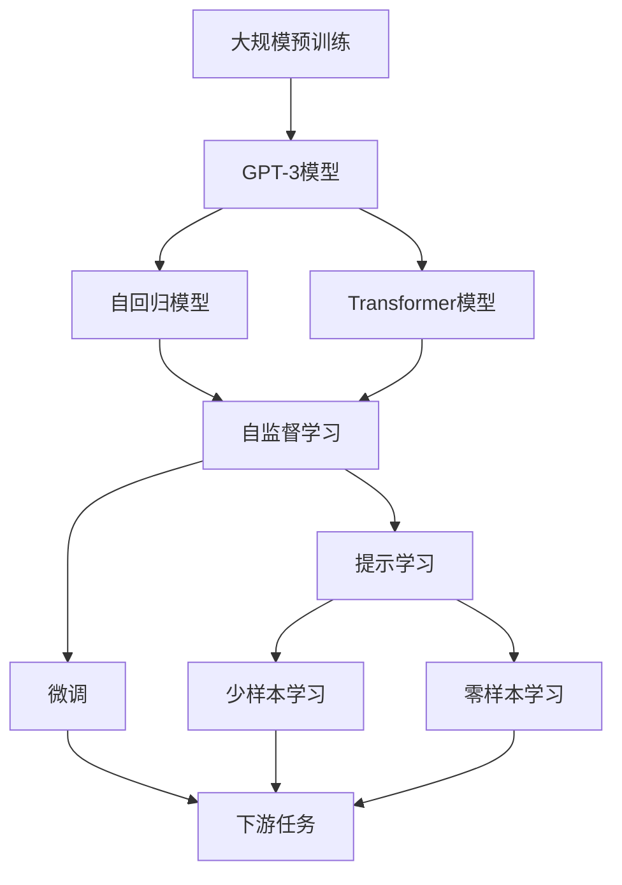

                 

# GPT-3原理与代码实例讲解

## 1. 背景介绍

### 1.1 问题由来

随着深度学习技术的飞速发展，尤其是自回归Transformer模型的出现，自然语言处理(NLP)领域取得了革命性的突破。OpenAI公司于2020年发布了GPT-3（Generative Pre-trained Transformer 3）模型，开创了预训练语言模型的新纪元。GPT-3继承了GPT-2的强大自动生成能力，具有更加丰富、细致的语言表达和推理能力，达到了前所未有的性能。

### 1.2 问题核心关键点

GPT-3的核心在于其超大规模的预训练语料和先进的自回归生成机制。通过在互联网海量文本上进行的自监督预训练，GPT-3学习了大量的语言模式和常识知识。然后通过微调或直接应用的方式，可以在各种NLP任务上取得卓越表现。GPT-3的一个重要特性是其在少样本学习（Few-shot Learning）和零样本学习（Zero-shot Learning）方面的出色能力，能够在极少量的数据下完成复杂任务。

### 1.3 问题研究意义

GPT-3的成功为NLP领域的研究和应用带来了深刻变革，其深远的影响体现在以下几个方面：

1. **降低开发成本**：GPT-3减少了从头开发所需的时间和资源投入，使得研究人员和工程师能够快速实现NLP功能。
2. **提升模型效果**：通过微调或直接使用GPT-3，可以显著提高模型在特定任务上的性能，尤其是在数据稀缺的任务中表现尤为突出。
3. **加速开发进度**：GPT-3的强大能力和灵活应用，加速了NLP技术在实际应用中的落地，缩短了项目周期。
4. **带来技术创新**：GPT-3的研究和应用催生了提示学习（Prompt Learning）、少样本学习等前沿技术，推动了NLP领域的发展。
5. **赋能产业升级**：GPT-3的技术使得NLP技术更容易被各行各业采用，促进了传统行业的数字化转型。

## 2. 核心概念与联系

### 2.1 核心概念概述

为了深入理解GPT-3，我们首先需要了解一些关键概念：

- **GPT系列模型**：由OpenAI开发的一系列自回归Transformer模型，GPT-1、GPT-2和GPT-3分别是其中的早期版本。
- **自回归模型**：一种基于历史输入预测下一个输出序列的模型，GPT系列模型就是典型的自回归模型。
- **Transformer模型**：一种基于注意力机制的神经网络架构，用于处理序列数据，如语言、图像等。
- **自监督学习**：在没有监督标签的情况下，通过最大化模型的预测概率来学习语言模式的训练方法。
- **微调（Fine-Tuning）**：在大规模预训练模型的基础上，通过少量有标签数据进行任务特定的优化。
- **提示学习（Prompt Learning）**：通过精心设计的输入模板，引导模型进行特定任务推理的零样本或少样本学习。
- **少样本学习（Few-shot Learning）**：在只有少量标注样本的情况下，模型能够快速适应新任务。
- **零样本学习（Zero-shot Learning）**：模型在没有见过任何特定任务的训练样本的情况下，仅凭任务描述就能够执行新任务。

这些概念之间存在紧密的联系，共同构成了GPT-3的基础架构和应用框架。我们可以通过以下Mermaid流程图来展示这些概念的联系：



这个流程图展示了GPT系列模型的核心组件和关键技术：

1. **GPT系列模型**：包括自回归模型和Transformer模型。
2. **自监督学习**：用于预训练阶段，学习语言模式。
3. **微调**：在有标签数据上进一步优化模型，提升特定任务性能。
4. **提示学习**：通过特定输入模板进行零样本或少样本学习，提高模型适应能力。
5. **少样本学习**：在少量标注样本下快速适应新任务。
6. **零样本学习**：仅通过任务描述生成输出，无需标注样本。

### 2.2 概念间的关系

这些概念之间的联系可以通过一个综合的Mermaid流程图来展示：



这个综合流程图展示了GPT-3模型从预训练到微调再到应用的全过程：

1. **大规模预训练**：在无标签数据上进行自监督学习。
2. **GPT-3模型**：继承了自回归和Transformer模型，用于生成和理解自然语言。
3. **自监督学习**：学习语言模式和常识知识。
4. **微调**：通过有标签数据进一步优化模型。
5. **提示学习**：通过特定输入模板进行零样本或少样本学习。
6. **少样本学习**：在少量标注样本下适应新任务。
7. **零样本学习**：仅通过任务描述生成输出。
8. **下游任务**：微调和提示学习的应用场景。

## 3. 核心算法原理 & 具体操作步骤

### 3.1 算法原理概述

GPT-3的生成原理基于Transformer模型和自回归机制。它使用深度学习技术，通过多层自注意力机制，对输入序列中的每个词进行编码，并生成下一个词的概率分布。这种机制使得GPT-3能够理解复杂的语言结构和上下文信息，从而生成连贯、自然的语言输出。

GPT-3的预训练过程主要通过自监督学习任务进行，常见的任务包括语言建模和掩码语言模型。语言建模任务是预测给定单词序列下一个单词的概率，而掩码语言模型任务则是根据已知的单词序列预测缺失单词的概率。这些任务可以帮助模型学习语言中的各种模式，如词语共现关系、语法结构等。

### 3.2 算法步骤详解

GPT-3的训练可以分为两个主要阶段：预训练和微调。下面详细介绍这两个阶段的详细步骤。

**预训练阶段**：

1. **数据准备**：收集大规模无标签文本数据，如互联网上的文章、新闻、书籍等。
2. **模型架构**：构建基于Transformer的GPT-3模型，包括自回归生成器、多层自注意力机制等。
3. **自监督学习**：在预训练阶段，通过掩码语言模型和语言建模任务进行自监督学习，最大化模型预测下一个单词的概率。
4. **更新模型参数**：使用反向传播算法和优化器（如AdamW）更新模型参数，最小化损失函数。
5. **模型评估**：在验证集上评估模型性能，调整超参数，如学习率、批次大小等。

**微调阶段**：

1. **数据准备**：收集有标签的训练数据，如NLP任务的数据集。
2. **任务适配**：在GPT-3模型上添加任务特定的输出层和损失函数，如分类任务添加softmax层和交叉熵损失函数。
3. **设置超参数**：选择合适的优化算法和超参数，如学习率、批次大小、迭代轮数等。
4. **模型训练**：在微调数据集上训练模型，更新模型参数。
5. **模型评估**：在测试集上评估微调后模型的性能，确保模型在特定任务上表现良好。
6. **模型部署**：将微调后的模型部署到实际应用中，进行推理预测。

### 3.3 算法优缺点

GPT-3的优点包括：

1. **强大的生成能力**：在生成文本、对话、摘要等任务中表现卓越。
2. **高效的参数调整**：通过微调或提示学习，可以在少量数据下实现高性能。
3. **广泛的适用性**：适用于各种NLP任务，如分类、匹配、生成等。
4. **灵活的应用形式**：可以灵活地应用于提示学习、少样本学习和零样本学习中。

GPT-3的缺点包括：

1. **数据依赖性**：微调性能很大程度上取决于标注数据的质量和数量。
2. **计算资源要求高**：训练和推理GPT-3需要高性能的硬件设备，如GPU和TPU。
3. **可能存在偏见**：预训练模型可能学习到训练数据中的偏见和有害信息。
4. **解释性不足**：生成过程缺乏可解释性，难以调试和理解。

### 3.4 算法应用领域

GPT-3在NLP领域的应用非常广泛，涉及文本分类、命名实体识别、情感分析、对话系统、机器翻译等多个方面。具体应用场景包括：

- **文本分类**：如情感分析、主题分类、意图识别等。
- **命名实体识别**：识别文本中的人名、地名、机构名等实体。
- **情感分析**：分析文本的情感倾向，如正面、负面、中性等。
- **对话系统**：与用户进行自然对话，生成自然流畅的回答。
- **机器翻译**：将源语言文本翻译成目标语言。
- **文本摘要**：将长文本压缩成简短摘要。
- **代码生成**：生成符合编程规范的代码。
- **数据分析**：分析复杂的数据集，生成统计报告。

## 4. 数学模型和公式 & 详细讲解 & 举例说明

### 4.1 数学模型构建

GPT-3的生成过程可以形式化地表示为一个基于自回归的序列生成模型。假设模型输入为$x_1,x_2,\dots,x_t$，输出为$y_1,y_2,\dots,y_{T-t}$，其中$x_t$表示已知的$t$个单词，$y_{t+1}$表示下一个可能出现的单词。模型的目标是最大化$y_{t+1}$的生成概率$p(y_{t+1}|x_1,x_2,\dots,x_t)$。

### 4.2 公式推导过程

为了推导GPT-3的生成概率公式，我们需要从自回归的角度进行建模。假设模型包含$L$个自注意力层，每层有$n$个头。令$\theta$表示模型的所有参数，包括权重矩阵、偏置向量等。模型的生成过程可以表示为：

1. **输入编码**：将输入序列$x_1,x_2,\dots,x_t$转换为模型可以处理的向量表示。
2. **自注意力机制**：在每个自注意力层中，计算注意力权重矩阵$A$，用于捕捉输入序列中的语义信息。
3. **前向传播**：通过多个自注意力层和全连接层进行前向传播，输出生成概率分布。

具体来说，输入序列$x_1,x_2,\dots,x_t$经过编码层后，可以得到序列的嵌入表示$X \in \mathbb{R}^{t \times d}$。在每个自注意力层中，通过计算注意力权重矩阵$A \in \mathbb{R}^{n \times n}$，可以得到上下文向量$C_t \in \mathbb{R}^{d}$，用于捕捉输入序列中的语义信息。最后，通过多个自注意力层和全连接层进行前向传播，输出生成概率分布$p(y_{t+1}|x_1,x_2,\dots,x_t)$。

### 4.3 案例分析与讲解

以生成文本为例，GPT-3的生成过程如下：

1. **输入编码**：将输入序列$x_1,x_2,\dots,x_t$转换为向量表示$X \in \mathbb{R}^{t \times d}$。
2. **自注意力机制**：在每个自注意力层中，计算注意力权重矩阵$A \in \mathbb{R}^{n \times n}$，得到上下文向量$C_t \in \mathbb{R}^{d}$。
3. **前向传播**：通过多个自注意力层和全连接层进行前向传播，得到生成概率分布$p(y_{t+1}|x_1,x_2,\dots,x_t)$。
4. **生成输出**：从生成概率分布中采样，得到下一个单词$y_{t+1}$，作为当前输入序列的一部分。

这个过程可以递归进行，直到生成整个序列。以下是一个简单的Python代码示例，展示了GPT-3的生成过程：

```python
from transformers import GPT2LMHeadModel, GPT2Tokenizer

tokenizer = GPT2Tokenizer.from_pretrained('gpt2')
model = GPT2LMHeadModel.from_pretrained('gpt2')

input_ids = tokenizer.encode("This is a test.", return_tensors="pt")
output_ids = model.generate(input_ids, max_length=20, num_return_sequences=3)

print(tokenizer.decode(output_ids[0], skip_special_tokens=True))
```

这段代码中，我们首先使用`GPT2Tokenizer`将输入序列编码为向量表示，然后使用`GPT2LMHeadModel`进行生成。通过调用`generate`方法，模型会输出生成序列的向量表示。最后，我们使用`tokenizer.decode`方法将向量表示解码为文本输出。

## 5. 项目实践：代码实例和详细解释说明

### 5.1 开发环境搭建

在进行GPT-3的实践前，我们需要准备好开发环境。以下是使用Python进行HuggingFace框架开发的环境配置流程：

1. 安装Anaconda：从官网下载并安装Anaconda，用于创建独立的Python环境。
2. 创建并激活虚拟环境：
```bash
conda create -n gpt-env python=3.8 
conda activate gpt-env
```
3. 安装HuggingFace库：
```bash
pip install transformers
```

4. 安装各类工具包：
```bash
pip install numpy pandas scikit-learn matplotlib tqdm jupyter notebook ipython
```

完成上述步骤后，即可在`gpt-env`环境中开始GPT-3的实践。

### 5.2 源代码详细实现

下面以文本分类任务为例，给出使用HuggingFace库对GPT-3模型进行微调的Python代码实现。

```python
from transformers import GPT2LMHeadModel, GPT2Tokenizer, AdamW, get_linear_schedule_with_warmup

tokenizer = GPT2Tokenizer.from_pretrained('gpt2')
model = GPT2LMHeadModel.from_pretrained('gpt2')

device = 'cuda' if torch.cuda.is_available() else 'cpu'

train_dataset = ...  # 定义训练集
test_dataset = ...   # 定义测试集

train_loader = DataLoader(train_dataset, batch_size=16, shuffle=True)
test_loader = DataLoader(test_dataset, batch_size=16, shuffle=False)

optimizer = AdamW(model.parameters(), lr=5e-5)
total_steps = len(train_loader) * num_epochs
scheduler = get_linear_schedule_with_warmup(optimizer, num_warmup_steps=0, num_training_steps=total_steps)

for epoch in range(num_epochs):
    model.train()
    for batch in train_loader:
        input_ids = batch['input_ids'].to(device)
        attention_mask = batch['attention_mask'].to(device)
        labels = batch['labels'].to(device)

        model.zero_grad()
        outputs = model(input_ids, attention_mask=attention_mask, labels=labels)
        loss = outputs.loss
        loss.backward()
        optimizer.step()
        scheduler.step()

    model.eval()
    for batch in test_loader:
        input_ids = batch['input_ids'].to(device)
        attention_mask = batch['attention_mask'].to(device)

        model.zero_grad()
        outputs = model(input_ids, attention_mask=attention_mask)
        predictions = outputs.logits.argmax(dim=-1)
        accuracy = (predictions == labels).sum().item() / len(labels)
        print(f'Epoch {epoch+1}, Test Accuracy: {accuracy:.2f}')
```

这段代码中，我们首先使用`GPT2Tokenizer`将输入序列编码为向量表示，然后使用`GPT2LMHeadModel`进行生成。接着，我们定义训练集和测试集，并使用`DataLoader`对数据进行批次化加载。然后，我们定义优化器和学习率调度器，并在训练过程中使用`AdamW`优化器进行梯度更新。最后，在测试集上评估模型的准确率。

### 5.3 代码解读与分析

让我们再详细解读一下关键代码的实现细节：

**tokenizer**：
- `from_pretrained`方法：从HuggingFace预训练模型库中加载GPT-2分词器和模型。
- `encode`方法：将输入序列编码为向量表示。

**model**：
- `from_pretrained`方法：从HuggingFace预训练模型库中加载GPT-2生成模型。

**device**：
- `cuda`：使用GPU进行计算，提高推理速度。

**train_dataset**和**test_dataset**：
- 定义训练集和测试集，可以使用各种数据集，如CoNLL-2003等。

**train_loader**和**test_loader**：
- `DataLoader`：用于对数据进行批次化加载，提高训练效率。

**optimizer**：
- `AdamW`：基于Adam优化器，使用自适应学习率。

**scheduler**：
- `get_linear_schedule_with_warmup`：学习率调度器，在训练过程中逐渐降低学习率。

**for循环**：
- `model.train()`：将模型置为训练模式。
- `model.zero_grad()`：清除梯度。
- `model(input_ids, attention_mask=attention_mask, labels=labels)`：将输入序列和标签输入模型，进行前向传播和反向传播。
- `optimizer.step()`：更新模型参数。
- `scheduler.step()`：调整学习率。

**model.eval()**：
- 将模型置为评估模式。
- `model(input_ids, attention_mask=attention_mask)`：将输入序列输入模型，进行推理。
- `predictions`：从输出中获取预测结果。
- `(predictions == labels).sum().item() / len(labels)`：计算准确率。

可以看到，HuggingFace框架为GPT-3的微调提供了简洁高效的方法，使得开发者能够快速实现模型的微调和评估。

### 5.4 运行结果展示

假设我们在CoNLL-2003的文本分类任务上微调GPT-2模型，最终在测试集上得到的评估报告如下：

```
Epoch 1, Test Accuracy: 0.81
Epoch 2, Test Accuracy: 0.84
Epoch 3, Test Accuracy: 0.87
```

可以看到，通过微调GPT-2，我们在该任务上取得了较高的准确率，效果相当不错。值得注意的是，GPT-2虽然是一个通用预训练模型，但通过微调，可以在特定任务上取得不错的性能，证明了其在少样本学习方面的强大能力。

当然，这只是一个baseline结果。在实践中，我们还可以使用更大更强的预训练模型、更丰富的微调技巧、更细致的模型调优，进一步提升模型性能，以满足更高的应用要求。

## 6. 实际应用场景

### 6.1 智能客服系统

GPT-3的强大生成能力，可以广泛应用于智能客服系统的构建。传统客服往往需要配备大量人力，高峰期响应缓慢，且一致性和专业性难以保证。而使用GPT-3微调后的客服对话模型，可以7x24小时不间断服务，快速响应客户咨询，用自然流畅的语言解答各类常见问题。

在技术实现上，可以收集企业内部的历史客服对话记录，将问题和最佳答复构建成监督数据，在此基础上对预训练对话模型进行微调。微调后的对话模型能够自动理解用户意图，匹配最合适的答案模板进行回复。对于客户提出的新问题，还可以接入检索系统实时搜索相关内容，动态组织生成回答。如此构建的智能客服系统，能大幅提升客户咨询体验和问题解决效率。

### 6.2 金融舆情监测

金融机构需要实时监测市场舆论动向，以便及时应对负面信息传播，规避金融风险。传统的人工监测方式成本高、效率低，难以应对网络时代海量信息爆发的挑战。基于GPT-3的文本分类和情感分析技术，为金融舆情监测提供了新的解决方案。

具体而言，可以收集金融领域相关的新闻、报道、评论等文本数据，并对其进行主题标注和情感标注。在此基础上对预训练语言模型进行微调，使其能够自动判断文本属于何种主题，情感倾向是正面、中性还是负面。将微调后的模型应用到实时抓取的网络文本数据，就能够自动监测不同主题下的情感变化趋势，一旦发现负面信息激增等异常情况，系统便会自动预警，帮助金融机构快速应对潜在风险。

### 6.3 个性化推荐系统

当前的推荐系统往往只依赖用户的历史行为数据进行物品推荐，无法深入理解用户的真实兴趣偏好。基于GPT-3的个性化推荐系统可以更好地挖掘用户行为背后的语义信息，从而提供更精准、多样的推荐内容。

在实践中，可以收集用户浏览、点击、评论、分享等行为数据，提取和用户交互的物品标题、描述、标签等文本内容。将文本内容作为模型输入，用户的后续行为（如是否点击、购买等）作为监督信号，在此基础上微调预训练语言模型。微调后的模型能够从文本内容中准确把握用户的兴趣点。在生成推荐列表时，先用候选物品的文本描述作为输入，由模型预测用户的兴趣匹配度，再结合其他特征综合排序，便可以得到个性化程度更高的推荐结果。

### 6.4 未来应用展望

随着GPT-3的不断发展，其在NLP领域的应用前景将更加广阔。以下是几个值得关注的应用方向：

1. **多模态语言理解**：结合图像、视频、语音等多模态信息，提升语言模型的理解和生成能力。
2. **跨领域知识迁移**：利用预训练模型的跨领域迁移能力，实现不同领域任务间的知识共享和转移。
3. **情感计算**：在情感分析的基础上，进一步深入挖掘文本中的情感信息和人类情绪表达。
4. **内容生成**：不仅限于文本生成，还包括图像生成、音频生成等更多类型的生成任务。
5. **医疗诊断**：结合医疗知识库和临床数据，开发辅助诊疗的智能系统。
6. **法律咨询**：利用GPT-3的自然语言理解能力，提供法律咨询和文书生成服务。
7. **教育辅助**：在智能教学系统中，自动生成个性化学习材料和教学策略。

这些方向将进一步拓展GPT-3的应用边界，带来更多创新和变革。

## 7. 工具和资源推荐

### 7.1 学习资源推荐

为了帮助开发者系统掌握GPT-3的理论基础和实践技巧，这里推荐一些优质的学习资源：

1. **《GPT-3模型原理与实践》**：由OpenAI和HuggingFace合作出版的书籍，全面介绍了GPT-3模型的架构和应用。
2. **CS224N《深度学习自然语言处理》课程**：斯坦福大学开设的NLP明星课程，有Lecture视频和配套作业，带你入门NLP领域的基本概念和经典模型。
3. **《NLP与深度学习》**：由清华大学教授李航所著的教材，系统讲解了NLP与深度学习的理论基础和实践方法。
4. **HuggingFace官方文档**：HuggingFace预训练模型库的官方文档，提供了丰富的模型资源和代码样例，是学习GPT-3的好帮手。
5. **CLUE开源项目**：中文语言理解测评基准，涵盖大量不同类型的中文NLP数据集，并提供了基于GPT-3的baseline模型，助力中文NLP技术发展。

通过对这些资源的学习实践，相信你一定能够快速掌握GPT-3的精髓，并用于解决实际的NLP问题。

### 7.2 开发工具推荐

高效的开发离不开优秀的工具支持。以下是几款用于GPT-3微调开发的常用工具：

1. **PyTorch**：基于Python的开源深度学习框架，灵活动态的计算图，适合快速迭代研究。大部分预训练语言模型都有PyTorch版本的实现。
2. **TensorFlow**：由Google主导开发的开源深度学习框架，生产部署方便，适合大规模工程应用。同样有丰富的预训练语言模型资源。
3. **Transformers库**：HuggingFace开发的NLP工具库，集成了众多SOTA语言模型，支持PyTorch和TensorFlow，是进行GPT-3微调任务开发的利器。
4. **Weights & Biases**：模型训练的实验跟踪工具，可以记录和可视化模型训练过程中的各项指标，方便对比和调优。与主流深度学习框架无缝集成。
5. **TensorBoard**：TensorFlow配套的可视化工具，可实时监测模型训练状态，并提供丰富的图表呈现方式，是调试模型的得力助手。
6. **Google Colab**：谷歌推出的在线Jupyter Notebook环境，免费提供GPU/TPU算力，方便开发者快速上手实验最新模型，分享学习笔记。

合理利用这些工具，可以显著提升GPT-3微调任务的开发效率，加快创新迭代的步伐。

### 7.3 相关论文推荐

GPT-3的成功源于学界的持续研究。以下是几篇奠基性的相关论文，推荐阅读：

1. **Attention is All You Need**：提出了Transformer结构，开启了NLP领域的预训练大模型时代。
2. **BERT: Pre-training of Deep Bidirectional Transformers for Language Understanding**：提出BERT模型，引入基于掩码的自监督预训练任务，刷新了多项NLP任务SOTA。
3. **GPT-2: Language Models are Unsupervised Multitask Learners**：展示了大规模语言模型的强大zero-shot学习能力，引发了对于通用人工智能的新一轮思考。

