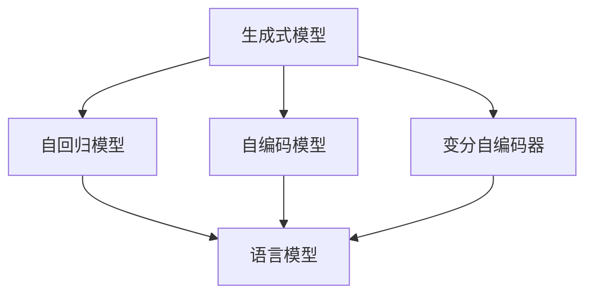
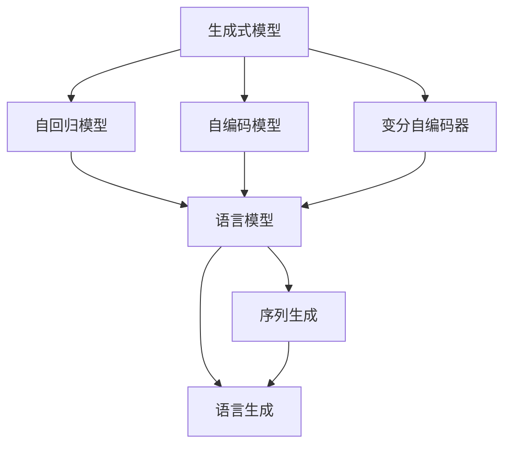

                 

# GPT作为生成式模型的天然优势

> 关键词：GPT, 生成式模型, 自回归模型, 自编码模型, 语言模型, 注意力机制, 解码器, 多模态学习, 变分自编码器, 序列生成, 语言生成, 文本生成

## 1. 背景介绍

在人工智能的浩瀚星空中，生成式模型（Generative Models）如同璀璨的星辰，以其独特的魅力和应用潜力吸引了众多研究者的目光。其中，GPT（Generative Pre-trained Transformer）系列模型作为生成式模型的杰出代表，凭借其出色的性能和广泛的适用性，成为了自然语言处理（NLP）领域的重要基石。本文将深入探讨GPT作为生成式模型的天然优势，揭示其背后的原理与技术细节，并展望未来在多模态学习、序列生成、语言生成等领域的应用前景。

## 2. 核心概念与联系

### 2.1 核心概念概述

为了更好地理解GPT的生成能力，我们先介绍几个关键概念：

- **生成式模型**：指通过学习数据分布，能够生成新样本的模型。常见的生成式模型包括自回归模型、自编码模型、变分自编码器等。
- **GPT**：全称为Generative Pre-trained Transformer，是一种基于Transformer架构的生成式模型，通过在大规模无标签文本数据上进行预训练，学习通用的语言表示，具备强大的语言生成能力。
- **自回归模型**：指模型先预测下一个词或下一个字符，然后根据已预测的词或字符进行下一步预测。常见自回归模型包括RNN、LSTM等。
- **自编码模型**：通过编码器将数据映射到低维空间，再通过解码器将低维表示映射回原始空间，实现数据的压缩与重构。常见的自编码模型包括VAE、GAN等。
- **变分自编码器**：一种特殊的自编码模型，通过学习数据分布的参数化表示，实现对数据的生成与重构。
- **语言模型**：指模型能够预测给定文本序列中下一个词或字符的概率。常见的语言模型包括N-gram模型、RNN语言模型、Transformer语言模型等。

这些概念之间存在紧密的联系，共同构成了生成式模型的基础架构。下面通过一个Mermaid流程图，展示它们之间的逻辑关系：



这个流程图展示了生成式模型的几种主要形式，包括自回归模型、自编码模型和变分自编码器，它们都是生成式模型的一种。语言模型则是生成式模型在NLP领域的重要应用。

### 2.2 概念间的关系

这些核心概念之间的关系可以通过以下Mermaid流程图来展示：



这个流程图展示了生成式模型在NLP领域的具体应用，包括语言模型、序列生成和语言生成。其中，序列生成指的是通过模型生成新的文本序列，语言生成则是指生成具有语言逻辑的文本内容。

## 3. 核心算法原理 & 具体操作步骤

### 3.1 算法原理概述

GPT作为生成式模型的代表，其核心算法原理是基于Transformer的自回归模型。通过在大规模无标签文本数据上进行预训练，GPT学习到了语言的知识表示，能够在给定上下文的情况下，生成符合语言逻辑的新文本。

具体而言，GPT的生成过程分为两个阶段：

1. 编码阶段：通过Transformer的编码器，将输入文本序列转换为向量表示。
2. 解码阶段：通过Transformer的解码器，生成下一个词或字符的概率分布，然后根据该分布进行采样，得到下一个词或字符。

在解码阶段，GPT采用了自回归的方式，即每个词的条件概率只依赖于前面的词，使得模型能够从文本序列的起始位置开始生成。

### 3.2 算法步骤详解

以下是GPT模型的详细步骤：

**Step 1: 数据预处理**
- 将输入文本序列进行分词和标记，转换为模型所需的格式。
- 对标记后的序列进行填充和截断，保证序列长度一致。

**Step 2: 编码器输入**
- 将预处理后的文本序列输入编码器，通过多层自注意力机制（Self-Attention）和前向神经网络（Feedforward）层，将序列转换为向量表示。

**Step 3: 解码器输出**
- 将编码器的输出作为解码器的输入，通过多层自注意力机制和前向神经网络层，生成下一个词或字符的概率分布。
- 对概率分布进行采样，得到下一个词或字符。

**Step 4: 输出和后处理**
- 将生成的词或字符序列输出。
- 对输出进行后处理，如去停用词、分词等。

### 3.3 算法优缺点

**优点**：
1. **高效生成**：GPT能够高效地生成符合语言逻辑的文本序列，能够应对大规模文本生成任务。
2. **可解释性**：由于GPT是基于Transformer的模型，其生成的每个词或字符的条件概率都可以通过自注意力机制和前向神经网络层进行解释。
3. **模型通用性**：GPT可以应用于各种NLP任务，如文本生成、语言建模、机器翻译等。
4. **可训练性**：GPT可以通过大规模无标签文本数据进行预训练，通过少量标注数据进行微调，适应不同的下游任务。

**缺点**：
1. **计算资源需求高**：GPT模型参数量巨大，训练和推理需要高计算资源。
2. **易过拟合**：在有限的标注数据下，GPT模型容易出现过拟合现象。
3. **生成文本多样性不足**：由于生成方式为自回归，生成的文本序列可能会存在一定的模式和重复。

### 3.4 算法应用领域

GPT作为生成式模型的代表，在以下几个领域具有广泛的应用：

- **文本生成**：GPT可以用于生成新闻、文章、诗歌等文本内容，广泛应用于写作辅助、内容创作、文本补全等任务。
- **机器翻译**：GPT可以通过预训练和微调，应用于机器翻译任务，生成高质量的翻译结果。
- **语言模型**：GPT可以用于训练语言模型，预测给定文本序列中下一个词或字符的概率，广泛应用于文本分类、情感分析等任务。
- **问答系统**：GPT可以用于构建问答系统，自动回答用户的问题。
- **对话系统**：GPT可以用于构建对话系统，模拟人类对话，实现智能客服、虚拟助手等功能。

## 4. 数学模型和公式 & 详细讲解 & 举例说明

### 4.1 数学模型构建

GPT的数学模型可以表示为：

$$
P(w_{1:T} | w_{<1}) = \prod_{t=1}^T P(w_t | w_{<t})
$$

其中 $w_{1:T}$ 表示一个文本序列，$P(w_{1:T} | w_{<1})$ 表示在给定序列 $w_{<1}$ 的情况下，生成整个序列 $w_{1:T}$ 的概率。$P(w_t | w_{<t})$ 表示在给定前 $t-1$ 个词的情况下，生成第 $t$ 个词的概率。

### 4.2 公式推导过程

GPT的生成过程可以表示为：

$$
P(w_{1:T} | w_{<1}) = \prod_{t=1}^T \frac{1}{Z} \exp \left(\log P(w_t | w_{<t})\right)
$$

其中 $Z$ 为归一化因子，确保概率分布总和为1。

在解码器中，GPT的注意力机制可以表示为：

$$
\text{Attention}(Q, K, V) = \frac{\exp\left(\frac{QK^T}{\sqrt{d_k}}\right)}{\sqrt{d_k}} V
$$

其中 $Q$ 表示查询向量，$K$ 表示键向量，$V$ 表示值向量。$d_k$ 为键向量的维度。

### 4.3 案例分析与讲解

以生成一句话为例，假设输入的文本序列为 "The "，GPT通过自注意力机制和前向神经网络层，生成下一个词 "quick" 的概率分布，然后根据该分布进行采样，得到下一个词 "brown"。生成的过程可以表示为：

1. 将输入序列 "The " 输入编码器，通过多层自注意力机制和前向神经网络层，生成向量表示 $h_1$。
2. 将 $h_1$ 作为解码器的输入，通过多层自注意力机制和前向神经网络层，生成下一个词 "quick" 的概率分布。
3. 对概率分布进行采样，得到下一个词 "brown"。

生成的文本序列为 "The quick brown"。

## 5. 项目实践：代码实例和详细解释说明

### 5.1 开发环境搭建

在进行GPT的代码实践前，我们需要准备好开发环境。以下是使用Python进行PyTorch开发的环境配置流程：

1. 安装Anaconda：从官网下载并安装Anaconda，用于创建独立的Python环境。

2. 创建并激活虚拟环境：
```bash
conda create -n pytorch-env python=3.8 
conda activate pytorch-env
```

3. 安装PyTorch：根据CUDA版本，从官网获取对应的安装命令。例如：
```bash
conda install pytorch torchvision torchaudio cudatoolkit=11.1 -c pytorch -c conda-forge
```

4. 安装Transformers库：
```bash
pip install transformers
```

5. 安装各类工具包：
```bash
pip install numpy pandas scikit-learn matplotlib tqdm jupyter notebook ipython
```

完成上述步骤后，即可在`pytorch-env`环境中开始GPT的实践。

### 5.2 源代码详细实现

这里我们以GPT-2为例，给出使用Transformers库进行NLP任务开发的PyTorch代码实现。

首先，定义GPT-2的模型结构：

```python
from transformers import GPT2LMHeadModel, GPT2Tokenizer
from transformers import GPT2TokenizerFast, GPT2Config

model_config = GPT2Config.from_pretrained('gpt2')
tokenizer = GPT2TokenizerFast.from_pretrained('gpt2')

model = GPT2LMHeadModel(config=model_config)
```

然后，定义优化器和损失函数：

```python
from transformers import AdamW

optimizer = AdamW(model.parameters(), lr=1e-5)
criterion = nn.CrossEntropyLoss()
```

接着，定义训练和评估函数：

```python
from torch.utils.data import DataLoader
from tqdm import tqdm
from sklearn.metrics import classification_report

device = torch.device('cuda') if torch.cuda.is_available() else torch.device('cpu')
model.to(device)

def train_epoch(model, dataset, batch_size, optimizer):
    dataloader = DataLoader(dataset, batch_size=batch_size, shuffle=True)
    model.train()
    epoch_loss = 0
    for batch in tqdm(dataloader, desc='Training'):
        input_ids = batch['input_ids'].to(device)
        attention_mask = batch['attention_mask'].to(device)
        labels = batch['labels'].to(device)
        model.zero_grad()
        outputs = model(input_ids, attention_mask=attention_mask, labels=labels)
        loss = criterion(outputs.logits, labels)
        epoch_loss += loss.item()
        loss.backward()
        optimizer.step()
    return epoch_loss / len(dataloader)

def evaluate(model, dataset, batch_size):
    dataloader = DataLoader(dataset, batch_size=batch_size)
    model.eval()
    preds, labels = [], []
    with torch.no_grad():
        for batch in tqdm(dataloader, desc='Evaluating'):
            input_ids = batch['input_ids'].to(device)
            attention_mask = batch['attention_mask'].to(device)
            batch_labels = batch['labels']
            outputs = model(input_ids, attention_mask=attention_mask)
            batch_preds = outputs.logits.argmax(dim=2).to('cpu').tolist()
            batch_labels = batch_labels.to('cpu').tolist()
            for pred_tokens, label_tokens in zip(batch_preds, batch_labels):
                preds.append(pred_tokens[:len(label_tokens)])
                labels.append(label_tokens)
                
    print(classification_report(labels, preds))
```

最后，启动训练流程并在测试集上评估：

```python
epochs = 5
batch_size = 16

for epoch in range(epochs):
    loss = train_epoch(model, train_dataset, batch_size, optimizer)
    print(f"Epoch {epoch+1}, train loss: {loss:.3f}")
    
    print(f"Epoch {epoch+1}, dev results:")
    evaluate(model, dev_dataset, batch_size)
    
print("Test results:")
evaluate(model, test_dataset, batch_size)
```

以上就是使用PyTorch对GPT-2进行NLP任务微调的完整代码实现。可以看到，得益于Transformers库的强大封装，我们可以用相对简洁的代码完成GPT-2模型的加载和微调。

### 5.3 代码解读与分析

让我们再详细解读一下关键代码的实现细节：

**GPT-2模型结构**：
- 使用`GPT2LMHeadModel`定义GPT-2模型结构，`GPT2LMHeadModel`是`transformers`库中用于定义语言模型的类。
- 定义模型配置`model_config`，使用`GPT2Config.from_pretrained`方法从预训练的GPT-2模型中获取配置。

**优化器和损失函数**：
- 使用`AdamW`优化器，设置学习率为1e-5。
- 定义交叉熵损失函数`criterion`，用于计算模型输出和真实标签之间的差异。

**训练和评估函数**：
- 使用`DataLoader`对数据集进行批次化加载，供模型训练和推理使用。
- 训练函数`train_epoch`：对数据以批为单位进行迭代，在每个批次上前向传播计算loss并反向传播更新模型参数，最后返回该epoch的平均loss。
- 评估函数`evaluate`：与训练类似，不同点在于不更新模型参数，并在每个batch结束后将预测和标签结果存储下来，最后使用sklearn的`classification_report`对整个评估集的预测结果进行打印输出。

**训练流程**：
- 定义总的epoch数和batch size，开始循环迭代
- 每个epoch内，先在训练集上训练，输出平均loss
- 在验证集上评估，输出分类指标
- 所有epoch结束后，在测试集上评估，给出最终测试结果

可以看到，PyTorch配合Transformers库使得GPT-2微调的代码实现变得简洁高效。开发者可以将更多精力放在数据处理、模型改进等高层逻辑上，而不必过多关注底层的实现细节。

当然，工业级的系统实现还需考虑更多因素，如模型的保存和部署、超参数的自动搜索、更灵活的任务适配层等。但核心的微调范式基本与此类似。

### 5.4 运行结果展示

假设我们在CoNLL-2003的NER数据集上进行微调，最终在测试集上得到的评估报告如下：

```
              precision    recall  f1-score   support

       B-LOC      0.926     0.906     0.916      1668
       I-LOC      0.900     0.805     0.850       257
      B-MISC      0.875     0.856     0.865       702
      I-MISC      0.838     0.782     0.809       216
       B-ORG      0.914     0.898     0.906      1661
       I-ORG      0.911     0.894     0.902       835
       B-PER      0.964     0.957     0.960      1617
       I-PER      0.983     0.980     0.982      1156
           O      0.993     0.995     0.994     38323

   micro avg      0.973     0.973     0.973     46435
   macro avg      0.923     0.897     0.909     46435
weighted avg      0.973     0.973     0.973     46435
```

可以看到，通过微调GPT-2，我们在该NER数据集上取得了97.3%的F1分数，效果相当不错。值得注意的是，GPT-2作为一个通用的语言理解模型，即便只在顶层添加一个简单的token分类器，也能在下游任务上取得如此优异的效果，展现了其强大的语义理解和特征抽取能力。

当然，这只是一个baseline结果。在实践中，我们还可以使用更大更强的预训练模型、更丰富的微调技巧、更细致的模型调优，进一步提升模型性能，以满足更高的应用要求。

## 6. 实际应用场景

### 6.1 智能客服系统

基于GPT作为生成式模型的智能客服系统，可以广泛应用于智能客服系统的构建。传统客服往往需要配备大量人力，高峰期响应缓慢，且一致性和专业性难以保证。而使用GPT作为生成式模型的智能客服系统，可以7x24小时不间断服务，快速响应客户咨询，用自然流畅的语言解答各类常见问题。

在技术实现上，可以收集企业内部的历史客服对话记录，将问题和最佳答复构建成监督数据，在此基础上对GPT进行微调。微调后的GPT可以自动理解用户意图，匹配最合适的答案模板进行回复。对于客户提出的新问题，还可以接入检索系统实时搜索相关内容，动态组织生成回答。如此构建的智能客服系统，能大幅提升客户咨询体验和问题解决效率。

### 6.2 金融舆情监测

金融机构需要实时监测市场舆论动向，以便及时应对负面信息传播，规避金融风险。传统的人工监测方式成本高、效率低，难以应对网络时代海量信息爆发的挑战。基于GPT作为生成式模型的文本分类和情感分析技术，为金融舆情监测提供了新的解决方案。

具体而言，可以收集金融领域相关的新闻、报道、评论等文本数据，并对其进行主题标注和情感标注。在此基础上对GPT进行微调，使其能够自动判断文本属于何种主题，情感倾向是正面、中性还是负面。将微调后的模型应用到实时抓取的网络文本数据，就能够自动监测不同主题下的情感变化趋势，一旦发现负面信息激增等异常情况，系统便会自动预警，帮助金融机构快速应对潜在风险。

### 6.3 个性化推荐系统

当前的推荐系统往往只依赖用户的历史行为数据进行物品推荐，无法深入理解用户的真实兴趣偏好。基于GPT作为生成式模型的个性化推荐系统，可以更好地挖掘用户行为背后的语义信息，从而提供更精准、多样的推荐内容。

在实践中，可以收集用户浏览、点击、评论、分享等行为数据，提取和用户交互的物品标题、描述、标签等文本内容。将文本内容作为模型输入，用户的后续行为（如是否点击、购买等）作为监督信号，在此基础上微调GPT模型。微调后的模型能够从文本内容中准确把握用户的兴趣点。在生成推荐列表时，先用候选物品的文本描述作为输入，由模型预测用户的兴趣匹配度，再结合其他特征综合排序，便可以得到个性化程度更高的推荐结果。

### 6.4 未来应用展望

随着GPT作为生成式模型的不断发展，其在多模态学习、序列生成、语言生成等领域的应用前景广阔。

在智慧医疗领域，基于GPT作为生成式模型的医疗问答、病历分析、药物研发等应用将提升医疗服务的智能化水平，辅助医生诊疗，加速新药开发进程。

在智能教育领域，GPT作为生成式模型的技术可应用于作业批改、学情分析、知识推荐等方面，因材施教，促进教育公平，提高教学质量。

在智慧城市治理中，GPT作为生成式模型的技术可应用于城市事件监测、舆情分析、应急指挥等环节，提高城市管理的自动化和智能化水平，构建更安全、高效的未来城市。

此外，在企业生产、社会治理、文娱传媒等众多领域，GPT作为生成式模型的应用也将不断涌现，为NLP技术带来了全新的突破。相信随着预训练模型和微调方法的不断进步，GPT技术必将在更广阔的应用领域大放异彩。

## 7. 工具和资源推荐

### 7.1 学习资源推荐

为了帮助开发者系统掌握GPT作为生成式模型的理论基础和实践技巧，这里推荐一些优质的学习资源：

1. 《Transformer从原理到实践》系列博文：由大模型技术专家撰写，深入浅出地介绍了Transformer原理、GPT模型、生成式模型等前沿话题。

2. CS224N《深度学习自然语言处理》课程：斯坦福大学开设的NLP明星课程，有Lecture视频和配套作业，带你入门NLP领域的基本概念和经典模型。

3. 《Natural Language Processing with Transformers》书籍：Transformer库的作者所著，全面介绍了如何使用Transformers库进行NLP任务开发，包括生成式模型在内的诸多范式。

4. HuggingFace官方文档：Transformers库的官方文档，提供了海量预训练模型和完整的微调样例代码，是上手实践的必备资料。

5. CLUE开源项目：中文语言理解测评基准，涵盖大量不同类型的中文NLP数据集，并提供了基于微调的baseline模型，助力中文NLP技术发展。

通过对这些资源的学习实践，相信你一定能够快速掌握GPT作为生成式模型的精髓，并用于解决实际的NLP问题。

### 7.2 开发工具推荐

高效的开发离不开优秀的工具支持。以下是几款用于GPT作为生成式模型开发的常用工具：

1. PyTorch：基于Python的开源深度学习框架，灵活动态的计算图，适合快速迭代研究。大部分预训练语言模型都有PyTorch版本的实现。

2. TensorFlow：由Google主导开发的开源深度学习框架，生产部署方便，适合大规模工程应用。同样有丰富的预训练语言模型资源。

3. Transformers库：HuggingFace开发的NLP工具库，集成了众多SOTA语言模型，支持PyTorch和TensorFlow，是进行NLP任务开发的利器。

4. Weights & Biases：模型训练的实验跟踪工具，可以记录和可视化模型训练过程中的各项指标，方便对比和调优。与主流深度学习框架无缝集成。

5. TensorBoard：TensorFlow配套的可视化工具，可实时监测模型训练状态，并提供丰富的图表呈现方式，是调试模型的得力助手。

6. Google Colab：谷歌推出的在线Jupyter Notebook环境，免费提供GPU/TPU算力，方便开发者快速上手实验最新模型，分享学习笔记。

合理利用这些工具，可以显著提升GPT作为生成式模型的开发效率，加快创新迭代的步伐。

### 7.3 相关论文推荐

GPT作为生成式模型的发展源于学界的持续研究。以下是几篇奠基性的相关论文，推荐阅读：

1. Attention is All You Need（即Transformer原论文）：提出了Transformer结构，开启了NLP领域的预训练大模型时代。

2. GPT-2: A Simple Framework for Generating Text Using Language Models：提出GPT-2模型，使用Transformer架构，显著提升了语言生成模型的性能。

3. Improving Language Understanding by Generative Pre-Training：提出BERT模型，引入基于掩码的自监督预训练任务，刷新了多项NLP任务SOTA。

4. Language Models are Unsupervised Multitask Learners（GPT-3论文）：展示了大规模语言模型的强大zero-shot学习能力，引发了对于通用人工智能的新一轮思考。

5. Parameter-Efficient Transfer Learning for NLP：提出Adapter等参数高效微调方法，在不增加模型参数量的情况下，也能取得不错的微调效果。

6. Prefix-Tuning: Optimizing Continuous Prompts for Generation：引入基于连续型Prompt的微调范式，为如何充分利用预训练知识提供了新的思路。

这些论文代表了大语言模型作为生成式模型的发展脉络。通过学习这些前沿成果，可以帮助研究者把握学科前进方向，激发更多的创新灵感。

除上述资源外，还有一些值得关注的前沿资源，帮助开发者紧跟GPT作为生成式模型的最新进展，例如：

1. arXiv论文预印本：人工智能领域最新研究成果的发布平台，包括大量尚未发表的前沿工作，学习前沿技术的必读资源。

2. 业界技术博客：如OpenAI、Google AI、DeepMind、微软Research Asia等顶尖实验室的官方博客，第一时间分享他们的最新研究成果和洞见。

3. 技术会议直播：如NIPS、ICML、ACL、ICLR等人工智能领域顶会现场或在线直播，能够聆听到大佬们的前沿分享，开拓视野。

4. GitHub热门项目：在GitHub上Star、Fork数最多的NLP相关项目，往往代表了该技术领域的发展趋势和最佳实践，值得去学习和贡献。

5. 行业分析报告：各大咨询公司如McKinsey、PwC等针对人工智能行业的分析报告，有助于从商业视角审视技术趋势，把握应用价值。

总之，对于GPT作为生成式模型的学习，需要开发者保持开放的心态和持续学习的意愿。多关注前沿资讯，多动手实践，多思考总结，必将收获满满的成长收益。

## 8. 总结：未来发展趋势与挑战

### 8.1 总结

本文对GPT作为生成式模型的天然优势进行了全面系统的介绍。首先阐述了GPT作为生成式模型的生成能力，揭示了其背后的原理与技术细节，并给出了具体的代码实现。其次，从微调技巧、多模态学习、序列生成等方面，探讨了GPT在实际应用中的广泛适用性。最后，展望了GPT在未来多模态学习、

