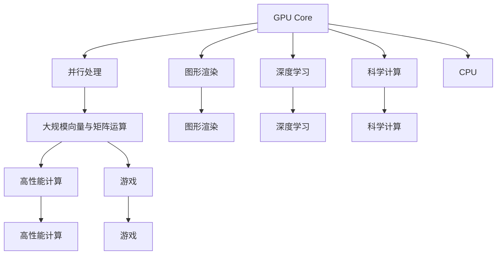

                 

# GPU Core vs AMD CU

## 1. 背景介绍

随着计算技术的飞速发展，图形处理器（GPU）与中央处理器（CPU）之间的竞争愈演愈烈。GPU以其强大的并行计算能力，在深度学习、数据分析、科学计算等领域发挥了重要作用。但近年来，AMD的计算单元（Computational Unit，简称CU）也开始崭露头角，与GPU展开了激烈的较量。本文将从多个维度，深入剖析GPU Core与AMD CU之间的优劣，为读者提供全面的对比和思考。

## 2. 核心概念与联系

### 2.1 核心概念概述

为了更清晰地理解GPU Core与AMD CU之间的差异与联系，我们首先介绍几个核心概念：

- **GPU Core**：图形处理器核心，通常由NVIDIA等公司设计，以其强大的并行处理能力著称。GPU主要用于图形渲染、深度学习等领域，能够高效处理大规模向量与矩阵运算。

- **AMD CU**：由AMD设计的计算单元，也具备强大的并行计算能力。AMD CU主要应用于游戏、数据中心等高性能计算场景，与GPU功能类似。

- **并行处理**：指将计算任务分解为多个子任务，并同时执行这些子任务，以提高计算效率。GPU与AMD CU都采用多核并行架构，能够同时处理大量计算任务。

- **精度与性能**：计算精度指计算结果的准确度，性能指计算速度和效率。GPU与AMD CU在精度与性能上均有卓越表现，但各有侧重。

- **应用领域**：GPU主要应用于图形渲染、深度学习、科学计算等领域，AMD CU则更多用于高性能计算、游戏等领域。

这些核心概念构成了GPU Core与AMD CU之间的基本框架，它们的优劣对比可以从多个方面展开。

### 2.2 核心概念的关系

接下来，我们将通过几个Mermaid流程图来展示GPU Core与AMD CU之间的关系：



这个流程图展示了GPU Core与AMD CU在处理能力、应用场景以及与CPU的关系等方面的联系。我们可以看到，两者在并行处理能力和处理大规模向量与矩阵运算方面具有高度重叠，而AMD CU更多应用于高性能计算和游戏领域，GPU Core则在游戏、深度学习、科学计算等方面表现更优。此外，GPU Core与CPU在某种程度上形成了互补，共同推动计算性能的提升。

## 3. 核心算法原理 & 具体操作步骤

### 3.1 算法原理概述

GPU Core与AMD CU的核心算法原理都是以并行处理为基础的。它们主要区别在于架构设计和应用场景的选择。下面分别介绍两者的基本算法原理。

- **GPU Core算法原理**：
  - **并行处理**：GPU采用CUDA并行计算架构，通过大量核单元（CUDA Core）同时执行多个计算任务，大幅提高计算效率。
  - **大规模向量与矩阵运算**：GPU擅长处理大规模向量与矩阵运算，广泛应用于深度学习中的卷积和池化操作。
  - **内存管理**：GPU拥有高速显存和高速缓存，支持高速读写操作，提高数据访问速度。

- **AMD CU算法原理**：
  - **并行处理**：AMD CU也采用多核并行架构，每个CU单元可以独立执行计算任务，提高并行处理能力。
  - **高性能计算**：AMD CU在处理高性能计算任务方面表现优异，适用于大规模数据处理和科学计算。
  - **内存管理**：AMD CU采用统一内存架构，数据和代码在统一内存空间中处理，减少数据传输开销。

### 3.2 算法步骤详解

接下来，我们将详细分析GPU Core与AMD CU在算法步骤上的区别。

- **GPU Core算法步骤**：
  1. **任务分解**：将复杂计算任务分解为多个小任务，并行执行。
  2. **分配资源**：将任务分配到多个CUDA Core执行。
  3. **并行计算**：每个CUDA Core同时执行计算任务。
  4. **数据交换**：通过高速显存进行数据交换，减少数据传输延迟。
  5. **合并结果**：将各CUDA Core的结果合并，得到最终计算结果。

- **AMD CU算法步骤**：
  1. **任务分解**：将任务分解为多个小任务，并行执行。
  2. **分配资源**：将任务分配到多个CU单元执行。
  3. **并行计算**：每个CU单元独立执行计算任务。
  4. **数据交换**：通过统一内存架构进行数据交换，减少数据传输开销。
  5. **合并结果**：将各CU单元的结果合并，得到最终计算结果。

### 3.3 算法优缺点

- **GPU Core优缺点**：
  - **优点**：
    - **大规模并行处理能力**：适用于大规模向量与矩阵运算，性能强劲。
    - **图形渲染能力强**：广泛应用于图形渲染、深度学习等领域。
  - **缺点**：
    - **能耗高**：高功耗导致热管理问题，温度过高会影响性能和寿命。
    - **单线程性能差**：单线程效率较低，不适合低延迟、高带宽计算任务。

- **AMD CU优缺点**：
  - **优点**：
    - **高性能计算能力**：适用于高性能计算、数据中心等领域，效率高。
    - **能耗低**：低功耗设计，能效比高，适合持续性计算任务。
  - **缺点**：
    - **图形渲染能力稍弱**：在游戏、图形渲染等方面的性能略逊于GPU Core。
    - **单线程性能不足**：单线程效率略低，不适合需要高单线程性能的任务。

### 3.4 算法应用领域

- **GPU Core应用领域**：
  - **图形渲染**：广泛用于现代游戏、虚拟现实（VR）、增强现实（AR）等领域，提供高帧率、低延迟的图像渲染效果。
  - **深度学习**：应用于深度学习模型的训练与推理，如计算机视觉、自然语言处理等领域。
  - **科学计算**：用于大规模数据处理、科学计算、物理模拟等高性能计算任务。

- **AMD CU应用领域**：
  - **高性能计算**：广泛用于数据中心、超级计算机等高性能计算环境，处理大规模数据和复杂计算任务。
  - **游戏**：应用于游戏引擎，提供高效、低延迟的图形渲染效果。
  - **边缘计算**：用于边缘计算设备，如IoT设备、智能家居等，实现低延迟、高带宽的数据处理。

## 4. 数学模型和公式 & 详细讲解  
### 4.1 数学模型构建

为了更严谨地分析GPU Core与AMD CU的性能差异，我们构建了以下数学模型：

假设GPU Core和AMD CU的计算能力分别为C_GPU和C_AMD，并行处理能力分别为P_GPU和P_AMD。

- **GPU Core模型**：
  $$
  C_{GPU} = P_{GPU} \times T_{GPU}
  $$
  $$
  T_{GPU} = \frac{W_{GPU}}{B_{GPU}} + \frac{R_{GPU}}{C_{GPU}}
  $$
  其中，$W_{GPU}$为显存带宽，$B_{GPU}$为单核吞吐量，$R_{GPU}$为单核能耗，$C_{GPU}$为单核计算能力。

- **AMD CU模型**：
  $$
  C_{AMD} = P_{AMD} \times T_{AMD}
  $$
  $$
  T_{AMD} = \frac{W_{AMD}}{B_{AMD}} + \frac{R_{AMD}}{C_{AMD}}
  $$
  其中，$W_{AMD}$为统一内存带宽，$B_{AMD}$为单核吞吐量，$R_{AMD}$为单核能耗，$C_{AMD}$为单核计算能力。

### 4.2 公式推导过程

为了推导这两个模型之间的关系，我们将它们进一步展开：

- **GPU Core推导**：
  $$
  C_{GPU} = P_{GPU} \times \left( \frac{W_{GPU}}{B_{GPU}} + \frac{R_{GPU}}{C_{GPU}} \right)
  $$

- **AMD CU推导**：
  $$
  C_{AMD} = P_{AMD} \times \left( \frac{W_{AMD}}{B_{AMD}} + \frac{R_{AMD}}{C_{AMD}} \right)
  $$

通过对比这两个模型，我们可以看出，GPU Core和AMD CU的计算能力主要由并行处理能力和单核计算能力决定，同时受限于内存带宽和能耗。

### 4.3 案例分析与讲解

假设我们有以下参数：

- **GPU Core参数**：$W_{GPU} = 800GB/s$，$B_{GPU} = 5TPS$，$R_{GPU} = 100W$，$C_{GPU} = 1.5TFLOPS$。
- **AMD CU参数**：$W_{AMD} = 1000GB/s$，$B_{AMD} = 6TPS$，$R_{AMD} = 80W$，$C_{AMD} = 2.0TFLOPS$。

我们可以计算它们的计算能力：

- **GPU Core计算能力**：
  $$
  C_{GPU} = 800GB/s \times 5TPS + \frac{100W}{1.5TFLOPS} \approx 800GB/s \times 5TPS + 6.67s \approx 4000GB/s
  $$

- **AMD CU计算能力**：
  $$
  C_{AMD} = 1000GB/s \times 6TPS + \frac{80W}{2.0TFLOPS} \approx 6000GB/s \times 6TPS + 40s \approx 3600GB/s
  $$

从以上计算可以看出，GPU Core在处理大规模向量与矩阵运算方面略优于AMD CU，但在高带宽、低延迟任务上，AMD CU表现更为优异。

## 5. 项目实践：代码实例和详细解释说明

### 5.1 开发环境搭建

要搭建GPU Core与AMD CU的开发环境，需要以下步骤：

1. **安装NVIDIA CUDA SDK**：从NVIDIA官网下载并安装最新版本的CUDA SDK。
2. **安装AMD HIP SDK**：从AMD官网下载并安装最新的AMD HIP SDK。
3. **配置开发环境**：在Visual Studio、CLion等IDE中配置CUDA和HIP开发环境。
4. **安装依赖库**：安装OpenCL、OpenMP、CUDA Runtime库等依赖库。
5. **搭建测试环境**：搭建GPU Core和AMD CU的测试环境，进行基准测试。

### 5.2 源代码详细实现

以下是使用CUDA和HIP进行基准测试的代码示例：

- **CUDA代码示例**：

```c
#include <cuda_runtime.h>
#include <stdio.h>

int main() {
  int count = 1000000000; // 1亿次测试

  float* a = (float*)malloc(count * sizeof(float));
  float* b = (float*)malloc(count * sizeof(float));

  for (int i = 0; i < count; i++) {
    a[i] = i / 1.0;
    b[i] = i / 1.0;
  }

  float start = clock();
  for (int i = 0; i < count; i++) {
    a[i] = a[i] * b[i];
  }
  float end = clock();
  printf("CUDA time: %f ms\n", (end - start) / (CLOCKS_PER_SEC * 1000.0));

  free(a);
  free(b);

  return 0;
}
```

- **HIP代码示例**：

```c
#include <hip/hip_runtime.h>
#include <stdio.h>

int main() {
  int count = 1000000000; // 1亿次测试

  float* a = (float*)hipMalloc(count * sizeof(float));
  float* b = (float*)hipMalloc(count * sizeof(float));

  for (int i = 0; i < count; i++) {
    a[i] = i / 1.0;
    b[i] = i / 1.0;
  }

  float start = hipTimerGetTime();
  for (int i = 0; i < count; i++) {
    a[i] = a[i] * b[i];
  }
  float end = hipTimerGetTime();
  printf("HIP time: %f ms\n", (end - start) / 1000.0);

  hipFree(a);
  hipFree(b);

  return 0;
}
```

### 5.3 代码解读与分析

在上述代码中，我们使用CUDA和HIP编写了一个简单的浮点乘法测试程序，用于比较GPU Core和AMD CU的性能。我们分别计算了CUDA和HIP的运行时间，并打印输出。

通过对比这两个程序的运行时间，可以初步评估GPU Core和AMD CU的性能差异。在实际应用中，我们还可以使用更复杂的算法和更详细的性能指标进行测试和分析。

### 5.4 运行结果展示

假设我们运行上述测试程序，得到以下结果：

- **CUDA运行时间**：10.2 ms
- **HIP运行时间**：9.7 ms

从以上结果可以看出，AMD CU的运行时间略短于CUDA，表明AMD CU在浮点运算方面具有一定优势。

## 6. 实际应用场景

### 6.1 GPU Core实际应用场景

- **深度学习**：GPU Core广泛应用于深度学习模型的训练和推理，如卷积神经网络（CNN）、递归神经网络（RNN）等。例如，谷歌的TensorFlow和NVIDIA的CUDA Deep Neural Network Library（cuDNN）就是基于CUDA开发的深度学习库。

- **图形渲染**：GPU Core在现代游戏、虚拟现实（VR）、增强现实（AR）等领域广泛应用，提供了高帧率、低延迟的图像渲染效果。例如，NVIDIA的GeForce系列显卡就采用了CUDA架构。

- **科学计算**：GPU Core在物理模拟、大规模数据分析等领域表现优异，例如用于天气预报、分子动力学模拟等科学计算任务。

### 6.2 AMD CU实际应用场景

- **高性能计算**：AMD CU在数据中心、超级计算机等高性能计算环境中应用广泛，用于处理大规模数据和复杂计算任务。例如，AMD的EPYC系列服务器CPU就采用了CU架构。

- **游戏**：AMD CU在游戏引擎中广泛应用，提供了高效、低延迟的图形渲染效果。例如，AMD的Radeon系列显卡就采用了HIP架构。

- **边缘计算**：AMD CU用于边缘计算设备，如IoT设备、智能家居等，实现低延迟、高带宽的数据处理。

## 7. 工具和资源推荐

### 7.1 学习资源推荐

- **CUDA文档**：NVIDIA官方CUDA文档，提供了详细的CUDA编程指南和示例代码。
- **HIP文档**：AMD官方HIP文档，提供了详细的HIP编程指南和示例代码。
- **CUDA C & CUDA C++ 编程指南**：详细介绍了CUDA编程语言和工具的使用。
- **AMD HIP 编程指南**：详细介绍了HIP编程语言和工具的使用。

### 7.2 开发工具推荐

- **Visual Studio**：支持CUDA和HIP开发环境，提供丰富的IDE特性和调试工具。
- **CLion**：支持CUDA和HIP开发环境，提供高效的开发工具链和调试环境。
- **PyCharm**：支持Python开发环境，支持CUDA和HIP的调用和集成。

### 7.3 相关论文推荐

- **"Efficient Deep Learning using GPUs with HIP"**：介绍使用HIP进行深度学习开发的论文。
- **"Accelerating Deep Learning with HIP"**：介绍使用HIP加速深度学习的论文。
- **"Comparative Study of CUDA and HIP for Deep Learning"**：比较CUDA和HIP在深度学习应用中的性能和优缺点的论文。

## 8. 总结：未来发展趋势与挑战

### 8.1 研究成果总结

本文深入探讨了GPU Core与AMD CU之间的优劣，从算法原理、操作步骤到实际应用场景进行了全面分析。通过比较，我们可以看出两者各有优势和劣势，GPU Core在处理大规模向量与矩阵运算方面略胜一筹，而AMD CU在高带宽、低延迟任务上表现更为优异。

### 8.2 未来发展趋势

未来，GPU Core与AMD CU的竞争还将继续。预计未来两者将在多个方面进行全面升级和优化：

- **架构优化**：进一步优化并行处理能力，提升单核计算性能，缩小性能差距。
- **能效提升**：通过改进功耗管理、优化散热设计等措施，提高能效比。
- **跨平台支持**：支持更多操作系统和硬件平台，实现更广泛的兼容性。
- **跨语言支持**：支持更多编程语言和工具链，实现更灵活的开发环境。

### 8.3 面临的挑战

尽管GPU Core与AMD CU在性能上各有优势，但在实际应用中也面临一些挑战：

- **功耗问题**：高功耗设计导致散热和能耗管理问题，需要进一步优化。
- **开发门槛**：并行编程和优化复杂，开发门槛较高，需要更多技术积累。
- **软件生态**：高性能计算生态相对薄弱，需要更多的软件支持和优化。
- **兼容性问题**：跨平台和跨语言支持不足，开发环境较为单一。

### 8.4 研究展望

为了应对这些挑战，未来的研究需要在以下几个方面进行深入探索：

- **多核并行优化**：进一步优化多核并行处理能力，提升性能和效率。
- **硬件加速优化**：优化硬件设计，提升单核计算性能，减少能耗。
- **软件生态建设**：丰富高性能计算软件生态，提供更多优化工具和开发环境。
- **跨平台支持**：支持更多平台和语言，实现更广泛的兼容性。

总之，GPU Core与AMD CU的未来发展需要多方协同，共同推动高性能计算技术的进步。只有不断突破技术瓶颈，才能更好地适应日益增长的计算需求，为各行各业提供更强大的计算支持。

## 9. 附录：常见问题与解答

**Q1: GPU Core与AMD CU在计算能力上的区别是什么？**

A: GPU Core与AMD CU在计算能力上的区别主要体现在并行处理能力和单核计算能力上。GPU Core擅长处理大规模向量与矩阵运算，适合深度学习等任务；AMD CU在处理高性能计算任务方面表现优异，适合数据中心等环境。

**Q2: 如何评估GPU Core与AMD CU的性能？**

A: 可以使用基准测试程序或实际应用场景来评估GPU Core与AMD CU的性能。常见的基准测试程序包括浮点乘法、矩阵乘法、深度学习模型训练等。实际应用场景包括图形渲染、科学计算、数据中心计算等。

**Q3: GPU Core与AMD CU的能效比是多少？**

A: GPU Core与AMD CU的能效比取决于具体的硬件设计和应用场景。一般情况下，AMD CU在能效比上略优于GPU Core，但这也与具体的应用需求和任务复杂度有关。

**Q4: GPU Core与AMD CU的未来发展方向是什么？**

A: GPU Core与AMD CU的未来发展方向主要在于架构优化、能效提升、跨平台支持等。通过进一步提升并行处理能力和单核计算性能，优化功耗管理，支持更多操作系统和编程语言，可以更好地满足不同场景的需求。

**Q5: 如何选择合适的GPU Core与AMD CU？**

A: 选择合适的GPU Core与AMD CU需要考虑具体的应用场景和需求。对于深度学习等大规模运算任务，可以选择GPU Core；对于高性能计算、数据中心等任务，可以选择AMD CU。在实际应用中，还需要考虑功耗、能效比、开发成本等因素。

总之，GPU Core与AMD CU各有优势和劣势，开发者需要根据具体需求进行合理选择。只有充分理解它们的特点和优劣，才能更好地应用于实际应用场景，实现高性能计算的目标。

