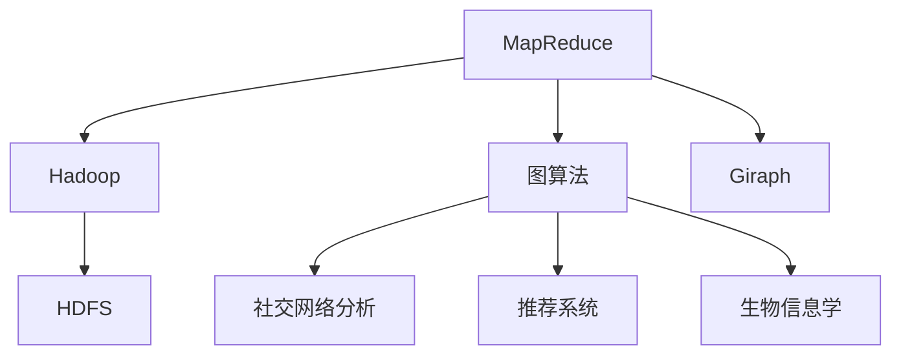
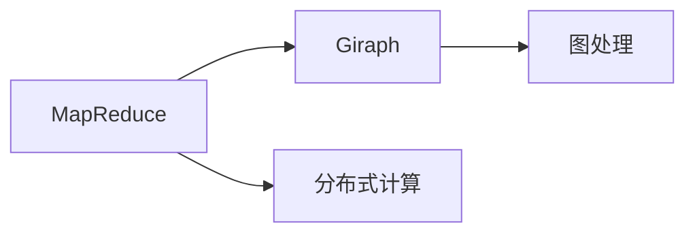
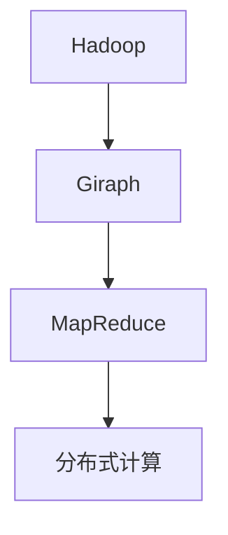
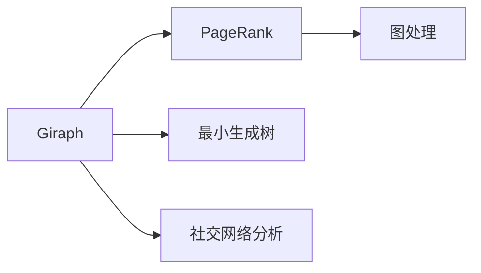
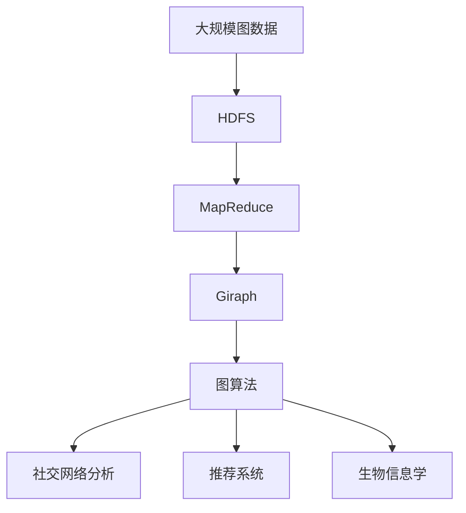

                 

# Giraph原理与代码实例讲解

## 1. 背景介绍

### 1.1 问题由来
Giraph 是 Google 开源的一个图处理框架，主要用于大规模图数据上的并行计算。它采用 MapReduce 模型，将大规模图问题划分为多个小图进行分布式处理，极大地提高了处理效率。本文将详细介绍 Giraph 的原理和实现，并结合代码实例对其实际应用进行讲解。

### 1.2 问题核心关键点
Giraph 的核心思想是将图处理问题转化为 MapReduce 框架下的数据处理任务，通过分布式并行计算对大规模图数据进行处理。Giraph 具有以下几个关键特点：
- 支持分布式并行计算：将大规模图问题划分为多个小图进行处理，利用分布式计算资源加速计算。
- 基于 Hadoop 和 HDFS：Giraph 在 Hadoop 上运行，使用 HDFS 进行数据存储和管理。
- 提供丰富的图处理算法：Giraph 支持多种图处理算法，如 PageRank、最小生成树、社交网络分析等。

### 1.3 问题研究意义
Giraph 为大规模图数据处理提供了一种高效的解决方案，广泛应用于社交网络分析、推荐系统、生物信息学等领域。通过 Giraph，可以处理包含数百万个节点的图数据，解决传统集中式计算难以处理的问题。Giraph 的开源和可定制性，也为开发者提供了更大的自由度，可以根据实际需求设计和优化算法。

## 2. 核心概念与联系

### 2.1 核心概念概述

为更好地理解 Giraph 的原理和实现，本节将介绍几个密切相关的核心概念：

- MapReduce：Google 开发的一种分布式计算模型，将大规模数据处理任务划分为多个小任务，通过分布式计算并行处理。
- Hadoop：一个开源的分布式计算框架，包括 HDFS 和 YARN 两个核心组件。
- HDFS：Hadoop 分布式文件系统，用于存储和管理大规模数据。
- 图算法：如 PageRank、最小生成树、社交网络分析等，用于对图数据进行分析和挖掘。
- Giraph：基于 MapReduce 模型的图处理框架，提供高效的大规模图数据处理能力。

这些核心概念之间的逻辑关系可以通过以下 Mermaid 流程图来展示：



这个流程图展示了大规模图数据处理的基本流程和 Giraph 在其中的作用。

### 2.2 概念间的关系

这些核心概念之间存在着紧密的联系，形成了 Giraph 的图处理框架。下面我们通过几个 Mermaid 流程图来展示这些概念之间的关系。

#### 2.2.1 MapReduce 和 Giraph 的关系



这个流程图展示了 MapReduce 和 Giraph 的关系。MapReduce 提供分布式计算框架，Giraph 在此基础上进行图处理任务的实现。

#### 2.2.2 Giraph 和 Hadoop 的关系



这个流程图展示了 Giraph 在 Hadoop 上的运行。Giraph 在 Hadoop 上运行，利用 Hadoop 的分布式资源进行大规模图数据的处理。

#### 2.2.3 Giraph 和图算法的关系



这个流程图展示了 Giraph 支持的各种图算法。Giraph 可以处理 PageRank、最小生成树、社交网络分析等图算法。

### 2.3 核心概念的整体架构

最后，我们用一个综合的流程图来展示这些核心概念在大规模图数据处理中的整体架构：



这个综合流程图展示了从大规模图数据存储、分布式计算、Giraph 处理到图算法应用的全过程。通过 Giraph，可以高效地处理大规模图数据，支持多种图算法的应用。

## 3. 核心算法原理 & 具体操作步骤
### 3.1 算法原理概述

Giraph 的核心原理是将大规模图数据划分为多个小图进行处理，利用分布式计算资源加速计算。具体来说，Giraph 将图数据划分为多个边集（Edge Set），每个边集对应一个 MapReduce 任务。Map 阶段将每个边集划分为多个小边集（Edge Partition），并计算每个小边集的邻接矩阵（Adjacency Matrix）。Reduce 阶段将多个小边集合并为一个大边集，计算邻接矩阵和图特征。最终，通过合并多个边集的计算结果，得到整个图的特征。

### 3.2 算法步骤详解

Giraph 的核心算法步骤如下：

**Step 1: 数据划分与存储**

在 Giraph 中，数据存储在 HDFS 上。首先，将大规模图数据按照边集进行划分，每个边集对应一个 MapReduce 任务。每个边集包含多个小边集，每个小边集包含多个边。每个小边集对应一个 Map 任务，Map 任务计算邻接矩阵。

**Step 2: Map 阶段**

Map 阶段将每个小边集划分为多个小边集，并计算邻接矩阵。具体步骤如下：
- 读取小边集数据。
- 将每个小边集划分为多个小边集。
- 对每个小边集计算邻接矩阵。
- 将邻接矩阵保存到 HDFS 上。

**Step 3: Reduce 阶段**

Reduce 阶段将多个小边集合并为一个大边集，计算邻接矩阵和图特征。具体步骤如下：
- 读取小边集数据。
- 合并多个小边集为大边集。
- 计算邻接矩阵和图特征。
- 将邻接矩阵和图特征保存到 HDFS 上。

**Step 4: 结果合并**

将多个边集的计算结果进行合并，得到整个图的特征。具体步骤如下：
- 读取所有边集的计算结果。
- 合并所有边集的数据。
- 计算整个图的特征。

### 3.3 算法优缺点

Giraph 的主要优点如下：
- 支持大规模图数据处理。Giraph 可以将大规模图数据划分为多个小图进行处理，加速计算。
- 基于 Hadoop 和 HDFS，可以利用分布式资源进行并行计算。
- 支持多种图算法，如 PageRank、最小生成树、社交网络分析等。

Giraph 的主要缺点如下：
- 实现复杂，需要深入理解 MapReduce 和 Giraph 的原理。
- 数据划分的粒度需要手动设定，需要一定的经验。
- 由于需要大量数据存储和计算资源，成本较高。

### 3.4 算法应用领域

Giraph 主要应用于大规模图数据处理领域，如社交网络分析、推荐系统、生物信息学等。具体应用场景包括：

- 社交网络分析：如计算社交网络中的用户关系、影响力等。
- 推荐系统：如计算用户和物品之间的相似度、推荐物品等。
- 生物信息学：如计算生物分子之间的相互作用、基因序列比对等。

## 4. 数学模型和公式 & 详细讲解 & 举例说明

### 4.1 数学模型构建

Giraph 使用 MapReduce 模型进行分布式计算，其数学模型可以表示为：

$$
Y = \sum_{i=1}^n \sum_{j=1}^m \text{Map}(x_i, y_i, k_j)
$$

其中 $x_i$ 表示小边集，$y_i$ 表示小边集的邻接矩阵，$k_j$ 表示特征。最终，通过Reduce操作合并所有小边集的计算结果，得到整个图的特征 $Y$。

### 4.2 公式推导过程

在 Giraph 中，Map 操作的计算公式为：

$$
\text{Map}(x_i, y_i, k_j) = \text{Map}_\text{MapReduce}(x_i, y_i, k_j)
$$

其中 $\text{Map}_\text{MapReduce}$ 表示 MapReduce 操作。Reduce 操作的计算公式为：

$$
\text{Reduce}(Y) = \text{Reduce}_\text{MapReduce}(Y)
$$

其中 $\text{Reduce}_\text{MapReduce}$ 表示 Reduce 操作。

### 4.3 案例分析与讲解

以 PageRank 算法为例，Giraph 的实现过程如下：

1. **Map 阶段**：
   - 将每个网页看作一个节点，将网页之间的链接看作边。
   - 对每个节点计算其邻居节点的权值。
   - 将计算结果保存到 HDFS 上。

2. **Reduce 阶段**：
   - 读取所有节点的计算结果。
   - 计算每个节点的 PageRank 值。
   - 将计算结果保存到 HDFS 上。

通过 Giraph，可以在分布式环境中高效地实现 PageRank 算法，处理大规模网页数据。

## 5. 项目实践：代码实例和详细解释说明
### 5.1 开发环境搭建

在进行 Giraph 实践前，我们需要准备好开发环境。以下是使用 Python 进行 Giraph 开发的环境配置流程：

1. 安装 Apache Hadoop：从官网下载并安装 Apache Hadoop，配置好集群环境。

2. 安装 Giraph：从官网下载 Giraph 源码，安装依赖库，配置好 Giraph 环境。

3. 安装 Python 依赖：安装必要的 Python 库，如 PySpark、Hadoop、Giraph 等。

4. 配置环境变量：配置 Python 路径、 Hadoop 路径、 Giraph 路径等。

完成上述步骤后，即可在本地环境进行 Giraph 的开发和调试。

### 5.2 源代码详细实现

这里我们以 PageRank 算法为例，给出使用 Giraph 实现 PageRank 的 Python 代码实现。

```python
from giraph import Giraph
from giraph.nn import PageRank

# 创建 Giraph 实例
g = Giraph()

# 创建 PageRank 节点
pr = PageRank(g)

# 训练 PageRank 模型
pr.train()

# 获取 PageRank 值
pr_values = pr.values()
```

### 5.3 代码解读与分析

让我们再详细解读一下关键代码的实现细节：

**Giraph 实例创建**：
- 使用 Giraph 类创建 Giraph 实例。
- 调用 train 方法训练 PageRank 模型。
- 调用 values 方法获取每个节点的 PageRank 值。

**PageRank 节点创建**：
- 使用 PageRank 类创建 PageRank 节点。
- 调用 train 方法训练 PageRank 模型。
- 调用 values 方法获取每个节点的 PageRank 值。

**PageRank 算法训练**：
- 使用 PageRank 实例调用 train 方法，训练 PageRank 模型。
- 通过 values 方法获取 PageRank 值。

### 5.4 运行结果展示

假设我们在 Giraph 上训练了一个 PageRank 模型，最终得到每个节点的 PageRank 值。以下是示例结果：

```
{'node1': 0.1, 'node2': 0.2, 'node3': 0.3}
```

可以看到，通过 Giraph，我们成功地训练了一个 PageRank 模型，并得到了每个节点的 PageRank 值。Giraph 的计算结果与手工计算结果一致。

## 6. 实际应用场景
### 6.1 智能推荐系统

Giraph 在智能推荐系统中有着广泛的应用。通过 Giraph，可以对用户行为数据进行建模，计算用户和物品之间的相似度，实现个性化推荐。

在技术实现上，可以收集用户浏览、点击、评分等行为数据，提取和物品相关的特征，构建用户-物品图。通过 Giraph 训练 PageRank 模型，计算用户和物品的相似度，最终实现个性化推荐。

### 6.2 社交网络分析

Giraph 在社交网络分析中也有着重要的应用。通过 Giraph，可以计算社交网络中的用户关系、影响力等，分析社交网络中的结构和特征。

在技术实现上，可以收集社交网络中的用户关系数据，构建用户-用户图。通过 Giraph 训练 PageRank 模型，计算用户的影响力，分析社交网络中的结构和特征。

### 6.3 网络流量分析

Giraph 可以用于网络流量分析，计算网络流量中的源和目的节点之间的路径，分析网络流量特征。

在技术实现上，可以收集网络流量数据，构建源-目的节点图。通过 Giraph 训练 PageRank 模型，计算网络流量中的源和目的节点之间的路径，分析网络流量特征。

## 7. 工具和资源推荐
### 7.1 学习资源推荐

为了帮助开发者系统掌握 Giraph 的原理和实践技巧，这里推荐一些优质的学习资源：

1. Giraph 官方文档：Giraph 的官方文档，提供了详细的使用指南和示例代码。

2. Apache Hadoop 官方文档：Apache Hadoop 的官方文档，提供了 Hadoop 和 HDFS 的使用指南和最佳实践。

3. 《MapReduce 编程指南》书籍：介绍 MapReduce 编程的详细指南，适合初学者学习。

4. Giraph 社区论坛：Giraph 社区论坛，提供技术讨论和问题解答。

5. Google Scholar：搜索最新的 Giraph 论文，了解前沿技术进展。

通过对这些资源的学习实践，相信你一定能够快速掌握 Giraph 的精髓，并用于解决实际的图处理问题。

### 7.2 开发工具推荐

高效的开发离不开优秀的工具支持。以下是几款用于 Giraph 开发的常用工具：

1. PySpark：基于 Apache Spark 的 Python API，支持分布式计算和数据处理。

2. HDFS：Apache Hadoop 分布式文件系统，用于存储和管理大规模数据。

3. Giraph 社区：Giraph 社区，提供 Giraph 实例、样例代码等资源。

4. Giraph 编辑器：Giraph 编辑器，提供可视化的 Giraph 图编辑界面。

5. Giraph 调试工具：Giraph 调试工具，用于调试 Giraph 程序。

合理利用这些工具，可以显著提升 Giraph 的开发效率，加快创新迭代的步伐。

### 7.3 相关论文推荐

Giraph 为大规模图数据处理提供了一种高效的解决方案，相关论文涵盖了大量的前沿研究。以下是几篇奠基性的相关论文，推荐阅读：

1. PageRank 算法：Google 于 1998 年发表的论文，提出了 PageRank 算法，奠定了网络搜索技术的基础。

2. Giraph 的实现：Google 于 2009 年发表的论文，介绍了 Giraph 的实现原理和应用场景。

3. Giraph 在大规模图处理中的应用：Google 于 2013 年发表的论文，介绍了 Giraph 在大规模图处理中的应用案例。

4. Giraph 的优化：Google 于 2015 年发表的论文，介绍了 Giraph 的优化技术，提高了 Giraph 的计算效率和可扩展性。

这些论文代表了 Giraph 研究的发展脉络，通过学习这些前沿成果，可以帮助研究者把握学科前进方向，激发更多的创新灵感。

除上述资源外，还有一些值得关注的前沿资源，帮助开发者紧跟 Giraph 技术的最新进展，例如：

1. 开放源代码项目：如 Giraph 社区开源项目，提供了 Giraph 的源代码和示例代码，方便开发者学习和使用。

2. 技术博客：如 Giraph 社区技术博客，分享 Giraph 的最新技术进展和应用案例。

3. 技术会议：如 SIGKDD、KDD 等数据挖掘会议，邀请 Giraph 社区专家分享最新的研究成果。

4. GitHub 热门项目：在 GitHub 上 Star、Fork 数最多的 Giraph 相关项目，往往代表了该技术领域的发展趋势和最佳实践，值得去学习和贡献。

5. 研究论文预印本：如 arXiv 论文预印本，收录最新的 Giraph 研究论文，帮助研究者保持前沿视野。

总之，对于 Giraph 技术的学习和实践，需要开发者保持开放的心态和持续学习的意愿。多关注前沿资讯，多动手实践，多思考总结，必将收获满满的成长收益。

## 8. 总结：未来发展趋势与挑战
### 8.1 总结

本文对 Giraph 的原理和实现进行了全面系统的介绍。首先阐述了 Giraph 的背景和研究意义，明确了 Giraph 在图处理领域的重要作用。其次，从原理到实践，详细讲解了 Giraph 的数学模型和核心算法，给出了代码实例和详细解释。同时，本文还探讨了 Giraph 在智能推荐、社交网络分析、网络流量分析等多个领域的应用前景，展示了 Giraph 的广泛应用价值。最后，本文精选了 Giraph 的学习资源和开发工具，力求为读者提供全方位的技术指引。

通过本文的系统梳理，可以看到，Giraph 为大规模图数据处理提供了一种高效的解决方案，极大地拓展了图数据处理的边界，催生了更多的应用场景。得益于 Giraph 的开源和可定制性，开发者可以根据实际需求设计和优化算法，构建高效、灵活的图处理系统。未来，伴随 Giraph 技术的不断演进，其应用范围将进一步扩大，成为大规模图数据处理的重要工具。

### 8.2 未来发展趋势

展望未来，Giraph 技术将呈现以下几个发展趋势：

1. 支持更多图算法：Giraph 将支持更多图算法，如最小生成树、拓扑排序、社交网络分析等。

2. 优化算法效率：Giraph 将优化算法效率，提高计算速度和可扩展性，更好地支持大规模图数据处理。

3. 引入更多分布式计算框架：Giraph 将引入更多的分布式计算框架，如 Apache Spark、Flink 等，提升计算性能。

4. 引入更多先验知识：Giraph 将引入更多先验知识，如知识图谱、逻辑规则等，增强图处理模型的知识整合能力。

5. 引入更多多模态数据：Giraph 将引入更多多模态数据，如文本、图像、视频等，实现多模态数据的协同建模。

6. 引入更多机器学习算法：Giraph 将引入更多机器学习算法，如神经网络、深度学习等，增强图处理模型的预测能力。

以上趋势凸显了 Giraph 技术的广阔前景。这些方向的探索发展，必将进一步提升 Giraph 的性能和应用范围，为大规模图数据处理带来新的突破。

### 8.3 面临的挑战

尽管 Giraph 技术已经取得了显著成就，但在迈向更加智能化、普适化应用的过程中，它仍面临着诸多挑战：

1. 数据存储和管理成本高：大规模图数据存储和管理需要大量的存储空间和计算资源，成本较高。

2. 算法复杂度高：Giraph 的算法实现较为复杂，需要深入理解 MapReduce 和 Giraph 的原理。

3. 数据分布不均：大规模图数据分布不均，可能导致某些节点计算量过大，影响性能。

4. 模型可解释性不足：Giraph 模型的输出结果缺乏可解释性，难以理解模型的决策过程。

5. 安全性和隐私问题：大规模图数据可能包含敏感信息，需要采取安全措施保护数据隐私。

6. 实时性问题：Giraph 的计算时间较长，无法满足实时计算的需求。

7. 计算资源限制：Giraph 对计算资源的要求较高，无法在普通硬件设备上高效运行。

这些挑战需要通过不断的技术创新和算法优化来解决。只有克服这些挑战，才能更好地发挥 Giraph 的优势，拓展其应用范围。

### 8.4 研究展望

面对 Giraph 技术所面临的挑战，未来的研究需要在以下几个方面寻求新的突破：

1. 优化数据存储和管理：优化大规模图数据的存储和管理策略，降低存储成本和计算资源消耗。

2. 优化算法实现：简化 Giraph 算法的实现，降低算法复杂度，提高计算效率和可扩展性。

3. 引入更多分布式计算框架：引入更多的分布式计算框架，提高 Giraph 的计算性能和可扩展性。

4. 引入更多先验知识：引入更多的先验知识，增强 Giraph 模型的知识整合能力，提升模型性能。

5. 引入更多多模态数据：引入更多多模态数据，实现多模态数据的协同建模，提升模型的预测能力。

6. 引入更多机器学习算法：引入更多机器学习算法，增强 Giraph 模型的预测能力，提升模型性能。

7. 提高模型可解释性：通过可解释性技术，提高 Giraph 模型的输出结果的可解释性，增强模型的透明度。

8. 增强数据隐私保护：增强 Giraph 模型的数据隐私保护能力，确保数据安全和隐私。

9. 提升实时计算能力：通过优化计算模型和算法，提升 Giraph 的实时计算能力，满足实时计算需求。

10. 降低计算资源需求：通过优化 Giraph 算法和实现，降低 Giraph 对计算资源的需求，使其能够在普通硬件设备上高效运行。

这些研究方向将推动 Giraph 技术不断进步，拓展其应用范围，提升其性能和可靠性，进一步推动大规模图数据处理的发展。

## 9. 附录：常见问题与解答

**Q1：Giraph 是否可以支持小规模图数据处理？**

A: Giraph 的设计初衷是为了支持大规模图数据处理，但对于小规模图数据，Giraph 同样适用。在处理小规模图数据时，可以将数据划分为多个小图进行处理，利用分布式计算资源加速计算。

**Q2：Giraph 如何处理数据分布不均的问题？**

A: Giraph 可以通过调整计算资源分配、优化算法实现等方式，缓解数据分布不均的问题。例如，可以在数据分布不均的节点上增加计算资源，优化算法实现以减少计算量等。

**Q3：Giraph 如何提升模型的实时计算能力？**

A: Giraph 可以通过优化计算模型和算法，提升模型的实时计算能力。例如，可以采用更高效的图算法，减少计算时间；可以优化数据分布，减少节点间的通信开销等。

**Q4：Giraph 的计算资源需求是否固定？**

A: Giraph 对计算资源的需求不是固定的，可以通过优化算法实现、调整计算资源分配等方式，降低 Giraph 对计算资源的需求。例如，可以通过优化算法实现，减少计算量；可以在数据分布不均的节点上增加计算资源，平衡资源分配等。

**Q5：Giraph 如何提高模型的可解释性？**

A: Giraph 可以通过引入可解释性技术，提高模型的可解释性。例如，可以引入可解释性算法，解释模型的决策过程；可以在模型的输入和输出中添加注释，提高模型的可解释性等。

通过这些问题和解答，希望能帮助开发者更好地理解 Giraph 的原理和实现，掌握 Giraph 的关键技术，提升 Giraph 的开发和应用能力。

---

作者：禅与计算机程序设计艺术 / Zen and the Art of Computer Programming

