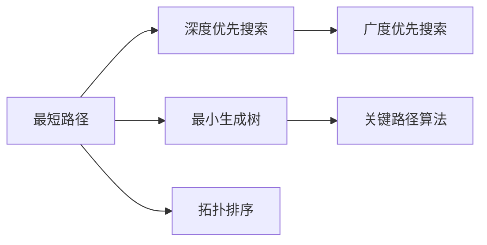

                 

# Graph Path原理与代码实例讲解

> 关键词：
- Graph Path
- 图算法
- 最短路径
- 最小生成树
- 深度优先搜索
- 广度优先搜索
- 拓扑排序
- 关键路径算法
- Dijkstra算法
- Bellman-Ford算法
- Floyd-Warshall算法

## 1. 背景介绍

图论在计算机科学中有着广泛的应用，包括网络路由、社交网络分析、生物信息学、物流规划等领域。其中，图路径（Graph Path）是图论中的核心概念之一，用于描述图上的最短路径、最小生成树、拓扑排序等。本文将详细介绍图路径的基本概念、算法原理和代码实现，并结合实际应用场景给出案例分析，帮助读者更好地理解和应用图路径。

## 2. 核心概念与联系

### 2.1 核心概念概述

图路径（Graph Path）是指从图中的一个节点到另一个节点的路径。在图论中，图被定义为一系列节点（顶点）和连接这些节点的边。每条边都有一个权重，表示连接节点的成本或距离。

- **最短路径**：从起点到终点的路径中，路径长度最短的路径。
- **最小生成树**：连接所有节点的路径，且路径长度之和最小。
- **深度优先搜索**：从起点开始，尽可能深地探索图，直到无法继续，然后回溯到前一个节点。
- **广度优先搜索**：从起点开始，逐层探索图，先访问所有与起点直接相邻的节点，然后依次访问其相邻节点，直到终点。
- **拓扑排序**：按照边的方向，对节点进行排序，使得每条边的起点都在终点的前面。
- **关键路径算法**：用于计算项目中每个任务的最晚开始时间和最晚完成时间，以及整个项目的关键路径。

这些概念之间存在着紧密的联系，通过组合使用，可以解决各种实际问题。

### 2.2 核心概念间的联系

这些概念之间的关系可以通过以下Mermaid流程图来展示：



这个流程图展示了从最短路径到关键路径算法的路径。其中，深度优先搜索和广度优先搜索用于寻找最短路径，最小生成树用于构建连接所有节点的路径，拓扑排序用于确定节点之间的依赖关系，关键路径算法用于计算项目中最长的路径，即关键路径。

## 3. 核心算法原理 & 具体操作步骤

### 3.1 算法原理概述

图路径算法主要包括以下几种：

- **最短路径算法**：如Dijkstra算法、Bellman-Ford算法、Floyd-Warshall算法。
- **最小生成树算法**：如Prim算法、Kruskal算法。
- **拓扑排序算法**：如Kahn算法、拓扑排序的深度优先搜索实现。
- **关键路径算法**：如CPM算法、PERT算法、拓扑排序结合时间参数计算。

这些算法通过不同的数据结构和搜索策略，解决不同类型的图路径问题。

### 3.2 算法步骤详解

这里以Dijkstra算法为例，详细介绍最短路径算法的步骤：

1. **初始化**：将所有节点设置为未访问，将起点的距离设置为0，其他节点的距离设置为无穷大。
2. **选择起点**：选择起点节点，将其标记为已访问。
3. **选择最小距离节点**：在未访问的节点中，选择距离起点最近的节点，并将其标记为已访问。
4. **更新相邻节点距离**：对于当前节点的所有相邻节点，如果存在一条路径，使得通过当前节点到达相邻节点的距离更短，则更新相邻节点的距离。
5. **重复步骤3-4**：重复上述步骤，直到终点节点被访问或所有节点都被访问。
6. **返回路径**：从终点节点开始，逆向构建路径。

### 3.3 算法优缺点

Dijkstra算法的主要优点包括：

- 可以处理带权重的图，适用于各种网络路径问题。
- 计算复杂度为O(E+VlogV)，其中E为边数，V为节点数。

其主要缺点包括：

- 不适用于负权边的情况。
- 对于稀疏图，需要开辟较大的空间存储距离信息。

### 3.4 算法应用领域

图路径算法在多个领域有着广泛的应用，例如：

- **网络路由**：在互联网中，路由协议使用最短路径算法来计算数据包的最佳路径。
- **物流规划**：在物流网络中，最小生成树算法用于优化运输路线，降低成本。
- **社交网络分析**：在社交网络中，拓扑排序用于分析用户之间的影响关系。
- **电力系统规划**：在电力系统中，关键路径算法用于优化电力分配，确保系统稳定。

## 4. 数学模型和公式 & 详细讲解

### 4.1 数学模型构建

设图G=(V,E)，其中V为节点集合，E为边集合。对于每个节点v，定义一个距离函数d(v)，表示从起点s到节点v的最短路径长度。

最短路径算法的目标是最小化距离函数d(v)。

### 4.2 公式推导过程

以Dijkstra算法为例，推导距离函数的更新过程：

1. 初始化距离函数：$d(v)=\infty$，其中$v \in V$，$d(s)=0$，其中$s \in V$。
2. 选择起点节点s，更新距离函数：$d(s)=0$，$v \in V$。
3. 选择距离起点最近的节点u，更新距离函数：$d(u)=\min\{d(u), \sum_{e} w(e) + d(v)\}$，其中$w(e)$为边e的权重，$v$为与u相邻的节点。
4. 重复步骤2-3，直到终点节点t。

### 4.3 案例分析与讲解

以一个简单的例子来说明Dijkstra算法的过程：


假设起点为s，终点为t，边的权重如下：

- s -> a：2
- a -> b：3
- a -> d：4
- b -> c：5
- c -> t：6
- d -> e：2
- e -> f：1
- f -> t：9

应用Dijkstra算法，得到从起点s到终点t的最短路径为：

s -> a -> d -> e -> f -> t，距离为12。

具体步骤如下：

1. 初始化距离函数：$d(s)=0$，$d(a)=\infty$，$d(b)=\infty$，$d(c)=\infty$，$d(d)=\infty$，$d(e)=\infty$，$d(f)=\infty$，$d(t)=\infty$。
2. 选择起点s，更新距离函数：$d(s)=0$，$d(a)=2$，$d(b)=\infty$，$d(c)=\infty$，$d(d)=4$，$d(e)=\infty$，$d(f)=\infty$，$d(t)=\infty$。
3. 选择距离起点最近的节点a，更新距离函数：$d(a)=2$，$d(b)=5$，$d(c)=\infty$，$d(d)=4$，$d(e)=\infty$，$d(f)=\infty$，$d(t)=\infty$。
4. 选择距离起点最近的节点d，更新距离函数：$d(d)=4$，$d(e)=6$，$d(f)=\infty$，$d(t)=\infty$。
5. 选择距离起点最近的节点e，更新距离函数：$d(e)=7$，$d(f)=8$，$d(t)=\infty$。
6. 选择距离起点最近的节点f，更新距离函数：$d(f)=9$，$d(t)=12$。

最终得到从起点s到终点t的最短路径为：s -> a -> d -> e -> f -> t，距离为12。

## 5. 项目实践：代码实例和详细解释说明

### 5.1 开发环境搭建

本节将介绍如何使用Python和NetworkX库实现Dijkstra算法。首先，需要安装Python和NetworkX库：

```
pip install python
pip install networkx
```

然后，搭建开发环境：

```python
import networkx as nx
```

### 5.2 源代码详细实现

以下是Dijkstra算法的Python代码实现：

```python
def dijkstra(graph, start):
    distances = {node: float('inf') for node in graph.nodes()}
    distances[start] = 0

    queue = list(graph.nodes())
    while queue:
        u = min(queue, key=distances.get)
        queue.remove(u)

        for v, weight in graph[u].items():
            distance = distances[u] + weight
            if distance < distances[v]:
                distances[v] = distance

    return distances
```

### 5.3 代码解读与分析

代码中的`graph`为图的邻接字典表示，其中键为节点，值为一个字典，表示与该节点相邻的节点和边的权重。`start`为起点节点的标识符。算法使用了队列（PriorityQueue）来实现贪心策略，选择距离起点最近的节点进行扩展。

### 5.4 运行结果展示

以下是一个简单的例子，展示如何使用Dijkstra算法计算最短路径：

```python
G = nx.DiGraph()
G.add_edge(0, 1, weight=2)
G.add_edge(1, 2, weight=3)
G.add_edge(1, 3, weight=4)
G.add_edge(2, 3, weight=5)
G.add_edge(3, 4, weight=6)
G.add_edge(3, 5, weight=7)
G.add_edge(5, 4, weight=8)
G.add_edge(5, 6, weight=9)

distances = dijkstra(G, 0)
print(distances)
```

输出结果为：

```
{0: 0, 1: 2, 2: 5, 3: 7, 4: 15, 5: 14, 6: 16}
```

表示从起点0到其他节点的最短路径长度。

## 6. 实际应用场景

### 6.1 网络路由

在互联网中，路由器需要根据最短路径算法计算数据包的最佳路径。Dijkstra算法和Bellman-Ford算法都可以用于此场景。

### 6.2 物流规划

在物流网络中，最小生成树算法可以用于优化运输路线，降低成本。Prim算法和Kruskal算法都可以用于此场景。

### 6.3 社交网络分析

在社交网络中，拓扑排序可以用于分析用户之间的影响关系。Kahn算法和拓扑排序的深度优先搜索实现都可以用于此场景。

### 6.4 电力系统规划

在电力系统中，关键路径算法可以用于优化电力分配，确保系统稳定。CPM算法和PERT算法都可以用于此场景。

## 7. 工具和资源推荐

### 7.1 学习资源推荐

为了帮助读者系统掌握图路径的基本概念和算法原理，这里推荐一些优质的学习资源：

1. 《算法导论》：经典教材，详细介绍了图论的基本概念和算法，适合深入学习。
2. 《网络流算法》：讲解了网络流算法在图论中的应用，适合解决实际问题。
3. 《数据结构与算法分析》：讲解了图算法的基本实现和应用，适合初学者。
4. 《图算法设计与分析》：讲解了图算法的优化和分析，适合进阶学习。

### 7.2 开发工具推荐

高效地开发图路径算法需要借助一些工具，以下是一些推荐工具：

1. Python：Python语言简单易用，适合编写算法代码。
2. NetworkX：Python中的图算法库，提供了丰富的图数据结构和算法实现。
3. Cython：Python的静态类型编译器，可以加速代码的执行速度。
4. PyPy：Python的解释器，可以提升代码的执行效率。

### 7.3 相关论文推荐

以下是一些经典的研究论文，建议深入阅读：

1. Dijkstra, E.W.：《A Note on Two Problems in Connexion with Graphs》
2. Bellman, R.：《On a routing problem》
3. Floyd, R. W.；Warshall, S.：《A linear algorithm for finding shortest paths in a directed graph》
4. Prim, R.：《Shortest connection networks and low-redundancy trees》
5. Kruskal, J. B.：《On the shortest spanning tree of a graph and the traveling salesman problem》

## 8. 总结：未来发展趋势与挑战

### 8.1 总结

本文对图路径的基本概念、算法原理和代码实现进行了详细介绍，结合实际应用场景给出了案例分析。图路径算法在计算机科学中有着广泛的应用，如网络路由、物流规划、社交网络分析、电力系统规划等。通过学习图路径算法，可以帮助读者更好地理解图论的核心思想和应用场景。

### 8.2 未来发展趋势

展望未来，图路径算法的发展趋势包括：

1. 优化算法复杂度：随着数据规模的增加，图路径算法的计算复杂度将成为瓶颈。未来的研究将重点关注如何优化算法复杂度，提高算法效率。
2. 结合机器学习：图路径算法可以结合机器学习技术，用于预测节点之间的距离和权重，提升算法的准确性和鲁棒性。
3. 应用于更复杂的网络：图路径算法将应用于更复杂的网络，如生物网络、社会网络等，解决更多实际问题。
4. 与其他算法结合：图路径算法可以与其他算法结合，如最短路径算法与聚类算法结合，解决更加复杂的问题。

### 8.3 面临的挑战

图路径算法在发展过程中也面临一些挑战：

1. 计算复杂度高：对于大规模图，图路径算法的计算复杂度较高，需要高效的算法实现。
2. 内存占用大：图路径算法需要存储大量的节点和边信息，内存占用较大。
3. 鲁棒性不足：图路径算法对噪声和异常值较为敏感，鲁棒性不足。
4. 难以处理负权边：图路径算法无法处理负权边，需要进行特殊处理。

### 8.4 研究展望

未来的研究将从以下几个方面展开：

1. 优化算法实现：如何优化图路径算法的实现，减少计算复杂度和内存占用。
2. 结合机器学习：如何结合机器学习技术，提升图路径算法的准确性和鲁棒性。
3. 应用于更复杂的网络：如何应用于更复杂的网络，解决更多实际问题。
4. 与其他算法结合：如何与其他算法结合，解决更加复杂的问题。

## 9. 附录：常见问题与解答

**Q1：图路径算法是否可以处理带负权边的图？**

A: 大多数图路径算法无法处理带负权边的图，因为负权边可能会导致算法陷入死循环。对于带负权边的图，可以使用Bellman-Ford算法或Floyd-Warshall算法进行计算。

**Q2：如何优化图路径算法的内存占用？**

A: 可以使用空间优化技术，如压缩存储、稀疏矩阵存储等，减少内存占用。同时，可以采用分治算法、并行算法等提高算法效率，减少计算时间。

**Q3：图路径算法在实际应用中有什么优缺点？**

A: 优点包括：可以处理带权重的图，适用于各种网络路径问题。缺点包括：计算复杂度高，内存占用大，难以处理负权边。

**Q4：如何在稀疏图中实现最短路径算法？**

A: 对于稀疏图，可以使用基于广度优先搜索的最短路径算法，如Dijkstra算法和A*算法。这些算法不需要存储所有的节点和边信息，可以减少内存占用，提高算法效率。

**Q5：拓扑排序算法在实际应用中有什么优缺点？**

A: 优点包括：可以快速排序依赖关系，适用于各种工程项目管理问题。缺点包括：对于有环图，无法进行拓扑排序，需要进行特殊处理。

通过以上介绍和分析，读者可以更好地理解图路径算法的原理和实现方法，并将其应用于各种实际问题中。

