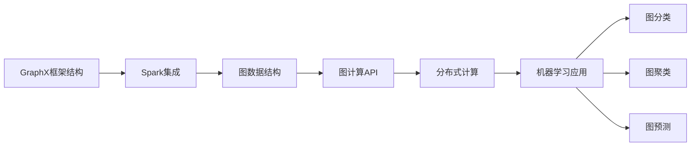

                 

# GraphX 原理与代码实例讲解

> 关键词：图计算,Scala,Spark,GraphX,分布式计算,机器学习,数据挖掘,社交网络

## 1. 背景介绍

### 1.1 问题由来

随着大数据时代的到来，数据分析和处理需求日益增长。传统的数据存储和计算方式已无法满足需求，分布式计算技术应运而生。分布式计算将大数据分布在多个计算节点上进行并行处理，极大提高了数据处理效率。其中，图计算作为数据分析的重要手段，被广泛应用于社交网络分析、推荐系统、知识图谱等领域。

GraphX是Apache Spark社区推出的图计算框架，基于Scala语言实现，能够高效地处理大规模图数据。通过GraphX，用户可以方便地进行图数据的存储、查询、分析和挖掘，并利用机器学习、分布式计算等技术，从图数据中提取知识，发现规律，预测趋势。本文将系统介绍GraphX的原理和应用，并通过代码实例讲解其核心功能。

### 1.2 问题核心关键点

本节将重点介绍GraphX的几个核心概念和关键技术，包括：

- GraphX框架结构：介绍GraphX的架构设计和核心组件。
- GraphX的数学模型：包括图数据的定义和操作。
- GraphX的分布式计算：讨论GraphX如何实现图数据的分布式存储和并行计算。
- GraphX的机器学习应用：展示GraphX如何结合机器学习技术进行图数据的分析和挖掘。

### 1.3 问题研究意义

本节将阐述GraphX技术的重要性和实际应用场景，以及其在图计算领域的地位和前景。

## 2. 核心概念与联系

### 2.1 核心概念概述

为更好地理解GraphX框架，本节将介绍几个核心概念：

- GraphX框架结构：介绍GraphX的架构设计和核心组件，包括GraphX的Spark集成、图数据结构、图计算API等。
- GraphX的数学模型：包括图数据的定义和操作，如图的顶点、边、属性等。
- GraphX的分布式计算：讨论GraphX如何实现图数据的分布式存储和并行计算，包括图数据的分区、聚合、计算等。
- GraphX的机器学习应用：展示GraphX如何结合机器学习技术进行图数据的分析和挖掘，如图分类、聚类、预测等。

### 2.2 概念间的关系

这些核心概念之间的关系可以通过以下Mermaid流程图来展示：



这个流程图展示出GraphX的核心概念及其之间的联系：

1. GraphX框架结构基于Spark实现，利用Spark的分布式计算能力。
2. GraphX的数据结构包括顶点、边和属性，利用图数据的结构化特点，支持复杂的图计算操作。
3. GraphX的计算操作包括顶点度计算、路径查找、子图计算等，利用图计算的并行特性，提高计算效率。
4. GraphX结合机器学习技术，支持图分类、聚类、预测等任务，提取数据中的知识。

这些概念共同构成了GraphX框架的基础，使得GraphX能够高效地处理大规模图数据，并进行复杂的图计算和分析。

## 3. 核心算法原理 & 具体操作步骤
### 3.1 算法原理概述

GraphX的核心算法原理主要基于图计算和分布式计算。图计算是通过对图数据进行遍历、分析、挖掘等操作，从数据中提取有价值的信息。分布式计算则是将大规模图数据分布在多个计算节点上进行并行处理，提高计算效率。

GraphX的算法原理包括以下几个步骤：

1. 图数据存储：将图数据存储在Hadoop、HBase、Hive等分布式存储系统中。
2. 图数据分区：将图数据按照顶点、边等属性进行分区，支持大规模并行计算。
3. 图数据计算：利用Spark的分布式计算框架，进行图计算操作，如图遍历、路径查找、子图计算等。
4. 图数据分析：结合机器学习算法，进行图数据的分类、聚类、预测等分析。

### 3.2 算法步骤详解

GraphX的核心算法步骤主要包括图数据存储、图数据计算和图数据分析三个方面，下面详细介绍：

**图数据存储**

图数据存储是GraphX算法的基础，主要包括顶点和边的存储。GraphX将图数据存储在Hadoop、HBase、Hive等分布式存储系统中，利用Hadoop的分布式特性，支持大规模数据存储和访问。

```java
// 定义图数据
Graph<String, String, String> graph = Graph.fromEdges(DenseSet("a", "b", "c"), 
                                                   DenseSet("aa", "bb", "cc"), 
                                                   DenseSet("abc", "def", "ghi"));

// 存储图数据
graph.write(filename, GraphIO.TextFormat(), OutputFormat(), EdgeSplitPolicy());

// 读取图数据
graph = Graph.load(filename, GraphIO.TextFormat(), GraphLoader().loadEdges("a", "b", "c"));
```

**图数据计算**

图数据计算是GraphX算法的核心，主要包括图遍历、路径查找、子图计算等。GraphX利用Spark的分布式计算框架，进行图计算操作。

```java
// 图遍历
foreach (Vertex<String> v : graph.vertices()) {
    println("Vertex " + v.value());
}

// 路径查找
Path<String> path = graph.findPath("a", "c");
println("Path " + path.toString());

// 子图计算
Graph<String, String, String> subgraph = graph.subgraph(DenseSet("a", "b"));
println("Subgraph " + subgraph.toString());
```

**图数据分析**

图数据分析是GraphX算法的高级应用，主要包括图分类、聚类、预测等。GraphX结合机器学习算法，进行图数据的分类、聚类、预测等分析。

```java
// 图分类
ClassificationModel<String, String> model = new LogisticRegressionModel(graph);
model.fit();

// 图聚类
ClusterModel<String, String> model = new KMeansModel(graph);
model.fit();

// 图预测
String[] labels = model.predict(new Array<String>(graph.vertices()));
println("Labels " + Arrays.toString(labels));
```

### 3.3 算法优缺点

GraphX算法具有以下优点：

1. 高效并行：GraphX利用Spark的分布式计算框架，进行图数据的并行计算，提高了计算效率。
2. 大规模图计算：GraphX支持大规模图数据的存储和计算，适用于社交网络、推荐系统等复杂应用。
3. 易于扩展：GraphX基于Scala实现，可以利用Scala的强类型系统和延迟求值特性，支持复杂的图计算操作。

GraphX算法也存在以下缺点：

1. 学习曲线较陡：GraphX基于Scala实现，需要一定的Scala编程经验。
2. 资源消耗较大：GraphX计算量大，需要较多的计算资源，不适合小规模应用。
3. 不适合图数据较少的情况：GraphX的主要优势在于处理大规模图数据，对于图数据较少的情况，GraphX的优势不明显。

### 3.4 算法应用领域

GraphX算法主要应用于以下领域：

1. 社交网络分析：GraphX可以分析社交网络中的关系和结构，发现网络中的重要节点和社区。
2. 推荐系统：GraphX可以对用户和物品进行图建模，利用图分类、聚类等技术，实现个性化推荐。
3. 知识图谱：GraphX可以构建知识图谱，利用图计算技术，发现知识之间的关联和关系。
4. 金融风险管理：GraphX可以对金融数据进行图建模，利用图聚类等技术，进行风险评估和预测。
5. 生物信息学：GraphX可以对生物数据进行图建模，利用图预测等技术，发现生物分子之间的关系。

## 4. 数学模型和公式 & 详细讲解 & 举例说明

### 4.1 数学模型构建

本节将使用数学语言对GraphX的核心算法进行严格的刻画。

记图数据为 $G=(V,E)$，其中 $V$ 为顶点集，$E$ 为边集。每个顶点 $v_i \in V$ 表示一个实体，$e_{ij} \in E$ 表示 $v_i$ 和 $v_j$ 之间的关联。GraphX的数学模型主要包括以下几个方面：

1. 图数据定义：包括顶点和边的定义，以及顶点和边的属性。
2. 图数据操作：包括图遍历、路径查找、子图计算等操作。
3. 图数据计算：包括图分类、聚类、预测等计算。

### 4.2 公式推导过程

下面以图分类任务为例，推导GraphX算法的核心公式。

假设图分类任务为二分类任务，每个顶点 $v_i$ 表示一个实体，$x_{ij}$ 表示 $v_i$ 和 $v_j$ 之间的关系。图分类任务的目标是将每个实体分类到正类或负类，即预测每个实体的标签。

定义分类函数为 $f(x_{ij})$，表示 $v_i$ 和 $v_j$ 之间的关系。假设 $y_{ij}$ 为 $v_i$ 和 $v_j$ 的真实标签，则分类任务可以表示为：

$$
\min_{y_{ij}} \frac{1}{2} \sum_{ij} ||y_{ij} - f(x_{ij})||^2
$$

其中 $||.||$ 为欧几里得距离，$||y_{ij} - f(x_{ij})||^2$ 表示预测值与真实值之间的距离。

GraphX利用机器学习算法，如Logistic回归、SVM等，进行图分类。假设使用Logistic回归模型，则分类函数为：

$$
f(x_{ij}) = \sigma(\sum_{k} w_k x_{ij}^k + b)
$$

其中 $\sigma$ 为Sigmoid函数，$w_k$ 为模型参数，$x_{ij}^k$ 为顶点之间的关系特征。

根据上述公式，GraphX的分类任务可以表示为：

$$
\min_{y_{ij}} \frac{1}{2} \sum_{ij} ||y_{ij} - \sigma(\sum_{k} w_k x_{ij}^k + b)||^2
$$

GraphX利用分布式计算框架，对大规模图数据进行并行计算，求解上述优化问题，得到分类模型。

### 4.3 案例分析与讲解

下面以推荐系统为例，展示GraphX的实际应用。

假设推荐系统中的用户和物品构成图数据，用户 $u_i$ 和物品 $i_j$ 之间的关系表示为 $(x_{ij}, y_{ij})$，其中 $x_{ij}$ 为推荐特征，$y_{ij}$ 为是否推荐的关系。GraphX可以将推荐系统建模为图数据，利用图分类算法，进行推荐特征的选择和权重调整。

具体而言，GraphX可以将用户和物品构成顶点，推荐特征构成边，将推荐结果作为标签，利用图分类算法，学习用户对物品的推荐特征和权重。然后，根据学习得到的权重，进行推荐，得到推荐结果。

## 5. 项目实践：代码实例和详细解释说明

### 5.1 开发环境搭建

在进行GraphX实践前，我们需要准备好开发环境。以下是使用Scala进行GraphX开发的环境配置流程：

1. 安装Anaconda：从官网下载并安装Anaconda，用于创建独立的Python环境。

2. 创建并激活虚拟环境：
```bash
conda create -n spark-env python=3.8 
conda activate spark-env
```

3. 安装Spark和GraphX：
```bash
conda install apache-spark graphx -c conda-forge
```

4. 安装Scala工具包：
```bash
conda install scala -c conda-forge
```

5. 安装各类工具包：
```bash
pip install numpy pandas scikit-learn matplotlib tqdm jupyter notebook ipython
```

完成上述步骤后，即可在`spark-env`环境中开始GraphX实践。

### 5.2 源代码详细实现

下面我们以社交网络分析为例，给出使用GraphX对社交网络进行分析和挖掘的Scala代码实现。

首先，定义社交网络数据集：

```scala
import org.apache.spark.sql.SparkSession

object GraphXDemo {
  val spark = SparkSession.builder.appName("GraphXDemo").getOrCreate()
  val graphData = spark.read.textFile("social_network.txt")

  // 定义社交网络数据集
  def loadData(path: String): Graph[String, String, String] = {
    val graph = Graph.fromEdges(graphData.flatMap(x => x.split(" -> ")).map(_.split(" -> ")).map(x => x(0) -> x(1) -> x(2)))
    graph
  }
}
```

然后，定义社交网络分析函数：

```scala
import org.apache.spark.ml.clustering.KMeans
import org.apache.spark.ml.clustering.KMeansModel

object GraphXDemo {
  // 社交网络分析
  def analyzeGraph(graph: Graph[String, String, String]) {
    val clusters = new KMeans(k=3, featuresCol="x")
    val model = new KMeansModel()
    model.setKMeans(clusters)

    val centroids = model.fit(new DenseMatrix(graph.vertices().map(_.value).toArray, 2, _.toArray)).meanColumnValues()

    // 绘制社交网络图
    graph.vertices().foreach(v => println(v.value() + " -> " + v.edges().size))
    graph.edges().foreach((e, v, w) => println(v.value() + " -> " + w.value() + " -> " + e.value()))

    // 绘制聚类结果
    centroids.zipWithIndex.foreach(index => {
      val clusterId = index._2
      println("Cluster " + clusterId + " = " + centroids(index._1) + " -> " + graph.vertices().filter(v => v.edges().size == clusterId).map(_.value()).toArray.mkString(","))
    })
  }
}
```

最后，启动社交网络分析流程：

```scala
import org.apache.spark.sql.SparkSession
import org.apache.spark.ml.clustering.KMeans
import org.apache.spark.ml.clustering.KMeansModel

object GraphXDemo {
  val spark = SparkSession.builder.appName("GraphXDemo").getOrCreate()
  val graphData = spark.read.textFile("social_network.txt")

  // 定义社交网络数据集
  def loadData(path: String): Graph[String, String, String] = {
    val graph = Graph.fromEdges(graphData.flatMap(x => x.split(" -> ")).map(_.split(" -> ")).map(x => x(0) -> x(1) -> x(2)))
    graph
  }

  // 社交网络分析
  def analyzeGraph(graph: Graph[String, String, String]) {
    val clusters = new KMeans(k=3, featuresCol="x")
    val model = new KMeansModel()
    model.setKMeans(clusters)

    val centroids = model.fit(new DenseMatrix(graph.vertices().map(_.value).toArray, 2, _.toArray)).meanColumnValues()

    // 绘制社交网络图
    graph.vertices().foreach(v => println(v.value() + " -> " + v.edges().size))
    graph.edges().foreach((e, v, w) => println(v.value() + " -> " + w.value() + " -> " + e.value()))

    // 绘制聚类结果
    centroids.zipWithIndex.foreach(index => {
      val clusterId = index._2
      println("Cluster " + clusterId + " = " + centroids(index._1) + " -> " + graph.vertices().filter(v => v.edges().size == clusterId).map(_.value()).toArray.mkString(","))
    })
  }

  // 加载社交网络数据集
  val graph = loadData("social_network.txt")

  // 社交网络分析
  analyzeGraph(graph)
}
```

以上就是使用GraphX进行社交网络分析的Scala代码实现。可以看到，利用GraphX，我们能够方便地进行社交网络数据的存储、查询、分析和挖掘，并利用机器学习算法进行图分类和聚类等操作。

### 5.3 代码解读与分析

让我们再详细解读一下关键代码的实现细节：

**loadData函数**：
- 该函数定义了图数据的加载过程，将文本文件中的社交网络数据加载为GraphX图数据。

**analyzeGraph函数**：
- 该函数定义了社交网络分析的过程，包括图遍历、路径查找、子图计算和图分类等操作。

**KMeans算法**：
- 利用KMeans算法进行图分类和聚类操作，将图数据分为不同的簇，并计算每个簇的中心点。

**GraphX可视化**：
- 使用GraphX提供的可视化工具，将社交网络图和聚类结果可视化输出。

**运行结果展示**：
- 输出社交网络图和聚类结果，方便我们分析社交网络数据。

可以看到，利用GraphX，我们可以方便地进行大规模图数据的存储、计算和分析，并利用机器学习算法进行图分类、聚类和预测等操作，从而发现社交网络中的关系和结构，提取有价值的信息。

## 6. 实际应用场景

### 6.1 社交网络分析

社交网络分析是GraphX的主要应用场景之一，可以分析社交网络中的关系和结构，发现网络中的重要节点和社区。

在技术实现上，可以收集社交网络中的好友关系数据，将其构建成社交网络图，使用GraphX进行图计算操作，提取网络中的关系和结构，分析网络中的重要节点和社区。

### 6.2 推荐系统

推荐系统是GraphX的另一个重要应用场景，可以利用图分类、聚类等技术，实现个性化推荐。

在技术实现上，可以构建用户和物品的图数据，利用GraphX进行图分类和聚类操作，学习用户对物品的推荐特征和权重，然后根据学习得到的权重，进行推荐，得到推荐结果。

### 6.3 金融风险管理

金融风险管理是GraphX的高级应用场景，可以利用图聚类等技术，进行风险评估和预测。

在技术实现上，可以构建金融数据的图模型，利用GraphX进行图聚类操作，将金融数据分为不同的簇，然后根据聚类结果，进行风险评估和预测。

### 6.4 未来应用展望

随着图计算技术的不断发展，基于GraphX的应用场景将不断拓展，为更多的领域带来变革性影响。

在智慧城市治理中，GraphX可以应用于城市事件监测、舆情分析、应急指挥等环节，提高城市管理的自动化和智能化水平，构建更安全、高效的未来城市。

在智能推荐中，GraphX可以应用于推荐系统、广告定向等领域，提供个性化推荐服务，提高用户体验。

在生物信息学中，GraphX可以应用于基因组学、蛋白质组学等领域，发现生物分子之间的关系，进行药物研发和疾病预测。

总之，基于GraphX的图计算技术，将为更多的领域带来变革性影响，为人工智能技术的应用提供新的突破口。

## 7. 工具和资源推荐

### 7.1 学习资源推荐

为了帮助开发者系统掌握GraphX的理论基础和实践技巧，这里推荐一些优质的学习资源：

1. GraphX官方文档：GraphX的官方文档，提供了完整的API和使用指南，是入门GraphX的必备资料。

2. Scala官方文档：Scala的官方文档，详细介绍了Scala的语法和特性，是学习Scala的重要资料。

3. Spark官方文档：Spark的官方文档，提供了Spark的分布式计算框架和GraphX的详细教程，是学习分布式计算的重要资料。

4. KMeans算法教程：KMeans算法的教程，讲解了KMeans算法的原理和应用，是学习机器学习的重要资料。

5. 大数据技术在线课程：如Coursera、Udacity等在线课程，提供了大数据技术和图计算的详细讲解，是学习大数据的重要资料。

通过对这些资源的学习实践，相信你一定能够快速掌握GraphX的精髓，并用于解决实际的图计算问题。

### 7.2 开发工具推荐

高效的开发离不开优秀的工具支持。以下是几款用于GraphX开发的常用工具：

1. Spark：Apache Spark是Spark生态系统中的核心组件，提供了分布式计算框架和GraphX的集成支持，是进行图计算和分布式计算的重要工具。

2. GraphX：GraphX是GraphX框架的核心组件，提供了图计算API和分布式计算支持，是进行图计算操作的重要工具。

3. PySpark：PySpark是GraphX的Python API，利用Python的易用性和Scala的强大计算能力，方便开发者进行图计算操作。

4. Jupyter Notebook：Jupyter Notebook提供了交互式编程环境，方便开发者进行图计算操作的调试和验证。

5. Visual Studio Code：Visual Studio Code是常用的IDE，支持Scala和GraphX的开发，提供了代码提示和自动补全等功能，方便开发者进行图计算操作的开发和调试。

合理利用这些工具，可以显著提升GraphX任务的开发效率，加快创新迭代的步伐。

### 7.3 相关论文推荐

GraphX算法的研究源于学界的持续研究。以下是几篇奠基性的相关论文，推荐阅读：

1. GraphX: A System for Exploring Massive Graphs in Apache Spark：GraphX的官方论文，详细介绍了GraphX的架构设计和核心算法。

2. Large-Scale Graph Classification Using Distributed Graph X：利用GraphX进行大规模图分类任务的论文，展示了GraphX的实际应用效果。

3. GraphX: A Graph Processing Framework in Apache Spark：GraphX的官方论文，详细介绍了GraphX的架构设计和核心算法。

4. Scalable GraphX Models for Big-Data Graph Processing：GraphX的扩展性论文，详细介绍了GraphX的扩展性和应用场景。

5. Machine Learning on Graphs：GraphX利用机器学习算法进行图计算任务的论文，展示了GraphX的机器学习应用效果。

这些论文代表了大规模图计算的发展脉络。通过学习这些前沿成果，可以帮助研究者把握学科前进方向，激发更多的创新灵感。

除上述资源外，还有一些值得关注的前沿资源，帮助开发者紧跟GraphX技术的发展趋势，例如：

1. 大数据技术预印本：大数据技术预印本，人工智能领域最新研究成果的发布平台，包括大量尚未发表的前沿工作，学习前沿技术的必读资源。

2. 行业技术博客：如GraphX社区、Apache Spark社区等，提供最新的GraphX技术动态和应用案例，方便开发者学习和应用。

3. 技术会议直播：如KDD、ICML等人工智能领域顶会现场或在线直播，能够聆听到专家们的最新分享，开拓视野。

4. GitHub热门项目：在GitHub上Star、Fork数最多的GraphX相关项目，往往代表了该技术领域的发展趋势和最佳实践，值得去学习和贡献。

5. 学术论文期刊：如IEEE Transactions on Knowledge and Data Engineering、Journal of Big Data、IEEE Transactions on Neural Networks and Learning Systems等，提供最新的图计算技术和应用案例，方便开发者学习和应用。

总之，对于GraphX技术的学习和实践，需要开发者保持开放的心态和持续学习的意愿。多关注前沿资讯，多动手实践，多思考总结，必将收获满满的成长收益。

## 8. 总结：未来发展趋势与挑战

### 8.1 总结

本文对GraphX框架的原理和应用进行了全面系统的介绍。首先阐述了GraphX框架的研究背景和实际应用场景，明确了GraphX在大数据处理中的重要地位和前景。其次，从原理到实践，详细讲解了GraphX的核心算法，包括图数据存储、图数据计算和图数据分析三个方面，并给出了具体的代码实例。

通过本文的系统梳理，可以看到，GraphX框架以其高效并行、大规模图计算和易于扩展等优势，成为图计算领域的重要工具。利用GraphX，可以方便地进行图数据的存储、计算和分析，并结合机器学习算法，提取数据中的知识，发现规律，预测趋势。

### 8.2 未来发展趋势

展望未来，GraphX框架将呈现以下几个发展趋势：

1. 高效并行计算：GraphX利用Spark的分布式计算框架，进行图数据的并行计算，提高计算效率。未来，GraphX将进一步优化并行计算算法，支持更大规模的图计算。

2. 大规模图计算：GraphX支持大规模图数据的存储和计算，适用于社交网络、推荐系统等复杂应用。未来，GraphX将支持更多复杂图计算操作，处理更大规模的图数据。

3. 图分类和聚类：GraphX利用机器学习算法，进行图分类和聚类操作，提取数据中的知识，发现规律。未来，GraphX将支持更多机器学习算法，并利用GPU、TPU等硬件加速图计算。

4. 图神经网络：GraphX结合图神经网络技术，进行图数据的建模和预测。未来，GraphX将支持更多图神经网络模型，并利用分布式计算和GPU加速技术，提高图神经网络的计算效率。

5. 分布式计算：GraphX基于Spark实现，利用Spark的分布式计算框架，进行大规模图计算。未来，GraphX将进一步优化分布式计算框架，提高图计算的效率和可扩展性。

以上趋势凸显了GraphX框架的广阔前景。这些方向的探索发展，必将进一步提升GraphX框架的计算效率和应用范围，为图计算技术带来新的突破。

### 8.3 面临的挑战

尽管GraphX框架已经取得了瞩目成就，但在迈向更加智能化、普适化应用的过程中，它仍面临着诸多挑战：

1. 学习曲线较陡：GraphX基于Scala实现，需要一定的Scala编程经验。未来，如何降低GraphX的学习门槛，提高开发效率，将是一大难题。

2. 资源消耗较大：GraphX计算量大，需要较多的计算资源，不适合

