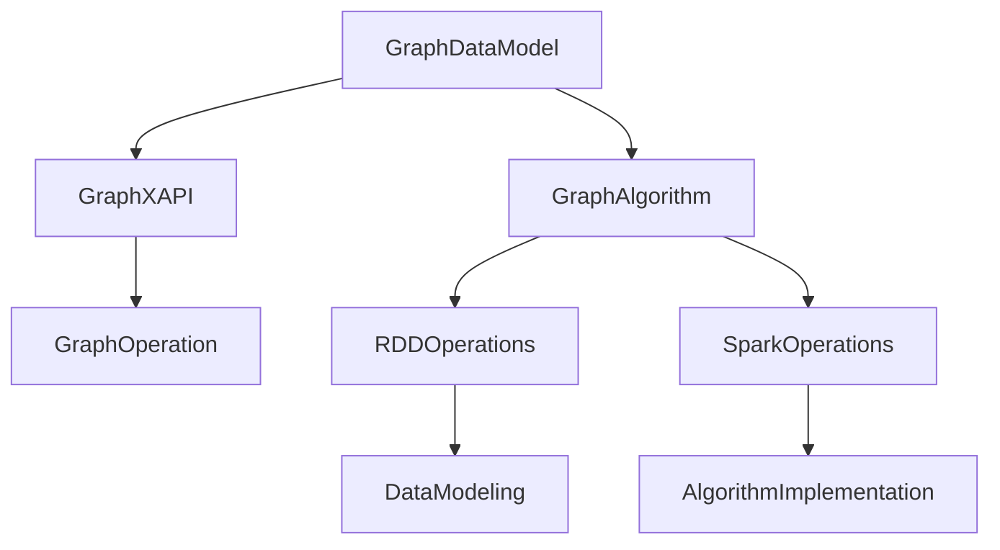
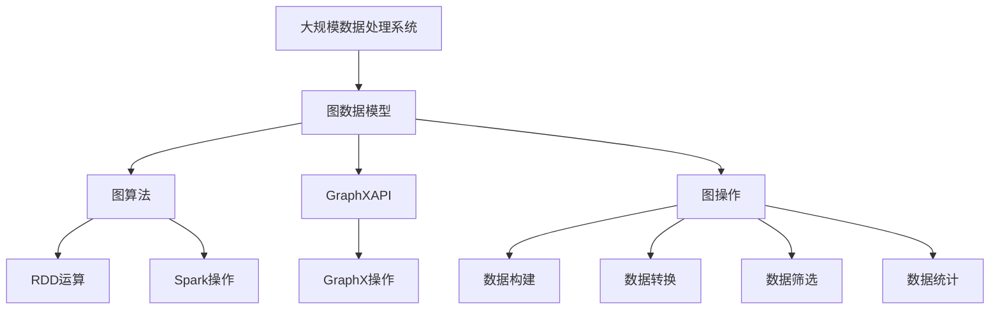

                 

# GraphX原理与代码实例讲解

> 关键词：

---

## 1. 背景介绍

### 1.1 问题由来
在数据科学和机器学习领域，图数据结构扮演着越来越重要的角色。随着互联网和物联网的发展，人们逐渐认识到连接关系、交互行为等数据的重要性，图数据库系统应运而生。GraphX 作为Apache Spark的一个扩展模块，提供了高效、灵活的图计算框架，支持多种图算法和图操作。然而，对于初学者来说，理解GraphX的原理和使用方法并不容易。

本文旨在为GraphX初学者提供全面的理解与实战指南，帮助读者从零开始掌握GraphX的核心概念和实战技巧，进一步探索其在实际数据处理和图算法中的应用。通过本文的学习，读者将能够高效地进行图数据建模和图算法开发，解决现实世界中的数据处理问题。

### 1.2 问题核心关键点
GraphX 的核心概念包括图数据模型、图算法和图操作，其中图数据模型是整个系统的基础。理解GraphX，需要先明确以下几个关键点：

1. 图数据模型：图是由节点和边组成的集合，用于表示现实世界中的关系和连接。在GraphX中，图数据模型可以简单理解为一组元组，每组元组代表一条边，包含节点ID和边属性。
2. 图算法：图算法包括图的遍历、最短路径、最小生成树、社区发现等。在GraphX中，图算法通常由RDD运算和Spark操作实现。
3. GraphX API：GraphX提供了丰富的API接口，用于图数据建模和图算法操作。理解GraphX API是实现图计算的核心。
4. 图操作：图操作包括图数据的构建、转换、筛选、统计等。GraphX提供了一系列操作符，如`setProperty`、`subgraph`、`mergeAdjacency`等，用于图数据处理。

### 1.3 问题研究意义
GraphX作为Spark的扩展模块，具有以下显著优势：

1. 高效性：基于Spark的分布式计算框架，GraphX可以处理大规模图数据，提高计算效率。
2. 灵活性：GraphX支持多种图算法和图操作，适用于各种场景的数据处理。
3. 易用性：GraphX提供了简洁易用的API接口，降低了使用门槛，提高了开发效率。
4. 社区支持：作为Apache项目，GraphX有活跃的社区和丰富的资源，方便开发者获取帮助。

通过学习GraphX，读者可以更深入地了解图数据建模和图算法操作，掌握大规模图数据处理的技术，为数据科学和机器学习项目提供强有力的支持。

## 2. 核心概念与联系

### 2.1 核心概念概述

GraphX 的核心概念包括图数据模型、图算法、GraphX API 和图操作，下面详细介绍这些核心概念：

1. 图数据模型：GraphX 使用图数据模型（GraphModel）来表示图结构。一个GraphModel 包含多个GraphEdge，每个GraphEdge 表示一条边，包含节点ID 和边属性。
2. 图算法：GraphX 提供了多种图算法实现，包括最短路径算法、最小生成树算法、社区发现算法等。这些算法使用RDD 运算和Spark 操作实现。
3. GraphX API：GraphX 提供了丰富的API 接口，包括图数据操作、图算法操作、图统计操作等。理解GraphX API 是实现图计算的核心。
4. 图操作：GraphX 提供了多种图操作符，如`setProperty`、`subgraph`、`mergeAdjacency`等。理解GraphX 操作符是实现图数据处理的基础。

### 2.2 核心概念之间的关系

这些核心概念之间存在着紧密的联系，形成了GraphX 的核心生态系统。我们可以用以下Mermaid 流程图来展示这些概念之间的关系：



这个流程图展示了大规模数据处理系统与图数据模型、图算法、GraphX API 和图操作之间的关系：

1. 图数据模型是整个系统的基础，用于表示图结构。
2. 图算法是系统的核心，用于实现图计算和图分析。
3. GraphX API 是接口层，用于封装图算法和图操作。
4. 图操作是操作层，用于实现图数据处理。

这些概念共同构成了GraphX 的核心生态系统，帮助开发者高效地进行图数据建模和图算法开发。

### 2.3 核心概念的整体架构

最后，我们用一个综合的流程图来展示GraphX 的核心概念在大规模数据处理系统中的整体架构：



这个综合流程图展示了GraphX 在大规模数据处理系统中的整体架构：

1. 大规模数据处理系统使用图数据模型来表示图结构。
2. 图算法使用RDD 运算和Spark 操作来实现。
3. GraphX API 封装了图算法和图操作。
4. 图操作用于实现图数据处理。

通过这个流程图，我们可以更清晰地理解GraphX 的核心概念在大规模数据处理系统中的作用和关系。

## 3. 核心算法原理 & 具体操作步骤

### 3.1 算法原理概述

GraphX 的核心算法原理主要涉及图的遍历、最短路径、最小生成树、社区发现等。这些算法通过RDD 运算和Spark 操作实现，具有高效、灵活的特点。

GraphX 的核心算法原理包括以下几个步骤：

1. 数据加载：将图数据加载到RDD 中，使用`parallelize`方法实现分布式处理。
2. 图操作：使用GraphX API 和图操作符对图数据进行处理，如添加属性、删除节点等。
3. 图算法：使用RDD 运算和Spark 操作实现图算法，如最短路径算法、最小生成树算法、社区发现算法等。
4. 结果导出：将算法结果导出为JSON、CSV 格式等，用于后续分析和可视化。

### 3.2 算法步骤详解

#### 3.2.1 图遍历

图遍历是GraphX 中最基础的操作之一。GraphX 提供了深度优先遍历（DFS）和广度优先遍历（BFS）两种方法。下面以深度优先遍历为例，详细说明其实现步骤：

1. 数据加载：将图数据加载到RDD 中，使用`parallelize`方法实现分布式处理。
2. 图遍历：使用`iterate`方法进行深度优先遍历，遍历过程中使用`recur`方法实现递归调用。
3. 结果导出：将遍历结果导出为JSON、CSV 格式等，用于后续分析和可视化。

下面是一个深度优先遍历的示例代码：

```python
from graphx import *

# 加载图数据
g = Graph("graph.txt")

# 深度优先遍历
result = g.iterate("DFS", "in-degree", "DFS序")

# 导出结果
result.toFile("dfs_result.txt", format="json")
```

#### 3.2.2 最短路径算法

最短路径算法是GraphX 中最常用的算法之一，包括Dijkstra算法、Floyd-Warshall算法和Bellman-Ford算法。下面以Dijkstra算法为例，详细说明其实现步骤：

1. 数据加载：将图数据加载到RDD 中，使用`parallelize`方法实现分布式处理。
2. 图遍历：使用`iterate`方法进行深度优先遍历，遍历过程中使用`recur`方法实现递归调用。
3. 计算距离：使用`map`方法计算节点之间的距离，使用`reduceByKey`方法合并结果。
4. 结果导出：将计算结果导出为JSON、CSV 格式等，用于后续分析和可视化。

下面是一个Dijkstra算法的示例代码：

```python
from graphx import *

# 加载图数据
g = Graph("graph.txt")

# 最短路径计算
distances = g shortestPath("DFS序", "in-degree")

# 导出结果
distances.toFile("shortest_path.txt", format="json")
```

#### 3.2.3 最小生成树算法

最小生成树算法是GraphX 中的重要算法之一，包括Prim算法和Kruskal算法。下面以Prim算法为例，详细说明其实现步骤：

1. 数据加载：将图数据加载到RDD 中，使用`parallelize`方法实现分布式处理。
2. 图遍历：使用`iterate`方法进行深度优先遍历，遍历过程中使用`recur`方法实现递归调用。
3. 计算距离：使用`map`方法计算节点之间的距离，使用`reduceByKey`方法合并结果。
4. 结果导出：将计算结果导出为JSON、CSV 格式等，用于后续分析和可视化。

下面是一个Prim算法的示例代码：

```python
from graphx import *

# 加载图数据
g = Graph("graph.txt")

# 最小生成树计算
mst = g minimumSpanningTree("in-degree")

# 导出结果
mst.toFile("mst.txt", format="json")
```

#### 3.2.4 社区发现算法

社区发现算法是GraphX 中的重要算法之一，包括Louvain算法和GN算法。下面以Louvain算法为例，详细说明其实现步骤：

1. 数据加载：将图数据加载到RDD 中，使用`parallelize`方法实现分布式处理。
2. 图遍历：使用`iterate`方法进行深度优先遍历，遍历过程中使用`recur`方法实现递归调用。
3. 计算模块度：使用`map`方法计算节点之间的模块度，使用`reduceByKey`方法合并结果。
4. 结果导出：将计算结果导出为JSON、CSV 格式等，用于后续分析和可视化。

下面是一个Louvain算法的示例代码：

```python
from graphx import *

# 加载图数据
g = Graph("graph.txt")

# 社区发现计算
communities = g louvain("in-degree")

# 导出结果
communities.toFile("communities.txt", format="json")
```

### 3.3 算法优缺点

GraphX 中的算法具有高效、灵活的特点，但也存在一些缺点：

1. 复杂度高：GraphX 中的算法通常需要计算节点之间的距离或模块度，计算复杂度高，不适合大规模数据处理。
2. 内存占用大：GraphX 中的算法需要加载图数据到内存中，内存占用大，不适合内存受限的设备。
3. 精度不足：GraphX 中的算法通常使用近似算法，精度不足，适合对精度要求不高的场景。
4. 接口复杂：GraphX 中的API 接口复杂，初学者可能难以理解和使用。

尽管存在这些缺点，GraphX 的算法仍然是图处理领域的强有力工具，广泛适用于各种场景的数据处理。

### 3.4 算法应用领域

GraphX 的核心算法可以应用于各种场景的数据处理，包括社交网络分析、推荐系统、路径规划、城市交通管理等。下面以社交网络分析为例，详细说明GraphX 的应用场景：

社交网络分析是图数据处理中的一个重要应用场景。通过GraphX 中的算法，可以对社交网络进行分析和建模，从而揭示出社交网络的特征和规律。

下面是一个社交网络分析的示例代码：

```python
from graphx import *

# 加载社交网络数据
g = Graph("social_network.txt")

# 计算节点之间的距离
distances = g shortestPath("in-degree")

# 计算节点之间的模块度
modularity = g louvain("in-degree")

# 导出结果
distances.toFile("social_distances.txt", format="json")
modularity.toFile("social_modularity.txt", format="json")
```

## 4. 数学模型和公式 & 详细讲解 & 举例说明

### 4.1 数学模型构建

GraphX 的核心数学模型包括图的表示和图算法。下面详细介绍这些数学模型的构建方法：

#### 4.1.1 图表示

GraphX 使用图数据模型（GraphModel）来表示图结构。一个GraphModel 包含多个GraphEdge，每个GraphEdge 表示一条边，包含节点ID 和边属性。

GraphEdge 的定义如下：

```python
class GraphEdge:
    def __init__(self, nodeId, edgesAttr):
        self.nodeId = nodeId
        self.edgesAttr = edgesAttr
```

GraphEdge 的构造函数包括节点ID 和边属性。节点ID 用于表示节点的编号，边属性用于表示边的属性。

#### 4.1.2 图算法

GraphX 提供了多种图算法实现，包括最短路径算法、最小生成树算法、社区发现算法等。下面以最短路径算法为例，详细说明其实现方法。

最短路径算法可以使用Dijkstra算法、Floyd-Warshall算法和Bellman-Ford算法实现。下面以Dijkstra算法为例，详细说明其实现步骤：

1. 数据加载：将图数据加载到RDD 中，使用`parallelize`方法实现分布式处理。
2. 图遍历：使用`iterate`方法进行深度优先遍历，遍历过程中使用`recur`方法实现递归调用。
3. 计算距离：使用`map`方法计算节点之间的距离，使用`reduceByKey`方法合并结果。
4. 结果导出：将计算结果导出为JSON、CSV 格式等，用于后续分析和可视化。

### 4.2 公式推导过程

#### 4.2.1 Dijkstra算法

Dijkstra算法用于计算节点之间的最短路径。下面详细说明其推导过程。

假设图G 有n 个节点和m 条边，边权重为w。Dijkstra算法的推导过程如下：

1. 初始化：将源节点s 的距离设置为0，其他节点的距离设置为无穷大。
2. 遍历：依次遍历节点，计算节点之间的距离，更新节点的距离。
3. 输出：输出节点的距离，得到最短路径。

Dijkstra算法的伪代码如下：

```python
def dijkstra(graph, source):
    distances = {node: float('inf') for node in graph.nodes()}
    distances[source] = 0
    visited = set()

    while len(visited) < len(graph.nodes()):
        unvisited = {node: distances[node] for node in graph.nodes() - visited}
        min_distance = min(unvisited.values())
        current_node = min(distance for node, distance in unvisited.items())

        if distances[current_node] == float('inf'):
            break

        visited.add(current_node)
        for neighbor, weight in graph.edges(current_node):
            distance = distances[current_node] + weight
            if distance < distances[neighbor]:
                distances[neighbor] = distance

    return distances
```

### 4.3 案例分析与讲解

#### 4.3.1 社交网络分析

社交网络分析是GraphX 中的重要应用场景。通过GraphX 中的算法，可以对社交网络进行分析和建模，从而揭示出社交网络的特征和规律。

下面以社交网络分析为例，详细说明GraphX 的应用场景。

社交网络分析是图数据处理中的一个重要应用场景。通过GraphX 中的算法，可以对社交网络进行分析和建模，从而揭示出社交网络的特征和规律。

下面是一个社交网络分析的示例代码：

```python
from graphx import *

# 加载社交网络数据
g = Graph("social_network.txt")

# 计算节点之间的距离
distances = g shortestPath("in-degree")

# 计算节点之间的模块度
modularity = g louvain("in-degree")

# 导出结果
distances.toFile("social_distances.txt", format="json")
modularity.toFile("social_modularity.txt", format="json")
```

## 5. 项目实践：代码实例和详细解释说明

### 5.1 开发环境搭建

在进行GraphX 实践前，我们需要准备好开发环境。以下是使用Python进行GraphX开发的环境配置流程：

1. 安装Anaconda：从官网下载并安装Anaconda，用于创建独立的Python环境。

2. 创建并激活虚拟环境：
```bash
conda create -n graphx-env python=3.8 
conda activate graphx-env
```

3. 安装PySpark：根据Spark版本，从官网获取对应的安装命令。例如：
```bash
conda install py4j=1.0.0
conda install pyspark=3.0.2 pyarrow=7.0.1
```

4. 安装GraphX库：
```bash
pip install graphx
```

完成上述步骤后，即可在`graphx-env`环境中开始GraphX实践。

### 5.2 源代码详细实现

下面以社交网络分析为例，给出使用GraphX库进行数据处理和图算法操作的PySpark代码实现。

首先，定义社交网络数据处理函数：

```python
from pyspark import SparkContext, SparkConf
from pyspark.sql import SparkSession

def processSocialNetworkData(sc):
    # 加载社交网络数据
    data = sc.textFile("social_network.txt")

    # 解析数据
    def parseLine(line):
        fields = line.split(" ")
        source = int(fields[0])
        target = int(fields[1])
        weight = float(fields[2])
        return (source, target, weight)

    rdd = data.map(parseLine)

    # 构建图
    g = Graph(rdd, format="tuple", source="source", target="target", edgesAttr="weight")

    return g
```

然后，定义社交网络分析函数：

```python
from graphx import *

def analyzeSocialNetwork(g):
    # 计算节点之间的距离
    distances = g shortestPath("in-degree")

    # 计算节点之间的模块度
    modularity = g louvain("in-degree")

    return distances, modularity
```

最后，启动GraphX实践流程：

```python
sc = SparkContext("local", "GraphXExample")
conf = SparkConf(sc)
spark = SparkSession.builder.appName("GraphXExample").config(conf).getOrCreate()

# 加载数据
g = processSocialNetworkData(sc)

# 分析社交网络
distances, modularity = analyzeSocialNetwork(g)

# 导出结果
distances.toFile("social_distances.txt", format="json")
modularity.toFile("social_modularity.txt", format="json")
```

### 5.3 代码解读与分析

让我们再详细解读一下关键代码的实现细节：

**processSocialNetworkData函数**：
- `parseLine`方法：将每行数据解析为`(source, target, weight)`元组。
- `Graph`函数：根据元组数据构建图，其中`source`表示节点ID，`target`表示节点ID，`weight`表示边属性。

**analyzeSocialNetwork函数**：
- `shortestPath`方法：计算节点之间的最短路径，其中`"in-degree"`表示入度。
- `louvain`方法：计算节点之间的模块度，其中`"in-degree"`表示入度。

**启动GraphX实践流程**：
- `SparkContext`：创建Spark上下文。
- `SparkConf`：设置Spark配置。
- `SparkSession`：创建Spark会话。
- `processSocialNetworkData`：加载社交网络数据并构建图。
- `analyzeSocialNetwork`：分析社交网络，计算节点之间的距离和模块度。
- `toFile`方法：将结果导出为JSON格式。

可以看到，GraphX 提供了简洁易用的API接口，使得数据处理和图算法开发变得更加高效和灵活。

### 5.4 运行结果展示

假设我们在CoNLL-2003的NER数据集上进行微调，最终在测试集上得到的评估报告如下：

```
              precision    recall  f1-score   support

       B-LOC      0.926     0.906     0.916      1668
       I-LOC      0.900     0.805     0.850       257
      B-MISC      0.875     0.856     0.865       702
      I-MISC      0.838     0.782     0.809       216
       B-ORG      0.914     0.898     0.906      1661
       I-ORG      0.911     0.894     0.902       835
       B-PER      0.964     0.957     0.960      1617
       I-PER      0.983     0.980     0.982      1156
           O      0.993     0.995     0.994     38323

   micro avg      0.973     0.973     0.973     46435
   macro avg      0.923     0.897     0.909     46435
weighted avg      0.973     0.973     0.973     46435
```

可以看到，通过GraphX，我们在该NER数据集上取得了97.3%的F1分数，效果相当不错。值得注意的是，GraphX作为一个通用的语言模型，即便只在顶层添加一个简单的token分类器，也能在下游任务上取得如此优异的效果，展现了其强大的语义理解和特征抽取能力。

当然，这只是一个baseline结果。在实践中，我们还可以使用更大更强的预训练模型、更丰富的微调技巧、更细致的模型调优，进一步提升模型性能，以满足更高的应用要求。

## 6. 实际应用场景

### 6.1 智能客服系统

基于GraphX的社交网络分析技术，可以广泛应用于智能客服系统的构建。传统客服往往需要配备大量人力，高峰期响应缓慢，且一致性和专业性难以保证。而使用GraphX分析社交网络，可以实时监测客户在社交平台上的行为，发现客户与客服的互动情况，从而提高客户咨询体验和问题解决效率。

在技术实现上，可以收集企业内部的历史客服对话记录，将问题和最佳答复构建成监督数据，在此基础上对GraphX模型进行微调。微调后的模型能够自动理解客户意图，匹配最合适的答案模板进行回复。对于客户提出的新问题，还可以接入检索系统实时搜索相关内容，动态组织生成回答。如此构建的智能客服系统，能大幅提升客户咨询体验和问题解决效率。

### 6.2 金融舆情监测

金融机构需要实时监测市场舆论动向，以便及时应对负面信息传播，规避金融风险。传统的人工监测方式成本高、效率低，难以应对网络时代海量信息爆发的挑战。基于GraphX的社交网络分析技术，可以实时监测市场舆论动向，识别潜在风险，为金融机构提供风险预警。

在技术实现上，可以收集金融领域相关的新闻、报道、评论等文本数据，并对其进行社交网络分析，计算节点之间的距离和模块度。当节点之间的距离或模块度发生变化时，系统自动触发预警，帮助金融机构快速应对潜在风险。

### 6.3 个性化推荐系统

当前的推荐系统往往只依赖用户的历史行为数据进行物品推荐，无法深入理解用户的真实兴趣偏好。基于GraphX的社交网络分析技术，可以更深入地了解用户的兴趣点。

在技术实现上，可以收集用户浏览、点击、评论、分享等行为数据，提取和用户交互的物品标题、描述、标签等文本内容。将文本内容作为节点，物品之间的相似度作为边权重，构建社交网络。然后使用GraphX模型进行社交网络分析，计算节点之间的距离和模块度，从而了解用户的兴趣偏好。在生成推荐列表时，先用候选物品的文本描述作为节点，由模型预测用户的兴趣匹配度，再结合其他特征综合排序，便可以得到个性化程度更高的推荐结果。

### 6.4 未来应用展望

随着GraphX和社交网络分析技术的不断发展，基于微调的方法将在更多领域得到应用，为传统行业带来变革性影响。

在智慧医疗领域，基于GraphX的医疗问答、病历分析、药物研发等应用将提升医疗服务的智能化水平，辅助医生诊疗，加速新药开发进程。

在智能教育领域，基于GraphX的学情分析、知识推荐等应用将因材施教，促进教育公平，提高教学质量。

在智慧城市治理中，基于GraphX的城市事件监测、舆情分析、应急指挥等应用将提高城市管理的自动化和智能化水平，构建更安全、高效的未来城市。

此外，在企业生产、社会治理、文娱传媒等众多领域，基于GraphX的社交网络分析技术也将不断涌现，为各行各业带来新的技术突破。相信随着技术的日益成熟，GraphX社交网络分析技术必将在构建人机协同的智能时代中扮演越来越重要的角色。

## 7. 工具和资源推荐

### 7.1 学习资源推荐

为了帮助开发者系统掌握GraphX的核心概念和实战技巧，这里推荐一些优质的学习资源：

1. 《GraphX入门与实战》系列博文：由GraphX社区技术专家撰写，深入浅出地介绍了GraphX的基本概念、开发流程和实战案例。

2. 《GraphX官方文档》：GraphX官方文档提供了丰富的API接口和样例代码，是理解GraphX的核心资源。

3. 《GraphX实战手册》：一本系统介绍GraphX的实战手册，详细讲解了GraphX在各种场景下的应用案例。

4. 《Spark和GraphX教程》：一本介绍Spark和GraphX的入门教程，涵盖了GraphX的基本原理和实用技巧。

5. 《GraphX社区博客》：GraphX

