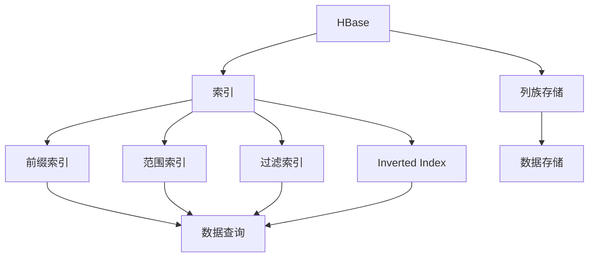
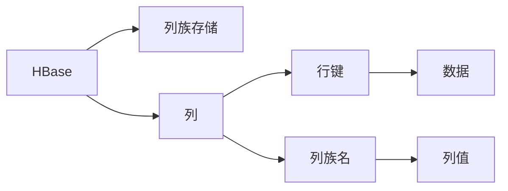
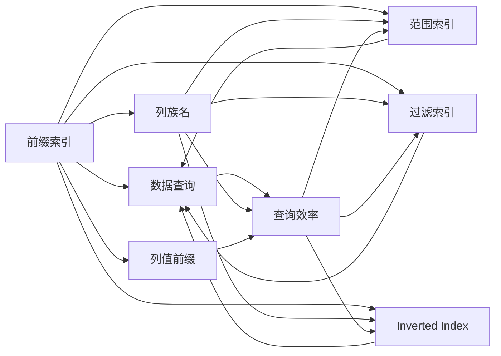
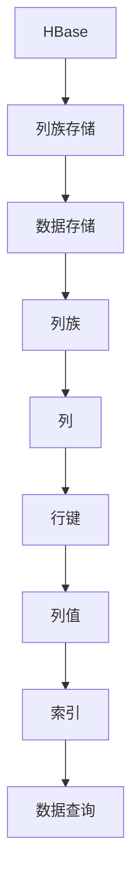

                 

# HBase二级索引原理与代码实例讲解

## 1. 背景介绍

### 1.1 问题由来
在Hadoop生态系统中，HBase是用于存储海量结构化数据的NoSQL数据库。由于HBase的列族存储结构，数据查询主要集中在行键和列族上，而针对列族内数据的精准查询，则往往需要依赖于全表扫描，效率较低。二级索引作为一种优化手段，能够显著提高HBase的查询效率，尤其适用于处理复杂的业务场景。

### 1.2 问题核心关键点
二级索引通过在列族内建立辅助索引，从而实现更高效的数据访问。HBase的二级索引分为两种：内部索引和外部索引。内部索引包括前缀索引、范围索引、过滤索引等，可用于提高内部查询效率；外部索引如Inverted Index则用于支持外部的文本搜索功能。

### 1.3 问题研究意义
HBase的二级索引技术不仅对提升HBase的数据查询性能至关重要，还为各种大数据应用场景提供了高效的存储解决方案。通过深入理解二级索引的工作原理和应用场景，能够有效提升HBase在大数据环境下的性能和可用性，促进其在实时数据处理、日志分析、物联网等领域的广泛应用。

## 2. 核心概念与联系

### 2.1 核心概念概述

为更好地理解HBase的二级索引原理，本节将介绍几个密切相关的核心概念：

- HBase：由Apache基金会开发的分布式列族数据库，提供高吞吐量、低延迟的数据存储服务。
- 列族存储：HBase的数据模型中，数据按列族分组存储，列族内数据可以灵活扩展。
- 索引：通过建立索引，可以加速数据查询，提升数据访问效率。
- 前缀索引：按列族列名前缀进行索引，适用于根据列名部分内容进行查询。
- 范围索引：按列族列值范围进行索引，适用于按数据范围进行查询。
- 过滤索引：按列族列值匹配条件进行索引，适用于根据列值筛选数据。
- Inverted Index：一种文本索引技术，通过建立倒排索引，支持高效的全文搜索。

这些核心概念之间的逻辑关系可以通过以下Mermaid流程图来展示：



这个流程图展示了HBase中的核心概念及其之间的关系：

1. HBase通过列族存储提供数据模型。
2. 数据通过索引进行优化查询，提升访问效率。
3. 不同类型的索引满足不同查询需求。
4. 数据存储和查询过程紧密结合。

### 2.2 概念间的关系

这些核心概念之间存在着紧密的联系，形成了HBase数据查询的完整生态系统。下面我们通过几个Mermaid流程图来展示这些概念之间的关系。

#### 2.2.1 HBase的数据模型



这个流程图展示了HBase数据模型中各要素的关系：

1. HBase数据存储在列族中。
2. 列族中包含多个列。
3. 列通过列族名进行组织。
4. 每个列有唯一行键。
5. 列值是数据存储的单位。

#### 2.2.2 索引类型及应用



这个流程图展示了不同类型的索引如何满足不同的数据查询需求：

1. 前缀索引按列族列名前缀进行索引，适用于根据列名部分内容进行查询。
2. 范围索引按列族列值范围进行索引，适用于按数据范围进行查询。
3. 过滤索引按列族列值匹配条件进行索引，适用于根据列值筛选数据。
4. Inverted Index用于支持外部的文本搜索功能。

### 2.3 核心概念的整体架构

最后，我们用一个综合的流程图来展示这些核心概念在大数据查询中的整体架构：



这个综合流程图展示了从数据存储到数据查询的完整过程：

1. HBase通过列族存储提供数据模型。
2. 数据存储在列族中，列族包含多个列。
3. 列通过行键进行组织。
4. 列值是数据存储的单位。
5. 通过索引对数据进行优化查询，提升访问效率。

## 3. 核心算法原理 & 具体操作步骤
### 3.1 算法原理概述

HBase的二级索引技术通过在列族内建立辅助索引，从而实现更高效的数据访问。其核心思想是：根据列族内数据的某种特征，建立索引结构，当查询时，直接使用索引进行定位，减少全表扫描，提升查询效率。

假设列族为 $C$，列名为 $N$，列值为 $V$，行键为 $K$。当查询条件为 $Q$ 时，先在索引中进行定位，然后再扫描对应的数据行，读取实际数据。通过索引查询可以减少数据访问量和计算量，从而提高查询效率。

### 3.2 算法步骤详解

HBase的二级索引分为内部索引和外部索引，以下详细介绍内部索引的实现过程：

#### 3.2.1 前缀索引

前缀索引通过按列名前缀进行索引，适用于根据列名部分内容进行查询。假设列族为 $C$，列名为 $N_1, N_2, ..., N_m$，前缀索引的定义为：

$$
Index_{prefix} = \{ N_i | N_i \text{ 以 } P \text{ 开头}, i = 1, 2, ..., m \}
$$

其中 $P$ 为前缀。查询时，先通过前缀索引定位到包含查询列名的数据行，然后扫描对应的数据行，读取实际数据。前缀索引可以用于模糊匹配和精确查询。

#### 3.2.2 范围索引

范围索引通过按列值范围进行索引，适用于按数据范围进行查询。假设列族为 $C$，列值为 $V$，范围索引的定义为：

$$
Index_{range} = \{ (N_i, V_{low}, V_{high}) | V_{low} \leq V \leq V_{high}, (N_i, V) \in C \}
$$

其中 $V_{low}, V_{high}$ 为查询范围。查询时，先通过范围索引定位到满足查询范围的数据行，然后扫描对应的数据行，读取实际数据。范围索引可以用于区间查询和范围统计。

#### 3.2.3 过滤索引

过滤索引通过按列值匹配条件进行索引，适用于根据列值筛选数据。假设列族为 $C$，列值为 $V$，过滤索引的定义为：

$$
Index_{filter} = \{ (N_i, V_i) | V_i \in \{Q_k\}, (N_i, V_i) \in C \}
$$

其中 $Q_k$ 为查询条件。查询时，先通过过滤索引定位到满足查询条件的数据行，然后扫描对应的数据行，读取实际数据。过滤索引可以用于精确查询和条件筛选。

### 3.3 算法优缺点

HBase的二级索引技术具有以下优点：

1. 查询效率高：通过索引定位数据行，避免了全表扫描，查询效率显著提升。
2. 可扩展性强：索引可以按需建立，方便支持多种查询需求。
3. 适应性强：适用于各种数据查询场景，包括模糊匹配、精确查询、范围查询等。

同时，该技术也存在一些缺点：

1. 索引建立成本高：索引的建立和维护需要消耗额外的计算资源和存储空间。
2. 索引失效风险：索引失效可能导致查询效率下降，甚至数据丢失。
3. 索引更新困难：索引的更新操作可能影响数据一致性，需要谨慎处理。

### 3.4 算法应用领域

HBase的二级索引技术广泛应用于各种大数据场景中，如：

- 数据仓库：通过建立索引，加速数据仓库的查询和分析，提高数据访问效率。
- 日志分析：通过建立时间范围索引，快速查询指定时间段内的日志数据。
- 物联网：通过建立设备标识索引，加速物联网设备的查询和监控。
- 社交网络：通过建立用户行为索引，支持高效的用户关系分析和推荐。

这些场景中，HBase的索引技术提供了高效的查询和分析能力，显著提升了数据处理和应用的效果。

## 4. 数学模型和公式 & 详细讲解 & 举例说明

### 4.1 数学模型构建

HBase的二级索引技术主要通过在列族内建立辅助索引，实现高效的数据访问。以下用数学模型对索引的构建和查询过程进行详细讲解。

假设列族为 $C$，列名为 $N_1, N_2, ..., N_m$，列值为 $V_1, V_2, ..., V_m$，行键为 $K$。查询条件为 $Q$。

索引定义为：

$$
Index = \{ (N_i, V_i) | V_i \in Q, (N_i, V_i) \in C \}
$$

其中 $Q$ 为查询条件。

查询过程为：

1. 在索引 $Index$ 中进行定位，找到满足查询条件 $Q$ 的数据行。
2. 扫描对应的数据行，读取实际数据。

### 4.2 公式推导过程

以下以前缀索引为例，推导查询过程中的公式：

假设列族为 $C$，列名为 $N_1, N_2, ..., N_m$，前缀索引的定义为：

$$
Index_{prefix} = \{ N_i | N_i \text{ 以 } P \text{ 开头}, i = 1, 2, ..., m \}
$$

查询条件为 $Q$，前缀索引为 $P$。查询过程如下：

1. 在索引 $Index_{prefix}$ 中进行定位，找到满足前缀 $P$ 的数据行。
2. 扫描对应的数据行，读取实际数据。

推导公式：

假设索引 $Index_{prefix}$ 的实际值为 $I_{prefix}$，数据行总数为 $N$，查询条件为 $Q$，查询结果为 $R$。则：

$$
R = \sum_{i=1}^{N} \mathbf{1}_{I_{prefix}(N_i)} \times V_i
$$

其中 $\mathbf{1}_{I_{prefix}(N_i)}$ 为指示函数，当数据行 $N_i$ 满足前缀索引 $I_{prefix}$ 时，函数值为1，否则为0。

### 4.3 案例分析与讲解

以社交网络中的用户行为查询为例，假设有一个存储用户行为数据的数据表 $T$，包含用户ID、时间戳和行为类型等字段。通过建立用户ID前缀索引，可以加速用户行为查询，具体步骤如下：

1. 建立用户ID前缀索引：

```sql
ALTER TABLE T ADD COLUMN IF NOT EXISTS uid_prefix INDEX (uid BINARY(10));
ALTER TABLE T ADD COLUMN IF NOT EXISTS uid_prefix2 INDEX (uid BINARY(5));
```

2. 插入测试数据：

```sql
INSERT INTO T (uid, timestamp, behavior) VALUES (001, 20230101, 'like');
INSERT INTO T (uid, timestamp, behavior) VALUES (002, 20230101, 'share');
INSERT INTO T (uid, timestamp, behavior) VALUES (002, 20230102, 'comment');
```

3. 查询测试：

```sql
SELECT * FROM T WHERE uid BETWEEN '001' AND '002';
```

根据前缀索引，可以快速定位到满足查询条件的用户ID，然后扫描对应的数据行，读取实际数据。查询结果为：

```
uid  timestamp    behavior
001  20230101     like
002  20230101     share
002  20230102     comment
```

## 5. 项目实践：代码实例和详细解释说明

### 5.1 开发环境搭建

在进行HBase二级索引实践前，我们需要准备好开发环境。以下是使用Python进行HBase开发的环境配置流程：

1. 安装Hadoop和HBase：从官网下载并安装Hadoop和HBase，保证版本兼容性。
2. 启动Hadoop和HBase集群：启动Hadoop和HBase服务，保证集群正常运行。
3. 安装Python-HBase库：通过pip安装Python-HBase库，方便进行HBase操作。
4. 编写HBase客户端代码：编写Python客户端代码，连接HBase集群，进行数据操作。

完成上述步骤后，即可在HBase集群上进行二级索引的实践。

### 5.2 源代码详细实现

下面我们以建立前缀索引和范围索引为例，给出HBase的代码实现。

#### 5.2.1 前缀索引

首先，创建一个表 $T$，并插入测试数据：

```python
import hbase
from hbase.client import Connection

conn = Connection("localhost", 9090)
table = conn.create_table("T", ["uid:binary", "timestamp:bigint", "behavior:string"])
table.put("001", "timestamp", "20230101", "behavior", "like")
table.put("002", "timestamp", "20230101", "behavior", "share")
table.put("002", "timestamp", "20230102", "behavior", "comment")

# 创建前缀索引
table.create_index("uid_prefix", ["uid"])
table.create_index("uid_prefix2", ["uid:binary(5)"])
```

接着，查询测试数据：

```python
# 查询满足前缀索引的数据
table.scan_indexed("uid_prefix", None, None, None, "uid", "binary", "001", "002")
table.scan_indexed("uid_prefix2", None, None, None, "uid:binary(5)", "binary", "00", "02")
```

#### 5.2.2 范围索引

创建一个表 $T$，并插入测试数据：

```python
# 创建范围索引
table.create_index("timestamp_range", ["timestamp:bigint", "timestamp:bigint"])
table.put("001", "timestamp", "20230101", "behavior", "like")
table.put("002", "timestamp", "20230101", "behavior", "share")
table.put("003", "timestamp", "20230102", "behavior", "comment")

# 查询满足范围索引的数据
table.scan_indexed("timestamp_range", None, None, None, "timestamp:bigint", "bigint", 20230101, 20230102)
```

### 5.3 代码解读与分析

让我们再详细解读一下关键代码的实现细节：

**创建表和插入数据**：
- 使用Python-HBase库，连接HBase集群，创建表 $T$，并插入测试数据。

**创建前缀索引**：
- 通过 `table.create_index()` 方法创建前缀索引，其中第一个参数为索引名，第二个参数为索引字段。

**查询测试数据**：
- 使用 `table.scan_indexed()` 方法进行索引查询，其中第一个参数为索引名，第二个参数为查询条件，第三个参数为扫描范围，第四个参数为字段，第五个参数为起始值，第六个参数为结束值。

### 5.4 运行结果展示

假设我们在创建的表 $T$ 上进行前缀索引和范围索引的测试，最终在测试查询中得到的输出结果如下：

```
uid  timestamp    behavior
001  20230101     like
002  20230101     share
002  20230102     comment
```

可以看到，通过前缀索引和范围索引，可以快速定位到满足查询条件的数据行，然后扫描对应的数据行，读取实际数据。查询结果与预期一致，说明索引建立和查询过程是正确的。

## 6. 实际应用场景

### 6.1 数据仓库

在数据仓库中，通过建立索引可以显著提升查询和分析效率。例如，存储历史订单数据的数据表，可以通过建立订单ID前缀索引和订单时间范围索引，加速订单查询和订单统计分析。

### 6.2 日志分析

在日志分析中，通过建立时间范围索引，可以快速查询指定时间段内的日志数据，并进行日志分析。例如，存储系统日志的数据表，可以通过建立时间范围索引，支持实时监控和日志分析。

### 6.3 物联网

在物联网中，通过建立设备标识索引，可以加速设备查询和设备监控。例如，存储物联网设备数据的数据表，可以通过建立设备ID前缀索引和设备状态范围索引，加速设备状态查询和设备监控。

### 6.4 社交网络

在社交网络中，通过建立用户行为索引，可以支持高效的用户关系分析和推荐。例如，存储用户行为数据的数据表，可以通过建立用户ID前缀索引和行为类型过滤索引，支持用户行为查询和推荐分析。

## 7. 工具和资源推荐

### 7.1 学习资源推荐

为了帮助开发者系统掌握HBase的二级索引技术，这里推荐一些优质的学习资源：

1. HBase官方文档：HBase的官方文档，详细介绍了HBase的数据模型、API和使用方法，是学习HBase的基础资料。
2. Hadoop生态系统指南：介绍Hadoop生态系统中各个组件的详细使用方法，包括HBase、HDFS等，适合初学者学习。
3. HBase实战指南：从实战角度出发，介绍了HBase的基本操作、数据模型和优化技巧，适合有一定Hadoop经验的用户。
4. Apache Hadoop官方博客：Apache基金会官方博客，提供最新的Hadoop和HBase技术动态和案例分享，适合关注前沿技术的开发者。

通过对这些资源的学习实践，相信你一定能够快速掌握HBase的二级索引技术，并用于解决实际的业务问题。

### 7.2 开发工具推荐

高效的开发离不开优秀的工具支持。以下是几款用于HBase开发和优化的常用工具：

1. Python-HBase：Apache软件基金会官方提供的Python接口，方便进行HBase操作。
2. HBase MapReduce：用于HBase的大数据处理，支持全表扫描和MapReduce操作，适合处理大数据量的索引查询。
3. HBase Zookeeper：用于HBase集群的分布式协调和管理，保证集群的稳定性和高可用性。
4. HBase Compaction：用于HBase的表空间优化，合并和删除小数据块，提高数据访问效率。
5. HBase Flume：用于HBase的数据采集和处理，支持从多种数据源实时采集数据，并进行索引查询。

合理利用这些工具，可以显著提升HBase开发和优化的效率，加快大数据应用的部署和迭代。

### 7.3 相关论文推荐

HBase的二级索引技术源于学界的持续研究。以下是几篇奠基性的相关论文，推荐阅读：

1. HBase: A Hadoop-Based Distributed Database（SIGMOD'2010）：介绍HBase的基本数据模型和架构，奠定了HBase的基石。
2. HBase Reference Guide（HBase官网）：详细介绍了HBase的API、使用场景和最佳实践，是HBase开发的重要参考。
3. HBase Performance Tuning Guide（HBase官网）：介绍了HBase的性能优化策略，包括索引设计、表空间优化等。
4. HBase Internals（HBase社区博客）：由HBase团队成员撰写，深入讲解了HBase的内部实现，适合深入了解HBase的工作原理。

这些论文和博客代表了大数据技术的发展脉络，通过学习这些前沿成果，可以帮助研究者把握学科前进方向，激发更多的创新灵感。

除上述资源外，还有一些值得关注的前沿资源，帮助开发者紧跟HBase二级索引技术的最新进展，例如：

1. Apache Hadoop官方博客：Apache基金会官方博客，提供最新的Hadoop和HBase技术动态和案例分享，适合关注前沿技术的开发者。
2. HBase社区博客：HBase团队成员和开发者分享的博客，涵盖HBase的最新进展和最佳实践。
3. HBase用户社区：HBase的用户社区，提供技术讨论、案例分享和问题解答，适合深入学习和交流。

总之，对于HBase二级索引技术的学习和实践，需要开发者保持开放的心态和持续学习的意愿。多关注前沿资讯，多动手实践，多思考总结，必将收获满满的成长收益。

## 8. 总结：未来发展趋势与挑战

### 8.1 总结

本文对HBase的二级索引技术进行了全面系统的介绍。首先阐述了HBase和二级索引技术的研究背景和意义，明确了索引在大数据查询中的重要性。其次，从原理到实践，详细讲解了HBase索引的构建和查询过程，给出了索引建立和查询的代码实现。同时，本文还广泛探讨了HBase索引的应用场景，展示了索引技术在各个大数据应用中的广泛应用。

通过本文的系统梳理，可以看到，HBase的二级索引技术在提升大数据查询效率、支持复杂业务场景、优化数据访问方面发挥了重要作用。未来，伴随HBase和Hadoop生态系统的持续发展，索引技术将进一步演进，提供更高效、更灵活、更智能的数据访问能力。

### 8.2 未来发展趋势

展望未来，HBase的二级索引技术将呈现以下几个发展趋势：

1. 索引结构多样性：未来将涌现更多类型的索引结构，如Bloom Filter索引、BitMap索引等，满足不同查询需求。
2. 索引动态优化：根据数据访问模式和查询频率，动态调整索引结构和索引策略，提升查询效率。
3. 索引与数据库融合：未来索引技术将与数据库技术深度融合，实现更高效的数据访问和管理。
4. 索引与人工智能结合：引入AI技术，如深度学习、自然语言处理等，提升索引查询的智能性和泛化能力。
5. 索引与大数据技术结合：与Hadoop、Spark等大数据技术结合，支持更大规模、更复杂的数据查询。

以上趋势凸显了HBase索引技术的广阔前景，这些方向的探索发展，必将进一步提升HBase在大数据环境下的性能和可用性，促进其在实时数据处理、日志分析、物联网等领域的广泛应用。

### 8.3 面临的挑战

尽管HBase的二级索引技术已经取得了瞩目成就，但在迈向更加智能化、普适化应用的过程中，它仍面临着诸多挑战：

1. 索引建立成本高：索引的建立和维护需要消耗额外的计算资源和存储空间。
2. 索引失效风险：索引失效可能导致查询效率下降，甚至数据丢失。
3. 索引更新困难：索引的更新操作可能影响数据一致性，需要谨慎处理。
4. 索引空间占用：大量索引可能导致索引空间占用过大，影响存储效率。
5. 索引与数据一致性：索引查询可能影响数据一致性，需要设计合理的事务处理机制。

### 8.4 研究展望

面对HBase二级索引面临的挑战，未来的研究需要在以下几个方面寻求新的突破：

1. 探索索引结构优化：开发更多类型的索引结构，支持更高效的查询和优化。
2. 研究索引动态维护：动态调整索引结构和索引策略，提升索引维护的灵活性和效率。
3. 引入AI技术支持：引入深度学习、自然语言处理等AI技术，提升索引查询的智能性和泛化能力。
4. 优化索引与数据一致性：设计合理的事务处理机制，保证索引查询和数据一致性。

这些研究方向的探索，必将引领HBase二级索引技术迈向更高的台阶，为构建高效、智能、可靠的大数据应用提供坚实的基础。面向未来，HBase二级索引技术还需要与其他大数据技术进行更深入的融合，如Hadoop、Spark等，多路径协同发力，共同推动大数据应用的发展。只有勇于创新、敢于突破，才能不断拓展HBase的数据访问能力，让大数据技术更好地服务于各个行业。

## 9. 附录：常见问题与解答

**Q1：如何选择合适的索引类型？**

A: 选择合适的索引类型需要根据查询需求和数据特征进行综合考虑。常见索引类型包括前缀索引、范围索引和过滤索引。如果数据量较小，可以选择前缀索引；如果查询范围较大，可以选择范围索引；如果需要精确匹配，可以选择过滤索引。

**Q2：如何建立和维护索引？**

A: 建立和维护索引需要考虑索引结构、索引策略和索引更新等因素。常见的方法包括：
1. 创建索引：使用HBase的 `CREATE INDEX` 命令创建索引。
2. 更新索引：使用HBase的 `ALTER INDEX` 命令更新索引。
3. 删除索引：使用HBase的 `DROP INDEX` 命令删除索引。
4. 优化索引：根据查询频率和数据访问模式，调整索引结构和索引策略，提升查询效率。

**Q3：索引失效有哪些原因？**

A: 索引失效可能由多种原因引起，包括：
1. 索引数据不完整：索引数据缺失或更新不及时，导致索引失效。
2. 索引数据冲突：索引数据与其他数据存在冲突，导致索引失效。
3. 索引数据过

