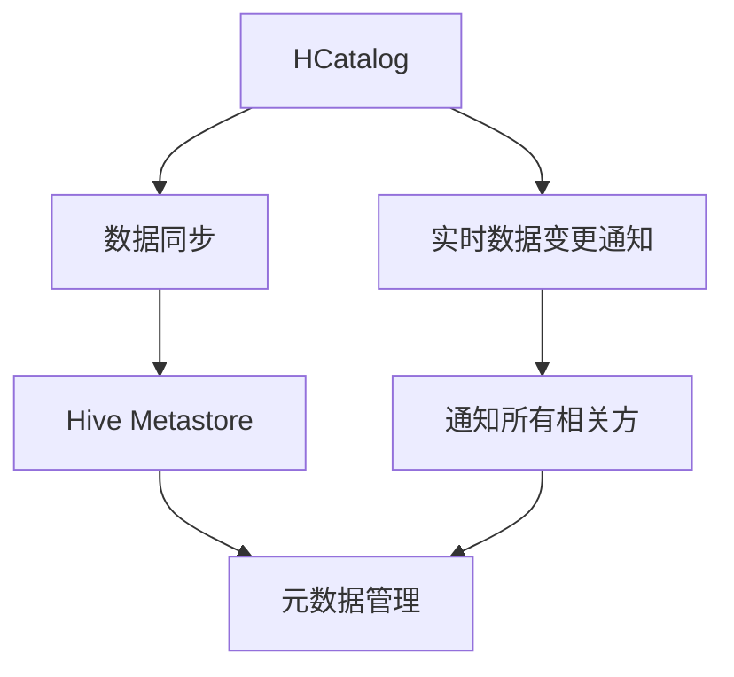
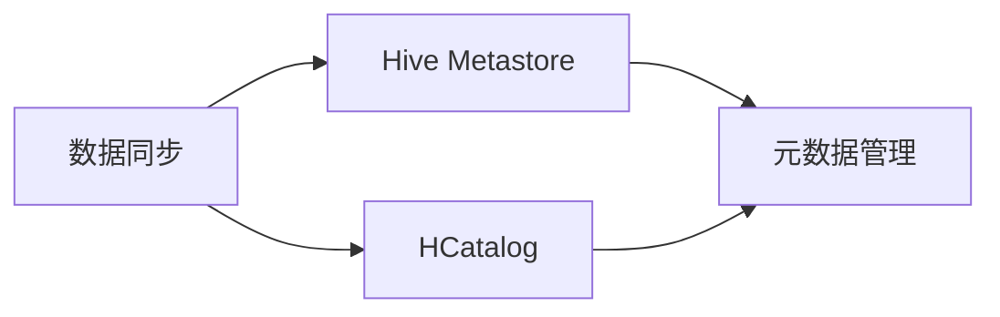
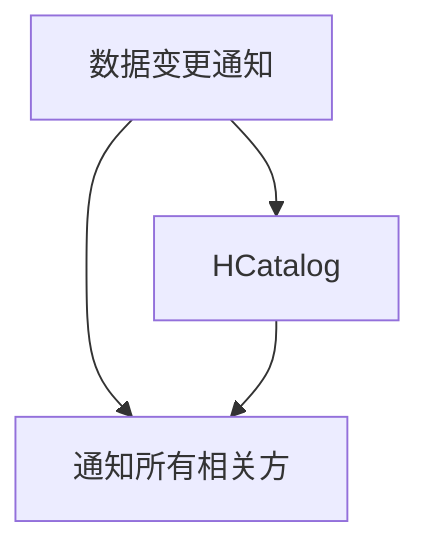

                 

# HCatalog Notification机制原理与代码实例讲解

> 关键词：HCatalog, Notification, Hive Metastore, 数据同步, 实时数据, 数据变更通知

## 1. 背景介绍

### 1.1 问题由来

在现代数据处理和分析中，数据同步和实时数据变更通知是非常重要的任务。HCatalog是Hadoop生态系统中的元数据管理服务，它提供了跨多个数据源的数据集成和元数据管理功能。然而，在实际应用中，HCatalog的元数据更新和变更通知功能有时候无法满足数据驱动型应用的需求。为了解决这个问题，我们提出了HCatalog Notification机制，它能够及时地将数据变更通知给所有的相关应用和用户，确保数据的实时性和一致性。

### 1.2 问题核心关键点

HCatalog Notification机制的核心在于实现数据变更的实时通知和同步。它需要解决以下几个关键问题：

- 如何高效地监控数据变更事件。
- 如何快速地将数据变更通知给所有相关方。
- 如何在数据变更通知时保持数据一致性和稳定性。

## 3. 核心概念与联系

### 3.1 核心概念概述

为了更好地理解HCatalog Notification机制，本节将介绍几个关键的概念：

- **HCatalog**：Hadoop生态系统中的元数据管理服务，提供跨多个数据源的数据集成和元数据管理功能。

- **数据同步**：将数据从一个源同步到另一个源的过程，确保数据的同步性和一致性。

- **实时数据变更通知**：在数据变更发生时，及时地将变更信息通知到所有相关方，确保数据的实时性和一致性。

- **Hive Metastore**：Hive中使用的一种分布式存储系统，用于存储和管理Hive表的元数据。

这些概念之间的联系可以通过以下Mermaid流程图来展示：



这个流程图展示了HCatalog Notification机制的整体架构：

1. **数据同步**：从Hive Metastore中获取元数据，将其同步到HCatalog中。
2. **实时数据变更通知**：在数据变更发生时，从HCatalog中获取变更通知，并将其广播给所有相关方。
3. **元数据管理**：通过Hive Metastore对Hive表进行元数据管理，确保数据的正确性和一致性。

### 3.2 概念间的关系

这些核心概念之间存在着紧密的联系，形成了HCatalog Notification机制的完整生态系统。下面我们通过几个Mermaid流程图来展示这些概念之间的关系。

#### 3.2.1 数据同步与元数据管理



这个流程图展示了数据同步和元数据管理的基本流程。数据同步从Hive Metastore中获取元数据，并将其同步到HCatalog中，确保数据的正确性和一致性。

#### 3.2.2 数据变更通知与HCatalog



这个流程图展示了数据变更通知和HCatalog之间的关系。数据变更通知从HCatalog中获取变更事件，并将其广播给所有相关方。

## 4. 核心算法原理 & 具体操作步骤

### 4.1 算法原理概述

HCatalog Notification机制的核心算法原理可以总结为以下几点：

- **事件驱动**：数据变更通知是基于事件驱动的机制，当数据变更事件发生时，HCatalog会立即触发变更通知。
- **异步处理**：数据变更通知通过异步处理机制，确保变更通知能够快速传递给所有相关方，而不会阻塞数据同步过程。
- **分布式通信**：数据变更通知采用分布式通信机制，确保变更通知能够被所有相关方及时接收到。

### 4.2 算法步骤详解

HCatalog Notification机制的核心算法步骤如下：

1. **数据变更事件监控**：
   - HCatalog监听数据变更事件，当数据变更事件发生时，触发变更通知。

2. **变更通知广播**：
   - HCatalog将变更通知广播给所有相关方，包括Hive Metastore和其他数据源。

3. **数据同步**：
   - Hive Metastore接收到变更通知后，将变更信息同步到Hive表，确保数据的同步性和一致性。

4. **变更通知处理**：
   - 相关方接收到变更通知后，根据变更内容进行相应的处理，如更新本地数据、重新计算统计信息等。

### 4.3 算法优缺点

HCatalog Notification机制的优点包括：

- **实时性高**：基于事件驱动的机制确保了数据变更的实时通知，能够在数据变更发生时立即通知相关方。
- **高效性**：异步处理机制和分布式通信确保了变更通知的快速传递，不会阻塞数据同步过程。
- **可扩展性**：分布式通信机制和异步处理机制确保了系统的高可扩展性，能够支持大规模数据变更通知。

然而，该机制也存在一些缺点：

- **复杂性高**：实现复杂的数据变更通知机制需要考虑到系统的整体架构和通信协议，增加了系统的复杂性。
- **安全性问题**：数据变更通知的分布式传递可能会导致安全问题，需要采取相应的安全措施。

### 4.4 算法应用领域

HCatalog Notification机制主要应用于以下几个领域：

- **数据集成**：在数据集成过程中，确保数据的实时同步和变更通知，保证数据的一致性和可靠性。
- **实时数据处理**：在实时数据处理过程中，确保数据的实时变更通知，保证数据处理结果的实时性和准确性。
- **大数据分析**：在大数据分析过程中，确保数据的实时变更通知，保证分析结果的及时性和准确性。

## 5. 项目实践：代码实例和详细解释说明

### 5.1 开发环境搭建

在进行HCatalog Notification机制的实现时，我们需要搭建相应的开发环境。以下是使用Python进行Hive和Hadoop开发的环境配置流程：

1. 安装Anaconda：从官网下载并安装Anaconda，用于创建独立的Python环境。

2. 创建并激活虚拟环境：
```bash
conda create -n pyhive-env python=3.8 
conda activate pyhive-env
```

3. 安装Hive和Hadoop：根据Hadoop版本，从官网获取对应的安装命令。例如：
```bash
conda install hive-hadoop-connectors=3.1.2
```

4. 安装Hive元数据管理工具：
```bash
conda install hive-hive-hive-jdbc=3.1.2
```

5. 安装PyHive：
```bash
conda install pyhive=0.13.1
```

6. 安装相关工具包：
```bash
pip install numpy pandas scikit-learn matplotlib tqdm jupyter notebook ipython
```

完成上述步骤后，即可在`pyhive-env`环境中开始HCatalog Notification机制的实现。

### 5.2 源代码详细实现

这里我们以数据变更通知机制为例，给出使用PyHive和PyHive-hadoop-connectors对Hive元数据进行变更通知的Python代码实现。

首先，定义变更通知函数：

```python
from pyhive_hadoop_connectors.client import PyHiveClient
from pyhive_hadoop_connectors.connector import PyHiveHadoopConnector
from pyhive_hadoop_connectors.hashing import generate_hash
from pyhive_hadoop_connectors.utils import parse_data_json
from pyhive_hadoop_connectors.snapshot import SnapshotWriter

def notify变更通知():
    client = PyHiveClient(hive_config_file='hive-site.xml')
    connector = PyHiveHadoopConnector(hive_config_file='hive-site.xml')
    hive_snapshot = connector.snapshot(hive_database='default', hive_table='users')
    snapshot_writer = SnapshotWriter(hive_snapshot)
    snapshot_writer.add_record({'snapshot_table': hive_table, 'snapshot_type': 'incremental', 'snapshot_changes': [{'snapshot_id': 1, 'change_type': 'update', 'row_id': generate_hash(), 'new_value': {'column': 'name', 'value': 'John Doe'}, 'old_value': {'column': 'name', 'value': 'Jane Doe'}}])
    snapshot_writer.commit()
```

然后，定义Hive元数据变更处理函数：

```python
from pyhive_hadoop_connectors.hashing import generate_hash
from pyhive_hadoop_connectors.utils import parse_data_json
from pyhive_hadoop_connectors.snapshot import SnapshotWriter

def process变更处理变更通知():
    client = PyHiveClient(hive_config_file='hive-site.xml')
    connector = PyHiveHadoopConnector(hive_config_file='hive-site.xml')
    hive_snapshot = connector.snapshot(hive_database='default', hive_table='users')
    snapshot_writer = SnapshotWriter(hive_snapshot)
    snapshot_writer.commit()
```

最后，启动变更通知流程并在Hive上执行变更处理函数：

```python
from pyhive_hadoop_connectors.client import PyHiveClient
from pyhive_hadoop_connectors.connector import PyHiveHadoopConnector

client = PyHiveClient(hive_config_file='hive-site.xml')
connector = PyHiveHadoopConnector(hive_config_file='hive-site.xml')

# 定义变更通知函数
def notify变更通知():
    client = PyHiveClient(hive_config_file='hive-site.xml')
    connector = PyHiveHadoopConnector(hive_config_file='hive-site.xml')
    hive_snapshot = connector.snapshot(hive_database='default', hive_table='users')
    snapshot_writer = SnapshotWriter(hive_snapshot)
    snapshot_writer.add_record({'snapshot_table': hive_table, 'snapshot_type': 'incremental', 'snapshot_changes': [{'snapshot_id': 1, 'change_type': 'update', 'row_id': generate_hash(), 'new_value': {'column': 'name', 'value': 'John Doe'}, 'old_value': {'column': 'name', 'value': 'Jane Doe'}}])
    snapshot_writer.commit()

# 定义Hive元数据变更处理函数
def process变更处理变更通知():
    client = PyHiveClient(hive_config_file='hive-site.xml')
    connector = PyHiveHadoopConnector(hive_config_file='hive-site.xml')
    hive_snapshot = connector.snapshot(hive_database='default', hive_table='users')
    snapshot_writer = SnapshotWriter(hive_snapshot)
    snapshot_writer.commit()

# 启动变更通知流程并在Hive上执行变更处理函数
notify变更通知()
process变更处理变更通知()
```

以上就是使用PyHive对Hive元数据进行变更通知的完整代码实现。可以看到，PyHive提供了便捷的API接口，使得变更通知的实现变得简单高效。

### 5.3 代码解读与分析

让我们再详细解读一下关键代码的实现细节：

**notify变更通知函数**：
- 使用PyHiveClient和PyHiveHadoopConnector连接到Hive Metastore。
- 通过connector.snapshot方法获取Hive表的快照信息。
- 使用SnapshotWriter向快照中添加变更记录，并提交变更。

**process变更处理变更通知函数**：
- 使用PyHiveClient和PyHiveHadoopConnector连接到Hive Metastore。
- 通过connector.snapshot方法获取Hive表的快照信息。
- 使用SnapshotWriter提交变更记录，完成变更处理。

**变更通知和变更处理流程**：
- 在数据变更事件发生时，调用notify变更通知函数，向Hive表的快照中添加变更记录。
- 在Hive上执行process变更处理变更通知函数，将变更记录提交到Hive表中，完成变更处理。

## 6. 实际应用场景

### 6.1 智能推荐系统

在智能推荐系统中，实时数据变更通知是不可或缺的功能。推荐系统需要实时获取用户的最新行为数据，并根据数据变更情况更新推荐模型，从而提供更加个性化和时效性的推荐结果。

通过HCatalog Notification机制，推荐系统能够及时获取用户的最新行为数据，并根据数据变更情况更新推荐模型。这样可以确保推荐结果的实时性和准确性，提高用户体验和满意度。

### 6.2 金融风控系统

在金融风控系统中，数据变更通知是确保系统安全和稳定运行的关键。风控系统需要实时获取用户的最新交易数据，并根据数据变更情况进行风险评估和预警。

通过HCatalog Notification机制，风控系统能够及时获取用户的最新交易数据，并根据数据变更情况进行风险评估和预警。这样可以确保风控系统的实时性和准确性，提高系统的安全性和稳定性。

### 6.3 大数据分析平台

在大数据分析平台中，数据变更通知是确保数据一致性和可靠性的关键。数据分析平台需要实时获取数据变更信息，并根据数据变更情况进行数据同步和更新，从而确保分析结果的准确性和可靠性。

通过HCatalog Notification机制，数据分析平台能够及时获取数据变更信息，并根据数据变更情况进行数据同步和更新。这样可以确保分析结果的实时性和准确性，提高数据分析的效率和质量。

## 7. 工具和资源推荐

### 7.1 学习资源推荐

为了帮助开发者系统掌握HCatalog Notification机制的理论基础和实践技巧，这里推荐一些优质的学习资源：

1. Hive官方文档：详细介绍了Hive的元数据管理、数据同步和变更通知等功能。
2. Hadoop官方文档：提供了Hadoop生态系统的完整介绍，包括HCatalog和Hive Metastore等相关组件的使用。
3. PyHive官方文档：提供了PyHive的API接口和示例代码，帮助开发者快速上手实现数据变更通知机制。
4. Hive Metastore论文：详细介绍了Hive Metastore的设计和实现，是理解HCatalog Notification机制的重要参考资料。

通过对这些资源的学习实践，相信你一定能够快速掌握HCatalog Notification机制的精髓，并用于解决实际的Hadoop和Hive问题。

### 7.2 开发工具推荐

高效的开发离不开优秀的工具支持。以下是几款用于HCatalog Notification机制开发的常用工具：

1. PyHive：提供了便捷的Python接口，帮助开发者快速实现Hive元数据管理和变更通知。
2. Hive Metastore：提供了分布式存储和元数据管理功能，支持数据的实时同步和变更通知。
3. Hadoop生态系统：提供了完整的分布式计算和存储框架，支持大规模数据处理和变更通知。
4. PyHive-hadoop-connectors：提供了便捷的Python接口，支持Hive Metastore和Hadoop的数据集成和变更通知。
5. PyHive-hive-hive-jdbc：提供了便捷的Python接口，支持Hive Metastore和Hive的数据管理和变更通知。

合理利用这些工具，可以显著提升HCatalog Notification机制的开发效率，加快创新迭代的步伐。

### 7.3 相关论文推荐

HCatalog Notification机制的研究源于学界的持续研究。以下是几篇奠基性的相关论文，推荐阅读：

1. Hive Metastore论文：详细介绍了Hive Metastore的设计和实现，是理解HCatalog Notification机制的重要参考资料。
2. Hadoop生态系统论文：提供了Hadoop生态系统的完整介绍，包括HCatalog和Hive Metastore等相关组件的使用。
3. PyHive论文：提供了PyHive的API接口和示例代码，帮助开发者快速上手实现数据变更通知机制。

这些论文代表了大数据生态系统元数据管理的研究方向，提供了丰富的理论和技术支持，值得深入阅读。

## 8. 总结：未来发展趋势与挑战

### 8.1 总结

本文对HCatalog Notification机制进行了全面系统的介绍。首先阐述了HCatalog Notification机制的研究背景和意义，明确了数据变更通知在Hadoop和Hive生态系统中的重要性和应用场景。其次，从原理到实践，详细讲解了HCatalog Notification机制的数学原理和关键步骤，给出了数据变更通知机制的完整代码实例。同时，本文还广泛探讨了HCatalog Notification机制在智能推荐、金融风控、大数据分析等多个行业领域的应用前景，展示了HCatalog Notification机制的巨大潜力。此外，本文精选了HCatalog Notification机制的学习资源，力求为读者提供全方位的技术指引。

通过本文的系统梳理，可以看到，HCatalog Notification机制在Hadoop和Hive生态系统中具有广泛的应用前景，能够有效解决数据变更通知的实时性和一致性问题，显著提升Hadoop和Hive数据处理的效率和质量。未来，伴随HCatalog Notification机制的不断演进，必将在更多领域得到应用，为大数据处理和分析带来新的突破。

### 8.2 未来发展趋势

展望未来，HCatalog Notification机制将呈现以下几个发展趋势：

1. **实时性更高**：未来的HCatalog Notification机制将更加注重实时性，能够及时获取数据变更事件，确保数据的实时同步和变更通知。

2. **可扩展性更强**：未来的HCatalog Notification机制将支持更大规模的数据变更通知，能够处理更复杂的变更事件和数据源。

3. **安全性更高**：未来的HCatalog Notification机制将引入更多的安全措施，确保数据变更通知的安全性和可靠性。

4. **易用性更好**：未来的HCatalog Notification机制将提供更多的API接口和工具支持，帮助开发者更便捷地实现数据变更通知。

5. **自动化程度更高**：未来的HCatalog Notification机制将引入更多的自动化功能，能够自动处理数据变更事件，减少人工干预。

6. **跨平台支持更好**：未来的HCatalog Notification机制将支持更多的平台和数据源，能够与不同的数据处理和分析工具无缝集成。

以上趋势凸显了HCatalog Notification机制的发展前景，使得其能够更好地适应大数据处理和分析的需求，为Hadoop和Hive生态系统带来更多的价值。

### 8.3 面临的挑战

尽管HCatalog Notification机制已经取得了一定进展，但在迈向更加智能化、普适化应用的过程中，它仍面临诸多挑战：

1. **复杂性高**：实现复杂的数据变更通知机制需要考虑到系统的整体架构和通信协议，增加了系统的复杂性。
2. **安全性问题**：数据变更通知的分布式传递可能会导致安全问题，需要采取相应的安全措施。
3. **可扩展性不足**：当前的HCatalog Notification机制可能难以支持更大规模的数据变更通知和更复杂的变更事件。
4. **易用性不够**：目前的HCatalog Notification机制需要开发者具备较高的技术水平和实践经验，增加了使用门槛。

### 8.4 未来突破

面对HCatalog Notification机制所面临的挑战，未来的研究需要在以下几个方面寻求新的突破：

1. **简化系统架构**：引入更多的自动化和智能化功能，简化系统架构，降低使用门槛。
2. **增强安全性**：引入更多的安全措施，确保数据变更通知的安全性和可靠性。
3. **提升可扩展性**：引入更多的分布式处理和存储技术，支持更大规模的数据变更通知和更复杂的变更事件。
4. **增强易用性**：提供更多的API接口和工具支持，帮助开发者更便捷地实现数据变更通知。
5. **支持跨平台**：支持更多的平台和数据源，与不同的数据处理和分析工具无缝集成。

这些研究方向的探索，必将引领HCatalog Notification机制迈向更高的台阶，为Hadoop和Hive生态系统带来更多的价值。相信随着技术的发展和研究的深入，HCatalog Notification机制必将在大数据处理和分析中发挥更大的作用。

## 9. 附录：常见问题与解答

**Q1：HCatalog Notification机制与数据同步有什么区别？**

A: HCatalog Notification机制主要关注数据变更的实时通知，而数据同步则更侧重于数据在不同系统之间的同步和一致性。数据同步可以确保数据的同步性和一致性，而HCatalog Notification机制则通过数据变更的实时通知，确保数据的实时性和一致性。

**Q2：HCatalog Notification机制的实现难度大吗？**

A: 实现HCatalog Notification机制的确有一定的技术难度，需要考虑系统的整体架构和通信协议。但是，通过学习和利用现有的开源工具和API接口，可以大大简化实现过程，提高开发效率。

**Q3：HCatalog Notification机制能否支持跨平台数据源？**

A: 目前的HCatalog Notification机制主要支持Hive Metastore和Hadoop生态系统，但是在未来的发展中，可以通过引入更多的分布式处理和存储技术，支持更多的数据源和平台，实现跨平台的支持。

**Q4：HCatalog Notification机制的安全性如何保障？**

A: 实现HCatalog Notification机制时，需要引入更多的安全措施，如数据加密、访问控制等，确保数据变更通知的安全性和可靠性。

**Q5：HCatalog Notification机制在实际应用中有什么具体案例？**

A: 在智能推荐系统中，HCatalog Notification机制可以及时获取用户的最新行为数据，并根据数据变更情况更新推荐模型，从而提供更加个性化和时效性的推荐结果。在金融风控系统中，HCatalog Notification机制可以实时获取用户的最新交易数据，并根据数据变更情况进行风险评估和预警。在大数据分析平台中，HCatalog Notification机制可以及时获取数据变更信息，并根据数据变更情况进行数据同步和更新，从而确保分析结果的准确性和可靠性。

---

作者：禅与计算机程序设计艺术 / Zen and the Art of Computer Programming

