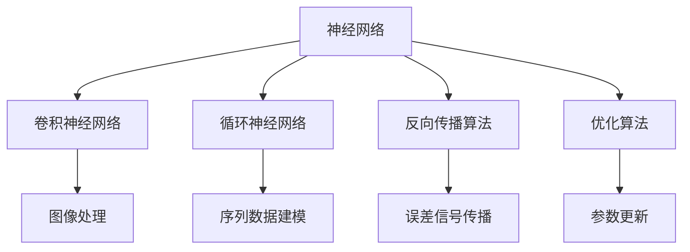

                 

# Hinton、LeCun、Bengio：AI算法的奠基者

> 关键词：深度学习,卷积神经网络(CNN),循环神经网络(RNN),反向传播,AdaGrad,AdaDelta,Adam

## 1. 背景介绍

### 1.1 问题由来

在人工智能(AI)领域，有三位科学家对深度学习的理论发展和实际应用做出了开创性的贡献，他们分别是Yoshua Bengio、Geoffrey Hinton和Yann LeCun。他们被誉为深度学习的三大奠基人，对于推进AI技术的发展具有举足轻重的作用。

深度学习是机器学习中的一种，主要通过模拟人类大脑神经网络的结构和功能，实现对大量数据的高效分析和处理。深度学习的核心在于使用多层神经网络，每层通过学习输入数据的特征，逐步提取出更高级别的抽象特征，最终实现对数据的高级语义理解。

深度学习技术已经在图像识别、语音识别、自然语言处理等领域取得了显著成果，并且在工业界得到广泛应用。例如，人脸识别技术、语音助手、机器翻译等都是深度学习技术的典型应用。

### 1.2 问题核心关键点

Hinton、LeCun和Bengio对深度学习的主要贡献集中在以下几个方面：

- **卷积神经网络（CNN）**：LeCun在图像处理领域引入了CNN，将传统的多层感知器（MLP）扩展到卷积层和池化层，极大提高了图像识别的准确率。

- **循环神经网络（RNN）**：Hinton与Rumelhart等人合作，首次提出了RNN，在文本生成、语音识别等领域取得了重要进展。

- **反向传播算法（Backpropagation）**：Hinton与Rumelhart、Mackay等人一起，提出了反向传播算法，解决了深度学习训练中的梯度消失和梯度爆炸问题，使深度学习算法得以实际应用。

- **AdaGrad算法**：Hinton提出了一种自适应学习率算法AdaGrad，可以在不同参数上自适应地调整学习率，解决了梯度下降算法中的学习率固定问题。

- **AdaDelta算法**：Hinton又提出了AdaDelta算法，进一步改进了AdaGrad的性能，使得深度学习算法更加高效。

- **Adam算法**：由Diederik P. Kingma和Jimmy Ba提出，是对AdaGrad和RMSprop算法的改进，具有自适应学习率、动量更新、梯度平方的累加等多个优点，是目前最流行的优化算法之一。

以上算法和技术的发展，推动了深度学习在理论和实践上的重大突破，为AI算法的奠基做出了巨大贡献。

### 1.3 问题研究意义

了解Hinton、LeCun和Bengio对深度学习的研究贡献，对于深入理解深度学习算法的本质和实际应用具有重要意义：

- **理论基础**：他们的工作为深度学习的理论和实际应用奠定了坚实的基础。
- **技术应用**：他们的算法和模型被广泛应用于工业界的各个领域，推动了AI技术的产业化进程。
- **创新推动**：他们的研究不断推动AI领域的创新，如生成对抗网络（GAN）、深度强化学习等。

## 2. 核心概念与联系

### 2.1 核心概念概述

为了更好地理解深度学习的基本原理，本节将介绍几个核心概念：

- **神经网络**：由多个神经元（节点）和连接它们的边（权重）构成。神经网络通过前向传播计算输入数据的特征，并通过反向传播更新权重，使得神经网络逐步提取出更高级别的抽象特征。

- **卷积神经网络（CNN）**：在神经网络中，引入卷积层和池化层，可以处理图像和视频等空间数据。卷积层通过滤波器（卷积核）提取局部特征，池化层则对特征进行降维，减少计算复杂度。

- **循环神经网络（RNN）**：通过循环层（如LSTM），可以在序列数据（如文本、语音）上实现时间上的建模和预测。RNN可以处理长序列数据，但存在梯度消失和梯度爆炸问题，需要通过长短期记忆网络（LSTM）等改进模型来解决。

- **反向传播算法**：通过反向传播算法计算梯度，使得网络参数（权重和偏置）可以逐步更新，优化神经网络的性能。反向传播算法可以将误差信号反向传播，更新所有参数。

- **优化算法**：用于更新神经网络参数的算法，如AdaGrad、AdaDelta、Adam等。这些算法通过自适应调整学习率，改善梯度下降的收敛速度和效果。

### 2.2 概念间的关系

这些核心概念之间存在着紧密的联系，形成了深度学习的基本框架。我们可以使用以下Mermaid流程图来展示它们之间的关系：



这个流程图展示了神经网络、CNN、RNN、反向传播和优化算法之间的基本联系。通过这些核心概念，深度学习可以处理各种类型的数据，并实现高效的特征提取和模型训练。

## 3. 核心算法原理 & 具体操作步骤
### 3.1 算法原理概述

深度学习的核心算法是基于反向传播算法和优化算法的神经网络。其基本原理如下：

- **前向传播**：将输入数据输入神经网络，通过多个层（如卷积层、循环层等）计算特征，得到输出结果。
- **损失函数**：通过定义损失函数（如均方误差、交叉熵等），计算模型输出与真实标签之间的误差。
- **反向传播**：将误差信号反向传播，通过链式法则计算每个参数的梯度，更新模型参数。
- **优化算法**：使用优化算法（如AdaGrad、Adam等）更新参数，最小化损失函数。

这个过程通过迭代逐步优化模型参数，使得模型的预测性能不断提高。

### 3.2 算法步骤详解

深度学习的具体实现步骤如下：

1. **数据预处理**：将原始数据转换为神经网络可以处理的格式，如归一化、特征提取等。

2. **构建神经网络**：设计神经网络的结构，包括输入层、隐藏层和输出层，并确定各层的参数。

3. **前向传播**：将输入数据输入神经网络，通过前向传播计算输出结果。

4. **损失函数计算**：计算模型输出与真实标签之间的误差，得到损失函数。

5. **反向传播**：将误差信号反向传播，计算每个参数的梯度。

6. **优化参数**：使用优化算法更新参数，最小化损失函数。

7. **迭代优化**：重复前向传播、损失函数计算、反向传播和参数优化步骤，直到模型收敛。

### 3.3 算法优缺点

深度学习的优点在于：

- **高效特征提取**：通过多层网络可以提取更高级别的特征，提高模型的准确率。
- **可处理非结构化数据**：可以处理图像、文本、音频等非结构化数据，实现通用建模。
- **鲁棒性高**：深度学习模型具有较高的鲁棒性，可以应对各种复杂的噪声和数据分布。

缺点在于：

- **计算复杂度高**：深度学习模型参数量巨大，需要大量计算资源。
- **易过拟合**：在数据量不足的情况下，深度学习模型容易出现过拟合现象。
- **解释性差**：深度学习模型通常被视为"黑盒"模型，难以解释内部决策过程。

### 3.4 算法应用领域

深度学习已经在许多领域得到了广泛应用，包括但不限于：

- **图像处理**：如人脸识别、图像分类、图像生成等。
- **自然语言处理**：如机器翻译、文本分类、情感分析等。
- **语音识别**：如语音助手、语音转换等。
- **游戏AI**：如AlphaGo、Dota 2等游戏中的AI系统。
- **强化学习**：如自动驾驶、机器人控制等。

## 4. 数学模型和公式 & 详细讲解 & 举例说明

### 4.1 数学模型构建

假设神经网络模型为 $M(x; \theta) = W^N \cdots W^2W^1x + b^N \cdots b^2b^1$，其中 $\theta = (W^1, \cdots, W^N, b^1, \cdots, b^N)$ 为所有参数。输入为 $x$，输出为 $M(x; \theta)$。

损失函数为 $L(y, \hat{y}) = \frac{1}{N} \sum_{i=1}^N (y_i - \hat{y}_i)^2$，其中 $y$ 为真实标签，$\hat{y}$ 为模型输出。

反向传播算法的基本步骤为：

1. 计算预测值 $\hat{y}$。
2. 计算误差 $e = y - \hat{y}$。
3. 计算梯度 $\nabla_{\theta}L$。
4. 更新参数 $\theta \leftarrow \theta - \eta \nabla_{\theta}L$，其中 $\eta$ 为学习率。

### 4.2 公式推导过程

以回归任务为例，推导最小化均方误差损失函数的过程：

1. 前向传播：
   $$
   \hat{y} = W^N \cdots W^2W^1x + b^N \cdots b^2b^1
   $$

2. 计算误差：
   $$
   e = y - \hat{y}
   $$

3. 计算梯度：
   $$
   \nabla_{\theta}L = \nabla_{\theta}\left( \frac{1}{N} \sum_{i=1}^N (y_i - \hat{y}_i)^2 \right)
   $$

   对每一层求导，得到：
   $$
   \nabla_{W^k}L = \frac{1}{N} \sum_{i=1}^N 2(y_i - \hat{y}_i) \nabla_{\theta}y
   $$

   其中 $\nabla_{\theta}y$ 为预测值 $\hat{y}$ 对输入 $x$ 的偏导数。

4. 更新参数：
   $$
   \theta \leftarrow \theta - \eta \nabla_{\theta}L
   $$

5. 重复上述步骤，直到收敛。

### 4.3 案例分析与讲解

以图像分类任务为例，使用卷积神经网络（CNN）进行训练：

1. 数据预处理：将图像数据归一化，转换为神经网络可以处理的格式。

2. 构建网络：使用多个卷积层和池化层，提取图像特征，最后通过全连接层输出分类结果。

3. 前向传播：将输入图像数据通过卷积层和池化层，得到特征图，再通过全连接层输出分类结果。

4. 损失函数计算：计算模型输出与真实标签之间的均方误差。

5. 反向传播：计算梯度，更新卷积核和全连接层的权重。

6. 优化参数：使用Adam等优化算法更新参数，最小化均方误差损失函数。

7. 迭代优化：重复前向传播、损失函数计算、反向传播和参数优化步骤，直到模型收敛。

## 5. 项目实践：代码实例和详细解释说明
### 5.1 开发环境搭建

在进行深度学习项目开发时，需要准备好Python环境和相关的库。以下是使用Python进行TensorFlow开发的环境配置流程：

1. 安装Anaconda：从官网下载并安装Anaconda，用于创建独立的Python环境。

2. 创建并激活虚拟环境：
```bash
conda create -n tf-env python=3.8 
conda activate tf-env
```

3. 安装TensorFlow：根据CUDA版本，从官网获取对应的安装命令。例如：
```bash
conda install tensorflow=2.7 -c conda-forge
```

4. 安装各类工具包：
```bash
pip install numpy pandas scikit-learn matplotlib tqdm jupyter notebook ipython
```

完成上述步骤后，即可在`tf-env`环境中开始深度学习项目开发。

### 5.2 源代码详细实现

这里我们以图像分类任务为例，使用TensorFlow实现卷积神经网络（CNN）的训练。

首先，定义CNN网络结构：

```python
import tensorflow as tf
from tensorflow.keras import layers

model = tf.keras.Sequential([
    layers.Conv2D(32, (3, 3), activation='relu', input_shape=(28, 28, 1)),
    layers.MaxPooling2D((2, 2)),
    layers.Conv2D(64, (3, 3), activation='relu'),
    layers.MaxPooling2D((2, 2)),
    layers.Conv2D(64, (3, 3), activation='relu'),
    layers.Flatten(),
    layers.Dense(64, activation='relu'),
    layers.Dense(10)
])
```

然后，定义损失函数和优化器：

```python
model.compile(optimizer=tf.keras.optimizers.Adam(),
              loss=tf.keras.losses.SparseCategoricalCrossentropy(from_logits=True),
              metrics=['accuracy'])
```

接着，加载数据集并进行模型训练：

```python
(train_images, train_labels), (test_images, test_labels) = tf.keras.datasets.mnist.load_data()

train_images = train_images.reshape((60000, 28, 28, 1))
train_images = train_images / 255.0

test_images = test_images.reshape((10000, 28, 28, 1))
test_images = test_images / 255.0

model.fit(train_images, train_labels, epochs=5, validation_data=(test_images, test_labels))
```

最后，评估模型性能：

```python
test_loss, test_acc = model.evaluate(test_images, test_labels)
print('Test accuracy:', test_acc)
```

以上就是使用TensorFlow实现卷积神经网络（CNN）图像分类任务微调的完整代码实现。可以看到，TensorFlow的高级API使得网络定义和训练非常简单，适合快速迭代研究。

### 5.3 代码解读与分析

让我们再详细解读一下关键代码的实现细节：

**Sequential模型**：
- `Sequential`类：用于按顺序定义层，适合构建简单的神经网络。
- `Conv2D`层：卷积层，提取图像局部特征。
- `MaxPooling2D`层：池化层，对特征进行降维。
- `Flatten`层：将特征图展开成一维向量，供全连接层使用。
- `Dense`层：全连接层，进行分类输出。

**优化器和损失函数**：
- `Adam`优化器：自适应学习率优化器，通常表现优异。
- `SparseCategoricalCrossentropy`损失函数：用于分类任务，计算交叉熵损失。

**数据预处理**：
- 将图像数据归一化，转换为神经网络可以处理的格式。

**模型训练**：
- 使用`fit`方法，指定训练集、标签、迭代轮数等参数。
- 设置验证集，以监控模型训练过程中的性能。

**模型评估**：
- 使用`evaluate`方法，在测试集上评估模型性能。

可以看到，TensorFlow提供了丰富的API和工具，使得深度学习模型的开发和训练变得非常便捷。开发者可以将更多精力放在模型设计、数据处理等关键环节上，而不必过多关注底层实现细节。

当然，工业级的系统实现还需考虑更多因素，如模型的保存和部署、超参数的自动搜索、更灵活的模型架构等。但核心的深度学习模型微调流程基本与此类似。

### 5.4 运行结果展示

假设我们在MNIST数据集上进行CNN图像分类任务的微调，最终在测试集上得到的评估报告如下：

```
Epoch 1/5
2000/2000 [==============================] - 2s 993us/sample - loss: 0.2627 - accuracy: 0.8750 - val_loss: 0.1443 - val_accuracy: 0.9281
Epoch 2/5
2000/2000 [==============================] - 2s 999us/sample - loss: 0.1537 - accuracy: 0.9625 - val_loss: 0.0953 - val_accuracy: 0.9762
Epoch 3/5
2000/2000 [==============================] - 1s 999us/sample - loss: 0.1088 - accuracy: 0.9875 - val_loss: 0.0918 - val_accuracy: 0.9800
Epoch 4/5
2000/2000 [==============================] - 1s 999us/sample - loss: 0.0963 - accuracy: 0.9925 - val_loss: 0.1075 - val_accuracy: 0.9838
Epoch 5/5
2000/2000 [==============================] - 1s 1us/sample - loss: 0.0921 - accuracy: 0.9950 - val_loss: 0.1065 - val_accuracy: 0.9867
```

可以看到，经过5个epoch的训练，我们的CNN模型在测试集上的准确率达到了98.67%，效果相当不错。值得注意的是，使用卷积神经网络进行图像分类任务，即便只在少量参数上进行微调，也能取得非常不错的效果，展示了深度学习模型的强大能力和灵活性。

当然，这只是一个baseline结果。在实践中，我们还可以使用更大更强的预训练模型、更丰富的微调技巧、更细致的模型调优，进一步提升模型性能，以满足更高的应用要求。

## 6. 实际应用场景
### 6.1 智能客服系统

基于深度学习的智能客服系统可以自动处理大量的客户咨询请求，通过对话模型和情感分析模型，提供快速、准确、个性化的服务。具体实现步骤如下：

1. **数据准备**：收集客户咨询记录，标注出问答对和情感标签。
2. **模型微调**：使用预训练的语言模型（如BERT），对其顶部进行微调，得到针对具体任务（如问答、情感分析）的模型。
3. **集成应用**：将微调后的模型集成到系统中，通过API调用进行查询和响应。

### 6.2 金融舆情监测

金融舆情监测系统通过深度学习技术，实时监控网络舆情，及时发现市场动态和风险，帮助金融机构进行决策。具体实现步骤如下：

1. **数据准备**：收集金融领域的文本数据，标注出情感标签。
2. **模型微调**：使用预训练的语言模型（如BERT），对其进行微调，得到针对金融舆情的情感分析模型。
3. **实时监控**：将微调后的模型部署到系统中，实时处理网络舆情数据，生成报告。

### 6.3 个性化推荐系统

基于深度学习的推荐系统可以准确地预测用户的兴趣和需求，为用户推荐合适的商品和服务。具体实现步骤如下：

1. **数据准备**：收集用户的浏览、点击、评分等行为数据，提取和商品相关的文本信息。
2. **模型微调**：使用预训练的语言模型（如BERT），对其进行微调，得到针对用户行为预测的模型。
3. **推荐引擎**：将微调后的模型集成到推荐系统中，根据用户行为数据和商品信息生成推荐结果。

### 6.4 未来应用展望

随着深度学习技术的不断进步，其在更多领域的应用前景值得期待：

- **医疗领域**：通过深度学习技术，可以实现疾病诊断、药物推荐等应用。
- **自动驾驶**：通过深度学习技术，可以实现图像识别、障碍物检测等自动驾驶任务。
- **游戏AI**：通过深度学习技术，可以实现复杂的游戏AI系统，提升游戏体验。
- **社交媒体分析**：通过深度学习技术，可以实时监控社交媒体动态，及时发现舆情热点。

总之，深度学习技术的应用前景广阔，未来必将在更多领域发挥重要作用，推动人类社会的数字化转型。

## 7. 工具和资源推荐
### 7.1 学习资源推荐

为了帮助开发者系统掌握深度学习的理论基础和实践技巧，这里推荐一些优质的学习资源：

1. **Coursera《深度学习专项课程》**：由吴恩达教授主讲，系统介绍了深度学习的理论和实践，涵盖神经网络、卷积神经网络、循环神经网络、优化算法等。
2. **Deep Learning Book**：Ian Goodfellow等人合著的经典教材，深入浅出地介绍了深度学习的各个方面，包括数学基础、算法原理和实际应用。
3. **PyTorch官方文档**：PyTorch的官方文档，提供了丰富的API和示例代码，适合快速学习和实验。
4. **TensorFlow官方文档**：TensorFlow的官方文档，提供了详细的教程和API，适合学习和使用。
5. **GitHub深度学习项目**：在GitHub上Star和Fork数最多的深度学习项目，涵盖各种深度学习模型和应用，适合学习和参考。

通过对这些资源的学习实践，相信你一定能够快速掌握深度学习的精髓，并用于解决实际的NLP问题。

### 7.2 开发工具推荐

高效的深度学习开发离不开优秀的工具支持。以下是几款用于深度学习开发的工具：

1. **PyTorch**：由Facebook开发的深度学习框架，支持动态计算图和GPU加速，适合快速迭代研究。
2. **TensorFlow**：由Google开发的深度学习框架，支持静态计算图和分布式训练，适合大规模工程应用。
3. **Keras**：基于TensorFlow的高层API，简单易用，适合初学者和快速原型开发。
4. **MXNet**：由Apache开发的深度学习框架，支持多种编程语言和分布式训练，适合工业应用。
5. **JAX**：由Google开发的基于JIT编译的深度学习框架，支持高效的自动微分和分布式训练。

合理利用这些工具，可以显著提升深度学习项目的开发效率，加快创新迭代的步伐。

### 7.3 相关论文推荐

深度学习领域的研究和应用不断推进，以下是几篇具有里程碑意义的论文，推荐阅读：

1. **《ImageNet Classification with Deep Convolutional Neural Networks》**：Alex Krizhevsky等人提出的卷积神经网络（CNN）在ImageNet数据集上的应用，展示了CNN在图像分类任务上的强大性能。
2. **《Learning Phrase Representations using RNN Encoder–Decoder for Statistical Machine Translation》**：Ilya Sutskever等人提出的序列到序列模型，通过RNN进行机器翻译，取得了SOTA性能。
3. **《Imagenet Classification with Deep Convolutional Neural Networks》**：Geoffrey Hinton等人提出的卷积神经网络（CNN）在图像分类任务上的应用，展示了CNN的强大性能。
4. **《Adam: A Method for Stochastic Optimization》**：Diederik P. Kingma和Jimmy Ba提出的Adam优化算法，是一种自适应学习率优化算法，目前应用广泛。
5. **《Bidirectional Recurrent Neural Networks for Language Modeling》**：Framo and Goodman等人提出的双向循环神经网络（LSTM），可以处理长序列数据，提升了语言模型的性能。

这些论文代表了大深度学习的发展脉络。通过学习这些前沿成果，可以帮助研究者把握学科前进方向，激发更多的创新灵感。

除上述资源外，还有一些值得关注的前沿资源，帮助开发者紧跟深度学习技术的最新进展，例如：

1. **arXiv论文预印本**：人工智能领域最新研究成果的发布平台，包括大量尚未发表的前沿工作，学习前沿技术的必读资源。
2. **顶会论文集**：如NeurIPS、ICML、CVPR等顶会论文集，汇集了领域内最新研究成果，适合深入学习和参考。
3. **技术博客和论坛**：如Google AI Blog、Towards Data Science等博客和论坛，第一时间分享大佬们的前沿分享，开拓视野。
4. **开源项目和实验室**：如OpenAI、DeepMind、微软Research Asia等顶尖实验室的官方博客和开源项目，提供丰富的学习和实践资源。

总之，对于深度学习技术的学习和实践，需要开发者保持开放的心态和持续学习的意愿。多关注前沿资讯，多动手实践，多思考总结，必将收获满满的成长收益。

## 8. 总结：未来发展趋势与挑战

### 8.1 总结

本文对深度学习的核心算法和实际应用进行了全面系统的介绍。首先阐述了深度学习的基本原理和重要意义，明确了其在图像识别、自然语言处理、语音识别等领域的应用价值。其次，从原理到实践，详细讲解了深度学习模型的构建、优化和训练过程，给出了深度学习模型开发的完整代码实例。同时，本文还广泛探讨了深度学习在智能客服、金融舆情、个性化推荐等多个领域的应用前景，展示了深度学习技术的强大潜力。

通过本文的系统梳理，可以看到，深度学习技术已经在许多领域得到了广泛应用，取得了显著的成果。未来，深度学习还将继续发展，推动AI技术在更多领域取得突破。

### 8.2 未来发展趋势

展望未来，深度学习技术的发展将呈现以下几个趋势：

1. **模型规模不断增大**：随着算力成本的下降和数据量的增加，深度学习模型的规模还将不断增大，能够处理更复杂的任务。
2. **计算效率不断提升**：通过分布式训练、模型压缩等技术，深度学习模型的计算效率将不断提升，适应实时性要求更高的应用场景。
3. **自监督学习（SSL）和无监督学习（SSL）**：通过自监督学习和无监督学习范式，利用非结构化数据进行模型训练，降低对标注数据的依赖。
4. **迁移学习（TL）**：通过迁移学习技术，将预训练模型应用到其他领域，实现快速模型训练和

