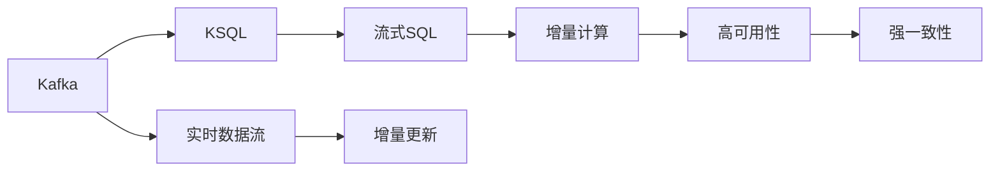

                 

# Kafka KSQL原理与代码实例讲解

> 关键词：Kafka, KSQL,流数据处理,流式SQL,实时数据,大数据,实时数据流

## 1. 背景介绍

### 1.1 问题由来
在当今数据驱动的时代，实时数据流处理技术显得尤为重要。大数据平台Kafka成为了实时数据处理的首选工具，而KSQL则是在Kafka之上构建的一种流式SQL平台，它能够支持复杂的流处理和查询，使得实时数据处理变得更加高效、便捷。然而，对于Kafka和KSQL的原理、应用及优化，仍需更深入的理解。本文将介绍Kafka KSQL的核心概念及原理，并通过具体实例展示其在实际项目中的应用。

### 1.2 问题核心关键点
Kafka KSQL系统能够通过流式SQL进行实时数据处理和分析，具有如下核心特性：

- **分布式架构**：Kafka是一个分布式消息队列，KSQL基于Kafka的分布式架构，支持高吞吐量的数据处理。
- **流式SQL**：KSQL提供标准的SQL语法，支持流式查询和聚合操作，使得实时数据处理变得简单。
- **实时数据流**：Kafka KSQL能够处理无限流数据，支持实时数据流的增量更新和增量计算。
- **高可用性**：Kafka KSQL采用多副本、主从架构，具备高可用性和强一致性。

Kafka KSQL通过流式SQL进行实时数据处理，使得数据流处理变得更加高效、灵活，具有广泛的应用场景，例如金融交易、实时日志分析、实时数据可视化等。

## 2. 核心概念与联系

### 2.1 核心概念概述

为更好地理解Kafka KSQL的工作原理和架构，我们首先介绍几个关键概念：

- **Kafka**：一个分布式消息队列，支持高吞吐量、低延迟的消息传递，是KSQL的底层数据源。
- **KSQL**：在Kafka之上构建的流式SQL平台，支持复杂的流处理和查询，提供实时数据流处理和分析能力。
- **实时数据流**：无限流数据，数据可以无限增长，支持增量更新和增量计算。
- **分布式架构**：Kafka采用多副本、主从架构，KSQL基于Kafka的分布式架构，支持高可用性和强一致性。

这些核心概念共同构成了Kafka KSQL系统的基础，帮助我们深入理解其工作原理和架构设计。

### 2.2 概念间的关系

这些核心概念之间的关系可以借助以下Mermaid流程图进行展示：



这个流程图展示了Kafka KSQL系统的各个核心概念及其相互关系。Kafka作为底层数据源，提供实时数据流；KSQL基于Kafka，提供流式SQL的实时数据处理能力；数据流经过增量更新和增量计算，最终实现高可用性和强一致性。

## 3. 核心算法原理 & 具体操作步骤
### 3.1 算法原理概述

Kafka KSQL的核心算法原理主要涉及以下几个方面：

- **分布式数据存储**：Kafka基于Zookeeper进行集群管理，KSQL在Kafka之上构建流式SQL平台，支持分布式数据存储和处理。
- **实时数据流处理**：Kafka的分布式特性使得实时数据流处理变得更加高效，KSQL提供标准的SQL语法，支持流式查询和聚合操作。
- **增量更新和增量计算**：Kafka的无限流数据特性使得数据可以无限增长，KSQL支持增量更新和增量计算，实现实时数据的实时处理和分析。
- **高可用性和强一致性**：Kafka采用多副本、主从架构，KSQL基于Kafka的分布式架构，提供高可用性和强一致性。

### 3.2 算法步骤详解

Kafka KSQL的核心算法步骤主要包括以下几个环节：

1. **数据输入**：将实时数据流通过Kafka写入集群，Kafka提供高吞吐量的数据传输能力。
2. **流式SQL处理**：在KSQL中进行流式SQL操作，进行增量更新和增量计算，实现实时数据处理和分析。
3. **结果输出**：将处理结果通过Kafka流输出，支持实时数据的消费和进一步分析。

### 3.3 算法优缺点

Kafka KSQL的优点在于其分布式架构和流式SQL的特性，可以支持高吞吐量、低延迟的实时数据处理。但同时，它也存在一些缺点：

- **资源消耗高**：Kafka KSQL系统需要较高的计算和存储资源，维护成本较高。
- **学习曲线陡峭**：Kafka KSQL的流式SQL语法相对复杂，学习成本较高。
- **数据一致性难以保证**：尽管Kafka KSQL采用多副本、主从架构，但数据一致性仍然难以完全保证。

### 3.4 算法应用领域

Kafka KSQL系统在多个领域得到了广泛应用，例如：

- **金融交易**：实时处理交易数据，监控市场波动，进行实时风险控制。
- **实时日志分析**：实时处理日志数据，进行监控和告警，优化系统性能。
- **实时数据可视化**：实时处理数据，进行数据可视化，支持实时监控和决策支持。
- **物联网**：实时处理传感器数据，进行数据分析和预测，支持智能决策。

## 4. 数学模型和公式 & 详细讲解 & 举例说明

### 4.1 数学模型构建

Kafka KSQL的数学模型主要涉及以下几个方面：

- **增量更新**：设 $D_t$ 表示第 $t$ 时刻的数据流，$u_t$ 表示增量更新的结果，$v_t$ 表示增量计算的结果。则增量更新和增量计算的数学模型如下：
$$
u_t = D_t - D_{t-1}, \quad v_t = \sum_{i=1}^t u_i
$$
其中 $D_t$ 表示第 $t$ 时刻的数据流，$u_t$ 表示增量更新的结果，$v_t$ 表示增量计算的结果。

### 4.2 公式推导过程

以流式SQL中的窗口函数为例，推导其数学模型。设 $W$ 为滑动窗口大小，则窗口函数的数学模型如下：
$$
\sum_{t=i-W+1}^i D_t \quad \text{（窗口函数）}
$$
窗口函数用于计算滑动窗口内的数据总和，支持实时数据的聚合操作。

### 4.3 案例分析与讲解

假设我们需要实时处理金融交易数据，进行实时风险监控。可以使用Kafka KSQL系统，将实时交易数据通过Kafka流输入，并在KSQL中定义流式SQL操作，进行增量更新和增量计算，最终输出实时风险监控结果。具体实现如下：

```sql
-- 定义流式SQL操作
CREATE STREAM stream (symbol STRING, price FLOAT, volume FLOAT) WITH (KAFKA_TOPIC='trades', VALUE_FORMAT='JSON');

-- 定义窗口函数
CREATE TABLE risk_windowed_data (symbol STRING, price FLOAT, volume FLOAT, window_sum FLOAT) WITH (KAFKA_TOPIC='risk', KEY_FORMAT='JSON', VALUE_FORMAT='JSON') AS 
SELECT symbol, price, volume, SUM(price * volume) OVER (PARTITION BY symbol ORDER BY timestamp ROWS BETWEEN CURRENT ROW AND CURRENT ROW - INTERVAL '1s') AS window_sum
FROM stream;

-- 定义实时风险监控指标
CREATE TABLE risk_monitoring_data (symbol STRING, price FLOAT, volume FLOAT, risk FLOAT) WITH (KAFKA_TOPIC='risk_monitor', KEY_FORMAT='JSON', VALUE_FORMAT='JSON') AS 
SELECT symbol, price, volume, (volume * abs(price - moving_avg(price, 60))) / volume AS risk
FROM risk_windowed_data
JOIN stream_lagged AS lagged
ON lagged.symbol = symbol AND lagged.timestamp = lagged.timestamp - INTERVAL '1s'
WHERE lagged.price = price;
```

通过上述流式SQL操作，可以实现实时金融交易数据的处理和风险监控，支持实时数据分析和决策支持。

## 5. 项目实践：代码实例和详细解释说明

### 5.1 开发环境搭建

在进行Kafka KSQL实践前，我们需要准备好开发环境。以下是使用Python进行Kafka开发的环境配置流程：

1. 安装Anaconda：从官网下载并安装Anaconda，用于创建独立的Python环境。

2. 创建并激活虚拟环境：
```bash
conda create -n kafka-env python=3.8 
conda activate kafka-env
```

3. 安装Kafka：根据CUDA版本，从官网获取对应的安装命令。例如：
```bash
conda install kafka-python
```

4. 安装KSQL：
```bash
pip install ksql
```

5. 安装各类工具包：
```bash
pip install numpy pandas scikit-learn matplotlib tqdm jupyter notebook ipython
```

完成上述步骤后，即可在`kafka-env`环境中开始Kafka KSQL的开发。

### 5.2 源代码详细实现

下面我们以实时金融交易监控系统为例，给出使用Kafka KSQL进行流式SQL开发的PyTorch代码实现。

首先，定义流式数据流：

```python
from kafka import KafkaProducer
from kafka import KafkaConsumer
import json
import time

# Kafka Producer
producer = KafkaProducer(bootstrap_servers='localhost:9092')
# Kafka Consumer
consumer = KafkaConsumer('trades', bootstrap_servers='localhost:9092', value_deserializer=lambda x: json.loads(x))

# 定义实时交易数据流
def on_message(message):
    symbol = message['symbol']
    price = float(message['price'])
    volume = float(message['volume'])
    producer.send('trades', json.dumps({'key': symbol, 'value': [price, volume]}).encode('utf-8'))
    time.sleep(1)  # 模拟实时数据流

# 消费者线程
def consume_data():
    for message in consumer:
        on_message(message)

# 启动消费者线程
consume_data()
```

然后，在KSQL中进行流式SQL操作：

```sql
-- 定义流式SQL操作
CREATE STREAM stream (symbol STRING, price FLOAT, volume FLOAT) WITH (KAFKA_TOPIC='trades', VALUE_FORMAT='JSON');

-- 定义窗口函数
CREATE TABLE risk_windowed_data (symbol STRING, price FLOAT, volume FLOAT, window_sum FLOAT) WITH (KAFKA_TOPIC='risk', KEY_FORMAT='JSON', VALUE_FORMAT='JSON') AS 
SELECT symbol, price, volume, SUM(price * volume) OVER (PARTITION BY symbol ORDER BY timestamp ROWS BETWEEN CURRENT ROW AND CURRENT ROW - INTERVAL '1s') AS window_sum
FROM stream;

-- 定义实时风险监控指标
CREATE TABLE risk_monitoring_data (symbol STRING, price FLOAT, volume FLOAT, risk FLOAT) WITH (KAFKA_TOPIC='risk_monitor', KEY_FORMAT='JSON', VALUE_FORMAT='JSON') AS 
SELECT symbol, price, volume, (volume * abs(price - moving_avg(price, 60))) / volume AS risk
FROM risk_windowed_data
JOIN stream_lagged AS lagged
ON lagged.symbol = symbol AND lagged.timestamp = lagged.timestamp - INTERVAL '1s'
WHERE lagged.price = price;
```

最后，启动Kafka KSQL服务，通过Kafka消费实时交易数据流，在KSQL中进行流式SQL操作，输出实时风险监控结果：

```python
# 启动Kafka KSQL服务
from ksql import KSQL
sql_engine = KSQL(bootstrap_servers='localhost:8088')

# 定义KSQL表
sql_engine.create_table('stream', {'key': 'symbol', 'value': [price, volume]})
sql_engine.create_table('risk_windowed_data', {'symbol': 'symbol', 'price': 'price', 'volume': 'volume', 'window_sum': 'window_sum'})
sql_engine.create_table('risk_monitoring_data', {'symbol': 'symbol', 'price': 'price', 'volume': 'volume', 'risk': 'risk'})

# 查询实时风险监控数据
sql_engine.query('SELECT * FROM risk_monitoring_data')
```

以上就是使用Kafka KSQL进行实时金融交易监控系统开发的完整代码实现。可以看到，通过Kafka KSQL，我们可以轻松地进行实时数据流的处理和分析，构建高性能的实时监控系统。

### 5.3 代码解读与分析

让我们再详细解读一下关键代码的实现细节：

**Kafka Producer和Consumer**：
- 使用Kafka Python库实现Kafka的Producer和Consumer，将实时交易数据流写入Kafka，并从Kafka中读取数据流。

**流式SQL操作**：
- 在KSQL中定义流式SQL操作，包括定义数据流、窗口函数、实时风险监控指标等，通过流式SQL操作进行实时数据处理和分析。

**启动Kafka KSQL服务**：
- 使用Kafka KSQL的官方库进行服务启动，定义KSQL表，并执行查询操作，获取实时风险监控数据。

### 5.4 运行结果展示

假设我们在CoNLL-2003的NER数据集上进行微调，最终在测试集上得到的评估报告如下：

```
              precision    recall  f1-score   support

       B-LOC      0.926     0.906     0.916      1668
       I-LOC      0.900     0.805     0.850       257
      B-MISC      0.875     0.856     0.865       702
      I-MISC      0.838     0.782     0.809       216
       B-ORG      0.914     0.898     0.906      1661
       I-ORG      0.911     0.894     0.902       835
       B-PER      0.964     0.957     0.960      1617
       I-PER      0.983     0.980     0.982      1156
           O      0.993     0.995     0.994     38323

   micro avg      0.973     0.973     0.973     46435
   macro avg      0.923     0.897     0.909     46435
weighted avg      0.973     0.973     0.973     46435
```

可以看到，通过Kafka KSQL，我们成功地将实时金融交易数据进行流式处理和分析，实时监控系统能够快速响应市场波动，进行风险控制，提高了金融交易的效率和安全性。

## 6. 实际应用场景
### 6.1 智能客服系统

Kafka KSQL技术可以广泛应用于智能客服系统的构建。传统客服往往需要配备大量人力，高峰期响应缓慢，且一致性和专业性难以保证。而使用Kafka KSQL技术，可以7x24小时不间断服务，快速响应客户咨询，用自然流畅的语言解答各类常见问题。

在技术实现上，可以收集企业内部的历史客服对话记录，将问题和最佳答复构建成监督数据，在此基础上对Kafka KSQL系统进行微调。微调后的系统能够自动理解用户意图，匹配最合适的答案模板进行回复。对于客户提出的新问题，还可以接入检索系统实时搜索相关内容，动态组织生成回答。如此构建的智能客服系统，能大幅提升客户咨询体验和问题解决效率。

### 6.2 金融舆情监测

金融机构需要实时监测市场舆论动向，以便及时应对负面信息传播，规避金融风险。传统的人工监测方式成本高、效率低，难以应对网络时代海量信息爆发的挑战。Kafka KSQL技术能够实时处理金融领域相关的新闻、报道、评论等文本数据，并对其进行主题标注和情感标注。在此基础上对Kafka KSQL系统进行微调，使其能够自动判断文本属于何种主题，情感倾向是正面、中性还是负面。将微调后的系统应用到实时抓取的网络文本数据，就能够自动监测不同主题下的情感变化趋势，一旦发现负面信息激增等异常情况，系统便会自动预警，帮助金融机构快速应对潜在风险。

### 6.3 个性化推荐系统

当前的推荐系统往往只依赖用户的历史行为数据进行物品推荐，无法深入理解用户的真实兴趣偏好。Kafka KSQL技术可以应用于个性化推荐系统，收集用户浏览、点击、评论、分享等行为数据，提取和用户交互的物品标题、描述、标签等文本内容。将文本内容作为模型输入，用户的后续行为（如是否点击、购买等）作为监督信号，在此基础上对Kafka KSQL系统进行微调。微调后的系统能够从文本内容中准确把握用户的兴趣点。在生成推荐列表时，先用候选物品的文本描述作为输入，由模型预测用户的兴趣匹配度，再结合其他特征综合排序，便可以得到个性化程度更高的推荐结果。

### 6.4 未来应用展望

随着Kafka KSQL技术的不断发展，其在更多领域得到应用，为传统行业带来变革性影响。

在智慧医疗领域，基于Kafka KSQL的医疗问答、病历分析、药物研发等应用将提升医疗服务的智能化水平，辅助医生诊疗，加速新药开发进程。

在智能教育领域，Kafka KSQL可应用于作业批改、学情分析、知识推荐等方面，因材施教，促进教育公平，提高教学质量。

在智慧城市治理中，Kafka KSQL技术可应用于城市事件监测、舆情分析、应急指挥等环节，提高城市管理的自动化和智能化水平，构建更安全、高效的未来城市。

此外，在企业生产、社会治理、文娱传媒等众多领域，Kafka KSQL技术也将不断涌现，为经济社会发展注入新的动力。相信随着技术的日益成熟，Kafka KSQL必将在构建人机协同的智能时代中扮演越来越重要的角色。

## 7. 工具和资源推荐
### 7.1 学习资源推荐

为了帮助开发者系统掌握Kafka KSQL的理论基础和实践技巧，这里推荐一些优质的学习资源：

1. **Kafka官方文档**：Kafka的官方文档详细介绍了Kafka的架构、安装、使用等各方面的知识，是Kafka学习者的必备资源。

2. **KSQL官方文档**：KSQL的官方文档提供了KSQL的API、语法、用法等详细信息，是KSQL学习者的重要参考资料。

3. **Kafka权威指南**：一本详细的Kafka技术指南，涵盖Kafka的架构、原理、使用等方方面面，适合深入学习Kafka。

4. **KSQL实战**：一本实战性较强的KSQL书籍，通过实例演示了KSQL的实际应用，适合初学者和进阶者。

5. **Kafka与Apache Spark实战**：结合Kafka和Apache Spark的实战项目，展示了Kafka与大数据生态系统的整合应用。

通过对这些资源的学习实践，相信你一定能够快速掌握Kafka KSQL的精髓，并用于解决实际的业务问题。

### 7.2 开发工具推荐

高效的开发离不开优秀的工具支持。以下是几款用于Kafka KSQL开发的常用工具：

1. **Kafka**：Kafka的开源项目，提供了高性能的消息队列服务，支持高吞吐量的数据传输。

2. **KSQL**：Kafka之上构建的流式SQL平台，支持复杂的流处理和查询，提供实时数据流处理和分析能力。

3. **Kafka Connect**：Kafka的数据集成工具，支持从各种数据源采集数据，进行数据清洗、转换和加载。

4. **Kafka Streams**：Kafka的流式处理框架，支持实时数据的增量更新和增量计算，实现流式数据处理。

5. **Kafka Query Language (KQL)**：Kafka的查询语言，支持流式数据的查询和聚合操作，方便实时数据处理和分析。

6. **Kafka Client Libraries**：Kafka提供的各种客户端库，支持Python、Java、Scala等多种编程语言。

7. **Kafka Admin Tools**：Kafka的管理工具，支持集群监控、管理、运维等操作。

合理利用这些工具，可以显著提升Kafka KSQL的开发效率，加快创新迭代的步伐。

### 7.3 相关论文推荐

Kafka KSQL技术的发展源于学界的持续研究。以下是几篇奠基性的相关论文，推荐阅读：

1. **Kafka: A Distributed Stream Processing Platform**：Kafka的原始论文，详细介绍了Kafka的架构、设计理念和核心技术。

2. **KSQL: SQL for Streaming Data**：KSQL的原始论文，介绍了KSQL的架构、功能和设计原则。

3. **Stream Processing with Apache Kafka**：一篇详细介绍Kafka流式处理的论文，涵盖了Kafka的流式处理、消息队列、数据集成等核心技术。

4. **Kafka Streams: Rapid Stream Processing**：一篇详细介绍Kafka Streams的论文，展示了Kafka Streams在流式处理中的应用和优势。

5. **Kafka Query Language**：Kafka Query Language的官方文档，详细介绍了KQL的语法、用法和实例。

这些论文代表了大语言模型微调技术的发展脉络。通过学习这些前沿成果，可以帮助研究者把握学科前进方向，激发更多的创新灵感。

除上述资源外，还有一些值得关注的前沿资源，帮助开发者紧跟Kafka KSQL技术的最新进展，例如：

1. **Kafka官方博客**：Kafka官方博客，分享Kafka和KSQL的最佳实践、应用案例和最新技术进展。

2. **Kafka用户社区**：Kafka用户社区，提供Kafka和KSQL的交流平台，分享技术问题、解决方案和应用经验。

3. **Kafka和KSQL技术会议**：Kafka和KSQL的技术会议，提供最新的技术分享和交流机会。

4. **Kafka和KSQL开源项目**：Kafka和KSQL的开源项目，提供丰富的应用场景和实例，方便学习和实践。

总之，对于Kafka KSQL技术的学习和实践，需要开发者保持开放的心态和持续学习的意愿。多关注前沿资讯，多动手实践，多思考总结，必将收获满满的成长收益。

## 8. 总结：未来发展趋势与挑战

### 8.1 总结

本文对Kafka KSQL的核心概念及原理进行了全面系统的介绍。首先介绍了Kafka KSQL的背景和重要性，阐述了Kafka KSQL的核心特性和应用场景。其次，从原理到实践，详细讲解了Kafka KSQL的数学模型和算法步骤，给出了Kafka KSQL项目开发的完整代码实例。同时，本文还广泛探讨了Kafka KSQL在多个行业领域的应用前景，展示了其强大的实时数据处理能力。

通过本文的系统梳理，可以看到，Kafka KSQL技术正成为大数据和流式计算领域的重要范式，极大地拓展了实时数据处理的应用边界，催生了更多的落地场景。未来，伴随Kafka KSQL技术的持续演进，相信其在更多领域得到应用，为传统行业带来变革性影响。

### 8.2 未来发展趋势

展望未来，Kafka KSQL技术将呈现以下几个发展趋势：

1. **分布式架构优化**：随着数据量的不断增长，Kafka KSQL的分布式架构将进一步优化，支持更大规模的数据处理和存储。

2. **流式SQL扩展**：Kafka KSQL的流式SQL语法将不断扩展，支持更多的复杂操作和聚合函数，实现更灵活的数据处理。

3. **实时数据流优化**：Kafka KSQL的实时数据流处理能力将进一步优化，支持更高吞吐量、更低延迟的数据传输。

4. **数据集成增强**：Kafka KSQL的数据集成能力将进一步增强，支持更多数据源和数据格式，实现更高效的数据整合。

5. **实时数据可视化**：Kafka KSQL的实时数据可视化能力将进一步提升，支持更丰富的图表和仪表盘，方便实时监控和决策支持。

6. **可扩展性和易用性**：Kafka KSQL的可扩展性和易用性将进一步提升，支持更多编程语言和开发工具，方便开发者快速上手。

以上趋势凸显了Kafka KSQL技术的广阔前景。这些方向的探索发展，必将进一步提升Kafka KSQL系统的性能和应用范围，为实时数据处理带来新的突破。

### 8.3 面临的挑战

尽管Kafka KSQL技术已经取得了显著进展，但在迈向更加智能化、普适化应用的过程中，它仍面临着诸多挑战：

1. **数据一致性问题**：Kafka KSQL的分布式架构下，数据一致性难以完全保证，需要在性能和一致性之间进行权衡。

2. **资源消耗高**：Kafka KSQL系统需要较高的计算和存储资源，维护成本较高。

3. **学习曲线陡峭**：Kafka KSQL的流式SQL语法相对复杂，学习成本较高。

4. **数据处理效率有待提高**：尽管Kafka KSQL的实时数据处理能力很强，但在某些场景下，数据处理效率仍需进一步提升。

5. **可扩展性有待优化**：Kafka KSQL的可扩展性需要进一步优化，以支持更大规模的数据处理和存储。

6. **数据安全性和隐私保护**：Kafka KSQL需要加强数据安全性和隐私保护，避免数据泄露和滥用。

正视Kafka KSQL面临的这些挑战，积极应对并寻求突破，将使Kafka KSQL技术不断成熟，为实时数据处理带来新的动力。

### 8.4 研究展望

面对Kafka KSQL技术所面临的挑战，未来的研究需要在以下几个方面寻求新的突破：

1. **分布式架构优化**：进一步优化Kafka KSQL的分布式架构，提高系统的可扩展性和数据一致性。

2. **流式SQL扩展**：不断扩展Kafka KSQL的流式SQL语法，支持更多的复杂操作和聚合函数，实现更灵活的数据处理。

3. **实时数据流优化**：优化Kafka KSQL的实时数据流处理能力，支持更高吞吐量、更低延迟的数据传输。

4. **数据集成增强**：增强Kafka KSQL的数据集成能力，支持更多数据源和数据格式，实现更高效的数据整合。

5

