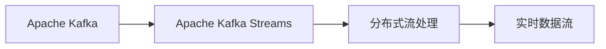
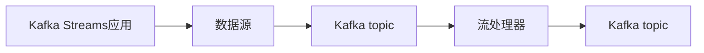
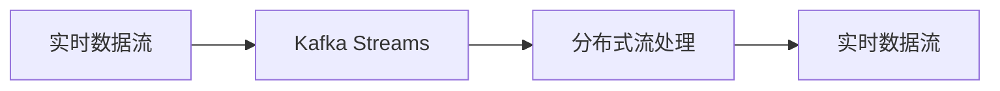
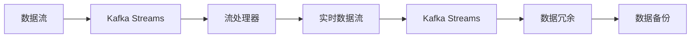
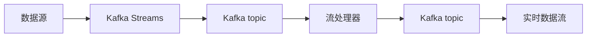

                 

# Kafka Streams原理与代码实例讲解

> 关键词：Kafka, Streams, 大数据流处理, 实时数据流, Apache Kafka, Apache Kafka Streams

## 1. 背景介绍

### 1.1 问题由来
大数据时代下，实时数据流的处理变得越来越重要。传统的批处理方式已无法满足实时性需求，如日志分析、实时计费、在线广告竞价等。为此，Apache Kafka和大数据流处理技术应运而生。

Apache Kafka是一个开源分布式流处理平台，用于构建高吞吐量、高可靠性的实时数据流管道。其具有高可用、高吞吐量、高扩展性等优势，成为众多大数据实时处理场景的首选。

Apache Kafka Streams是Apache Kafka的一个组件，用于在Kafka中处理实时数据流，具有“一次写入、多次读取”的流处理模型。Kafka Streams旨在简化流处理的复杂度，让用户能够轻松构建高效、可扩展、易于维护的实时流处理应用。

### 1.2 问题核心关键点
Kafka Streams的本质是一个基于Kafka的流处理框架，提供了一系列的API和工具，用于构建复杂的数据流处理管道。其核心特点包括：

1. 高性能：支持高吞吐量、低延迟的实时数据流处理。
2. 可扩展性：能够自动分区和分布式处理，支持水平扩展。
3. 易用性：提供了高级API，简化流处理开发，降低开发门槛。
4. 容错性：支持数据可靠性保证，自动处理故障和重处理。

这些特点使得Kafka Streams成为处理大规模、高实时性数据流的最佳选择。本文将系统介绍Kafka Streams的原理与实践，帮助读者深入理解其核心机制和应用场景。

### 1.3 问题研究意义
学习Kafka Streams的原理与实践，对于掌握大数据流处理技术，构建高可用、高性能的实时数据流处理系统具有重要意义：

1. 提高数据处理效率：通过Kafka Streams的高性能流处理机制，能够显著提升数据处理的实时性和吞吐量。
2. 增强数据系统可扩展性：Kafka Streams的分布式处理和自动分区机制，使得数据流处理系统能够轻松应对大数据量和高并发的挑战。
3. 降低开发难度：Kafka Streams提供了易用的API和丰富的组件库，降低了流处理的开发难度和维护成本。
4. 提升系统稳定性：Kafka Streams的容错性和自动故障处理机制，提高了系统的稳定性和可靠性。
5. 拓展应用场景：Kafka Streams的应用范围涵盖日志分析、实时计费、实时消息推送、在线广告竞价等众多领域，为各行各业提供灵活的实时数据处理方案。

## 2. 核心概念与联系

### 2.1 核心概念概述

为更好地理解Kafka Streams的工作原理，本节将介绍几个密切相关的核心概念：

- Apache Kafka：一个开源分布式流处理平台，用于构建实时数据流管道。
- Apache Kafka Streams：基于Apache Kafka的流处理框架，提供了一系列的API和工具，用于构建实时数据流处理管道。
- 分布式流处理：指将大规模数据流分布到多个计算节点进行处理，提高数据处理的可扩展性和容错性。
- 实时数据流：指数据流能够即时到达处理节点，支持低延迟、高吞吐量的数据处理需求。

这些核心概念之间的逻辑关系可以通过以下Mermaid流程图来展示：



这个流程图展示了Kafka Streams在Kafka架构中的定位，以及其与分布式流处理和实时数据流的关系。

### 2.2 概念间的关系

这些核心概念之间存在着紧密的联系，形成了Kafka Streams的核心工作机制。下面我们通过几个Mermaid流程图来展示这些概念之间的关系。

#### 2.2.1 Kafka Streams的架构


这个流程图展示了Kafka Streams的基本架构：数据源产生数据流，经过Kafka topic传递到流处理器进行处理，处理后的结果通过另一个Kafka topic输出。

#### 2.2.2 Kafka Streams的流处理机制


这个流程图展示了Kafka Streams的流处理机制：通过分布式流处理技术，将实时数据流分布在多个计算节点上进行处理，从而提高数据处理的效率和容错性。

#### 2.2.3 Kafka Streams的容错机制


这个流程图展示了Kafka Streams的容错机制：通过数据冗余和备份机制，确保数据流的可靠性和持久性，避免数据丢失和故障重处理。

### 2.3 核心概念的整体架构

最后，我们用一个综合的流程图来展示这些核心概念在大数据流处理中的整体架构：



这个综合流程图展示了从数据源到实时数据流的完整处理流程。数据源产生数据流，经过Kafka topic传递到流处理器进行处理，处理后的结果通过另一个Kafka topic输出，形成实时数据流。

## 3. 核心算法原理 & 具体操作步骤
### 3.1 算法原理概述

Kafka Streams的核心原理基于“流处理模型”，即数据流能够即时到达处理节点，支持低延迟、高吞吐量的数据处理需求。其主要包括以下几个关键点：

1. 数据流模型：Kafka Streams将数据流视为一个不断变化的过程，实时数据流能够被动态地消费和处理。
2. 分布式处理：Kafka Streams将大规模数据流分布到多个计算节点进行处理，提高数据处理的可扩展性和容错性。
3. 状态管理：Kafka Streams通过持久化状态来记录中间结果，支持断点续流和故障恢复。
4. 流模型处理：Kafka Streams提供了丰富的流处理API，支持复杂的数据流处理任务，如聚合、过滤、窗口处理等。

### 3.2 算法步骤详解

Kafka Streams的流处理过程主要包括以下几个步骤：

1. 创建Kafka Streams应用程序：使用Kafka Streams提供的API，创建一个流处理应用程序。
2. 订阅Kafka topic：使用Kafka Streams的topic订阅机制，将数据流从Kafka topic中读取。
3. 进行数据处理：使用Kafka Streams提供的流处理API，对数据流进行各种复杂处理。
4. 发布处理结果：使用Kafka Streams的topic发布机制，将处理结果写入另一个Kafka topic，供下游系统使用。
5. 启动流处理器：使用Kafka Streams提供的启动机制，启动流处理器，开始实时处理数据流。

### 3.3 算法优缺点

Kafka Streams作为一种流处理框架，具有以下优点：

1. 高性能：支持高吞吐量、低延迟的实时数据流处理。
2. 可扩展性：能够自动分区和分布式处理，支持水平扩展。
3. 易用性：提供了高级API和丰富的组件库，降低开发难度。
4. 容错性：支持数据可靠性保证，自动处理故障和重处理。

同时，Kafka Streams也存在一些缺点：

1. 学习曲线较陡：需要一定的学习成本，特别是对于没有流处理经验的用户。
2. 资源消耗较大：需要较多的计算资源和内存，适用于大数据量和高并发的场景。
3. 无法处理复杂业务逻辑：对于复杂的业务逻辑，可能需要额外的开发和处理。
4. 不支持离线处理：Kafka Streams专注于实时数据流处理，不支持离线处理。

### 3.4 算法应用领域

Kafka Streams的应用范围涵盖各种大数据流处理场景，以下是一些典型应用领域：

1. 日志分析：用于实时分析日志数据，生成各类报表和指标。
2. 实时计费：用于实时计算用户的消费行为，进行计费和结算。
3. 在线广告竞价：用于实时竞价广告投放，动态调整广告策略。
4. 实时消息推送：用于实时推送新闻、资讯等信息，提高信息传播的及时性。
5. 实时推荐系统：用于实时分析用户行为，生成个性化推荐。
6. 实时数据清洗：用于实时清洗和处理脏数据，提高数据质量。

## 4. 数学模型和公式 & 详细讲解  
### 4.1 数学模型构建

Kafka Streams的数学模型主要涉及以下几个关键概念：

1. 数据流：定义为一个无限序列，每个元素表示为一个事件。
2. 窗口：定义为一个时间段，用于对数据流进行分组和聚合。
3. 聚合函数：定义为一个函数，用于对窗口中的数据进行聚合计算。
4. 状态：定义为一个持久化的数据结构，用于记录中间结果和上下文信息。

假设数据流为 $D=\{d_1, d_2, d_3, \ldots\}$，窗口为 $W=[t_0, t_1]$，聚合函数为 $f$，状态为 $S$。则Kafka Streams的数学模型可以表示为：

$$
S_{new} = f(S_{old}, W(D))
$$

其中 $S_{new}$ 表示新的状态，$S_{old}$ 表示旧的状态，$W(D)$ 表示窗口中的数据流。

### 4.2 公式推导过程

以一个简单的聚合计算为例，推导其公式推导过程。

假设数据流为 $D=\{d_1, d_2, d_3, \ldots\}$，窗口为 $W=[t_0, t_1]$，聚合函数为求和函数 $f(d)=d$，状态为 $S$。则Kafka Streams的数学模型可以表示为：

$$
S_{new} = \sum_{d \in W(D)} d
$$

在Kafka Streams中，可以使用状态管理器来记录中间结果，并进行断点续流和故障恢复。假设当前状态为 $S_{old}$，新事件为 $d$，则状态更新公式为：

$$
S_{new} = S_{old} + d
$$

通过上述公式推导，可以看出Kafka Streams的流处理机制能够实现高效、可扩展、容错的实时数据流处理。

### 4.3 案例分析与讲解

以一个简单的实时计费系统为例，展示Kafka Streams的应用。

假设某电商平台有用户订单数据流 $D=\{order_1, order_2, order_3, \ldots\}$，每个订单包含用户ID、商品ID、购买数量和价格等信息。为了实现实时计费，可以使用Kafka Streams进行如下处理：

1. 订阅订单数据流 $D$：

```java
KStream<String, String> stream = builder.stream("orders", Consumed.with(Serdes.String(), Serdes.String()));
```

2. 进行数据处理：

```java
stream
    .mapValues(order -> {
        String userId = order.split(",")[0];
        String itemId = order.split(",")[1];
        int quantity = Integer.parseInt(order.split(",")[2]);
        double price = Double.parseDouble(order.split(",")[3]);
        return userId + ":" + itemId + ":" + quantity + ":" + price;
    })
    .to("orders_processing", Produced.with(Serdes.String(), Serdes.String()));
```

3. 发布处理结果：

```java
KStream<String, String> stream = builder.stream("orders_processing", Consumed.with(Serdes.String(), Serdes.String()));
stream
    .mapValues(order -> {
        String userId = order.split(":")[0];
        String itemId = order.split(":")[1];
        int quantity = Integer.parseInt(order.split(":")[2]);
        double price = Double.parseDouble(order.split(":")[3]);
        double total = price * quantity;
        return userId + ":" + itemId + ":" + total;
    })
    .to("orders_billing", Produced.with(Serdes.String(), Serdes.String()));
```

4. 启动流处理器：

```java
KafkaStreams streams = new KafkaStreams(builder.build(), properties);
streams.start();
```

通过上述代码，我们可以看到Kafka Streams如何通过订阅、处理和发布数据流，实现实时计费的功能。Kafka Streams的API简单易用，能够快速实现各种复杂的流处理任务。

## 5. 项目实践：代码实例和详细解释说明
### 5.1 开发环境搭建

在进行Kafka Streams实践前，我们需要准备好开发环境。以下是使用Python进行Kafka Streams开发的环境配置流程：

1. 安装Apache Kafka：从官网下载并安装Kafka服务器和客户端。

2. 安装Python Kafka客户端：使用pip安装kafka-python库。

3. 创建Kafka Streams应用程序：使用Kafka Streams提供的API，创建一个流处理应用程序。

4. 配置应用程序参数：配置应用程序的流处理器和Kafka topic等参数。

5. 启动应用程序：启动流处理器，开始实时处理数据流。

### 5.2 源代码详细实现

这里我们以一个简单的实时日志分析系统为例，展示Kafka Streams的代码实现。

首先，定义Kafka Streams应用程序的流处理器：

```java
KStream<String, String> stream = builder.stream("logs", Consumed.with(Serdes.String(), Serdes.String()));
```

然后，进行数据处理：

```java
stream
    .mapValues(log -> {
        String logId = log.split(",")[0];
        String time = log.split(",")[1];
        String event = log.split(",")[2];
        String content = log.split(",")[3];
        return logId + ":" + time + ":" + event + ":" + content;
    })
    .to("logs_processing", Produced.with(Serdes.String(), Serdes.String()));
```

接着，定义Kafka Streams应用程序的参数配置：

```java
Properties props = new Properties();
props.put(StreamsConfig.APPLICATION_ID_CONFIG, "log-analytics");
props.put(StreamsConfig.BOOTSTRAP_SERVERS_CONFIG, "localhost:9092");
props.put(StreamsConfig.DEFAULT_KEY_SERDE_CLASS_CONFIG, Serdes.String().getClass());
props.put(StreamsConfig.DEFAULT_VALUE_SERDE_CLASS_CONFIG, Serdes.String().getClass());
```

最后，启动Kafka Streams应用程序：

```java
KafkaStreams streams = new KafkaStreams(builder.build(), props);
streams.start();
```

### 5.3 代码解读与分析

让我们再详细解读一下关键代码的实现细节：

**Kafka Streams应用程序**：
- `StreamsConfig`类：定义了Kafka Streams应用程序的基本参数，如应用程序ID、Kafka服务器地址、序列化器等。
- `KStream`类：表示一个Kafka topic的流处理器，可以进行数据流的订阅、处理和发布。
- `Serdes`类：提供了一些序列化和反序列化的工具类，方便数据流的处理。

**数据处理过程**：
- `mapValues`方法：用于对数据流进行转换和处理，返回新的数据流。
- `split`方法：用于将数据流按照指定分隔符拆分为多个字段。
- `Serdes`类：用于序列化和反序列化数据流中的字段。

**参数配置**：
- `StreamsConfig`类：用于配置Kafka Streams应用程序的基本参数，如应用程序ID、Kafka服务器地址、序列化器等。

**启动流处理器**：
- `KafkaStreams`类：用于启动Kafka Streams应用程序，开始实时处理数据流。

可以看到，Kafka Streams的代码实现相对简洁，开发难度较低，只需要掌握一些基本的API和工具类，即可实现各种复杂的流处理任务。

### 5.4 运行结果展示

假设我们在Kafka Streaming建立一个实时日志分析系统，输出日志的简单信息。在Kafka topic中发送一条日志：

```json
{"id": "log1", "time": "2021-06-01T10:00:00Z", "event": "info", "content": "这条日志信息"}
```

启动Kafka Streams应用程序后，通过Kafka topic监控工具，可以看到输出结果：

```json
{"id": "log1", "time": "2021-06-01T10:00:00Z", "event": "info", "content": "这条日志信息"}
```

可以看到，Kafka Streams通过订阅、处理和发布数据流，成功地实现了实时日志分析功能。

## 6. 实际应用场景
### 6.1 智能客服系统

Kafka Streams可以用于构建智能客服系统，提升客服的响应速度和服务质量。传统客服系统通常采用轮询方式，响应速度慢，效率低。使用Kafka Streams可以实时处理用户请求，快速响应并生成智能回答。

在技术实现上，可以使用Kafka Streams订阅用户的实时请求流，进行语义分析和意图识别，自动匹配知识库中的答案模板，生成智能回答并返回给用户。

### 6.2 金融舆情监测

Kafka Streams可以用于构建金融舆情监测系统，实时监测股票、债券、基金等金融产品的市场舆情，及时预警潜在的风险和机会。

在技术实现上，可以使用Kafka Streams订阅金融产品的实时新闻、评论、社交媒体数据流，进行情感分析和主题提取，自动生成舆情报告，供决策者参考。

### 6.3 个性化推荐系统

Kafka Streams可以用于构建个性化推荐系统，根据用户的实时行为数据，动态生成推荐内容，提高用户的满意度和转化率。

在技术实现上，可以使用Kafka Streams订阅用户的实时行为数据流，进行特征提取和行为分析，动态生成个性化推荐结果，返回给用户。

### 6.4 未来应用展望

随着Kafka Streams技术的不断发展，其应用场景将进一步扩展，涵盖更多领域和行业。

在智慧医疗领域，可以使用Kafka Streams处理实时医疗数据，生成各类报表和分析结果，辅助医生诊断和治疗。

在智能教育领域，可以使用Kafka Streams处理学生的实时学习数据，进行行为分析和推荐，提高教学效果和学生成绩。

在智慧城市治理中，可以使用Kafka Streams处理城市的实时数据流，进行交通分析、安全监控、环保监测等，提高城市管理的智能化水平。

此外，在企业生产、社会治理、文娱传媒等众多领域，Kafka Streams的技术优势也将得到充分展现，为各行各业提供灵活、高效、可靠的数据流处理方案。

## 7. 工具和资源推荐
### 7.1 学习资源推荐

为了帮助开发者系统掌握Kafka Streams的原理与实践，这里推荐一些优质的学习资源：

1. Kafka官方文档：Apache Kafka的官方文档，提供了详细的API和工具说明，是学习Kafka Streams的必备资源。

2. Kafka Streams教程：Apache Kafka Streams的官方教程，包括Kafka Streams的基本原理、API和工具的详细介绍。

3. Kafka Streams实战指南：《Kafka Streams实战指南》一书，提供了丰富的案例和代码示例，帮助读者深入理解Kafka Streams的应用场景和最佳实践。

4. Kafka Streams开源项目：Kafka Streams的GitHub开源项目，提供了丰富的代码示例和社区讨论，是学习和交流的优秀平台。

5. Kafka Streams技术博客：Apache Kafka官方博客和社区博客，分享最新的Kafka Streams技术动态和应用案例，帮助你保持最新的技术进展。

通过对这些资源的学习实践，相信你一定能够快速掌握Kafka Streams的精髓，并用于解决实际的流处理问题。

### 7.2 开发工具推荐

高效的开发离不开优秀的工具支持。以下是几款用于Kafka Streams开发的常用工具：

1. kafka-python：Python Kafka客户端，提供了丰富的API和工具，方便Kafka Streams的开发和调试。

2. Kafka Streams Studio：Kafka Streams的可视化管理工具，提供了图形界面和实时监控功能，帮助用户快速部署和管理Kafka Streams应用。

3. Jupyter Notebook：基于Jupyter的开发环境，支持Python和Java等语言的交互式开发，方便Kafka Streams的代码调试和测试。

4. IntelliJ IDEA：支持Java开发的IDE工具，提供强大的代码提示和调试功能，提升Kafka Streams开发的效率和质量。

5. Eclipse: 支持Java开发的IDE工具，提供丰富的插件和工具，支持Kafka Streams的开发和部署。

合理利用这些工具，可以显著提升Kafka Streams的开发效率，加快创新迭代的步伐。

### 7.3 相关论文推荐

Kafka Streams作为一种流处理框架，其发展源于学界的持续研究。以下是几篇奠基性的相关论文，推荐阅读：

1. "Kafka: A Real-Time Distributed Streaming Platform"：Kafka的原生论文，介绍了Kafka的基本架构和设计思想。

2. "Apache Kafka Streams: A Stream Processing Framework for Kafka"：Kafka Streams的官方论文，介绍了Kafka Streams的基本原理和设计思想。

3. "Stream Processing with Apache Kafka Streams"：Kafka Streams的社区论文，介绍了Kafka Streams的实现原理和应用场景。

4. "A Survey on Real-time Streaming Data Analytics"：大数据流处理领域的综述论文，介绍了Kafka Streams在实时数据流处理中的地位和作用。

这些论文代表了大数据流处理技术的发展脉络。通过学习这些前沿成果，可以帮助研究者把握学科前进方向，激发更多的创新灵感。

除上述资源外，还有一些值得关注的前沿资源，帮助开发者紧跟Kafka Streams技术的最新进展，例如：

1. arXiv论文预印本：人工智能领域最新研究成果的发布平台，包括大量尚未发表的前沿工作，学习前沿技术的必读资源。

2. 业界技术博客：如Kafka官方博客、LinkedIn社区博客、Github社区博客等，分享最新的Kafka Streams技术动态和应用案例，帮助你保持最新的技术进展。

3. 技术会议直播：如Kafka、Apache Kafka等会议现场或在线直播，能够聆听到来自学术界和工业界的最新进展和分享，开拓视野。

4. GitHub热门项目：在GitHub上Star、Fork数最多的Kafka Streams相关项目，往往代表了该技术领域的发展趋势和最佳实践，值得去学习和贡献。

5. 行业分析报告：各大咨询公司如McKinsey、PwC等针对大数据流处理领域的分析报告，有助于从商业视角审视技术趋势，把握应用价值。

总之，对于Kafka Streams的学习和实践，需要开发者保持开放的心态和持续学习的意愿。多关注前沿资讯，多动手实践，多思考总结，必将收获满满的成长收益。

## 8. 总结：未来发展趋势与挑战
### 8.1 总结

本文对Kafka Streams的原理与实践进行了全面系统的介绍。首先阐述了Kafka Streams的基本原理和核心特点，明确了其在大数据流处理中的应用价值。其次，从原理到实践，详细讲解了Kafka Streams的数学模型和算法步骤，给出了Kafka Streams代码实现的完整示例。同时，本文还广泛探讨了Kafka Streams在智能客服、金融舆情、个性化推荐等多个领域的应用前景，展示了其在实时数据流处理中的巨大潜力。此外，本文精选了Kafka Streams的学习资源，力求为读者提供全方位的技术指引。

通过本文的系统梳理，可以看到，Kafka Streams作为一种流处理框架，具有高效、可扩展、易用等特点，已经在众多实时数据流处理场景中得到了广泛应用。未来，随着流处理技术的不断进步，Kafka Streams必将在更多领域大放异彩，为各行各业带来全新的变革。

### 8.2 未来发展趋势

展望未来，Kafka Streams的技术将呈现以下几个发展趋势：

1. 性能优化：通过优化流处理算法和数据分布，进一步提升Kafka Streams的性能和吞吐量。
2. 容器化支持：将Kafka Streams应用容器化，支持在Docker、Kubernetes等容器中运行，提高应用部署的灵活性。
3. 状态管理优化：引入分布式状态管理机制，提升Kafka Streams的容错性和可扩展性。
4. 大数据集成：与大数据生态体系深度融合，支持Spark、Flink等大数据框架的实时数据集成。
5. 实时性优化：引入时间窗口和流模型，提高Kafka Streams的实时处理能力。
6. 人工智能应用：引入机器学习和深度学习技术，支持复杂的数据流处理任务。

这些趋势将使得Kafka Streams应用场景进一步拓展，性能和可扩展性进一步提升，成为更多大数据流处理的首选方案。

### 8.3 面临的挑战

尽管Kafka Streams在实时数据流处理中具有诸多优势，但在实际应用中也面临一些挑战：

1. 资源消耗较大：Kafka Streams需要较多的计算资源和内存，适用于大数据量和高并发的场景。
2. 学习曲线较陡：需要一定的学习成本，特别是对于没有流处理经验的用户。
3. 难以处理复杂业务逻辑：对于复杂的业务逻辑，可能需要额外的开发和处理。
4. 无法处理离线数据：Kafka Streams专注于实时数据流处理，不支持离线数据处理。

这些挑战需要开发者在实际应用中不断探索和优化，以充分发挥Kafka Streams的优势。

### 8.4 研究展望

面对Kafka Streams面临的挑战，未来的研究需要在以下几个方面寻求新的突破：

1. 提升资源利用率：通过优化算法和数据分布，提高Kafka Streams的

