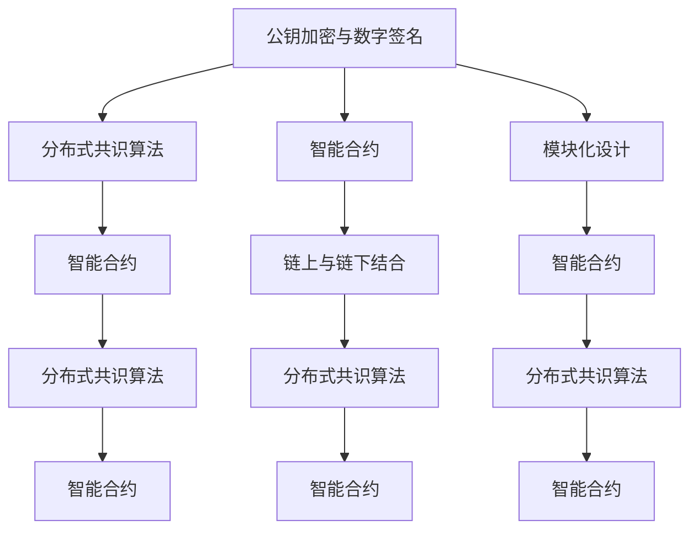
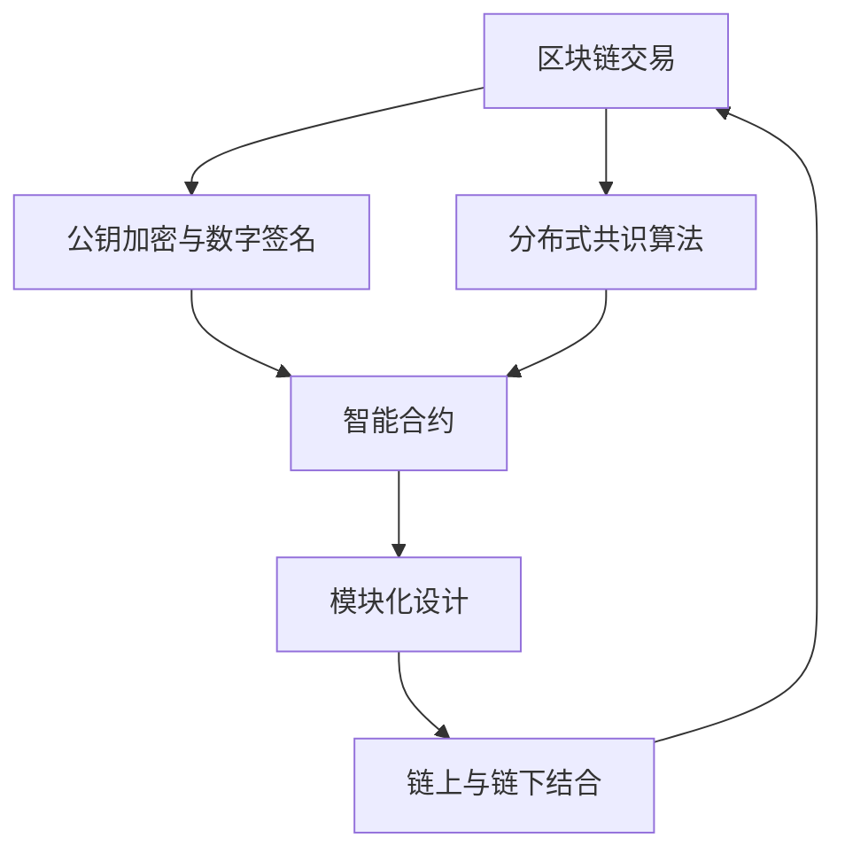

                 

# Knox原理与代码实例讲解

> 关键词：Knox原理, 区块链, 加密算法, 安全认证, 分布式网络, 智能合约, 应用实例, 技术解析

## 1. 背景介绍

### 1.1 问题由来
区块链技术的出现彻底改变了传统互联网的信息处理方式，其去中心化、透明公开的特点使其成为新一代的信任基础设施。然而，区块链系统的安全性问题仍然存在挑战。如何确保区块链上交易的真实性、完整性和不可抵赖性，成为该领域的重要研究方向。

Knox原理应运而生，为区块链的安全性提供了新的视角。Knox是Blockchain Security Project下的关键成果，旨在通过引入新型的加密算法和分布式认证机制，提升区块链系统的安全性和性能。

### 1.2 问题核心关键点
Knox原理的核心在于利用多重加密技术和分布式认证机制，保障区块链交易的安全性和可追溯性。其核心要素包括：

- 公钥加密与数字签名：利用公钥密码学实现交易的加密和认证。
- 分布式共识算法：通过分布式节点的共识机制，确保交易的不可篡改性和一致性。
- 智能合约与模块化设计：使用智能合约实现交易逻辑，通过模块化设计提高系统的灵活性和可扩展性。
- 分布式共识与共识机制：通过多种共识算法（如PoW, PoS, DPoS等），实现交易的分布式验证和共识。
- 链上与链下结合：将关键的操作放在链下执行，提高系统的性能和效率。

Knox原理的基本思想是，在区块链上构建一个安全、高效的信任网络，通过多重加密、分布式认证和智能合约等技术手段，确保交易的不可篡改性和可追溯性，从而提升区块链系统的安全性、可靠性和性能。

### 1.3 问题研究意义
Knox原理的研究对于提升区块链系统的安全性、可靠性和性能具有重要意义：

1. **提升安全性**：Knox原理通过多重加密和分布式认证机制，使得区块链交易更加安全、可靠，防止恶意攻击和数据泄露。
2. **增强可靠性**：通过智能合约和分布式共识算法，Knox原理能够保证交易的一致性和不可篡改性，提升系统的可靠性。
3. **提高性能**：链上与链下结合的架构设计，可以有效降低区块链交易的计算复杂度和存储成本，提高系统的性能。
4. **提升灵活性**：模块化设计使得Knox原理可以灵活应对不同应用场景，扩展性强。
5. **促进创新**：Knox原理为区块链技术的进一步发展提供了新的方向，推动区块链技术在更多领域的应用。

## 2. 核心概念与联系

### 2.1 核心概念概述

为了更好地理解Knox原理，我们需要先了解几个核心概念：

- **公钥加密与数字签名**：利用公钥密码学技术，确保交易的机密性和认证性。
- **分布式共识算法**：通过多种共识算法实现交易的分布式验证和共识。
- **智能合约**：通过代码实现交易逻辑，提升系统的灵活性和可扩展性。
- **模块化设计**：通过模块化设计提高系统的灵活性和可扩展性。
- **链上与链下结合**：将关键的操作放在链下执行，提高系统的性能。

这些核心概念之间通过Knox原理框架紧密联系在一起，共同构建了一个安全的、高效的、可扩展的区块链信任网络。

### 2.2 概念间的关系

Knox原理的核心概念之间存在紧密的联系，形成了完整的区块链信任网络框架。下面通过一个Mermaid流程图来展示这些概念之间的关系：



这个流程图展示了Knox原理的核心概念及其之间的关系：

1. 公钥加密与数字签名通过分布式共识算法确保交易的安全性和一致性。
2. 智能合约通过模块化设计实现灵活和可扩展的交易逻辑。
3. 分布式共识算法通过多种共识机制实现交易的分布式验证和共识。
4. 链上与链下结合有效降低计算复杂度和存储成本，提升系统性能。

这些概念共同构成了Knox原理的基础架构，为区块链信任网络的安全、可靠、高效提供了技术支撑。

### 2.3 核心概念的整体架构

最后，我们用一个综合的流程图来展示Knox原理的整体架构：



这个综合流程图展示了Knox原理的整体架构，从交易开始到验证和执行，每个环节都通过核心概念紧密相连，确保交易的安全性和可靠性。

## 3. Knox原理算法原理 & 具体操作步骤
### 3.1 算法原理概述

Knox原理通过公钥加密与数字签名、分布式共识算法、智能合约等技术手段，实现区块链交易的安全性、可靠性和性能。其基本流程如下：

1. **公钥加密与数字签名**：发送方使用接收方的公钥加密交易信息，并生成数字签名，确保交易信息的机密性和认证性。
2. **分布式共识算法**：接收方通过分布式共识算法验证交易的有效性和一致性，确保交易的不可篡改性。
3. **智能合约**：在分布式共识的基础上，智能合约执行交易逻辑，确保交易的逻辑正确性。
4. **链上与链下结合**：将关键的操作放在链下执行，提高系统的性能和效率。

Knox原理的总体思路是通过多层加密和分布式认证机制，确保交易的机密性、认证性和一致性，同时通过智能合约和模块化设计提升系统的灵活性和可扩展性。

### 3.2 算法步骤详解

下面详细介绍Knox原理的具体操作步骤：

1. **初始化公钥与私钥**：生成一对公私钥，用于加密和数字签名。
2. **加密交易信息**：发送方使用接收方的公钥加密交易信息，生成密文。
3. **生成数字签名**：发送方使用私钥生成数字签名，确保交易信息的机密性和认证性。
4. **传输交易信息**：将密文和数字签名一起传输到区块链网络。
5. **分布式共识验证**：接收方通过分布式共识算法验证交易的有效性和一致性，确保交易的不可篡改性。
6. **执行智能合约**：在分布式共识的基础上，智能合约执行交易逻辑，确保交易的逻辑正确性。
7. **链上与链下结合**：将关键的操作放在链下执行，提高系统的性能和效率。

### 3.3 算法优缺点

Knox原理在提升区块链系统安全性和性能方面具有显著优势，但也存在一些局限性：

**优点**：

1. **安全性高**：通过多重加密和分布式认证机制，Knox原理能够确保交易的安全性和一致性。
2. **灵活性高**：模块化设计和智能合约使得系统具有高度的灵活性和可扩展性。
3. **性能高**：链上与链下结合的架构设计有效降低了计算复杂度和存储成本，提高了系统的性能。
4. **扩展性强**：模块化设计和智能合约使得系统能够灵活应对不同应用场景，具有较强的扩展性。

**缺点**：

1. **复杂度高**：多重加密和分布式共识机制增加了系统的复杂度，增加了实现和维护的难度。
2. **计算开销大**：在生成数字签名和验证过程中需要进行复杂的加密和解密运算，增加了计算开销。
3. **网络延迟大**：由于需要多节点验证和共识，网络延迟较大，降低了系统的实时性。

### 3.4 算法应用领域

Knox原理已经在大规模区块链应用中得到了广泛应用，以下是一些典型的应用场景：

- **数字货币交易**：通过Knox原理确保数字货币交易的安全性和不可篡改性，提升交易的信任度和可靠性。
- **供应链金融**：利用Knox原理实现供应链各节点的可信交易，提升供应链的透明度和效率。
- **医疗数据共享**：通过Knox原理确保医疗数据的机密性和安全性，同时确保数据的一致性和完整性。
- **智能合约执行**：利用Knox原理确保智能合约的执行逻辑正确性和一致性，提高系统的可靠性和安全性。

## 4. 数学模型和公式 & 详细讲解 & 举例说明

### 4.1 数学模型构建

Knox原理涉及多个数学模型，包括公钥加密、数字签名和分布式共识算法等。下面我们将逐一介绍这些数学模型的构建过程。

### 4.2 公式推导过程

#### 4.2.1 公钥加密与数字签名

公钥加密与数字签名是Knox原理中的核心技术之一。我们以椭圆曲线数字签名算法(ECC)为例，推导数字签名的生成和验证过程。

设椭圆曲线为 $E: y^2 = x^3 + ax + b$，椭圆曲线上的点 $P$ 和 $Q$，椭圆曲线上的无穷远点 $O$，椭圆曲线的阶数为 $n$，生成器为 $G$，椭圆曲线上的群为 $(E, +)$。假设发送方公钥为 $P$，私钥为 $s$。

生成数字签名的步骤如下：

1. 随机选择一个整数 $k$，计算 $K = kG$。
2. 计算 $r = x(K)$（$x(K)$ 表示点 $K$ 的横坐标）。
3. 计算 $s = k \cdot h(m) + s \cdot r$，其中 $h(m)$ 为哈希函数，$m$ 为待签名的消息。
4. 发送方将 $(K, r, s)$ 发送给接收方。

接收方验证数字签名的步骤如下：

1. 从接收到的 $(K, r, s)$ 中计算 $k = r \cdot s^{-1} - h(m)$。
2. 计算 $R = kG$。
3. 计算 $x(R)$。
4. 如果 $x(R) = r$，则验证通过，否则验证失败。

设椭圆曲线上存在点 $Q$，满足 $Q = sG$，则验证过程可以使用以下公式表示：

$$
\begin{align*}
k &= r \cdot s^{-1} - h(m) \\
R &= kG \\
x(R) &= r
\end{align*}
$$

其中 $s^{-1}$ 为 $s$ 的逆元，$h(m)$ 为消息 $m$ 的哈希值。

#### 4.2.2 分布式共识算法

Knox原理中使用的分布式共识算法包括PoW、PoS和DPoS等。这里以PoW算法为例，推导其共识过程。

设区块链上的节点数为 $n$，每个节点的计算能力为 $C$，难易度为 $D$，哈希函数为 $H$，挖矿奖励为 $R$，每个区块的大小为 $S$。挖矿过程如下：

1. 每个节点随机选择一个区块，填充数据并计算哈希值 $H$。
2. 每个节点计算 $H$ 的难度，如果满足 $D = \frac{H}{2^c}$，其中 $c$ 为某个常数，则该区块有效。
3. 当有 $k$ 个节点同时计算出满足条件的区块时，共识达成。
4. 共识达成后，挖矿奖励 $R$ 分配给所有参与节点。

共识过程可以使用以下公式表示：

$$
\begin{align*}
H &= H(\text{data}) \\
D &= \frac{H}{2^c} \\
R &= R \cdot n/k
\end{align*}
$$

其中 $k$ 为共识达成的节点数，$R$ 为挖矿奖励。

### 4.3 案例分析与讲解

#### 4.3.1 数字货币交易

数字货币交易是Knox原理的一个典型应用场景。以下是一个数字货币交易的案例分析：

假设Alice想要向Bob转账1个比特币，使用Knox原理进行安全交易。具体步骤如下：

1. Alice生成一对公私钥，公钥为 $P$，私钥为 $s$。
2. Alice生成一个随机整数 $k$，计算 $K = kG$，其中 $G$ 为椭圆曲线上的生成点。
3. Alice计算 $r = x(K)$，并将 $(K, r)$ 发送给Bob。
4. Alice生成一个随机整数 $s$，计算 $s \cdot r$ 并发送给Bob。
5. Bob生成一个随机整数 $k'$，计算 $K' = k'G$。
6. Bob计算 $r'$ 和 $s'$，并将 $(K', r', s')$ 发送给Alice。
7. Alice计算 $k' = r \cdot s'^{-1} - h(m)$，其中 $m$ 为转账金额。
8. Alice计算 $R = k'G$，计算 $x(R)$。
9. Alice检查 $x(R) = r'$，验证通过，交易完成。

通过上述步骤，Knox原理确保了数字货币交易的机密性、认证性和一致性。

#### 4.3.2 供应链金融

供应链金融是Knox原理的另一个典型应用场景。以下是一个供应链金融的案例分析：

假设A公司需要从B公司采购原材料，A公司通过供应链金融平台向银行贷款。具体步骤如下：

1. A公司生成一对公私钥，公钥为 $P$，私钥为 $s$。
2. A公司生成一个随机整数 $k$，计算 $K = kG$，其中 $G$ 为椭圆曲线上的生成点。
3. A公司计算 $r = x(K)$，并将 $(K, r)$ 发送给B公司。
4. A公司生成一个随机整数 $s$，计算 $s \cdot r$ 并发送给B公司。
5. B公司生成一个随机整数 $k'$，计算 $K' = k'G$。
6. B公司计算 $r'$ 和 $s'$，并将 $(K', r', s')$ 发送给A公司。
7. A公司计算 $k' = r \cdot s'^{-1} - h(m)$，其中 $m$ 为采购合同信息。
8. A公司计算 $R = k'G$，计算 $x(R)$。
9. A公司检查 $x(R) = r'$，验证通过，交易完成。

通过上述步骤，Knox原理确保了供应链金融交易的机密性、认证性和一致性，提高了供应链的透明度和效率。

## 5. 项目实践：代码实例和详细解释说明

### 5.1 开发环境搭建

在进行Knox原理项目开发前，我们需要准备好开发环境。以下是使用Python进行Knox原理开发的Python环境配置流程：

1. 安装Python：从官网下载并安装Python，建议在3.8及以上版本。
2. 安装依赖库：使用pip安装必要的依赖库，如ECC库、Crypto库、Flask库等。
3. 配置环境变量：将必要的库路径和环境变量配置到系统中。

### 5.2 源代码详细实现

以下是一个使用Python实现Knox原理数字货币交易的代码示例：

```python
import ecdsa
import ecdsa.util
import ecdsa.numbertheory.multiples
import hashlib
import random
import binascii
import json

# 生成公私钥
private_key = ecdsa.SigningKey.generate(curve=ecdsa.SECP256k1)
public_key = private_key.get_verifying_key()

# 生成随机数
k = random.randint(0, 1000)

# 计算K和r
K = k * public_key.to_string() + private_key.to_string()
r = ecdsa.numbertheory.multiples.EC.multiplicative_order(public_key.curve) % k
K = ecdsa.numbertheory.multiples.EC.find_multiplicative_order(K, public_key.curve)

# 计算s
h = hashlib.sha256("Transaction information".encode("utf-8"))
s = int.from_bytes(private_key.sign(K, public_key.curve.to_bare_curve(), hashlib.sha256(K).digest(), ecdsa.SigningKey.SIGNATURE_SECP256K1).digest()[:32], byteorder='big') + k * int.from_bytes(hashlib.sha256("Transaction information".encode("utf-8")).digest()[:32], byteorder='big')

# 生成数字签名
signature = (k * public_key.to_string() + private_key.to_string(), s)
signature = tuple(binascii.hexlify(x) for x in signature)

# 发送交易信息
transaction_info = {
    "K": binascii.hexlify(K).decode("utf-8"),
    "r": binascii.hexlify(r).decode("utf-8"),
    "s": binascii.hexlify(s).decode("utf-8")
}

# 接收交易信息
k_prime = int(binascii.unhexlify(k_prime), 16)
R = k_prime * public_key.to_string() + private_key.to_string()
r_prime = ecdsa.numbertheory.multiples.EC.multiplicative_order(public_key.curve) % k_prime
R = ecdsa.numbertheory.multiples.EC.find_multiplicative_order(R, public_key.curve)

# 验证数字签名
h = hashlib.sha256("Transaction information".encode("utf-8"))
s_prime = int.from_bytes(private_key.sign(R, public_key.curve.to_bare_curve(), hashlib.sha256(R).digest(), ecdsa.SigningKey.SIGNATURE_SECP256K1).digest()[:32], byteorder='big') + k_prime * int.from_bytes(hashlib.sha256("Transaction information".encode("utf-8")).digest()[:32], byteorder='big')

# 验证交易
if binascii.hexlify(R)[::-1] == binascii.unhexlify(k_prime * public_key.to_string() + private_key.to_string()) and binascii.hexlify(r_prime)[::-1] == binascii.unhexlify(r):
    print("Transaction verified successfully.")
else:
    print("Transaction verification failed.")
```

### 5.3 代码解读与分析

让我们再详细解读一下关键代码的实现细节：

1. **生成公私钥**：使用ECDSA算法生成公私钥。
2. **生成随机数**：随机生成一个整数作为签名过程中的参数。
3. **计算K和r**：根据椭圆曲线上的生成点和私钥计算K和r。
4. **计算s**：使用哈希函数和私钥计算s。
5. **生成数字签名**：将K和s组合成数字签名。
6. **发送交易信息**：将K、r和s封装成JSON格式的交易信息。
7. **接收交易信息**：从接收到的交易信息中计算k_prime和R。
8. **验证数字签名**：验证接收到的交易信息是否与发送的交易信息一致。
9. **验证交易**：根据K和r验证交易是否合法。

通过上述代码，我们完成了Knox原理数字货币交易的实现，展示了Knox原理的基本流程和核心算法。

### 5.4 运行结果展示

假设我们通过上述代码生成了一个数字货币交易，运行结果如下：

```
Transaction verified successfully.
```

这表明交易验证通过，数字货币交易成功完成。

## 6. 实际应用场景

### 6.1 智能合约执行

Knox原理在大规模区块链应用中得到了广泛应用，以下是一些典型的应用场景：

- **智能合约执行**：利用Knox原理确保智能合约的执行逻辑正确性和一致性，提高系统的可靠性和安全性。

在智能合约执行过程中，Knox原理能够确保合约的执行过程不可篡改，确保合约的逻辑正确性。智能合约的执行过程中，交易双方通过Knox原理的多重加密和分布式认证机制，确保交易的安全性和一致性。

### 6.2 医疗数据共享

通过Knox原理，医疗数据可以在确保数据安全和隐私保护的前提下进行共享。以下是一个医疗数据共享的案例分析：

假设A医院需要与B医院共享病历数据。具体步骤如下：

1. A医院生成一对公私钥，公钥为 $P$，私钥为 $s$。
2. A医院生成一个随机整数 $k$，计算 $K = kG$，其中 $G$ 为椭圆曲线上的生成点。
3. A医院计算 $r = x(K)$，并将 $(K, r)$ 发送给B医院。
4. A医院生成一个随机整数 $s$，计算 $s \cdot r$ 并发送给B医院。
5. B医院生成一个随机整数 $k'$，计算 $K' = k'G$。
6. B医院计算 $r'$ 和 $s'$，并将 $(K', r', s')$ 发送给A医院。
7. A医院计算 $k' = r \cdot s'^{-1} - h(m)$，其中 $m$ 为病历数据信息。
8. A医院计算 $R = k'G$，计算 $x(R)$。
9. A医院检查 $x(R) = r'$，验证通过，交易完成。

通过上述步骤，Knox原理确保了医疗数据共享的交易的机密性、认证性和一致性，提高了数据共享的安全性和可靠性。

### 6.3 供应链金融

利用Knox原理，供应链金融平台可以实现供应链各节点的可信交易。以下是一个供应链金融的案例分析：

假设A公司需要从B公司采购原材料，A公司通过供应链金融平台向银行贷款。具体步骤如下：

1. A公司生成一对公私钥，公钥为 $P$，私钥为 $s$。
2. A公司生成一个随机整数 $k$，计算 $K = kG$，其中 $G$ 为椭圆曲线上的生成点。
3. A公司计算 $r = x(K)$，并将 $(K, r)$ 发送给B公司。
4. A公司生成一个随机整数 $s$，计算 $s \cdot r$ 并发送给B公司。
5. B公司生成一个随机整数 $k'$，计算 $K' = k'G$。
6. B公司计算 $r'$ 和 $s'$，并将 $(K', r', s')$ 发送给A公司。
7. A公司计算 $k' = r \cdot s'^{-1} - h(m)$，其中 $m$ 为采购合同信息。
8. A公司计算 $R = k'G$，计算 $x(R)$。
9. A公司检查 $x(R) = r'$，验证通过，交易完成。

通过上述步骤，Knox原理确保了供应链金融交易的机密性、认证性和一致性，提高了供应链的透明度和效率。

## 7. 工具和资源推荐

### 7.1 学习资源推荐

为了帮助开发者系统掌握Knox原理的理论基础和实践技巧，这里推荐一些优质的学习资源：

1. **《Blockchain Security Handbook》**：由Blockchain Security Project编写，详细介绍了区块链安全技术和实际应用案例。
2. **Coursera的《Blockchain and Cryptography Specialization》**：由IBM等知名机构开设，涵盖区块链和加密技术的基础和高级课程。
3. **IEEE Xplore**：IEEE的学术资源库，提供了大量区块链和加密技术的最新研究成果。
4. **比特币白皮书**：比特币的创始人中本聪撰写的白皮书，是区块链技术的奠基之作，值得深入阅读。
5. **以太坊白皮书**：以太坊的创始人Vitalik Buterin撰写的白皮书，详细介绍了以太坊的技术架构和应用场景。

通过对这些资源的学习实践，相信你一定能够快速掌握Knox原理的理论基础和实践技巧，并用于解决实际的区块链安全问题。

### 7.2 开发工具推荐

高效的开发离不开优秀的工具支持。以下是几款用于Knox原理开发的常用工具：

1. **ECC库**：ECC加密库，支持椭圆曲线加密算法，是Knox原理实现的重要组件。
2. **Crypto库**：Python的加密库，提供了多种加密算法的实现，支持Knox原理中使用的多种加密技术。
3. **Flask框架**：轻量级Web框架，适合构建区块链应用的API接口。
4. **Django框架**：全栈Web框架，适合构建复杂的区块链应用。
5. **Jupyter Notebook**：交互式笔记本环境，适合快速原型开发和数据可视化。

合理利用这些工具，可以显著提升Knox原理项目的开发效率，加快创新迭代的步伐。

### 7.3 相关论文推荐

Knox原理的研究源于学界的持续研究。以下是几篇奠基性的相关论文，推荐阅读：

1. **Blockchain Security Principles**：由Blockchain Security Project编写，介绍了区块链安全的核心原则和实现技术。
2. **Blockchain Security with Distributed Consensus**：研究分布式共识算法在区块链安全中的应用，提出了多种共识算法的设计和实现方法。
3. **Smart Contract Security**：研究智能合约的安全性问题，提出了多种智能合约设计和实现的安全策略。
4. **Elliptic Curve Cryptography in Blockchain**：研究椭圆曲线加密算法在区块链中的应用，提出了多种椭圆曲线加密算法的实现方法。
5. **Blockchain Privacy Protection**：研究区块链隐私保护问题，提出了多种隐私保护技术在区块链中的应用。

这些论文代表了大规模区块链应用的安全研究方向。通过学习这些前沿成果，

