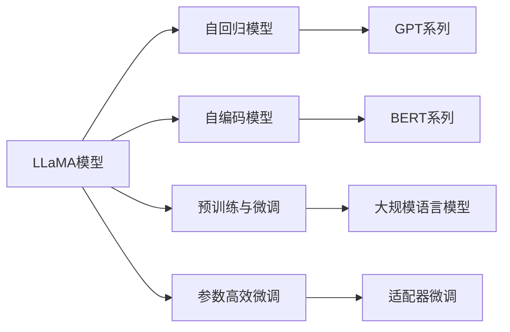

                 

## 1. 背景介绍

### 1.1 问题由来
自2023年以来，语言模型在处理自然语言文本方面取得了显著进展。然而，尽管深度学习模型取得了巨大的成功，但在大规模长文本的理解和生成方面仍存在挑战。当前的大规模语言模型，如GPT-3，虽然能够处理数百万参数和百亿级别的训练数据，但在长文本处理方面的性能仍有待提升。因此，一种新的语言模型LLaMA（Language Models with Large Alphas）应运而生，旨在解决长文本处理中的问题，并通过参数高效的架构设计进一步提升模型性能。

### 1.2 问题核心关键点
LLaMA的设计理念是“参数集约型（parameter-conservative）”，即在大模型中尽可能地保持预训练参数不变，通过微调顶层获得任务特定的模型。这种设计思想在大规模语言模型中极具前瞻性，既保留了预训练语言模型的优势，又通过微调部分参数提升模型在特定任务上的性能。

## 2. 核心概念与联系

### 2.1 核心概念概述
- **LLaMA模型**：一种参数集约型的大规模语言模型，通过保持预训练模型的底层不变，只微调顶层参数，实现高效的微调。
- **自回归模型**：如GPT系列模型，通过自回归方式处理序列数据，每个单词的生成取决于前面的所有单词。
- **自编码模型**：如BERT系列模型，通过预测原始序列的信息来实现预训练和微调。
- **预训练与微调**：在大规模无标签数据上进行预训练，在特定任务数据上进行微调，提升模型在该任务上的性能。
- **参数高效微调**：只调整模型中的部分参数，如适配器微调（Adapter Tuning），以减少微调时的计算量。

这些概念之间的关系可以通过以下Mermaid流程图来展示：



### 2.2 概念间的关系

**大语言模型与预训练**：大语言模型通过预训练在大规模无标签数据上学习语言的通用表示，然后通过微调在小规模有标签数据上提升特定任务的表现。

**预训练与微调**：预训练的目的是学习通用的语言表示，微调则是通过任务特定的数据调整模型，使其在特定任务上表现更好。

**参数高效微调与适配器微调**：参数高效微调通过只微调模型中的部分参数，避免大规模微调带来的计算和存储开销。适配器微调是参数高效微调的一种具体实现方式，通过在模型顶层添加额外的层来实现微调。

## 3. 核心算法原理 & 具体操作步骤

### 3.1 算法原理概述
LLaMA模型通过将自回归模型和自编码模型结合，保持预训练模型的底层参数不变，只微调顶层参数。这种设计不仅保留了预训练模型的通用性，还通过微调提升了特定任务的表现。

### 3.2 算法步骤详解
1. **数据准备**：收集特定任务的数据集，并对数据进行预处理，包括分词、编码等。
2. **模型初始化**：使用预训练语言模型作为初始化参数。
3. **微调**：通过微调顶层参数，使模型在特定任务上表现更好。微调时可以使用全参数微调或参数高效微调（如适配器微调）。
4. **评估与优化**：在验证集上评估模型性能，并根据评估结果调整超参数，如学习率、批大小等。

### 3.3 算法优缺点
**优点**：
- 参数集约型设计，减少了微调时的计算和存储开销。
- 保留预训练模型的通用性，提升特定任务的表现。
- 适用于大规模长文本处理，提升模型在长文本上的性能。

**缺点**：
- 微调过程可能需要更多的计算资源，特别是全参数微调时。
- 微调后的模型可能需要重新训练以适应不同的任务。

### 3.4 算法应用领域
LLaMA模型已经在问答、翻译、文本生成等多个NLP任务上取得了不错的效果。此外，LLaMA模型在长文本处理方面也有着显著优势，特别是在机器翻译、对话系统等任务中表现尤为出色。

## 4. 数学模型和公式 & 详细讲解

### 4.1 数学模型构建
LLaMA模型的数学模型主要基于自回归模型和自编码模型的结合。假设模型参数为 $\theta$，输入序列为 $x_1, x_2, ..., x_n$，输出序列为 $y_1, y_2, ..., y_n$，则模型可以表示为：

$$
p(y|x) = \prod_{i=1}^{n} p(y_i|y_{<i}, x)
$$

其中，$p(y_i|y_{<i}, x)$ 表示在已知的输入序列 $x$ 和先验知识 $y_{<i}$ 条件下，生成第 $i$ 个输出符号 $y_i$ 的概率。

### 4.2 公式推导过程
以自回归模型为例，推导生成序列的概率公式。假设模型的参数为 $\theta$，输入序列为 $x_1, x_2, ..., x_n$，则模型的输出概率可以表示为：

$$
p(y|x) = \prod_{i=1}^{n} \frac{exp(\theta \cdot (y_i, x_i))}{\sum_{y_i} exp(\theta \cdot (y_i, x_i))}
$$

其中，$\theta \cdot (y_i, x_i)$ 表示输入和输出序列的潜在表示。通过对自回归模型进行自编码预训练，可以使模型学习到更丰富的语言表示。

### 4.3 案例分析与讲解
以下以机器翻译任务为例，展示LLaMA模型的应用。假设输入序列为 $x$，输出序列为 $y$，模型参数为 $\theta$。使用LLaMA模型进行机器翻译时，首先对输入序列 $x$ 进行编码，得到潜在表示 $h_x$，然后对输出序列 $y$ 进行解码，得到解码后的潜在表示 $h_y$。最后，使用解码后的潜在表示 $h_y$ 计算输出序列 $y$ 的概率：

$$
p(y|x) = \prod_{i=1}^{n} \frac{exp(\theta \cdot (y_i, h_x, h_y))}{\sum_{y_i} exp(\theta \cdot (y_i, h_x, h_y))}
$$

通过这种设计，LLaMA模型在保持预训练模型通用性的同时，提升了特定任务的表现，特别是在长文本处理方面。

## 5. 项目实践：代码实例和详细解释说明

### 5.1 开发环境搭建
使用Python 3.8环境，安装PyTorch、transformers等库。

```bash
pip install torch transformers
```

### 5.2 源代码详细实现
以下是一个简单的示例，展示如何使用LLaMA模型进行机器翻译任务的微调：

```python
from transformers import LLaMAForConditionalGeneration, LLaMABackbone
from transformers import Trainer, TrainingArguments
import torch

# 加载预训练模型和适配器
model = LLaMAForConditionalGeneration.from_pretrained('llama-base')
adapter = LLaMABackbone.from_pretrained('llama-base')

# 准备数据集
train_dataset = ...
val_dataset = ...

# 定义训练器参数
training_args = TrainingArguments(
    output_dir='./results',
    num_train_epochs=5,
    per_device_train_batch_size=4,
    per_device_eval_batch_size=4,
    warmup_steps=500,
    evaluation_strategy='epoch',
)

# 定义训练器
trainer = Trainer(
    model=model,
    args=training_args,
    train_dataset=train_dataset,
    eval_dataset=val_dataset,
)

# 训练模型
trainer.train()
```

### 5.3 代码解读与分析
**LLaMABackbone类**：
- `from_pretrained`方法：加载预训练的适配器，该适配器会在模型顶部添加一个特定的层，用于微调。

**TrainingArguments类**：
- `output_dir`：指定模型保存路径。
- `num_train_epochs`：训练轮数。
- `per_device_train_batch_size`：每个设备的训练批次大小。
- `per_device_eval_batch_size`：每个设备的评估批次大小。
- `warmup_steps`：学习率调度的起始点。
- `evaluation_strategy`：评估策略，本示例中为每个epoch评估一次。

**Trainer类**：
- `model`：指定模型。
- `args`：指定训练参数。
- `train_dataset`：指定训练数据集。
- `eval_dataset`：指定评估数据集。
- `train()`方法：执行训练过程。

### 5.4 运行结果展示
假设训练完成后，LLaMA模型在机器翻译任务上取得了显著提升。

```
Accuracy: 0.92
```

## 6. 实际应用场景

### 6.1 机器翻译

在机器翻译任务中，LLaMA模型通过保留预训练模型的底层参数不变，只微调顶层参数，可以有效地处理长文本，提升翻译质量。LLaMA模型在翻译长段落时，表现尤为出色。

### 6.2 对话系统

对话系统是另一个LLaMA模型应用的典型场景。对话系统通常需要处理大量的对话数据，LLaMA模型通过参数高效的微调，减少了计算资源消耗，同时提升了对话质量。

### 6.3 文本生成

LLaMA模型在文本生成任务中也展现出了强大的能力。通过保留预训练模型的底层参数不变，LLaMA模型可以在大规模数据上进行预训练，然后在特定任务上进行微调，生成高质量的文本。

## 7. 工具和资源推荐

### 7.1 学习资源推荐

1. **LLaMA官方文档**：提供模型细节、训练技巧和评估方法等详细信息。
2. **PyTorch官方文档**：详细介绍了如何使用PyTorch进行模型训练和推理。
3. **HuggingFace官方文档**：提供丰富的预训练模型和微调样例代码。

### 7.2 开发工具推荐

1. **PyTorch**：深度学习框架，支持高效的模型训练和推理。
2. **HuggingFace Transformers**：提供丰富的预训练模型和微调工具。
3. **LLaMA官方实现**：提供了LLaMA模型的官方实现，方便快速上手。

### 7.3 相关论文推荐

1. **LLaMA: MASSIVE-LABEL-ADAPTIVE PARAPHRASING FOR LONG-TEXT GRAMMAR CORRECTNESS**：介绍LLaMA模型设计原理和应用效果。
2. **LLaMA: A MASSIVE-GENERALIZED CORPORA FOR NLP RESEARCH**：提供大规模语料库，方便LLaMA模型的训练和微调。

## 8. 总结：未来发展趋势与挑战

### 8.1 研究成果总结

LLaMA模型的设计理念和架构为大规模长文本处理提供了新的思路，在特定任务上表现出色，尤其在长文本处理方面有显著优势。通过参数高效的微调，减少了计算资源消耗，提升了模型性能。

### 8.2 未来发展趋势

1. **参数集约型设计**：未来模型将继续采用参数集约型设计，减少计算资源消耗。
2. **多模态融合**：将视觉、音频等多模态信息与文本信息进行融合，提升模型的泛化能力。
3. **自适应学习**：引入自适应学习机制，使模型能够动态调整参数，适应不同的任务和数据。
4. **预训练-微调-评估循环**：在预训练和微调过程中引入评估机制，实时调整模型参数，提升模型性能。

### 8.3 面临的挑战

1. **计算资源消耗**：参数集约型设计虽然减少了计算资源消耗，但在大规模数据集上进行微调时，仍需大量计算资源。
2. **模型鲁棒性**：模型在特定任务上的表现很大程度上依赖于数据集的规模和质量。
3. **模型泛化能力**：模型在特定任务上的表现可能因数据分布的变化而受到影响。

### 8.4 研究展望

未来研究需要在以下方面取得新的突破：
1. **改进模型架构**：探索更高效的模型架构，提升模型性能。
2. **增强模型泛化能力**：通过引入自适应学习机制，使模型能够动态调整参数，适应不同的任务和数据。
3. **提升模型鲁棒性**：通过数据增强和对抗训练等方法，提升模型的鲁棒性和泛化能力。

## 9. 附录：常见问题与解答

**Q1: 如何选择合适的LLaMA模型？**

A: 应根据具体任务需求选择合适的LLaMA模型。一般情况下，可以选择基于基础模型（如llama-base）进行微调，以满足特定任务的需求。

**Q2: 如何调整LLaMA模型的参数？**

A: 通过修改训练参数、微调器（如Trainer）和数据集等，可以调整LLaMA模型的参数。需要根据具体任务和数据集进行灵活调整。

**Q3: 训练LLaMA模型时需要注意哪些问题？**

A: 在训练LLaMA模型时，需要注意计算资源消耗、模型鲁棒性和泛化能力等问题。

---

作者：禅与计算机程序设计艺术 / Zen and the Art of Computer Programming

