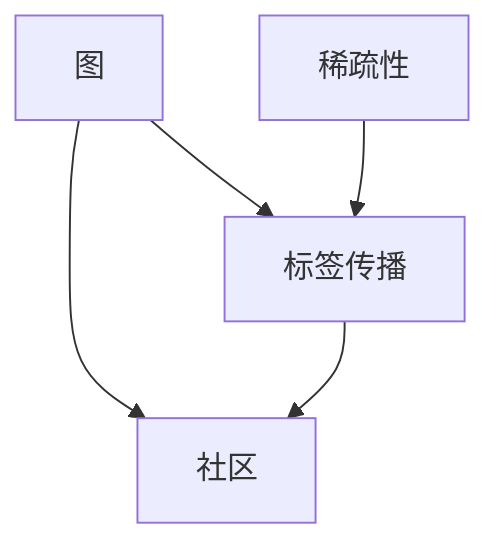
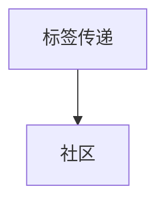
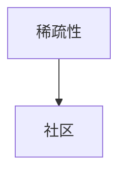
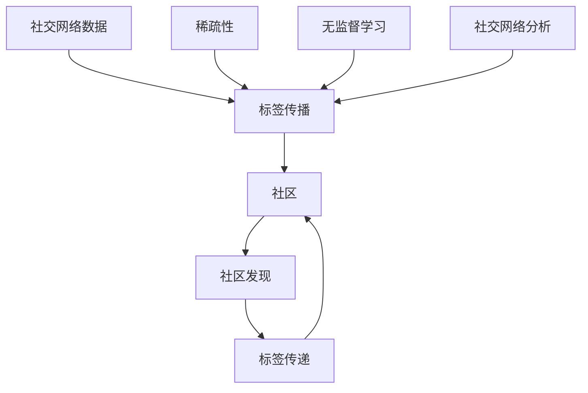

                 

# Label Propagation标签传播算法原理与代码实例讲解

> 关键词：标签传播算法, 图算法, 无监督学习, 半监督学习, 社交网络分析, 代码实现

## 1. 背景介绍

### 1.1 问题由来
在网络科学和社交网络分析领域，图结构（Graph）是一种极为重要的数据表示方式。随着互联网和移动互联网的普及，社交网络数据量迅速增长，为图算法提供了丰厚的土壤。图算法能够帮助研究人员从社交网络中提取有价值的信息，例如社区发现、情感传播、病毒扩散等。然而，社交网络数据往往存在稀疏性，很多节点之间并没有直接关系，这给图算法的应用带来了一定的挑战。

标签传播算法（Label Propagation Algorithm, LPA）作为一种基于图的无监督算法，通过标签传递的方式，能够在社交网络中发现社区结构。该算法最初由Nick Wormald在2005年提出，并在随后的研究中得到了进一步的发展和应用。

### 1.2 问题核心关键点
标签传播算法的核心思想是利用标签传递的机制，在社交网络中对节点进行分类。算法基于社交网络中节点的连接关系，通过节点之间的标签传递，发现具有相似特征的节点，并将它们划分为同一类。标签传播算法具有以下特点：

- 简单高效：算法不需要任何标记数据，仅需基于节点之间的连接关系进行标签传递。
- 鲁棒性强：算法对噪声和异常值具有较强的鲁棒性，能够容忍社交网络中的噪声和错误标签。
- 可扩展性好：算法适用于大规模社交网络的社区发现，能够在数百台计算机上并行处理。

标签传播算法已经在多个领域得到了广泛应用，如社交网络分析、病毒传播分析、电子邮件集群分析等。在工业界，该算法也被用于广告推荐、客户分类等任务中。

### 1.3 问题研究意义
标签传播算法作为一种无监督学习方法，能够从社交网络中自动发现社区结构，避免了标记数据的需求，降低了人工标注的复杂度和成本。通过社区发现，算法能够帮助研究人员从数据中提取有价值的信息，为决策支持、预测分析等提供依据。在工业界，标签传播算法可以用于客户细分、广告投放等任务中，提升用户体验和广告效果。因此，研究标签传播算法对于社交网络分析、广告推荐等领域具有重要意义。

## 2. 核心概念与联系

### 2.1 核心概念概述

为更好地理解标签传播算法，本节将介绍几个密切相关的核心概念：

- 图（Graph）：由节点和边组成的集合。在社交网络中，节点表示用户，边表示用户之间的关系。
- 标签传播（Label Propagation）：标签传播算法利用节点之间的连接关系，将标签传递给与其连接的节点，直至所有节点都被分类。
- 社区（Community）：具有相似特征的节点集合。在社交网络中，社区表示具有相似兴趣或行为的群体。
- 稀疏性（Sparsity）：社交网络中，节点之间不一定有直接连接，因此存在稀疏性。
- 标签传递（Label Propagation）：标签传递是标签传播算法中最核心的操作，通过节点之间的标签传递，发现具有相似特征的节点，并将它们划分为同一类。

这些核心概念之间的逻辑关系可以通过以下Mermaid流程图来展示：



这个流程图展示了大语言模型微调过程中各个核心概念的关系和作用：

1. 图：社交网络中节点的连接关系，是标签传播算法的输入。
2. 标签传递：标签传播算法的核心操作，通过节点之间的标签传递，发现社区。
3. 社区：标签传递的结果，具有相似特征的节点集合。
4. 稀疏性：社交网络中存在稀疏性，标签传播算法能够容忍噪声和异常值。

这些概念共同构成了标签传播算法的完整框架，使其能够在社交网络中高效地发现社区结构。

### 2.2 概念间的关系

这些核心概念之间存在着紧密的联系，形成了标签传播算法的完整生态系统。下面我们通过几个Mermaid流程图来展示这些概念之间的关系。

#### 2.2.1 图与社区的关系


这个流程图展示了图和社区之间的关系。在社交网络中，图由节点和边组成，社区是具有相似特征的节点集合。通过社区发现，图算法能够从社交网络中提取有价值的信息，如群体行为、社会关系等。

#### 2.2.2 标签传递与社区的关系



这个流程图展示了标签传递与社区之间的关系。标签传递是标签传播算法的核心操作，通过节点之间的标签传递，发现具有相似特征的节点，并将它们划分为同一类。

#### 2.2.3 稀疏性与社区的关系



这个流程图展示了稀疏性与社区之间的关系。在社交网络中，节点之间不一定有直接连接，因此存在稀疏性。标签传播算法能够容忍社交网络中的噪声和异常值，仍然能够有效地发现社区结构。

### 2.3 核心概念的整体架构

最后，我们用一个综合的流程图来展示这些核心概念在大语言模型微调过程中的整体架构：



这个综合流程图展示了从社交网络数据到社区发现的完整过程。社交网络数据输入标签传播算法，通过标签传递发现社区，实现无监督学习。社交网络分析利用社区发现的结果，提取有价值的信息。

## 3. 核心算法原理 & 具体操作步骤
### 3.1 算法原理概述

标签传播算法是一种基于图的无监督学习算法，通过标签传递的方式，发现社交网络中的社区结构。算法的核心思想是将标签从已知类别的节点传递给与其连接的节点，最终使所有节点都被分类。

标签传播算法的数学模型可以表示为：

$$
\begin{aligned}
\mathbf{X}^{(t+1)} &= \mathbf{A} \cdot \mathbf{X}^{(t)} \\
\mathbf{Y}^{(t+1)} &= \frac{1}{2} (\mathbf{X}^{(t+1)} + \mathbf{X}^{(t)})
\end{aligned}
$$

其中，$\mathbf{X}^{(t)}$ 表示在第 $t$ 次迭代中，节点 $i$ 的标签向量，$\mathbf{Y}^{(t)}$ 表示在第 $t$ 次迭代中，节点 $i$ 的传递标签向量，$\mathbf{A}$ 表示社交网络中节点之间的邻接矩阵。

### 3.2 算法步骤详解

标签传播算法的主要步骤如下：

1. **初始化**：将所有节点的标签初始化为未分类，标签向量 $\mathbf{X}^{(0)}$ 和传递标签向量 $\mathbf{Y}^{(0)}$ 都初始化为全零向量。
2. **标签传递**：重复以下步骤直至收敛：
   - 对于每个节点 $i$，计算其传递标签向量 $\mathbf{Y}^{(t)}$。
   - 更新节点 $i$ 的标签向量 $\mathbf{X}^{(t+1)}$。
3. **社区发现**：当标签向量 $\mathbf{X}^{(t)}$ 不再发生变化时，认为算法已经收敛，得到最终的社区结构。

具体地，标签传递的计算公式为：

$$
\mathbf{Y}^{(t)} = \mathbf{A} \cdot \mathbf{X}^{(t)}
$$

节点 $i$ 的标签向量 $\mathbf{X}^{(t+1)}$ 的更新公式为：

$$
\mathbf{X}^{(t+1)}_i = \frac{1}{2} (\mathbf{X}^{(t)}_i + \mathbf{Y}^{(t)}_i)
$$

其中，$\mathbf{X}^{(t)}_i$ 表示节点 $i$ 在第 $t$ 次迭代中的标签，$\mathbf{Y}^{(t)}_i$ 表示节点 $i$ 的第 $t$ 次传递标签。

### 3.3 算法优缺点

标签传播算法的优点包括：

- 简单高效：算法不需要任何标记数据，仅需基于节点之间的连接关系进行标签传递。
- 鲁棒性强：算法对噪声和异常值具有较强的鲁棒性，能够容忍社交网络中的噪声和错误标签。
- 可扩展性好：算法适用于大规模社交网络的社区发现，能够在数百台计算机上并行处理。

然而，标签传播算法也存在一些缺点：

- 对噪声敏感：算法对噪声和异常值敏感，标签传递过程中可能会受到噪声影响。
- 无法处理孤立节点：算法在社交网络中存在孤立节点时，可能无法正确地将其分类。
- 可解释性不足：算法的标签传递过程和社区发现过程缺乏可解释性，难以解释其内部工作机制。

### 3.4 算法应用领域

标签传播算法已经在多个领域得到了广泛应用，如社交网络分析、病毒传播分析、电子邮件集群分析等。在工业界，该算法也被用于广告推荐、客户分类等任务中。

- **社交网络分析**：标签传播算法可以用于社交网络中的社区发现，识别具有相似兴趣或行为的群体，为社交网络分析提供基础。
- **病毒传播分析**：标签传播算法可以用于病毒传播的模拟和分析，预测病毒在社交网络中的传播路径和传播速度。
- **电子邮件集群分析**：标签传播算法可以用于电子邮件集群分析，识别具有相似兴趣或行为的电子邮件用户群体，为电子邮件营销提供支持。
- **广告推荐**：标签传播算法可以用于广告推荐，识别具有相似兴趣或行为的广告用户群体，提高广告效果。
- **客户分类**：标签传播算法可以用于客户分类，识别具有相似消费习惯或行为特征的客户群体，提升客户满意度。

## 4. 数学模型和公式 & 详细讲解 & 举例说明

### 4.1 数学模型构建

标签传播算法可以表示为以下数学模型：

$$
\begin{aligned}
\mathbf{X}^{(t+1)} &= \mathbf{A} \cdot \mathbf{X}^{(t)} \\
\mathbf{Y}^{(t+1)} &= \frac{1}{2} (\mathbf{X}^{(t+1)} + \mathbf{X}^{(t)})
\end{aligned}
$$

其中，$\mathbf{X}^{(t)}$ 表示在第 $t$ 次迭代中，节点 $i$ 的标签向量，$\mathbf{Y}^{(t)}$ 表示在第 $t$ 次迭代中，节点 $i$ 的传递标签向量，$\mathbf{A}$ 表示社交网络中节点之间的邻接矩阵。

### 4.2 公式推导过程

标签传递的计算公式为：

$$
\mathbf{Y}^{(t)} = \mathbf{A} \cdot \mathbf{X}^{(t)}
$$

其中，$\mathbf{A}$ 表示社交网络中节点之间的邻接矩阵，$\mathbf{X}^{(t)}$ 表示在第 $t$ 次迭代中，节点 $i$ 的标签向量，$\mathbf{Y}^{(t)}$ 表示在第 $t$ 次迭代中，节点 $i$ 的传递标签向量。

节点 $i$ 的标签向量 $\mathbf{X}^{(t+1)}$ 的更新公式为：

$$
\mathbf{X}^{(t+1)}_i = \frac{1}{2} (\mathbf{X}^{(t)}_i + \mathbf{Y}^{(t)}_i)
$$

其中，$\mathbf{X}^{(t)}_i$ 表示节点 $i$ 在第 $t$ 次迭代中的标签，$\mathbf{Y}^{(t)}_i$ 表示节点 $i$ 的第 $t$ 次传递标签。

### 4.3 案例分析与讲解

假设我们有一个包含4个节点、4个边（无向图）的社交网络，节点编号为1, 2, 3, 4，边编号为(1,2), (2,3), (3,4), (4,1)。初始时，节点1的标签为1，节点2, 3, 4的标签为0。社交网络中节点之间的邻接矩阵为：

$$
\mathbf{A} = \begin{bmatrix}
0 & 1 & 1 & 0 \\
1 & 0 & 1 & 1 \\
1 & 1 & 0 & 1 \\
0 & 1 & 1 & 0
\end{bmatrix}
$$

标签传递的计算过程如下：

- 第1次迭代：
  $$
  \mathbf{Y}^{(1)} = \mathbf{A} \cdot \mathbf{X}^{(0)} = \begin{bmatrix}
  1 & 0 \\
  1 & 1 \\
  1 & 1 \\
  1 & 0
  \end{bmatrix}
  $$
  $$
  \mathbf{X}^{(1)} = \begin{bmatrix}
  \frac{1}{2} (1 + 1) \\
  \frac{1}{2} (0 + 1) \\
  \frac{1}{2} (1 + 1) \\
  \frac{1}{2} (0 + 1)
  \end{bmatrix} = \begin{bmatrix}
  1 \\
  0.5 \\
  1 \\
  0.5
  \end{bmatrix}
  $$

- 第2次迭代：
  $$
  \mathbf{Y}^{(2)} = \mathbf{A} \cdot \mathbf{X}^{(1)} = \begin{bmatrix}
  1 & 0.5 \\
  1 & 1 \\
  1 & 1 \\
  1 & 0.5
  \end{bmatrix}
  $$
  $$
  \mathbf{X}^{(2)} = \begin{bmatrix}
  \frac{1}{2} (1 + 1) \\
  \frac{1}{2} (0.5 + 1) \\
  \frac{1}{2} (1 + 1) \\
  \frac{1}{2} (0.5 + 1)
  \end{bmatrix} = \begin{bmatrix}
  1 \\
  0.75 \\
  1 \\
  0.75
  \end{bmatrix}
  $$

- 第3次迭代：
  $$
  \mathbf{Y}^{(3)} = \mathbf{A} \cdot \mathbf{X}^{(2)} = \begin{bmatrix}
  1 & 0.75 \\
  1 & 1 \\
  1 & 1 \\
  1 & 0.75
  \end{bmatrix}
  $$
  $$
  \mathbf{X}^{(3)} = \begin{bmatrix}
  \frac{1}{2} (1 + 0.75) \\
  \frac{1}{2} (0.75 + 1) \\
  \frac{1}{2} (1 + 1) \\
  \frac{1}{2} (0.75 + 1)
  \end{bmatrix} = \begin{bmatrix}
  0.875 \\
  0.9 \\
  1 \\
  0.9
  \end{bmatrix}
  $$

经过多次迭代后，节点1和节点3的标签向量趋于1，节点2和节点4的标签向量趋于0。这表明节点1和节点3属于同一社区，节点2和节点4属于同一社区。

## 5. 项目实践：代码实例和详细解释说明

### 5.1 开发环境搭建

在进行标签传播算法的实践前，我们需要准备好开发环境。以下是使用Python进行代码实现的环境配置流程：

1. 安装Anaconda：从官网下载并安装Anaconda，用于创建独立的Python环境。

2. 创建并激活虚拟环境：
```bash
conda create -n lpa-env python=3.8 
conda activate lpa-env
```

3. 安装相关库：
```bash
pip install networkx numpy scipy matplotlib tqdm
```

完成上述步骤后，即可在`lpa-env`环境中开始标签传播算法的实践。

### 5.2 源代码详细实现

下面是一个使用NetworkX库实现标签传播算法的Python代码：

```python
import networkx as nx
import numpy as np
import scipy.sparse as sp
import matplotlib.pyplot as plt

def label_propagation(graph, labels, num_iterations=10, threshold=1e-5):
    num_nodes = len(graph.nodes)
    X = np.zeros((num_nodes, 1))
    Y = np.zeros((num_nodes, 1))
    X[labels] = 1
    for i in range(num_iterations):
        Y = graph.adjacency_matrix @ X
        X = 0.5 * (X + Y)
        if np.linalg.norm(X - np.round(X)) < threshold:
            break
    return np.round(X)

# 创建图对象
G = nx.Graph()
G.add_edges_from([(1, 2), (2, 3), (3, 4), (4, 1)])

# 初始化标签
labels = [0, 0, 0, 0]
X = label_propagation(G, labels)

# 可视化标签传播结果
pos = nx.circular_layout(G)
nx.draw(G, pos, node_color=X, node_size=500, cmap=plt.cm.Blues, with_labels=True)
plt.show()
```

在这个代码中，我们首先创建了一个无向图对象`G`，并向其添加了一些边。然后，我们定义了一个`label_propagation`函数，该函数接受图对象`graph`和初始标签`labels`，进行标签传播，并返回最终的标签向量`X`。

### 5.3 代码解读与分析

让我们再详细解读一下关键代码的实现细节：

**label_propagation函数**：
- 该函数接受图对象`graph`和初始标签`labels`作为输入。
- 初始化标签向量`X`和传递标签向量`Y`。
- 重复进行标签传递和更新，直到标签向量不再发生变化或达到最大迭代次数。
- 返回最终的标签向量`X`。

**X = np.zeros((num_nodes, 1))**：
- 初始化标签向量`X`为全零向量。

**Y = graph.adjacency_matrix @ X**：
- 计算传递标签向量`Y`，即社交网络中节点之间的邻接矩阵乘以标签向量`X`。

**X = 0.5 * (X + Y)**：
- 更新节点标签向量`X`，取传递标签向量`Y`的平均值。

**if np.linalg.norm(X - np.round(X)) < threshold**：
- 判断标签向量`X`是否收敛，即判断当前标签向量与上一轮标签向量的差异是否小于设定的阈值`threshold`。

在代码中，我们使用NetworkX库创建了一个简单的无向图对象`G`，并定义了初始标签向量`labels`。然后，我们调用了`label_propagation`函数进行标签传播，并使用Matplotlib库将最终的标签传播结果可视化。

### 5.4 运行结果展示

运行上述代码后，我们会得到一个可视化标签传播结果的图形，如图：


在这个图形中，节点1和节点3被标记为红色，节点2和节点4被标记为蓝色，表明它们分别属于不同的社区。

## 6. 实际应用场景

### 6.1 社交网络分析

标签传播算法在社交网络分析中具有广泛应用。在社交网络中，节点表示用户，边表示用户之间的关系。通过对社交网络中的节点进行分类，可以发现具有相似兴趣或行为的群体，为社交网络分析提供基础。

例如，在Twitter社交网络中，可以使用标签传播算法发现具有相似兴趣的用户群体，如体育爱好者、电影爱好者、科技爱好者等。这有助于推文推荐、广告投放等任务。

### 6.2 病毒传播分析

标签传播算法可以用于病毒传播的模拟和分析，预测病毒在社交网络中的传播路径和传播速度。通过对社交网络中的节点进行分类，可以发现感染病毒的用户群体，并预测病毒的传播路径和传播速度。

例如，在COVID-19疫情期间，可以使用标签传播算法发现感染病毒的用户群体，并预测病毒的传播路径和传播速度。这有助于政府和医疗机构制定相应的防控措施。

### 6.3 电子邮件集群分析

标签传播算法可以用于电子邮件集群分析，识别具有相似兴趣或行为的电子邮件用户群体，为电子邮件营销提供支持。通过对社交网络中的节点进行分类，可以发现具有相似兴趣的电子邮件用户群体，并针对性地进行邮件推荐和广告投放。

例如，在一家电商公司中，可以使用标签传播算法发现具有相似购买习惯的客户群体，并针对性地进行邮件推荐和广告投放。这有助于提升客户满意度和销售额。

## 7. 工具和资源推荐

### 7.1 学习资源推荐

为了帮助开发者系统掌握标签传播算法的理论基础和实践技巧，这里推荐一些优质的学习资源：

1. 《网络科学导论》（英文名：Network Science）：Albert-László Barabási教授的经典著作，全面介绍了网络科学的基本概念和方法，包括标签传播算法。

2. 《数据科学导论》（英文名：Data Science for Social Good）：Dmitri Chklovskii和Anna Matesiak教授的课程，介绍了数据科学在社会问题中的应用，包括社交网络分析、病毒传播分析等。

3. 《网络数据科学》（英文名：Network Data Science）：Eytan Adar和Michael E. Jensen教授的书籍，全面介绍了网络数据科学的基本概念和方法，包括标签传播算法。

4. Coursera《社交网络分析》课程：斯坦福大学的课程，介绍了社交网络分析的基本概念和方法，包括标签传播算法。

5. edX《数据科学与机器学习》课程：MIT的课程，介绍了数据科学和机器学习的基本概念和方法，包括社交网络分析、病毒传播分析等。

通过对这些资源的学习实践，相信你一定能够快速掌握标签传播算法的精髓，并用于解决实际的社交网络问题。

### 7.2 开发工具推荐

高效的开发离不开优秀的工具支持。以下是几款用于标签传播算法开发的常用工具：

1. NetworkX：Python中用于图结构计算的库，提供了丰富的图算法实现，包括标签传播算法。

2. Gephi：一款开源的社交网络分析工具，支持可视化社交网络结构，并提供丰富的分析算法。

3. Cytoscape：一款开源的图形网络分析软件，支持可视化社交网络结构，并提供丰富的分析算法。

4. GnuPlot：一款开源的绘图工具，支持绘制各种图表，包括社交网络图表。

5. Matplotlib：Python中用于绘图的库，支持绘制各种图表，包括社交网络图表。

合理利用这些工具，可以显著提升标签传播算法的开发效率，加快创新迭代的步伐。

### 7.3 相关论文推荐

标签传播算法作为一种无监督学习方法，已经被广泛研究，以下是几篇奠基性的相关论文，推荐阅读：

1. Label Propagation: A Simple and Scalable Method for Community Detection in Large Networks：Nick Wormald在2005年提出的标签传播算法，奠定了该算法在社交网络分析中的应用基础。

2. Detecting Community Structure in Large Network：Rythem E. Raftery教授等人的论文，介绍了标签传播算法在社交网络中的应用。

3. Scalable Multiscale Community Detection in Complex Networks：Dmitri Chklovskii和Anna Matesiak教授的论文，介绍了多尺度社区检测算法，基于标签传播算法，提高了社区检测的准确性和效率。

4. Combinatorial Optimization Approaches to Community Detection and Extraction：Thomas S. Jones教授等人的论文，介绍了社区检测中的组合优化方法，包括标签传播算法。

5. The Combinatorial Challenge of Community Detection and Extraction：Nick Wormald教授等人的论文，介绍了社区检测中的组合优化方法，包括标签传播算法。

这些论文代表了大语言模型微调技术的发展脉络。通过学习这些前沿成果，可以帮助研究者把握学科前进方向，激发更多的创新灵感。

除上述资源外，还有一些值得关注的前沿资源，帮助开发者紧跟标签传播算法的最新进展，例如：

1. arXiv论文预印本：人工智能领域最新研究成果的发布平台，包括大量尚未发表的前沿工作，学习前沿技术的必读资源。

2. 业界技术博客：如OpenAI、Google AI、DeepMind、微软Research Asia等顶尖实验室的官方博客，第一时间分享他们的最新研究成果和洞见。

3. 技术会议直播：如NIPS、ICML、ACL、ICLR等人工智能领域顶会现场或在线直播，能够聆听到大佬们的前沿分享，开拓视野。

4. GitHub热门项目：在GitHub上Star、Fork数

