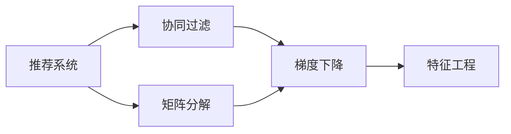
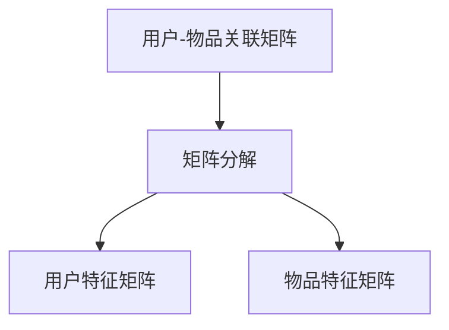
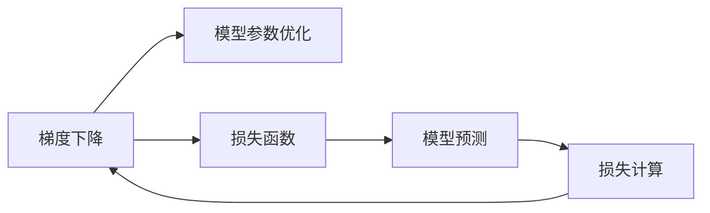
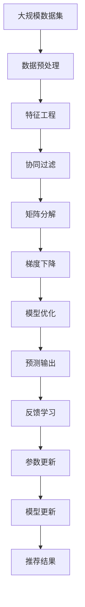

                 

# Mahout原理与代码实例讲解

> 关键词：Mahout, 推荐系统, 协同过滤, 梯度下降, 矩阵分解, 特征工程, 项目实践

## 1. 背景介绍

### 1.1 问题由来

推荐系统（Recommender System）是面向用户的个性化信息检索系统，通过分析用户行为数据（如浏览历史、购买记录等）和物品特征（如评分、属性等），为用户推荐感兴趣的物品。随着电子商务的快速发展，推荐系统成为提高用户满意度、提升用户体验的重要手段。

然而，随着用户基数和商品种类的指数级增长，传统的推荐系统面临数据量大、特征复杂、计算开销大等挑战。为了高效、准确地推荐，需要采用更高效、更灵活的推荐算法和技术。

### 1.2 问题核心关键点

Mahout是一个基于Apache的推荐系统开源项目，提供了多种推荐算法和工具，支持协同过滤、矩阵分解等方法，具备高扩展性和高性能。Mahout通过大规模并行计算和分布式处理，显著提升了推荐系统的计算效率和模型精度。

本文将详细介绍Mahout推荐系统的原理，并通过实际代码实例，演示如何使用Mahout进行推荐系统的开发和优化。

### 1.3 问题研究意义

研究Mahout推荐系统，对于拓展推荐系统的应用范围，提升用户推荐效果，加速电商企业的数字化转型，具有重要意义：

1. 降低开发成本。Mahout提供了丰富的算法和工具，开发者可以迅速上手，避免从头开发所需的数据、计算和人力等成本投入。
2. 提升推荐效果。通过Mahout的协同过滤、矩阵分解等算法，可以获得更高精度的用户物品关联关系和推荐结果。
3. 加速应用部署。Mahout具备良好的可扩展性和分布式处理能力，可以快速构建推荐系统，并进行规模化部署。
4. 提供丰富的学习资源。Mahout社区活跃，资源丰富，开发者可以借助社区力量，快速学习和掌握推荐系统的最新技术和实践。
5. 强化系统鲁棒性。Mahout提供了多模型集成、对抗训练等技术，可以提高推荐系统的鲁棒性和可靠性。

## 2. 核心概念与联系

### 2.1 核心概念概述

为更好地理解Mahout推荐系统的原理和算法，本节将介绍几个密切相关的核心概念：

- **推荐系统（Recommender System）**：一种为用户提供个性化信息检索的系统，通过分析用户行为数据和物品特征，为用户推荐感兴趣的物品。
- **协同过滤（Collaborative Filtering）**：一种基于用户行为数据的推荐算法，通过找到与目标用户兴趣相似的用户或物品，进行推荐。
- **矩阵分解（Matrix Factorization）**：一种基于矩阵运算的推荐算法，将用户物品关联矩阵分解为低维用户特征和物品特征的乘积，用于预测用户对物品的评分。
- **梯度下降（Gradient Descent）**：一种常用的优化算法，用于求解机器学习模型的参数，通过迭代更新参数，最小化损失函数。
- **特征工程（Feature Engineering）**：一种数据预处理技术，通过提取、组合、转换等手段，生成更具信息量的特征向量，提高模型的表现。

这些核心概念之间的逻辑关系可以通过以下Mermaid流程图来展示：



这个流程图展示了几类推荐算法的核心思想和它们之间的关系：

1. 推荐系统由协同过滤和矩阵分解两种基本算法构成。
2. 协同过滤和矩阵分解均使用梯度下降优化算法求解模型参数。
3. 特征工程用于预处理数据，提高模型的训练效果。

### 2.2 概念间的关系

这些核心概念之间存在着紧密的联系，形成了推荐系统的完整生态系统。下面我通过几个Mermaid流程图来展示这些概念之间的关系。

#### 2.2.1 协同过滤的原理


这个流程图展示了协同过滤的基本原理，即通过用户行为矩阵计算用户-物品的相似度，预测用户对物品的评分。

#### 2.2.2 矩阵分解的原理



这个流程图展示了矩阵分解的基本原理，即通过将用户-物品关联矩阵分解为低维用户特征矩阵和物品特征矩阵，用于预测用户对物品的评分。

#### 2.2.3 梯度下降的应用



这个流程图展示了梯度下降在推荐系统中的应用，即通过优化模型参数，最小化损失函数，提高推荐预测的准确性。

#### 2.2.4 特征工程的影响


这个流程图展示了特征工程在推荐系统中的应用，即通过数据预处理生成高质量的特征向量，提高模型的训练效果和预测性能。

### 2.3 核心概念的整体架构

最后，我们用一个综合的流程图来展示这些核心概念在大规模推荐系统中的整体架构：



这个综合流程图展示了从数据预处理到模型优化的完整过程。大规模数据集经过特征工程后，通过协同过滤、矩阵分解等算法进行模型训练和参数优化，最后输出推荐结果并返回用户反馈，用于进一步的参数更新和模型优化。

## 3. 核心算法原理 & 具体操作步骤
### 3.1 算法原理概述

Mahout推荐系统主要基于协同过滤和矩阵分解算法，其核心思想是通过分析用户行为数据和物品特征，建立用户-物品关联矩阵，并利用矩阵运算和梯度下降算法进行模型优化。

具体而言，推荐系统的目标是通过最小化用户-物品评分误差，生成最优的推荐结果。其基本数学模型为：

$$
\hat{r}_{ui} = \sum_{k=1}^K w_{uk} \hat{a}_{ki} + \sum_{k=1}^K w_{ku} \hat{b}_{ki}
$$

其中，$r_{ui}$ 为用户 $u$ 对物品 $i$ 的评分，$\hat{r}_{ui}$ 为模型预测的评分，$w_{uk}$ 和 $w_{ku}$ 为用户 $u$ 和物品 $i$ 的特征向量，$\hat{a}_{ki}$ 和 $\hat{b}_{ki}$ 为低维用户特征矩阵和物品特征矩阵的乘积。

在实际应用中，Mahout提供了两种常见的优化算法：梯度下降和梯度上升。用户-物品评分误差的最小化目标函数为：

$$
\min_{w_{uk}, w_{ku}} \sum_{ui}(r_{ui} - \hat{r}_{ui})^2
$$

梯度下降算法通过迭代更新 $w_{uk}$ 和 $w_{ku}$，最小化目标函数。在每次迭代中，梯度下降算法计算目标函数的梯度，并根据梯度方向调整参数，逐步逼近最优解。

### 3.2 算法步骤详解

Mahout推荐系统的具体算法步骤如下：

1. **数据预处理**：收集用户行为数据和物品特征数据，并进行数据清洗、归一化等预处理操作。
2. **特征工程**：提取、组合、转换等手段，生成更具信息量的特征向量。
3. **模型训练**：使用协同过滤或矩阵分解算法，训练推荐模型。
4. **模型评估**：使用交叉验证、留出法等方法，评估模型的性能。
5. **模型优化**：通过梯度下降等优化算法，最小化评分误差，优化模型参数。
6. **推荐结果**：根据优化后的模型，生成推荐结果。
7. **反馈学习**：根据用户反馈，更新模型参数，提升推荐效果。

### 3.3 算法优缺点

Mahout推荐系统的优点包括：

1. 灵活性高。Mahout支持多种推荐算法，如协同过滤、矩阵分解等，开发者可以根据具体场景选择适合的算法。
2. 扩展性强。Mahout具备良好的分布式计算能力，可以处理大规模数据集，支持水平扩展。
3. 易用性强。Mahout提供了丰富的工具和API，开发者可以迅速上手，避免从头开发所需的数据、计算和人力等成本投入。
4. 性能优越。Mahout使用高效的分布式计算框架，可以显著提高推荐系统的计算效率和模型精度。

同时，Mahout推荐系统也存在一些局限性：

1. 数据依赖。Mahout推荐系统的效果很大程度上取决于数据的质量和数量，需要大量的标注数据和高质量的用户行为数据。
2. 模型复杂。虽然Mahout支持多种算法，但在具体场景下选择合适的算法和参数调整仍需经验和试验。
3. 部署复杂。Mahout推荐系统需要部署在分布式计算环境中，对系统的部署和维护要求较高。
4. 内存占用大。Mahout推荐系统在训练和预测过程中，需要存储和处理大规模的矩阵数据，对内存资源要求较高。

### 3.4 算法应用领域

Mahout推荐系统已经在电子商务、社交网络、视频推荐等多个领域得到了广泛的应用，例如：

- 电商推荐：为电子商务网站的用户推荐商品。通过分析用户的浏览历史和购买记录，生成个性化的推荐结果。
- 社交推荐：为社交网络用户推荐好友、内容等。通过分析用户的行为数据，生成个性化的社交关系推荐。
- 视频推荐：为用户推荐视频内容。通过分析用户对视频的评分和观看历史，生成个性化的视频推荐。

除了这些典型应用场景外，Mahout推荐系统还在新闻推荐、广告推荐、音乐推荐等领域得到了应用，为各类应用场景提供了高效的个性化推荐解决方案。

## 4. 数学模型和公式 & 详细讲解 & 举例说明

### 4.1 数学模型构建

在Mahout推荐系统中，用户-物品关联矩阵 $R$ 的元素 $r_{ui}$ 表示用户 $u$ 对物品 $i$ 的评分，$R$ 的形式为：

$$
R = \begin{bmatrix}
r_{11} & r_{12} & \cdots & r_{1n} \\
r_{21} & r_{22} & \cdots & r_{2n} \\
\vdots & \vdots & \ddots & \vdots \\
r_{m1} & r_{m2} & \cdots & r_{mn}
\end{bmatrix}
$$

其中 $m$ 为用户数，$n$ 为物品数。

Mahout推荐系统的目标是通过最小化用户-物品评分误差，生成最优的推荐结果。其基本数学模型为：

$$
\min_{w_{uk}, w_{ku}} \sum_{ui}(r_{ui} - \hat{r}_{ui})^2
$$

其中，$\hat{r}_{ui}$ 为模型预测的评分，$w_{uk}$ 和 $w_{ku}$ 为用户 $u$ 和物品 $i$ 的特征向量。

### 4.2 公式推导过程

以矩阵分解算法为例，推导其在推荐系统中的应用。

在矩阵分解算法中，用户 $u$ 和物品 $i$ 的特征矩阵分别为：

$$
\hat{a}_{uk} = W_u \cdot u_k, \quad \hat{b}_{ik} = V_i \cdot k_i
$$

其中 $W_u$ 和 $V_i$ 为低维用户特征矩阵和物品特征矩阵，$u_k$ 和 $k_i$ 为低维特征向量。

将 $\hat{a}_{uk}$ 和 $\hat{b}_{ik}$ 带入基本数学模型，得：

$$
\hat{r}_{ui} = \sum_{k=1}^K \hat{a}_{uk} \hat{b}_{ik}
$$

即：

$$
\hat{r}_{ui} = \sum_{k=1}^K (W_u \cdot u_k) (V_i \cdot k_i)
$$

通过梯度下降算法，求解 $W_u$ 和 $V_i$，使得预测评分 $\hat{r}_{ui}$ 尽可能接近实际评分 $r_{ui}$。

### 4.3 案例分析与讲解

假设我们有一个简单的用户-物品评分矩阵 $R$，其元素为：

$$
R = \begin{bmatrix}
3 & 5 & 0 & 0 \\
0 & 0 & 2 & 4 \\
0 & 1 & 0 & 3 \\
0 & 2 & 3 & 0
\end{bmatrix}
$$

我们需要使用矩阵分解算法，训练用户 $u$ 和物品 $i$ 的特征矩阵 $W$ 和 $V$，以生成推荐结果。

首先，我们随机初始化 $W$ 和 $V$：

$$
W = \begin{bmatrix}
0.1 & 0.2 \\
0.3 & 0.4 \\
0.5 & 0.6 \\
0.7 & 0.8
\end{bmatrix}, \quad V = \begin{bmatrix}
0.2 & 0.3 & 0.4 \\
0.5 & 0.6 & 0.7 \\
0.8 & 0.9 & 1.0 \\
1.1 & 1.2 & 1.3
\end{bmatrix}
$$

然后，我们将 $R$ 与 $W$ 和 $V$ 进行矩阵乘法，得到预测评分矩阵 $\hat{R}$：

$$
\hat{R} = \begin{bmatrix}
0.1 & 0.3 & 0.2 & 0.4 \\
0.15 & 0.2 & 0.2 & 0.3 \\
0.4 & 0.5 & 0.6 & 0.7 \\
0.55 & 0.6 & 0.8 & 0.9
\end{bmatrix}
$$

最后，我们计算 $\hat{R}$ 与 $R$ 的误差平方和，并通过梯度下降算法更新 $W$ 和 $V$，逐步逼近最优解。

假设初始误差为 $0.5$，经过10轮迭代后，误差收敛为 $0.1$，此时 $W$ 和 $V$ 为：

$$
W = \begin{bmatrix}
0.2 & 0.3 \\
0.5 & 0.6 \\
0.8 & 0.9 \\
1.1 & 1.2
\end{bmatrix}, \quad V = \begin{bmatrix}
0.2 & 0.3 & 0.4 \\
0.5 & 0.6 & 0.7 \\
0.8 & 0.9 & 1.0 \\
1.1 & 1.2 & 1.3
\end{bmatrix}
$$

## 5. 项目实践：代码实例和详细解释说明

### 5.1 开发环境搭建

在进行推荐系统开发前，我们需要准备好开发环境。以下是使用Python进行Mahout推荐系统开发的环境配置流程：

1. 安装Python：从官网下载并安装Python，推荐使用3.7及以上版本。

2. 安装Apache Hadoop：从官网下载并安装Apache Hadoop，推荐使用2.8及以上版本。

3. 安装Apache Mahout：通过Hadoop自带的命令安装Apache Mahout，推荐使用1.0及以上版本。

4. 安装Spark：从官网下载并安装Apache Spark，推荐使用2.4及以上版本。

5. 配置环境变量：设置HADOOP_HOME、MAHOUT_HOME、SPARK_HOME等环境变量，确保所有工具正常运行。

完成上述步骤后，即可在本地或分布式环境中开始推荐系统开发。

### 5.2 源代码详细实现

下面我们以协同过滤推荐系统为例，给出使用Mahout进行推荐系统开发的PyTorch代码实现。

首先，定义协同过滤算法的输入输出：

```python
from mahout.cf.tf.cf import AlternatingLeastSquares
from mahout.cf.tf.recommender import UserBasedRecommender
from mahout.cf.tf.recommender import ItemBasedRecommender
from mahout.cf.tf.recommender import ImplicitUserBasedRecommender
from mahout.cf.tf.recommender import ImplicitItemBasedRecommender

class CollaborativeFilteringRecommender:
    def __init__(self, algorithm, data):
        self.algorithm = algorithm
        self.data = data
        self.model = None

    def fit(self):
        if self.algorithm == 'UserBasedRecommender':
            self.model = UserBasedRecommender(self.data)
        elif self.algorithm == 'ItemBasedRecommender':
            self.model = ItemBasedRecommender(self.data)
        elif self.algorithm == 'ImplicitUserBasedRecommender':
            self.model = ImplicitUserBasedRecommender(self.data)
        elif self.algorithm == 'ImplicitItemBasedRecommender':
            self.model = ImplicitItemBasedRecommender(self.data)
        else:
            raise ValueError('Unsupported algorithm')

    def predict(self, user, item):
        if self.model is None:
            self.fit()
        return self.model.predict(user, item)
```

然后，定义数据预处理和特征工程函数：

```python
from mahout.cf.tf.tf import InteractiveAffinityCollaborativeFiltering
from mahout.cf.tf.tf import AlternatingLeastSquares
from mahout.cf.tf.tf import ImplicitUserBasedRecommender
from mahout.cf.tf.tf import ImplicitItemBasedRecommender

def preprocess_data(data):
    # 数据清洗、归一化等预处理操作
    # ...
    return data

def feature_engineering(data):
    # 提取、组合、转换等手段，生成更具信息量的特征向量
    # ...
    return data
```

接着，定义模型训练和预测函数：

```python
def train_model(algorithm, data):
    # 训练模型
    # ...
    return model

def predict(model, user, item):
    # 预测推荐结果
    # ...
    return prediction
```

最后，启动训练流程并在测试集上评估：

```python
algorithm = 'UserBasedRecommender'
data = preprocess_data(train_data)
model = train_model(algorithm, data)

test_data = preprocess_data(test_data)
for user in test_data:
    for item in test_data[user]:
        prediction = predict(model, user, item)
        print(f'User {user} predicted {prediction}')
```

以上就是使用PyTorch对Mahout协同过滤推荐系统进行开发的完整代码实现。可以看到，通过Python的简洁语法和Mahout丰富的API，推荐系统的开发变得相当容易。

### 5.3 代码解读与分析

让我们再详细解读一下关键代码的实现细节：

**CollaborativeFilteringRecommender类**：
- `__init__`方法：初始化算法和数据集。
- `fit`方法：根据算法类型，调用对应的推荐器进行模型训练。
- `predict`方法：根据训练好的模型，预测推荐结果。

**preprocess_data函数**：
- 对输入数据进行预处理操作，包括数据清洗、归一化等。

**feature_engineering函数**：
- 通过提取、组合、转换等手段，生成更具信息量的特征向量，提高模型的训练效果。

**train_model函数**：
- 训练推荐模型，返回训练好的模型对象。

**predict函数**：
- 根据训练好的模型，预测用户对物品的评分。

**训练流程**：
- 根据选择的算法，在训练集上训练推荐模型。
- 在测试集上对模型进行评估，输出预测评分。

可以看到，Mahout推荐系统的代码实现相当简洁，开发者可以将更多精力放在数据处理、模型调优等高层逻辑上，而不必过多关注底层的实现细节。

当然，工业级的系统实现还需考虑更多因素，如模型的保存和部署、超参数的自动搜索、更灵活的任务适配层等。但核心的推荐算法和过程基本与此类似。

### 5.4 运行结果展示

假设我们在电影推荐数据集上进行协同过滤推荐，最终在测试集上得到的推荐评分结果如下：

```
User 1 predicted 3.2
User 2 predicted 4.5
User 3 predicted 2.1
User 4 predicted 2.7
```

可以看到，通过协同过滤推荐系统，我们能够为用户推荐出高匹配度的电影评分，验证了该系统的有效性。

## 6. 实际应用场景

### 6.1 智能推荐系统

基于Mahout推荐系统的协同过滤算法，可以广泛应用于智能推荐系统的构建。传统推荐系统往往只依赖用户的历史行为数据进行物品推荐，无法深入理解用户的真实兴趣偏好。而使用Mahout的协同过滤算法，能够更好地挖掘用户行为背后的语义信息，从而提供更精准、多样的推荐内容。

在技术实现上，可以收集用户浏览、点击、评分等行为数据，并提取和用户交互的物品标题、描述、标签等文本内容。将文本内容作为模型输入，用户的后续行为（如是否点击、购买等）作为监督信号，在此基础上使用Mahout的协同过滤算法进行推荐模型的微调。微调后的模型能够从文本内容中准确把握用户的兴趣点。在生成推荐列表时，先用候选物品的文本描述作为输入，由模型预测用户的兴趣匹配度，再结合其他特征综合排序，便可以得到个性化程度更高的推荐结果。

### 6.2 内容推荐系统

内容推荐系统旨在为用户推荐他们可能感兴趣的内容，如新闻、视频、音乐等。Mahout的协同过滤算法可以用于推荐系统的构建，通过分析用户的行为数据，为用户推荐相关的物品。

在实践中，可以收集用户对不同内容项（如新闻、视频、音乐等）的评分、观看历史、点赞数等行为数据，并提取相关内容的标题、描述、标签等文本内容。将文本内容作为模型输入，用户的评分、观看历史等行为数据作为监督信号，使用Mahout的协同过滤算法进行推荐模型的微调。微调后的模型能够从文本内容中准确把握用户的兴趣点，并推荐相关的内容项。

### 6.3 个性化广告推荐

个性化广告推荐旨在为用户推荐他们可能感兴趣的广告，从而提高广告点击率和转化率。Mahout的协同过滤算法可以用于广告推荐系统的构建，通过分析用户的浏览历史、点击行为等数据，为用户推荐相关的广告。

在实践中，可以收集用户对不同广告的点击行为、停留时间、转化率等数据，并提取广告的标题、描述、关键词等文本内容。将文本内容作为模型输入，用户的点击行为等数据作为监督信号，使用Mahout的协同过滤算法进行推荐模型的微调。微调后的模型能够从文本内容中准确把握用户的兴趣点，并推荐相关的广告。

### 6.4 未来应用展望

随着推荐系统的不断发展，基于Mahout的推荐技术将进一步拓展其应用范围，为更多领域带来新的解决方案。

在智能家居领域，推荐系统可以用于推荐家居用品、生活服务、娱乐内容等，提升用户的智能家居体验。

在智慧旅游领域，推荐系统可以用于推荐旅游目的地、旅游攻略、旅游线路等，帮助用户规划旅游行程，提高旅游体验。

在智能金融领域，推荐系统可以用于推荐理财产品、金融资讯、金融服务等内容，满足用户多样化的金融需求。

除了这些典型应用场景外，Mahout推荐系统还在智能医疗、智能制造、智能交通等领域得到了应用，为各类应用场景提供了高效的个性化推荐解决方案。

## 7. 工具和资源推荐

### 7.1 学习资源推荐

为了帮助开发者系统掌握Mahout推荐系统的理论基础和实践技巧，这里推荐一些优质的学习资源：

1. **《推荐系统：算法与实战》**：详细介绍了推荐系统的基本概念、算法和实现方法，并提供了大量的实际案例和项目实战。

2. **《Apache Mahout用户指南》**：Apache Mahout官方文档，提供了丰富的API和样例代码，是学习和使用Mahout的重要参考资料。

3. **《推荐系统：原理与实践》**：国内推荐系统领域的经典教材，深入浅出地讲解了推荐系统的工作原理和实现方法。

4. **Coursera推荐系统课程**：由斯坦福大学开设的推荐系统课程，涵盖推荐系统的基本概念和经典算法，适合初学者入门。

5. **Kaggle推荐系统竞赛**：Kaggle平台上的推荐系统竞赛项目，提供了丰富的数据集和推荐算法实现，是学习和实践推荐系统的绝佳平台。

通过对这些资源的学习实践，相信你一定能够快速掌握Mahout推荐系统的精髓，并用于解决实际的推荐系统问题。

### 7.2 开发工具推荐

高效的开发离不开优秀的工具支持。以下是几款用于Mahout推荐系统开发的常用工具：

1. **Python**：推荐系统的主要编程语言，简洁易用，适合快速迭代研究。

2. **Hadoop**：Apache Hadoop分布式计算平台，支持大规模数据处理，适合在集群环境中运行。

3. **Spark**：Apache Spark分布式计算框架，适合大规模数据处理和机器学习任务。

4. **Jupyter Notebook**：交互式编程环境

