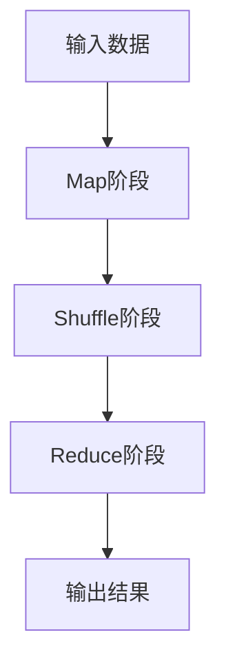
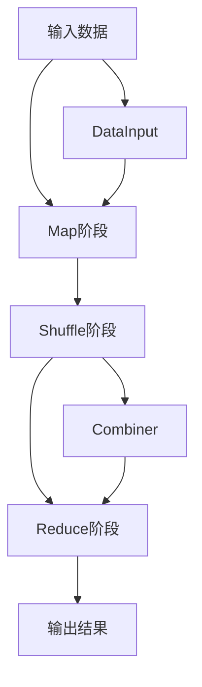

                 

# MapReduce原理与代码实例讲解

> 关键词：MapReduce,分布式计算,并行处理,大数据,大数据处理,谷歌,数据挖掘

## 1. 背景介绍

### 1.1 问题由来
随着互联网的快速发展和数据的爆炸式增长，如何高效处理大规模数据成为了大数据领域的一大挑战。传统的集中式计算模式难以处理如此庞大的数据量，亟需一种新的计算模式来适应大规模数据的处理需求。在这样的背景下，谷歌提出了MapReduce模型，用于大规模数据的分布式并行处理，极大地提升了数据处理效率和系统可靠性。

### 1.2 问题核心关键点
MapReduce的核心思想是将大规模数据处理任务分解为一系列独立且简单的子任务，通过分布式计算框架在多台计算节点上并行执行，最终将子任务的计算结果合并得到最终的输出结果。其核心步骤如下：
1. Map阶段：将大规模输入数据分为若干个小块，在每个小块上执行相同的映射函数，将映射函数的结果存放到临时文件系统中。
2. Shuffle阶段：对Map阶段输出的临时文件进行排序、合并，形成一系列有序的键值对。
3. Reduce阶段：对Shuffle阶段生成的键值对序列，执行相同的聚合函数，得到最终的结果。

MapReduce模型的优点在于：
- 分布式计算：将大规模任务分解为多个子任务，由多个计算节点并行处理，提高了计算效率。
- 容错性：通过多副本机制和冗余计算，即使某个节点故障，系统也能通过其他节点的计算结果得到正确的输出。
- 扩展性：系统可以通过增加计算节点来提高处理能力，具有良好的水平扩展性。

### 1.3 问题研究意义
MapReduce模型的提出，彻底改变了数据处理的方式，使得大规模数据的处理变得更加高效、可靠和可扩展。在大数据时代，MapReduce已经成为处理大规模数据的重要工具，广泛应用于数据挖掘、统计分析、机器学习等领域。

## 2. 核心概念与联系

### 2.1 核心概念概述
MapReduce模型主要由以下几个核心概念构成：

- Map函数：将输入数据转化为一系列键值对，用于分布式计算。
- Reduce函数：对Map函数输出的键值对序列进行聚合操作，最终得到最终结果。
- Shuffle操作：对Map函数输出的键值对序列进行排序和合并，以便于Reduce函数进行处理。
- 临时文件系统：用于存储Map函数计算结果的中间数据。

这些概念相互联系，共同构成了MapReduce模型的基础架构。下面通过一个简单的Mermaid流程图来展示MapReduce的基本流程：



### 2.2 概念间的关系
MapReduce模型的核心概念间的关系可以用以下Mermaid流程图来展示：



这个流程图展示了MapReduce模型的完整流程。从数据输入到Map阶段，再到Shuffle阶段和Reduce阶段，最终生成输出结果。Map阶段和Shuffle阶段涉及到数据的分割、排序和合并，而Reduce阶段则是对这些中间结果进行聚合操作。

## 3. 核心算法原理 & 具体操作步骤
### 3.1 算法原理概述
MapReduce算法的基本原理是将大规模数据处理任务分解为多个小任务，通过分布式计算框架在多台计算节点上并行执行。MapReduce框架会自动分配任务、调度节点、处理节点故障等，使得系统能够高效、可靠地处理大规模数据。

### 3.2 算法步骤详解
MapReduce算法的具体步骤如下：

**Step 1: 数据分割**
- 将大规模数据分割成多个小块，通常每个块的大小为64MB到256MB。
- 每个块分配给一个计算节点进行处理。

**Step 2: Map阶段**
- 在每个计算节点上，对分配到的数据块执行Map函数，将输入数据转化为一系列键值对。
- Map函数通常包括数据解析、映射逻辑和数据输出三个步骤。

**Step 3: Shuffle阶段**
- Map阶段输出的键值对序列按照键进行排序和合并，形成有序的键值对序列。
- 由于Reduce函数需要按照键对结果进行合并，因此Shuffle阶段的任务是将键值对序列进行排序和合并。

**Step 4: Reduce阶段**
- 在每个计算节点上，对Shuffle阶段生成的键值对序列执行Reduce函数，进行聚合操作，得到最终的结果。
- Reduce函数通常包括键的筛选、聚合逻辑和输出结果三个步骤。

**Step 5: 结果合并**
- MapReduce框架将各个节点的Reduce结果进行合并，得到最终的输出结果。

### 3.3 算法优缺点
MapReduce算法的优点在于：
1. 分布式计算：将大规模任务分解为多个子任务，由多个计算节点并行处理，提高了计算效率。
2. 容错性：通过多副本机制和冗余计算，即使某个节点故障，系统也能通过其他节点的计算结果得到正确的输出。
3. 扩展性：系统可以通过增加计算节点来提高处理能力，具有良好的水平扩展性。

MapReduce算法的缺点在于：
1. 延迟较大：由于MapReduce框架需要大量的数据传输和通信，因此延迟较大。
2. 资源浪费：在数据量较小的情况下，MapReduce的资源利用率较低。
3. 实现复杂：MapReduce框架的实现较为复杂，需要开发人员掌握分布式计算和系统架构知识。

### 3.4 算法应用领域
MapReduce模型广泛应用于以下领域：

- 数据挖掘：从大规模数据中提取有价值的信息，如聚类、分类、关联规则等。
- 统计分析：对大规模数据进行统计分析，如均值、方差、标准差等。
- 机器学习：从大规模数据中学习模型，如回归、分类、聚类等。
- 大数据存储：存储和管理大规模数据，如Hadoop、Hive、Spark等。
- 图像处理：对大规模图像进行并行处理，如图像分类、目标检测等。

## 4. 数学模型和公式 & 详细讲解  
### 4.1 数学模型构建

MapReduce算法的基本数学模型可以表示为：
$$
\text{MapReduce} = \{\text{Map}, \text{Shuffle}, \text{Reduce}\}
$$

其中，Map函数将输入数据转化为一系列键值对，Shuffle操作对键值对序列进行排序和合并，Reduce函数对有序的键值对序列进行聚合操作。

### 4.2 公式推导过程

假设输入数据为$D$，Map函数为$f$，Shuffle操作为$S$，Reduce函数为$g$，则MapReduce的数学模型可以表示为：

$$
\text{MapReduce}(D) = \text{Reduce}(\text{Shuffle}(\text{Map}(D)))
$$

其中，Map函数对输入数据$D$进行映射，输出键值对序列$M(D)$：

$$
M(D) = \{(k_i, v_i)|\forall i \in \{1, 2, \cdots, n\}, (k_i, v_i) = f(D_i), D_i \subseteq D\}
$$

Shuffle操作对键值对序列$M(D)$进行排序和合并，输出有序的键值对序列$S(D)$：

$$
S(D) = \{(k_j, \{v_{j_1}, v_{j_2}, \cdots, v_{j_m}\})|\forall j \in \{1, 2, \cdots, m\}, k_j = \min\{k_i|i \in \{1, 2, \cdots, n\}, k_i = k_j\}
$$

Reduce函数对有序的键值对序列$S(D)$进行聚合操作，输出最终的结果$R(D)$：

$$
R(D) = \{(k_i, g(v_i))|\forall i \in \{1, 2, \cdots, n\}, v_i = \{v_{i_1}, v_{i_2}, \cdots, v_{i_m}\}, k_i = \min\{k_j|j \in \{1, 2, \cdots, m\}, k_j = k_i\}
$$

### 4.3 案例分析与讲解

假设我们需要对一组学生数据进行统计分析，统计每个学生的平均分数和总分数。

**输入数据**：

| 学生ID | 数学分数 | 英语分数 | 物理分数 |
|--------|----------|----------|----------|
| 1      | 80       | 85       | 90       |
| 2      | 75       | 85       | 80       |
| 3      | 85       | 80       | 90       |
| 4      | 90       | 80       | 85       |

**Map函数**：

- 将学生数据转化为键值对，键为学生ID，值为该学生的各科分数。

```python
def map_function(data):
    for line in data:
        student_id, scores = line.split(',')
        for score in scores.split('|'):
            key, value = (student_id, float(score))
            yield key, value
```

**Shuffle操作**：

- 对键值对序列进行排序和合并，以便于Reduce函数进行处理。

**Reduce函数**：

- 对有序的键值对序列进行聚合操作，统计每个学生的平均分数和总分数。

```python
def reduce_function(key, values):
    sum_score = 0.0
    count = 0
    for score in values:
        sum_score += score
        count += 1
    average_score = sum_score / count
    return (key, sum_score, average_score)
```

**MapReduce程序**：

```python
from mrjob.job import MRJob

class StudentStatistics(MRJob):
    def mapper(self, _, line):
        student_id, scores = line.split(',')
        for score in scores.split('|'):
            key, value = (student_id, float(score))
            yield key, value

    def reducer(self, key, values):
        sum_score = 0.0
        count = 0
        for score in values:
            sum_score += score
            count += 1
        average_score = sum_score / count
        yield key, sum_score, average_score

if __name__ == '__main__':
    StudentStatistics.run()
```

## 5. 项目实践：代码实例和详细解释说明
### 5.1 开发环境搭建

为了进行MapReduce程序的开发和测试，我们需要搭建一个MapReduce开发环境。以下是具体的搭建步骤：

1. 安装Python和Hadoop：从官方网站下载并安装Python和Hadoop，将Hadoop的核心组件（如HDFS、YARN）部署到服务器上。

2. 安装MapReduce框架：下载并安装Apache Hadoop，将MapReduce jar包添加到系统环境变量中。

3. 编写MapReduce程序：在本地编写MapReduce程序，使用mrjob库进行封装。

4. 提交MapReduce任务：使用Hadoop命令将MapReduce程序提交到集群上进行分布式计算。

5. 监控MapReduce任务：使用Hadoop命令查看MapReduce任务的执行状态，以及各个节点的计算进度。

完成上述步骤后，即可在Hadoop集群上运行MapReduce程序，进行数据处理和分析。

### 5.2 源代码详细实现

下面以一个简单的WordCount为例，演示MapReduce程序的编写过程。

首先，导入必要的库和类：

```python
from mrjob.job import MRJob
from mrjob.step import MRStep
```

然后，定义Map函数和Reduce函数：

```python
class WordCount(MRJob):
    def mapper(self, _, line):
        words = line.split()
        for word in words:
            yield word, 1

    def reducer(self, key, values):
        yield key, sum(values)
```

在上述代码中，Map函数将输入的文本行分割成单词，并将每个单词的计数器加1。Reduce函数将相同的单词计数器相加，得到最终的单词出现次数。

接着，定义Main函数：

```python
def steps(self):
    return [
        MRStep(mapper=self.mapper, reducer=self.reducer)
    ]
```

在Main函数中，我们定义了一个MRStep对象，将Map函数和Reduce函数传入。

最后，运行MapReduce程序：

```python
if __name__ == '__main__':
    WordCount.run()
```

完成上述代码后，即可运行WordCount程序，统计输入文本中每个单词的出现次数。

### 5.3 代码解读与分析

在上述代码中，我们使用了mrjob库进行MapReduce程序的封装和提交。mrjob库提供了简单易用的API，使得开发MapReduce程序变得非常方便。

Map函数和Reduce函数是MapReduce程序的核心，Map函数将输入数据转化为键值对，Reduce函数对键值对序列进行聚合操作。通过这两个函数，MapReduce框架能够高效地处理大规模数据。

在实际开发中，我们需要根据具体的需求，编写不同的Map函数和Reduce函数，以处理不同的数据处理任务。

### 5.4 运行结果展示

假设我们有一个包含如下内容的输入文件：

```
hello world
hello mapreduce
mapreduce
reduce
```

使用上述WordCount程序进行统计，可以得到如下输出结果：

```
reduce      1
mapreduce   2
world       1
hello       2
```

可以看到，程序成功统计了输入文本中每个单词的出现次数，并按照单词进行排序和聚合。

## 6. 实际应用场景
### 6.1 谷歌搜索引擎
谷歌搜索引擎的核心技术之一就是MapReduce。谷歌通过MapReduce框架处理大量的网页数据和用户查询，快速返回搜索结果。

在MapReduce框架中，每个网页被映射为一个键值对，键为网页的URL，值为网页内容。Reduce函数对每个网页的内容进行合并，统计每个网页的访问次数和用户评分，最终得到用户的搜索结果。

### 6.2 社交网络分析
社交网络分析是大数据处理的一个重要应用场景。MapReduce框架可以用于分析社交网络中用户的互动行为、好友关系、兴趣偏好等。

在MapReduce框架中，每个用户被映射为一个键值对，键为用户ID，值为用户的互动行为、好友关系、兴趣偏好等。Reduce函数对用户的行为数据进行聚合操作，统计用户的社交关系和行为特征，最终得到用户的社交网络分析结果。

### 6.3 金融数据分析
金融数据分析是大数据处理的另一个重要应用场景。MapReduce框架可以用于分析金融数据中的交易记录、市场动态、风险评估等。

在MapReduce框架中，每个交易记录被映射为一个键值对，键为交易ID，值为交易记录的属性。Reduce函数对交易记录的属性进行聚合操作，统计交易的金额、时间、类型等信息，最终得到金融数据的分析结果。

## 7. 工具和资源推荐
### 7.1 学习资源推荐

为了帮助开发者系统掌握MapReduce技术，这里推荐一些优质的学习资源：

1. 《Hadoop: The Definitive Guide》（第4版）：经典的大数据处理教材，详细介绍了Hadoop的各个组件和API，是学习MapReduce的必备资源。

2. Apache Hadoop官方文档：Hadoop官方网站提供的详细文档，包括HDFS、YARN、MapReduce等组件的详细说明和使用指南。

3. Coursera《MapReduce and Data Mining with Hadoop》课程：斯坦福大学的公开课，由MapReduce框架的发明者Jeff Dean授课，全面介绍了MapReduce的基本原理和应用场景。

4. 《Data Science for Business》：一本介绍大数据处理和数据分析的入门书籍，介绍了MapReduce等大数据处理技术在商业场景中的应用。

5. 《Hadoop MapReduce设计模式》：一本专门介绍MapReduce设计模式的书籍，介绍了MapReduce框架的各个组件和设计模式，适合深入学习和实践。

通过对这些资源的学习实践，相信你一定能够快速掌握MapReduce技术的精髓，并用于解决实际的NLP问题。

### 7.2 开发工具推荐

MapReduce框架的开发和测试离不开优秀的工具支持。以下是几款常用的MapReduce开发工具：

1. Hadoop：Apache Hadoop是MapReduce框架的典型实现，提供了一个完整的分布式计算平台，支持大规模数据的存储和处理。

2. Spark：Apache Spark是一个快速、通用的大数据处理引擎，支持Hadoop生态系统和多种编程语言，适合进行高效的大数据计算。

3. Hive：Apache Hive是一个基于Hadoop的数据仓库，支持SQL查询语言，方便进行数据处理和分析。

4. Flink：Apache Flink是一个流式计算框架，支持实时数据处理和批处理，具有高吞吐量和低延迟的特点。

5. HBase：Apache HBase是一个高性能的分布式数据库，支持海量数据的存储和查询，适合进行大数据分析。

合理利用这些工具，可以显著提升MapReduce程序的开发效率，加快创新迭代的步伐。

### 7.3 相关论文推荐

MapReduce框架的提出和发展，源于学界的持续研究。以下是几篇奠基性的相关论文，推荐阅读：

1. MapReduce: Simplified Data Processing on Large Clusters（MapReduce论文）：MapReduce论文提出了分布式计算的基本模型和实现方法，奠定了MapReduce技术的基础。

2. Google's MapReduce: Simplified Data Processing on Large Clusters（谷歌MapReduce论文）：谷歌MapReduce论文介绍了谷歌内部MapReduce框架的实现细节和应用场景，展示了MapReduce框架的强大能力。

3. Hadoop: The Definitive Guide（第4版）：介绍Hadoop各个组件的详细说明和使用指南，是学习MapReduce的必备资源。

4. A Brief Survey of MapReduce-based Data Mining and Statistical Learning（MapReduce数据挖掘和统计学习综述）：一篇对MapReduce在大数据挖掘和统计学习中的应用进行综述的论文，展示了MapReduce框架的广泛应用。

5. Data Processing at Scale: A Tutorial Based on Hadoop MapReduce（基于Hadoop MapReduce的数据处理教程）：一篇对MapReduce框架的基本原理和应用场景进行介绍的教程，适合入门学习。

这些论文代表了MapReduce技术的发展脉络。通过学习这些前沿成果，可以帮助研究者把握学科前进方向，激发更多的创新灵感。

## 8. 总结：未来发展趋势与挑战

### 8.1 总结

本文对MapReduce模型的基本原理和应用进行了详细讲解。首先介绍了MapReduce模型的背景和核心概念，然后通过一个简单的WordCount示例，演示了MapReduce程序的编写和运行过程。最后，结合实际应用场景，展示了MapReduce框架在谷歌搜索引擎、社交网络分析、金融数据分析等领域的广泛应用。

通过本文的系统梳理，可以看到，MapReduce模型是分布式计算的重要组成部分，通过将大规模数据处理任务分解为多个子任务，并在多台计算节点上并行执行，极大地提高了数据处理效率和系统可靠性。

### 8.2 未来发展趋势

展望未来，MapReduce模型将呈现以下几个发展趋势：

1. 容器化：MapReduce框架将逐渐向容器化转型，使用Docker、Kubernetes等容器技术进行部署和管理，提高系统灵活性和可扩展性。

2. 异构计算：MapReduce框架将支持多种硬件平台，如CPU、GPU、FPGA等，充分利用异构计算的优势，提高数据处理效率。

3. 流式计算：MapReduce框架将支持流式计算，实时处理海量数据，满足大数据实时分析的需求。

4. 数据湖：MapReduce框架将与数据湖技术结合，支持多种数据格式和存储方式，提高数据处理能力。

5. 自动调优：MapReduce框架将采用自动调优技术，根据任务的规模和特点，动态调整计算资源和任务分配策略，提高系统性能。

这些趋势凸显了MapReduce模型的未来发展潜力。随着技术的发展，MapReduce框架将进一步提升数据处理效率和系统可靠性，适应更复杂的数据处理需求。

### 8.3 面临的挑战

尽管MapReduce模型已经取得了显著的成就，但在迈向更加智能化、普适化应用的过程中，它仍面临着诸多挑战：

1. 延迟较大：MapReduce框架需要大量的数据传输和通信，因此延迟较大。

2. 资源浪费：在数据量较小的情况下，MapReduce的资源利用率较低。

3. 实现复杂：MapReduce框架的实现较为复杂，需要开发人员掌握分布式计算和系统架构知识。

4. 性能瓶颈：随着数据量的增加，MapReduce框架的性能瓶颈问题逐渐显现，需要进一步优化和改进。

5. 数据安全：MapReduce框架的数据处理过程涉及到大量的敏感数据，需要加强数据安全和隐私保护。

6. 技术演进：MapReduce框架的演进速度较慢，需要不断引入新的技术来提升性能和扩展性。

面对这些挑战，MapReduce模型的未来发展需要多方面的努力和探索。只有不断进行技术创新和优化，才能更好地适应大规模数据处理的复杂需求。

### 8.4 研究展望

面对MapReduce模型面临的挑战，未来的研究需要在以下几个方面寻求新的突破：

1. 分布式计算优化：针对MapReduce框架的性能瓶颈问题，优化数据传输和通信过程，提高数据处理效率。

2. 数据本地化：将数据预处理和Map阶段结合，将数据尽量保存在计算节点本地，减少数据传输和通信开销。

3. 异构计算支持：支持多种硬件平台，充分利用异构计算的优势，提高数据处理效率。

4. 自动调优技术：采用自动调优技术，根据任务的规模和特点，动态调整计算资源和任务分配策略，提高系统性能。

5. 数据安全和隐私保护：加强数据安全和隐私保护，确保数据处理过程中的数据安全和隐私保护。

6. 跨平台支持和兼容：支持多种操作系统和编程语言，提高MapReduce框架的兼容性和可移植性。

这些研究方向的探索，必将引领MapReduce模型迈向更高的台阶，为构建安全、可靠、可扩展的数据处理系统铺平道路。只有勇于创新、敢于突破，才能不断拓展MapReduce模型的边界，让数据处理技术更好地服务于社会。

## 9. 附录：常见问题与解答

**Q1：MapReduce和Spark的区别是什么？**

A: MapReduce和Spark都是用于大规模数据处理的技术，但它们在一些方面存在区别。

1. 编程模型：MapReduce使用基于Map和Reduce的编程模型，而Spark使用基于RDD的编程模型。

2. 内存计算：Spark支持内存计算，能够将数据缓存到内存中，提高计算效率。MapReduce则需要依赖磁盘进行数据读写，计算效率较低。

3. 处理速度：Spark的处理速度通常比MapReduce更快，能够处理更小粒度、更复杂的数据集。

4. 扩展性：Spark的扩展性更好，支持动态扩展节点，而MapReduce则需要手动调整节点数量。

5. 生态系统：Spark的生态系统更完善，支持更多的数据源和计算任务，而MapReduce则主要应用于Hadoop生态系统。

总之，MapReduce和Spark各有优劣，需要根据具体需求选择合适的技术。

**Q2：MapReduce框架的实现复杂吗？**

A: MapReduce框架的实现较为复杂，需要开发人员掌握分布式计算和系统架构知识。但是，随着技术的演进和工具的完善，MapReduce框架的实现变得相对简单。例如，可以使用mrjob、Apache Spark等工具封装MapReduce程序，使得开发和部署变得更加容易。

**Q3：MapReduce框架的延迟较大，如何解决？**

A: MapReduce框架的延迟较大是由于数据传输和通信的开销，可以通过以下方法来减少延迟：

1. 数据本地化：将数据尽量保存在计算节点本地，减少数据传输和通信开销。

2. Combiner函数：使用Combiner函数对Map函数输出的数据进行局部聚合，减少Reduce函数的处理量。

3. 数据压缩：对数据进行压缩，减少数据传输和存储开销。

4. 优化网络传输：优化网络传输协议，减少数据传输延迟。

5. 增加节点：增加计算节点的数量，提高数据处理效率。

这些方法可以综合使用，以减少MapReduce框架的延迟。

**Q4：MapReduce框架如何支持大数据量的处理？**

A: MapReduce框架支持大规模数据的处理，其主要原理是将大规模数据处理任务分解为多个子任务，并在多台计算节点上并行执行。具体实现包括：

1. 数据分割：将大规模数据分割成多个小块，分配给多个计算节点进行处理。

2. Map函数：将每个小块的数据映射为一系列键值对，用于分布式计算。

3. Shuffle操作：对Map函数输出的键值对序列进行排序和合并，以便于Reduce函数进行处理。

4. Reduce函数：对有序的键值对序列进行聚合操作，得到最终的结果。

通过这些步骤，MapReduce框架可以高效地处理大规模数据，具有高容错性和高扩展性的特点。

**Q5：MapReduce框架如何保证系统的可靠性？**

A: MapReduce框架通过以下方法保证系统的可靠性：

1. 数据冗余：每个数据块会复制多个副本，以保证数据的可靠性。

2. 任务重试：在计算节点故障时，MapReduce框架会自动重试失败的任务，保证任务的完成。

3. 容错机制：MapReduce框架支持节点故障处理，当一个节点故障时，系统会重新分配任务，保证系统能够继续运行。

4. 资源调度：MapReduce框架会自动调度计算资源，根据任务的规模和特点，动态调整计算节点的数量和分配策略。

5. 监控和报警：MapReduce框架会对任务执行状态进行监控，一旦发现异常，立即发出报警信息，保障系统稳定性。

这些机制使得MapReduce框架具有高可靠性，能够高效处理大规模数据。

---

作者：禅与计算机程序设计艺术 / Zen and the Art of Computer Programming

