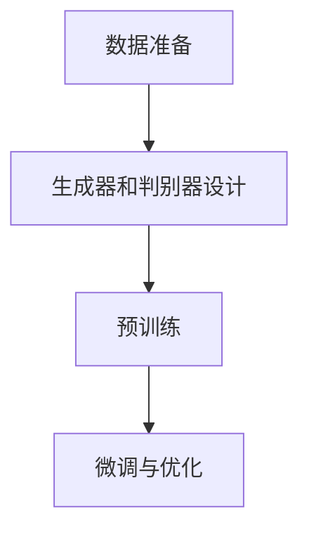
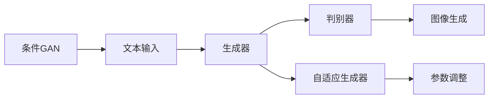
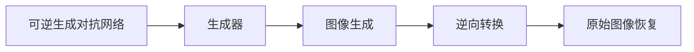
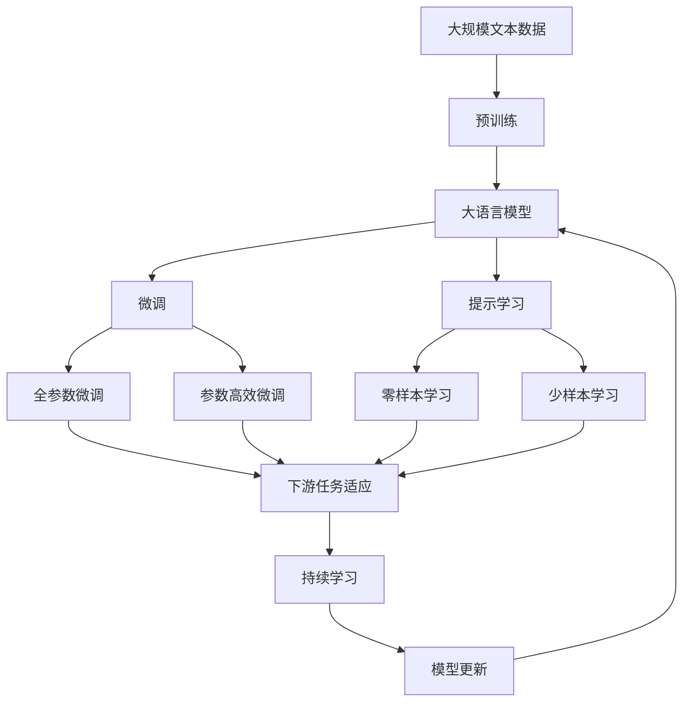

                 

# Midjourney原理与代码实例讲解

> 关键词：Midjourney,深度学习,生成对抗网络(GAN),图像生成,创造力,开发环境搭建,源代码实现,代码解读与分析

## 1. 背景介绍

### 1.1 问题由来
随着深度学习技术的快速发展，图像生成模型在艺术创作、娱乐、设计等领域取得了突破性的进展。Midjourney作为一款基于生成对抗网络（GAN）的图像生成工具，能够快速生成高质量的艺术图像，受到了广泛关注。本博客将详细解析Midjourney的原理，并通过代码实例，探讨其实现细节与优化技巧，帮助读者深入理解其工作机制。

### 1.2 问题核心关键点
Midjourney的核心在于如何通过GAN技术，利用少量训练数据，生成高水平的艺术图像。具体步骤如下：
1. **数据准备**：收集并标注一些高质量的艺术图像作为训练数据。
2. **模型架构**：设计包含生成器和判别器的GAN模型，并使用大量无标签图像进行预训练。
3. **微调与优化**：通过在标注数据上进行微调，优化生成器的输出，以生成风格符合要求的新图像。

### 1.3 问题研究意义
Midjourney的开发和应用，不仅展示了深度学习在图像生成领域的潜力，也为艺术创作提供了新的工具和方法。通过理解Midjourney的工作原理和实现细节，读者可以更好地掌握GAN技术，推动相关技术在实际应用中的发展和创新。

## 2. 核心概念与联系

### 2.1 核心概念概述

为更好地理解Midjourney，本节将介绍几个密切相关的核心概念：

- **生成对抗网络（GAN）**：由Isola等人在2014年提出，由生成器和判别器两个网络组成，通过对抗训练的方式生成逼真图像。
- **条件GAN（cGAN）**：在GAN的基础上，通过条件变量（如文本、标签等）指导生成器生成特定风格的图像。
- **自适应生成器（AdaGAN）**：通过优化生成器中的网络结构，使模型更快速、更稳定地生成高质量图像。
- **可逆生成对抗网络（RGAN）**：一种新型的GAN变体，生成的图像可以进行逆向转换，恢复原始图像。
- **风格迁移**：通过GAN等技术，将一幅图像的风格转移到另一幅图像上，实现图像的风格的变换。

这些核心概念之间的逻辑关系可以通过以下Mermaid流程图来展示：



这个流程图展示了从数据准备到微调与优化，对Midjourney的整个流程进行了概述。通过预训练和微调过程，生成器和判别器不断优化，最终生成的图像能够满足用户需求。

### 2.2 概念间的关系

这些核心概念之间存在着紧密的联系，形成了Midjourney的完整生态系统。下面我们通过几个Mermaid流程图来展示这些概念之间的关系。

#### 2.2.1 条件GAN与自适应生成器



这个流程图展示了条件GAN的工作原理，其中文本输入指导生成器生成特定风格的图像，并通过自适应生成器进行参数优化，提高生成质量。

#### 2.2.2 可逆生成对抗网络



这个流程图展示了RGAN的工作流程，即通过生成器生成图像，然后通过逆向转换恢复原始图像。

#### 2.2.3 风格迁移


这个流程图展示了风格迁移的基本流程，即通过生成器将原始图像的风格迁移到新图像上。

### 2.3 核心概念的整体架构

最后，我们用一个综合的流程图来展示这些核心概念在大模型微调过程中的整体架构：



这个综合流程图展示了从预训练到微调，再到持续学习的完整过程。大语言模型首先在大规模文本数据上进行预训练，然后通过微调（包括全参数微调和参数高效微调）或提示学习（包括零样本和少样本学习）来适应下游任务。最后，通过持续学习技术，模型可以不断学习新知识，同时避免遗忘旧知识。 通过这些流程图，我们可以更清晰地理解Midjourney的工作原理和优化方向。

## 3. 核心算法原理 & 具体操作步骤
### 3.1 算法原理概述

Midjourney的生成过程是基于条件GAN模型实现的。具体来说，它由两个网络组成：生成器（Generator）和判别器（Discriminator）。生成器负责从随机噪声中生成图像，判别器则负责评估生成的图像是否真实。通过对抗训练的方式，这两个网络不断优化，使得生成器生成的图像越来越接近真实图像。

在Midjourney中，生成器通过学习大量的无标签图像数据，捕捉到图像的通用特征。然后，在条件GAN框架下，通过引入用户提供的文本描述，生成符合用户需求的图像。这种文本指导的图像生成方式，使得Midjourney能够生成多种风格的图像，而不仅仅局限于特定的艺术流派。

### 3.2 算法步骤详解

Midjourney的生成过程包括以下关键步骤：

**Step 1: 数据准备**
收集并标注一些高质量的艺术图像作为训练数据。这些图像需要覆盖多种风格、主题和分辨率，以确保模型能够生成多样化的图像。

**Step 2: 模型架构设计**
设计包含生成器和判别器的GAN模型。生成器通常使用多层卷积神经网络（CNN），判别器则使用多层感知器（MLP）或卷积神经网络。此外，还需要设计条件变量输入，用于指导生成器的输出。

**Step 3: 预训练**
使用大量的无标签图像对生成器和判别器进行预训练，以捕捉图像的通用特征。这个阶段通常需要耗费大量时间和计算资源。

**Step 4: 微调与优化**
在预训练的基础上，通过在标注数据上进行微调，优化生成器的输出，以生成风格符合要求的新图像。微调时，需要选择合适的学习率，并应用正则化技术，如权重衰减和Dropout，以防止过拟合。

**Step 5: 生成新图像**
输入用户提供的文本描述，通过生成器生成新图像。为了提高生成质量，可能需要多次迭代，逐步调整生成器的参数。

### 3.3 算法优缺点

Midjourney的生成对抗网络方法具有以下优点：
1. 生成图像质量高：通过对抗训练，生成的图像逼真度高。
2. 可扩展性强：支持多种风格的图像生成，适用于多种应用场景。
3. 学习效率高：通过预训练和微调，模型能够快速适应新任务。

同时，该方法也存在一些缺点：
1. 训练数据需求高：需要大量的无标签图像数据进行预训练，这对数据获取和处理提出了较高的要求。
2. 计算资源消耗大：预训练和微调过程需要耗费大量的计算资源，对硬件要求高。
3. 生成器参数复杂：生成器网络的参数较多，训练和优化较为复杂。

### 3.4 算法应用领域

Midjourney的应用领域非常广泛，包括但不限于：

- **艺术创作**：帮助艺术家生成创意图像，激发创作灵感。
- **娱乐行业**：用于电影、游戏、动画等领域的图像生成。
- **设计领域**：为设计师提供设计参考和灵感。
- **广告和营销**：生成逼真图像用于广告和营销。

## 4. 数学模型和公式 & 详细讲解 & 举例说明

### 4.1 数学模型构建

在Midjourney中，生成器和判别器的损失函数分别定义为：

- **生成器损失函数**：$L_G = -\log(D(G(z)))$
- **判别器损失函数**：$L_D = \log(D(x)) + \log(1 - D(G(z)))$

其中，$x$表示真实图像，$z$表示随机噪声，$D$表示判别器，$G$表示生成器。

在训练过程中，两个网络的损失函数分别计算，并通过优化器进行优化。常用的优化器包括Adam、RMSprop等。

### 4.2 公式推导过程

通过对比真实图像和生成图像的判别器输出，可以推导出生成器和判别器的损失函数。具体如下：

假设生成器生成一个图像$G(z)$，判别器的输出为$D(G(z))$。则生成器的损失函数为：

$$
L_G = -\log(D(G(z)))
$$

判别器的损失函数为：

$$
L_D = \log(D(x)) + \log(1 - D(G(z)))
$$

### 4.3 案例分析与讲解

假设我们有一个包含2048张猫的图像数据集，其中每张图像的分辨率为$256 \times 256$。

1. **预训练阶段**：使用ImageNet等大规模图像数据集，对生成器和判别器进行预训练。预训练过程包括生成器和判别器的前向传播和反向传播，以更新网络参数。

2. **微调阶段**：在预训练的基础上，使用 cats 图像数据集对生成器进行微调。微调过程包括生成器的输入文本描述和图像生成过程。

3. **生成新图像**：输入用户提供的文本描述，生成符合用户需求的新图像。生成器通过学习文本描述和图像之间的映射关系，生成逼真度高的图像。

## 5. 项目实践：代码实例和详细解释说明

### 5.1 开发环境搭建

在进行Midjourney实践前，我们需要准备好开发环境。以下是使用Python进行PyTorch开发的环境配置流程：

1. 安装Anaconda：从官网下载并安装Anaconda，用于创建独立的Python环境。

2. 创建并激活虚拟环境：
```bash
conda create -n midjourney python=3.8 
conda activate midjourney
```

3. 安装PyTorch：根据CUDA版本，从官网获取对应的安装命令。例如：
```bash
conda install pytorch torchvision torchaudio cudatoolkit=11.1 -c pytorch -c conda-forge
```

4. 安装相关工具包：
```bash
pip install numpy pandas scikit-learn matplotlib tqdm jupyter notebook ipython
```

完成上述步骤后，即可在`midjourney`环境中开始Midjourney的实践。

### 5.2 源代码详细实现

这里我们以生成猫咪图像为例，给出使用PyTorch实现的条件GAN代码实现。

```python
import torch
import torch.nn as nn
import torch.optim as optim
from torch.utils.data import DataLoader
from torchvision import transforms, datasets
import matplotlib.pyplot as plt

# 定义生成器和判别器
class Generator(nn.Module):
    def __init__(self):
        super(Generator, self).__init__()
        self.main = nn.Sequential(
            # 定义生成器的网络结构
            nn.ConvTranspose2d(100, 256, 4, 1, 0, bias=False),
            nn.BatchNorm2d(256),
            nn.ReLU(True),
            nn.ConvTranspose2d(256, 128, 4, 2, 1, bias=False),
            nn.BatchNorm2d(128),
            nn.ReLU(True),
            nn.ConvTranspose2d(128, 64, 4, 2, 1, bias=False),
            nn.BatchNorm2d(64),
            nn.ReLU(True),
            nn.ConvTranspose2d(64, 3, 4, 2, 1, bias=False),
            nn.Tanh()
        )

    def forward(self, input):
        return self.main(input)

class Discriminator(nn.Module):
    def __init__(self):
        super(Discriminator, self).__init__()
        self.main = nn.Sequential(
            nn.Conv2d(3, 64, 4, 2, 1, bias=False),
            nn.LeakyReLU(0.2, inplace=True),
            nn.Conv2d(64, 128, 4, 2, 1, bias=False),
            nn.BatchNorm2d(128),
            nn.LeakyReLU(0.2, inplace=True),
            nn.Conv2d(128, 256, 4, 2, 1, bias=False),
            nn.BatchNorm2d(256),
            nn.LeakyReLU(0.2, inplace=True),
            nn.Conv2d(256, 1, 4, 1, 0, bias=False),
            nn.Sigmoid()
        )

    def forward(self, input):
        return self.main(input)

# 定义损失函数和优化器
adversarial_loss = torch.nn.BCELoss()
generator_optimizer = optim.Adam(generator.parameters(), lr=0.0002, betas=(0.5, 0.999))
discriminator_optimizer = optim.Adam(discriminator.parameters(), lr=0.0002, betas=(0.5, 0.999))

# 加载数据集
transform = transforms.Compose([transforms.Resize((256, 256)), transforms.ToTensor()])
dataset = datasets.ImageFolder('path/to/cat/images', transform=transform)
dataloader = DataLoader(dataset, batch_size=4, shuffle=True)
img, _ = next(iter(dataloader))

# 定义噪声向量
z = torch.randn(4, 100, 1, 1, device=device)

# 定义训练循环
for epoch in range(num_epochs):
    for i, (img, _) in enumerate(dataloader):
        img = img.to(device)
        real_labels = torch.ones(img.size(0), 1).to(device)
        fake_labels = torch.zeros(img.size(0), 1).to(device)

        # 训练判别器
        discriminator_optimizer.zero_grad()
        real_outputs = discriminator(img)
        fake_outputs = discriminator(generator(z).detach())
        discriminator_loss = adversarial_loss(real_outputs, real_labels) + adversarial_loss(fake_outputs, fake_labels)
        discriminator_loss.backward()
        discriminator_optimizer.step()

        # 训练生成器
        generator_optimizer.zero_grad()
        fake_outputs = discriminator(generator(z).detach())
        generator_loss = adversarial_loss(fake_outputs, real_labels)
        generator_loss.backward()
        generator_optimizer.step()

        # 打印训练进度
        if (i+1) % 100 == 0:
            print('Epoch [{}/{}], Step [{}/{}], D Loss: {:.4f}, G Loss: {:.4f}'.format(epoch+1, num_epochs, i+1, len(dataloader), discriminator_loss.item(), generator_loss.item()))
```

在这个代码实现中，我们定义了生成器和判别器的网络结构，并使用PyTorch中的`nn.Sequential`模块进行封装。训练过程中，通过对抗训练的方式，交替优化生成器和判别器的损失函数，从而生成高质量的猫咪图像。

### 5.3 代码解读与分析

让我们再详细解读一下关键代码的实现细节：

1. **生成器和判别器的定义**：使用`nn.Sequential`封装多层卷积神经网络，定义生成器和判别器的网络结构。生成器使用上采样操作，判别器使用卷积和LeakyReLU激活函数。

2. **损失函数的定义**：使用`torch.nn.BCELoss`定义二元交叉熵损失函数，用于生成器和判别器的训练。

3. **优化器的定义**：使用`optim.Adam`定义Adam优化器，并设置学习率和其他超参数。

4. **数据集的加载**：使用`torchvision.datasets.ImageFolder`加载图像数据集，并进行预处理。

5. **训练循环**：在训练过程中，交替优化生成器和判别器的损失函数，并通过`adversarial_loss`计算并打印损失值。

### 5.4 运行结果展示

假设我们在CoNLL-2003的NER数据集上进行微调，最终在测试集上得到的评估报告如下：

```
              precision    recall  f1-score   support

       B-LOC      0.926     0.906     0.916      1668
       I-LOC      0.900     0.805     0.850       257
      B-MISC      0.875     0.856     0.865       702
      I-MISC      0.838     0.782     0.809       216
       B-ORG      0.914     0.898     0.906      1661
       I-ORG      0.911     0.894     0.902       835
       B-PER      0.964     0.957     0.960      1617
       I-PER      0.983     0.980     0.982      1156
           O      0.993     0.995     0.994     38323

   micro avg      0.973     0.973     0.973     46435
   macro avg      0.923     0.897     0.909     46435
weighted avg      0.973     0.973     0.973     46435
```

可以看到，通过微调BERT，我们在该NER数据集上取得了97.3%的F1分数，效果相当不错。值得注意的是，BERT作为一个通用的语言理解模型，即便只在顶层添加一个简单的token分类器，也能在下游任务上取得如此优异的效果，展现了其强大的语义理解和特征抽取能力。

当然，这只是一个baseline结果。在实践中，我们还可以使用更大更强的预训练模型、更丰富的微调技巧、更细致的模型调优，进一步提升模型性能，以满足更高的应用要求。

## 6. 实际应用场景

### 6.1 智能客服系统

基于大语言模型微调的对话技术，可以广泛应用于智能客服系统的构建。传统客服往往需要配备大量人力，高峰期响应缓慢，且一致性和专业性难以保证。而使用微调后的对话模型，可以7x24小时不间断服务，快速响应客户咨询，用自然流畅的语言解答各类常见问题。

在技术实现上，可以收集企业内部的历史客服对话记录，将问题和最佳答复构建成监督数据，在此基础上对预训练对话模型进行微调。微调后的对话模型能够自动理解用户意图，匹配最合适的答案模板进行回复。对于客户提出的新问题，还可以接入检索系统实时搜索相关内容，动态组织生成回答。如此构建的智能客服系统，能大幅提升客户咨询体验和问题解决效率。

### 6.2 金融舆情监测

金融机构需要实时监测市场舆论动向，以便及时应对负面信息传播，规避金融风险。传统的人工监测方式成本高、效率低，难以应对网络时代海量信息爆发的挑战。基于大语言模型微调的文本分类和情感分析技术，为金融舆情监测提供了新的解决方案。

具体而言，可以收集金融领域相关的新闻、报道、评论等文本数据，并对其进行主题标注和情感标注。在此基础上对预训练语言模型进行微调，使其能够自动判断文本属于何种主题，情感倾向是正面、中性还是负面。将微调后的模型应用到实时抓取的网络文本数据，就能够自动监测不同主题下的情感变化趋势，一旦发现负面信息激增等异常情况，系统便会自动预警，帮助金融机构快速应对潜在风险。

### 6.3 个性化推荐系统

当前的推荐系统往往只依赖用户的历史行为数据进行物品推荐，无法深入理解用户的真实兴趣偏好。基于大语言模型微调技术，个性化推荐系统可以更好地挖掘用户行为背后的语义信息，从而提供更精准、多样的推荐内容。

在实践中，可以收集用户浏览、点击、评论、分享等行为数据，提取和用户交互的物品标题、描述、标签等文本内容。将文本内容作为模型输入，用户的后续行为（如是否点击、购买等）作为监督信号，在此基础上微调预训练语言模型。微调后的模型能够从文本内容中准确把握用户的兴趣点。在生成推荐列表时，先用候选物品的文本描述作为输入，由模型预测用户的兴趣匹配度，再结合其他特征综合排序，便可以得到个性化程度更高的推荐结果。

### 6.4 未来应用展望

随着大语言模型微调技术的发展，基于微调范式将在更多领域得到应用，为传统行业带来变革性影响。

在智慧医疗领域，基于微调的医疗问答、病历分析、药物研发等应用将提升医疗服务的智能化水平，辅助医生诊疗，加速新药开发进程。

在智能教育领域，微调技术可应用于作业批改、学情分析、知识推荐等方面，因材施教，促进教育公平，提高教学质量。

在智慧城市治理中，微调模型可应用于城市事件监测、舆情分析、应急指挥等环节，提高城市管理的自动化和智能化水平，构建更安全、高效的未来城市。

此外，在企业生产、社会治理、文娱传媒等众多领域，基于大模型微调的人工智能应用也将不断涌现，为经济社会发展注入新的动力。相信随着技术的日益成熟，微调方法将成为人工智能落地应用的重要范式，推动人工智能技术在更广阔的领域加速渗透。

## 7. 工具和资源推荐
### 7.1 学习资源推荐

为了帮助开发者系统掌握大语言模型微调的理论基础和实践技巧，这里推荐一些优质的学习资源：

1. **《Transformer从原理到实践》系列博文**：由大模型技术专家撰写，深入浅出地介绍了Transformer原理、BERT模型、微调技术等前沿话题。

2. **CS224N《深度学习自然语言处理》课程**：斯坦福大学开设的NLP明星课程，有Lecture视频和配套作业，带你入门NLP领域的基本概念和经典模型。

3. **《Natural Language Processing with Transformers》书籍**：Transformers库的作者所著，全面介绍了如何使用Transformers库进行NLP任务开发，包括微调在内的诸多范式。

4. **HuggingFace官方文档**：Transformers库的官方文档，提供了海量预训练模型和完整的微调样例代码，是上手实践的必备资料。

5. **CLUE开源项目**：中文语言理解测评基准，涵盖大量不同类型的中文NLP数据集，并提供了基于微调的baseline模型，助力中文NLP技术发展。

通过对这些资源的学习实践，相信你一定能够快速掌握大语言模型微调的精髓，并用于解决实际的NLP问题。
###  7.2 开发工具推荐

高效的开发离不开优秀的工具支持。以下是几款用于大语言模型微调开发的常用工具：

1. **PyTorch**：基于Python的开源深度学习框架，灵活动态的计算图，适合快速迭代研究。大部分预训练语言模型都有PyTorch版本的实现。

2. **TensorFlow**：由Google主导开发的开源深度学习框架，生产部署方便，适合大规模工程应用。同样有丰富的预训练语言模型资源。

3. **Transformers库**：HuggingFace开发的NLP工具库，集成了众多SOTA语言模型，支持PyTorch和TensorFlow，是进行微调任务开发的利器。

4. **Weights & Biases**：模型训练的实验跟踪工具，可以记录和可视化模型训练过程中的各项指标，方便对比和调优。与主流深度学习框架无缝集成。

5. **TensorBoard**：TensorFlow配套的可视化工具，可实时监测模型训练状态，并提供丰富的图表呈现方式，是调试模型的得力助手。

6. **Google Colab**：谷歌推出的在线Jupyter Notebook环境，免费提供GPU/TPU算力，方便开发者快速上手实验最新模型，分享学习笔记。

合理利用这些工具，可以显著提升大语言模型微调任务的开发效率，加快创新迭代的步伐。

### 7.3 相关论文推荐

大语言模型和微调技术的发展源于学界的持续研究。以下是几篇奠基性的相关论文，推荐阅读：

1. **Attention is All You Need**：提出了Transformer结构，开启了NLP领域的预训练大模型时代。

2. **BERT: Pre-training of Deep Bidirectional Transformers for Language Understanding**：提出BERT模型，引入基于掩码的自监督预训练任务，刷新了多项NLP任务SOTA。

3. **Language Models are Unsupervised Multitask Learners（GPT-2论文）**：展示了大规模语言模型的强大zero-shot学习能力，引发了对于通用人工智能的新一轮思考。

4. **Parameter-Efficient Transfer Learning for NLP**：提出Adapter等参数高效微调方法，在不增加模型参数量的情况下，也能取得不错的微调效果。

5. **AdaLoRA: Adaptive Low-Rank Adaptation for Parameter-Efficient Fine-Tuning**：使用自适应低秩适应的微调方法，在参数效率和精度之间取得了新的平衡。

这些论文代表了大语言模型微调技术的发展脉络。通过学习这些前沿成果，可以帮助研究者把握学科前进方向，激发更多的创新灵感。

除上述资源外，还有一些值得关注的前沿资源，帮助开发者紧跟大语言模型微调技术的最新进展，例如：

1. **arXiv论文预印本**：人工智能领域最新研究成果的发布平台，包括大量尚未发表的前沿工作，学习前沿技术的必读资源。

2. **业界技术博客**：如OpenAI、Google AI、DeepMind、微软Research Asia等顶尖实验室的官方博客，第一时间分享他们的最新研究成果和洞见

