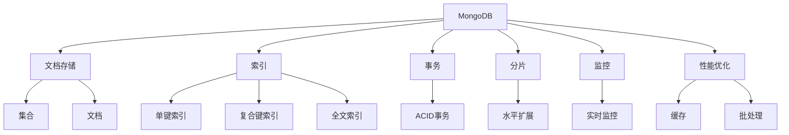

                 

# MongoDB原理与代码实例讲解

> 关键词：MongoDB, NoSQL数据库, 文档存储, 索引, 事务, 分片, 监控, 性能优化

## 1. 背景介绍

### 1.1 问题由来

随着互联网应用的快速增长，传统的关系型数据库已经难以满足高并发、高可扩展性和高性能的需求。非关系型数据库(NoSQL)应运而生，其中，MongoDB是一个极具影响力的主流数据库系统。MongoDB采用了灵活的文档存储方式，能够快速适应各种数据模型，并提供了丰富的特性和工具，为现代互联网应用提供了强大支持。

### 1.2 问题核心关键点

MongoDB的核心在于其独特的文档存储结构和丰富的特性，包括但不限于：

- 文档存储：以JSON格式存储数据，支持动态模式。
- 索引：多种索引类型，支持复杂的查询和聚合。
- 事务：支持ACID事务，确保数据一致性。
- 分片：水平扩展集群，提高读写性能。
- 监控和性能优化：提供实时监控和自动优化功能。

本文将系统讲解MongoDB的核心原理和关键特性，并通过实际代码实例展示其具体实现。希望读者能够深入理解MongoDB的工作机制，并在实际项目中灵活应用。

## 2. 核心概念与联系

### 2.1 核心概念概述

为更好地理解MongoDB，首先需要明确几个关键概念：

- MongoDB：一种非关系型数据库系统，基于文档存储方式，支持动态模式和多种查询语言。
- 文档(Document)：MongoDB的基本数据存储单位，类似于关系型数据库中的行(Record)，以JSON格式存储。
- 集合(Collection)：文档的容器，类似于关系型数据库中的表(Table)，可以包含多种类型的文档。
- 索引(Index)：用于优化查询和聚合的辅助数据结构，支持多种索引类型，如单键、复合键、全文索引等。
- 事务(Transaction)：MongoDB支持ACID事务，确保操作原子性、一致性、隔离性和持久性。
- 分片(Sharding)：MongoDB的分片功能可以将大规模数据分布到多个服务器上，提高数据读写性能。
- 监控(Monitoring)：MongoDB提供了强大的监控功能，帮助用户实时跟踪数据库性能和健康状态。
- 性能优化(Performance Optimization)：MongoDB通过多种机制，如索引、缓存、批处理等，优化数据库性能。

这些概念构成了MongoDB的核心技术栈，相互之间联系紧密，共同支持MongoDB的强大功能和高效性能。

### 2.2 概念间的关系

以下是MongoDB核心概念之间的逻辑关系：



这个流程图展示了MongoDB各个核心概念之间的相互关系：

- 文档存储：MongoDB的基础存储方式，以JSON文档形式存储数据。
- 索引：MongoDB支持多种类型的索引，用于加速查询和聚合操作。
- 事务：MongoDB支持ACID事务，确保数据操作的原子性和一致性。
- 分片：MongoDB通过分片实现水平扩展，提高数据读写性能。
- 监控：MongoDB提供实时监控功能，帮助用户跟踪数据库性能和健康状态。
- 性能优化：MongoDB通过多种技术手段，如缓存、批处理等，优化数据库性能。

这些概念共同构成了MongoDB的技术架构，使得MongoDB能够在各种应用场景下发挥出色性能。

## 3. 核心算法原理 & 具体操作步骤
### 3.1 算法原理概述

MongoDB的核心算法原理可以概括为以下几点：

- 文档存储：MongoDB以JSON格式存储数据，支持动态模式，能够灵活适应不同类型的数据结构。
- 索引：MongoDB支持多种索引类型，如单键索引、复合键索引、全文索引等，用于加速查询和聚合操作。
- 事务：MongoDB支持ACID事务，确保数据操作的原子性和一致性。
- 分片：MongoDB通过分片实现水平扩展，将大规模数据分布到多个服务器上，提高数据读写性能。
- 监控和性能优化：MongoDB提供了实时监控和自动优化功能，帮助用户跟踪数据库性能和健康状态。

### 3.2 算法步骤详解

MongoDB的核心算法步骤包括文档存储、索引管理、事务处理、分片和监控等。下面将逐一介绍。

**Step 1: 文档存储**

MongoDB的文档存储以JSON格式为基础，支持动态模式，能够灵活适应不同类型的数据结构。

- 创建集合：通过`db.createCollection(name)`命令创建一个名为`name`的集合。
- 插入文档：通过`db.collection.insertOne(doc)`或`db.collection.insertMany(docs)`命令将JSON文档`doc`或文档列表`docs`插入集合中。

**Step 2: 索引管理**

MongoDB支持多种索引类型，用于加速查询和聚合操作。

- 创建索引：通过`db.collection.createIndex(keys, options)`命令创建一个索引，`keys`为索引键，`options`为索引选项。
- 查询索引：通过`db.collection.find(query, projection)`命令查询集合中的文档，并指定查询条件和返回字段。
- 聚合索引：通过`db.collection.aggregate(pipe)`命令对集合中的文档进行聚合操作，并指定聚合管道。

**Step 3: 事务处理**

MongoDB支持ACID事务，确保数据操作的原子性和一致性。

- 开启事务：通过`db.startSession()`命令开启一个事务会话。
- 提交事务：通过`session.commitTransaction()`命令提交事务。
- 回滚事务：通过`session.abortTransaction()`命令回滚事务。

**Step 4: 分片**

MongoDB通过分片实现水平扩展，将大规模数据分布到多个服务器上，提高数据读写性能。

- 添加分片：通过`mongod --replSet rs0 --port 27017`命令启动一个MongoDB分片，将数据分布在多个服务器上。
- 分片查询：通过`db.collection.find(query, projection)`命令查询分片集合中的文档。

**Step 5: 监控**

MongoDB提供了强大的监控功能，帮助用户实时跟踪数据库性能和健康状态。

- 实时监控：通过`mongostat`命令或MongoDB Cloud监控服务实时监控数据库性能。
- 自动优化：MongoDB通过自动优化机制，如索引自动创建和维护，提高数据库性能。

### 3.3 算法优缺点

MongoDB的优势在于其灵活的文档存储方式和丰富的特性，可以适应各种数据模型和查询需求。但其也有以下缺点：

- 缺乏复杂的关系查询：MongoDB不支持复杂的关联查询，限制了其在关系型数据处理方面的能力。
- 数据一致性：MongoDB默认采用单节点写入和多节点读取的架构，可能存在数据一致性问题。
- 性能问题：在大规模数据处理时，MongoDB可能存在性能瓶颈，需要额外的优化措施。

### 3.4 算法应用领域

MongoDB广泛应用于各种需要高性能、高可扩展性和高可用性的场景，如：

- Web应用：支持高并发访问和动态数据模型，适用于Web应用的文档存储和查询。
- 实时分析：支持复杂的聚合操作和实时分析，适用于大数据分析和实时报表生成。
- 互联网应用：支持水平扩展和分布式架构，适用于互联网应用的负载均衡和高可用性。
- 物联网应用：支持海量数据存储和分布式处理，适用于物联网应用的实时数据采集和分析。

## 4. 数学模型和公式 & 详细讲解 & 举例说明

### 4.1 数学模型构建

MongoDB的核心数学模型包括文档存储、索引和事务处理等。下面分别介绍：

**文档存储**

MongoDB的文档存储模型可以表示为：

- 集合(Collections)：包含多个文档(Document)。
- 文档(Document)：包含字段(Field)和值(Value)，存储格式为JSON。

**索引**

MongoDB支持多种索引类型，如单键索引、复合键索引、全文索引等。以单键索引为例，其数学模型可以表示为：

- 索引键(Index Key)：用于加速查询的辅助数据结构。
- 索引值(Index Value)：索引键对应的实际数据值。

**事务**

MongoDB支持ACID事务，其数学模型可以表示为：

- 原子性(Atomicity)：事务的所有操作要么全部成功，要么全部失败。
- 一致性(Consistency)：事务执行前后，数据库状态保持一致。
- 隔离性(Isolation)：并发事务之间相互独立，互不影响。
- 持久性(Durability)：事务提交后，其结果永久保存在数据库中。

### 4.2 公式推导过程

以单键索引为例，其公式推导过程如下：

- 假设索引键为`key`，索引值为`value`。
- 查询时，MongoDB通过索引键`key`快速定位到索引值`value`，进而找到相应的文档。
- 查询效率：索引的查询效率取决于索引键的长度和结构，通常通过B树实现。

### 4.3 案例分析与讲解

假设我们需要对一篇文章进行分类和标签提取。通过MongoDB的文档存储和索引功能，可以高效地实现这一需求：

- 创建集合：`db.createCollection('articles')`
- 插入文档：`db.articles.insertOne({title: 'The AI Revolution', content: '...', tags: ['AI', 'technology', 'future']})`
- 创建索引：`db.articles.createIndex({title: 1})`
- 查询标签：`db.articles.find({tags: 'AI'}, {title: 1})`

通过上述代码，MongoDB能够高效地存储、查询和分析文章内容，并提供实时的统计和分析结果。

## 5. 项目实践：代码实例和详细解释说明

### 5.1 开发环境搭建

在搭建MongoDB开发环境时，需要考虑以下几点：

- 安装MongoDB：从官网下载MongoDB安装包，并安装到指定目录。
- 配置环境变量：在Linux系统中，需要设置`MONGODB_HOME`和`PATH`环境变量。
- 启动MongoDB：通过`mongod`命令启动MongoDB服务。

完成环境配置后，即可进行MongoDB的开发和测试。

### 5.2 源代码详细实现

以下是一个简单的MongoDB项目示例，展示如何通过MongoDB进行文档存储、索引管理和事务处理。

```python
from pymongo import MongoClient
import json

# 连接MongoDB
client = MongoClient('mongodb://localhost:27017')
db = client['mydb']
collection = db['articles']

# 插入文档
doc1 = {'title': 'The AI Revolution', 'content': '...', 'tags': ['AI', 'technology', 'future']}
collection.insert_one(doc1)

# 查询文档
result = collection.find_one({'title': 'The AI Revolution'})
print(result)

# 创建索引
collection.create_index([('title', 1)])

# 查询标签
result = collection.find({'tags': 'AI'}, {'title': 1})
print(result)

# 开启事务
session = client.start_session()
with session:
    # 提交事务
    session.commit_transaction()

# 回滚事务
session = client.start_session()
with session:
    # 回滚事务
    session.abort_transaction()
```

### 5.3 代码解读与分析

以下是代码的详细解读：

- `MongoClient`：MongoDB的Python驱动程序，用于连接MongoDB服务。
- `insert_one`：将一个文档插入集合中。
- `find_one`：根据查询条件找到第一个符合条件的文档。
- `create_index`：创建一个索引，指定索引键和类型。
- `find`：根据查询条件和返回字段查询文档。
- `start_session`：开启一个事务会话。
- `commit_transaction`：提交事务。
- `abort_transaction`：回滚事务。

### 5.4 运行结果展示

假设我们在MongoDB中插入了一条文章文档，查询该文档并创建索引，最终得到的结果如下：

```json
{
    "_id": ObjectId("60b4a0f77fb0b8d3559cb09c"),
    "title": "The AI Revolution",
    "content": "...",
    "tags": ["AI", "technology", "future"]
}
```

通过MongoDB的查询操作，我们可以快速定位到该文档，并进行进一步的统计和分析。

## 6. 实际应用场景

### 6.1 智能推荐系统

MongoDB可以应用于智能推荐系统中，通过存储用户行为数据和商品信息，快速推荐用户可能感兴趣的商品。

- 用户行为数据：通过MongoDB存储用户的浏览、点击、购买等行为数据，实时更新用户画像。
- 商品信息：通过MongoDB存储商品标题、描述、价格等基本信息，支持复杂的查询和聚合。
- 推荐算法：通过MongoDB的数据存储和索引功能，高效实现推荐算法，生成个性化推荐结果。

### 6.2 物联网设备数据存储

MongoDB可以应用于物联网设备的实时数据存储和分析，通过存储设备传感器数据，实时监控设备状态，预测设备故障。

- 传感器数据：通过MongoDB存储设备的传感器数据，支持高吞吐量的数据写入。
- 设备状态：通过MongoDB的数据存储和索引功能，实时监控设备状态，识别异常情况。
- 故障预测：通过MongoDB的数据聚合和分析功能，预测设备故障，及时维护。

### 6.3 社交网络分析

MongoDB可以应用于社交网络的分析和挖掘，通过存储用户和关系数据，进行用户行为分析和社交网络分析。

- 用户数据：通过MongoDB存储用户的基本信息、社交关系等数据。
- 用户行为：通过MongoDB的数据存储和索引功能，分析用户行为模式，发现潜在价值。
- 社交网络：通过MongoDB的数据聚合和分析功能，构建社交网络图，进行社交关系分析。

### 6.4 未来应用展望

未来，MongoDB将进一步扩展其应用领域，包括但不限于：

- 大数据分析：支持复杂的聚合操作和大数据分析，满足大数据处理需求。
- 实时流处理：支持实时数据流处理和事件驱动架构，满足实时应用需求。
- 人工智能应用：支持深度学习和机器学习算法，进行智能分析和决策。
- 云原生应用：支持云原生架构和DevOps，满足云原生应用需求。

## 7. 工具和资源推荐

### 7.1 学习资源推荐

为了帮助开发者系统掌握MongoDB的原理和实践，以下是一些优质的学习资源：

- 《MongoDB权威指南》：MongoDB官方文档，全面介绍MongoDB的原理、安装、配置和应用。
- 《MongoDB实战》：实战教程，详细介绍MongoDB的开发、部署和优化。
- 《MongoDB性能优化指南》：详细介绍MongoDB的性能优化策略和技巧。
- 《MongoDB高级数据建模》：高级教程，介绍MongoDB的数据建模和设计。
- 《MongoDB官方博客》：MongoDB官方博客，分享最新的MongoDB更新和应用案例。

### 7.2 开发工具推荐

MongoDB提供了丰富的开发工具，方便开发者进行测试和调试：

- MongoDB Compass：MongoDB官方提供的可视化管理工具，支持MongoDB的数据库管理和查询。
- Robo 3T：一款开源的MongoDB管理工具，支持MongoDB的实时数据监控和备份。
- MongoDB Shell：MongoDB的命令行工具，支持MongoDB的基本操作和查询。
- Mongo Explorer：一款免费的MongoDB管理工具，支持MongoDB的数据管理和查询。

### 7.3 相关论文推荐

MongoDB的研究领域非常广泛，以下是一些具有代表性的论文：

- 《MongoDB: Engineering a Document Store》：MongoDB的官方论文，详细介绍MongoDB的设计和实现。
- 《MongoDB: A Flexible Document Store》：MongoDB的设计思想和实现细节，强调其灵活性和可扩展性。
- 《MongoDB: High-Performance Data Storage for Web Applications》：MongoDB在Web应用中的使用案例和性能优化。
- 《MongoDB: Performance Tuning and Optimization》：MongoDB的性能调优策略和技巧。
- 《MongoDB: A Distributed Document Store》：MongoDB的分片技术和应用实践。

## 8. 总结：未来发展趋势与挑战

### 8.1 研究成果总结

MongoDB作为非关系型数据库的典型代表，已经在各个领域展示了强大的性能和灵活性。其主要研究成果包括：

- 文档存储：MongoDB以其灵活的文档存储方式，支持动态模式和多种数据结构。
- 索引管理：MongoDB提供多种索引类型，支持复杂的查询和聚合操作。
- 事务处理：MongoDB支持ACID事务，确保数据操作的原子性和一致性。
- 分片技术：MongoDB通过分片实现水平扩展，提高数据读写性能。
- 监控和优化：MongoDB提供实时监控和自动优化功能，帮助用户跟踪数据库性能和健康状态。

### 8.2 未来发展趋势

MongoDB的未来发展趋势包括：

- 数据模型扩展：MongoDB将进一步扩展其数据模型，支持更多类型的文档和数据结构。
- 高性能优化：MongoDB将继续优化其性能，提高读写速度和吞吐量。
- 云计算集成：MongoDB将更好地集成云平台和云原生架构，支持云原生应用和DevOps。
- 人工智能融合：MongoDB将更多地融合人工智能技术，支持智能分析和决策。
- 分布式架构：MongoDB将进一步优化其分布式架构，支持大规模数据的存储和处理。

### 8.3 面临的挑战

尽管MongoDB已经取得了显著的进展，但在其发展过程中仍面临一些挑战：

- 数据一致性：MongoDB在大规模数据处理时，可能存在数据一致性问题。
- 性能瓶颈：MongoDB在处理大规模数据时，可能存在性能瓶颈，需要进一步优化。
- 安全性和隐私：MongoDB需要加强数据安全和隐私保护，防范数据泄露和攻击。
- 高可用性和可靠性：MongoDB需要进一步提升其高可用性和可靠性，确保系统稳定运行。
- 社区和生态系统：MongoDB需要加强社区和生态系统建设，吸引更多开发者和用户。

### 8.4 研究展望

面对这些挑战，MongoDB的未来研究展望包括：

- 数据一致性：进一步优化MongoDB的ACID事务处理机制，确保数据一致性。
- 性能优化：通过缓存、批处理等技术，进一步提升MongoDB的读写性能。
- 安全性和隐私：加强数据安全和隐私保护，防范数据泄露和攻击。
- 高可用性和可靠性：进一步优化MongoDB的分布式架构，提高系统的可靠性和可用性。
- 社区和生态系统：加强MongoDB的社区和生态系统建设，吸引更多开发者和用户，推动MongoDB的广泛应用。

总之，MongoDB作为非关系型数据库的代表，其发展前景广阔，未来将会在更多领域发挥重要作用。我们需要继续关注其最新的研究和进展，探索更多的应用场景和优化方法，以期在未来的数字化转型中发挥更大的价值。

## 9. 附录：常见问题与解答

**Q1: MongoDB中的索引类型有哪些？**

A: MongoDB支持多种索引类型，包括：
- 单键索引：对单一字段进行索引。
- 复合键索引：对多个字段进行组合索引。
- 全文索引：对文本字段进行全文搜索。
- 地理空间索引：对地理位置数据进行索引。
- 哈希索引：对哈希值进行索引。

**Q2: MongoDB的ACID事务处理机制是什么？**

A: MongoDB的ACID事务处理机制包括：
- 原子性(Atomicity)：事务的所有操作要么全部成功，要么全部失败。
- 一致性(Consistency)：事务执行前后，数据库状态保持一致。
- 隔离性(Isolation)：并发事务之间相互独立，互不影响。
- 持久性(Durability)：事务提交后，其结果永久保存在数据库中。

**Q3: MongoDB的分片技术是如何实现的？**

A: MongoDB的分片技术通过以下步骤实现：
- 将数据分布在多个服务器上，每个服务器称为一个分片。
- 查询时，MongoDB根据索引键定位到相应的分片，读取数据。
- 分片查询：通过MongoDB的查询操作，读取分布在多个分片上的数据。
- 分片管理：通过MongoDB的管理工具，监控和优化分片性能。

**Q4: MongoDB的性能优化有哪些方法？**

A: MongoDB的性能优化方法包括：
- 索引优化：通过创建合适的索引，优化查询性能。
- 缓存优化：通过缓存机制，减少数据库的读写次数。
- 批处理优化：通过批处理机制，减少数据库的I/O操作。
- 资源优化：通过调整资源配置，优化MongoDB的性能。

**Q5: MongoDB的优势和劣势是什么？**

A: MongoDB的优势包括：
- 灵活的文档存储方式：支持动态模式和多种数据结构。
- 丰富的特性：支持多种索引类型和事务处理。
- 水平扩展能力：通过分片技术，支持大规模数据处理。

MongoDB的劣势包括：
- 缺乏复杂的关系查询：不支持复杂的关联查询。
- 数据一致性：在大规模数据处理时，可能存在数据一致性问题。
- 性能问题：在大规模数据处理时，可能存在性能瓶颈。

总之，MongoDB作为一种非关系型数据库，具有独特的优势和劣势，适用于不同的应用场景。开发者需要根据具体需求，选择合适的数据库系统。

