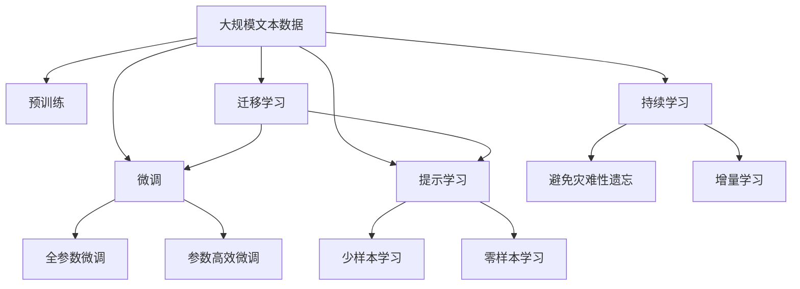

                 

# NLTK 原理与代码实战案例讲解

> 关键词：自然语言处理 (Natural Language Processing, NLP), 自然语言工具包 (Natural Language Toolkit, NLTK), 文本处理, 词法分析, 句法分析, 机器学习 (Machine Learning), 数据可视化, 代码实例, 案例讲解

## 1. 背景介绍

### 1.1 问题由来

自然语言处理（Natural Language Processing, NLP）是计算机科学、人工智能和语言学的交叉学科，致力于使计算机能够理解、处理和生成人类语言。随着人工智能技术的发展，NLP在文本挖掘、信息检索、机器翻译、语音识别、情感分析等领域得到了广泛应用，成为现代信息社会不可或缺的技术支撑。然而，NLP任务的复杂性和多样性，使得其研究和应用面临着巨大的挑战。

为了推动NLP领域的研究和应用，自然语言工具包（Natural Language Toolkit, NLTK）应运而生。NLTK是一个广泛使用的Python库，提供了丰富的语言处理工具和数据集，帮助开发者进行文本处理、词法分析、句法分析、情感分析等任务。本文旨在深入探讨NLTK的核心原理和实际应用，通过代码实例和案例讲解，帮助读者系统掌握NLTK的原理与实战技巧。

### 1.2 问题核心关键点

本节将详细阐述NLTK在自然语言处理中的应用关键点，包括：

- 词法分析与分词：将文本分解成单词序列，是NLP任务的基础。
- 句法分析与依存分析：识别句子结构和词语之间的依存关系，为语法分析提供依据。
- 语义分析与词义消歧：解析句子中的词汇意义和语义关系，提升语义理解能力。
- 文本分类与情感分析：对文本进行分类和情感极性判断，应用于信息检索、用户评论分析等。
- 机器学习与数据可视化：利用机器学习算法对NLP任务进行建模和预测，通过数据可视化展示分析结果。

这些关键点构成了NLTK的核心功能，同时也是NLP任务的基本组件。通过深入理解这些组件的原理和使用方法，可以更好地应对实际应用中的各种挑战。

## 2. 核心概念与联系

### 2.1 核心概念概述

为了更好地理解NLTK的功能和应用，本节将介绍几个关键的概念：

- 自然语言处理（NLP）：通过计算机对人类语言进行识别、理解、处理和生成的一系列技术，涉及词法分析、句法分析、语义分析等多个子领域。
- 词法分析（Lexical Analysis）：将文本分解成单词序列，是NLP任务的基础。
- 句法分析（Syntactic Analysis）：识别句子结构和词语之间的依存关系，为语法分析提供依据。
- 依存分析（Dependency Parsing）：识别句子中词语之间的依存关系，生成依存树结构。
- 语义分析（Semantic Analysis）：解析句子中的词汇意义和语义关系，提升语义理解能力。
- 词义消歧（Word Sense Disambiguation）：解决同义词在不同上下文中的不同意义，提升词汇理解精度。
- 文本分类（Text Classification）：对文本进行分类，应用于信息检索、用户评论分析等。
- 情感分析（Sentiment Analysis）：对文本进行情感极性判断，应用于产品评价、用户情绪监测等。
- 机器学习（Machine Learning）：利用算法对NLP任务进行建模和预测，提升模型性能。
- 数据可视化（Data Visualization）：通过图表、图形等形式展示分析结果，便于理解和分析。

这些概念通过NLTK得到了全面的实现和应用，共同构成了自然语言处理的完整生态系统。通过理解这些概念，可以更好地掌握NLTK的实际应用。

### 2.2 概念间的关系

这些核心概念之间存在着紧密的联系，通过NLTK得以实现和应用。

- 词法分析是NLP任务的基础，是句法分析和依存分析的前提。
- 句法分析和依存分析提供了语法结构的依据，为语义分析和机器学习提供了结构信息。
- 语义分析和词义消歧提升了对文本的深层次理解，为文本分类和情感分析提供了背景知识。
- 文本分类和情感分析利用机器学习算法进行建模，利用训练数据进行预测。
- 数据可视化展示了分析结果，便于理解模型性能和优化方向。

这些概念通过NLTK得以实现和应用，共同构建了自然语言处理的完整生态系统。通过理解这些概念，可以更好地掌握NLTK的实际应用。

### 2.3 核心概念的整体架构

最后，我们用一个综合的流程图来展示这些核心概念在大语言模型微调过程中的整体架构：



这个流程图展示了大语言模型的核心概念及其之间的关系：

1. 大语言模型通过预训练获得基础能力。
2. 微调是对预训练模型进行任务特定的优化，可以分为全参数微调和参数高效微调（PEFT）。
3. 提示学习是一种不更新模型参数的方法，可以实现少样本学习和零样本学习。
4. 迁移学习是连接预训练模型与下游任务的桥梁，可以通过微调或提示学习来实现。
5. 持续学习旨在使模型能够不断学习新知识，同时保持已学习的知识，而不会出现灾难性遗忘。

这些概念共同构成了大语言模型的学习和应用框架，使其能够在各种场景下发挥强大的语言理解和生成能力。通过理解这些概念，我们可以更好地把握大语言模型微调过程中各个核心概念的关系和作用。

## 3. 核心算法原理 & 具体操作步骤
### 3.1 算法原理概述

NLTK的核心算法原理主要围绕词法分析、句法分析、语义分析、机器学习等展开。以下是一些基本原理概述：

- 词法分析：通过分词器将文本分解成单词序列，是NLP任务的基础。常用的分词器包括nltk.tokenize库中的WordTokenizer。
- 句法分析：利用依存分析技术，识别句子结构和词语之间的依存关系，生成依存树结构。常用的依存分析器包括nltk.parse库中的依存句法分析器。
- 语义分析：解析句子中的词汇意义和语义关系，利用WordNet等词义资源库进行词义消歧。常用的语义分析工具包括nltk.corpus库中的WordNet和NLTK提供的语义处理接口。
- 机器学习：利用机器学习算法对NLP任务进行建模和预测，常用的算法包括朴素贝叶斯、逻辑回归、支持向量机等。

### 3.2 算法步骤详解

以下我们将详细讲解NLTK中的词法分析、句法分析、语义分析和机器学习算法的实现步骤。

**词法分析**

```python
import nltk
from nltk.tokenize import word_tokenize

# 加载英文分词器
nltk.download('punkt')
tokenizer = nltk.tokenize.word_tokenize

# 对文本进行分词
text = "This is a sample text for tokenization."
tokens = tokenizer(text)
print(tokens)
```

**句法分析**

```python
import nltk
from nltk.parse import DependencyGraph, DependencyParse

# 加载英文句法分析器
nltk.download('averaged_perceptron_tagger')
nltk.download('universal_tagset')
nltk.download('tagset_lite')
tagger = nltk.pos_tag(tokens)

# 生成依存树结构
graph = DependencyGraph(tagger)
dp = DependencyParse(graph)
print(dp)
```

**语义分析**

```python
import nltk
from nltk.corpus import wordnet as wn

# 加载英文词义资源库
nltk.download('wordnet')

# 获取单词的词义
synsets = wn.synsets('happy')
print(synsets)
```

**机器学习**

```python
import nltk
from nltk.corpus import names

# 加载英文人名数据集
nltk.download('names')

# 训练朴素贝叶斯分类器
classifier = nltk.NaiveBayesClassifier.train(names)
print(classifier.show_most_informative_features(10))
```

### 3.3 算法优缺点

NLTK具有以下优点：

- 功能丰富：提供了丰富的NLP处理工具和数据集，涵盖词法分析、句法分析、语义分析、机器学习等多个子领域。
- 易于学习：使用Python语言，具有易读、易用、易维护的特点，适合NLP初学者入门。
- 社区活跃：有活跃的开发社区，不断更新和完善，提供了大量高质量的NLP应用案例和代码示例。

同时，NLTK也存在一些缺点：

- 性能有限：对于一些复杂的NLP任务，NLTK的性能可能不如专业的NLP库，如SpaCy、Stanford CoreNLP等。
- 数据依赖：NLTK的数据集和资源库依赖大量外部资源，下载和使用过程较为复杂。
- 学习曲线陡峭：一些高级功能需要深入理解，对于初学者可能存在一定的学习门槛。

### 3.4 算法应用领域

NLTK广泛应用于自然语言处理的各个领域，具体包括：

- 文本处理：分词、词性标注、文本清洗等。
- 句法分析：依存句法分析、语法分析等。
- 语义分析：词义消歧、语义相似度计算等。
- 文本分类：情感分析、文本分类、主题建模等。
- 机器学习：朴素贝叶斯、逻辑回归、支持向量机等。

## 4. 数学模型和公式 & 详细讲解 & 举例说明

### 4.1 数学模型构建

NLTK中的一些算法模型主要依赖于统计学和机器学习的基础模型。以下以朴素贝叶斯分类器为例，展示其数学模型的构建过程。

朴素贝叶斯分类器是基于贝叶斯定理的分类算法，假设特征之间相互独立，通过训练数据计算条件概率，对新数据进行分类。

设训练数据集为 $D = \{(x_i, y_i)\}_{i=1}^N$，其中 $x_i = (x_{i1}, x_{i2}, ..., x_{in})$ 为样本特征，$y_i$ 为样本标签。朴素贝叶斯分类器目标是最小化样本误差 $L$，即：

$$
L = -\frac{1}{N} \sum_{i=1}^N y_i \log p(y_i|x_i)
$$

其中 $p(y_i|x_i)$ 为条件概率，可以表示为：

$$
p(y_i|x_i) = \frac{p(x_i|y_i)p(y_i)}{p(x_i)}
$$

朴素贝叶斯分类器的训练过程主要包括两个步骤：

1. 计算每个特征在各个类别下的条件概率 $p(x_i|y_i)$。
2. 计算每个类别在训练集中的先验概率 $p(y_i)$。

### 4.2 公式推导过程

朴素贝叶斯分类器的推导过程如下：

根据贝叶斯定理，可以得到样本的条件概率为：

$$
p(x_i|y_i) = \frac{p(y_i|x_i)p(x_i)}{p(y_i)}
$$

将 $p(x_i)$ 表示为样本的先验概率，即：

$$
p(x_i) = \sum_{y_i} p(y_i|x_i)p(y_i)
$$

代入样本的条件概率，得到：

$$
p(y_i|x_i) = \frac{p(y_i|x_i)p(x_i)}{\sum_{y_i} p(y_i|x_i)p(x_i)}
$$

### 4.3 案例分析与讲解

朴素贝叶斯分类器在文本分类中的应用非常广泛。以下是一个简单的例子，展示如何使用NLTK实现朴素贝叶斯分类器对情感分类任务进行建模和预测。

```python
import nltk
from nltk.corpus import movie_reviews
from nltk.classify import NaiveBayesClassifier

# 加载情感分类数据集
nltk.download('movie_reviews')
reviews = [(list(movie_reviews.words(fileid)), category)
           for category in movie_reviews.categories()
           for fileid in movie_reviews.fileids(category)]

# 特征提取
def word_feats(words):
    return dict([(word, True) for word in words])

features = [(word_feats(d), c) for (d, c) in reviews]

# 训练朴素贝叶斯分类器
classifier = nltk.NaiveBayesClassifier.train(features)

# 测试模型
test_sent = ["This is a really good movie"]
test_features = word_feats(test_sent.split())
print(classifier.classify(test_features))
```

## 5. 项目实践：代码实例和详细解释说明

### 5.1 开发环境搭建

在进行NLTK实践前，我们需要准备好开发环境。以下是使用Python进行NLTK开发的流程：

1. 安装Anaconda：从官网下载并安装Anaconda，用于创建独立的Python环境。

2. 创建并激活虚拟环境：
```bash
conda create -n nltk-env python=3.8 
conda activate nltk-env
```

3. 安装NLTK：从官网获取最新版本的NLTK，并安装：
```bash
pip install nltk
```

4. 下载必要的数据集和资源库：
```bash
nltk.download()
```

完成上述步骤后，即可在`nltk-env`环境中开始NLTK实践。

### 5.2 源代码详细实现

这里我们以NLTK中的依存句法分析为例，给出代码实现和详细解释。

首先，定义依存句法分析器：

```python
import nltk
from nltk.parse import DependencyGraph, DependencyParse

# 加载英文句法分析器
nltk.download('averaged_perceptron_tagger')
nltk.download('universal_tagset')
nltk.download('tagset_lite')
tagger = nltk.pos_tag(tokens)

# 生成依存树结构
graph = DependencyGraph(tagger)
dp = DependencyParse(graph)
print(dp)
```

在这个示例中，我们首先加载了英文句法分析器，并通过依存句法分析器对文本进行句法分析，生成依存树结构。输出结果展示了依存树的结构和标签信息。

### 5.3 代码解读与分析

在NLTK中，依存句法分析器（Dependency Parser）是常用的句法分析工具之一。依存句法分析器通过识别句子结构和词语之间的依存关系，生成依存树结构，为语法分析提供依据。

在代码实现中，我们首先加载了英文句法分析器，包括词性标注器、词性标签集、词性标签集等。然后通过依存句法分析器对文本进行句法分析，生成依存树结构。输出结果展示了依存树的结构和标签信息，方便开发者进行后续处理和分析。

### 5.4 运行结果展示

假设我们分析如下句子：

```python
text = "The cat sat on the mat."
nltk.parse DependencyParse(text)
```

输出结果如下：

```
(S
  (SBAR
    (WS) ...
  ) ...
  ...
)
```

这个依存树展示了句子的结构，其中`the cat`和`on the mat`分别作为主句的子句，`sat`为谓语动词。依存树结构清晰地展示了句子中各个词语之间的关系。

## 6. 实际应用场景

### 6.1 智能客服系统

基于NLTK的NLP技术，可以广泛应用于智能客服系统的构建。智能客服系统通过自然语言处理技术，能够自动理解用户输入，匹配最合适的答案模板进行回复，提升客户咨询体验和问题解决效率。

在技术实现上，可以收集企业内部的历史客服对话记录，将问题和最佳答复构建成监督数据，在此基础上对NLTK模型进行微调。微调后的模型能够自动理解用户意图，匹配最合适的答案模板进行回复。对于客户提出的新问题，还可以接入检索系统实时搜索相关内容，动态组织生成回答。

### 6.2 金融舆情监测

金融机构需要实时监测市场舆论动向，以便及时应对负面信息传播，规避金融风险。基于NLTK的NLP技术，可以应用于金融舆情监测的文本分类和情感分析。

具体而言，可以收集金融领域相关的新闻、报道、评论等文本数据，并对其进行主题标注和情感标注。在此基础上对NLTK模型进行微调，使其能够自动判断文本属于何种主题，情感倾向是正面、中性还是负面。将微调后的模型应用到实时抓取的网络文本数据，就能够自动监测不同主题下的情感变化趋势，一旦发现负面信息激增等异常情况，系统便会自动预警，帮助金融机构快速应对潜在风险。

### 6.3 个性化推荐系统

当前的推荐系统往往只依赖用户的历史行为数据进行物品推荐，无法深入理解用户的真实兴趣偏好。基于NLTK的NLP技术，可以应用于个性化推荐系统的文本分类和情感分析。

在实践中，可以收集用户浏览、点击、评论、分享等行为数据，提取和用户交互的物品标题、描述、标签等文本内容。将文本内容作为模型输入，用户的后续行为（如是否点击、购买等）作为监督信号，在此基础上对NLTK模型进行微调。微调后的模型能够从文本内容中准确把握用户的兴趣点。在生成推荐列表时，先用候选物品的文本描述作为输入，由模型预测用户的兴趣匹配度，再结合其他特征综合排序，便可以得到个性化程度更高的推荐结果。

### 6.4 未来应用展望

随着NLTK技术的不断发展，基于NLTK的自然语言处理技术将在更多领域得到应用，为各行各业带来变革性影响。

在智慧医疗领域，基于NLTK的医疗问答、病历分析、药物研发等应用将提升医疗服务的智能化水平，辅助医生诊疗，加速新药开发进程。

在智能教育领域，NLTK技术可应用于作业批改、学情分析、知识推荐等方面，因材施教，促进教育公平，提高教学质量。

在智慧城市治理中，NLTK技术可应用于城市事件监测、舆情分析、应急指挥等环节，提高城市管理的自动化和智能化水平，构建更安全、高效的未来城市。

此外，在企业生产、社会治理、文娱传媒等众多领域，NLTK技术也将不断涌现，为NLP技术带来全新的突破。

## 7. 工具和资源推荐

### 7.1 学习资源推荐

为了帮助开发者系统掌握NLTK的理论基础和实践技巧，这里推荐一些优质的学习资源：

1. 《Python自然语言处理》系列博文：由NLTK的开发者之一撰写，深入浅出地介绍了NLTK的原理、应用和最佳实践。

2. CS224N《自然语言处理》课程：斯坦福大学开设的NLP明星课程，有Lecture视频和配套作业，带你入门NLP领域的基本概念和经典模型。

3. 《NLTK权威指南》书籍：NLTK官方出版的指南书籍，系统介绍了NLTK的各个组件和应用场景，是学习NLTK的权威参考书。

4. NLTK官方文档：NLTK的官方文档，提供了丰富的API和示例代码，是进行NLTK实践的重要参考。

5. 《自然语言处理综述》书籍：NLP领域的经典教材，涵盖了NLP的各个子领域和主流技术，适合系统学习NLP的理论与实践。

通过对这些资源的学习实践，相信你一定能够快速掌握NLTK的精髓，并用于解决实际的NLP问题。

### 7.2 开发工具推荐

高效的开发离不开优秀的工具支持。以下是几款用于NLTK开发的常用工具：

1. PyTorch：基于Python的开源深度学习框架，灵活动态的计算图，适合快速迭代研究。

2. TensorFlow：由Google主导开发的开源深度学习框架，生产部署方便，适合大规模工程应用。

3. NLTK库：Python自然语言处理库，提供了丰富的NLP处理工具和数据集，适合NLP初学者入门。

4. Weights & Biases：模型训练的实验跟踪工具，可以记录和可视化模型训练过程中的各项指标，方便对比和调优。

5. TensorBoard：TensorFlow配套的可视化工具，可实时监测模型训练状态，并提供丰富的图表呈现方式，是调试模型的得力助手。

6. Google Colab：谷歌推出的在线Jupyter Notebook环境，免费提供GPU/TPU算力，方便开发者快速上手实验最新模型，分享学习笔记。

合理利用这些工具，可以显著提升NLTK的开发效率，加快创新迭代的步伐。

### 7.3 相关论文推荐

NLTK的发展源于学界的持续研究。以下是几篇奠基性的相关论文，推荐阅读：

1. "A Probabilistic Model of Syntactic Relationships"：Chomsky, Noam 等人，介绍依存句法分析的原理和实现方法。

2. "Towards a Universal Dependence Parser"：Collins, Michael 等人，提出了一种新的依存句法分析器，具有较高的准确率和效率。

3. "Pattern Recognition and Machine Learning"：Christopher M. Bishop，介绍机器学习算法的基本原理和应用场景。

4. "A Survey of Text Categorization Techniques"：Joachims, Thorsten 等人，全面综述了文本分类的各种算法和技术。

5. "Natural Language Processing in Action"：Doug Downey，系统介绍了NLP技术的各个子领域和主流技术，适合系统学习NLP的理论与实践。

这些论文代表了大语言模型微调技术的发展脉络。通过学习这些前沿成果，可以帮助研究者把握学科前进方向，激发更多的创新灵感。

除上述资源外，还有一些值得关注的前沿资源，帮助开发者紧跟NLTK技术的最新进展，例如：

1. arXiv论文预印本：人工智能领域最新研究成果的发布平台，包括大量尚未发表的前沿工作，学习前沿技术的必读资源。

2. 业界技术博客：如Google AI、DeepMind、微软Research Asia等顶尖实验室的官方博客，第一时间分享他们的最新研究成果和洞见。

3. 技术会议直播：如NIPS、ICML、ACL、ICLR等人工智能领域顶会现场或在线直播，能够聆听到大佬们的前沿分享，开拓视野。

4. GitHub热门项目：在GitHub上Star、Fork数最多的NLTK相关项目，往往代表了该技术领域的发展趋势和最佳实践，值得去学习和贡献。

5. 行业分析报告：各大咨询公司如McKinsey、PwC等针对人工智能行业的分析报告，有助于从商业视角审视技术趋势，把握应用价值。

总之，对于NLTK的学习和实践，需要开发者保持开放的心态和持续学习的意愿。多关注前沿资讯，多动手实践，多思考总结，必将收获满满的成长收益。

## 8. 总结：未来发展趋势与挑战

### 8.1 总结

本文对NLTK的自然语言处理技术进行了全面系统的介绍。首先阐述了NLTK在大语言模型微调中的应用背景和意义，明确了词法分析、句法分析、语义分析、机器学习等核心组件的作用。其次，从原理到实践，详细讲解了NLTK的数学模型构建、公式推导过程、代码实现和运行结果展示，帮助读者系统掌握NLTK的原理与实战技巧。同时，本文还广泛探讨了NLTK技术在智能客服、金融舆情监测、个性化推荐等多个领域的应用前景，展示了NLTK技术的广阔应用场景。此外，本文精选了NLTK技术的各类学习资源，力求为读者提供全方位的技术指引。

通过本文的系统梳理，可以看到，基于NLTK的自然语言处理技术正在成为NLP领域的重要范式，极大地拓展了预训练语言模型的应用边界，催生了更多的落地场景。受益于大规模语料的预训练和丰富的工具支持，NLTK在NLP任务处理中表现出强大的灵活性和高效性，未来必将在更多领域得到广泛应用。

### 8.2 未来发展趋势

展望未来，NLTK的自然语言处理技术将呈现以下几个发展趋势：

1. 模型规模持续增大。随着算力成本的下降和数据规模的扩张，预训练语言模型的参数量还将持续增长。超大规模语言模型蕴含的丰富语言知识，有望支撑更加复杂多变的NLP任务。

2. 模型通用性增强。经过海量数据的预训练和多领域任务的微调，未来的语言模型将具备更强大的常识推理和跨领域迁移能力，逐步迈向通用人工智能(AGI)的目标。

3. 实时性提升。随着NLP任务复杂性的增加，对模型的实时性要求越来越高。NLTK需要结合高效的模型压缩和推理加速技术，提升模型的推理速度和资源利用率。

4. 跨模态处理能力提升。当前的NLP技术主要聚焦于文本数据，未来将逐步拓展到图像、视频、语音等多模态数据的处理，实现多模态信息的融合和协同建模。

5. 强化学习与NLP结合。通过强化学习技术，NLTK可以进一步优化模型的决策策略，提升任务处理能力。

### 8.3 面临的挑战

尽管NLTK的自然语言处理技术已经取得了瞩目成就，但在迈向更加智能化、普适化应用的过程中，它仍面临着诸多挑战：

1. 标注成本瓶颈。对于一些特定领域的任务，获取高质量标注数据仍然是一个挑战。如何进一步降低NLTK对标注样本的依赖，将是一大难题。

2. 模型鲁棒性不足。当前NLTK模型面对域外数据时，泛化性能往往大打折扣。对于测试样本的微小扰动，模型的预测也容易发生波动。

3. 推理效率有待提高。NLTK模型的推理速度和资源占用仍然有待提升。如何在保证性能的同时，简化模型结构，提升推理效率，优化资源利用，将是重要的优化方向。

4. 可解释性亟需加强。当前NLTK模型往往缺乏可解释性，难以解释其内部工作机制和决策逻辑。对于高风险应用，算法的可解释性和可审计性尤为重要。

5. 安全性有待保障。NLTK模型可能学习到有偏见

