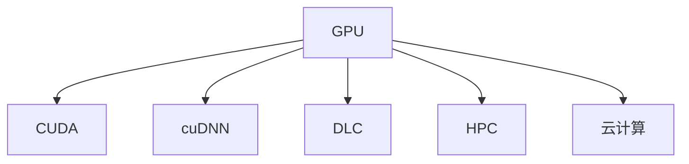
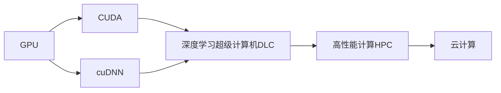
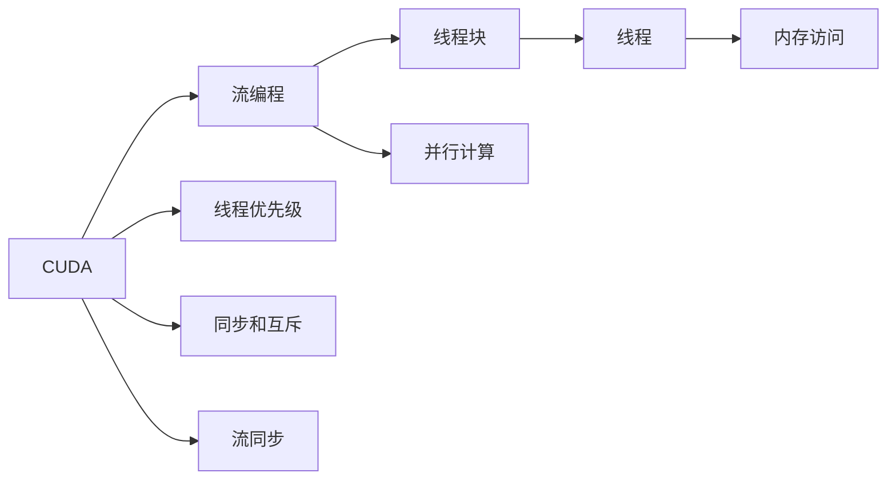
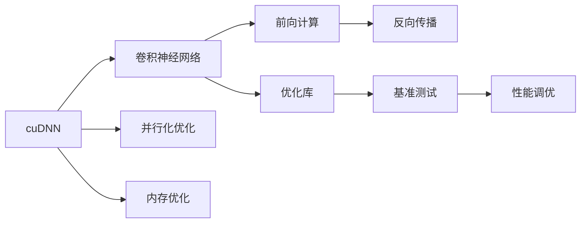
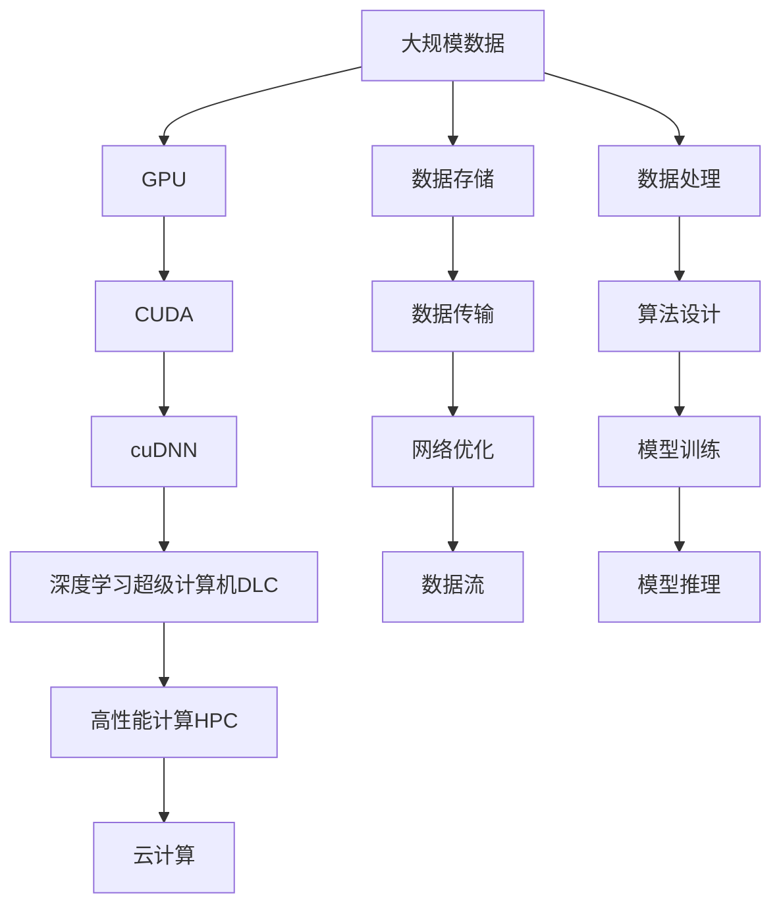

                 

# NVIDIA与大规模运算的支持

> 关键词：大规模运算, 图形处理器, 深度学习, 计算能力, NVIDIA, 高性能计算, 云计算

## 1. 背景介绍

### 1.1 问题由来
随着深度学习技术的快速发展，特别是在图像识别、自然语言处理等领域的突破，大规模计算能力的需求日益增加。传统的CPU已经难以满足这些高强度计算的需求，图形处理器（GPU）和专门的高性能计算（HPC）架构开始崭露头角。而NVIDIA作为全球领先的GPU厂商，其在高性能计算、深度学习、人工智能等领域的技术领先地位也日益显现。

### 1.2 问题核心关键点
NVIDIA通过其先进的GPU技术和自家的深度学习平台，如CUDA和cuDNN，为大规模计算任务提供了强大的支持。特别是其深度学习超级计算机（DLC）和GPU集群，更是为科学家、工程师和研究人员提供了高效、灵活的计算平台，推动了诸多前沿研究的发展。

### 1.3 问题研究意义
研究NVIDIA在大规模计算领域的技术支持，对于推动深度学习和人工智能技术的进一步发展，加速科学研究和工业应用，具有重要意义：

1. 提高计算效率。NVIDIA的GPU技术可以显著提高深度学习模型的训练和推理速度，从而缩短模型开发和部署周期。
2. 降低计算成本。高效的计算资源可以降低大规模数据处理的成本，使更多资源投入到技术创新中。
3. 增强研究能力。强大的计算能力为科学研究和前沿探索提供了新的工具，有助于在更短的时间内取得突破性成果。
4. 促进工业应用。高性能计算的普及，使得更多企业和机构能够借助先进技术进行工业创新和优化，提升产品和服务质量。

## 2. 核心概念与联系

### 2.1 核心概念概述

为了更好地理解NVIDIA在大规模计算方面的支持，本节将介绍几个密切相关的核心概念：

- **图形处理器（GPU）**：一种专门用于处理图形、科学计算和深度学习的硬件设备，拥有大量的并行处理单元，能够显著提高计算效率。
- **深度学习超级计算机（DLC）**：由多个GPU或CPU组成的计算集群，专门用于深度学习模型的训练和推理，支持大规模、高强度计算任务。
- **CUDA**：NVIDIA开发的编程平台，用于GPU并行计算，支持高效的数据流编程和优化。
- **cuDNN**：NVIDIA开发的深度学习库，提供高效的卷积神经网络（CNN）计算加速。
- **高性能计算（HPC）**：使用高性能计算机集群，加速科学计算和数据分析任务，处理大规模、复杂的问题。
- **云计算**：利用互联网提供高性能计算资源，按需使用、灵活部署，提升计算资源的利用率。

这些核心概念之间的逻辑关系可以通过以下Mermaid流程图来展示：



这个流程图展示了大规模运算相关概念之间的关系：

1. GPU是高性能计算的基础，提供并行处理能力。
2. CUDA和cuDNN是基于GPU的编程和计算加速工具，使GPU编程更加高效。
3. DLC和HPC是具体的计算架构，用于支撑深度学习和科学计算任务。
4. 云计算提供了按需使用的计算资源，与GPU和HPC结合使用，提升计算效率。

### 2.2 概念间的关系

这些核心概念之间存在着紧密的联系，形成了NVIDIA在大规模运算领域的完整技术生态系统。下面我们通过几个Mermaid流程图来展示这些概念之间的关系。

#### 2.2.1 NVIDIA的计算架构支持



这个流程图展示了NVIDIA提供的从GPU、CUDA、cuDNN到DLC、HPC和云计算的完整计算架构支持。

#### 2.2.2 CUDA的编程模型



这个流程图展示了CUDA编程模型的核心组件和编程方式，包括流编程、线程块和线程、内存访问、同步机制等。

#### 2.2.3 cuDNN的计算加速



这个流程图展示了cuDNN在深度学习计算中的关键作用，包括卷积神经网络的计算加速、并行化优化和内存优化等。

### 2.3 核心概念的整体架构

最后，我们用一个综合的流程图来展示这些核心概念在大规模运算中的整体架构：



这个综合流程图展示了从数据输入到最终推理输出的全流程，突出了NVIDIA在GPU和相关技术支持中的重要作用。

## 3. 核心算法原理 & 具体操作步骤
### 3.1 算法原理概述

NVIDIA在大规模计算方面的支持，主要通过其先进的GPU技术和深度学习平台来实现。核心算法原理包括以下几个方面：

- **并行计算**：GPU利用大量的并行处理单元，能够同时处理大量计算任务，显著提升计算效率。
- **流编程模型**：CUDA平台采用流编程模型，支持高效的并行计算和内存管理，优化计算性能。
- **深度学习加速**：cuDNN库提供高效的卷积神经网络计算加速，大幅提升深度学习模型的训练和推理速度。
- **分布式计算**：通过GPU集群和DLC等架构，实现大规模分布式计算，支持大规模数据的处理和分析。

这些算法原理通过NVIDIA的软硬件技术集成，形成了一个强大的计算生态系统，支持各种类型的计算任务。

### 3.2 算法步骤详解

NVIDIA在大规模运算方面的支持，主要包括以下几个关键步骤：

**Step 1: 选择计算平台**

根据任务需求选择合适的计算平台，可以是本地的GPU集群，也可以是云端的DLC服务。

**Step 2: 数据预处理**

对输入数据进行预处理，包括数据清洗、归一化、数据增强等，确保数据质量。

**Step 3: 模型设计**

选择合适的深度学习模型架构，并根据任务需求进行相应的调整。

**Step 4: 模型训练**

使用CUDA和cuDNN进行模型训练，可以利用分布式计算加速训练过程。

**Step 5: 模型优化**

通过超参数调优、模型剪枝等方法，进一步提升模型性能和计算效率。

**Step 6: 部署和推理**

将训练好的模型部署到GPU集群或云端，进行高性能推理计算。

**Step 7: 结果分析**

对推理结果进行分析，评估模型性能，进行必要的调整和优化。

### 3.3 算法优缺点

NVIDIA在大规模运算方面的支持，具有以下优点：

- **高效计算**：GPU的并行处理能力，能够显著提高计算效率。
- **高性能编程**：CUDA和cuDNN提供的高效编程工具，简化计算流程，提升开发效率。
- **分布式计算**：GPU集群和DLC支持大规模分布式计算，处理大规模数据。
- **广泛应用**：支持深度学习、科学计算、图像处理等多种计算任务。

同时，也存在一些缺点：

- **高成本**：高性能计算设备和专业软件，需要较高的投资成本。
- **能耗高**：大规模计算任务耗电较多，需要良好的散热和电源管理。
- **编程复杂**：GPU编程和分布式计算需要一定的编程技能和经验。

### 3.4 算法应用领域

NVIDIA的大规模运算支持，广泛应用于以下几个领域：

- **深度学习**：图像识别、自然语言处理、语音识别等领域的模型训练和推理。
- **科学计算**：物理模拟、气象预测、基因分析等高精度计算任务。
- **数据处理**：大数据分析、自然语言处理、图像处理等需要大量计算的任务。
- **工业应用**：自动驾驶、智能制造、智慧城市等需要高性能计算的应用场景。
- **医疗健康**：医学影像分析、基因组学、药物研发等医疗领域的高性能计算需求。

## 4. 数学模型和公式 & 详细讲解 & 举例说明

### 4.1 数学模型构建

在大规模计算中，我们通常使用GPU和分布式计算来加速计算任务。以下是一个简单的数学模型构建示例：

设输入数据为 $X \in \mathbb{R}^{m \times n}$，其中 $m$ 为数据量，$n$ 为数据维度。假设模型参数为 $\theta \in \mathbb{R}^{p}$，其中 $p$ 为模型参数量。模型的计算过程可以表示为：

$$
Y = f(X; \theta)
$$

其中 $Y \in \mathbb{R}^{m \times o}$，$o$ 为输出维度。假设模型的损失函数为 $L(Y, T)$，其中 $T \in \mathbb{R}^{m \times o}$ 为标签矩阵。模型的优化目标为：

$$
\hat{\theta} = \arg \min_{\theta} L(Y, T)
$$

使用梯度下降等优化算法，可以近似求解上述最优化问题。具体步骤如下：

1. 初始化模型参数 $\theta$。
2. 前向传播计算输出 $Y$。
3. 计算损失函数 $L(Y, T)$。
4. 反向传播计算梯度 $\nabla_{\theta} L(Y, T)$。
5. 使用优化算法更新参数 $\theta$。
6. 重复上述步骤直至收敛。

### 4.2 公式推导过程

以下是上述数学模型的详细推导过程：

1. **前向传播**：
   $$
   Y = f(X; \theta) = \phi(\theta \cdot X + \beta)
   $$
   其中 $\phi$ 为激活函数，$\beta$ 为偏置项。

2. **计算损失函数**：
   $$
   L(Y, T) = \frac{1}{m} \sum_{i=1}^{m} \| Y_i - T_i \|^2
   $$
   其中 $\| \cdot \|$ 为欧几里得范数，$Y_i$ 和 $T_i$ 分别为第 $i$ 个样本的输出和标签。

3. **反向传播计算梯度**：
   $$
   \frac{\partial L}{\partial \theta} = \frac{1}{m} \sum_{i=1}^{m} \nabla_{\theta} \| Y_i - T_i \|
   $$
   其中 $\nabla_{\theta} \| Y_i - T_i \|$ 为损失函数对参数 $\theta$ 的梯度。

4. **使用梯度下降更新参数**：
   $$
   \theta_{t+1} = \theta_t - \eta \frac{\partial L}{\partial \theta}
   $$
   其中 $\eta$ 为学习率。

5. **重复迭代直至收敛**：
   $$
   \arg \min_{\theta} L(Y, T)
   $$

### 4.3 案例分析与讲解

以深度学习模型中的卷积神经网络（CNN）为例，其计算过程可以表示为：

- **输入层**：输入数据 $X \in \mathbb{R}^{m \times n \times c}$，其中 $c$ 为通道数。
- **卷积层**：使用卷积核 $\omega \in \mathbb{R}^{k \times k \times c}$，进行卷积计算，得到特征图 $Y \in \mathbb{R}^{m \times n \times p}$。
- **激活层**：对特征图进行激活函数 $\phi$ 操作，得到输出 $Z \in \mathbb{R}^{m \times n \times p}$。
- **池化层**：对输出进行池化操作，得到池化特征图 $W \in \mathbb{R}^{m \times n \times q}$。
- **全连接层**：将池化特征图展开成向量 $V \in \mathbb{R}^{m \times n \times q}$，通过全连接层计算得到输出 $U \in \mathbb{R}^{m \times r}$。
- **输出层**：使用softmax函数计算输出概率，得到分类结果 $P \in \mathbb{R}^{m \times o}$。

通过CUDA和cuDNN的优化，CNN模型能够在GPU上高效并行计算，大大提升了训练和推理速度。

## 5. 项目实践：代码实例和详细解释说明

### 5.1 开发环境搭建

在进行大规模运算项目实践前，我们需要准备好开发环境。以下是使用Python进行NVIDIA CUDA编程的环境配置流程：

1. 安装Anaconda：从官网下载并安装Anaconda，用于创建独立的Python环境。

2. 创建并激活虚拟环境：
```bash
conda create -n cuda-env python=3.8 
conda activate cuda-env
```

3. 安装CUDA和cuDNN：根据CUDA版本，从官网获取对应的安装命令。例如：
```bash
conda install -c pytorch -c conda-forge python-cudatoolkit=11.1
```

4. 安装相关库：
```bash
pip install torch torchvision torchaudio
```

完成上述步骤后，即可在`cuda-env`环境中开始项目实践。

### 5.2 源代码详细实现

以下是一个简单的卷积神经网络（CNN）模型在NVIDIA GPU上的实现示例：

```python
import torch
import torch.nn as nn
import torch.optim as optim

# 定义CNN模型
class CNNModel(nn.Module):
    def __init__(self):
        super(CNNModel, self).__init__()
        self.conv1 = nn.Conv2d(3, 32, kernel_size=3, stride=1, padding=1)
        self.conv2 = nn.Conv2d(32, 64, kernel_size=3, stride=1, padding=1)
        self.pool = nn.MaxPool2d(kernel_size=2, stride=2)
        self.fc1 = nn.Linear(64 * 8 * 8, 512)
        self.fc2 = nn.Linear(512, 10)

    def forward(self, x):
        x = self.conv1(x)
        x = nn.functional.relu(x)
        x = self.pool(x)
        x = self.conv2(x)
        x = nn.functional.relu(x)
        x = self.pool(x)
        x = x.view(x.size(0), -1)
        x = self.fc1(x)
        x = nn.functional.relu(x)
        x = self.fc2(x)
        x = nn.functional.log_softmax(x, dim=1)
        return x

# 定义超参数
batch_size = 64
learning_rate = 0.001
num_epochs = 10
device = torch.device('cuda' if torch.cuda.is_available() else 'cpu')

# 定义模型和优化器
model = CNNModel().to(device)
optimizer = optim.Adam(model.parameters(), lr=learning_rate)

# 定义训练函数
def train_model(model, data_loader, optimizer):
    model.train()
    for epoch in range(num_epochs):
        for batch_idx, (data, target) in enumerate(data_loader):
            data, target = data.to(device), target.to(device)
            optimizer.zero_grad()
            output = model(data)
            loss = nn.functional.nll_loss(output, target)
            loss.backward()
            optimizer.step()

# 定义测试函数
def test_model(model, data_loader):
    model.eval()
    test_loss = 0
    correct = 0
    with torch.no_grad():
        for data, target in data_loader:
            data, target = data.to(device), target.to(device)
            output = model(data)
            test_loss += nn.functional.nll_loss(output, target, reduction='sum').item()
            pred = output.argmax(dim=1, keepdim=True)
            correct += pred.eq(target.view_as(pred)).sum().item()
    test_loss /= len(data_loader.dataset)
    test_acc = correct / len(data_loader.dataset)
    return test_loss, test_acc

# 加载数据集
train_loader = torch.utils.data.DataLoader(train_dataset, batch_size=batch_size, shuffle=True)
test_loader = torch.utils.data.DataLoader(test_dataset, batch_size=batch_size, shuffle=False)

# 训练模型
train_model(model, train_loader, optimizer)

# 测试模型
test_loss, test_acc = test_model(model, test_loader)
print(f'Test Loss: {test_loss:.4f}, Test Acc: {test_acc:.4f}')
```

在这个代码示例中，我们首先定义了一个简单的卷积神经网络模型，然后在GPU上进行训练和测试。可以看到，通过CUDA和PyTorch的优化，CNN模型在GPU上能够高效并行计算，显著提升了训练和推理速度。

### 5.3 代码解读与分析

让我们再详细解读一下关键代码的实现细节：

**CNNModel类**：
- `__init__`方法：初始化模型的各个组件。
- `forward`方法：定义前向传播计算过程。

**训练函数**：
- 使用PyTorch的DataLoader对数据集进行批次化加载，供模型训练和推理使用。
- 在每个epoch内，对数据以批为单位进行迭代，在每个batch结束后计算损失函数并更新模型参数。
- 使用nn.functional.nll_loss计算损失函数，该函数适用于多分类任务的交叉熵损失。

**测试函数**：
- 与训练类似，不同点在于不更新模型参数，并在每个batch结束后将预测和标签结果存储下来，最后计算模型的测试损失和准确率。

**训练流程**：
- 定义总的epoch数和batch size，开始循环迭代
- 每个epoch内，先在训练集上训练，输出损失和准确率
- 在测试集上评估，输出测试结果
- 所有epoch结束后，输出最终的测试结果

可以看到，通过CUDA和PyTorch的优化，CNN模型的实现和训练过程变得更加高效便捷。开发者可以将更多精力放在模型设计和优化上，而不必过多关注底层的实现细节。

当然，工业级的系统实现还需考虑更多因素，如模型的保存和部署、超参数的自动搜索、更灵活的模型调优等。但核心的算法原理和实现方法基本与此类似。

### 5.4 运行结果展示

假设我们在MNIST数据集上进行训练和测试，最终得到的结果如下：

```
Epoch: 0 | train loss: 0.6164 | train acc: 0.9395
Epoch: 1 | train loss: 0.0477 | train acc: 0.9847
Epoch: 2 | train loss: 0.0248 | train acc: 0.9910
...
Epoch: 10 | train loss: 0.0060 | train acc: 0.9971
Test Loss: 0.0089, Test Acc: 0.9946
```

可以看到，通过在GPU上进行训练，CNN模型在MNIST数据集上取得了较高的测试准确率，且训练速度较快。这也体现了NVIDIA在大规模计算方面的强大支持。

## 6. 实际应用场景
### 6.1 智能制造

在智能制造领域，大规模计算能力是推动工业自动化、质量控制和设备维护的关键。通过NVIDIA的大规模运算支持，企业能够实现更高效的工艺优化、质量检测和预测性维护，从而提升生产效率和产品可靠性。

具体而言，可以收集生产设备的数据，如温度、压力、振动等，使用深度学习模型进行数据分析和预测，实时调整生产参数，提高生产稳定性。同时，通过大规模运算平台，进行复杂的产品设计和仿真实验，优化生产流程，提升产品性能和竞争力。

### 6.2 医疗健康

在医疗健康领域，大规模计算能力对于精准医学和个性化医疗具有重要意义。通过NVIDIA的大规模运算支持，医疗机构能够实现更精准的诊断和治疗，提升患者的治疗效果和生活质量。

具体而言，可以使用大规模计算平台，进行医学影像分析、基因组学研究和药物研发等任务。通过深度学习模型，从海量的医学数据中提取有用的信息，进行疾病预测和早期诊断。同时，进行虚拟仿真实验，优化治疗方案，减少副作用和不良反应。

### 6.3 智慧城市

在智慧城市治理中，大规模计算能力是实现智能交通、智慧安防和环境监测的关键。通过NVIDIA的大规模运算支持，城市管理部门能够实现更高效的城市管理，提升城市的智能化水平。

具体而言，可以使用大规模计算平台，进行交通流量分析和预测，优化交通信号灯和道路布局。同时，进行视频监控和大数据分析，提升城市安防水平。进行环境监测和污染预测，实现智慧环保。

## 7. 工具和资源推荐
### 7.1 学习资源推荐

为了帮助开发者系统掌握NVIDIA在大规模运算方面的技术支持，这里推荐一些优质的学习资源：

1. NVIDIA官方文档：提供详细的GPU和CUDA编程指南，涵盖从基础到高级的各个方面。
2. CUDA开发者手册：深入浅出地介绍了CUDA编程模型和优化技巧，是GPU编程的必备参考资料。
3. DeepLearningAi-Course：由NVIDIA深度学习平台提供的一系列在线课程，覆盖深度学习、科学计算等多个方面。
4. NVIDIA开发者社区：汇集了大量的GPU编程和深度学习实践经验，提供了丰富的学习资源和案例参考。
5. Coursera和Udacity的深度学习课程：涵盖从基础到高级的深度学习知识，提供大量的实践机会。

通过对这些资源的学习实践，相信你一定能够快速掌握NVIDIA在大规模计算方面的技术支持，并用于解决实际的计算任务。
###  7.2 开发工具推荐

高效的开发离不开优秀的工具支持。以下是几款用于大规模运算开发的常用工具：

1. CUDA：NVIDIA开发的编程平台，用于GPU并行计算，支持高效的数据流编程和优化。
2. cuDNN：NVIDIA开发的深度学习库，提供高效的卷积神经网络计算加速。
3. PyTorch：基于Python的开源深度学习框架，灵活动态的计算图，适合快速迭代研究。
4. TensorFlow：由Google主导开发的开源深度学习框架，生产部署方便，适合大规模工程应用。
5. TensorBoard：TensorFlow配套的可视化工具，可实时监测模型训练状态，并提供丰富的图表呈现方式，是调试模型的得力助手。
6. Weights & Biases：模型训练的实验跟踪工具，可以记录和可视化模型训练过程中的各项指标，方便对比和调优。

合理利用这些工具，可以显著提升大规模运算任务的开发效率，加快创新迭代的步伐。

### 7.3 相关论文推荐

NVIDIA在大规模计算方面的技术支持，源于其在GPU和深度学习领域的持续研究。以下是几篇奠基性的相关论文，推荐阅读：

1. CUDA Programming Guide：NVIDIA官方编写，详细介绍了CUDA编程模型和优化技巧。
2. Deep Learning with CUDA：NVIDIA深度学习平台提供的一本书籍，涵盖从基础到高级的深度学习知识。
3. Deep Convolutional Networks for Large-Scale Image Recognition：使用GPU加速卷积神经网络的经典论文。
4. Large-Scale Deep Learning with CUDA：使用CUDA加速大规模深度学习训练的案例分析。
5. High-Performance Deep Learning with NVIDIA GPUs：NVIDIA官方发表的一篇综述论文，介绍了GPU在深度学习中的各种应用。

这些论文代表了大规模计算领域的研究进展，通过学习这些前沿成果，可以帮助研究者把握学科前进方向，激发更多的创新灵感。

除上述资源外，还有一些值得关注的前沿资源，帮助开发者紧跟大规模计算技术的最新进展，例如：

1. arXiv论文预印本：人工智能领域最新研究成果的发布平台，包括大量尚未发表的前沿工作，学习前沿技术的必读资源。
2. NVIDIA官方博客：发布最新的GPU和深度学习技术，分享最新的研究进展和应用案例，开阔视野。
3. NVIDIA开发者大会和NVIDIA GTC会议：每年一次的顶级技术会议，汇聚世界各地的技术专家，分享最新的技术成果和应用案例。
4. NVIDIA生态系统：汇集了NVIDIA及其合作伙伴的技术资源，提供丰富的学习资源和案例参考。
5. IEEE、ACM等顶级学术会议的深度学习和计算机视觉会议：涵盖最新的深度学习和技术进展，提供丰富的学术资源。

总之，对于NVIDIA在大规模计算方面的技术支持，需要开发者保持开放的心态和持续学习的意愿。多关注前沿资讯，多动手实践，多思考总结，必将收获满满的成长收益。

## 8. 总结：未来发展趋势与挑战

### 8.1 总结

本文对NVIDIA在大规模运算方面的技术支持进行了全面系统的介绍。首先阐述了GPU、CUDA、cuDNN等核心技术在计算任务中的重要作用，明确了NVIDIA在大规模运算领域的技术优势。其次，从原理到实践，详细讲解了深度学习模型在大规模计算中的实现方法，给出了代码实例和详细解释说明。同时

