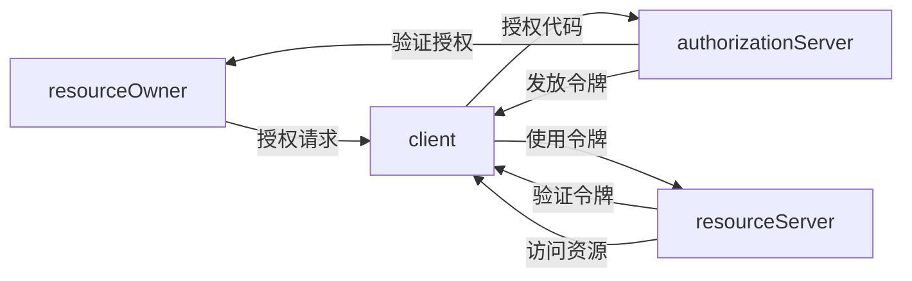

                 

## 1. 背景介绍

在当前快速发展的互联网应用中，用户希望能够在不同应用间平滑地切换，并享受跨应用服务。OAuth 2.0协议正是为了解决这类问题而设计的。它提供了一种标准化的方式，允许用户授权第三方应用访问其资源，而无需共享其凭证。OAuth 2.0已经被广泛接受和采用，成为了Web应用中最流行的认证协议之一。本文将深入探讨OAuth 2.0的原理和应用，帮助读者理解和实现基于OAuth 2.0的跨应用集成。

## 2. 核心概念与联系

### 2.1 核心概念概述

OAuth 2.0协议是一套定义了授权过程和资源访问的框架，由四个主要角色组成：

- **资源所有者**：指用户，即资源的拥有者。
- **客户端**：指第三方应用，请求访问资源。
- **授权服务器**：负责验证用户授权和发放令牌。
- **资源服务器**：提供资源的API接口。

OAuth 2.0协议的授权流程可以分为授权码模式、密码模式、客户端模式、隐式模式和端口令牌模式五种。其中，授权码模式和隐式模式是应用最为广泛的模式，本文将以这两种模式为例进行详细讲解。

### 2.2 概念间的关系

OAuth 2.0协议的各个角色和授权流程可以通过以下Mermaid流程图来展示：



该流程图展示了OAuth 2.0的基本流程：客户端向资源所有者请求授权，然后授权服务器验证授权并发放令牌，最后客户端使用令牌访问资源服务器提供的资源。

## 3. 核心算法原理 & 具体操作步骤

### 3.1 算法原理概述

OAuth 2.0协议的核心在于令牌授权机制，其授权过程主要包括以下几个步骤：

1. 客户端向授权服务器发送授权请求。
2. 授权服务器验证用户身份并获取授权。
3. 授权服务器发放令牌给客户端。
4. 客户端使用令牌访问资源服务器。
5. 资源服务器验证令牌并允许访问。

该过程中，授权服务器和资源服务器通常采用基于状态的机制，确保令牌的有效期和安全性。客户端和资源服务器之间的通信通常使用HTTP协议，并且需要在请求中传递相应的令牌。

### 3.2 算法步骤详解

#### 3.2.1 授权码模式

授权码模式是最常见的OAuth 2.0授权流程，适用于Web和移动端应用。其具体步骤如下：

1. **获取授权码**：客户端向授权服务器发送授权请求，授权服务器返回授权码。
2. **获取访问令牌**：客户端将授权码与客户端凭证一起发送到授权服务器，授权服务器验证后发放访问令牌。
3. **获取刷新令牌**：在某些情况下，客户端还可以请求刷新令牌，用于后续刷新访问令牌。

下面是一个授权码模式的伪代码示例：

```python
# 获取授权码
response = requests.get('https://auth-server.com/oauth/authorize', params={
    'client_id': client_id,
    'redirect_uri': redirect_uri,
    'response_type': 'code'
})

# 获取访问令牌
response = requests.post('https://auth-server.com/oauth/token', data={
    'client_id': client_id,
    'client_secret': client_secret,
    'grant_type': 'authorization_code',
    'code': code,
    'redirect_uri': redirect_uri
})
```

#### 3.2.2 隐式模式

隐式模式适用于不需要服务器端存储的客户端，如iOS和Android应用。其具体步骤如下：

1. **获取访问令牌**：客户端向授权服务器发送授权请求，授权服务器验证并发放访问令牌。
2. **使用访问令牌**：客户端直接使用访问令牌访问资源服务器。

下面是一个隐式模式的伪代码示例：

```python
# 获取访问令牌
response = requests.get('https://auth-server.com/oauth/authorize', params={
    'client_id': client_id,
    'redirect_uri': redirect_uri,
    'response_type': 'token'
})

# 使用访问令牌
token = response.json().get('access_token')
```

### 3.3 算法优缺点

OAuth 2.0协议的优点在于其灵活性和安全性。它允许不同应用和不同用户使用相同的方式进行授权，同时采用令牌机制，保护用户的凭证安全。缺点在于其复杂性较高，需要客户端和授权服务器进行紧密配合，并且需要设计合理的令牌管理机制。

### 3.4 算法应用领域

OAuth 2.0协议被广泛应用于各种Web和移动应用中，例如：

- 社交网络平台，如Facebook、Twitter等，允许用户授权第三方应用访问其个人资料。
- 云存储服务，如Dropbox、Google Drive等，允许用户授权第三方应用访问其文件和数据。
- 移动支付平台，如PayPal、Apple Pay等，允许用户授权第三方应用访问其支付信息。

## 4. 数学模型和公式 & 详细讲解 & 举例说明

### 4.1 数学模型构建

OAuth 2.0协议的授权过程可以通过以下几个公式来描述：

1. 授权码模式：

   ```latex
   \begin{align*}
   \text{授权码} & = \text{授权服务器}(\text{客户端请求}, \text{授权码}) \\
   \text{访问令牌} & = \text{授权服务器}(\text{客户端凭证}, \text{授权码}, \text{客户端凭证}) \\
   \text{刷新令牌} & = \text{授权服务器}(\text{客户端凭证}, \text{授权码}, \text{客户端凭证})
   \end{align*}
   ```

2. 隐式模式：

   ```latex
   \text{访问令牌} = \text{授权服务器}(\text{客户端请求}, \text{客户端凭证}, \text{授权码})
   ```

### 4.2 公式推导过程

以上公式描述了OAuth 2.0协议的基本授权流程。授权服务器在验证客户端凭证和授权码后，发放相应的令牌。客户端使用令牌访问资源服务器，资源服务器验证令牌后提供资源访问。

### 4.3 案例分析与讲解

以Facebook的OAuth 2.0授权为例，其授权流程如下：

1. 用户访问Facebook应用，并决定授权该应用访问其个人资料。
2. Facebook应用向Facebook授权服务器发送授权请求。
3. 授权服务器验证Facebook应用的客户端凭证，并向用户展示授权请求。
4. 用户同意授权，授权服务器发放授权码。
5. Facebook应用将授权码与客户端凭证一起发送到授权服务器，获取访问令牌。
6. Facebook应用使用访问令牌访问用户的个人资料。

通过这个例子，我们可以看到OAuth 2.0协议在实际应用中的灵活性和安全性。

## 5. 项目实践：代码实例和详细解释说明

### 5.1 开发环境搭建

要在开发环境中实现OAuth 2.0协议，需要安装相应的库和工具。这里以Python为例，介绍所需的库和工具：

1. Flask：用于搭建Web服务器。
2. requests：用于HTTP请求。
3. OAuthlib：用于处理OAuth 2.0授权流程。

使用以下命令安装所需的库：

```bash
pip install Flask requests OAuthlib
```

### 5.2 源代码详细实现

下面是一个基于OAuth 2.0协议的伪代码示例：

```python
from flask import Flask, request, jsonify
from requests import get
from oauthlib.oauth2 import BackendApplicationClient

app = Flask(__name__)

client = BackendApplicationClient()

@app.route('/oauth/token', methods=['POST'])
def token():
    client_id = request.json.get('client_id')
    client_secret = request.json.get('client_secret')
    scope = request.json.get('scope')
    
    response = get('https://auth-server.com/oauth/token', params={
        'client_id': client_id,
        'client_secret': client_secret,
        'grant_type': 'client_credentials',
        'scope': scope
    })
    
    return jsonify(response.json())

if __name__ == '__main__':
    app.run(debug=True)
```

### 5.3 代码解读与分析

以上代码实现了基于OAuth 2.0协议的访问令牌获取。客户端通过POST请求发送客户端凭证，授权服务器验证后发放访问令牌。

### 5.4 运行结果展示

假设我们运行上述代码，并成功获取了访问令牌，则可以使用该令牌访问资源服务器提供的资源。以下是一个简单的访问请求示例：

```python
token = get('https://auth-server.com/oauth/token', params={
    'client_id': client_id,
    'client_secret': client_secret,
    'grant_type': 'client_credentials',
    'scope': 'read'
}).json().get('access_token')

response = get('https://resource-server.com/api/resource', headers={'Authorization': f'Bearer {token}'})
```

## 6. 实际应用场景

### 6.4 未来应用展望

OAuth 2.0协议将在未来的跨应用集成中发挥重要作用。随着互联网应用的不断扩展，用户将更加关注跨应用服务的无缝连接和数据安全。OAuth 2.0协议的灵活性和安全性，将使其成为实现这一目标的关键技术。

## 7. 工具和资源推荐

### 7.1 学习资源推荐

为了帮助读者深入理解OAuth 2.0协议，以下是一些优质的学习资源：

1. OAuth 2.0官方文档：OAuth 2.0官方网站提供了详细的协议文档和技术规范，是学习OAuth 2.0协议的必备资源。
2. OAuth 2.0实战指南：《OAuth 2.0实战指南》一书深入浅出地介绍了OAuth 2.0协议的实现细节和应用场景，适合实战开发。
3. OAuth 2.0课程：Coursera和Udemy等在线平台提供了多门OAuth 2.0相关课程，涵盖协议原理和实践技巧。

### 7.2 开发工具推荐

在开发过程中，以下是一些常用的工具：

1. Flask：轻量级的Web框架，适合搭建小型应用。
2. requests：Python的HTTP库，用于发送HTTP请求。
3. OAuthlib：Python的OAuth 2.0库，用于处理授权流程。

### 7.3 相关论文推荐

OAuth 2.0协议的实现和应用一直是研究热点。以下是几篇相关的论文，值得阅读：

1. OAuth 2.0: The OAuth 2.0 Protocol Version 2.0：OAuth 2.0协议的官方规范。
2. OAuth 2.0: A Framework for Secure and Delegated Access to Resources：OAuth 2.0协议的原始论文。
3. OAuth 2.0: The Full Guide：OAuth 2.0协议的全面指南。

## 8. 总结：未来发展趋势与挑战

### 8.1 研究成果总结

OAuth 2.0协议作为互联网应用的标准化授权机制，已经广泛应用于各类Web和移动应用中。其在授权流程的灵活性和安全性方面，具有显著优势。未来，随着物联网、智能家居等新兴技术的发展，OAuth 2.0协议的应用场景将更加广泛。

### 8.2 未来发展趋势

OAuth 2.0协议的未来发展趋势主要包括以下几个方面：

1. 扩展性增强：OAuth 2.0协议的扩展性将不断增强，支持更多的授权模式和应用场景。
2. 安全性提升：随着安全威胁的不断增加，OAuth 2.0协议将引入更多的安全机制，如多因素认证、时间同步等。
3. 标准化完善：OAuth 2.0协议的标准化将更加完善，成为更多应用领域的首选授权方案。

### 8.3 面临的挑战

尽管OAuth 2.0协议在授权领域取得了广泛应用，但在其发展过程中也面临一些挑战：

1. 复杂性：OAuth 2.0协议的授权流程较为复杂，需要客户端和授权服务器紧密配合。
2. 安全性：OAuth 2.0协议的安全性仍然存在一定的风险，需要不断优化。
3. 兼容性：不同应用和不同协议之间的兼容性问题，需要解决。

### 8.4 研究展望

未来，OAuth 2.0协议的研究将聚焦于以下几个方向：

1. 简化授权流程：通过引入新授权模式或简化现有模式，提高OAuth 2.0协议的易用性和普及性。
2. 增强安全性：引入更多的安全机制，如数字签名、证书认证等，保障授权流程的安全性。
3. 扩展应用场景：支持更多的应用场景和数据类型，如物联网、人工智能等。

## 9. 附录：常见问题与解答

**Q1：OAuth 2.0协议适用于哪些场景？**

A: OAuth 2.0协议适用于需要授权第三方应用访问用户资源的场景，如社交网络、云存储、移动支付等。

**Q2：如何保护OAuth 2.0令牌的安全性？**

A: OAuth 2.0令牌的安全性保护主要依赖令牌的有效期和存储方式。授权服务器可以采用时间同步和令牌旋转等机制，确保令牌的有效性和安全性。

**Q3：OAuth 2.0协议是否适用于物联网应用？**

A: OAuth 2.0协议的设计理念可以应用于物联网应用，但由于物联网设备的资源和计算能力有限，需要简化授权流程和令牌管理机制。

**Q4：OAuth 2.0协议与其他授权协议有何区别？**

A: OAuth 2.0协议与其他授权协议的主要区别在于其灵活性和安全性。OAuth 2.0协议支持多种授权模式和应用场景，同时采用令牌机制，保护用户的凭证安全。

**Q5：OAuth 2.0协议是否需要客户端和授权服务器之间的双向认证？**

A: OAuth 2.0协议通常需要客户端和授权服务器之间的双向认证，以确保授权流程的安全性。但在某些场景下，如内部应用和轻量级应用，可以简化认证机制。

---

作者：禅与计算机程序设计艺术 / Zen and the Art of Computer Programming

