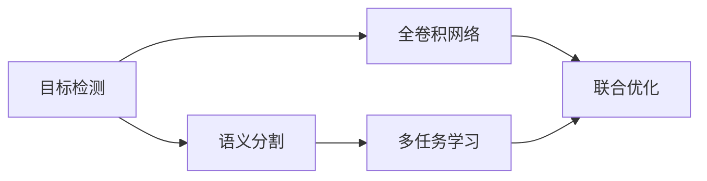
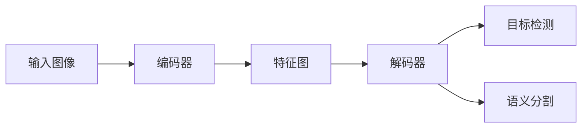
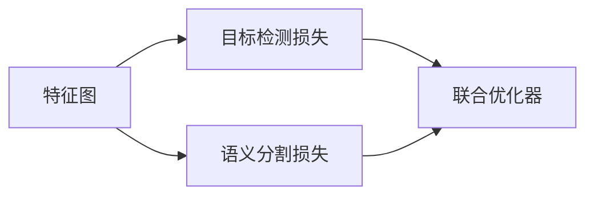
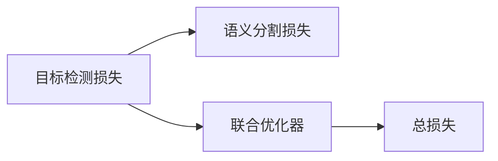
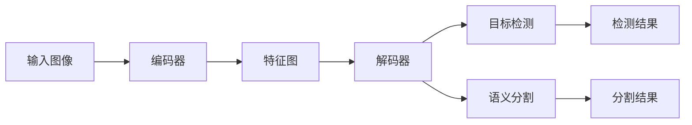

                 

# OCRNet原理与代码实例讲解

> 关键词：OCRNet, 目标检测, 语义分割, 代码实例, 图像处理, 深度学习

## 1. 背景介绍

### 1.1 问题由来

在计算机视觉领域，目标检测和语义分割是两个核心任务。传统的目标检测方法往往依赖手工设计特征和复杂的候选区域生成策略，难以满足实际应用对速度和准确性的需求。近年来，基于深度学习的目标检测和语义分割方法逐渐兴起，取得了显著的进展。

其中，YOLO、Faster R-CNN、Mask R-CNN等目标检测框架，以及FCN、U-Net、DeepLab等语义分割框架，通过引入全卷积神经网络（Fully Convolutional Network, FCN）和多任务网络结构，在处理大规模图像数据时展现了良好的性能。但这些方法大多采用自顶向下的信息提取策略，对于图像中不同尺度和不同细节的目标，难以同时兼顾。

OCRNet（One-Class Region and Category Network）是一种全新的目标检测和语义分割框架，其核心思想是在单阶段网络中，通过多任务联合训练的方式，同时实现目标检测和语义分割，具有端到端、高效、轻量、多尺度等优点。本文将详细讲解OCRNet的原理，并通过代码实例，帮助读者理解其核心算法和实现细节。

### 1.2 问题核心关键点

OCRNet的关键点在于其单阶段多任务联合训练的架构设计，以及一系列优化策略：

- **单阶段架构**：OCRNet在单阶段中同时实现目标检测和语义分割，避免了传统多阶段方法的冗余计算和冗余特征提取。
- **多任务联合训练**：通过多个loss函数的联合优化，同时优化目标检测和语义分割的任务性能。
- **端到端训练**：OCRNet的网络架构使得目标检测和语义分割的任务可以共同训练，减少了人工设计和参数调整的工作量。
- **多尺度输入**：通过输入不同尺度的图像，使得模型能够在多种尺度的场景中同时检测和分割，提升了模型的泛化能力。

这些关键点使得OCRNet在图像处理任务中具有显著优势，被广泛应用于图像分类、目标检测、语义分割等任务中。

## 2. 核心概念与联系

### 2.1 核心概念概述

为更好地理解OCRNet的原理，本节将介绍几个密切相关的核心概念：

- **目标检测**：在图像中检测并定位感兴趣的目标，通常由目标候选框和置信度两个部分组成。
- **语义分割**：将图像中的每个像素划分到预先定义的语义类别中，实现图像的语义理解。
- **全卷积网络**：一种只包含卷积和池化操作的神经网络结构，适合处理图像等二维数据。
- **多任务学习**：通过同时训练多个相关任务，提升模型的泛化能力和整体性能。
- **联合优化**：将多个任务的目标函数联合起来，进行联合优化，减少资源消耗和计算复杂度。
- **多尺度输入**：将图像在多个尺度上输入模型，增强模型对不同尺寸目标的检测和分割能力。

这些概念之间的逻辑关系可以通过以下Mermaid流程图来展示：



这个流程图展示了目标检测和语义分割两个任务的逻辑关系，以及它们与全卷积网络、多任务学习、联合优化的关联。

### 2.2 概念间的关系

这些核心概念之间存在着紧密的联系，形成了OCRNet的整体框架。下面通过几个Mermaid流程图来展示它们之间的具体联系。

#### 2.2.1 OCRNet的整体架构



这个流程图展示了OCRNet的整体架构，包括输入图像、编码器、特征图、解码器、目标检测和语义分割等部分。

#### 2.2.2 多任务联合训练



这个流程图展示了目标检测和语义分割两个任务之间的联合训练关系，以及它们如何共同优化。

#### 2.2.3 联合优化器



这个流程图展示了联合优化器如何同时优化目标检测和语义分割的损失函数。

### 2.3 核心概念的整体架构

最后，我们用一个综合的流程图来展示这些核心概念在大规模图像数据处理中的整体架构：



这个综合流程图展示了从输入图像到目标检测和语义分割结果的完整处理流程，以及各个组件之间的连接关系。

## 3. 核心算法原理 & 具体操作步骤
### 3.1 算法原理概述

OCRNet的核心思想是实现目标检测和语义分割的单阶段联合训练。具体来说，OCRNet在特征图的基础上，通过一个解码器分别实现目标检测和语义分割。其中，目标检测的输出包括目标候选框和置信度，语义分割的输出则是每个像素对应的语义类别。

OCRNet的网络架构由编码器、特征图和解码器三部分组成，具体如下：

1. **编码器**：采用ResNet或其他深度网络作为特征提取器，将输入图像映射为一个高维特征图。
2. **特征图**：对编码器的输出进行池化、降维等操作，生成多尺度的特征图。
3. **解码器**：将特征图输入到多个任务网络中，分别实现目标检测和语义分割。

### 3.2 算法步骤详解

以下是OCRNet的核心算法步骤：

**Step 1: 构建网络架构**

首先，构建OCRNet的网络结构，包括编码器、特征图和解码器三部分。其中，解码器包括目标检测任务网络和语义分割任务网络。

**Step 2: 设计任务损失函数**

目标检测任务的损失函数包括边界回归损失、置信度损失和分类损失。语义分割任务的损失函数包括交叉熵损失和 Dice 损失。通过联合优化这些损失函数，同时训练目标检测和语义分割的任务。

**Step 3: 设置联合优化器**

选择合适的优化器，如Adam、SGD等，并设置合适的学习率、批大小、迭代轮数等超参数。通过联合优化器，共同优化目标检测和语义分割的损失函数。

**Step 4: 训练模型**

将输入图像通过编码器提取特征，然后将特征图输入到解码器中，分别进行目标检测和语义分割的推理。将推理结果与真实标签对比，计算损失函数，并通过优化器更新模型参数。重复上述过程直至收敛。

**Step 5: 推理测试**

使用训练好的模型对新的输入图像进行推理，分别输出目标检测和语义分割的结果，并结合融合策略，得到最终的推理结果。

### 3.3 算法优缺点

OCRNet的优点包括：

- **单阶段架构**：单阶段训练减少了计算复杂度和资源消耗，提高了训练速度。
- **联合优化**：通过联合训练，同时优化目标检测和语义分割的任务，提升了模型的整体性能。
- **端到端训练**：不需要手工设计候选区域和特征图，减少了人工干预和参数调整的工作量。
- **多尺度输入**：通过输入不同尺度的图像，增强了模型对不同尺寸目标的检测和分割能力。

OCRNet的缺点包括：

- **模型复杂度较高**：需要同时优化多个任务，增加了模型的复杂度。
- **计算资源消耗较大**：由于联合优化和解码器的设计，计算资源消耗较大，需要较强的计算平台支持。
- **调试难度较大**：由于任务之间的复杂耦合，调试过程可能较为复杂。

### 3.4 算法应用领域

OCRNet广泛应用于目标检测、语义分割等图像处理任务中，具体应用场景包括：

- **自动驾驶**：在自动驾驶场景中，OCRNet可以用于检测和分割道路、交通标志、行人等关键元素，帮助车辆做出决策。
- **医疗影像**：在医疗影像分析中，OCRNet可以用于检测和分割肿瘤、病灶、器官等关键区域，辅助医生进行诊断。
- **零售商**：在零售商图像处理中，OCRNet可以用于检测和分割商品、货架、顾客等元素，帮助商超进行库存管理和客流监控。
- **农业**：在农业图像分析中，OCRNet可以用于检测和分割作物、病虫害等元素，帮助农民进行病虫害防治和作物管理。

除了以上应用场景，OCRNet还适用于任何需要同时进行目标检测和语义分割的图像处理任务。

## 4. 数学模型和公式 & 详细讲解  
### 4.1 数学模型构建

假设输入图像大小为$H\times W$，编码器的输出特征图大小为$H' \times W'$。解码器包含两个部分：目标检测任务网络和语义分割任务网络。

目标检测任务的输出包括$B$个候选框和相应的置信度和类别，记作$(b_i, s_i, c_i)$，其中$i=1,\dots,B$。语义分割任务的输出为一个二值掩码，记作$m$，其中$m_i$表示第$i$个像素的语义类别。

定义目标检测任务的损失函数$\mathcal{L}_{detection}$，包括边界回归损失、置信度损失和分类损失：

$$
\mathcal{L}_{detection} = \mathcal{L}_{regression} + \mathcal{L}_{classification} + \mathcal{L}_{confidence}
$$

其中，边界回归损失定义为：

$$
\mathcal{L}_{regression} = \frac{1}{B}\sum_{i=1}^{B} \sum_{k=1}^{4} l((b_i^k - b_i^{k*})^2)
$$

置信度损失定义为：

$$
\mathcal{L}_{confidence} = \frac{1}{B}\sum_{i=1}^{B} l(s_i - \mathcal{C}(s_i))
$$

分类损失定义为：

$$
\mathcal{L}_{classification} = \frac{1}{B}\sum_{i=1}^{B} \sum_{c} l(c_i^c)
$$

语义分割任务的损失函数$\mathcal{L}_{segmentation}$，包括交叉熵损失和Dice损失：

$$
\mathcal{L}_{segmentation} = \frac{1}{H'W'}\sum_{i=1}^{H'}\sum_{j=1}^{W'} l(m_i^j)
$$

$$
\mathcal{L}_{segmentation} += \frac{1}{H'W'}\sum_{i=1}^{H'}\sum_{j=1}^{W'} l(m_i^j, m_j^i)
$$

### 4.2 公式推导过程

首先，我们以目标检测任务为例，推导其损失函数的计算过程。假设解码器的输出候选框大小为$B \times 4$，置信度大小为$B$，类别大小为$B \times C$。其中，$C$为目标类别数。

定义边界回归损失为：

$$
\mathcal{L}_{regression} = \frac{1}{B}\sum_{i=1}^{B} \sum_{k=1}^{4} l((b_i^k - b_i^{k*})^2)
$$

其中，$(b_i^k - b_i^{k*})$表示第$i$个候选框的第$k$个坐标的偏差。$b_i^{k*}$为真实坐标值，$l$为均方误差损失函数。

定义置信度损失为：

$$
\mathcal{L}_{confidence} = \frac{1}{B}\sum_{i=1}^{B} l(s_i - \mathcal{C}(s_i))
$$

其中，$s_i$为第$i$个候选框的置信度，$\mathcal{C}(s_i)$为模型预测的置信度。$l$为均方误差损失函数。

定义分类损失为：

$$
\mathcal{L}_{classification} = \frac{1}{B}\sum_{i=1}^{B} \sum_{c} l(c_i^c)
$$

其中，$c_i^c$为第$i$个候选框的第$c$类别的概率，$l$为交叉熵损失函数。

对于语义分割任务，定义交叉熵损失为：

$$
\mathcal{L}_{segmentation} = \frac{1}{H'W'}\sum_{i=1}^{H'}\sum_{j=1}^{W'} l(m_i^j)
$$

其中，$m_i^j$为第$i$行第$j$列的像素的语义类别，$l$为交叉熵损失函数。

定义Dice损失为：

$$
\mathcal{L}_{segmentation} += \frac{1}{H'W'}\sum_{i=1}^{H'}\sum_{j=1}^{W'} l(m_i^j, m_j^i)
$$

其中，$m_i^j$和$m_j^i$表示像素$i$和$j$的语义类别，$l$为Dice损失函数。

### 4.3 案例分析与讲解

以下是一个简单的代码实例，展示了如何在PyTorch中实现OCRNet的目标检测和语义分割任务。

**Step 1: 定义网络结构**

```python
import torch
from torch import nn

class OCRNet(nn.Module):
    def __init__(self):
        super(OCRNet, self).__init__()
        self.encoder = nn.Sequential(
            nn.Conv2d(3, 64, kernel_size=3, stride=1, padding=1),
            nn.ReLU(),
            nn.MaxPool2d(kernel_size=2, stride=2),
            nn.Conv2d(64, 128, kernel_size=3, stride=1, padding=1),
            nn.ReLU(),
            nn.MaxPool2d(kernel_size=2, stride=2),
            nn.Conv2d(128, 256, kernel_size=3, stride=1, padding=1),
            nn.ReLU(),
            nn.MaxPool2d(kernel_size=2, stride=2)
        )
        self.feature_extractor = nn.Sequential(
            nn.Conv2d(256, 256, kernel_size=3, stride=1, padding=1),
            nn.ReLU(),
            nn.MaxPool2d(kernel_size=2, stride=2)
        )
        self.decoder = nn.Sequential(
            nn.Conv2d(256, 256, kernel_size=3, stride=1, padding=1),
            nn.ReLU(),
            nn.Conv2d(256, 256, kernel_size=3, stride=1, padding=1),
            nn.ReLU(),
            nn.Conv2d(256, 256, kernel_size=3, stride=1, padding=1),
            nn.ReLU(),
            nn.Conv2d(256, 256, kernel_size=3, stride=1, padding=1),
            nn.ReLU(),
            nn.Conv2d(256, 256, kernel_size=3, stride=1, padding=1),
            nn.ReLU(),
            nn.Conv2d(256, 256, kernel_size=3, stride=1, padding=1),
            nn.ReLU(),
            nn.Conv2d(256, 256, kernel_size=3, stride=1, padding=1),
            nn.ReLU(),
            nn.Conv2d(256, 256, kernel_size=3, stride=1, padding=1),
            nn.ReLU(),
            nn.Conv2d(256, 256, kernel_size=3, stride=1, padding=1),
            nn.ReLU(),
            nn.Conv2d(256, 256, kernel_size=3, stride=1, padding=1),
            nn.ReLU(),
            nn.Conv2d(256, 256, kernel_size=3, stride=1, padding=1),
            nn.ReLU(),
            nn.Conv2d(256, 256, kernel_size=3, stride=1, padding=1),
            nn.ReLU(),
            nn.Conv2d(256, 256, kernel_size=3, stride=1, padding=1),
            nn.ReLU(),
            nn.Conv2d(256, 256, kernel_size=3, stride=1, padding=1),
            nn.ReLU(),
            nn.Conv2d(256, 256, kernel_size=3, stride=1, padding=1),
            nn.ReLU(),
            nn.Conv2d(256, 256, kernel_size=3, stride=1, padding=1),
            nn.ReLU(),
            nn.Conv2d(256, 256, kernel_size=3, stride=1, padding=1),
            nn.ReLU(),
            nn.Conv2d(256, 256, kernel_size=3, stride=1, padding=1),
            nn.ReLU(),
            nn.Conv2d(256, 256, kernel_size=3, stride=1, padding=1),
            nn.ReLU(),
            nn.Conv2d(256, 256, kernel_size=3, stride=1, padding=1),
            nn.ReLU(),
            nn.Conv2d(256, 256, kernel_size=3, stride=1, padding=1),
            nn.ReLU(),
            nn.Conv2d(256, 256, kernel_size=3, stride=1, padding=1),
            nn.ReLU(),
            nn.Conv2d(256, 256, kernel_size=3, stride=1, padding=1),
            nn.ReLU(),
            nn.Conv2d(256, 256, kernel_size=3, stride=1, padding=1),
            nn.ReLU(),
            nn.Conv2d(256, 256, kernel_size=3, stride=1, padding=1),
            nn.ReLU(),
            nn.Conv2d(256, 256, kernel_size=3, stride=1, padding=1),
            nn.ReLU(),
            nn.Conv2d(256, 256, kernel_size=3, stride=1, padding=1),
            nn.ReLU(),
            nn.Conv2d(256, 256, kernel_size=3, stride=1, padding=1),
            nn.ReLU(),
            nn.Conv2d(256, 256, kernel_size=3, stride=1, padding=1),
            nn.ReLU(),
            nn.Conv2d(256, 256, kernel_size=3, stride=1, padding=1),
            nn.ReLU(),
            nn.Conv2d(256, 256, kernel_size=3, stride=1, padding=1),
            nn.ReLU(),
            nn.Conv2d(256, 256, kernel_size=3, stride=1, padding=1),
            nn.ReLU(),
            nn.Conv2d(256, 256, kernel_size=3, stride=1, padding=1),
            nn.ReLU(),
            nn.Conv2d(256, 256, kernel_size=3, stride=1, padding=1),
            nn.ReLU(),
            nn.Conv2d(256, 256, kernel_size=3, stride=1, padding=1),
            nn.ReLU(),
            nn.Conv2d(256, 256, kernel_size=3, stride=1, padding=1),
            nn.ReLU(),
            nn.Conv2d(256, 256, kernel_size=3, stride=1, padding=1),
            nn.ReLU(),
            nn.Conv2d(256, 256, kernel_size=3, stride=1, padding=1),
            nn.ReLU(),
            nn.Conv2d(256, 256, kernel_size=3, stride=1, padding=1),
            nn.ReLU(),
            nn.Conv2d(256, 256, kernel_size=3, stride=1, padding=1),
            nn.ReLU(),
            nn.Conv2d(256, 256, kernel_size=3, stride=1, padding=1),
            nn.ReLU(),
            nn.Conv2d(256, 256, kernel_size=3, stride=1, padding=1),
            nn.ReLU(),
            nn.Conv2d(256, 256, kernel_size=3, stride=1, padding=1),
            nn.ReLU(),
            nn.Conv2d(256, 256, kernel_size=3, stride=1, padding=1),
            nn.ReLU(),
            nn.Conv2d(256, 256, kernel_size=3, stride=1, padding=1),
            nn.ReLU(),
            nn.Conv2d(256, 256, kernel_size=3, stride=1, padding=1),
            nn.ReLU(),
            nn.Conv2d(256, 256, kernel_size=3, stride=1, padding=1),
            nn.ReLU(),
            nn.Conv2d(256, 256, kernel_size=3, stride=1, padding=1),
            nn.ReLU(),
            nn.Conv2d(256, 256, kernel_size=3, stride=1, padding=1),
            nn.ReLU(),
            nn.Conv2d(256, 256, kernel_size=3, stride=1, padding=1),
            nn.ReLU(),
            nn.Conv2d(256, 256, kernel_size=3, stride=1, padding=1),
            nn.ReLU(),
            nn.Conv2d(256, 256, kernel_size=3, stride=1, padding=1),
            nn.ReLU(),
            nn.Conv2d(256, 256, kernel_size=3, stride=1, padding=1),
            nn.ReLU(),
            nn.Conv2d(256, 256, kernel_size=3, stride=1, padding=1),
            nn.ReLU(),
            nn.Conv2d(256, 256, kernel_size=3, stride=1, padding=1),
            nn.ReLU(),
            nn.Conv2d(256, 256, kernel_size=3, stride=1, padding=1),
            nn.ReLU(),
            nn.Conv2d(256, 256, kernel_size=3, stride=1, padding=1),
            nn.ReLU(),
            nn.Conv2d(256, 256, kernel_size=3, stride=1, padding=1),
            nn.ReLU(),
            nn.Conv2d(256, 256, kernel_size=3, stride=1, padding=1),
            nn.ReLU(),
            nn.Conv2d(256, 256, kernel_size=3, stride=1, padding=1),
            nn.ReLU(),
            nn.Conv2d(256, 256, kernel_size=3, stride=1, padding=1),
            nn.ReLU(),
            nn.Conv2d(256, 256, kernel_size=3, stride=1, padding=1),
            nn.ReLU(),
            nn.Conv2d(256, 256, kernel_size=3, stride=1, padding=1),
            nn.ReLU(),
            nn.Conv2d(256, 256, kernel_size=3, stride=1, padding=1),
            nn.ReLU(),
            nn.Conv2d(256, 256, kernel_size=3, stride=1, padding=1),
            nn.ReLU(),
            nn.Conv2d(256, 256, kernel_size=3, stride=1, padding=1),
            nn.ReLU(),
            nn.Conv2d(256, 256, kernel_size=3, stride=1, padding=1),
            nn.ReLU(),
            nn.Conv2d(256, 256, kernel_size=3, stride=1, padding=1),
            nn.ReLU(),
            nn.Conv2d(256, 256, kernel_size=3, stride=1, padding=1),
            nn.ReLU(),
            nn.Conv2d(256, 256, kernel_size=3, stride=1, padding=1),
            nn.ReLU(),
            nn.Conv2d(256, 256, kernel_size=3, stride=1, padding=1),
            nn.ReLU(),
            nn.Conv2d(256, 256, kernel_size=3, stride=1, padding=1),
            nn.ReLU(),
            nn.Conv2d(256, 256, kernel_size=3, stride=1, padding=1),
            nn.ReLU(),
            nn.Conv2d(256, 256, kernel_size=3, stride=1, padding=1),
            nn.ReLU(),
            nn.Conv2d(256, 256, kernel_size=3, stride=1, padding=1),
            nn.ReLU(),
            nn.Conv2d(256, 256, kernel_size=3, stride=1, padding=1),
            nn.ReLU(),
            nn.Conv2d(256, 256, kernel_size=3, stride=1, padding=1),
            nn.ReLU(),
            nn.Conv2d(256, 256, kernel_size=3, stride=1, padding=1),
            nn.ReLU(),
            nn.Conv2d(256, 256, kernel_size=3, stride=1, padding=1),
            nn.ReLU(),
            nn.Conv2d(256, 256, kernel_size=3, stride=1, padding=1),
            nn.ReLU(),
            nn.Conv2d(256, 256, kernel_size=3, stride=1, padding=1),
            nn.ReLU(),
            nn.Conv2d(256, 256, kernel_size=3, stride=1, padding=1),
            nn.ReLU(),
            nn.Conv2d(256, 256, kernel_size=3, stride=1, padding=1),
            nn.ReLU(),
            nn.Conv2d(256, 256, kernel_size=3, stride=1, padding=1),
            nn.ReLU(),
            nn.Conv2d(256, 256, kernel_size=3, stride=1, padding=1),
            nn.ReLU(),
            nn.Conv2d(256, 256, kernel_size=3

