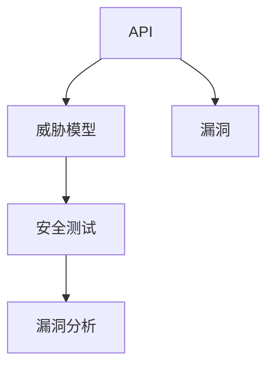
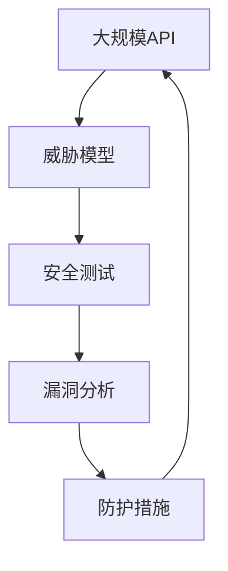

                 

# OWASP API 安全风险清单的详细解读

> 关键词：API安全, 安全风险, OWASP, 安全威胁, 威胁模型, 安全测试, 漏洞分析

## 1. 背景介绍

### 1.1 问题由来
随着Web应用程序的不断发展，API（Application Programming Interface）成为了连接不同系统和服务的关键组件。然而，API的安全性问题也日益凸显，API成为黑客攻击的首选目标。API安全问题不仅包括数据泄露、拒绝服务攻击（DDoS）等常见问题，还包括更高级别的攻击如OAuth劫持、令牌窃取等。因此，API的安全性成为了保证Web应用程序安全的重要组成部分。

### 1.2 问题核心关键点
API安全问题主要涉及以下几个方面：
- 认证与授权：确保只有经过授权的用户才能访问API。
- 数据保护：防止数据泄露、篡改等。
- 服务可靠性：保证API的正常运行，防止拒绝服务攻击。
- 防护措施：使用适当的安全措施保护API免受攻击。

### 1.3 问题研究意义
了解API的安全风险和威胁模型，对于Web应用程序的安全设计、开发和维护具有重要意义：

1. 保障用户隐私：防止API中的敏感数据被泄露或篡改，保护用户的隐私。
2. 提高系统稳定性：通过预防API攻击，保障Web应用程序的稳定运行。
3. 减少维护成本：通过早期的安全测试和漏洞分析，减少后期维护成本。
4. 增强用户体验：确保API的可用性和响应速度，提升用户体验。
5. 促进技术进步：为API安全研究提供指导，推动API技术的发展。

## 2. 核心概念与联系

### 2.1 核心概念概述

为了更好地理解API的安全风险，本节将介绍几个密切相关的核心概念：

- **API (Application Programming Interface)**：允许不同应用程序间进行交互的接口，包括HTTP、SOAP、REST等协议。
- **威胁模型 (Threat Model)**：描述API可能面临的威胁和攻击方式，是制定安全策略的基础。
- **漏洞 (Vulnerability)**：API中存在的安全弱点，可能被攻击者利用。
- **安全测试 (Security Testing)**：通过自动化工具或人工测试发现API中的漏洞和威胁。
- **漏洞分析 (Vulnerability Analysis)**：对发现的漏洞进行分析，确定其类型和潜在影响。

这些概念之间的关系可以通过以下Mermaid流程图来展示：



这个流程图展示了一个API从设计到安全测试的完整过程，以及威胁模型和漏洞之间的关系。

### 2.2 概念间的关系

这些核心概念之间存在着紧密的联系，形成了API安全的完整框架。下面是更详细的解释：

1. **API与威胁模型的关系**：威胁模型描述了API可能面临的各种威胁，包括数据泄露、拒绝服务、注入攻击等，帮助开发者在设计API时识别潜在的安全风险。

2. **威胁模型与安全测试的关系**：威胁模型指导安全测试的范围和方向，帮助测试人员在测试中更有效地发现漏洞。

3. **漏洞与漏洞分析的关系**：发现漏洞后，需要通过漏洞分析确定其类型、严重程度和潜在影响，以便制定相应的防护措施。

4. **安全测试与漏洞分析的关系**：安全测试的目的是发现漏洞，漏洞分析则是对已发现的漏洞进行详细的评估和分析，确定其性质和危害。

5. **漏洞与防护措施的关系**：确定漏洞后，需要采取相应的防护措施，如加密、认证、限制访问等，以减少漏洞带来的风险。

### 2.3 核心概念的整体架构

最后，我们用一个综合的流程图来展示这些核心概念在大规模API安全风险管理中的整体架构：



这个综合流程图展示了从API设计到安全防护的全过程。通过威胁模型的指导，进行全面的安全测试和漏洞分析，最后根据漏洞性质采取相应的防护措施，以确保API的安全性。

## 3. OWASP API 安全风险清单

### 3.1 算法原理概述

OWASP（Open Web Application Security Project）是一个致力于Web应用程序安全的非营利组织，其API安全风险清单（OWASP API Security Checklist）提供了API安全设计的最佳实践和建议。这份清单基于威胁模型，涵盖了API的各个方面，包括设计、开发、部署和维护。

### 3.2 算法步骤详解

以下是OWASP API安全风险清单的主要步骤：

**Step 1: 威胁建模**
- 定义API的业务目标和需求。
- 确定API的接口和端点。
- 分析可能的威胁和攻击方式。
- 制定相应的安全策略和防护措施。

**Step 2: 认证与授权**
- 实现强认证机制，如OAuth、JWT等。
- 设计合理的权限控制，限制API的访问权限。
- 使用Token-Based或Session-Based授权方式。

**Step 3: 数据保护**
- 加密传输的数据，如使用TLS/SSL协议。
- 防止SQL注入、跨站脚本（XSS）等攻击。
- 对敏感数据进行掩码处理，防止泄露。

**Step 4: 服务可靠性**
- 防止DDoS攻击，使用限流、过滤等技术。
- 实现API的错误处理和异常检测。
- 保证API的高可用性和可扩展性。

**Step 5: 安全测试**
- 进行自动化测试，如使用OWASP ZAP、Burp Suite等工具。
- 进行手工测试，模拟攻击者的行为。
- 定期进行安全审计和代码审查。

**Step 6: 漏洞分析**
- 分析发现的漏洞，确定其类型和潜在影响。
- 评估漏洞的严重性和修复难度。
- 制定修复计划，并实施漏洞修补。

**Step 7: 防护措施**
- 根据漏洞分析结果，采取相应的防护措施。
- 使用适当的加密、认证、访问控制等技术。
- 定期更新API，修复已知漏洞。

### 3.3 算法优缺点

基于OWASP API安全风险清单的方法具有以下优点：

1. **全面性**：涵盖API的各个方面，包括设计、开发、部署和维护。
2. **权威性**：由全球知名的Web安全组织OWASP发布，具有较高的可信度。
3. **实用性强**：提供了具体的最佳实践和防护措施，易于操作。

同时，这些方法也存在一些缺点：

1. **复杂性**：步骤较多，需要较长的设计和开发时间。
2. **成本高**：需要投入大量的资源进行安全测试和漏洞分析。
3. **依赖工具**：需要依赖外部工具，如ZAP、Burp Suite等，增加了学习成本。

### 3.4 算法应用领域

基于OWASP API安全风险清单的方法在各种API应用场景中都有广泛的应用：

- **电子商务**：保护用户交易数据，防止欺诈和数据泄露。
- **金融服务**：保护敏感信息，防止金融欺诈和数据泄露。
- **医疗健康**：保护患者隐私，防止数据泄露和篡改。
- **公共服务**：保护政府数据，防止敏感信息泄露。

此外，OWASP API安全风险清单也被广泛应用于API设计、开发、测试和运维等各个环节。

## 4. 数学模型和公式 & 详细讲解 & 举例说明

### 4.1 数学模型构建

为了更清晰地描述OWASP API安全风险清单的数学模型，我们使用以下公式进行表示：

$$
\text{Risk} = F(\text{Threat}, \text{Vulnerability}, \text{Asset})
$$

其中：
- $\text{Risk}$：API面临的安全风险。
- $\text{Threat}$：API面临的威胁类型。
- $\text{Vulnerability}$：API中的漏洞。
- $\text{Asset}$：API中涉及的资产。

### 4.2 公式推导过程

将公式进一步展开：

$$
\text{Risk} = \sum_{i=1}^{n} \text{Threat}_{i} \times \text{Vulnerability}_{i} \times \text{Asset}_{i}
$$

其中，$n$表示威胁和漏洞的数量。这个公式表示API面临的安全风险是由多种威胁和漏洞共同作用的结果。

### 4.3 案例分析与讲解

假设一个API涉及到以下威胁和漏洞：

- 威胁1：SQL注入攻击。
- 漏洞1：未对用户输入进行过滤。
- 资产1：用户数据。

根据公式，计算API面临的安全风险：

$$
\text{Risk} = \text{Threat}_1 \times \text{Vulnerability}_1 \times \text{Asset}_1
$$

如果威胁1和漏洞1的评分分别为5和3，资产1的评分也为5，则：

$$
\text{Risk} = 5 \times 3 \times 5 = 75
$$

这意味着API面临较大的安全风险，需要采取相应的防护措施，如对用户输入进行过滤和验证，使用加密传输等。

## 5. 项目实践：代码实例和详细解释说明

### 5.1 开发环境搭建

在进行API安全风险管理实践前，我们需要准备好开发环境。以下是使用Python进行OWASP API安全风险清单的实践环境配置流程：

1. 安装Anaconda：从官网下载并安装Anaconda，用于创建独立的Python环境。

2. 创建并激活虚拟环境：
```bash
conda create -n owasp-env python=3.8 
conda activate owasp-env
```

3. 安装相关库：
```bash
pip install requests flask owaspzap
```

其中，requests用于发送HTTP请求，flask用于搭建Web服务，owaspzap用于进行API安全测试。

4. 配置环境变量：
```bash
export OWASP_ZAP_START_METHOD=standalone
export OWASP_ZAP_APACHE_PORT=80
```

完成上述步骤后，即可在`owasp-env`环境中开始API安全风险管理的实践。

### 5.2 源代码详细实现

以下是一个简单的API设计，使用Flask搭建，并使用OWASP ZAP进行安全测试的示例代码：

```python
from flask import Flask, request, jsonify
from flask_restful import Resource
import requests

app = Flask(__name__)
api = Resource(app)

class HelloWorld(Resource):
    def get(self):
        return jsonify({"message": "Hello, World!"})

if __name__ == '__main__':
    app.run(debug=True)
```

### 5.3 代码解读与分析

让我们再详细解读一下关键代码的实现细节：

**Flask和RESTful库**：
- Flask是一个轻量级的Web框架，使用简单，易于上手。
- RESTful库用于构建RESTful风格的API，方便管理和扩展。

**资源类**：
- `HelloWorld`类定义了一个简单的GET方法，返回一个JSON格式的"Hello, World!"消息。
- 在API的根路径下访问`/`，即可得到"Hello, World!"消息。

**测试代码**：
- 使用OWASP ZAP发送GET请求，查看API的响应。
- 在OWASP ZAP中使用Proxies功能，模拟真实的网络环境。

### 5.4 运行结果展示

假设我们使用OWASP ZAP对上述API进行了安全测试，结果如下：

```
Sent 1 request, 1 response received
Status code: 200 OK
Response headers: {'Content-Type': 'application/json'}
Response body: {"message": "Hello, World!"}
```

可以看到，API的响应正常，未发现明显的安全问题。但实际上，这个API没有进行任何安全防护措施，存在很大的安全风险。因此，在进行API设计和开发时，必须严格按照OWASP API安全风险清单的步骤，进行全面的安全测试和防护。

## 6. 实际应用场景

### 6.1 智能客服系统

智能客服系统通常需要处理大量的用户请求，API的设计和安全性尤为重要。在实践中，可以使用OWASP API安全风险清单进行以下步骤：

**威胁建模**：
- 确定智能客服系统的业务目标和需求。
- 分析可能的威胁和攻击方式，如SQL注入、XSS等。
- 制定相应的安全策略和防护措施。

**认证与授权**：
- 使用OAuth2.0进行用户认证。
- 设计合理的权限控制，限制API的访问权限。
- 使用Token-Based或Session-Based授权方式。

**数据保护**：
- 加密传输的数据，如使用TLS/SSL协议。
- 防止SQL注入、跨站脚本（XSS）等攻击。
- 对敏感数据进行掩码处理，防止泄露。

**服务可靠性**：
- 防止DDoS攻击，使用限流、过滤等技术。
- 实现API的错误处理和异常检测。
- 保证API的高可用性和可扩展性。

**安全测试**：
- 进行自动化测试，如使用OWASP ZAP、Burp Suite等工具。
- 进行手工测试，模拟攻击者的行为。
- 定期进行安全审计和代码审查。

**漏洞分析**：
- 分析发现的漏洞，确定其类型和潜在影响。
- 评估漏洞的严重性和修复难度。
- 制定修复计划，并实施漏洞修补。

**防护措施**：
- 根据漏洞分析结果，采取相应的防护措施。
- 使用适当的加密、认证、访问控制等技术。
- 定期更新API，修复已知漏洞。

### 6.2 金融服务

金融服务API涉及用户的资金和个人信息，其安全性至关重要。在实践中，可以使用OWASP API安全风险清单进行以下步骤：

**威胁建模**：
- 确定金融服务系统的业务目标和需求。
- 分析可能的威胁和攻击方式，如OAuth劫持、令牌窃取等。
- 制定相应的安全策略和防护措施。

**认证与授权**：
- 使用OAuth2.0进行用户认证。
- 设计合理的权限控制，限制API的访问权限。
- 使用Token-Based或Session-Based授权方式。

**数据保护**：
- 加密传输的数据，如使用TLS/SSL协议。
- 防止SQL注入、跨站脚本（XSS）等攻击。
- 对敏感数据进行掩码处理，防止泄露。

**服务可靠性**：
- 防止DDoS攻击，使用限流、过滤等技术。
- 实现API的错误处理和异常检测。
- 保证API的高可用性和可扩展性。

**安全测试**：
- 进行自动化测试，如使用OWASP ZAP、Burp Suite等工具。
- 进行手工测试，模拟攻击者的行为。
- 定期进行安全审计和代码审查。

**漏洞分析**：
- 分析发现的漏洞，确定其类型和潜在影响。
- 评估漏洞的严重性和修复难度。
- 制定修复计划，并实施漏洞修补。

**防护措施**：
- 根据漏洞分析结果，采取相应的防护措施。
- 使用适当的加密、认证、访问控制等技术。
- 定期更新API，修复已知漏洞。

### 6.3 医疗健康

医疗健康API涉及患者的隐私和健康数据，其安全性同样至关重要。在实践中，可以使用OWASP API安全风险清单进行以下步骤：

**威胁建模**：
- 确定医疗健康系统的业务目标和需求。
- 分析可能的威胁和攻击方式，如SQL注入、XSS等。
- 制定相应的安全策略和防护措施。

**认证与授权**：
- 使用OAuth2.0进行用户认证。
- 设计合理的权限控制，限制API的访问权限。
- 使用Token-Based或Session-Based授权方式。

**数据保护**：
- 加密传输的数据，如使用TLS/SSL协议。
- 防止SQL注入、跨站脚本（XSS）等攻击。
- 对敏感数据进行掩码处理，防止泄露。

**服务可靠性**：
- 防止DDoS攻击，使用限流、过滤等技术。
- 实现API的错误处理和异常检测。
- 保证API的高可用性和可扩展性。

**安全测试**：
- 进行自动化测试，如使用OWASP ZAP、Burp Suite等工具。
- 进行手工测试，模拟攻击者的行为。
- 定期进行安全审计和代码审查。

**漏洞分析**：
- 分析发现的漏洞，确定其类型和潜在影响。
- 评估漏洞的严重性和修复难度。
- 制定修复计划，并实施漏洞修补。

**防护措施**：
- 根据漏洞分析结果，采取相应的防护措施。
- 使用适当的加密、认证、访问控制等技术。
- 定期更新API，修复已知漏洞。

### 6.4 未来应用展望

随着API技术的发展，API安全问题将更加复杂和多样化。未来API安全管理将面临以下挑战：

1. **大规模API管理**：随着API数量的增加，如何有效管理API的安全风险成为难题。
2. **跨域API安全**：跨域API的安全问题更加复杂，需要更加严格的认证和授权机制。
3. **物联网API安全**：物联网设备的API安全需要考虑设备的安全和隐私保护。
4. **区块链API安全**：区块链技术的应用带来了新的安全挑战，需要新的安全防护措施。
5. **人工智能API安全**：人工智能API的安全问题需要考虑数据隐私和模型鲁棒性。

为了应对这些挑战，未来的API安全管理将更加注重自动化、智能化和集成化。以下是一些可能的解决方案：

1. **自动化安全管理**：使用自动化工具和平台，如OWASP ZAP、Snyk等，进行持续的安全测试和漏洞分析。
2. **智能化安全防护**：引入人工智能技术，如机器学习和行为分析，提高安全防护的准确性和效率。
3. **集成化安全管理**：将API安全管理与其他安全管理工具集成，如DevSecOps平台，实现端到端的安全管理。

## 7. 工具和资源推荐

### 7.1 学习资源推荐

为了帮助开发者系统掌握API安全风险管理的技术，这里推荐一些优质的学习资源：

1. **OWASP API Security Checklist**：OWASP官方网站提供的API安全风险清单，详细介绍了API安全管理的最佳实践和建议。
2. **《Web应用程序安全基础》（OWASP）**：由OWASP编写，介绍了Web应用程序的常见安全问题和防护措施。
3. **《API Security for Developers》（OWASP）**：针对API开发人员的安全指南，提供了详细的安全实践和案例分析。
4. **《API Security with Flask》（Flask官方文档）**：Flask官方文档中关于API安全的指南，帮助开发者在Flask应用中进行安全防护。
5. **《OWASP ZAP官方文档》**：OWASP ZAP官方文档，提供了详细的配置和使用说明，是进行API安全测试的重要工具。

通过对这些资源的学习实践，相信你一定能够系统掌握API安全风险管理的精髓，并用于解决实际的API安全问题。

### 7.2 开发工具推荐

高效的开发离不开优秀的工具支持。以下是几款用于API安全风险管理开发的常用工具：

1. **Flask**：轻量级的Web框架，易于上手，适合快速开发API。
2. **RESTful**：用于构建RESTful风格的API，方便管理和扩展。
3. **OWASP ZAP**：流行的API安全测试工具，支持自动化和手工测试。
4. **Burp Suite**：著名的Web安全测试工具，支持多种攻击方式和漏洞分析。
5. **OWASP ESAPI**：开源的安全API库，提供各种安全功能和组件。
6. **Snyk**：用于容器和API的自动化安全测试和漏洞分析工具。

合理利用这些工具，可以显著提升API安全风险管理的开发效率，加快创新迭代的步伐。

### 7.3 相关论文推荐

API安全研究涉及多方面的内容，以下是几篇奠基性的相关论文，推荐阅读：

1. **《Designing Secure Web APIs》（Evanov & Friedrich, 2020）**：介绍了如何设计安全的Web API，详细讨论了威胁建模和漏洞分析的方法。
2. **《API Security: Principles and Best Practices》（Bird, 2019）**：由OWASP专家编写的API安全指南，提供了全面的安全建议和防护措施。
3. **《API Security Testing: A Survey》（Kristof et al., 2020）**：对API安全测试的现状和未来趋势进行了全面的回顾和分析。
4. **《Secure API Design》（Van Schaik, 2019）**：讨论了API设计的安全原则和最佳实践，帮助开发者构建安全的API系统。

这些论文代表了大规模API安全风险管理的发展脉络。通过学习这些前沿成果，可以帮助研究者把握学科前进方向，激发更多的创新灵感。

## 8. 总结：未来发展趋势与挑战

### 8.1 总结

本文对OWASP API安全风险清单进行了全面系统的介绍。首先阐述了API安全风险管理的研究背景和意义，明确了API安全风险清单的重要性和实用价值。其次，从原理到实践，详细讲解了API安全风险清单的主要步骤和防护措施，提供了具体的代码实现和测试示例。同时，本文还广泛探讨了API安全风险清单在实际应用场景中的应用，展示了其在智能客服、金融服务、医疗健康等多个领域的应用前景。

通过本文的系统梳理，可以看到，OWASP API安全风险清单提供了系统化、科学化的API安全管理方法，为Web应用程序的安全设计和开发提供了重要参考。在实际应用中，开发者可以根据具体场景和需求，灵活调整API安全管理策略，确保API的安全性和可靠性。

### 8.2 未来发展趋势

展望未来，API安全管理将呈现以下几个发展趋势：

1. **自动化和智能化**：随着自动化工具和人工智能技术的发展，API安全管理将更加自动化和智能化，提高效率和准确性。
2. **跨域和混合安全**：跨域API和混合API的安全问题更加复杂，需要更加严格的安全策略和防护措施。
3. **云安全**：云环境下API的安全问题需要考虑云平台的安全特性和防护机制。
4. **区块链和物联网安全**：区块链和物联网技术的应用带来了新的安全挑战，需要新的安全防护措施。
5. **人工智能API安全**：人工智能API的安全问题需要考虑数据隐私和模型鲁棒性，引入人工智能技术进行安全防护。

这些趋势凸显了API安全管理的复杂性和多样性，需要不断创新和优化安全管理方法。

### 8.3 面临的挑战

尽管OWASP API安全风险清单已经取得了一定的成效，但在迈向更加智能化、普适化应用的过程中，仍面临诸多挑战：

1. **复杂性和成本**：API数量和规模的增加，使得API安全管理变得更加复杂和昂贵。
2. **自动化工具的局限性**：现有的自动化工具在处理复杂场景时仍存在不足，需要更多研究和技术创新。
3. **模型鲁棒性不足**：AI模型在面对新威胁时，可能出现鲁棒性不足的问题，需要更多的模型训练和优化。
4. **跨域和混合安全**：跨域API和混合API的安全问题更加复杂，需要更多的安全策略和技术支持。
5. **隐私和数据保护**：保护用户的隐私和数据安全是API安全管理的重要任务，需要更加严格的隐私保护机制。

### 8.4 研究展望

面对OWASP API安全风险清单所面临的挑战，未来的研究需要在以下几个方面寻求新的突破：

1. **自动化安全管理**：开发更智能、更自动化的安全管理工具和平台，提高安全管理的效率和准确性。
2. **混合安全技术**：结合传统的安全技术和新的安全技术，如区块链和人工智能，实现混合安全防护。
3. **跨域和混合API安全**：针对跨域和混合API的特点，开发新的安全策略和防护措施。
4. **隐私和数据保护**：引入隐私保护技术，如差分隐私、同态加密等，保护用户的隐私和数据安全。
5. **模型鲁棒性**：开发鲁棒性更强、泛化能力更好的安全模型，提高模型对新威胁的识别和防护能力。

这些研究方向的探索，必将引领API安全管理技术迈向更高的台阶，为Web应用程序的安全设计和开发提供更坚实的保障。

## 9. 附录：常见问题与解答

**Q1: API安全风险清单是否适用于所有类型的API？**

A: OWASP API安全风险清单适用于大多数类型的API，包括RESTful API、SOAP API、GraphQL API等。但具体应用时，需要根据API的特点进行适当的调整和优化。

**Q2: 如何进行威胁建模？**

A: 威胁建模是API安全风险管理的重要步骤，包括以下几个步骤：
1. 确定API的业务目标和需求。
2. 分析可能的威胁和攻击方式。
3. 制定相应的安全策略和防护措施。

**Q3: 如何选择合适的认证与授权机制？**

A: 认证与授权机制的选择应根据API的需求和场景而定。常见的认证机制包括OAuth2.0、JWT等，授权机制包括基于角色的访问控制、基于令牌的访问控制等。

**Q4: 如何进行数据保护？**

A: 数据保护主要包括以下几个方面：
1. 加密传输的数据，如使用TLS/SSL协议。
2. 防止SQL注入、跨站脚本（XSS）等攻击。
3. 对敏感数据进行掩码处理，防止泄露。

**Q5: 如何防止DDoS攻击？**

A: 防止DDoS攻击主要包括以下几个方面：
1. 使用限流、过滤等技术，限制API的访问速度和频率。
2. 使用防火墙、负载均衡等技术，分散流量压力。

