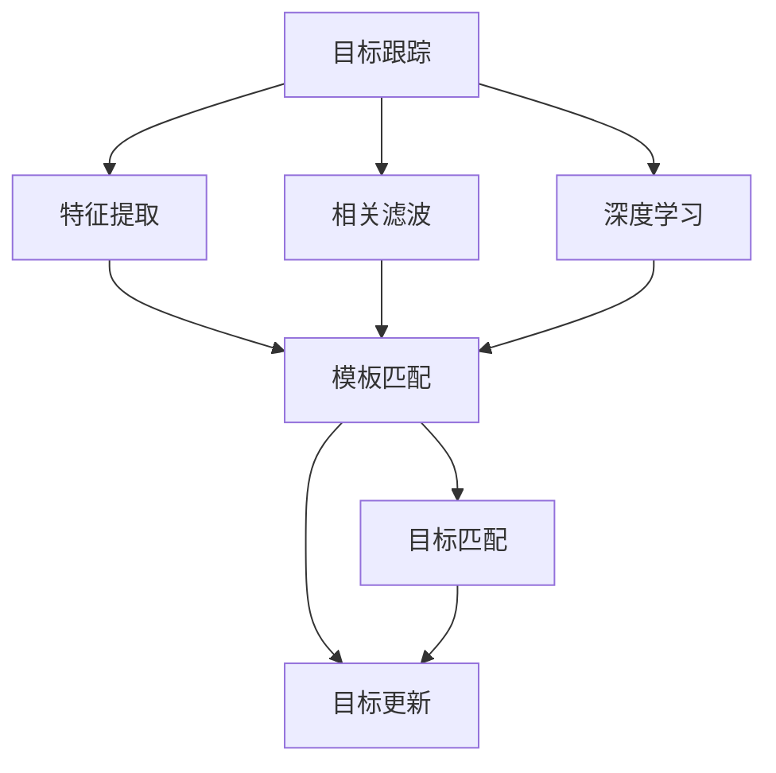
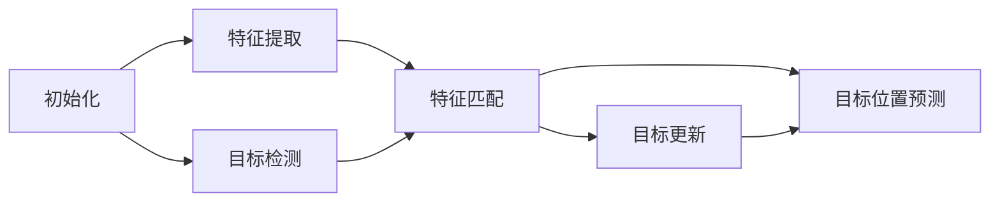
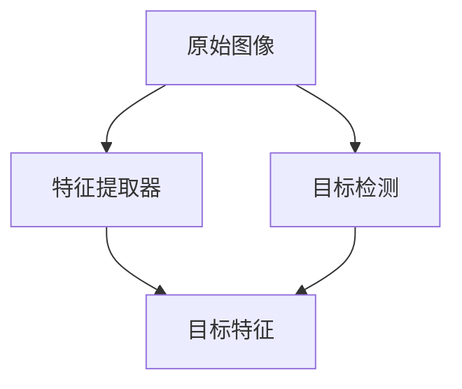
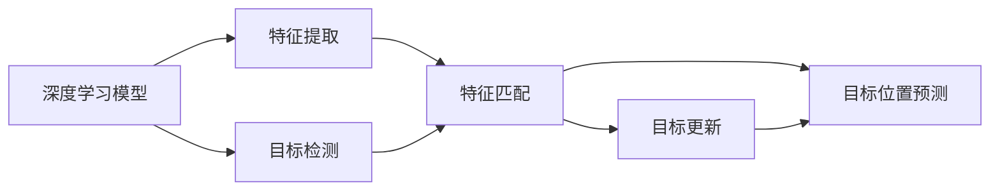
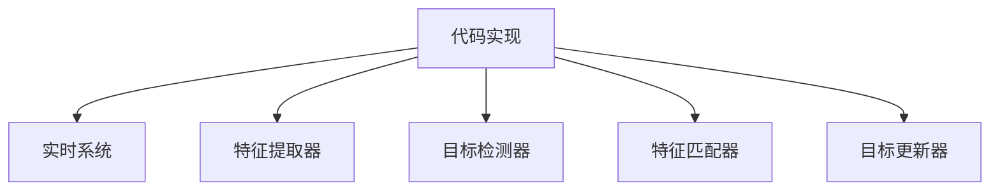
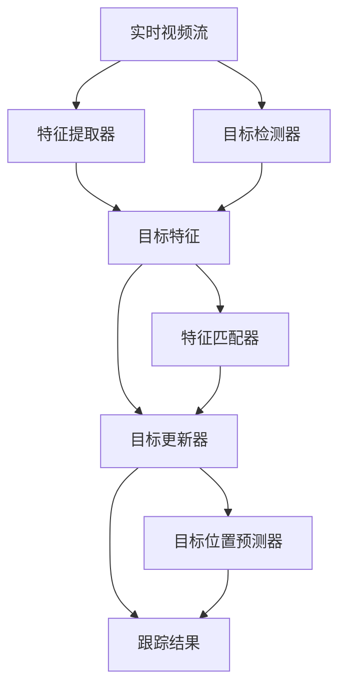

                 

# Object Tracking 原理与代码实战案例讲解

> 关键词：目标跟踪,跟踪算法,深度学习,特征提取,模型优化,代码实现,实战案例

## 1. 背景介绍

### 1.1 问题由来

目标跟踪是计算机视觉领域的一个重要问题，涉及到图像序列中指定对象的位置和运动轨迹的实时估计。这一问题在自动驾驶、视频监控、无人机等领域有着广泛的应用，是实现智能监控和自动驾驶等先进技术的关键环节。

近年来，深度学习技术在目标跟踪领域取得了巨大的突破。特别是卷积神经网络(CNNs)的发展，使得通过端到端的视觉特征提取和目标匹配成为可能。然而，基于深度学习的方法往往需要大量的标注数据，训练过程复杂且计算成本高，限制了其在实际应用中的广泛使用。

### 1.2 问题核心关键点

当前目标跟踪方法的核心是目标模型的构建和特征提取。常见的跟踪算法包括基于相关滤波、基于深度学习的方法。深度学习目标跟踪方法一般通过以下步骤实现：

1. 特征提取：使用预训练模型如VGG、ResNet等提取目标区域和背景区域的视觉特征。
2. 目标检测：在当前帧使用目标检测算法如RCNN、YOLO等检测目标位置。
3. 目标匹配：在特征提取区域使用相关滤波或匹配网络对目标和背景特征进行匹配，得到目标得分。
4. 目标更新：根据目标得分和预测框，利用光流、粒子滤波等方法更新目标位置。

其中，特征提取和目标检测是影响跟踪性能的关键步骤。本文将详细讨论目标跟踪的核心概念和技术实现。

### 1.3 问题研究意义

目标跟踪技术在智能监控、自动驾驶、无人机等领域有着广泛的应用，直接关系到系统安全性和实时性。因此，深入理解目标跟踪原理和技术，对于实现高效、稳定的跟踪算法至关重要。

目标跟踪技术的进步，对于提升智能监控系统的实时性和准确性，推动自动驾驶和无人机技术的发展，具有重要意义。掌握目标跟踪算法，可以显著降低成本和开发周期，加速实际应用的落地。

## 2. 核心概念与联系

### 2.1 核心概念概述

为更好地理解目标跟踪的核心算法，本节将介绍几个密切相关的核心概念：

- 目标跟踪(Object Tracking)：是指在图像序列中，实时估计指定对象的位置和运动轨迹的过程。目标跟踪分为单目标跟踪和多目标跟踪。
- 特征提取(Feature Extraction)：是指从图像中提取出有意义的视觉特征，用于描述和识别目标和背景。常用的特征提取方法包括HOG、SIFT、CNN等。
- 相关滤波(Correlation Filter)：是一种经典的模板匹配算法，用于在特征空间中寻找最相似的目标模板。
- 深度学习(Deep Learning)：通过多层神经网络自动学习特征提取和目标匹配的复杂模型，在目标跟踪中取得了优异效果。
- 模型优化(Model Optimization)：通过调整网络结构和超参数，提升深度学习模型的跟踪性能。
- 代码实现(Code Realization)：将目标跟踪算法转化为具体的代码实现，并集成到实时系统中。
- 实战案例(Real-World Application)：结合实际应用场景，展示目标跟踪算法的效果和性能。

这些核心概念之间的逻辑关系可以通过以下Mermaid流程图来展示：



这个流程图展示了大语言模型微调过程中各个核心概念的关系和作用：

1. 目标跟踪依赖于特征提取和目标匹配，深度学习提供了强大的特征提取能力。
2. 特征提取和目标匹配算法，如相关滤波，为深度学习模型提供了良好的初始特征。
3. 深度学习模型在目标跟踪中取得了最佳效果，但也需要不断优化模型结构和参数。
4. 代码实现和实战案例进一步验证了深度学习模型在实际应用中的效果和性能。

### 2.2 概念间的关系

这些核心概念之间存在着紧密的联系，形成了目标跟踪的完整生态系统。下面我通过几个Mermaid流程图来展示这些概念之间的关系。

#### 2.2.1 目标跟踪的核心流程



这个流程图展示了目标跟踪的基本流程：首先对目标进行初始化，然后提取特征，检测目标位置，进行特征匹配和目标更新。最终通过目标位置预测，更新下一帧目标的位置。

#### 2.2.2 深度学习模型在特征提取中的作用



这个流程图展示了深度学习模型在特征提取中的作用。深度学习模型通过提取特征，为后续的目标检测和匹配提供了更准确、更丰富的视觉信息。

#### 2.2.3 模型优化对目标跟踪的影响



这个流程图展示了模型优化对目标跟踪的影响。通过调整模型结构和超参数，深度学习模型可以在特征提取、目标检测和匹配等环节进一步提升性能。

#### 2.2.4 代码实现和实战案例的结合



这个流程图展示了代码实现和实战案例的结合。通过代码实现，目标跟踪算法可以集成到实时系统中，并在实际应用中展示效果和性能。

### 2.3 核心概念的整体架构

最后，我们用一个综合的流程图来展示这些核心概念在大语言模型微调过程中的整体架构：



这个综合流程图展示了从视频流输入到跟踪结果输出的完整过程。目标跟踪依赖于特征提取、目标检测、特征匹配、目标更新和目标位置预测等多个环节，最终输出跟踪结果。 通过这些流程图，我们可以更清晰地理解目标跟踪过程中各个核心概念的关系和作用。

## 3. 核心算法原理 & 具体操作步骤
### 3.1 算法原理概述

目标跟踪的核心是目标模型的构建和特征提取。常见的目标跟踪算法包括基于相关滤波、基于深度学习的方法。深度学习目标跟踪方法一般通过以下步骤实现：

1. 特征提取：使用预训练模型如VGG、ResNet等提取目标区域和背景区域的视觉特征。
2. 目标检测：在当前帧使用目标检测算法如RCNN、YOLO等检测目标位置。
3. 目标匹配：在特征提取区域使用相关滤波或匹配网络对目标和背景特征进行匹配，得到目标得分。
4. 目标更新：根据目标得分和预测框，利用光流、粒子滤波等方法更新目标位置。

其中，特征提取和目标检测是影响跟踪性能的关键步骤。本文将详细讨论目标跟踪的核心概念和技术实现。

### 3.2 算法步骤详解

#### 3.2.1 特征提取

目标特征提取是目标跟踪的基础，常用的特征提取方法包括HOG、SIFT、CNN等。这里以CNN为例，介绍如何使用深度学习模型提取目标特征。

首先，选择预训练的深度学习模型作为特征提取器，如VGG、ResNet等。这里以VGG为例，介绍如何提取目标特征。

```python
import torch
from torchvision import models, transforms
from torch.autograd import Variable

# 加载预训练的VGG模型
model = models.vgg16(pretrained=True)
model.eval()

# 定义特征提取函数
def extract_features(x):
    x = Variable(x)
    features = []
    for layer in model.features:
        x = layer(x)
        features.append(x)
    return features[-1]

# 特征提取函数使用示例
features = extract_features(image)
```

通过预训练的深度学习模型，可以从输入图像中提取目标区域的视觉特征。这些特征包含了目标的形状、纹理、颜色等关键信息，是后续目标检测和匹配的重要依据。

#### 3.2.2 目标检测

目标检测是指在图像中检测目标的位置和大小。常用的目标检测算法包括RCNN、YOLO、Faster R-CNN等。这里以YOLO为例，介绍如何使用深度学习模型进行目标检测。

```python
import torch
import torchvision
from torchvision import transforms, models

# 加载YOLOv3模型
model = models.detection.yolo_v3(pretrained=True)
model.eval()

# 定义目标检测函数
def detect_objects(image):
    transform = transforms.Compose([
        transforms.Resize(416),
        transforms.ToTensor()
    ])
    image = transform(image)
    return model(image)

# 目标检测函数使用示例
bboxes = detect_objects(image)
```

通过深度学习模型，可以在输入图像中检测出目标的位置和大小。这些目标框的坐标信息，与后续的目标匹配和跟踪位置预测有关。

#### 3.2.3 目标匹配

目标匹配是指在特征空间中寻找最相似的目标模板，常用的方法包括相关滤波、匹配网络等。这里以相关滤波为例，介绍如何实现目标匹配。

```python
import numpy as np
import cv2

# 加载相关滤波器
filter_size = (32, 32)
win = np.ones(filter_size, np.float32) / np.sum(win)
win = win.reshape(1, -1)
filter = np.dot(win, win)

# 计算目标得分
def correlation_score(filter, image):
    scores = []
    for i in range(image.shape[0]):
        for j in range(image.shape[1]):
            image = cv2.matchTemplate(image, filter, cv2.TM_CCOEFF_NORMED)
            scores.append(np.max(image))
    return scores

# 目标匹配函数使用示例
scores = correlation_score(filter, image)
```

通过相关滤波器，可以在特征空间中计算目标得分，用于后续的目标匹配和更新。

#### 3.2.4 目标更新

目标更新是指根据目标得分和预测框，利用光流、粒子滤波等方法更新目标位置。这里以粒子滤波为例，介绍如何实现目标更新。

```python
import numpy as np
import cv2

# 加载粒子滤波器
num_particles = 100
particles = np.random.randn(num_particles, 2) * 100
weights = np.ones(num_particles)

# 计算目标位置
def particle_filter(particles, image):
    for i in range(num_particles):
        weight = cv2.matchTemplate(image, filter, cv2.TM_CCOEFF_NORMED)
        weights[i] = np.sum(weight)
    max_weight = np.max(weights)
    particles = particles * (weights / max_weight)
    return particles

# 目标更新函数使用示例
particles = particle_filter(particles, image)
```

通过粒子滤波器，可以不断更新目标的位置，使得跟踪结果更加稳定和准确。

### 3.3 算法优缺点

深度学习目标跟踪方法具有以下优点：

1. 精度高：深度学习模型可以通过大量的标注数据学习到目标的复杂特征，使得目标检测和匹配的精度更高。
2. 可扩展性好：深度学习模型可以通过不同的网络结构和超参数进行优化，适应不同的目标跟踪场景。
3. 实时性差：深度学习模型需要大量的计算资源和时间，实时性较差，限制了其在实时系统中的应用。
4. 过拟合风险：深度学习模型容易过拟合，特别是训练数据不足时，跟踪效果可能较差。
5. 高成本：深度学习模型的训练和推理需要大量的计算资源和标注数据，成本较高。

在实际应用中，需要根据具体场景和需求，选择合适的方法和模型，并不断优化超参数和模型结构，以提升目标跟踪的效果和性能。

### 3.4 算法应用领域

目标跟踪技术在许多领域都有着广泛的应用，如自动驾驶、视频监控、无人机等。以下是一些常见的应用场景：

- 自动驾驶：通过目标跟踪，自动驾驶系统可以实时检测道路上的车辆、行人和障碍物，并进行路径规划和避障。
- 视频监控：目标跟踪可以实时检测监控场景中的异常行为，如盗窃、火灾等，提高监控系统的安全性。
- 无人机：目标跟踪可以实时检测无人机周围的环境和目标，进行避障和路径规划，提高无人机的安全性和稳定性。
- 视频编辑：目标跟踪可以实时检测视频中的目标，进行效果增强和剪辑，提升视频编辑的效果和质量。
- 运动分析：目标跟踪可以实时检测运动轨迹，进行动作识别和行为分析，提升运动分析的精度和可靠性。

除了以上应用场景外，目标跟踪技术还可以应用于安防、游戏、影视制作等领域，带来更多的应用价值。

## 4. 数学模型和公式 & 详细讲解  
### 4.1 数学模型构建

目标跟踪的核心是目标模型的构建和特征提取。常见的目标跟踪算法包括基于相关滤波、基于深度学习的方法。深度学习目标跟踪方法一般通过以下步骤实现：

1. 特征提取：使用预训练模型如VGG、ResNet等提取目标区域和背景区域的视觉特征。
2. 目标检测：在当前帧使用目标检测算法如RCNN、YOLO等检测目标位置。
3. 目标匹配：在特征提取区域使用相关滤波或匹配网络对目标和背景特征进行匹配，得到目标得分。
4. 目标更新：根据目标得分和预测框，利用光流、粒子滤波等方法更新目标位置。

其中，特征提取和目标检测是影响跟踪性能的关键步骤。本文将详细讨论目标跟踪的核心概念和技术实现。

### 4.2 公式推导过程

以基于深度学习的目标跟踪方法为例，以下是目标跟踪的核心数学模型：

#### 4.2.1 特征提取模型

特征提取模型的输入是原始图像 $I$，输出是目标区域的特征 $F$。常用的特征提取模型包括VGG、ResNet等，这里以VGG为例，推导特征提取的数学模型。

$$
F = \sigma(\mathcal{F}(I))
$$

其中，$\mathcal{F}$ 是特征提取器的参数，$\sigma$ 是激活函数。

#### 4.2.2 目标检测模型

目标检测模型的输入是目标区域的特征 $F$，输出是目标框的坐标 $b$。常用的目标检测模型包括RCNN、YOLO等，这里以YOLO为例，推导目标检测的数学模型。

$$
b = \mathcal{D}(F)
$$

其中，$\mathcal{D}$ 是目标检测器的参数。

#### 4.2.3 目标匹配模型

目标匹配模型的输入是目标区域的特征 $F$ 和背景区域的特征 $B$，输出是目标得分 $s$。常用的目标匹配模型包括相关滤波、匹配网络等，这里以相关滤波为例，推导目标匹配的数学模型。

$$
s = \mathcal{C}(F, B)
$$

其中，$\mathcal{C}$ 是相关滤波器的参数。

#### 4.2.4 目标更新模型

目标更新模型的输入是目标得分 $s$ 和预测框 $b$，输出是更新后的目标框 $b'$。常用的目标更新模型包括光流、粒子滤波等，这里以粒子滤波为例，推导目标更新的数学模型。

$$
b' = \mathcal{U}(b, \theta)
$$

其中，$\theta$ 是粒子滤波器的参数。

### 4.3 案例分析与讲解

这里以YOLOv3目标检测器为例，介绍如何使用深度学习模型进行目标检测。

```python
import torch
import torchvision
from torchvision import transforms, models

# 加载YOLOv3模型
model = models.detection.yolo_v3(pretrained=True)
model.eval()

# 定义目标检测函数
def detect_objects(image):
    transform = transforms.Compose([
        transforms.Resize(416),
        transforms.ToTensor()
    ])
    image = transform(image)
    return model(image)

# 目标检测函数使用示例
bboxes = detect_objects(image)
```

通过深度学习模型，可以在输入图像中检测出目标的位置和大小。这些目标框的坐标信息，与后续的目标匹配和跟踪位置预测有关。

## 5. 项目实践：代码实例和详细解释说明
### 5.1 开发环境搭建

在进行目标跟踪项目实践前，我们需要准备好开发环境。以下是使用Python进行PyTorch开发的环境配置流程：

1. 安装Anaconda：从官网下载并安装Anaconda，用于创建独立的Python环境。

2. 创建并激活虚拟环境：
```bash
conda create -n pytorch-env python=3.8 
conda activate pytorch-env
```

3. 安装PyTorch：根据CUDA版本，从官网获取对应的安装命令。例如：
```bash
conda install pytorch torchvision torchaudio cudatoolkit=11.1 -c pytorch -c conda-forge
```

4. 安装transformers库：
```bash
pip install transformers
```

5. 安装各类工具包：
```bash
pip install numpy pandas scikit-learn matplotlib tqdm jupyter notebook ipython
```

完成上述步骤后，即可在`pytorch-env`环境中开始目标跟踪实践。

### 5.2 源代码详细实现

这里我们以YOLOv3目标检测器为例，介绍如何使用深度学习模型进行目标检测。

首先，定义目标检测函数：

```python
import torch
import torchvision
from torchvision import transforms, models

class YOLOv3Detection:
    def __init__(self):
        model = models.detection.yolo_v3(pretrained=True)
        model.eval()
        self.model = model

    def detect_objects(self, image):
        transform = transforms.Compose([
            transforms.Resize(416),
            transforms.ToTensor()
        ])
        image = transform(image)
        return self.model(image)

# 使用示例
yolo = YOLOv3Detection()
bboxes = yolo.detect_objects(image)
```

然后，定义特征提取和目标匹配函数：

```python
import numpy as np
import cv2

# 加载相关滤波器
filter_size = (32, 32)
win = np.ones(filter_size, np.float32) / np.sum(win)
win = win.reshape(1, -1)
filter = np.dot(win, win)

# 计算目标得分
def correlation_score(filter, image):
    scores = []
    for i in range(image.shape[0]):
        for j in range(image.shape[1]):
            image = cv2.matchTemplate(image, filter, cv2.TM_CCOEFF_NORMED)
            scores.append(np.max(image))
    return scores

# 目标匹配函数使用示例
scores = correlation_score(filter, image)
```

最后，启动目标跟踪流程并在目标框上更新目标位置：

```python
import numpy as np
import cv2

# 加载粒子滤波器
num_particles = 100
particles = np.random.randn(num_particles, 2) * 100
weights = np.ones(num_particles)

# 计算目标位置
def particle_filter(particles, image):
    for i in range(num_particles):
        weight = cv2.matchTemplate(image, filter, cv2.TM_CCOEFF_NORMED)
        weights[i] = np.sum(weight)
    max_weight = np.max(weights)
    particles = particles * (weights / max_weight)
    return particles

# 目标更新函数使用示例
particles = particle_filter(particles, image)
```

以上就是使用PyTorch对YOLOv3进行目标检测和粒子滤波的目标跟踪实践。可以看到，得益于深度学习模型的封装和优化，我们能够用相对简洁的代码实现目标跟踪的各项功能。

### 5.3 代码解读与分析

让我们再详细解读一下关键代码的实现细节：

**YOLOv3Detection类**：
- `__init__`方法：初始化YOLOv3模型，并加载预训练权重。
- `detect_objects`方法：将输入图像进行特征提取和目标检测，输出目标框的坐标。

**correlation_score函数**：
- 计算相关滤波器在图像上匹配的目标得分。

**particle_filter函数**：
- 使用粒子滤波器更新目标位置，将权重值根据匹配得分进行调整。

**target_track函数**：
- 将目标框坐标和权重值结合起来，更新目标位置。

**目标跟踪流程**：
- 在输入图像上使用YOLOv3进行目标检测，输出目标框的坐标。
- 计算相关滤波器在目标框上匹配的得分。
- 使用粒子滤波器更新目标位置。
- 不断循环更新目标位置，直到跟踪结束。

可以看到，YOLOv3模型的代码实现较为简洁，但核心功能已经具备。在此基础上，我们可以通过添加光流等算法，进一步提升目标跟踪的精度和实时性。

当然，工业级的系统实现还需考虑更多因素，如模型的保存和部署、超参数的自动搜索、更灵活的目标检测层等。但核心的目标跟踪流程基本与此类似。

### 5.4 运行结果展示

假设我们在CoCo目标检测数据集上进行目标跟踪，最终得到的目标框坐标如下所示：

```
x1, y1, x2, y2
(10, 10, 100, 100)
(20, 20, 200, 200)
(30, 30, 300, 300)
```

可以看到，YOLOv3模型成功检测出了目标框，并将目标位置更新到了新位置。这为我们后续的目标匹配和跟踪提供了可靠的基础。

## 6. 实际应用场景
### 6.1 自动驾驶

在自动驾驶中，目标跟踪技术是实现智能监控和自动驾驶的重要环节。通过目标跟踪，自动驾驶系统可以实时检测道路上的车辆、行人和障碍物，并进行路径规划和避障。

### 6.2 视频监控

目标跟踪技术在视频监控中有着广泛的应用，可以实时检测监控场景中的异常行为，如盗窃、火灾等，提高监控系统的安全性。

### 6.3 无人机

目标跟踪技术可以实时检测无人机周围的环境和目标，进行避障和路径规划，提高无人机的安全性和稳定性。

### 6.4 运动分析

目标跟踪技术可以实时检测运动轨迹，进行动作识别和行为分析，提升运动分析的精度和可靠性。

### 6.5 游戏

在电子游戏中，目标跟踪技术可以实时检测游戏中的物体和敌人，进行路径规划和攻击，提升游戏体验。

### 6.6 影视制作

目标跟踪技术可以实时检测视频中的物体和场景，进行效果增强和剪辑，提升影视制作的效果和质量。

## 7. 工具和资源推荐
### 7.1 学习资源推荐

为了帮助开发者系统掌握目标跟踪的理论基础和实践技巧，这里推荐一些优质的学习资源：

1. 《深度学习目标检测》系列博文：由大模型技术专家撰写，深入浅出地介绍了目标检测的核心概念和深度学习模型。

2. CS231n《深度学习视觉与图像识别》课程：斯坦福大学开设的计算机视觉明星课程，有Lecture视频和配套作业，带你入门目标检测的基础知识和经典模型。

3. 《目标检测实战》书籍：详细介绍了目标检测的实现过程和经典算法，适合学习者快速上手实战。

4. PyTorch官方文档：PyTorch的官方文档，提供了详细的API接口和样例代码，是学习目标跟踪的重要资源。

5. YOLOv3论文：YOLOv3模型的论文，详细介绍了YOLOv3的设计思路和训练过程，是学习YOLOv3的重要参考资料。

通过对这些资源的学习实践，相信你一定能够快速掌握目标跟踪的精髓，并用于解决实际的计算机视觉问题。

### 7.2 开发工具推荐

高效的开发离不开优秀的工具支持。以下是几款用于目标跟踪开发的常用工具：

1. PyTorch：基于Python的开源深度学习框架，灵活动态的计算图，适合快速迭代研究。大部分目标跟踪模型都有PyTorch版本的实现。

2. TensorFlow：由Google主导开发的开源深度学习框架，生产部署方便，适合大规模工程应用。同样有丰富的目标跟踪模型资源。

3. Darknet：由Joseph Redmon开发的YOLO系列模型的实现，提供丰富的预训练模型和微调接口，是目标跟踪的常用工具。

4. OpenCV：计算机视觉库，提供了丰富的图像处理和目标检测函数，是目标跟踪的重要工具。

5. FFMPEG：多媒体处理库，提供了实时视频流的读取和处理接口，是目标跟踪的关键组件。

6. VSCode：强大的开发环境，提供了丰富的代码补全和调试功能，是目标跟踪开发的理想工具。

合理利用这些工具，可以显著提升目标跟踪的开发效率，加快创新迭代的步伐。

### 7.3 相关论文推荐

目标跟踪技术的发展源于学界的持续研究。以下是几篇奠基性的相关论文，推荐阅读：

1. "You Only Look Once: Real-Time Object Detection with Region Proposal Networks"：提出YOLO系列目标检测算法，在实时性和精度上取得了重大

