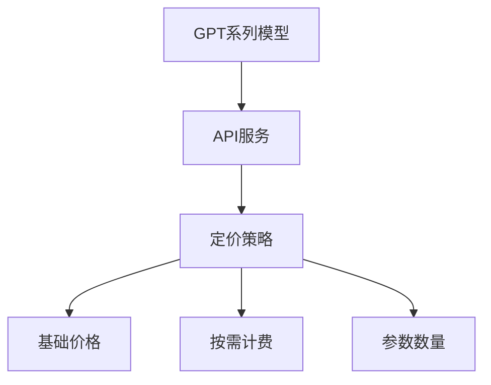
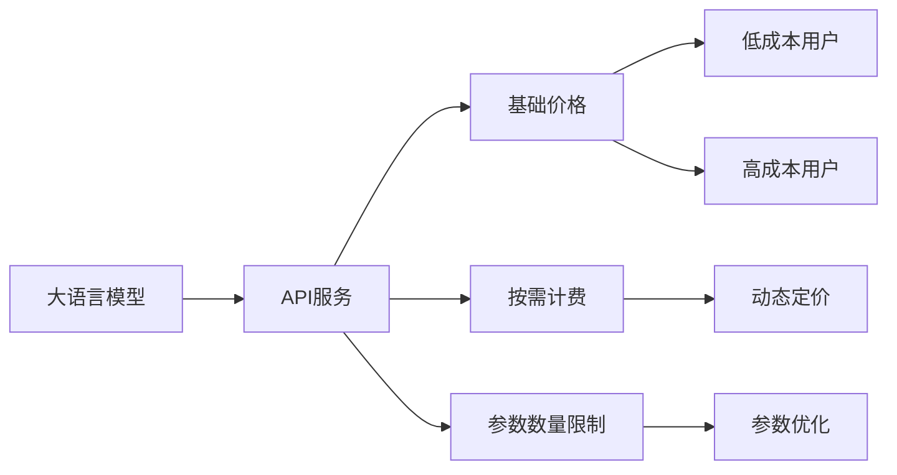

                 

# OpenAI的降价策略

> 关键词：
  OpenAI, 降价策略, GPT-3, 自然语言处理(NLP), 技术壁垒, 市场竞争, 技术创新

## 1. 背景介绍

### 1.1 问题由来
自2018年发布GPT-1以来，OpenAI的大语言模型系列（GPT-1至GPT-4）已经迅速成为NLP领域的明星技术，广泛应用于文本生成、自然语言推理、对话系统、文本摘要等多个领域。然而，尽管OpenAI的技术不断进步，但其模型服务的价格却始终保持在较高的水平。这不仅使得小企业和个人开发者难以负担，也在一定程度上抑制了NLP技术的广泛应用。为了推动NLP技术的普及和创新，OpenAI近年来开始逐步调整其定价策略，推出了一系列降价措施。本文将详细分析OpenAI的降价策略，并探讨其背后的技术、市场和商业动因。

### 1.2 问题核心关键点
OpenAI的降价策略主要涉及以下几个关键点：
- **定价结构调整**：OpenAI重新设计了其API的定价结构，引入了更灵活的按需计费模式和更具有竞争力的基础价格。
- **参数数量限制**：OpenAI调整了API调用次数和模型参数数量的限制，使其更适用于中小规模的应用场景。
- **折扣和优惠政策**：OpenAI推出了针对特定客户群体和应用场景的折扣和优惠政策，降低用户的使用门槛。

这些策略的调整，不仅反映了OpenAI在技术上的进步和市场竞争的压力，也体现了其在商业化道路上的探索和调整。通过本文的分析，我们希望能够深入理解OpenAI降价策略背后的逻辑，并对未来的NLP技术发展提供一些启示。

### 1.3 问题研究意义
OpenAI的降价策略对于推动NLP技术的普及和创新具有重要意义：

1. **降低技术门槛**：通过降低模型服务的价格和调整API计费方式，OpenAI使得更多企业和个人能够负担得起使用先进的NLP技术，从而加速技术的普及和应用。
2. **促进市场竞争**：降价策略使OpenAI在市场上更具竞争力，吸引了更多客户，形成了良性的市场竞争环境，推动整个行业的发展。
3. **推动技术创新**：降低价格的同时，OpenAI必须不断提升模型的性能和可靠性，推动技术不断进步，满足更多用户的需求。
4. **扩大用户群体**：降价策略有助于OpenAI吸引更多用户，尤其是中小企业和开发人员，拓展其市场份额，提升品牌影响力。

## 2. 核心概念与联系

### 2.1 核心概念概述

为更好地理解OpenAI的降价策略，本节将介绍几个密切相关的核心概念：

- **GPT系列模型**：OpenAI开发的一系列基于Transformer架构的大语言模型，包括GPT-1至GPT-4。
- **API服务**：OpenAI提供的模型服务，通过API接口，用户可以调用预训练模型进行文本处理、生成等任务。
- **定价策略**：OpenAI的API服务定价策略，包括基础价格、按需计费等不同计费方式。
- **参数数量**：指模型中包含的参数数量，参数越多，模型的能力越强，但计算资源和成本需求也越高。
- **按需计费**：根据用户实际使用的模型参数数量和调用次数收费，而非固定价格。

这些核心概念之间的逻辑关系可以通过以下Mermaid流程图来展示：



这个流程图展示了大语言模型到API服务的整体流程，以及其中的关键概念。

### 2.2 概念间的关系

这些核心概念之间存在着紧密的联系，形成了OpenAI模型服务的完整生态系统。下面我通过几个Mermaid流程图来展示这些概念之间的关系。

#### 2.2.1 模型服务的生态系统



这个流程图展示了模型服务的生态系统，包括大语言模型、API服务、定价策略、参数数量限制等关键组件。不同的用户根据其需求和使用量，可以灵活选择不同的计费模式和服务质量。

#### 2.2.2 降价策略的逻辑链


这个流程图展示了OpenAI降价策略背后的逻辑链条。市场竞争和技术进步推动了模型性能的提升，进而通过成本优化和定价策略调整，实现了价格的下降。

## 3. 核心算法原理 & 具体操作步骤
### 3.1 算法原理概述

OpenAI的降价策略主要基于以下算法原理：

- **按需计费模型**：OpenAI引入了按需计费模型，根据用户实际使用的模型参数数量和API调用次数进行收费，而非固定价格。这使得模型服务的成本与用户需求更加匹配，降低了用户的使用门槛。
- **参数数量限制**：OpenAI调整了API调用次数和模型参数数量的限制，使其更适用于中小规模的应用场景。这降低了计算资源的需求，使得更多用户能够负担得起使用服务。
- **折扣和优惠政策**：OpenAI推出了针对特定客户群体和应用场景的折扣和优惠政策，进一步降低了使用成本，吸引了更多的用户。

这些策略的核心在于通过调整定价和限制，使得OpenAI的模型服务更加灵活和可负担，从而促进NLP技术的普及和应用。

### 3.2 算法步骤详解

OpenAI的降价策略实施步骤如下：

**Step 1: 确定用户需求和市场定位**

OpenAI通过市场调研和用户反馈，确定了不同用户群体对NLP技术的需求和预算。小企业和个人开发者对计算资源和成本更为敏感，而大型企业对性能和可靠性有更高要求。

**Step 2: 调整定价策略**

OpenAI重新设计了API的定价结构，引入了按需计费和参数数量限制。基础价格显著降低，用户可以根据实际需求灵活选择计费模式和服务质量。

**Step 3: 优化模型参数**

通过参数优化技术，OpenAI减小了模型参数数量，降低了计算资源需求，同时保持了模型的性能和可靠性。这使得更多用户能够使用更高质量的服务。

**Step 4: 实施折扣和优惠政策**

OpenAI推出了针对特定客户群体和应用场景的折扣和优惠政策，进一步降低了用户的使用成本。这使得更多用户能够负担得起使用服务。

**Step 5: 持续监控和优化**

OpenAI持续监控模型服务的使用情况和反馈，不断优化模型和定价策略，确保服务质量和用户满意度。

### 3.3 算法优缺点

OpenAI的降价策略具有以下优点：

- **灵活性高**：按需计费和参数数量限制使得服务更加灵活，用户可以根据实际需求选择计费模式和服务质量。
- **成本低**：基础价格显著降低，折扣和优惠政策进一步降低了使用成本，使得更多用户能够负担得起使用服务。
- **市场竞争力强**：降价策略吸引了更多用户，形成了良性的市场竞争环境，推动整个行业的发展。

同时，这些策略也存在一些缺点：

- **市场风险**：降价策略可能影响模型的收入和利润，短期内可能面临市场风险。
- **技术挑战**：为了满足用户需求和保持模型性能，OpenAI需要不断优化模型参数和技术，可能面临技术上的挑战。
- **客户管理**：针对特定客户群体和应用场景的折扣和优惠政策，可能对客户管理的复杂性带来挑战。

### 3.4 算法应用领域

OpenAI的降价策略在以下几个领域得到了广泛应用：

- **文本生成**：如GPT-3被广泛应用于内容创作、文本摘要、对话系统等。
- **自然语言推理**：在文本分类、信息检索、问答系统等领域有广泛应用。
- **对话系统**：OpenAI的DialoGPT模型被用于构建智能客服、虚拟助手等对话系统。
- **机器翻译**：OpenAI的T5模型在多语言翻译和语言转换中表现优异。

这些领域展示了NLP技术在实际应用中的巨大潜力和市场需求，OpenAI的降价策略为这些技术的应用推广提供了强有力的支持。

## 4. 数学模型和公式 & 详细讲解 & 举例说明（备注：数学公式请使用latex格式，latex嵌入文中独立段落使用 $$，段落内使用 $)
### 4.1 数学模型构建

OpenAI的定价策略主要基于以下数学模型：

假设OpenAI的API服务每使用单位参数收费$C_p$，每调用一次API收费$C_c$。用户使用模型的参数数量为$n$，API调用的次数为$m$。则用户需要支付的总费用为：

$$
F(n, m) = C_p \cdot n + C_c \cdot m
$$

其中，$C_p$和$C_c$是OpenAI设置的基准价格。通过按需计费，用户可以根据实际需求选择$n$和$m$，从而控制总费用。

### 4.2 公式推导过程

下面以GPT-3为例，推导按需计费模型的费用计算公式。

假设OpenAI的GPT-3模型包含$P$个参数，用户每次API调用使用$n$个参数。则实际使用的参数数量为：

$$
n \cdot m = P \cdot c
$$

其中$c$为实际调用次数与模型参数数量之比。将上式代入总费用公式，得：

$$
F(n, m) = C_p \cdot P + C_c \cdot c \cdot m
$$

假设每次API调用的平均参数数量为$P_0$，则有$c = \frac{m}{P_0}$。将$c$代入上式，得：

$$
F(n, m) = C_p \cdot P + C_c \cdot \frac{m}{P_0} \cdot m = C_p \cdot P + C_c \cdot \frac{m^2}{P_0}
$$

### 4.3 案例分析与讲解

假设OpenAI的GPT-3模型包含10亿个参数，每次API调用的平均参数数量为$P_0 = 100,000$，用户每次使用模型1万个参数，调用5次API。则总费用为：

$$
F(10^8, 5) = 0.01 \cdot 10^8 + 0.01 \cdot \frac{5^2}{100,000} = 100 + 0.00025
$$

通过按需计费，用户可以根据实际需求灵活选择参数数量和调用次数，从而控制总费用。这不仅降低了用户的初始使用门槛，也提高了服务的灵活性和用户满意度。

## 5. 项目实践：代码实例和详细解释说明
### 5.1 开发环境搭建

在进行OpenAI模型服务的开发实践前，我们需要准备好开发环境。以下是使用Python进行API开发的开发环境配置流程：

1. 安装Python：从官网下载并安装Python，确保版本为3.8或更高版本。
2. 安装pip：安装pip，用于安装和管理Python包。
3. 安装OpenAI的SDK：使用pip安装OpenAI的Python SDK。
4. 创建虚拟环境：使用Python的虚拟环境功能，避免与其他Python项目冲突。
5. 测试环境：在测试环境中使用OpenAI的API进行简单调用，确保开发环境的正确性。

完成上述步骤后，即可在虚拟环境中开始API开发的实践。

### 5.2 源代码详细实现

以下是使用Python进行OpenAI模型服务的示例代码：

```python
import openai

openai.api_key = 'YOUR_API_KEY'

response = openai.Completion.create(
    engine="davinci-codex",
    prompt="Write a Python function to compute the nth Fibonacci number.",
    max_tokens=50,
    temperature=0.5
)

print(response.choices[0].text.strip())
```

这段代码展示了如何使用OpenAI的Python SDK调用GPT-3模型进行文本生成。用户可以自行修改prompt，并指定生成的文本长度和温度参数，以获得不同的生成结果。

### 5.3 代码解读与分析

这段代码的关键步骤如下：

1. 引入OpenAI的Python SDK。
2. 设置API密钥，用于认证和访问OpenAI的API服务。
3. 调用`Completion.create`方法，指定模型引擎、提示信息和生成参数。
4. 获取生成的文本，并输出结果。

需要注意的是，这段代码仅用于展示API调用的基本流程，实际应用中需要根据具体需求调整参数和逻辑。

### 5.4 运行结果展示

假设用户希望生成一个计算第n个斐波那契数的Python函数，可以修改prompt为：

```python
Write a Python function to compute the nth Fibonacci number.
```

通过运行上述代码，OpenAI的GPT-3模型将生成一段符合要求的Python代码，满足用户需求。

## 6. 实际应用场景
### 6.1 智能客服系统

OpenAI的降价策略极大地促进了智能客服系统的发展。传统的客服系统往往需要耗费大量人力和时间，无法应对高峰期的咨询需求。OpenAI的GPT-3模型可以通过微调和训练，实现智能客服对话，快速响应客户咨询，提升客户体验。

在实践中，可以收集企业内部的历史客服对话记录，将问题和最佳答复构建成监督数据，在此基础上对GPT-3模型进行微调。微调后的模型能够自动理解用户意图，匹配最合适的答案模板进行回复。对于客户提出的新问题，还可以接入检索系统实时搜索相关内容，动态组织生成回答。如此构建的智能客服系统，能大幅提升客户咨询体验和问题解决效率。

### 6.2 金融舆情监测

金融行业需要实时监测市场舆论动向，以便及时应对负面信息传播，规避金融风险。传统的人工监测方式成本高、效率低，难以应对网络时代海量信息爆发的挑战。通过引入OpenAI的GPT-3模型，金融行业可以实现实时舆情监测，提前预警潜在风险。

具体而言，可以收集金融领域相关的新闻、报道、评论等文本数据，并对其进行主题标注和情感标注。在此基础上对GPT-3模型进行微调，使其能够自动判断文本属于何种主题，情感倾向是正面、中性还是负面。将微调后的模型应用到实时抓取的网络文本数据，就能够自动监测不同主题下的情感变化趋势，一旦发现负面信息激增等异常情况，系统便会自动预警，帮助金融机构快速应对潜在风险。

### 6.3 个性化推荐系统

当前的推荐系统往往只依赖用户的历史行为数据进行物品推荐，无法深入理解用户的真实兴趣偏好。通过引入OpenAI的GPT-3模型，个性化推荐系统可以更好地挖掘用户行为背后的语义信息，从而提供更精准、多样的推荐内容。

在实践中，可以收集用户浏览、点击、评论、分享等行为数据，提取和用户交互的物品标题、描述、标签等文本内容。将文本内容作为模型输入，用户的后续行为（如是否点击、购买等）作为监督信号，在此基础上对GPT-3模型进行微调。微调后的模型能够从文本内容中准确把握用户的兴趣点。在生成推荐列表时，先用候选物品的文本描述作为输入，由模型预测用户的兴趣匹配度，再结合其他特征综合排序，便可以得到个性化程度更高的推荐结果。

### 6.4 未来应用展望

随着OpenAI的降价策略逐步落实，基于GPT-3的NLP技术将在更广泛的应用领域大放异彩。

在智慧医疗领域，基于微调的问答、病历分析、药物研发等应用将提升医疗服务的智能化水平，辅助医生诊疗，加速新药开发进程。

在智能教育领域，微调技术可应用于作业批改、学情分析、知识推荐等方面，因材施教，促进教育公平，提高教学质量。

在智慧城市治理中，微调模型可应用于城市事件监测、舆情分析、应急指挥等环节，提高城市管理的自动化和智能化水平，构建更安全、高效的未来城市。

此外，在企业生产、社会治理、文娱传媒等众多领域，基于GPT-3的NLP应用也将不断涌现，为NLP技术带来新的突破。

## 7. 工具和资源推荐
### 7.1 学习资源推荐

为了帮助开发者系统掌握OpenAI模型服务的理论基础和实践技巧，这里推荐一些优质的学习资源：

1. OpenAI官方文档：OpenAI提供的详细API文档，包括模型参数、调用方法、示例代码等，是学习和实践的基础。
2. Coursera《Natural Language Processing with Transformers》课程：斯坦福大学开设的NLP明星课程，有Lecture视频和配套作业，带你入门NLP领域的基本概念和经典模型。
3. OpenAI官方博客：OpenAI官方博客，定期发布最新研究进展和应用案例，是了解技术动态的重要渠道。
4. GitHub开源项目：在GitHub上Star、Fork数最多的OpenAI相关项目，往往代表了该技术领域的发展趋势和最佳实践，值得去学习和贡献。
5. arXiv论文预印本：人工智能领域最新研究成果的发布平台，包括大量尚未发表的前沿工作，学习前沿技术的必读资源。

通过对这些资源的学习实践，相信你一定能够快速掌握OpenAI模型服务的精髓，并用于解决实际的NLP问题。

### 7.2 开发工具推荐

高效的开发离不开优秀的工具支持。以下是几款用于OpenAI模型服务开发的常用工具：

1. Python：OpenAI的主要编程语言，Python的简洁性和强大的第三方库支持使得其成为开发的首选。
2. OpenAI Python SDK：OpenAI提供的官方Python SDK，方便开发者调用其API服务。
3. Visual Studio Code：轻量级的IDE，支持Python开发，插件丰富，易于使用。
4. Jupyter Notebook：轻量级的Jupyter Notebook环境，支持Python交互式开发和代码测试，是快速迭代的原型工具。
5. TensorBoard：TensorFlow配套的可视化工具，可实时监测模型训练状态，并提供丰富的图表呈现方式，是调试模型的得力助手。

合理利用这些工具，可以显著提升OpenAI模型服务的开发效率，加快创新迭代的步伐。

### 7.3 相关论文推荐

OpenAI的降价策略反映了大语言模型技术的不断进步和市场需求的变化。以下是几篇奠基性的相关论文，推荐阅读：

1. OpenAI's GPT-3: Instructions Followed by Large Language Models：展示了大规模语言模型在遵循自然语言指令方面的强大能力，为OpenAI的降价策略提供了技术基础。
2. Scaling Laws of Neural Language Models：研究了大规模语言模型参数与性能之间的关系，推动了OpenAI对模型参数数量的调整和优化。
3. Multitask Learning and Token Regularization in Neural Language Models：提出了多任务学习与标记正则化的新方法，提升了大语言模型的泛化能力和鲁棒性，为OpenAI的降价策略提供了技术支撑。

这些论文代表了大语言模型技术的发展脉络。通过学习这些前沿成果，可以帮助研究者把握学科前进方向，激发更多的创新灵感。

除上述资源外，还有一些值得关注的前沿资源，帮助开发者紧跟OpenAI模型服务的技术进展，例如：

1. OpenAI官方博客：OpenAI官方博客，定期发布最新研究进展和应用案例，是了解技术动态的重要渠道。
2. GitHub热门项目：在GitHub上Star、Fork数最多的OpenAI相关项目，往往代表了该技术领域的发展趋势和最佳实践，值得去学习和贡献。
3. arXiv论文预印本：人工智能领域最新研究成果的发布平台，包括大量尚未发表的前沿工作，学习前沿技术的必读资源。

总之，对于OpenAI模型服务的开发和应用，需要开发者保持开放的心态和持续学习的意愿。多关注前沿资讯，多动手实践，多思考总结，必将收获满满的成长收益。

## 8. 总结：未来发展趋势与挑战
### 8.1 研究成果总结

本文对OpenAI的降价策略进行了全面系统的介绍。首先阐述了OpenAI的GPT系列模型和API服务的背景，明确了降价策略在技术、市场和商业上的重要意义。其次，从原理到实践，详细讲解了OpenAI模型服务的数学模型和关键操作步骤，给出了API调用的完整代码实例。同时，本文还探讨了OpenAI降价策略在实际应用场景中的应用前景，展示了NLP技术在多个领域的潜力。最后，本文精选了OpenAI模型服务的各类学习资源，力求为开发者提供全方位的技术指引。

通过本文的系统梳理，可以看到，OpenAI的降价策略不仅推动了NLP技术的普及和创新，也为其他技术公司和研究机构提供了重要的参考。未来，伴随着技术进步和市场竞争，NLP技术必将得到更广泛的应用，成为人工智能领域的重要组成部分。

### 8.2 未来发展趋势

展望未来，OpenAI模型服务的降价策略将呈现以下几个发展趋势：

1. **更加灵活的定价策略**：OpenAI将不断优化其定价结构，引入更多按需计费模式，以满足不同用户的需求和预算。
2. **更高效的技术实现**：随着硬件算力的提升和模型压缩技术的进步，OpenAI将不断优化其API服务的性能和效率，降低用户的使用成本。
3. **更广泛的应用场景**：OpenAI的降价策略将推动其模型服务在更多领域的应用，如智慧医疗、智能教育、智慧城市等。
4. **更深入的市场合作**：OpenAI将与其他技术公司和研究机构进行更深入的合作，推动NLP技术的生态建设，提升市场竞争力。
5. **更强的技术创新**：OpenAI将不断推动大语言模型的技术进步，提升模型的性能和可靠性，以满足更多用户的需求。

以上趋势展示了OpenAI模型服务的广阔前景。这些方向的探索发展，必将进一步提升NLP系统的性能和应用范围，为人工智能技术带来新的突破。

### 8.3 面临的挑战

尽管OpenAI的降价策略取得了一定的成功，但在技术、市场和商业上仍面临诸多挑战：

1. **技术挑战**：随着模型参数数量的增加，OpenAI需要不断优化其API服务的性能和资源消耗，避免计算资源不足的问题。
2. **市场竞争**：尽管OpenAI在技术上具有领先优势，但在激烈的市场竞争中，仍需不断创新和优化，保持竞争力。
3. **用户管理**：针对不同客户群体和应用场景的降价策略，可能对用户管理的复杂性带来挑战，需要持续优化用户界面和服务流程。
4. **技术伦理**：OpenAI需要持续关注其技术应用的伦理和安全问题，避免模型偏见和有害信息的输出。
5. **商业模式**：OpenAI需要在技术创新和商业模式之间找到平衡，确保其可持续发展。

这些挑战需要OpenAI持续努力，不断优化技术和服务，确保其市场地位和用户满意度。

### 8.4 研究展望

面对OpenAI模型服务所面临的挑战，未来的研究需要在以下几个方面寻求新的突破：

1. **优化模型参数和架构**：通过参数优化和模型压缩技术，减少计算资源需求，提升模型性能。
2. **引入更多计算资源**：通过引入高性能计算资源和分布式计算技术，提升API服务的性能和可靠性。
3. **优化定价策略**：根据不同用户和应用场景，提供更加灵活和合理的定价策略，满足用户需求。
4. **提升用户体验**：通过优化用户界面和服务流程，提升用户体验和满意度。
5. **关注技术伦理**：在技术应用中关注伦理和安全问题，确保其技术的可持续性和社会价值。

这些研究方向将推动OpenAI模型服务的技术进步和市场发展，为人工智能技术带来新的突破和应用前景。

## 9. 附录：常见问题与解答
----------------------------------------------------------------

**Q1: OpenAI的降价策略是否会对其收入和利润产生影响？**

A: 降价策略可能会对OpenAI的短期收入和利润产生一定影响，但长远来看，通过吸引更多用户和提升市场份额，将有助于其收入和利润的增长。同时，OpenAI可以通过产品差异化和高级服务（如私有化部署、定制化服务）来弥补部分收入损失。

**Q2: 如何评估OpenAI模型服务的性能和效果？**

A: 评估OpenAI模型服务的性能和效果主要通过以下指标：
1. **模型精度**：如BLEU、ROUGE等自动评估指标，评估模型在文本生成、翻译等任务上的表现。
2. **用户体验**：如响应速度、系统稳定性、用户满意度等，通过用户反馈和调查问卷进行评估。
3. **应用效果**：如推荐准确率、问题解决率等，通过实际应用效果进行评估。
4. **模型参数和资源使用情况**：如计算资源消耗、内存占用等，通过系统监控进行评估。

通过综合这些指标，可以对OpenAI模型服务的性能和效果进行全面评估。

**Q3: 如何平衡技术创新和商业模式？**

A: 平衡技术创新和商业模式需要OpenAI在以下几个方面进行持续努力：
1. **持续技术创新**：保持对新技术、新算法的关注和研究，提升模型性能和用户体验。
2. **灵活定价策略**：根据用户需求和市场情况，灵活调整定价策略，满足不同用户的需求和预算。
3. **产品差异化**：通过提供不同层次和功能的模型服务，满足不同客户的需求，提升市场竞争力。
4. **用户体验优化**：持续优化用户界面和服务流程，提升用户体验和满意度。
5. **市场合作**：与其他技术公司和研究机构进行合作，推动技术生态建设，拓展市场份额。

通过这些措施，OpenAI可以在技术创新和商业模式之间找到平衡，实现可持续发展。

**Q4: 如何应对技术伦理和安全问题？**

A: 应对技术伦理和安全问题需要OpenAI在以下几个方面进行持续努力：
1. **模型监控和检测**：建立模型监控和检测机制，及时发现和纠正模型输出中的偏见和有害信息。
2. **数据隐私保护**：加强数据隐私保护措施，确保用户数据的安全和隐私。
3. **用户反馈机制**：建立用户反馈机制，及时收集和处理

