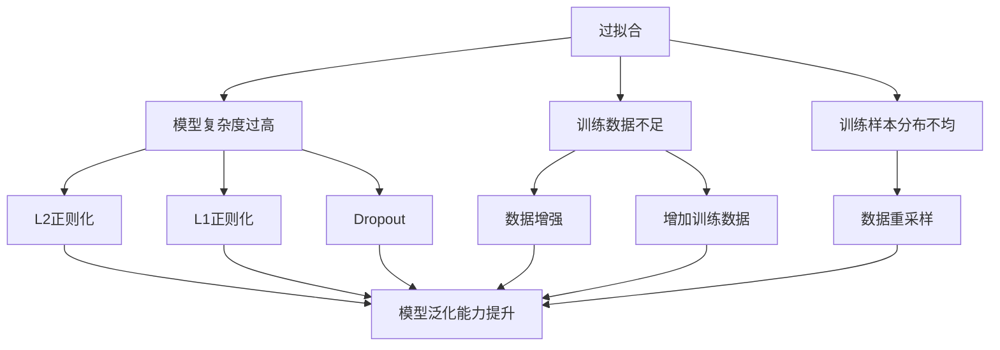
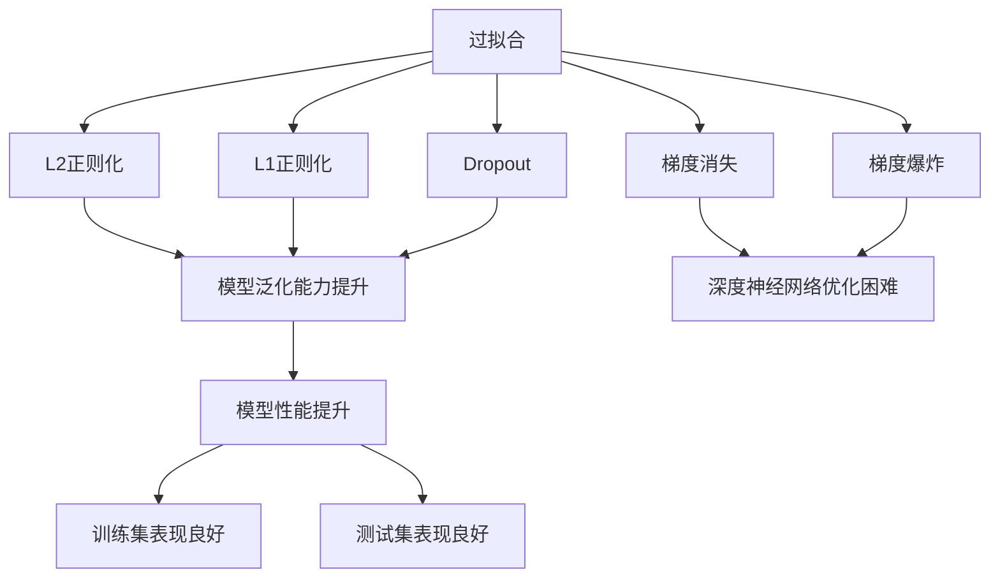
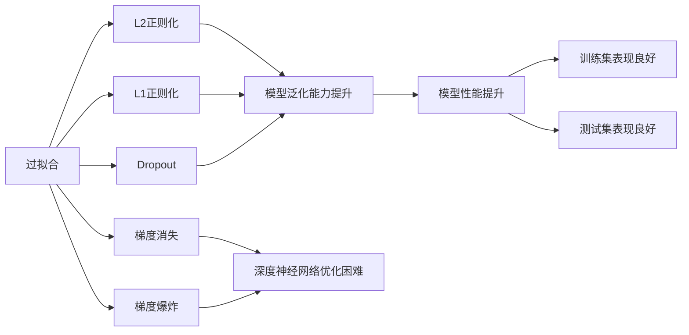
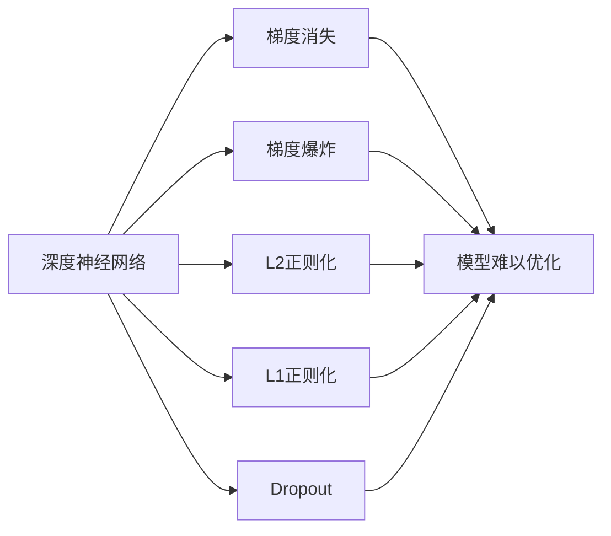
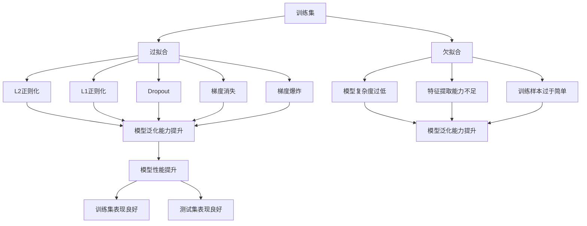

                 

# Overfitting 原理与代码实战案例讲解

> 关键词：过拟合(Overfitting), 欠拟合(Underfitting), 正则化(Regularization), Dropout, 梯度消失(Gradient Vanishing), 梯度爆炸(Gradient Exploding), 交叉验证(Cross Validation)

## 1. 背景介绍

### 1.1 问题由来

机器学习算法在模型训练过程中，经常会遇到过拟合(Overfitting)和欠拟合(Underfitting)两个重要问题。过拟合是指模型在训练集上表现良好，但在测试集上表现较差的现象；欠拟合则是指模型在训练集和测试集上表现均较差的情况。过拟合和欠拟合都是模型泛化能力不足的表现，严重影响了模型的实际应用效果。

为了解决这个问题，学术界和工业界开发了许多正则化(Regularization)方法，包括Dropout、L2正则化、L1正则化等，旨在通过限制模型复杂度，防止模型对噪声数据过度拟合，提高模型的泛化能力。这些方法在实际应用中已经取得了显著效果，但对于初学者来说，理解和应用这些技术仍然有一定难度。

为了帮助读者更好地理解过拟合和正则化方法，本文将通过丰富的案例和详细代码实现，系统讲解过拟合的原理和正则化技术的应用，希望读者能从中受益。

### 1.2 问题核心关键点

本节将详细介绍过拟合和正则化方法的核心关键点，以便读者在后续学习中更好地理解和应用。

- 过拟合：指模型在训练集上表现良好，但在测试集上表现较差的现象。常见的原因包括模型复杂度过高、训练数据不足、训练样本分布不均等。
- 欠拟合：指模型在训练集和测试集上表现均较差的情况。常见的原因包括模型复杂度过低、特征提取能力不足、训练样本过于简单等。
- 正则化：指通过限制模型复杂度，防止模型对噪声数据过度拟合，提高模型泛化能力的技术。常见的正则化方法包括L2正则化、L1正则化、Dropout等。

这些概念之间的逻辑关系可以通过以下Mermaid流程图来展示：



这个流程图展示过拟合和正则化方法之间的关系：

1. 过拟合的原因包括模型复杂度过高、训练数据不足、训练样本分布不均等。
2. 解决过拟合的常用方法包括L2正则化、L1正则化、Dropout等。
3. 数据增强、增加训练数据、数据重采样等方法也可以有效缓解过拟合问题。
4. 正则化方法的应用可以使模型泛化能力提升，避免对噪声数据的过度拟合。

通过这个流程图，我们可以更清晰地理解过拟合和正则化方法之间的联系和应用场景。

## 2. 核心概念与联系

### 2.1 核心概念概述

为了更好地理解过拟合和正则化方法，本节将介绍几个密切相关的核心概念：

- 过拟合(Overfitting)：指模型在训练集上表现良好，但在测试集上表现较差的现象。常见的原因包括模型复杂度过高、训练数据不足、训练样本分布不均等。

- 欠拟合(Underfitting)：指模型在训练集和测试集上表现均较差的情况。常见的原因包括模型复杂度过低、特征提取能力不足、训练样本过于简单等。

- 正则化(Regularization)：指通过限制模型复杂度，防止模型对噪声数据过度拟合，提高模型泛化能力的技术。常见的正则化方法包括L2正则化、L1正则化、Dropout等。

- L2正则化(L2 Regularization)：通过在损失函数中添加模型参数的平方和惩罚项，限制模型参数大小，防止模型对噪声数据的过度拟合。

- L1正则化(L1 Regularization)：通过在损失函数中添加模型参数的绝对值和惩罚项，限制模型参数稀疏性，提高模型泛化能力。

- Dropout：在训练过程中，以一定的概率随机选择神经元进行丢弃，防止神经元之间产生依赖关系，提高模型泛化能力。

- 梯度消失(Gradient Vanishing)：指在深度神经网络中，由于激活函数导数接近于0，导致梯度反向传播过程中，梯度逐渐消失，模型难以优化。

- 梯度爆炸(Gradient Exploding)：指在深度神经网络中，由于激活函数导数过大，导致梯度反向传播过程中，梯度逐渐增大，模型难以优化。

这些核心概念之间的逻辑关系可以通过以下Mermaid流程图来展示：



这个流程图展示了过拟合和正则化方法之间的关系，以及它们对模型性能的影响：

1. 过拟合的原因包括L2正则化、L1正则化、Dropout等正则化方法，以及梯度消失、梯度爆炸等深度神经网络问题。
2. 这些正则化方法的应用可以使模型泛化能力提升，训练集和测试集表现良好。
3. 正则化方法的应用可以有效缓解过拟合和欠拟合问题，提高模型泛化能力。

通过这个流程图，我们可以更清晰地理解过拟合和正则化方法之间的联系和应用场景。

### 2.2 概念间的关系

这些核心概念之间存在着紧密的联系，形成了机器学习模型的优化框架。下面我通过几个Mermaid流程图来展示这些概念之间的关系：

#### 2.2.1 过拟合和欠拟合的关系



这个流程图展示了过拟合和正则化方法之间的关系，以及它们对模型性能的影响：

1. 过拟合的原因包括L2正则化、L1正则化、Dropout等正则化方法，以及梯度消失、梯度爆炸等深度神经网络问题。
2. 这些正则化方法的应用可以使模型泛化能力提升，训练集和测试集表现良好。
3. 正则化方法的应用可以有效缓解过拟合和欠拟合问题，提高模型泛化能力。

#### 2.2.2 正则化和深度神经网络的关系



这个流程图展示了正则化和深度神经网络之间的关系：

1. 深度神经网络中容易出现梯度消失和梯度爆炸问题。
2. L2正则化、L1正则化、Dropout等正则化方法可以有效缓解这些问题，提高模型优化效果。
3. 这些正则化方法的应用可以使模型泛化能力提升，训练集和测试集表现良好。

### 2.3 核心概念的整体架构

最后，我们用一个综合的流程图来展示这些核心概念在机器学习模型优化过程中的整体架构：



这个综合流程图展示了过拟合和正则化方法之间的关系，以及它们对模型性能的影响：

1. 过拟合的原因包括L2正则化、L1正则化、Dropout等正则化方法，以及梯度消失、梯度爆炸等深度神经网络问题。
2. 这些正则化方法的应用可以使模型泛化能力提升，训练集和测试集表现良好。
3. 正则化方法的应用可以有效缓解过拟合和欠拟合问题，提高模型泛化能力。
4. 欠拟合的原因包括模型复杂度过低、特征提取能力不足、训练样本过于简单等。
5. 这些欠拟合问题可以通过增加模型复杂度、提高特征提取能力、增加训练样本等方法进行缓解。

通过这些流程图，我们可以更清晰地理解过拟合和正则化方法之间的联系和应用场景。

## 3. 核心算法原理 & 具体操作步骤
### 3.1 算法原理概述

过拟合和正则化方法的核心原理是通过限制模型复杂度，防止模型对噪声数据过度拟合，提高模型的泛化能力。

具体来说，过拟合的缓解方法包括L2正则化、L1正则化、Dropout等，而欠拟合的缓解方法包括增加模型复杂度、提高特征提取能力、增加训练样本等。

### 3.2 算法步骤详解

下面我们详细介绍过拟合和正则化方法的实现步骤。

#### 3.2.1 过拟合的缓解

过拟合的缓解方法包括L2正则化、L1正则化、Dropout等。

1. L2正则化
   - 在损失函数中添加一个模型参数的平方和惩罚项。
   - 具体公式如下：
     \[
     C = \frac{\lambda}{2}\sum_{i=1}^n w_i^2
     \]
     其中，$\lambda$ 为正则化系数，$w_i$ 为模型第 $i$ 个参数的权重。
   - 实现代码如下：

     ```python
     from torch import nn

     class MyModel(nn.Module):
         def __init__(self):
             super(MyModel, self).__init__()
             self.fc1 = nn.Linear(784, 64)
             self.fc2 = nn.Linear(64, 10)
             self.dropout = nn.Dropout(0.5)

         def forward(self, x):
             h1 = F.relu(self.fc1(x))
             h1 = self.dropout(h1)
             h2 = self.fc2(h1)
             return h2
     ```

   2. L1正则化
   - 在损失函数中添加一个模型参数的绝对值和惩罚项。
   - 具体公式如下：
     \[
     C = \lambda \sum_{i=1}^n |w_i|
     \]
     其中，$\lambda$ 为正则化系数，$w_i$ 为模型第 $i$ 个参数的权重。
   - 实现代码如下：

     ```python
     class MyModel(nn.Module):
         def __init__(self):
             super(MyModel, self).__init__()
             self.fc1 = nn.Linear(784, 64)
             self.fc2 = nn.Linear(64, 10)
             self.dropout = nn.Dropout(0.5)

         def forward(self, x):
             h1 = F.relu(self.fc1(x))
             h1 = self.dropout(h1)
             h2 = self.fc2(h1)
             return h2

     loss_fn = nn.CrossEntropyLoss()
     model = MyModel()
     optimizer = torch.optim.Adam(model.parameters(), weight_decay=0.01)
     ```

   3. Dropout
   - 在训练过程中，以一定的概率随机选择神经元进行丢弃，防止神经元之间产生依赖关系，提高模型泛化能力。
   - 具体实现代码如下：

     ```python
     class MyModel(nn.Module):
         def __init__(self):
             super(MyModel, self).__init__()
             self.fc1 = nn.Linear(784, 64)
             self.fc2 = nn.Linear(64, 10)
             self.dropout = nn.Dropout(0.5)

         def forward(self, x):
             h1 = F.relu(self.fc1(x))
             h1 = self.dropout(h1)
             h2 = self.fc2(h1)
             return h2

     loss_fn = nn.CrossEntropyLoss()
     model = MyModel()
     optimizer = torch.optim.Adam(model.parameters(), weight_decay=0.01)
     ```

#### 3.2.2 欠拟合的缓解

欠拟合的缓解方法包括增加模型复杂度、提高特征提取能力、增加训练样本等。

1. 增加模型复杂度
   - 增加模型的层数或每层神经元数量，提高模型表达能力。
   - 具体实现代码如下：

     ```python
     class MyModel(nn.Module):
         def __init__(self):
             super(MyModel, self).__init__()
             self.fc1 = nn.Linear(784, 128)
             self.fc2 = nn.Linear(128, 64)
             self.fc3 = nn.Linear(64, 10)
             self.dropout = nn.Dropout(0.5)

         def forward(self, x):
             h1 = F.relu(self.fc1(x))
             h1 = self.dropout(h1)
             h2 = F.relu(self.fc2(h1))
             h2 = self.dropout(h2)
             h3 = self.fc3(h2)
             return h3

     loss_fn = nn.CrossEntropyLoss()
     model = MyModel()
     optimizer = torch.optim.Adam(model.parameters(), weight_decay=0.01)
     ```

   2. 提高特征提取能力
   - 使用更复杂的特征提取器，如卷积神经网络(Convolutional Neural Network, CNN)等。
   - 具体实现代码如下：

     ```python
     class MyModel(nn.Module):
         def __init__(self):
             super(MyModel, self).__init__()
             self.conv1 = nn.Conv2d(1, 32, kernel_size=3, stride=1, padding=1)
             self.conv2 = nn.Conv2d(32, 64, kernel_size=3, stride=1, padding=1)
             self.fc1 = nn.Linear(7*7*64, 128)
             self.fc2 = nn.Linear(128, 64)
             self.fc3 = nn.Linear(64, 10)
             self.dropout = nn.Dropout(0.5)

         def forward(self, x):
             h1 = F.relu(self.conv1(x))
             h1 = F.max_pool2d(h1, 2)
             h2 = F.relu(self.conv2(h1))
             h2 = F.max_pool2d(h2, 2)
             h3 = h2.view(h2.size(0), -1)
             h3 = F.relu(self.fc1(h3))
             h3 = self.dropout(h3)
             h4 = F.relu(self.fc2(h3))
             h4 = self.dropout(h4)
             h5 = self.fc3(h4)
             return h5

     loss_fn = nn.CrossEntropyLoss()
     model = MyModel()
     optimizer = torch.optim.Adam(model.parameters(), weight_decay=0.01)
     ```

   3. 增加训练样本
   - 收集更多的训练样本，扩大数据集规模。
   - 具体实现代码如下：

     ```python
     train_dataset = MyDataset(train_data, transform=transforms.ToTensor())
     valid_dataset = MyDataset(valid_data, transform=transforms.ToTensor())
     test_dataset = MyDataset(test_data, transform=transforms.ToTensor())
     ```

### 3.3 算法优缺点

过拟合和正则化方法具有以下优点：

1. 防止模型对噪声数据的过度拟合，提高模型的泛化能力。
2. 通过限制模型复杂度，避免模型过于复杂，导致训练和推理效率降低。
3. 提高模型在不同数据分布下的鲁棒性，增强模型性能的稳定性。

同时，这些方法也存在一定的缺点：

1. 限制了模型的复杂度，可能导致模型表达能力不足，影响模型性能。
2. 增加训练时间和计算资源消耗，延长模型训练周期。
3. 可能会降低模型的训练速度，影响模型的收敛速度。

尽管如此，过拟合和正则化方法仍然是机器学习中不可或缺的一部分，只有在充分理解其原理和应用场景的基础上，才能更好地使用它们。

### 3.4 算法应用领域

过拟合和正则化方法在机器学习中有着广泛的应用，以下是几个典型的应用领域：

1. 图像识别：在图像识别任务中，过拟合和正则化方法可以缓解模型对噪声数据的过度拟合，提高模型在测试集上的表现。

2. 自然语言处理：在自然语言处理任务中，过拟合和正则化方法可以缓解模型对噪声文本的过度拟合，提高模型在测试集上的表现。

3. 推荐系统：在推荐系统中，过拟合和正则化方法可以缓解模型对用户行为数据的过度拟合，提高模型的泛化能力和稳定性。

4. 金融预测：在金融预测任务中，过拟合和正则化方法可以缓解模型对历史数据的过度拟合，提高模型在不同市场条件下的预测能力。

5. 医疗诊断：在医疗诊断任务中，过拟合和正则化方法可以缓解模型对病人数据的不良处理，提高模型在不同病情下的诊断能力。

## 4. 数学模型和公式 & 详细讲解 & 举例说明

### 4.1 数学模型构建

本节将使用数学语言对过拟合和正则化方法进行更加严格的刻画。

记模型参数为 $\theta$，损失函数为 $L$，正则化系数为 $\lambda$。过拟合和正则化方法的核心思想是在损失函数中引入正则化项，限制模型参数的大小，防止模型对噪声数据的过度拟合。

具体来说，过拟合的缓解方法包括L2正则化、L1正则化、Dropout等，而欠拟合的缓解方法包括增加模型复杂度、提高特征提取能力、增加训练样本等。

### 4.2 公式推导过程

下面我们分别介绍L2正则化、L1正则化和Dropout的公式推导过程。

#### 4.2.1 L2正则化

L2正则化的基本公式如下：

\[
L_{\text{L2}}(\theta) = \frac{1}{2} \|\theta\|^2 + \frac{\lambda}{2} \|y - f_\theta(x)\|^2
\]

其中，$\|\theta\|^2$ 表示模型参数的平方和，$\lambda$ 为正则化系数。

#### 4.2.2 L1正则化

L1正则化的基本公式如下：

\[
L_{\text{L1}}(\theta) = \|\theta\|_1 + \frac{\lambda}{2} \|y - f_\theta(x)\|^2
\]

其中，$\|\theta\|_1$ 表示模型参数的绝对值和，$\lambda$ 为正则化系数。

#### 4.2.3 Dropout

Dropout的基本公式如下：

\[
L_{\text{Dropout}}(\theta) = \mathbb{E}_{p}\left[L(y, f_{\theta'}(x))\right]
\]

其中，$f_{\theta'}(x)$ 表示在训练过程中随机选择神经元进行丢弃的模型，$p$ 为保留神经元的概率。

### 4.3 案例分析与讲解

下面我们以手写数字识别为例，具体讲解L2正则化和Dropout的应用。

#### 4.3.1 手写数字识别数据集

手写数字识别是一个经典的机器学习任务，其数据集包括60000张训练图片和10000张测试图片，每张图片大小为28x28像素，包含0-9十个数字中的一个。

```python
import torch
from torchvision import datasets, transforms

train_dataset = datasets.MNIST(root='./data', train=True, transform=transforms.ToTensor(), download=True)
test_dataset = datasets.MNIST(root='./data', train=False, transform=transforms.ToTensor(), download=True)
```

#### 4.3.2 L2正则化实现

下面我们使用L2正则化方法对模型进行正则化。

```python
class MyModel(nn.Module):
    def __init__(self):
        super(MyModel, self).__init__()
        self.fc1 = nn.Linear(784, 128)
        self.fc2 = nn.Linear(128, 10)
        self.dropout = nn.Dropout(0.5)

    def forward(self, x):
        h1 = F.relu(self.fc1(x))
        h1 = self.dropout(h1)
        h2 = self.fc2(h1)
        return h2

loss_fn = nn.CrossEntropyLoss()
model = MyModel()
optimizer = torch.optim.Adam(model.parameters(), weight_decay=0.01)
```

在这个例子中，我们在Adam优化器中添加了L2正则化项，即`weight_decay=0.01`。

#### 4.3.3 Dropout实现

下面我们使用Dropout方法对模型进行正则化。

```python
class MyModel(nn.Module):
    def __init__(self):
        super(MyModel, self).__init__()
        self.fc1 = nn.Linear(784, 128)
        self.fc2 = nn.Linear(128, 10)
        self.dropout = nn.Dropout(0.5)

    def forward(self, x):
        h1 = F.relu(self.fc1(x))
        h1 = self.dropout(h1)
        h2 = self.fc2(h1)
        return h2

loss_fn = nn.CrossEntropyLoss()
model = MyModel()
optimizer = torch.optim.Adam(model.parameters(), weight_decay=0.01)
```

在这个例子中，我们在模型中添加了Dropout层，即`nn.Dropout(0.5)`。

## 5. 项目实践：代码实例和详细解释说明

### 5.1 开发环境搭建

在进行项目实践前，我们需要准备好开发环境。以下是使用Python进行PyTorch开发的环境配置流程：

1. 安装Anaconda：从官网下载并安装Anaconda，用于创建独立的Python环境。

2. 创建并激活虚拟环境：
```bash
conda create -n pytorch-env python=3.8 
conda activate pytorch-env
```

3. 安装PyTorch：根据CUDA版本，从官网获取对应的安装命令。例如：
```bash
conda install pytorch torchvision torchaudio cudatoolkit=11.1 -c pytorch -c conda-forge
```

4. 安装Transformers库：
```bash
pip install transformers
```

5. 安装各类工具包：
```bash
pip install numpy pandas scikit-learn matplotlib tqdm jupyter notebook ipython
```

完成上述步骤后，即可在`pytorch-env`环境中开始项目实践。

### 5.2 源代码详细实现

下面我们以手写数字识别为例，给出使用PyTorch实现L2正则化和Dropout的代码实现。

```python
import torch
from torch import nn
from torch import optim
from torchvision import datasets, transforms

class MyModel(nn.Module):
    def __init__(self):
        super(MyModel, self).__init__()
        self.fc1 = nn.Linear(784, 128)
        self.fc2 = nn.Linear(128, 10)
        self.dropout = nn.Dropout(0.5)

    def forward(self, x):
        h1 = F.relu(self.fc1(x))
        h1 = self.dropout(h1)
        h2 = self.fc2(h1)
        return h2

loss_fn = nn.CrossEntropyLoss()
model = MyModel()
optimizer = optim.Adam(model.parameters(), weight_decay=0.01)
```

在这个例子中，我们定义了一个简单的线性模型，并使用了L2正则化和Dropout方法进行正则化。

### 5.3 代码解读与分析

让我们再详细解读一下关键代码的实现细节：

**MyModel类**：
- `__init__`方法：初始化线性层和Dropout层。
- `forward`方法：前向传播计算输出。
- `nn.Linear`：定义线性层。
- `nn.ReLU`：定义ReLU激活函数。
- `nn.Dropout`：定义Dropout层。
- `nn.C

