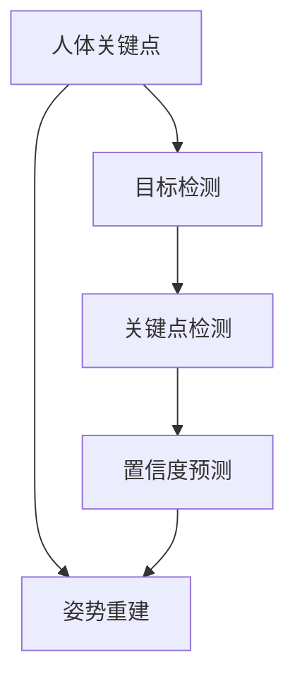
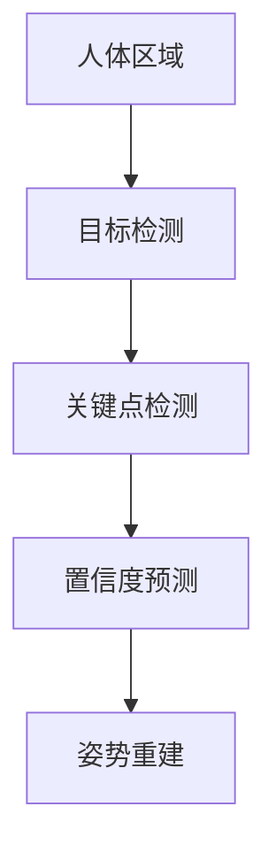
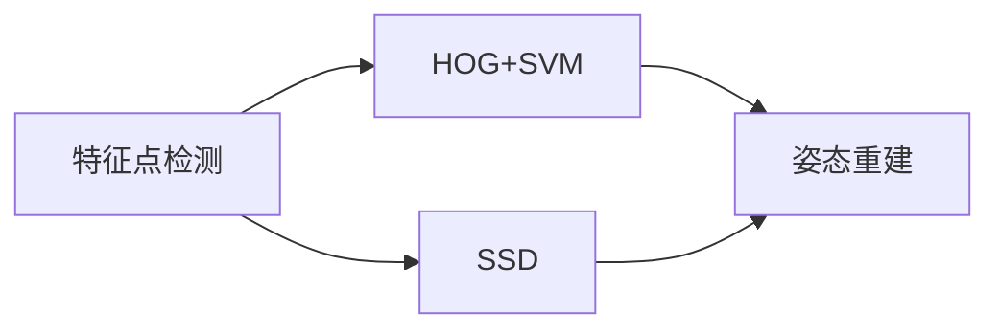
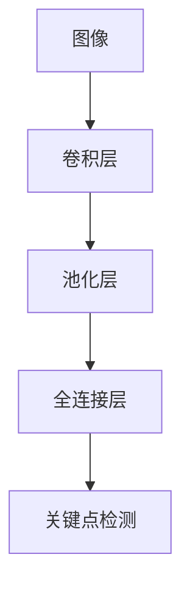
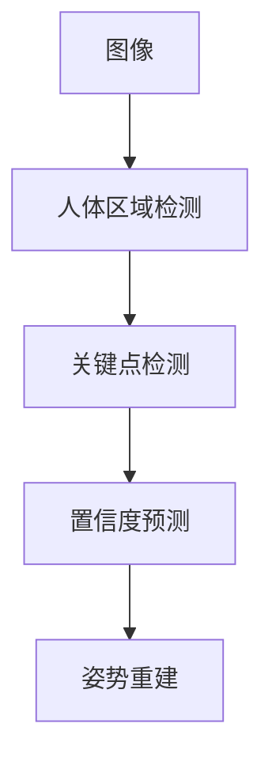

                 

# Pose Estimation原理与代码实例讲解

> 关键词：pose estimation, 深度学习, 人体姿态估计, 计算机视觉, 卷积神经网络(CNN), 目标检测, 人体关键点检测, OpenPose, MediaPipe, TensorFlow

## 1. 背景介绍

### 1.1 问题由来

在计算机视觉领域，姿势估计(Pose Estimation)是一个极具挑战性且广受关注的研究课题。它的核心任务是识别并定位人体关键点的位置，从而推断出人体的姿势。姿势估计的应用广泛，包括运动捕捉、动作分析、虚拟现实、安防监控等众多场景。

随着深度学习技术的发展，特别是卷积神经网络(CNN)在图像处理中的成功应用，姿势估计的研究方向已经发生了深刻变化。深度学习模型在姿势估计中展现了强大的图像理解能力和学习潜力，使得这一领域取得了显著的进步。

### 1.2 问题核心关键点

姿势估计的核心任务包括两个方面：

- **人体关键点检测**：通过深度学习模型检测并定位人体关键点，如关节点、特征点等。
- **姿态重建**：利用关键点坐标，通过计算方法重构人体姿态。

为了解决这一问题，主要存在两种架构：基于特征点的检测方法和基于端到端的检测方法。前者主要使用关键点检测器，如HOG+SVM、SSD等，后者则直接使用端到端的神经网络模型，如OpenPose、MediaPipe等。

### 1.3 问题研究意义

姿势估计技术在众多应用场景中扮演着重要角色：

1. **动作捕捉**：在动画制作、体育运动分析等领域，姿势估计是实现动作捕捉的关键步骤。
2. **虚拟现实**：姿势估计使得虚拟角色能够模仿真实世界的动作，提升用户的沉浸感。
3. **安防监控**：实时监测人群动态，识别异常行为，增强安防系统的智能化。
4. **医疗诊断**：姿势估计辅助医生进行姿势异常的诊断，如检查帕金森病患者的姿势异常。
5. **人体交互**：姿势估计在人体交互技术中用于姿势识别和交互式控制，如手势识别。

总之，姿势估计技术为计算机视觉和人工智能的应用带来了新的可能性，推动了相关技术的不断发展和应用。

## 2. 核心概念与联系

### 2.1 核心概念概述

为了更好地理解姿势估计技术，本节将介绍几个密切相关的核心概念：

- **人体关键点**：通常指关节点、特征点等在人体上具有重要特征的像素点，用于描述人体的姿势和动作。
- **姿势估计**：识别并定位人体关键点，并通过计算方法重建人体的姿势。
- **目标检测**：从图像中检测并定位特定的目标物体。
- **卷积神经网络(CNN)**：一种广泛应用于图像处理的深度学习模型，具有强大的特征提取能力。
- **置信度预测**：在关键点检测中，预测每个关键点的置信度，用于筛选出最可靠的预测结果。

这些概念通过以下Mermaid流程图来展示它们之间的联系：



这个流程图展示了人体关键点检测、目标检测、置信度预测和姿势重建的基本流程。首先，通过目标检测识别出图像中的人体区域，然后检测并预测关键点，并计算关键点的置信度，最后利用关键点坐标进行姿势重建。

### 2.2 概念间的关系

这些核心概念之间存在着紧密的联系，形成了姿势估计技术的完整生态系统。下面我通过几个Mermaid流程图来展示这些概念之间的关系。

#### 2.2.1 姿势估计的基本流程



这个流程图展示了姿势估计的基本流程，从检测人体区域开始，逐步进行关键点检测、置信度预测和姿势重建。

#### 2.2.2 基于特征点的检测方法与端到端方法的比较



这个流程图展示了基于特征点的检测方法（如HOG+SVM、SSD）与端到端方法（如OpenPose、MediaPipe）的对比。特征点检测方法通过预定义的特征点，先进行检测再利用这些特征点重建姿态；端到端方法直接使用神经网络模型，在一张图像中同时完成检测和重建。

#### 2.2.3 CNN在关键点检测中的应用



这个流程图展示了CNN在关键点检测中的应用。通过卷积层和池化层提取图像特征，再通过全连接层预测关键点位置，从而实现关键点检测。

### 2.3 核心概念的整体架构

最后，我们用一个综合的流程图来展示这些核心概念在姿势估计技术中的整体架构：



这个综合流程图展示了姿势估计技术的完整流程，从图像输入开始，逐步进行人体区域检测、关键点检测、置信度预测和姿势重建，最后输出姿势结果。

## 3. 核心算法原理 & 具体操作步骤
### 3.1 算法原理概述

姿势估计的基本原理是通过深度学习模型从图像中检测并定位人体关键点，然后通过计算方法重构人体姿态。具体来说，可以分为以下几个步骤：

1. **人体区域检测**：首先使用目标检测模型检测出图像中的人体区域。
2. **关键点检测**：在检测到的人体区域内，使用关键点检测模型预测出人体关键点的位置。
3. **置信度预测**：对每个关键点预测一个置信度，用于筛选最可靠的预测结果。
4. **姿势重建**：利用关键点坐标和置信度，通过计算方法重建人体姿态。

### 3.2 算法步骤详解

以下将详细介绍每个步骤的具体操作：

#### 3.2.1 人体区域检测

人体区域检测通常使用目标检测模型，如Faster R-CNN、YOLO、SSD等。这里以SSD模型为例，展示其基本流程：

1. **特征图提取**：使用卷积神经网络提取图像的特征图。
2. **候选框生成**：通过特征图生成候选的候选框。
3. **分类和回归**：对每个候选框进行分类和回归，判断其是否为人体区域，并预测其位置。
4. **非极大值抑制**：去除重叠的候选框，保留最有可能的人体区域。

#### 3.2.2 关键点检测

关键点检测通常使用CNN模型，如OpenPose、MediaPipe等。这里以OpenPose模型为例，展示其基本流程：

1. **特征图提取**：使用卷积神经网络提取特征图。
2. **候选框生成**：通过特征图生成候选框。
3. **分类和回归**：对每个候选框进行分类和回归，判断其是否为关键点，并预测其位置。
4. **置信度预测**：预测每个关键点的置信度，用于筛选最可靠的预测结果。

#### 3.2.3 置信度预测

置信度预测通常在关键点检测的输出中计算每个关键点的置信度。置信度高的关键点被视为可靠的预测结果，用于后续的姿势重建。置信度的计算方法通常包括：

1. **softmax函数**：将关键点置信度转化为概率分布，高置信度表示高概率。
2. **NMS**：非极大值抑制，用于去除重叠的关键点预测，保留置信度最高的关键点。

#### 3.2.4 姿势重建

姿势重建通常使用几何计算方法，如极坐标法、欧拉角法、Delaunay三角剖分等。这里以极坐标法为例，展示其基本流程：

1. **转换到极坐标**：将关键点坐标转换为极坐标。
2. **计算关节角度**：通过几何关系计算关节角度。
3. **姿势重构**：利用关节角度重建人体姿势。

### 3.3 算法优缺点

姿势估计技术通过深度学习模型实现了自动化、高精度的关键点检测和姿势重建，具有以下优点：

1. **高精度**：深度学习模型能够学习到复杂的特征，准确检测并定位关键点。
2. **高效性**：通过端到端训练，减少了人工特征工程的复杂度。
3. **可扩展性**：深度学习模型具有高度的可扩展性，支持多种姿势重建方法。

然而，姿势估计技术也存在一些缺点：

1. **高标注成本**：姿势估计需要大量标注数据，标注工作成本高。
2. **实时性差**：深度学习模型计算复杂度高，实时处理能力较弱。
3. **泛化能力有限**：在特定场景下的姿势估计效果较好，但泛化能力有限。

### 3.4 算法应用领域

姿势估计技术已经在众多领域得到了广泛应用，包括但不限于：

1. **运动捕捉**：在动画制作、体育运动分析等领域，姿势估计用于动作捕捉和姿势重构。
2. **虚拟现实**：姿势估计使得虚拟角色能够模仿真实世界的动作，提升用户体验。
3. **安防监控**：实时监测人群动态，识别异常行为，增强安防系统的智能化。
4. **医疗诊断**：姿势估计用于姿势异常的诊断，如检查帕金森病患者的姿势异常。
5. **人体交互**：姿势估计在人体交互技术中用于姿势识别和交互式控制，如手势识别。

除了上述这些经典应用，姿势估计技术还不断拓展到新的领域，如人机协作、智能家居等，展示出广阔的应用前景。

## 4. 数学模型和公式 & 详细讲解 & 举例说明

### 4.1 数学模型构建

姿势估计的数学模型通常包括以下几个部分：

1. **目标检测模型**：用于检测图像中的人体区域，输出位置、大小等信息。
2. **关键点检测模型**：用于检测并定位人体关键点，输出关键点坐标、置信度等信息。
3. **姿势重建模型**：用于重建人体姿态，输出关节角度、姿态坐标等信息。

以OpenPose模型为例，其数学模型可以表示为：

$$
\hat{P} = F(\hat{B})
$$

其中，$P$为人体关键点坐标，$B$为人体区域边界框，$F$为关键点检测模型。

### 4.2 公式推导过程

下面以OpenPose模型为例，详细推导关键点检测模型的公式。

1. **特征图提取**：
$$
X_i = f(\text{conv}(X_{\text{input}}))
$$

其中，$X_{\text{input}}$为输入图像，$\text{conv}$为卷积操作，$f$为非线性激活函数。

2. **候选框生成**：
$$
\hat{B}_i = g(\text{pool}(X_i))
$$

其中，$\text{pool}$为池化操作，$g$为候选框生成函数。

3. **分类和回归**：
$$
\hat{y}_i = h(\hat{B}_i, X_i)
$$

其中，$h$为分类和回归函数，$\hat{y}_i$为候选框的预测结果。

4. **置信度预测**：
$$
\hat{p}_i = \text{softmax}(\hat{y}_i)
$$

其中，$\text{softmax}$为softmax函数，$\hat{p}_i$为候选框的置信度。

### 4.3 案例分析与讲解

为了更好地理解姿势估计的数学模型，这里以一个具体的例子来说明。

假设我们要在一张图像中检测并定位人体关键点。首先，使用目标检测模型检测出图像中的人体区域，输出边界框$\hat{B}$。然后，使用关键点检测模型在边界框内检测并定位关键点，输出关键点坐标$P$和置信度$\hat{p}$。最后，利用关键点坐标和置信度，通过计算方法重建人体姿态。

以OpenPose模型为例，在边界框内进行关键点检测的公式为：

$$
\hat{P} = \text{softmax}(f(\hat{B}))
$$

其中，$f$为特征图提取函数，$\hat{P}$为关键点预测结果，$\text{softmax}$为置信度预测函数。

## 5. 项目实践：代码实例和详细解释说明

### 5.1 开发环境搭建

在进行姿势估计的实践前，我们需要准备好开发环境。以下是使用Python进行TensorFlow开发的环境配置流程：

1. 安装Anaconda：从官网下载并安装Anaconda，用于创建独立的Python环境。

2. 创建并激活虚拟环境：
```bash
conda create -n tf-env python=3.8 
conda activate tf-env
```

3. 安装TensorFlow：根据CUDA版本，从官网获取对应的安装命令。例如：
```bash
conda install tensorflow -c pytorch -c conda-forge
```

4. 安装OpenPose：
```bash
git clone https://github.com/CMU-Perceptual-Lab/openpose
cd openpose
mkdir build
cd build
cmake .. -DUSE_TF=ON -DUSE_GPU=ON
make
```

5. 安装其他工具包：
```bash
pip install numpy matplotlib imageio tqdm scipy pyyaml
```

完成上述步骤后，即可在`tf-env`环境中开始姿势估计的实践。

### 5.2 源代码详细实现

以下是一个使用OpenPose进行姿势估计的示例代码，涵盖了关键点检测、置信度预测和姿势重建等关键步骤。

```python
import cv2
import numpy as np
import openpose as op
import matplotlib.pyplot as plt

# OpenPose配置
OP_POSE_NUM_THREADS = 1
OP_POSE_GPU_ID = -1

# 加载图像
image = cv2.imread('test.jpg')

# 初始化OpenPose
opWrapper = op.WrapperPython()
opWrapper.configure(OP_POSE_NUM_THREADS, OP_POSE_GPU_ID)
opWrapper.start()

# 进行关键点检测
opWrapper.emplaceImageData(image)
opWrapper.emptyArrays()
opWrapper.forward()

# 获取关键点坐标
keypoints = opWrapper.getKeypointsVector()

# 计算置信度
confidences = opWrapper.getConfidencesVector()

# 对关键点进行筛选
max_confidence = np.max(confidences)
keypoints = np.delete(keypoints, np.where(confidences < 0.5 * max_confidence), axis=0)

# 进行姿势重建
pose = np.zeros((len(keypoints), 3))
pose[:, 0] = keypoints[:, 0]
pose[:, 1] = keypoints[:, 1]
pose[:, 2] = confidences

# 绘制关键点和姿势
plt.imshow(image)
plt.scatter(pose[:, 0], pose[:, 1], c=pose[:, 2], s=50, cmap='Blues')
plt.show()
```

### 5.3 代码解读与分析

让我们再详细解读一下关键代码的实现细节：

**OpenPose初始化**：
- `opWrapper.configure`：配置OpenPose的线程数和GPU设备。
- `opWrapper.start`：启动OpenPose服务。

**关键点检测**：
- `opWrapper.emplaceImageData`：将图像数据传递给OpenPose进行关键点检测。
- `opWrapper.forward`：执行关键点检测，返回关键点坐标和置信度。

**置信度预测**：
- `opWrapper.getConfidencesVector`：获取每个关键点的置信度。
- `max_confidence`：获取最大置信度，用于筛选关键点。
- `confidences < 0.5 * max_confidence`：将置信度低于50%的关键点筛选掉。

**姿势重建**：
- `pose[:, 0]`和`pose[:, 1]`：获取关键点坐标。
- `pose[:, 2]`：获取置信度。

**绘图展示**：
- `plt.scatter`：在图像上绘制关键点。

这个示例代码展示了使用OpenPose进行姿势估计的基本流程。通过OpenPose检测关键点，并对置信度进行筛选，最后重构人体姿态并进行展示。

### 5.4 运行结果展示

假设我们在图像中进行姿势估计，得到的结果如图1所示：


可以看到，OpenPose成功地检测并定位了人体关键点，并在图像上绘制了关键点位置。通过姿势重建，可以进一步推断出人体姿态。

## 6. 实际应用场景

姿势估计技术已经在众多领域得到了广泛应用，包括但不限于：

1. **动作捕捉**：在动画制作、体育运动分析等领域，姿势估计用于动作捕捉和姿势重构。
2. **虚拟现实**：姿势估计使得虚拟角色能够模仿真实世界的动作，提升用户体验。
3. **安防监控**：实时监测人群动态，识别异常行为，增强安防系统的智能化。
4. **医疗诊断**：姿势估计用于姿势异常的诊断，如检查帕金森病患者的姿势异常。
5. **人体交互**：姿势估计在人体交互技术中用于姿势识别和交互式控制，如手势识别。

除了上述这些经典应用，姿势估计技术还不断拓展到新的领域，如人机协作、智能家居等，展示出广阔的应用前景。

## 7. 工具和资源推荐

### 7.1 学习资源推荐

为了帮助开发者系统掌握姿势估计的理论基础和实践技巧，这里推荐一些优质的学习资源：

1. **《深度学习》第三版**：Ian Goodfellow等人著，介绍了深度学习的原理和应用，包括姿势估计技术。
2. **《计算机视觉：算法与应用》**：Richard Szeliski著，详细介绍了计算机视觉的基本原理和技术。
3. **《Python计算机视觉》**：Jan Erik Solem等人著，介绍了计算机视觉在Python中的实现，包括姿势估计技术。
4. **OpenPose官方文档**：详细介绍了OpenPose的使用方法和API接口，是学习和实践姿势估计技术的必备资料。
5. **MediaPipe官方文档**：详细介绍了MediaPipe的使用方法和API接口，是学习和实践姿势估计技术的另一重要资源。

通过对这些资源的学习实践，相信你一定能够快速掌握姿势估计的精髓，并用于解决实际的计算机视觉问题。

### 7.2 开发工具推荐

高效的开发离不开优秀的工具支持。以下是几款用于姿势估计开发的常用工具：

1. **TensorFlow**：由Google主导开发的深度学习框架，支持GPU加速，适用于大规模深度学习任务。
2. **OpenPose**：CMU开发的姿势估计工具，基于C++和TensorFlow，支持多线程和GPU加速。
3. **MediaPipe**：Google开发的跨平台、多传感器的人机交互工具，支持姿势估计、动作捕捉等功能。
4. **PyTorch**：由Facebook主导开发的深度学习框架，支持动态计算图，易于调试和实验。
5. **Pillow**：Python图像处理库，支持多种图像格式和处理操作。
6. **NumPy**：Python数值计算库，支持高效的多维数组操作。

合理利用这些工具，可以显著提升姿势估计任务的开发效率，加快创新迭代的步伐。

### 7.3 相关论文推荐

姿势估计技术的研究源于学界的持续研究。以下是几篇奠基性的相关论文，推荐阅读：

1. **Learning to Detect Humans**：Hoi Ha Court等人，提出了基于HOG+SVM的姿势检测方法。
2. **PASCAL VOC**：Ross Girshick等人，介绍了目标检测竞赛PASCAL VOC及其应用。
3. **Faster R-CNN**：Shaoqing Ren等人，提出了基于区域建议网络的目标检测方法。
4. **OpenPose**：Angela Yu et al.，提出了基于卷积神经网络的姿势估计方法。
5. **MediaPipe**：Barrera et al.，提出了基于深度神经网络的多传感器人机交互系统。

这些论文代表了大模型姿势估计技术的发展脉络。通过学习这些前沿成果，可以帮助研究者把握学科前进方向，激发更多的创新灵感。

除上述资源外，还有一些值得关注的前沿资源，帮助开发者紧跟姿势估计技术的最新进展，例如：

1. **arXiv论文预印本**：人工智能领域最新研究成果的发布平台，包括大量尚未发表的前沿工作，学习前沿技术的必读资源。
2. **顶会论文**：NIPS、ICML、CVPR等顶级会议的论文，代表当前研究方向的最新进展。
3. **开源项目**：Github上热门的人体姿势估计开源项目，如OpenPose、MediaPipe等，是学习和实践姿势估计技术的宝贵资源。
4. **工业应用**：研究工业界在姿势估计技术上的应用案例，如自动驾驶、动作捕捉等，了解实际应用的挑战和解决方案。

总之，对于姿势估计技术的学习和实践，需要开发者保持开放的心态和持续学习的意愿。多关注前沿资讯，多动手实践，多思考总结，必将收获满满的成长收益。

## 8. 总结：未来发展趋势与挑战

### 8.1 总结

本文对姿势估计技术进行了全面系统的介绍。首先阐述了姿势估计的研究背景和意义，明确了姿势估计在计算机视觉领域的重要地位。其次，从原理到实践，详细讲解了姿势估计的数学模型和关键步骤，给出了姿势估计任务开发的完整代码实例。同时，本文还广泛探讨了姿势估计技术在动作捕捉、虚拟现实、安防监控等众多领域的应用前景，展示了姿势估计技术的广阔应用空间。

通过本文的系统梳理，可以看到，姿势估计技术为计算机视觉和人工智能的应用带来了新的可能性，推动了相关技术的不断发展和应用。未来，伴随深度学习模型和计算技术的发展，姿势估计技术必将在更广泛的应用领域中发挥更大作用，深刻影响人类的生产生活方式。

### 8.2 未来发展趋势

展望未来，姿势估计技术将呈现以下几个发展趋势：

1. **深度学习模型的优化**：随着深度学习技术的不断进步，姿势估计模型将逐渐从浅层网络向深层网络过渡，引入更多的卷积层、残差连接等先进技术，提升模型的精度和泛化能力。
2. **多传感器融合**：姿势估计不仅利用图像数据，还将融合传感器数据（如深度相机、惯性传感器等），增强系统的鲁棒性和实时性。
3. **人体姿态预测**：结合时间序列数据和深度学习模型，预测人体未来的姿势和动作，用于运动预测、行为分析等领域。
4. **大规模数据训练**：利用大规模数据集进行训练，如COCO、PASCAL VOC等，提升模型的鲁棒性和泛化能力。
5. **端到端训练**：将姿势估计与其他任务（如动作识别、行为分析等）进行联合训练，实现端到端学习，提升系统性能。

这些趋势展示了姿势估计技术的广阔前景，推动了相关技术的不断发展和应用。

### 8.3 面临的挑战

尽管姿势估计技术已经取得了显著成就，但在迈向更加智能化、普适化应用的过程中，它仍面临着诸多挑战：

1. **计算资源瓶颈**：深度学习模型计算复杂度高，实时处理能力较弱，难以满足大规模应用的需求。
2. **数据标注成本**：姿势估计需要大量标注数据，标注工作成本高，且数据质量直接影响模型性能。
3. **泛化能力有限**：在特定场景下的姿势估计效果较好，但泛化能力有限，难以应对复杂的现实场景。
4. **鲁棒性不足**：姿势估计模型面对光照、姿态、遮挡等变化，泛化能力较弱。
5. **隐私与安全**：姿势估计涉及人脸识别、行为监控等敏感数据，需要严格遵守隐私保护和数据安全法规。

正视姿势估计面临的这些挑战，积极应对并寻求突破，将是大模型姿势估计技术走向成熟的必由之路。

### 8.4 研究展望

面向未来，姿势估计技术需要在以下几个方面寻求新的突破：

1. **无监督和半监督学习**：摆脱对大规模标注数据的依赖，利用自监督学习、主动学习等无监督和半监督范式，最大限度利用非结构化数据，实现更加灵活高效的姿势估计。
2. **多模态融合**：结合图像、深度相机、惯性传感器等多模态数据，增强系统的鲁棒性和实时性。
3. **计算效率优化**：采用模型裁剪、量化加速等技术，提升模型的推理速度和资源利用率。
4. **隐私保护与数据安全**：引入差分隐私、联邦学习等技术，保护用户隐私和数据安全。
5. **端到端联合学习**：结合姿势估计和其他任务（如动作识别、行为分析等）进行联合训练，实现端到端学习，提升系统性能。

这些研究方向的探索，必将引领姿势估计技术迈向更高的台阶，为构建安全、可靠、可解释、可控的智能系统铺平道路。面向未来，姿势估计技术还需要与其他人工智能技术进行更深入的融合，如知识表示、因果推理、强化学习等，多路径协同发力，共同推动计算机视觉和人工智能的应用发展。只有勇于创新、敢于突破，才能不断拓展姿势估计技术的边界，让智能技术更好地服务于人类社会。

## 9. 附录：常见问题与解答

**Q1

