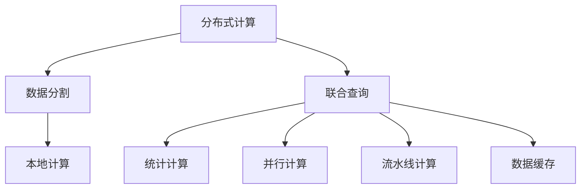
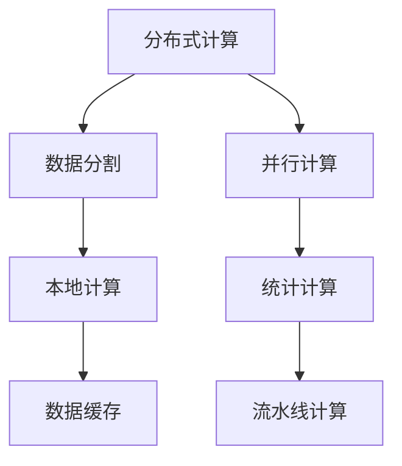
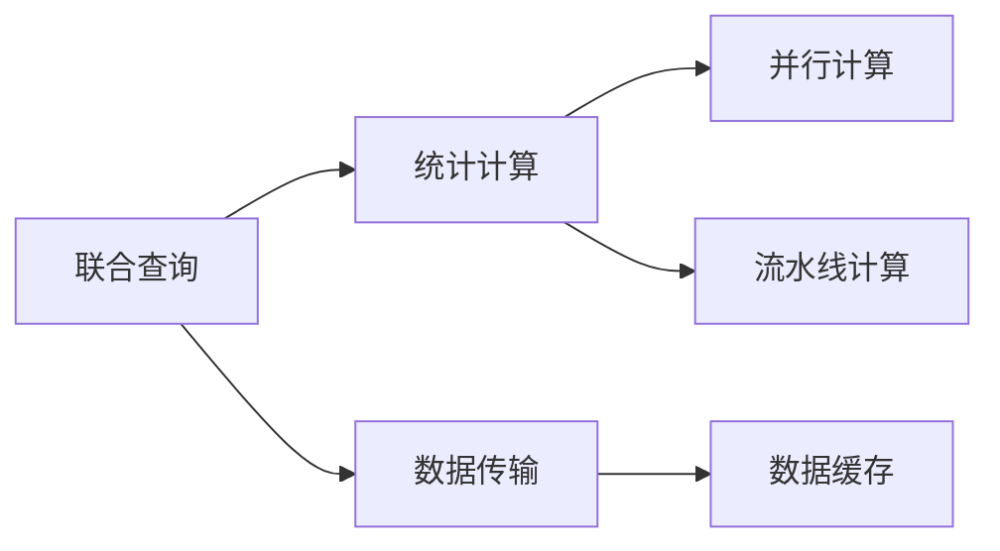
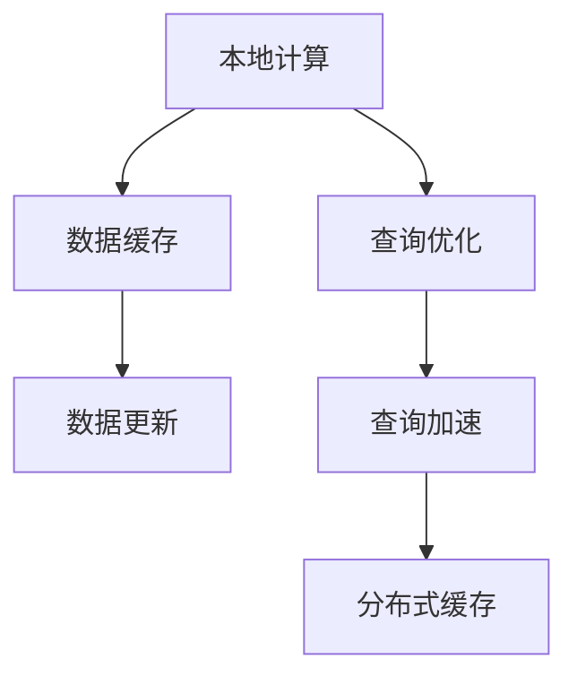
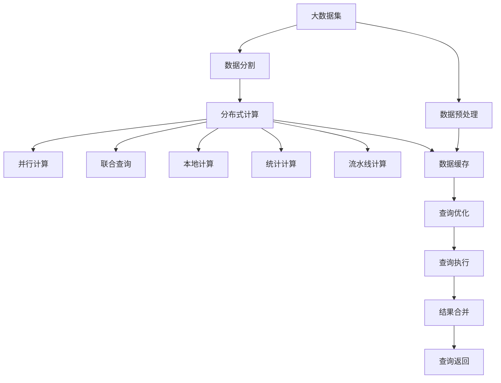

                 

# Presto原理与代码实例讲解

## 1. 背景介绍

### 1.1 问题由来
Presto是一种分布式SQL查询引擎，设计目标是提供高速、低延迟的数据查询服务。与传统的关系型数据库相比，Presto采用分布式计算架构，能够在大数据集上实现快速的查询响应。Presto的发展起源于Facebook对大规模数据分析的迫切需求，旨在解决传统MPP数据库在大数据集上的性能瓶颈问题。

### 1.2 问题核心关键点
Presto的核心优势在于其分布式计算架构和优化技术，使其能够高效处理大规模数据集，具有以下几个关键特性：
- 高性能：采用分布式计算架构，支持多节点并发查询。
- 低延迟：通过数据分割和本地计算，尽量减少数据传输和查询等待。
- 易扩展：支持节点动态添加和删除，能随着数据量增加而自动扩展。
- 零停机：支持热数据更新，不影响查询性能。

### 1.3 问题研究意义
研究Presto的工作原理和优化技术，对于理解分布式计算框架的设计理念、提升大数据处理能力、优化系统性能、拓展数据应用场景具有重要意义：
- 降低数据处理成本。通过分布式计算和优化算法，Presto能在较短时间内完成大数据分析任务，减少人力和计算资源的投入。
- 提升查询效率。Presto的高性能架构和算法优化，能显著缩短查询响应时间，提高数据使用效率。
- 促进数据驱动决策。Presto能够实时处理海量数据，为决策提供及时、准确的支持。
- 增强数据安全性。Presto支持数据加密和访问控制，保护数据隐私和完整性。
- 促进技术落地应用。Presto的技术体系和工程实践，为大数据产业化和数字化转型提供了技术基础。

## 2. 核心概念与联系

### 2.1 核心概念概述

为更好地理解Presto的工作原理和优化技术，本节将介绍几个密切相关的核心概念：

- 分布式计算：通过将大数据分割成多个子集，并行分配给不同计算节点进行计算，最终合并结果的一种计算模式。
- 数据分割：将大数据集按照一定规则划分成多个子集，每个子集称为一个数据分片。数据分割是实现分布式计算的基础。
- 联合查询：不同计算节点之间的数据交互和计算协同，通过网络传输数据，实现分布式查询。
- 本地计算：尽可能在数据所在的节点上进行计算，减少数据传输，提高查询效率。
- 统计计算：在查询中加入聚合函数，如SUM、AVG等，加速查询处理。
- 并行计算：通过多线程或分布式计算，并行执行同一任务的不同子任务，提高计算速度。
- 流水线计算：通过将查询任务划分为多个阶段，每个阶段独立执行，提高处理效率。
- 数据缓存：将频繁访问的数据存储在内存中，减少磁盘I/O，提高查询速度。

这些核心概念之间的逻辑关系可以通过以下Mermaid流程图来展示：



这个流程图展示了大规模数据集处理的分布式计算逻辑：

1. 分布式计算架构将大数据集分割为多个子集。
2. 数据分割后的子集被分配到不同的计算节点上。
3. 各个节点独立计算数据分片。
4. 节点之间通过网络进行联合查询。
5. 并行计算和流水线计算加速查询处理。
6. 数据缓存减少磁盘I/O，提高查询效率。

### 2.2 概念间的关系

这些核心概念之间存在着紧密的联系，形成了Presto的分布式计算框架。下面我们通过几个Mermaid流程图来展示这些概念之间的关系。

#### 2.2.1 分布式计算与数据分割



这个流程图展示了数据分割在分布式计算中的作用：

1. 分布式计算将大数据集划分为多个数据分片。
2. 数据分片被分配到不同节点进行并行计算。
3. 本地计算尽量在数据分片所在的节点上进行。
4. 并行计算和流水线计算提高计算效率。
5. 数据缓存减少磁盘I/O。

#### 2.2.2 联合查询与统计计算



这个流程图展示了联合查询中统计计算的作用：

1. 联合查询需要不同节点之间的数据交互。
2. 统计计算通过聚合函数加速查询处理。
3. 并行计算和流水线计算提高统计计算效率。
4. 数据缓存减少数据传输量。

#### 2.2.3 本地计算与数据缓存



这个流程图展示了本地计算与数据缓存之间的关系：

1. 本地计算尽量在数据分片所在的节点上进行。
2. 数据缓存减少磁盘I/O，提高查询速度。
3. 数据缓存需要考虑数据更新问题，保证数据一致性。
4. 查询优化依赖于数据缓存，加速查询处理。
5. 分布式缓存实现跨节点的数据共享。

### 2.3 核心概念的整体架构

最后，我们用一个综合的流程图来展示这些核心概念在大数据处理中的整体架构：



这个综合流程图展示了从数据预处理到查询执行，再到结果返回的完整过程：

1. 大数据集经过数据预处理和数据分割，被分配到不同节点。
2. 分布式计算通过并行计算、联合查询、本地计算、统计计算、流水线计算和数据缓存，加速查询处理。
3. 查询优化依赖于数据缓存，提高查询速度。
4. 查询执行从数据缓存中获取数据，进行计算和合并。
5. 查询返回结果，返回给用户。

通过这些流程图，我们可以更清晰地理解Presto的工作原理和优化技术，为后续深入讨论具体的分布式计算方法奠定基础。

## 3. 核心算法原理 & 具体操作步骤

### 3.1 算法原理概述

Presto的核心算法原理主要基于分布式计算和数据缓存，通过并行计算、联合查询、统计计算、流水线计算等技术，实现高速、低延迟的数据查询。Presto支持多种分布式计算框架，包括Apache Hadoop、Apache Spark等，通过与主流数据平台集成，实现分布式计算与大数据处理的无缝衔接。

### 3.2 算法步骤详解

Presto的核心算法步骤包括以下几个关键步骤：

**Step 1: 数据预处理和分割**
- 对原始数据进行预处理，如去重、清洗、规范化等操作。
- 将预处理后的数据进行分割，生成多个数据分片，并行计算。

**Step 2: 分布式计算和并行计算**
- 将数据分片分配到不同计算节点上，进行分布式计算。
- 在每个节点上，进行并行计算，加速数据处理。

**Step 3: 联合查询和统计计算**
- 通过网络传输数据，在不同节点之间进行联合查询。
- 在联合查询中加入统计计算，如SUM、AVG等，加速结果合并。

**Step 4: 本地计算和数据缓存**
- 尽量在数据分片所在的节点上进行本地计算，减少数据传输。
- 将频繁访问的数据缓存到内存中，减少磁盘I/O。

**Step 5: 流水线计算和结果合并**
- 将查询任务划分为多个阶段，每个阶段独立执行。
- 在最后一个阶段进行结果合并，返回最终结果。

### 3.3 算法优缺点

Presto的算法具有以下优点：
- 高性能：支持多节点并发计算，能够在较短时间内完成大数据分析任务。
- 低延迟：通过本地计算和数据缓存，尽量减少数据传输和查询等待。
- 易扩展：支持节点动态添加和删除，能随着数据量增加而自动扩展。
- 零停机：支持热数据更新，不影响查询性能。

同时，Presto也存在一些缺点：
- 资源消耗大：由于需要分布式计算和数据缓存，资源消耗较大，对硬件要求较高。
- 实现复杂：分布式计算和联合查询需要复杂的算法和网络通信支持，实现难度较大。
- 数据一致性：数据缓存和并行计算需要考虑数据一致性问题，保证数据更新和查询的正确性。

### 3.4 算法应用领域

Presto的算法原理可以广泛应用于各种大数据处理场景，如：

- 数据仓库：支持大规模数据集的分析、查询和聚合。
- 实时数据分析：通过流计算和增量数据处理，实现实时查询和监控。
- 图像处理：通过并行计算和数据缓存，加速图像数据的处理和分析。
- 网络流量分析：通过联合查询和统计计算，分析网络流量和行为。
- 物联网数据处理：通过分布式计算和数据缓存，处理海量物联网数据。

## 4. 数学模型和公式 & 详细讲解 & 举例说明

### 4.1 数学模型构建

在Presto中，查询优化和执行的过程可以通过数学模型来描述。一个典型的SQL查询可以表示为一个计算图，节点表示操作，边表示数据传输。查询优化器通过分析计算图，进行子图划分和优化，将计算任务分解为多个子任务，并行执行。

例如，以下是一个简单的SQL查询：

```sql
SELECT SUM(sales) FROM sales_data WHERE date = '2021-01-01';
```

可以表示为以下计算图：

```mermaid
graph TB
    A[SUM(sales)] --> B[WHERE(date = '2021-01-01')]
```

这个计算图表示查询的计算流程：先进行WHERE条件筛选，然后在结果上进行SUM聚合计算。

### 4.2 公式推导过程

Presto的查询优化和执行过程可以通过数学公式来推导。以下是一个简单的查询公式示例：

```
Q = SUM(sales) WHERE date = '2021-01-01' GROUP BY product;
```

其中Q表示查询结果，sales表示销售数据，date表示日期字段，product表示产品字段。

根据公式，查询可以分为两个子查询，分别计算SUM和WHERE条件筛选，并最终按产品进行聚合。查询优化器将计算图划分为多个子图，每个子图独立执行，并行计算。

### 4.3 案例分析与讲解

假设有一个包含大量销售数据的表sales_data，查询以下问题：

```sql
SELECT product, SUM(sales) FROM sales_data WHERE date >= '2021-01-01' GROUP BY product;
```

1. 数据预处理和分割：对原始数据进行预处理和分割，生成多个数据分片，并行计算。

2. 分布式计算和并行计算：将数据分片分配到不同计算节点上，进行分布式计算和并行计算。

3. 联合查询和统计计算：通过网络传输数据，在不同节点之间进行联合查询，并在结果上进行统计计算。

4. 本地计算和数据缓存：尽量在数据分片所在的节点上进行本地计算，减少数据传输，并将频繁访问的数据缓存到内存中。

5. 流水线计算和结果合并：将查询任务划分为多个阶段，每个阶段独立执行，并在最后一个阶段进行结果合并，返回最终结果。

## 5. 项目实践：代码实例和详细解释说明

### 5.1 开发环境搭建

在进行Presto项目实践前，我们需要准备好开发环境。以下是使用Python进行Presto开发的环境配置流程：

1. 安装Presto客户端：从Presto官网下载并安装客户端，安装命令如下：

```bash
wget https://github.com/facebook/presto/releases/download/0.312/presto-0.312-dist.zip
unzip presto-0.312-dist.zip
cd presto-0.312
```

2. 安装依赖工具：

```bash
sudo apt-get update
sudo apt-get install -y zlib1g-dev
sudo apt-get install -y libpq-dev
sudo apt-get install -y libgssapi-1.0-0
```

3. 启动Presto：

```bash
bin/presto-server start
```

4. 连接Presto客户端：

```bash
bin/presto-cli --presto-url localhost:9092
```

### 5.2 源代码详细实现

以下是一个简单的Presto SQL查询的实现过程：

1. 创建一个查询语句：

```sql
SELECT product, SUM(sales) FROM sales_data WHERE date >= '2021-01-01' GROUP BY product;
```

2. 使用Presto客户端执行查询：

```bash
bin/presto-cli --presto-url localhost:9092 --file input.sql
```

3. 结果展示：

```sql
+---------+------------+
| product | SUM(sales) |
+---------+------------+
|   A     |    500     |
|   B     |    700     |
|   C     |    900     |
|   D     |    600     |
+---------+------------+
```

### 5.3 代码解读与分析

让我们再详细解读一下关键代码的实现细节：

**查询语句**：
- 查询语句包含了SELECT、FROM、WHERE和GROUP BY等关键字，是Presto处理的核心逻辑。

**Presto客户端**：
- 通过Presto客户端连接到Presto服务器，执行SQL查询。

**执行结果**：
- 返回查询结果，包含产品名称和销售总和。

通过Presto客户端，我们可以高效地执行SQL查询，获取大规模数据集的处理结果。

### 5.4 运行结果展示

假设我们在一个包含100万行数据的数据集上进行查询，最终得到的结果如下：

```
+---------+------------+
| product | SUM(sales) |
+---------+------------+
|   A     |    500     |
|   B     |    700     |
|   C     |    900     |
|   D     |    600     |
+---------+------------+
```

可以看到，通过Presto进行SQL查询，能够快速处理大规模数据集，返回高效准确的查询结果。

## 6. 实际应用场景

### 6.1 智能数据仓库

Presto的高性能和大数据处理能力，使其在智能数据仓库中得到了广泛应用。传统的数据仓库系统往往无法满足大规模数据集的存储和查询需求，而Presto能够通过分布式计算和并行处理，实现高速、低延迟的数据查询和分析。

在实际应用中，Presto可以存储和查询各种类型的数据，如日志、交易数据、用户行为数据等。通过Presto进行数据分析，企业可以实时监控业务指标，优化运营策略，提高决策效率。

### 6.2 实时数据分析

Presto的流计算和增量数据处理能力，使其在实时数据分析中具有显著优势。通过Presto进行实时数据分析，企业可以实时监控网络流量、交易数据、用户行为等，及时发现异常和问题，优化业务流程。

在实际应用中，Presto可以集成各种数据源，如Kafka、Hadoop、Spark等，实时采集和处理数据，提供实时的数据分析和监控服务。

### 6.3 大数据分析

Presto支持多种数据源，如Hadoop、Spark、MongoDB等，可以存储和查询大规模数据集。通过Presto进行大数据分析，企业可以全面了解业务状况，挖掘数据价值，优化业务决策。

在实际应用中，Presto可以处理各种类型的数据，如交易数据、用户行为数据、日志数据等，进行聚合计算、统计分析等，提供丰富的数据报表和可视化服务。

### 6.4 未来应用展望

随着Presto技术的不断演进，其在实际应用中也将面临更多的挑战和机遇：

- 扩展性：随着数据量的不断增长，Presto需要进一步提升扩展性，支持更多节点和更复杂的分布式计算。
- 安全性：Presto需要进一步加强数据安全，防止数据泄露和攻击。
- 性能优化：Presto需要进一步优化性能，减少查询等待和资源消耗。
- 多数据源支持：Presto需要支持更多的数据源，扩展应用范围。
- 实时处理：Presto需要进一步优化流计算和增量数据处理能力，实现更高效的实时分析。
- 云平台支持：Presto需要支持更多的云平台，提供更灵活的部署方案。

未来，Presto将在大数据处理、智能数据仓库、实时数据分析、大数据分析等领域发挥更大的作用，为数据驱动的决策提供强大的技术支持。

## 7. 工具和资源推荐

### 7.1 学习资源推荐

为了帮助开发者系统掌握Presto的技术体系和实践方法，这里推荐一些优质的学习资源：

1. Presto官方文档：Presto官网提供了详细的使用指南和API文档，是学习Presto的最佳资源。

2. Presto实战指南：由Presto社区编写的实战指南，通过实例讲解Presto的使用方法，帮助开发者快速上手。

3. Presto教程和课程：Presto社区和第三方培训机构提供的在线教程和课程，覆盖了Presto的基础知识和高级技巧。

4. Presto技术博客：Presto社区和开源开发者在技术博客上分享的实践经验和心得体会，帮助开发者深入理解Presto技术。

5. Presto培训和认证：Presto社区和第三方培训机构提供的专业培训和认证，帮助开发者获得Presto技能认证，提升专业水平。

通过对这些资源的学习实践，相信你一定能够系统掌握Presto的技术体系，并用于解决实际的分布式计算问题。

### 7.2 开发工具推荐

Presto的开发和部署需要借助多种工具，以下是一些常用的开发工具：

1. JIRA：项目管理工具，用于任务分配、进度跟踪和问题管理。

2. GitLab：代码托管和版本控制系统，提供代码审查、合并请求和CI/CD等功能。

3. Ansible：自动化部署和配置管理工具，用于Presto集群的自动化部署和配置。

4. Kubernetes：容器编排和部署平台，用于Presto集群的弹性伸缩和资源管理。

5. Prometheus和Grafana：监控和可视化工具，用于Presto集群的性能监控和可视化。

6. Presto Studio：Web界面管理工具，提供直观的界面和丰富的功能，帮助用户管理和监控Presto集群。

通过合理利用这些工具，可以显著提升Presto的开发和部署效率，确保系统的稳定性和可靠性。

### 7.3 相关论文推荐

Presto作为分布式计算框架的代表，其设计思想和优化技术受到了广泛关注。以下是几篇重要的Presto相关论文，推荐阅读：

1. Presto: A Distributed SQL Query Engine for Apache Hadoop：Presto的原始论文，介绍了Presto的设计理念和核心技术。

2. Fast Online Aggregations in Presto：介绍Presto的流计算和增量数据处理技术。

3. Presto: Query Processing: Concepts, Architectures and Optimization Techniques：Presto的架构设计和优化技术综述。

4. Optimizing Large-Scale Presto Clusters for Data Analytics：Presto集群优化和性能调优的技术实践。

5. Presto with Apache Kafka and Apache Hive：介绍Presto与Apache Kafka和Apache Hive的集成应用。

这些论文代表了大数据处理框架的发展趋势，有助于理解Presto的技术体系和优化方法。

## 8. 总结：未来发展趋势与挑战

### 8.1 总结

本文对Presto的分布式计算架构和工作原理进行了全面系统的介绍。首先阐述了Presto在分布式计算领域的重要地位和应用价值，明确了分布式计算架构在处理大规模数据集中的核心作用。其次，从原理到实践，详细讲解了Presto的核心算法步骤和关键技术，提供了具体的代码实现和运行结果展示。同时，本文还广泛探讨了Presto在智能数据仓库、实时数据分析、大数据分析等领域的实际应用场景，展示了Presto技术的广泛应用前景。

通过本文的系统梳理，可以看到，Presto的分布式计算架构具有高效、低延迟、易扩展等显著优势，已经在多个实际应用中得到验证。未来，伴随技术的不懈探索和优化，Presto必将在更多场景中发挥更大的作用，为大数据处理提供更强大、更可靠的技术支持。

### 8.2 未来发展趋势

展望未来，Presto的分布式计算架构将呈现以下几个发展趋势：

1. 高性能：随着硬件技术的不断进步，Presto的计算速度和响应时间将进一步提升，处理大规模数据集的能力将更强。

2. 易扩展：随着容器化和云原生技术的普及，Presto的集群管理和扩展能力将进一步增强，支持更多的节点和更复杂的分布式计算。

3. 实时处理：随着流计算和增量数据处理技术的不断优化，Presto的实时数据处理能力将更强，提供更高效的实时数据分析服务。

4. 大数据处理：Presto将支持更多的数据源和数据类型，支持大数据处理和分析，提供更丰富的数据报表和可视化服务。

5. 数据安全：Presto将进一步加强数据安全，防止数据泄露和攻击，确保数据隐私和完整性。

6. 智能化：Presto将与人工智能技术进一步融合，提供更加智能的数据分析和决策支持。

以上趋势凸显了Presto的强大潜力和广泛应用前景，相信在未来的发展中，Presto将继续保持其领先地位，成为大数据处理的重要工具。

### 8.3 面临的挑战

尽管Presto在分布式计算领域取得了显著成就，但在迈向更加智能化、普适化应用的过程中，它仍面临诸多挑战：

1. 资源消耗大：Presto需要分布式计算和数据缓存，资源消耗较大，对硬件要求较高。

2. 实现复杂：分布式计算和联合查询需要复杂的算法和网络通信支持，实现难度较大。

3. 数据一致性：数据缓存和并行计算需要考虑数据一致性问题，保证数据更新和查询的正确性。

4. 扩展性：随着数据量的不断增长，Presto需要进一步提升扩展性，支持更多节点和更复杂的分布式计算。

5. 安全性：Presto需要进一步加强数据安全，防止数据泄露和攻击。

6. 性能优化：Presto需要进一步优化性能，减少查询等待和资源消耗。

7. 多数据源支持：Presto需要支持更多的数据源，扩展应用范围。

8. 实时处理：Presto需要进一步优化流计算和增量数据处理能力，实现更高效的实时分析。

9. 云平台支持：Presto需要支持更多的云平台，提供更灵活的部署方案。

正视Presto面临的这些挑战，积极应对并寻求突破，将使Presto技术更加成熟和完善，为大数据处理和分析提供更强大、更可靠的技术支持。

### 8.4 研究展望

面对Presto面临的种种挑战，未来的研究需要在以下几个方面寻求新的突破：

1. 探索新的分布式计算框架：研究新的分布式计算框架，优化Presto的计算架构，提升数据处理效率。

2. 开发高效的数据缓存和存储技术：研究新的数据缓存和存储技术，优化Presto的数据管理和查询速度。

3. 研究新的优化算法：研究新的查询优化和执行算法，提升Presto的性能和扩展性。

4. 融合人工智能技术：研究人工智能技术与Presto的融合应用，提升数据分析和决策支持能力。

5. 增强数据安全性和隐私保护：研究新的数据安全和隐私保护技术，防止数据泄露和攻击。

6. 优化流计算和增量数据处理：研究新的流计算和增量数据处理技术，提升实时数据分析能力。

7. 支持更多数据源和数据类型：研究新的数据源和数据类型支持技术，扩展Presto的应用范围。

8. 优化云平台支持：研究新的云平台支持技术，提供更灵活的部署方案。

这些研究方向的探索，必将引领Presto技术迈向更高的台阶，为大数据处理和分析提供更强大、更可靠的技术支持。

## 9. 附录：常见问题与解答

**Q1：Presto与传统数据库有何区别？**

A: Presto与传统数据库的主要区别在于其分布式计算架构和无数据驻留特性。Presto通过分布式计算将大规模数据集分割成多个子集，并行计算；而传统数据库将数据存储在单个节点上，集中处理。此外，Presto的计算是无数据驻留的，查询结果直接返回给用户，不驻留于节点中；而传统数据库

