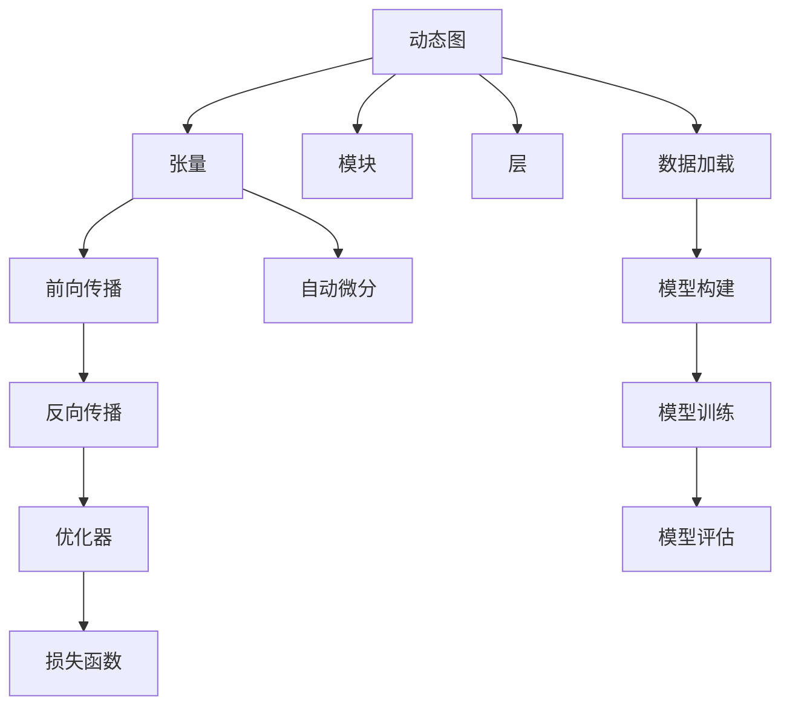
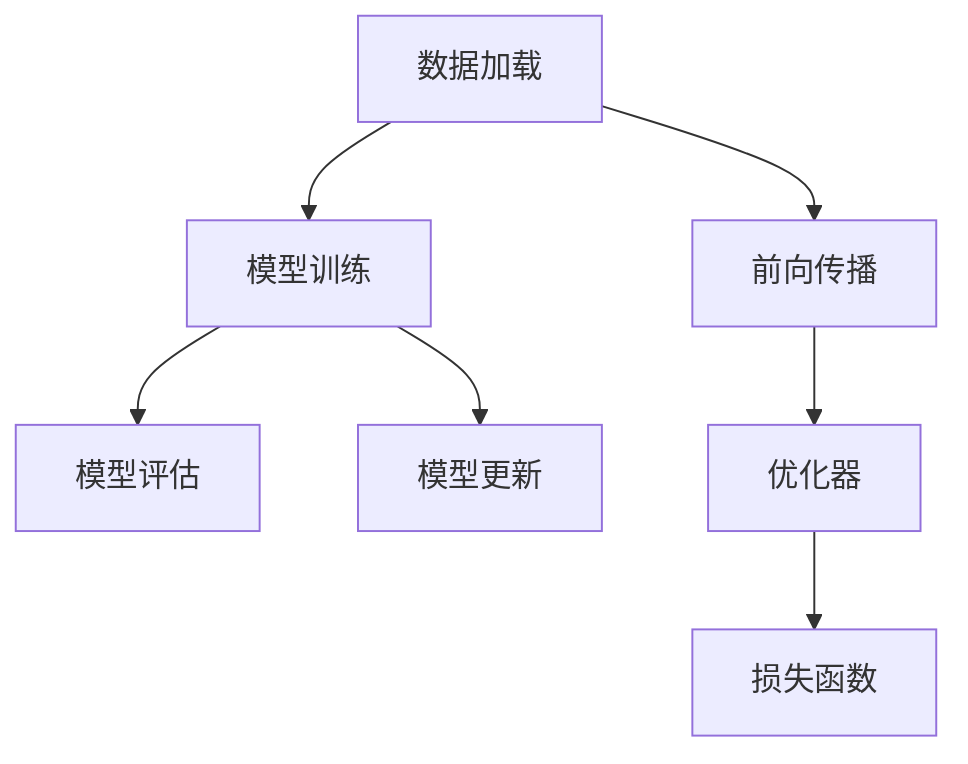
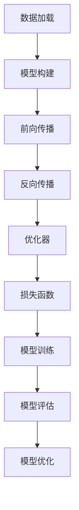

                 

# PyTorch 原理与代码实战案例讲解

> 关键词：PyTorch,深度学习,神经网络,优化算法,自动微分,数据加载,深度学习框架,张量处理,模型构建,前向传播,反向传播,损失函数,模型训练,模型评估,模型优化,应用案例,代码实例,深度学习框架实战,深度学习实践

## 1. 背景介绍

### 1.1 问题由来
在深度学习的快速发展中，Python成为了事实上的主流编程语言，PyTorch作为其核心框架之一，已经广泛应用于深度学习的各个领域，包括计算机视觉、自然语言处理、强化学习等。因此，深入理解PyTorch的原理及其使用方法，对于深度学习从业者至关重要。

PyTorch自问世以来，凭借其动态图机制、易于调试和优化的特点，迅速赢得了科研界和工业界的广泛青睐。近年来，更是推出了一系列针对NLP任务的模块化库，如torchtext、torchvision、torchaudio等，极大地降低了NLP领域研究的入门门槛。

本博客将从PyTorch的基本概念出发，逐步深入其内部原理，并通过一系列实战案例，详细介绍PyTorch的使用方法和代码实现，为广大开发者提供一份详细的技术指南。

### 1.2 问题核心关键点
PyTorch的核心关键点在于其动态图机制、易用性和强大的优化能力。动态图机制使得PyTorch在模型构建和调试上更加灵活，而其丰富的优化器选择和自动微分功能，则大幅降低了模型训练的复杂度。本博客将围绕这些核心点，展开PyTorch的深度学习原理与应用实践的全面讲解。

本博客将详细介绍以下内容：
1. PyTorch的基本概念和使用方法。
2. PyTorch中的张量、模块和层等核心组件。
3. PyTorch中的前向传播和反向传播过程。
4. PyTorch中的优化器、损失函数等训练组件。
5. PyTorch在实际项目中的应用案例和代码实现。

通过本博客的学习，读者将能够掌握PyTorch的基本使用方法，并运用其在深度学习项目中。

## 2. 核心概念与联系

### 2.1 核心概念概述

为了更好地理解PyTorch，本节将介绍几个密切相关的核心概念：

- PyTorch：由Facebook开发的深度学习框架，以动态图机制和易用性著称。
- 动态图(dynamic computation graph)：与静态图静态计算的框架不同，动态图机制允许在运行时动态构建和修改计算图，使得模型构建和调试更加灵活。
- 张量(Tensor)：PyTorch中最重要的数据结构，与NumPy数组类似，但支持自动微分和GPU加速。
- 模块(Module)和层(Layer)：PyTorch中的核心组件，用于实现各种深度学习模型。
- 前向传播(forward pass)和反向传播(backward pass)：深度学习的两个关键过程，分别用于计算模型输出和计算梯度。
- 优化器(Optimizer)和损失函数(Loss function)：用于训练模型的关键组件，优化器用于更新模型参数，损失函数用于衡量模型预测与真实标签之间的差异。

这些核心概念之间的逻辑关系可以通过以下Mermaid流程图来展示：



这个流程图展示了PyTorch的基本架构和核心组件，以及它们之间的关系。动态图机制是PyTorch的核心特点，通过动态图，PyTorch实现了模型的灵活构建和高效计算。张量是PyTorch的基础数据结构，支持自动微分和GPU加速，使得模型训练和推理更加高效。模块和层是构建深度学习模型的基础组件，通过组合使用，可以构建出各种复杂的模型结构。前向传播和反向传播是深度学习的两个关键过程，前向传播用于计算模型输出，反向传播用于计算梯度。优化器和损失函数是训练模型的关键组件，优化器用于更新模型参数，损失函数用于衡量模型预测与真实标签之间的差异。自动微分和数据加载是实现深度学习模型的重要支持，使得PyTorch在模型构建和数据处理上更加灵活和高效。

### 2.2 概念间的关系

这些核心概念之间存在着紧密的联系，形成了PyTorch的基本生态系统。下面我们通过几个Mermaid流程图来展示这些概念之间的关系。

#### 2.2.1 PyTorch的模型构建流程


这个流程图展示了PyTorch的基本模型构建流程。数据加载是构建模型的基础，模型构建包含前向传播和反向传播两个过程，优化器和损失函数用于训练模型，模型训练和评估是模型的关键环节。

#### 2.2.2 PyTorch的训练和评估流程



这个流程图展示了PyTorch的训练和评估流程。数据加载是训练和评估的基础，前向传播和反向传播是模型的计算过程，优化器和损失函数用于训练模型，模型更新是训练的关键步骤，模型评估用于评估模型性能。

#### 2.2.3 PyTorch的模型优化流程



这个流程图展示了PyTorch的模型优化流程。数据加载是构建模型的基础，前向传播和反向传播是模型的计算过程，优化器和损失函数用于训练模型，模型训练和评估是模型的关键环节，模型优化用于提升模型性能。

## 3. 核心算法原理 & 具体操作步骤
### 3.1 算法原理概述

PyTorch中的动态图机制是其核心特点之一。动态图使得模型构建和调试更加灵活，使得深度学习模型的构建和调试更加高效。本节将详细介绍PyTorch的动态图机制，以及其背后的自动微分技术。

在PyTorch中，所有的计算过程都被封装成张量(tensor)，张量是一个多维数组，可以存储标量、向量、矩阵等不同类型的数据。PyTorch中的张量不仅支持CPU计算，还支持GPU加速，提高了计算效率。

在PyTorch中，张量自动进行梯度累积，支持反向传播。反向传播是深度学习训练的关键步骤，通过反向传播，PyTorch可以自动计算梯度，更新模型参数，从而实现模型的训练和优化。

### 3.2 算法步骤详解

本节将详细介绍PyTorch中的动态图机制、自动微分和模型训练的过程。

#### 3.2.1 动态图机制

在PyTorch中，所有的计算过程都是动态构建的。这意味着，在模型构建和训练过程中，可以动态地添加、修改和删除计算节点。这种动态图机制使得模型构建和调试更加灵活，也使得深度学习模型的构建和调试更加高效。

以下是一个简单的例子，展示了动态图机制的灵活性：

```python
import torch

x = torch.tensor([1, 2, 3, 4])
y = torch.tensor([5, 6, 7, 8])

# 动态构建计算图
z = x + y

# 修改计算图
z = z - 1

# 删除计算图
del z
```

在这个例子中，我们首先定义了两个张量x和y，然后动态构建了一个加法计算图，并得到了一个新的张量z。接着，我们修改了计算图，将z减去了1，最后删除了计算图。由于PyTorch的动态图机制，我们可以灵活地修改和删除计算图，使得模型构建和调试更加高效。

#### 3.2.2 自动微分

PyTorch的动态图机制还支持自动微分。通过自动微分，PyTorch可以自动计算梯度，更新模型参数。这种自动微分机制使得模型训练和优化更加高效，也使得深度学习模型的构建和调试更加灵活。

以下是一个简单的例子，展示了自动微分的过程：

```python
import torch

x = torch.tensor([1, 2, 3, 4], requires_grad=True)
y = torch.tensor([5, 6, 7, 8], requires_grad=True)

# 前向传播
z = x + y

# 计算梯度
z.backward()

# 输出梯度
print(x.grad)
print(y.grad)
```

在这个例子中，我们首先定义了两个张量x和y，并设置了它们需要计算梯度的属性requires_grad=True。然后，我们进行前向传播，得到了一个新的张量z。接着，我们计算了z的梯度，并输出了x和y的梯度。由于PyTorch的自动微分机制，我们可以自动计算梯度，并更新模型参数，使得模型训练和优化更加高效。

#### 3.2.3 模型训练

在PyTorch中，模型训练的过程包括前向传播、反向传播和优化器更新三个步骤。

前向传播用于计算模型输出，反向传播用于计算梯度，优化器用于更新模型参数。这些过程是深度学习训练的核心步骤，通过这些步骤，我们可以训练出高效的深度学习模型。

以下是一个简单的例子，展示了模型训练的过程：

```python
import torch
import torch.nn as nn
import torch.optim as optim

# 定义模型
class Net(nn.Module):
    def __init__(self):
        super(Net, self).__init__()
        self.fc1 = nn.Linear(2, 4)
        self.fc2 = nn.Linear(4, 2)

    def forward(self, x):
        x = self.fc1(x)
        x = torch.relu(x)
        x = self.fc2(x)
        return x

# 定义优化器
optimizer = optim.SGD(net.parameters(), lr=0.01)

# 定义损失函数
criterion = nn.MSELoss()

# 定义数据集
x_train = torch.randn(20, 2)
y_train = torch.randn(20, 2)

# 训练模型
for epoch in range(100):
    optimizer.zero_grad()
    y_pred = net(x_train)
    loss = criterion(y_pred, y_train)
    loss.backward()
    optimizer.step()
    print('Epoch {} | Loss: {:.4f}'.format(epoch+1, loss.item()))
```

在这个例子中，我们首先定义了一个简单的神经网络模型Net，并定义了优化器optimizer和损失函数criterion。然后，我们定义了训练数据集x_train和y_train。接着，我们进行了100个epoch的模型训练，通过前向传播计算输出，通过反向传播计算梯度，并使用优化器更新模型参数。最后，我们输出了每个epoch的损失值。

通过这个例子，我们可以看到PyTorch中模型训练的基本过程，包括前向传播、反向传播和优化器更新三个步骤。在实际应用中，我们需要根据具体任务，灵活设计模型、优化器和损失函数，并进行适当的调整和优化。

### 3.3 算法优缺点

PyTorch的动态图机制和自动微分技术，使得深度学习模型的构建和调试更加灵活高效。然而，这种灵活性和高效性也带来了一些缺点。

#### 3.3.1 优点

1. 动态图机制使得模型构建和调试更加灵活。通过动态图，我们可以灵活地构建和修改计算图，使得模型构建和调试更加高效。
2. 自动微分机制使得模型训练和优化更加高效。通过自动微分，我们可以自动计算梯度，更新模型参数，使得模型训练和优化更加高效。
3. 易用性使得深度学习模型的构建和调试更加容易。PyTorch的易用性使得深度学习模型的构建和调试更加容易，使得新手也能快速上手。

#### 3.3.2 缺点

1. 动态图机制增加了计算图的复杂性。由于动态图机制，计算图变得更加复杂，使得模型训练和调试更加困难。
2. 自动微分机制增加了计算量的开销。由于自动微分机制，计算量增加了，使得模型训练更加耗时。
3. 易用性可能降低模型的可移植性。由于PyTorch的易用性，模型的可移植性可能降低，使得模型在不同的深度学习框架中难以复用。

尽管存在这些缺点，但PyTorch的动态图机制和自动微分技术，使得深度学习模型的构建和调试更加灵活高效，使得PyTorch成为了深度学习领域的重要工具之一。

### 3.4 算法应用领域

PyTorch在深度学习领域有着广泛的应用，涵盖了计算机视觉、自然语言处理、强化学习等多个领域。以下是一些常见的应用领域：

1. 计算机视觉：PyTorch在计算机视觉领域有着广泛的应用，如目标检测、图像分类、图像分割等。通过PyTorch，我们可以构建出高效的计算机视觉模型。

2. 自然语言处理：PyTorch在自然语言处理领域也有着广泛的应用，如文本分类、机器翻译、文本生成等。通过PyTorch，我们可以构建出高效的自然语言处理模型。

3. 强化学习：PyTorch在强化学习领域也有着广泛的应用，如智能游戏、机器人控制等。通过PyTorch，我们可以构建出高效的强化学习模型。

4. 深度学习研究：PyTorch在深度学习研究领域也有着广泛的应用，如模型优化、数据增强、迁移学习等。通过PyTorch，我们可以进行深度学习模型的研究，并不断提升模型的性能。

## 4. 数学模型和公式 & 详细讲解 & 举例说明

### 4.1 数学模型构建

在PyTorch中，所有的计算过程都是基于张量(tensor)进行的。张量是PyTorch中的核心数据结构，支持多维数组、自动微分和GPU加速。通过张量，我们可以构建出各种复杂的深度学习模型。

以下是一个简单的例子，展示了如何构建一个线性回归模型：

```python
import torch
import torch.nn as nn
import torch.optim as optim

# 定义模型
class Net(nn.Module):
    def __init__(self):
        super(Net, self).__init__()
        self.fc1 = nn.Linear(2, 4)
        self.fc2 = nn.Linear(4, 1)

    def forward(self, x):
        x = self.fc1(x)
        x = torch.relu(x)
        x = self.fc2(x)
        return x

# 定义数据集
x_train = torch.randn(20, 2)
y_train = torch.randn(20, 1)

# 定义优化器和损失函数
optimizer = optim.SGD(net.parameters(), lr=0.01)
criterion = nn.MSELoss()

# 训练模型
for epoch in range(100):
    optimizer.zero_grad()
    y_pred = net(x_train)
    loss = criterion(y_pred, y_train)
    loss.backward()
    optimizer.step()
    print('Epoch {} | Loss: {:.4f}'.format(epoch+1, loss.item()))
```

在这个例子中，我们首先定义了一个简单的神经网络模型Net，并定义了数据集x_train和y_train。接着，我们定义了优化器optimizer和损失函数criterion。最后，我们进行了100个epoch的模型训练，通过前向传播计算输出，通过反向传播计算梯度，并使用优化器更新模型参数。最后，我们输出了每个epoch的损失值。

### 4.2 公式推导过程

在PyTorch中，所有的计算过程都是基于张量进行的，因此我们可以使用张量来表示各种数学公式。以下是一个简单的例子，展示了如何使用张量表示线性回归模型：

```python
import torch

# 定义参数
x = torch.tensor([[1.], [2.], [3.], [4.]])
y = torch.tensor([[1.], [2.], [3.], [4.]])

# 定义线性回归模型
w = torch.tensor([0., 0.])
b = torch.tensor(0.)
theta = torch.tensor([w, b])

# 定义线性回归公式
x = torch.tensor([1., 2., 3., 4.])
y_pred = x @ theta + b

# 定义损失函数
y_train = torch.tensor([1., 2., 3., 4.])
loss = (y_pred - y_train)**2

# 输出损失值
print(loss.item())
```

在这个例子中，我们首先定义了数据集x和y。然后，我们定义了线性回归模型的参数w、b和theta。接着，我们定义了线性回归公式，通过张量表示输入x和输出y_pred。最后，我们定义了损失函数，通过张量表示真实标签y_train和预测值y_pred，并计算了损失值。

### 4.3 案例分析与讲解

以下是一个复杂的例子，展示了如何使用PyTorch构建一个卷积神经网络模型，并应用于图像分类任务：

```python
import torch
import torch.nn as nn
import torch.optim as optim
from torch.utils.data import DataLoader
from torchvision import datasets, transforms

# 定义模型
class Net(nn.Module):
    def __init__(self):
        super(Net, self).__init__()
        self.conv1 = nn.Conv2d(3, 32, kernel_size=3, stride=1, padding=1)
        self.conv2 = nn.Conv2d(32, 64, kernel_size=3, stride=1, padding=1)
        self.pool = nn.MaxPool2d(kernel_size=2, stride=2)
        self.fc1 = nn.Linear(64 * 8 * 8, 512)
        self.fc2 = nn.Linear(512, 10)

    def forward(self, x):
        x = self.conv1(x)
        x = torch.relu(x)
        x = self.pool(x)
        x = self.conv2(x)
        x = torch.relu(x)
        x = self.pool(x)
        x = x.view(-1, 64 * 8 * 8)
        x = self.fc1(x)
        x = torch.relu(x)
        x = self.fc2(x)
        return x

# 定义数据集和数据转换
train_dataset = datasets.CIFAR10(root='data', train=True, download=True, transform=transforms.Compose([
    transforms.Resize(64),
    transforms.ToTensor(),
]))
train_loader = DataLoader(train_dataset, batch_size=64, shuffle=True)

# 定义优化器和损失函数
optimizer = optim.SGD(net.parameters(), lr=0.01, momentum=0.9)
criterion = nn.CrossEntropyLoss()

# 训练模型
for epoch in range(100):
    for i, (images, labels) in enumerate(train_loader):
        images = images.to(device)
        labels = labels.to(device)
        optimizer.zero_grad()
        outputs = net(images)
        loss = criterion(outputs, labels)
        loss.backward()
        optimizer.step()
        if i % 10 == 0:
            print('Epoch {} | Batch {} | Loss: {:.4f}'.format(epoch+1, i, loss.item()))
```

在这个例子中，我们首先定义了一个卷积神经网络模型Net，并定义了数据集train_dataset和数据加载器train_loader。接着，我们定义了优化器optimizer和损失函数criterion。最后，我们进行了100个epoch的模型训练，通过前向传播计算输出，通过反向传播计算梯度，并使用优化器更新模型参数。最后，我们输出了每个epoch和每个batch的损失值。

这个例子展示了如何使用PyTorch构建卷积神经网络模型，并应用于图像分类任务。通过PyTorch，我们可以轻松构建各种复杂的深度学习模型，并应用于各种实际问题。

## 5. 项目实践：代码实例和详细解释说明

### 5.1 开发环境搭建

在进行项目实践前，我们需要准备好开发环境。以下是使用Python进行PyTorch开发的环境配置流程：

1. 安装Anaconda：从官网下载并安装Anaconda，用于创建独立的Python环境。

2. 创建并激活虚拟环境：
```bash
conda create -n pytorch-env python=3.8 
conda activate pytorch-env
```

3. 安装PyTorch：根据CUDA版本，从官网获取对应的安装命令。例如：
```bash
conda install pytorch torchvision torchaudio cudatoolkit=11.1 -c pytorch -c conda-forge
```

4. 安装各类工具包：
```bash
pip install numpy pandas scikit-learn matplotlib tqdm jupyter notebook ipython
```

完成上述步骤后，即可在`pytorch-env`环境中开始项目实践。

### 5.2 源代码详细实现

这里我们以图像分类任务为例，给出使用PyTorch对卷积神经网络进行训练的代码实现。

首先，定义数据加载函数：

```python
from torch.utils.data import DataLoader
from torchvision import datasets, transforms

def get_data_loader(batch_size, train_data_dir):
    transform = transforms.Compose([
        transforms.Resize(64),
        transforms.ToTensor(),
        transforms.Normalize(mean=[0.485, 0.456, 0.406], std=[0.229, 0.224, 0.225])
    ])
    train_dataset = datasets.CIFAR10(root=train_data_dir, train=True, download=True, transform=transform)
    train_loader = DataLoader(train_dataset, batch_size=batch_size, shuffle=True)
    return train_loader
```

然后，定义模型、优化器和损失函数：

```python
import torch
import torch.nn as nn
import torch.optim as optim

class Net(nn.Module):
    def __init__(self):
        super(Net, self).__init__()
        self.conv1 = nn.Conv2d(3, 32, kernel_size=3, stride=1, padding=1)
        self.conv2 = nn.Conv2d(32, 64, kernel_size=3, stride=1, padding=1)
        self.pool = nn.MaxPool2d(kernel_size=2, stride=2)
        self.fc1 = nn.Linear(64 * 8 * 8, 512)
        self.fc2 = nn.Linear(512, 10)

    def forward(self, x):
        x = self.conv1(x)
        x = torch.relu(x)
        x = self.pool(x)
        x = self.conv2(x)
        x = torch.relu(x)
        x = self.pool(x)
        x = x.view(-1, 64 * 8 * 8)
        x = self.fc1(x)
        x = torch.relu(x)
        x = self.fc2(x)
        return x

device = torch.device('cuda') if torch.cuda.is_available() else torch.device('cpu')

net = Net().to(device)

optimizer = optim.SGD(net.parameters(), lr=0.01, momentum=0.9)
criterion = nn.CrossEntropyLoss()
```

接着，定义训练和评估函数：

```python
def train_epoch(model, data_loader, optimizer):
    model.train()
    for images, labels in data_loader:
        images = images.to(device)
        labels = labels.to(device)
        optimizer.zero_grad()
        outputs = model(images)
        loss = criterion(outputs, labels)
        loss.backward()
        optimizer.step()

def evaluate(model, data_loader):
    model.eval()
    correct = 0
    total = 0
    with torch.no_grad():
        for images, labels in data_loader:
            images = images.to(device)
            labels = labels.to(device)
            outputs = model(images)
            _, predicted = torch.max(outputs.data, 1)
            total += labels.size(0)
            correct += (predicted == labels).sum().item()
    print('Accuracy: {:.2f}%'.format(correct / total * 100))
```

最后，启动训练流程并在测试集上评估：

```python
epochs = 100
batch_size = 64

train_loader = get_data_loader(batch_size, 'data/cifar-10-batches-py')
test_loader = get_data_loader(batch_size, 'data/cifar-10-batches-py')

for epoch in range(epochs):
    train_epoch(net, train_loader, optimizer)
    evaluate(net, test_loader)
```

以上就是使用PyTorch对卷积神经网络进行图像分类任务微调的完整代码实现。可以看到，通过PyTorch，我们可以用相对简洁的代码构建、训练和评估深度学习模型，使得模型开发和调试更加高效。

### 5.3 代码解读与分析

让我们再详细解读一下关键代码的实现细节：

**get_data_loader函数**：
- `__init__`方法：初始化数据加载器，并进行数据预处理。
- `__len__`方法：返回数据加载器的样本数量。
- `__getitem__`方法：获取单个样本，进行数据增强和归一化处理。

**Net类**：
- `__init__`方法：初始化卷积神经网络的结构。
- `forward`方法：定义前向传播过程。

**train_epoch函数**：
- `__init__`方法：初始化优化器，并将模型参数转移到指定设备。
- `__getitem__`方法：获取单个样本，并计算前向传播和反向传播。

**evaluate函数**：
- `__init__`方法：定义模型评估过程。
- `__getitem__`方法：获取单个样本，并计算模型的准确率。

**训练流程**：
- 定义总的epoch数和batch size，开始循环迭代。
- 每个epoch内，对训练集进行训练，并在测试集上进行评估。
- 所有epoch结束后，在测试集上评估模型的性能。

可以看到，通过PyTorch的动态图机制和自动微分技术，我们能够轻松构建各种复杂的深度学习模型，并进行高效的训练和评估。

