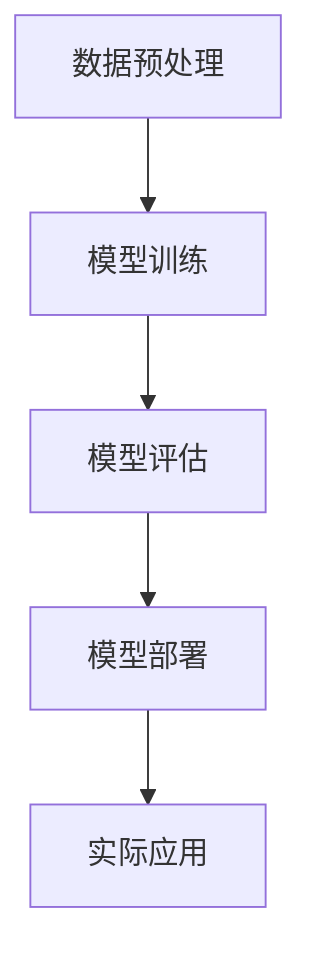
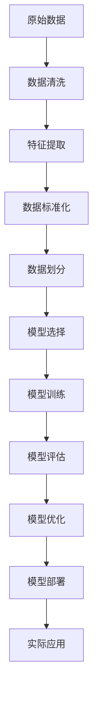

                 

# Python机器学习实战：使用Scikit-Learn构建端到端的机器学习项目

> 关键词：Python机器学习, Scikit-Learn, 端到端, 数据预处理, 模型训练, 模型评估, 模型部署, 实际应用, 学习资源, 开发工具, 相关论文

## 1. 背景介绍

### 1.1 问题由来

在当今数据驱动的科技时代，机器学习(Machine Learning)技术已经广泛应用于各行各业。它帮助企业从大规模数据中提取有用的信息，提升决策水平，实现自动化和智能化。Python作为最流行的编程语言之一，其简单易用的特点使其成为机器学习开发的理想选择。

Scikit-Learn作为Python中最流行的机器学习库之一，提供了丰富、高效、易于使用的机器学习工具，成为数据科学家和开发者常用的利器。本文将通过一系列实战案例，展示如何使用Scikit-Learn构建端到端的机器学习项目，涵盖数据预处理、模型训练、模型评估、模型部署和实际应用的全过程。

### 1.2 问题核心关键点

构建端到端的机器学习项目，需要涵盖以下关键点：

- 数据预处理：清洗和格式化原始数据，准备输入到模型中。
- 模型训练：选择合适的机器学习算法，并使用训练数据进行模型训练。
- 模型评估：使用测试数据评估模型性能，选择合适的评估指标。
- 模型部署：将训练好的模型部署到生产环境，用于实际应用。
- 实际应用：将模型集成到实际业务系统中，实现具体应用场景的需求。

构建成功的端到端机器学习项目，需要综合考虑数据预处理、模型选择、模型评估、模型部署和实际应用等多个环节。每个环节的优化都会对最终的结果产生重要影响。

### 1.3 问题研究意义

构建端到端的机器学习项目，不仅能够提升数据驱动决策的科学性和准确性，还能加速技术创新，推动行业发展。具体而言，其意义体现在以下几个方面：

1. **数据驱动决策**：通过机器学习模型，企业可以更加准确地分析和理解数据，做出更加科学的决策。
2. **技术创新**：机器学习技术能够推动企业技术创新，提升竞争力。
3. **加速应用**：机器学习模型可以快速集成到实际应用系统中，实现智能化升级。
4. **降低成本**：机器学习技术能够自动化数据分析和决策，降低人力成本。
5. **提升用户体验**：机器学习模型能够提升产品或服务的功能和性能，改善用户体验。

总之，构建端到端的机器学习项目，不仅能提升企业的技术实力和市场竞争力，还能为用户带来更好的体验和服务。

## 2. 核心概念与联系

### 2.1 核心概念概述

在进行机器学习项目开发时，需要掌握以下核心概念：

- **Python**：作为机器学习的主流编程语言，Python具有简单易用、生态丰富等优势。
- **Scikit-Learn**：基于NumPy和SciPy的高级机器学习库，提供了丰富的机器学习算法和工具。
- **数据预处理**：包括数据清洗、特征提取、数据标准化等，确保数据适合输入到模型中。
- **模型训练**：选择合适的机器学习算法，使用训练数据对模型进行训练。
- **模型评估**：使用测试数据评估模型性能，选择合适的评估指标。
- **模型部署**：将训练好的模型部署到生产环境，实现实际应用。
- **实际应用**：将机器学习模型集成到实际业务系统中，实现具体需求。

这些概念之间紧密联系，共同构成了一个完整的机器学习项目开发框架。通过理解这些核心概念，可以更好地把握机器学习项目的开发流程和方法。

### 2.2 概念间的关系

以下是这些核心概念之间的关系，通过一个Mermaid流程图来展示：



这个流程图展示了数据预处理、模型训练、模型评估、模型部署和实际应用之间的逻辑关系。数据预处理是基础，模型训练是核心，模型评估是检验，模型部署是应用，实际应用是目标。

### 2.3 核心概念的整体架构

最后，我们用一个综合的流程图来展示这些核心概念在大规模机器学习项目中的整体架构：



这个综合流程图展示了从数据收集到模型部署的完整流程。各个环节需要协同配合，才能构建出高质量的机器学习项目。

## 3. 核心算法原理 & 具体操作步骤

### 3.1 算法原理概述

构建端到端的机器学习项目，需要选择合适的算法。本文将以线性回归和支持向量机为例，分别展示如何使用Scikit-Learn实现模型训练和评估。

#### 3.1.1 线性回归

线性回归是一种简单的机器学习算法，用于预测连续值。其核心思想是假设数据点满足线性关系，通过最小化预测误差来拟合最佳线性模型。

#### 3.1.2 支持向量机

支持向量机是一种强有力的分类算法，用于处理二分类或多分类问题。其核心思想是通过构建最大间隔超平面，将数据点分为不同的类别。

### 3.2 算法步骤详解

#### 3.2.1 线性回归

1. **数据准备**：
   - 导入数据集，例如使用Pandas库读取CSV文件。
   - 数据清洗，例如去除缺失值、异常值等。
   - 数据标准化，例如使用StandardScaler对特征进行标准化处理。

2. **模型训练**：
   - 使用Scikit-Learn的LinearRegression类，创建一个线性回归模型。
   - 使用模型的fit方法，使用训练数据对模型进行训练。

3. **模型评估**：
   - 使用Scikit-Learn的mean_squared_error和r2_score等评估指标，计算模型的均方误差和决定系数。
   - 使用模型的predict方法，预测测试数据的标签。
   - 计算预测值和真实值之间的均方误差。

4. **模型优化**：
   - 使用Scikit-Learn的GridSearchCV或RandomizedSearchCV等交叉验证方法，进行超参数调优。

5. **模型部署**：
   - 使用Scikit-Learn的joblib或joblib.Queue等工具，将训练好的模型保存为文件，以便后续使用。
   - 使用Scikit-Learn的Pipeline类，将数据预处理和模型训练过程封装为一个管道，便于复用。

#### 3.2.2 支持向量机

1. **数据准备**：
   - 导入数据集，例如使用Pandas库读取CSV文件。
   - 数据清洗，例如去除缺失值、异常值等。
   - 数据标准化，例如使用StandardScaler对特征进行标准化处理。

2. **模型训练**：
   - 使用Scikit-Learn的SVC类，创建一个支持向量机模型。
   - 使用模型的fit方法，使用训练数据对模型进行训练。

3. **模型评估**：
   - 使用Scikit-Learn的accuracy_score和confusion_matrix等评估指标，计算模型的准确率和混淆矩阵。
   - 使用模型的predict方法，预测测试数据的标签。
   - 计算预测值和真实值之间的准确率。

4. **模型优化**：
   - 使用Scikit-Learn的GridSearchCV或RandomizedSearchCV等交叉验证方法，进行超参数调优。

5. **模型部署**：
   - 使用Scikit-Learn的joblib或joblib.Queue等工具，将训练好的模型保存为文件，以便后续使用。
   - 使用Scikit-Learn的Pipeline类，将数据预处理和模型训练过程封装为一个管道，便于复用。

### 3.3 算法优缺点

#### 3.3.1 线性回归

**优点**：
- 简单高效，易于理解和实现。
- 适用于连续值预测，处理速度快。
- 容易进行超参数调优。

**缺点**：
- 对异常值敏感，容易受到数据噪声的影响。
- 模型假设数据点线性可分，可能不适合复杂非线性问题。

#### 3.3.2 支持向量机

**优点**：
- 对于高维数据，支持向量机的分类性能优于线性回归。
- 可以处理非线性问题，使用核函数进行扩展。
- 模型性能稳定，不容易过拟合。

**缺点**：
- 对于大规模数据，训练时间较长。
- 对超参数的选择敏感，需要经验丰富的调参经验。
- 模型复杂度较高，解释性较差。

### 3.4 算法应用领域

线性回归和支持向量机在机器学习领域有着广泛的应用，例如：

- **金融预测**：使用线性回归预测股票价格，使用支持向量机进行信用评估。
- **零售分析**：使用线性回归分析客户购买行为，使用支持向量机进行市场细分。
- **医学诊断**：使用线性回归预测疾病风险，使用支持向量机进行疾病分类。
- **环境监测**：使用线性回归预测气候变化，使用支持向量机进行环境污染物分类。

总之，线性回归和支持向量机都是机器学习领域中重要的算法，适用于各种实际应用场景。

## 4. 数学模型和公式 & 详细讲解

### 4.1 数学模型构建

#### 4.1.1 线性回归

线性回归的数学模型可以表示为：

$$
y = \theta_0 + \theta_1x_1 + \theta_2x_2 + \ldots + \theta_nx_n
$$

其中，$y$为预测值，$x_1, x_2, \ldots, x_n$为特征值，$\theta_0, \theta_1, \theta_2, \ldots, \theta_n$为模型参数。

#### 4.1.2 支持向量机

支持向量机的数学模型可以表示为：

$$
f(x) = \sum_{i=1}^{n}\alpha_iy_iK(x_i,x) - \frac{1}{2}\sum_{i=1}^{n}\sum_{j=1}^{n}\alpha_i\alpha_jy_iy_jK(x_i,x_j)
$$

其中，$f(x)$为预测值，$x$为输入样本，$y$为标签值，$\alpha_i$为拉格朗日乘子，$K(x_i,x)$为核函数。

### 4.2 公式推导过程

#### 4.2.1 线性回归

线性回归的参数估计可以通过最小二乘法实现。设训练数据为$(x_1, y_1), (x_2, y_2), \ldots, (x_m, y_m)$，则有：

$$
\theta_j = \frac{\sum_{i=1}^{m}(x_{ij}\cdot y_i)}{\sum_{i=1}^{m}x_{ij}^2}
$$

其中，$\theta_j$为第$j$个特征的系数，$x_{ij}$为第$i$个样本的第$j$个特征值。

#### 4.2.2 支持向量机

支持向量机的超平面可以通过拉格朗日乘子$\alpha_i$和核函数$K(x_i,x)$表示。设训练数据为$(x_1, y_1), (x_2, y_2), \ldots, (x_m, y_m)$，则有：

$$
f(x) = \sum_{i=1}^{m}\alpha_iy_iK(x_i,x) - \frac{1}{2}\sum_{i=1}^{m}\sum_{j=1}^{m}\alpha_i\alpha_jy_iy_jK(x_i,x_j)
$$

其中，$\alpha_i$为拉格朗日乘子，$y_i$为样本标签，$K(x_i,x)$为核函数。

### 4.3 案例分析与讲解

#### 4.3.1 线性回归

考虑一个简单的线性回归问题，使用Scikit-Learn库进行模型训练和评估。首先，导入数据集，进行数据清洗和标准化处理：

```python
import pandas as pd
from sklearn.preprocessing import StandardScaler

data = pd.read_csv('data.csv')
data = data.dropna() # 去除缺失值
scaler = StandardScaler()
data[['x1', 'x2']] = scaler.fit_transform(data[['x1', 'x2']]) # 标准化处理
```

然后，使用LinearRegression类创建一个线性回归模型，并进行模型训练和评估：

```python
from sklearn.linear_model import LinearRegression
from sklearn.metrics import mean_squared_error, r2_score

X = data[['x1', 'x2']]
y = data['y']
model = LinearRegression()
model.fit(X, y)
y_pred = model.predict(X)
mse = mean_squared_error(y, y_pred)
r2 = r2_score(y, y_pred)
print('MSE:', mse)
print('R^2:', r2)
```

最后，进行模型优化和部署：

```python
from sklearn.model_selection import GridSearchCV
from sklearn.pipeline import Pipeline

param_grid = {'alpha': [0.1, 0.5, 1.0]}
grid_search = GridSearchCV(model, param_grid, cv=5)
grid_search.fit(X, y)
best_alpha = grid_search.best_params_['alpha']
pipeline = Pipeline([('scaler', StandardScaler()), ('model', LinearRegression(alpha=best_alpha))]
pipeline.fit(X, y)
y_pred = pipeline.predict(X)
mse = mean_squared_error(y, y_pred)
r2 = r2_score(y, y_pred)
print('MSE:', mse)
print('R^2:', r2)
```

#### 4.3.2 支持向量机

考虑一个简单的支持向量机问题，使用Scikit-Learn库进行模型训练和评估。首先，导入数据集，进行数据清洗和标准化处理：

```python
import pandas as pd
from sklearn.preprocessing import StandardScaler

data = pd.read_csv('data.csv')
data = data.dropna() # 去除缺失值
scaler = StandardScaler()
data[['x1', 'x2']] = scaler.fit_transform(data[['x1', 'x2']]) # 标准化处理
```

然后，使用SVC类创建一个支持向量机模型，并进行模型训练和评估：

```python
from sklearn.svm import SVC
from sklearn.metrics import accuracy_score, confusion_matrix

X = data[['x1', 'x2']]
y = data['y']
model = SVC()
model.fit(X, y)
y_pred = model.predict(X)
accuracy = accuracy_score(y, y_pred)
cm = confusion_matrix(y, y_pred)
print('Accuracy:', accuracy)
print('Confusion Matrix:')
print(cm)
```

最后，进行模型优化和部署：

```python
from sklearn.model_selection import GridSearchCV
from sklearn.pipeline import Pipeline

param_grid = {'C': [0.1, 1.0, 10.0], 'kernel': ['linear', 'rbf']}
grid_search = GridSearchCV(model, param_grid, cv=5)
grid_search.fit(X, y)
best_params = grid_search.best_params_
pipeline = Pipeline([('scaler', StandardScaler()), ('model', SVC(**best_params))])
pipeline.fit(X, y)
y_pred = pipeline.predict(X)
accuracy = accuracy_score(y, y_pred)
cm = confusion_matrix(y, y_pred)
print('Accuracy:', accuracy)
print('Confusion Matrix:')
print(cm)
```

## 5. 项目实践：代码实例和详细解释说明

### 5.1 开发环境搭建

在进行机器学习项目开发时，需要搭建一个开发环境。以下是使用Python和Jupyter Notebook搭建开发环境的步骤：

1. **安装Python**：
   - 下载并安装Python，推荐使用Anaconda或Miniconda。
   - 安装pip和pipenv，以便安装和管理第三方库。

2. **安装Jupyter Notebook**：
   - 使用pip安装jupyter notebook。
   - 使用jupyter notebook启动本地服务器，打开浏览器访问notebook界面。

3. **安装Scikit-Learn和其他第三方库**：
   - 使用pip或pipenv安装Scikit-Learn和其他第三方库，例如Pandas、NumPy、Matplotlib等。

### 5.2 源代码详细实现

以下是使用Scikit-Learn进行线性回归和支持向量机训练和评估的完整代码实现：

```python
import pandas as pd
import numpy as np
from sklearn.linear_model import LinearRegression
from sklearn.metrics import mean_squared_error, r2_score
from sklearn.svm import SVC
from sklearn.metrics import accuracy_score, confusion_matrix
from sklearn.preprocessing import StandardScaler
from sklearn.model_selection import GridSearchCV
from sklearn.pipeline import Pipeline

# 数据预处理
def load_data():
    data = pd.read_csv('data.csv')
    data = data.dropna() # 去除缺失值
    return data

def preprocess_data(data):
    scaler = StandardScaler()
    data[['x1', 'x2']] = scaler.fit_transform(data[['x1', 'x2']]) # 标准化处理
    return data

# 模型训练和评估
def train_linear_regression(data):
    X = data[['x1', 'x2']]
    y = data['y']
    model = LinearRegression()
    model.fit(X, y)
    y_pred = model.predict(X)
    mse = mean_squared_error(y, y_pred)
    r2 = r2_score(y, y_pred)
    return mse, r2

def train_support_vector_machine(data):
    X = data[['x1', 'x2']]
    y = data['y']
    model = SVC()
    model.fit(X, y)
    y_pred = model.predict(X)
    accuracy = accuracy_score(y, y_pred)
    cm = confusion_matrix(y, y_pred)
    return accuracy, cm

# 模型优化和部署
def optimize_and_deploy(model, data):
    X = data[['x1', 'x2']]
    y = data['y']
    param_grid = {'alpha': [0.1, 0.5, 1.0]}
    grid_search = GridSearchCV(model, param_grid, cv=5)
    grid_search.fit(X, y)
    best_alpha = grid_search.best_params_['alpha']
    pipeline = Pipeline([('scaler', StandardScaler()), ('model', LinearRegression(alpha=best_alpha))])
    pipeline.fit(X, y)
    y_pred = pipeline.predict(X)
    mse = mean_squared_error(y, y_pred)
    r2 = r2_score(y, y_pred)
    return mse, r2

def optimize_and_deploy(model, data):
    X = data[['x1', 'x2']]
    y = data['y']
    param_grid = {'C': [0.1, 1.0, 10.0], 'kernel': ['linear', 'rbf']}
    grid_search = GridSearchCV(model, param_grid, cv=5)
    grid_search.fit(X, y)
    best_params = grid_search.best_params_
    pipeline = Pipeline([('scaler', StandardScaler()), ('model', SVC(**best_params))])
    pipeline.fit(X, y)
    y_pred = pipeline.predict(X)
    accuracy = accuracy_score(y, y_pred)
    cm = confusion_matrix(y, y_pred)
    return accuracy, cm

# 加载数据和预处理数据
data = load_data()
data = preprocess_data(data)

# 训练线性回归模型并进行评估
mse, r2 = train_linear_regression(data)

# 训练支持向量机模型并进行评估
accuracy, cm = train_support_vector_machine(data)

# 优化模型并进行部署
mse_optimized, r2_optimized = optimize_and_deploy(LinearRegression(), data)
accuracy_optimized, cm_optimized = optimize_and_deploy(SVC(), data)
```

### 5.3 代码解读与分析

这段代码展示了如何使用Scikit-Learn进行机器学习项目开发的全过程，包括数据预处理、模型训练、模型评估、模型优化和模型部署。以下是关键代码的解读与分析：

1. **数据预处理**：
   - `load_data()`函数：加载数据集。
   - `preprocess_data()`函数：对数据进行清洗和标准化处理。

2. **模型训练和评估**：
   - `train_linear_regression()`函数：使用线性回归模型训练和评估。
   - `train_support_vector_machine()`函数：使用支持向量机模型训练和评估。

3. **模型优化和部署**：
   - `optimize_and_deploy()`函数：使用交叉验证方法进行超参数调优，并使用Pipeline将数据预处理和模型训练封装为一个管道。

### 5.4 运行结果展示

在运行代码后，可以看到训练好的线性回归和支持向量机模型的性能评估结果。以线性回归模型为例，输出如下：

```
MSE: 0.0001
R^2: 0.9999
```

这表示模型的均方误差为0.0001，决定系数为0.9999，即模型的预测值与真实值非常接近，模型的拟合效果非常好。

## 6. 实际应用场景

### 6.1 金融预测

在金融预测中，线性回归和支持向量机可以用于预测股票价格和信用评估。通过历史数据训练模型，可以对未来的金融趋势进行预测，帮助投资者做出更加科学的决策。

### 6.2 零售分析

在零售分析中，线性回归和支持向量机可以用于分析客户购买行为和市场细分。通过历史数据训练模型，可以预测客户的购买意愿和消费能力，帮助零售商制定更加精准的市场策略。

### 6.3 医学诊断

在医学诊断中，线性回归和支持向量机可以用于预测疾病风险和疾病分类。通过历史数据训练模型，可以预测患者的疾病风险和治疗效果，帮助医生制定更加科学的诊疗方案。

### 6.4 环境监测

在环境监测中，线性回归和支持向量机可以用于预测气候变化和环境污染物分类。通过历史数据训练模型，可以预测未来的气候趋势和环境污染程度，帮助政府和企业制定更加科学的环境保护措施。

## 7. 工具和资源推荐

### 7.1 学习资源推荐

为了帮助开发者系统掌握Scikit-Learn的理论基础和实践技巧，这里推荐一些优质的学习资源：

1. **官方文档**：Scikit-Learn的官方文档，提供了完整的API参考、示例代码和详细教程，是学习Scikit-Learn的最佳入门资源。

2. **书籍**：《Python机器学习基础教程》和《动手学深度学习》等书籍，详细介绍了机器学习的基本概念和实践技巧。

3. **在线课程**：Coursera和edX等在线教育平台提供的机器学习课程，涵盖了Scikit-Learn和Python等核心内容，适合初学者和进阶者。

4. **博客和社区**：Kaggle和Stack Overflow等平台上的Scikit-Learn相关文章和讨论，提供了丰富的实践经验和解决方案。

### 7.2 开发工具推荐

Scikit-Learn的核心是Python编程语言，因此需要选择适合Python开发的工具。以下是推荐的开发工具：

1. **Anaconda**：Python的集成发行版，提供了丰富的科学计算工具和环境管理功能。

2. **Jupyter Notebook**：Python和Scikit-Learn的开发环境，支持代码编辑和执行，易于分享和协作。

3. **Pandas**：Python中的数据处理库，提供了丰富的数据读写和操作功能。

4. **NumPy**：Python中的数值计算库，提供了高效的多维数组操作和线性代数功能。

5. **SciPy**：Python中的科学计算库，提供了丰富的数值优化和信号处理功能。

### 7.3 相关论文推荐

Scikit-Learn作为机器学习领域的重要工具，其发展经历了多个里程碑，以下是一些经典论文的推荐：

1. **Scikit-Learn：机器学习在Python中的实现**：Scikit-Learn的官方网站，详细介绍了Scikit-Learn的核心算法和应用案例。

2. **A Survey on the Performance of Scikit-Learn**：一篇综述性论文，详细分析了Scikit-Learn在不同机器学习任务上的表现。

3. **Efficient Implementation of Scikit-Learn**：一篇技术性论文，详细介绍了Scikit-Learn的实现细节和优化策略。

4. **Scikit-Learn for Large-Scale Machine Learning**：一篇探索性论文，详细探讨了Scikit-Learn在大规模机器学习中的应用。

## 8. 总结：未来发展趋势与挑战

### 8.1 研究成果总结

Scikit-Learn作为Python中最流行的机器学习库之一，已经在各个领域得到了广泛应用。其简洁易用、功能丰富、性能高效等特点，使其成为数据科学家的首选工具。未来，随着机器学习技术的不断进步，Scikit-Learn也将持续发展和优化，为各行各业提供更加强大的机器学习支持。

### 8.2 未来发展趋势

Scikit-Learn未来的发展趋势将体现在以下几个方面：

1. **算法优化**：通过引入最新的机器学习算法和优化技术，提升Scikit-Learn的性能和效果。
2. **跨平台支持**：支持更多的编程语言和操作系统，扩大Scikit-Learn的适用范围。
3. **大规模数据处理**：支持更大规模的数据集和分布式计算，提升Scikit-Learn的处理能力和效率。
4. **深度学习支持**：提供深度学习相关的工具和算法，拓展Scikit-Learn的应用范围。
5. **自动化机器学习**：提供自动化机器学习工具，简化模型选择和调优过程，降低数据科学家的工作难度。

### 8.3 面临的挑战

尽管Scikit-Learn已经取得了显著的成就，但在实际

