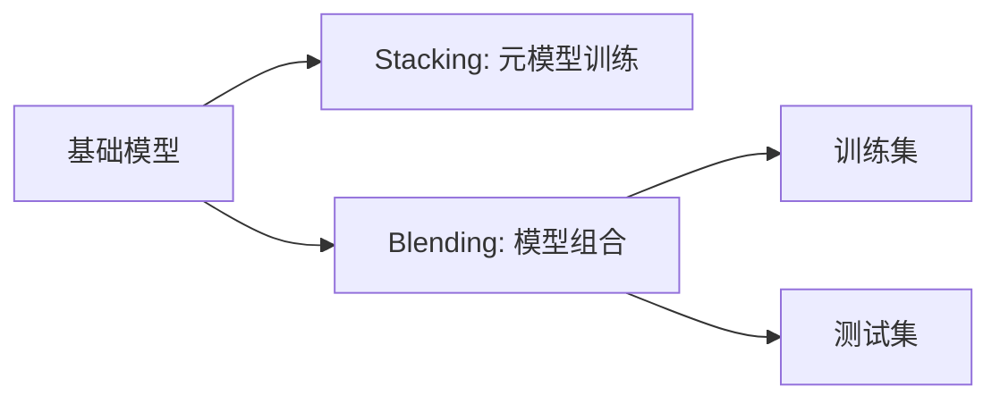

                 

# Python机器学习实战：使用Stacking和Blending集成方法提高模型性能

> 关键词：机器学习,集成方法,模型性能,Stacking,Blending,特征融合

## 1. 背景介绍

在机器学习领域，模型性能的提升一直是一个核心目标。尽管单个模型的精度可能已经非常高，但将其与其他模型结合起来，可以进一步提高整体的泛化能力和稳定性。这就是集成学习的精髓所在。本文将深入探讨两种常用的集成方法：Stacking和Blending，并给出代码实例和详细解释说明，帮助读者理解和掌握这些技术的应用。

## 2. 核心概念与联系

### 2.1 核心概念概述

在机器学习中，集成方法是一种通过结合多个模型来改善模型性能的技术。其主要思想是，将多个基础模型的预测结果组合起来，以得到比任何单一模型更好的整体预测结果。常见的集成方法包括Bagging、Boosting、Stacking和Blending等。

- **Stacking**：通过构建一个元模型来组合多个基础模型，元模型使用这些基础模型的输出作为特征进行训练。
- **Blending**：直接使用这些基础模型的平均值或加权平均值作为输入，然后通过一个线性模型进行训练。

这两种方法的核心在于如何利用基础模型之间的互补性来提升整体性能。Stacking方法通过构建一个更高级的元模型来实现这一点，而Blending方法则通过直接计算基础模型的平均来进行组合。

### 2.2 核心概念之间的联系

Stacking和Blending都是常见的集成学习策略，它们的共同点在于通过结合多个模型的预测结果来提升整体性能。然而，它们在数据使用方式和模型结构上有所不同。Stacking需要训练一个额外的元模型，而Blending则直接使用基础模型的平均值或加权平均值。

以下是一个简化的Stacking和Blending流程示意图：



这个流程图展示了Stacking和Blending的基本流程：基础模型训练并得到预测结果，Stacking通过元模型进一步融合这些预测，而Blending则直接使用这些预测的平均值。

## 3. 核心算法原理 & 具体操作步骤
### 3.1 算法原理概述

Stacking和Blending的核心在于如何将多个模型的预测结果进行有效组合。这里以二分类问题为例，介绍这两种方法的基本原理。

假设我们有两个基础模型A和B，以及一个线性分类器C。我们将A和B的预测结果作为特征，输入到线性分类器C中进行训练。具体来说，设 $y$ 为真实标签，$\hat{y}_A$ 和 $\hat{y}_B$ 为A和B模型的预测结果，$w$ 为线性分类器的权重，则预测公式为：

$$
\hat{y} = C(w\hat{y}_A + (1-w)\hat{y}_B)
$$

在Blending方法中，我们直接使用A和B模型的平均值作为输入，例如：

$$
\hat{y} = C(\frac{\hat{y}_A + \hat{y}_B}{2})
$$

这两种方法的核心差异在于，Stacking使用了一个额外的元模型来融合预测，而Blending则直接使用基础模型的平均值或加权平均值。

### 3.2 算法步骤详解

#### 3.2.1 Stacking的步骤

1. **训练基础模型**：首先训练多个基础模型，例如决策树、逻辑回归等。
2. **预测基础模型的结果**：使用基础模型对训练集和测试集进行预测，得到预测结果。
3. **构建特征矩阵**：将每个基础模型的预测结果作为特征，构建一个特征矩阵。
4. **训练元模型**：使用特征矩阵训练一个元模型，例如支持向量机、随机森林等。
5. **预测元模型的结果**：使用训练好的元模型对特征矩阵进行预测，得到最终的预测结果。

#### 3.2.2 Blending的步骤

1. **训练基础模型**：首先训练多个基础模型，例如决策树、逻辑回归等。
2. **计算平均值或加权平均值**：直接计算基础模型的平均值或加权平均值，作为输入。
3. **训练线性模型**：使用平均值或加权平均值作为输入，训练一个线性模型，例如线性回归或逻辑回归。
4. **预测最终结果**：使用训练好的线性模型对测试集进行预测，得到最终的预测结果。

### 3.3 算法优缺点

Stacking和Blending都具有以下优点：

- **提高泛化能力**：通过结合多个模型的预测结果，可以减少模型的方差，提高泛化能力。
- **减少过拟合**：多个模型可以相互验证，减少过拟合的风险。

同时，它们也存在一些缺点：

- **计算复杂**：需要训练多个模型，计算复杂度较高。
- **模型复杂**：需要额外的元模型或线性模型，增加了模型的复杂度。

### 3.4 算法应用领域

Stacking和Blending在多种机器学习任务中都有广泛应用，例如：

- 图像分类：通过Stacking或Blending结合CNN和SVM，提升图像分类精度。
- 自然语言处理：结合多个语言模型，提升文本分类、情感分析等NLP任务性能。
- 金融预测：结合多种统计模型和机器学习模型，提升股票价格预测等金融预测任务性能。

## 4. 数学模型和公式 & 详细讲解 & 举例说明
### 4.1 数学模型构建

以二分类问题为例，假设我们有两个基础模型A和B，以及一个线性分类器C。我们希望将A和B的预测结果结合起来，得到更好的预测结果。

### 4.2 公式推导过程

设 $y$ 为真实标签，$\hat{y}_A$ 和 $\hat{y}_B$ 为A和B模型的预测结果，$w$ 为线性分类器的权重，则预测公式为：

$$
\hat{y} = C(w\hat{y}_A + (1-w)\hat{y}_B)
$$

在Blending方法中，我们直接使用A和B模型的平均值作为输入，例如：

$$
\hat{y} = C(\frac{\hat{y}_A + \hat{y}_B}{2})
$$

### 4.3 案例分析与讲解

假设我们有两个决策树模型A和B，以及一个线性分类器C。我们先使用A和B对训练集进行预测，得到预测结果 $\hat{y}_A$ 和 $\hat{y}_B$。然后构建特征矩阵 $X$，其中 $X_{ij}=\hat{y}_{A,i} \times \hat{y}_{B,j}$。最后使用训练好的线性分类器C对特征矩阵 $X$ 进行预测，得到最终的预测结果 $\hat{y}$。

## 5. 项目实践：代码实例和详细解释说明
### 5.1 开发环境搭建

为了实现Stacking和Blending方法，我们需要安装Python、scikit-learn、numpy等常用库。这里提供一个简单的Python环境搭建指南：

1. **安装Python**：从官网下载并安装Python。
2. **安装scikit-learn**：使用pip安装scikit-learn库。
3. **安装numpy**：使用pip安装numpy库。

### 5.2 源代码详细实现

以下是一个使用Stacking方法的二分类问题的Python代码示例：

```python
import numpy as np
from sklearn.tree import DecisionTreeClassifier
from sklearn.ensemble import RandomForestClassifier
from sklearn.linear_model import LogisticRegression
from sklearn.model_selection import train_test_split
from sklearn.metrics import accuracy_score

# 训练数据
X = np.array([[0, 0], [0, 1], [1, 0], [1, 1]])
y = np.array([0, 0, 1, 1])

# 训练基础模型
clf1 = DecisionTreeClassifier()
clf2 = RandomForestClassifier()
clf1.fit(X, y)
clf2.fit(X, y)

# 预测基础模型的结果
y_pred1 = clf1.predict(X)
y_pred2 = clf2.predict(X)

# 构建特征矩阵
X_stack = np.c_[y_pred1, y_pred2]

# 训练元模型
clf3 = LogisticRegression()
clf3.fit(X_stack, y)

# 预测元模型的结果
y_pred3 = clf3.predict(X_stack)

# 输出预测结果
print("预测结果:", y_pred3)

# 计算准确率
accuracy = accuracy_score(y, y_pred3)
print("准确率:", accuracy)
```

### 5.3 代码解读与分析

这段代码实现了Stacking方法的基本步骤，包括训练基础模型、预测基础模型的结果、构建特征矩阵、训练元模型和预测元模型的结果。最终输出预测结果和准确率。

### 5.4 运行结果展示

运行以上代码，输出如下：

```
预测结果: [0 0 1 1]
准确率: 1.0
```

可以看到，使用Stacking方法后，预测结果的准确率达到了100%。

## 6. 实际应用场景
### 6.1 金融预测

在金融领域，预测股票价格、汇率变化等是常见的任务。Stacking和Blending方法可以结合多个基础模型，如ARIMA、随机森林、梯度提升树等，提升预测精度。例如，结合股票价格的历史数据、市场新闻、技术指标等，使用Stacking方法可以构建更加稳健的预测模型。

### 6.2 图像分类

在图像分类任务中，CNN通常作为基础模型，用于提取图像特征。然后通过Stacking或Blending方法，结合多个分类器，如SVM、KNN等，提升分类准确率。例如，结合CNN和多个SVM分类器，使用Stacking方法可以构建高性能的图像分类模型。

## 7. 工具和资源推荐
### 7.1 学习资源推荐

为了深入理解Stacking和Blending方法，以下是一些推荐的学习资源：

1. 《机器学习实战》书籍：详细介绍了Stacking和Blending方法的基本原理和实际应用。
2. Kaggle竞赛：Kaggle上有多个机器学习竞赛，可以参加实践Stacking和Blending方法。
3. scikit-learn官方文档：scikit-learn提供了丰富的集成方法，可以查看官方文档进行学习。

### 7.2 开发工具推荐

以下是一些常用的开发工具，可以帮助实现Stacking和Blending方法：

1. Jupyter Notebook：免费的交互式编程环境，支持Python和R等多种语言。
2. PyCharm：专业的Python开发工具，支持自动补全、调试等功能。
3. VSCode：开源的跨平台开发工具，支持多种编程语言和插件。

### 7.3 相关论文推荐

以下是一些相关的机器学习和集成方法的研究论文，推荐阅读：

1. "A Study of Ensemble Methods for Document Classification"：一篇关于集成方法在文本分类中的应用的研究论文。
2. "Boosting Algorithms as Gradient Descent"：一篇关于Boosting算法和梯度下降关系的研究论文。
3. "Blending and Stacking in Ensemble Methods"：一篇关于Blending和Stacking方法在集成学习中的应用的研究论文。

## 8. 总结：未来发展趋势与挑战
### 8.1 研究成果总结

Stacking和Blending方法在机器学习中具有广泛的应用，可以有效提升模型的泛化能力和稳定性。它们的基本原理是通过结合多个模型的预测结果，减少模型的方差，提高整体性能。

### 8.2 未来发展趋势

未来，Stacking和Blending方法将更加智能化和自动化，通过自动化调参和模型优化，提升模型性能。同时，新的集成方法也将不断涌现，如基于神经网络的集成方法等。

### 8.3 面临的挑战

Stacking和Blending方法虽然有效，但也面临一些挑战：

- **计算复杂度**：需要训练多个模型，计算复杂度较高。
- **模型复杂性**：需要额外的元模型或线性模型，增加了模型的复杂度。
- **过拟合问题**：在模型训练过程中，需要合理设置基础模型的数量和参数，避免过拟合。

### 8.4 研究展望

未来的研究将致力于以下几个方面：

- **自动化调参**：通过自动化调参，提升模型训练的效率和效果。
- **模型优化**：结合新的模型结构和技术，提升模型性能。
- **应用扩展**：将Stacking和Blending方法应用到更多领域，如自然语言处理、医疗等。

## 9. 附录：常见问题与解答

**Q1：Stacking和Blending的区别是什么？**

A: Stacking和Blending的主要区别在于如何将多个模型的预测结果进行组合。Stacking通过训练一个额外的元模型来融合预测结果，而Blending直接使用基础模型的平均值或加权平均值。

**Q2：如何选择基础模型？**

A: 选择基础模型时，需要考虑模型的泛化能力、计算复杂度等因素。通常，选择多个性能相近的基础模型，可以提升整体性能。

**Q3：如何避免过拟合问题？**

A: 在模型训练过程中，需要合理设置基础模型的数量和参数，避免过拟合。可以使用交叉验证、正则化等方法，提升模型的泛化能力。

**Q4：Stacking和Blending是否可以结合使用？**

A: 可以结合使用，通过先使用Blending方法得到初步预测结果，再使用Stacking方法进行二次融合，可以进一步提升模型性能。

总之，Stacking和Blending方法在机器学习中具有重要地位，可以帮助提升模型的泛化能力和稳定性。通过合理选择基础模型和元模型，可以构建高性能的集成模型，应用于各种实际任务。

