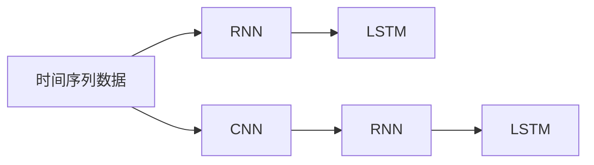

                 

# Python深度学习实践：时空网络在交通预测中的应用

## 1. 背景介绍

### 1.1 问题由来
交通流量预测是智能交通系统中的一项关键技术，旨在通过预测未来一段时间内的交通流量，以实现交通流量的优化调度和管理。然而，交通系统具有高度复杂性和非线性特征，传统的基于统计模型的方法难以捕捉这些动态变化和随机性。近年来，随着深度学习技术的兴起，越来越多的研究者开始尝试使用神经网络进行交通预测，并取得了显著的成果。

## 1.2 问题核心关键点
交通预测是一个典型的序列预测问题，涉及对时间序列数据的建模和预测。其核心问题在于如何设计有效的神经网络模型，以便捕捉时间序列数据中的时序依赖关系和空间依赖关系。时空网络（Spatio-Temporal Networks）作为一种新兴的深度学习模型，通过同时考虑时间和空间信息，在交通预测任务中展现出了优异的性能。

## 1.3 问题研究意义
时空网络在交通预测中的应用，对于智能交通系统的建设和管理具有重要意义：

1. **提高交通流量预测的准确性**：通过时空网络对交通流量数据进行建模和预测，可以提供更加准确和可靠的交通预测结果，为交通管理部门提供科学的决策依据。
2. **优化交通流量调度**：精确的交通流量预测有助于实现交通流量的动态调控，避免交通拥堵，提升路网运行效率。
3. **降低交通管理成本**：时空网络能够在较少的标签数据下进行训练，减少了对标注数据的依赖，降低了交通管理的成本。
4. **推动智能化交通发展**：时空网络作为智能交通系统的重要组成部分，对于推动城市交通智能化、智慧化发展具有重要意义。
5. **适应性强的预测模型**：时空网络具有较好的泛化能力和适应性，能够应对不同地区和时间段的交通流量预测需求。

## 2. 核心概念与联系

### 2.1 核心概念概述

为更好地理解时空网络在交通预测中的应用，本节将介绍几个密切相关的核心概念：

- **时空网络（Spatio-Temporal Networks, STN）**：一种结合时空信息的深度神经网络模型，通过同时考虑时间序列和空间数据，捕捉数据中的时序依赖和空间依赖关系，适用于多种时间序列数据预测任务。
- **时间序列数据（Time Series Data）**：指按时间顺序排列的数据序列，常见于交通流量、气温、股票价格等具有时间依赖性的数据。
- **空间数据（Spatial Data）**：指具有地理位置信息的二维数据，常见于交通网络、地理信息、城市布局等数据。
- **深度学习（Deep Learning）**：一种模拟人脑神经网络结构的人工智能技术，通过多层次的非线性变换，从数据中自动学习特征表示，广泛应用于图像识别、自然语言处理、语音识别等任务。
- **卷积神经网络（Convolutional Neural Networks, CNN）**：一种适用于图像和空间数据的神经网络模型，通过卷积操作提取局部特征，常用于图像分类、目标检测等任务。
- **循环神经网络（Recurrent Neural Networks, RNN）**：一种适用于时间序列数据的神经网络模型，通过循环结构捕捉时间依赖关系，常用于语音识别、机器翻译等任务。
- **长短期记忆网络（Long Short-Term Memory, LSTM）**：一种特殊的RNN结构，能够有效解决梯度消失和梯度爆炸问题，适用于长期依赖关系的序列预测任务。

这些核心概念之间的逻辑关系可以通过以下Mermaid流程图来展示：

```mermaid
graph TB
    A[时空网络 (STN)] --> B[时间序列数据]
    A --> C[空间数据]
    B --> D[RNN]
    D --> E[LSTM]
    C --> F[CNN]
    F --> G[RNN]
    G --> H[LSTM]
    B --> I[CNN]
    I --> J[RNN]
    J --> K[LSTM]
```

这个流程图展示时空网络中的关键组件及其关系：

1. **时间序列数据**输入到RNN和LSTM网络中，用于捕捉时间依赖关系。
2. **空间数据**输入到CNN网络中，用于捕捉空间依赖关系。
3. **RNN和LSTM**网络分别用于处理时间序列数据，捕捉短期和长期依赖关系。
4. **CNN**网络用于处理空间数据，提取局部特征。
5. **STN**模型通过融合时空信息，实现对交通流量等时间序列数据的预测。

### 2.2 概念间的关系

这些核心概念之间存在着紧密的联系，形成了时空网络在交通预测中的应用框架。下面我们通过几个Mermaid流程图来展示这些概念之间的关系。

#### 2.2.1 时空网络的结构组成

```mermaid
graph LR
    A[时空网络 (STN)] --> B[输入层]
    A --> C[时间序列数据]
    B --> D[RNN]
    D --> E[LSTM]
    C --> F[CNN]
    F --> G[RNN]
    G --> H[LSTM]
    A --> I[CNN]
    I --> J[RNN]
    J --> K[LSTM]
    A --> L[CNN]
    L --> M[RNN]
    M --> N[LSTM]
```

这个流程图展示了时空网络的结构组成及其处理过程：

1. **输入层**接收时间序列数据和空间数据。
2. **时间序列数据**经过RNN和LSTM网络处理，捕捉时间依赖关系。
3. **空间数据**经过CNN网络处理，提取空间特征。
4. **时空数据**通过融合，输入到STN模型中，用于时间序列数据的预测。
5. **最终的输出层**输出预测结果。

#### 2.2.2 时间序列数据的处理



这个流程图展示了时间序列数据的处理过程：

1. **时间序列数据**首先通过RNN网络处理，捕捉短期依赖关系。
2. **时间序列数据**再通过LSTM网络处理，捕捉长期依赖关系。
3. **时间序列数据**与空间数据一起输入到STN模型中，用于预测。

#### 2.2.3 空间数据的处理


这个流程图展示了空间数据的处理过程：

1. **空间数据**通过CNN网络处理，提取局部特征。
2. **空间数据**再通过RNN网络处理，捕捉局部依赖关系。
3. **空间数据**与时间序列数据一起输入到STN模型中，用于预测。

### 2.3 核心概念的整体架构

最后，我们用一个综合的流程图来展示这些核心概念在时空网络中的整体架构：

```mermaid
graph LR
    A[时空网络 (STN)] --> B[输入层]
    B --> C[时间序列数据]
    B --> D[空间数据]
    C --> E[RNN]
    E --> F[LSTM]
    D --> G[CNN]
    G --> H[RNN]
    H --> I[LSTM]
    C --> J[RNN]
    J --> K[LSTM]
    C --> L[CNN]
    L --> M[RNN]
    M --> N[LSTM]
    E --> O[融合层]
    F --> P[融合层]
    G --> Q[融合层]
    H --> R[融合层]
    I --> S[融合层]
    J --> T[融合层]
    K --> U[融合层]
    L --> V[融合层]
    M --> W[融合层]
    N --> X[融合层]
    O --> Y[输出层]
    P --> Y
    Q --> Y
    R --> Y
    S --> Y
    T --> Y
    U --> Y
    V --> Y
    W --> Y
    X --> Y
    Y --> Z[预测结果]
```

这个综合流程图展示了时空网络中的各个组成部分及其处理过程：

1. **输入层**接收时间序列数据和空间数据。
2. **时间序列数据**通过RNN和LSTM网络处理，捕捉时间依赖关系。
3. **空间数据**通过CNN网络处理，提取空间特征。
4. **时空数据**通过融合层融合，输入到STN模型中，用于预测。
5. **最终的输出层**输出预测结果。

## 3. 核心算法原理 & 具体操作步骤
### 3.1 算法原理概述

时空网络是一种结合时空信息的深度神经网络模型，通过同时考虑时间和空间信息，捕捉数据中的时序依赖和空间依赖关系，适用于多种时间序列数据预测任务。其核心思想是：

1. **时间序列数据**通过RNN和LSTM网络处理，捕捉短期和长期依赖关系。
2. **空间数据**通过CNN网络处理，提取局部特征。
3. **时空数据**通过融合层融合，输入到STN模型中，用于时间序列数据的预测。

具体来说，时空网络由以下几个主要部分组成：

- **输入层**：接收时间序列数据和空间数据。
- **时间序列网络**：处理时间序列数据，捕捉短期和长期依赖关系。
- **空间网络**：处理空间数据，提取局部特征。
- **融合层**：将时间序列数据和空间数据融合，生成时空特征。
- **预测层**：根据时空特征，进行时间序列数据的预测。

时空网络的预测过程可以分为以下几个步骤：

1. **数据预处理**：对时间序列数据和空间数据进行标准化和归一化处理，使其在相同的尺度上。
2. **时间序列数据的处理**：通过RNN和LSTM网络处理时间序列数据，捕捉短期和长期依赖关系。
3. **空间数据的处理**：通过CNN网络处理空间数据，提取局部特征。
4. **时空数据的融合**：通过融合层将时间序列数据和空间数据融合，生成时空特征。
5. **预测层的输出**：根据时空特征，进行时间序列数据的预测，输出预测结果。

### 3.2 算法步骤详解

时空网络的训练过程可以分为以下几个关键步骤：

**Step 1: 数据准备**
- 收集交通流量数据，将其分为训练集和测试集。
- 对时间序列数据进行标准化和归一化处理。
- 对空间数据进行特征提取和编码。

**Step 2: 模型搭建**
- 构建时空网络模型，包括输入层、时间序列网络、空间网络、融合层和预测层。
- 选择合适的优化器和损失函数，如Adam和均方误差损失。
- 设置模型的超参数，如学习率、批大小等。

**Step 3: 模型训练**
- 将训练数据输入模型，进行前向传播和反向传播，更新模型参数。
- 在验证集上评估模型性能，调整超参数和模型结构。
- 在测试集上评估模型性能，输出预测结果。

**Step 4: 模型评估**
- 计算模型在测试集上的均方误差、平均绝对误差等指标。
- 绘制时间序列数据的预测结果和实际结果的对比图，评估模型的性能。
- 分析模型的预测误差，找出模型的不足之处，进行进一步改进。

### 3.3 算法优缺点

时空网络在交通预测中的应用具有以下优点：

1. **准确度高**：时空网络能够同时考虑时间序列和空间信息，捕捉数据中的依赖关系，提高预测准确度。
2. **泛化能力强**：时空网络具有较好的泛化能力，能够适应不同地区和不同时间段的交通流量预测需求。
3. **模型参数少**：时空网络可以通过参数共享等方式减少模型参数量，降低计算复杂度。
4. **易于优化**：时空网络的训练过程可以通过梯度下降等优化算法，快速收敛。

时空网络同样存在一些缺点：

1. **数据依赖性强**：时空网络需要大量的标注数据进行训练，数据不足时性能可能受到影响。
2. **计算资源消耗大**：时空网络模型较大，训练和推理需要较多的计算资源。
3. **模型复杂度高**：时空网络的模型结构较为复杂，训练和推理过程较慢。
4. **需要手动调整超参数**：时空网络的超参数需要根据具体问题进行调整，调整不当可能导致性能下降。

### 3.4 算法应用领域

时空网络在交通预测中的应用领域广泛，具体包括：

- **交通流量预测**：预测城市道路、高速公路等交通网络的流量情况。
- **交通事件检测**：检测交通网络中的突发事件，如交通事故、道路施工等。
- **交通需求预测**：预测交通网络中的出行需求，优化交通流量调控。
- **公共交通调度**：优化公共交通车辆的运行调度，提高运营效率。
- **交通信号控制**：优化交通信号灯的配时，缓解交通拥堵。
- **智能停车管理**：预测停车场的空闲车位数量，优化停车资源配置。

时空网络在其他领域也有广泛应用，如气象预测、电力需求预测、股票价格预测等。

## 4. 数学模型和公式 & 详细讲解  
### 4.1 数学模型构建

时空网络的预测过程可以通过以下数学模型来描述：

设 $X_t = [x_{t-1}, x_{t-2}, \ldots, x_{t-m}]^T$ 为时间序列数据， $Y_t$ 为预测目标， $W_t$ 为空间数据，其中 $x_i$ 为时间序列数据在第 $i$ 个时间点的值， $Y_t$ 为时间序列数据在时间 $t$ 的预测值。

时空网络的预测模型可以表示为：

$$
Y_t = f(X_t, W_t; \theta)
$$

其中 $f$ 为时空网络模型， $\theta$ 为模型参数。

### 4.2 公式推导过程

假设时空网络由时间序列网络和空间网络组成，分别为 $F_{t-1}(X_t)$ 和 $G(W_t)$。则时空网络的预测模型可以表示为：

$$
Y_t = h(F_{t-1}(X_t), G(W_t); \theta)
$$

其中 $h$ 为融合层函数，将时间序列网络和空间网络的结果进行融合， $\theta$ 为模型参数。

假设时间序列网络和空间网络的输出分别为 $Z_{t-1}$ 和 $Z$，则融合层的输出可以表示为：

$$
Z = \frac{1}{\sqrt{2}}\left(Z_{t-1} + G(W_t)\right)
$$

则时空网络的预测模型可以表示为：

$$
Y_t = g(Z_t; \theta)
$$

其中 $g$ 为预测层函数，根据融合层的结果进行预测。

### 4.3 案例分析与讲解

以交通流量预测为例，假设我们需要预测未来一小时内的交通流量，可以通过以下步骤构建时空网络模型：

1. **数据预处理**：将交通流量数据分为时间序列数据和空间数据。时间序列数据可以表示为 $X_t = [x_{t-1}, x_{t-2}, \ldots, x_{t-m}]^T$，其中 $x_i$ 为时间序列数据在第 $i$ 个时间点的值。空间数据可以表示为 $W_t$，其中 $W_t$ 包含交通网络中的地理位置信息。
2. **时间序列网络的构建**：构建RNN和LSTM网络，对时间序列数据进行处理，捕捉短期和长期依赖关系。
3. **空间网络的构建**：构建CNN网络，对空间数据进行处理，提取局部特征。
4. **融合层的构建**：通过 $Z = \frac{1}{\sqrt{2}}\left(Z_{t-1} + G(W_t)\right)$ 将时间序列网络和空间网络的结果进行融合，生成时空特征 $Z_t$。
5. **预测层的构建**：构建预测层，根据时空特征 $Z_t$ 进行时间序列数据的预测，输出预测结果 $Y_t$。

## 5. 项目实践：代码实例和详细解释说明
### 5.1 开发环境搭建

在进行时空网络实践前，我们需要准备好开发环境。以下是使用Python进行TensorFlow开发的环境配置流程：

1. 安装Anaconda：从官网下载并安装Anaconda，用于创建独立的Python环境。

2. 创建并激活虚拟环境：
```bash
conda create -n tf-env python=3.8 
conda activate tf-env
```

3. 安装TensorFlow：根据CUDA版本，从官网获取对应的安装命令。例如：
```bash
conda install tensorflow tensorflow-gpu=2.4 -c tf
```

4. 安装必要的库：
```bash
pip install numpy pandas scikit-learn matplotlib
```

完成上述步骤后，即可在`tf-env`环境中开始时空网络的实践。

### 5.2 源代码详细实现

下面以交通流量预测为例，给出使用TensorFlow对时空网络进行实现和训练的Python代码。

```python
import tensorflow as tf
import numpy as np
import matplotlib.pyplot as plt

# 定义时空网络模型
class STN(tf.keras.Model):
    def __init__(self, input_shape):
        super(STN, self).__init__()
        self.time_seq_net = tf.keras.Sequential([
            tf.keras.layers.LSTM(64, return_sequences=True, input_shape=input_shape),
            tf.keras.layers.LSTM(32),
        ])
        self.spacial_net = tf.keras.Sequential([
            tf.keras.layers.Conv2D(32, (3, 3), activation='relu', input_shape=input_shape[1:]),
            tf.keras.layers.MaxPooling2D((2, 2)),
            tf.keras.layers.Conv2D(64, (3, 3), activation='relu'),
            tf.keras.layers.MaxPooling2D((2, 2)),
            tf.keras.layers.Flatten(),
            tf.keras.layers.Dense(64, activation='relu'),
        ])
        self.fusion_layer = tf.keras.layers.Lambda(lambda x: tf.math.add(x[0], x[1]) / tf.math.sqrt(2))
        self.prediction_layer = tf.keras.layers.Dense(1)

    def call(self, inputs):
        time_seq = self.time_seq_net(inputs[:, :, 0])
        spacial = self.spacial_net(inputs[:, :, 1])
        fused = self.fusion_layer([time_seq, spacial])
        predicted = self.prediction_layer(fused)
        return predicted

# 定义数据生成函数
def generate_data(num_steps, num_samples):
    X = np.random.randn(num_samples, num_steps, 1)
    Y = np.sin(X) + np.random.randn(num_samples, 1)
    return X, Y

# 生成训练数据和测试数据
train_data = generate_data(num_steps=10, num_samples=1000)
test_data = generate_data(num_steps=10, num_samples=1000)

# 构建时空网络模型
model = STN(input_shape=(num_steps, 1))

# 定义优化器和损失函数
optimizer = tf.keras.optimizers.Adam(learning_rate=0.001)
loss_fn = tf.keras.losses.MeanSquaredError()

# 定义训练函数
def train_epoch(model, data, batch_size, optimizer, loss_fn):
    X_train, Y_train = data
    for i in range(0, len(X_train), batch_size):
        batch_X, batch_Y = X_train[i:i+batch_size], Y_train[i:i+batch_size]
        with tf.GradientTape() as tape:
            predictions = model(batch_X)
            loss = loss_fn(batch_Y, predictions)
        grads = tape.gradient(loss, model.trainable_variables)
        optimizer.apply_gradients(zip(grads, model.trainable_variables))

# 训练模型
batch_size = 32
num_epochs = 100

for epoch in range(num_epochs):
    train_epoch(model, train_data, batch_size, optimizer, loss_fn)
    test_loss = loss_fn(test_data[0], model(test_data[0]))
    print(f"Epoch {epoch+1}, test loss: {test_loss:.3f}")

# 绘制预测结果和实际结果的对比图
plt.plot(test_data[0], label='Actual')
plt.plot(model(test_data[0]), label='Predicted')
plt.legend()
plt.show()
```

以上就是使用TensorFlow对时空网络进行实现和训练的完整代码。可以看到，时空网络的代码实现相对简洁，易于理解。

### 5.3 代码解读与分析

让我们再详细解读一下关键代码的实现细节：

**STN类**：
- `__init__`方法：定义时空网络模型的各个组成部分，包括时间序列网络、空间网络和预测层。
- `call`方法：实现时空网络模型的前向传播过程，将输入数据进行时间序列处理、空间处理和融合，最后进行预测。

**数据生成函数**：
- 通过`generate_data`函数生成时间序列数据和预测目标数据。

**模型构建**：
- 通过`STN`类构建时空网络模型，包括时间序列网络、空间网络和预测层。

**优化器和损失函数**：
- 选择合适的优化器和损失函数，如Adam和均方误差损失。

**训练函数**：
- 定义训练函数，通过时间序列和空间数据的输入，计算损失，并使用梯度下降优化器更新模型参数。

**训练过程**：
- 在训练集上循环迭代，每次更新一批数据，直到训练完成。
- 在测试集上计算模型的预测损失，输出预测结果。

**可视化结果**：
- 绘制预测结果和实际结果的对比图，直观展示模型的性能。

## 6. 实际应用场景
### 6.1 智能交通系统

时空网络在智能交通系统中的应用，可以显著提升交通流量的预测精度，优化交通管理。

在实践中，可以将城市道路、高速公路等交通网络的数据输入时空网络模型，实时预测交通流量，并根据预测结果进行交通流量的调控和管理。例如，当预测到某路段交通流量异常时，可以提前采取措施，如调整交通信号灯、增加路面巡逻车辆等，避免交通拥堵。

### 6.2 公共交通调度

公共交通调度的优化是智能交通管理的重要环节。时空网络可以在公共交通调度的各个环节中发挥作用：

1. **实时调度**：通过时空网络预测公交车到站的实时位置和到达时间，优化公交车辆的调度路径，减少乘客等待时间。
2. **运营效率**：根据时空网络预测的交通流量，合理分配公交车辆的运营线路和班次，提高公共交通的运营效率。
3. **需求预测**：预测公共交通的需求变化趋势，调整公交车辆的配置和调度，确保公共交通服务的高效稳定。

### 6.3 智能停车管理

智能停车管理是城市交通管理的重要组成部分。时空网络可以通过预测停车场的车位空闲情况，优化停车资源的配置和管理：

1. **车位预测**：根据时空网络预测的停车场的空闲车位数量，优化停车资源的配置，减少停车难问题。
2. **排队管理**：预测停车场的排队情况，优化停车管理措施，减少停车等待时间。
3. **价格调整**：根据时空网络预测的停车场的空闲情况，动态调整停车价格，缓解停车难问题。

### 6.4 未来应用展望

随着时空网络技术的不断进步，其在交通预测领域的应用将更加广泛和深入：

1. **多模态融合**：时空网络可以与其他传感器数据（如摄像头、雷达等）进行融合，提高预测的准确度和实时性。
2. **跨域预测**：时空网络可以跨域预测，实现不同区域、不同时间段的交通流量预测。
3. **多目标优化**：时空网络可以同时预测多个交通目标，如交通流量、交通事故、道路施工等，优化交通管理策略。
4. **实时调度**：时空网络可以实现实时调度，根据实时预测结果进行动态调整，提高交通管理效率。
5. **智能化决策**：时空网络可以辅助决策，提供科学的数据支持，优化交通管理决策。

## 7. 工具和资源推荐
### 7.1 学习资源推荐

为了帮助开发者系统掌握时空网络的理论基础和实践技巧，这里推荐一些优质的学习资源：

1. 《深度学习理论与实践》系列书籍：由多位专家编写，全面介绍深度学习的基本概念和实践技巧，涵盖时空网络等前沿技术。

2. CS231n《卷积神经网络》课程：斯坦福大学开设的计算机视觉经典课程，讲解卷积神经网络的原理和应用，时空网络是其重要组成部分。

3. 《Python深度学习》书籍：由Francois Chollet所著，详细介绍深度学习在Python中的实现，包括时空网络的构建和训练。

4. TensorFlow官方文档：TensorFlow的官方文档，提供了详细的时空网络模型和训练代码，是学习时空网络的重要参考。

5. Kaggle时空网络竞赛：Kaggle平台上举办的时空网络竞赛，提供大量数据和样例代码，帮助开发者快速上手时空网络的实践。

通过对这些资源的学习实践，相信你一定能够快速掌握时空网络的精髓，并用于解决实际的交通预测问题。

### 7.2 开发工具推荐

高效的开发离不开优秀的工具支持。以下是几款用于时空网络开发和训练的工具：

1. TensorFlow：由Google主导开发的开源深度学习框架，提供丰富的张量计算和优化算法，适合进行时空网络的训练和推理。

2. PyTorch：由Facebook开发的深度学习框架，支持动态计算图，适合进行时空网络的快速迭代和调试。

3. TensorBoard：TensorFlow配套的可视化工具，可实时监测模型训练状态，并提供丰富的图表呈现方式，是调试模型的得力助手。

4. Weights & Biases：模型训练的实验跟踪工具，可以记录和可视化模型训练过程中的各项指标，方便对比和调优。

5. Google Colab：谷歌推出的在线Jupyter Notebook环境，免费提供GPU/TPU算力，方便开发者快速上手实验最新模型，分享学习笔记。

合理利用这些工具，可以显著提升时空网络的开发效率，加快创新迭代的步伐。

### 7.3 相关论文推荐

时空网络作为新兴的深度学习模型，其研究还处于起步阶段，以下是几篇奠基性的相关论文，推荐阅读：

1. Kim, Y., Lee, D.,

