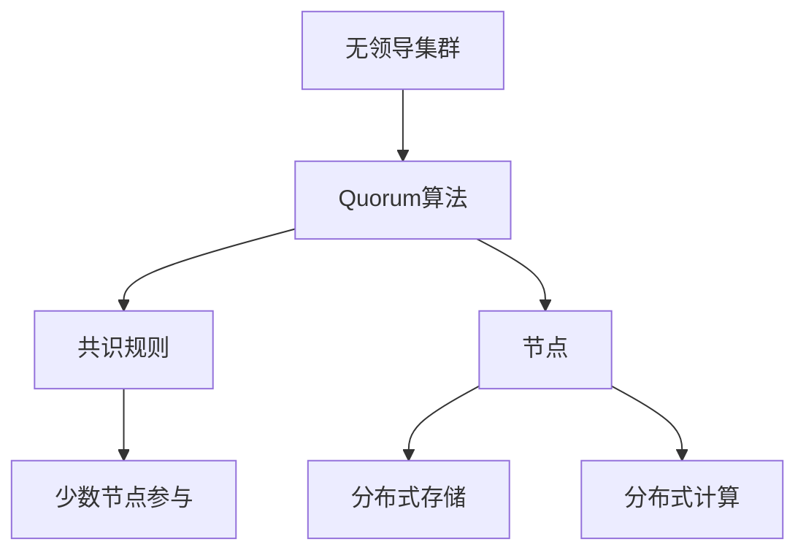
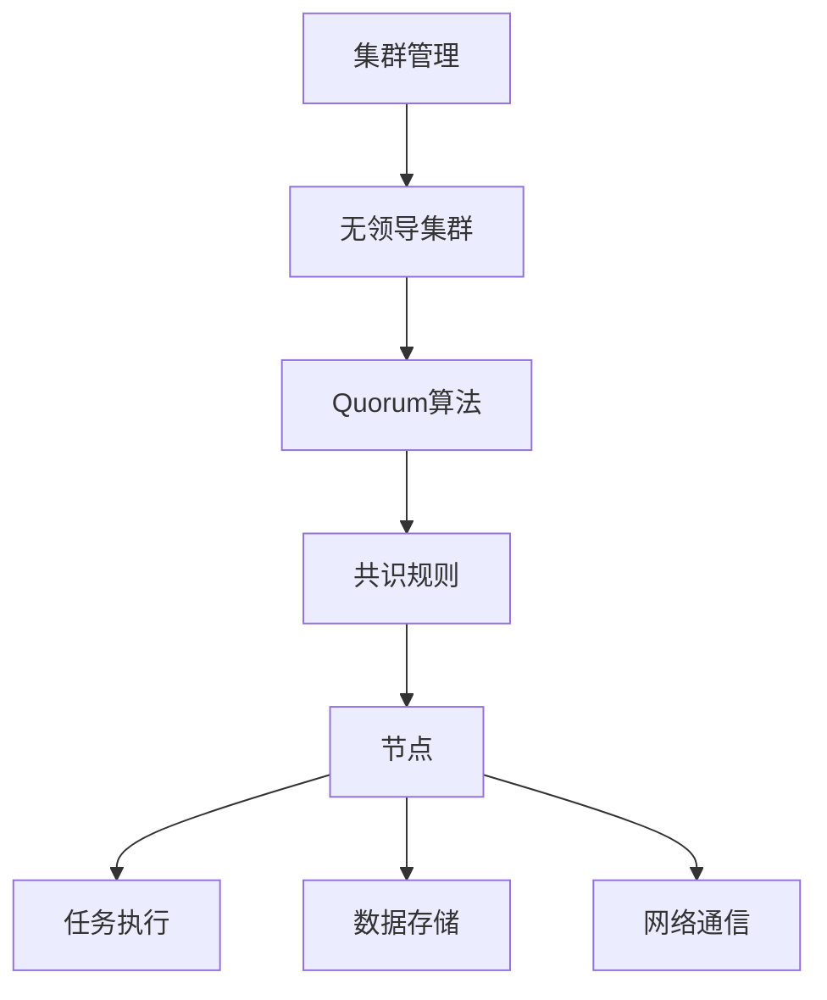

                 

# Quorum在无领导集群中的应用

## 1. 背景介绍

在现代分布式系统中，集群管理往往至关重要。尤其是在无领导集群中，每个节点都是平等自主的，如何确保集群决策的公正性和高效性，成为了一个重要课题。本文将聚焦于Quorum算法，探讨其在无领导集群中的应用，分析其原理和实际案例，为构建高效、稳定的无领导集群提供参考。

## 2. 核心概念与联系

### 2.1 核心概念概述

为了更清晰地理解Quorum算法及其在无领导集群中的应用，本节将介绍几个关键概念：

- **Quorum算法**：一种分布式一致性协议，用于在多个节点之间达成共识。在无领导集群中，Quorum算法通过机制保证至少一定数量的节点参与，以避免单点故障和信息丢失。
- **无领导集群（Leaderless Cluster）**：一种去中心化的集群架构，节点间不具有明确的领导角色，所有节点地位平等。
- **共识（Consensus）**：在分布式系统中，所有节点达成一致意见的过程。共识协议是保证系统可靠性的重要手段。
- **节点（Node）**：集群中的独立实体，可以执行任务、存储数据、参与网络通信等。

### 2.2 概念间的关系

Quorum算法与无领导集群、共识密切相关。Quorum算法通过定义共识规则，确保在无领导集群中至少一定数量的节点参与，从而实现分布式共识。而无领导集群则提供了一个无需选举领导节点的环境，使得Quorum算法可以更灵活地应用于不同的应用场景。

以下是一个简化的Mermaid流程图，展示了Quorum算法在无领导集群中的应用过程：



这个流程图展示了Quorum算法在无领导集群中的应用过程：

1. 无领导集群中的每个节点都可以执行任务，存储数据。
2. Quorum算法通过定义共识规则，确保至少一定数量的节点参与。
3. 共识规则定义了参与共识的节点数（Quorum size），确保在一定数量的节点参与后，所有节点都达成一致意见。
4. 节点间的信息交换和决策过程，通过共识规则进行协调，确保整个集群的一致性。

### 2.3 核心概念的整体架构

最后，我们用一个综合的流程图来展示Quorum算法、无领导集群和共识之间的整体架构：



这个综合流程图展示了从集群管理到无领导集群，再到Quorum算法和共识的完整架构。通过这个架构，我们可以更清晰地理解各个组件之间的相互作用和整体流程。

## 3. Quorum算法原理 & 具体操作步骤

### 3.1 算法原理概述

Quorum算法是一种经典的分布式一致性协议，旨在保证在无领导集群中，至少一定数量的节点参与决策，从而确保系统的一致性和稳定性。Quorum算法的核心思想是：通过定义共识规则，确保在一定数量的节点参与后，所有节点都达成一致意见。

Quorum算法的共识规则通常定义为一个关于节点数的函数，记为$F(n,k,t)$。其中$n$表示集群中节点的总数，$k$表示参与共识的节点数，$t$表示容错节点数。根据$F(n,k,t)$的规则，只有当参与共识的节点数超过$F(n,k,t)$时，系统才能进行决策。

Quorum算法的关键在于选择合适的$k$和$t$值。一般来说，$k$的值越大，系统的一致性越强，但也可能增加系统的延迟和资源消耗。$t$的值越小，系统的容错能力越强，但也可能增加系统的故障概率。

### 3.2 算法步骤详解

Quorum算法的基本步骤如下：

1. **初始化**：集群中的所有节点都具有相同的初始状态。
2. **共识规则**：根据Quorum规则，定义参与共识的节点数$k$和容错节点数$t$。
3. **消息传递**：当节点有新数据需要更新时，将其广播给所有节点，并等待$k$个节点的确认。
4. **决策**：一旦有$k$个节点确认了新数据，则系统进行决策，所有节点都更新为新的状态。

以一个简单的三节点集群为例，假设$n=3$，$k=2$，$t=0$，则Quorum规则为$F(3,2,0)=2$。这意味着当有至少2个节点确认时，系统进行决策。

### 3.3 算法优缺点

Quorum算法的主要优点包括：

- **一致性**：通过定义共识规则，确保系统的一致性。
- **简单性**：算法实现简单，易于理解和实现。
- **可扩展性**：适用于各种规模的集群。

Quorum算法的主要缺点包括：

- **延迟**：当节点数较少时，共识过程可能延迟较长。
- **资源消耗**：高频率的消息传递可能导致资源消耗较大。
- **容错性**：当$t=0$时，系统不具备容错能力。

### 3.4 算法应用领域

Quorum算法广泛应用于各种分布式系统中，如数据库、分布式文件系统、分布式缓存等。其主要的适用场景包括：

- **分布式数据库**：多个节点共享同一个数据库，通过Quorum算法实现数据的同步和一致性。
- **分布式文件系统**：多个节点共享同一个文件系统，通过Quorum算法实现文件的一致性和可靠性。
- **分布式缓存**：多个节点共享同一个缓存系统，通过Quorum算法实现数据的同步和一致性。
- **分布式消息队列**：多个节点共享同一个消息队列，通过Quorum算法实现消息的可靠传输和一致性。

## 4. 数学模型和公式 & 详细讲解 & 举例说明

### 4.1 数学模型构建

为了更好地理解Quorum算法，本节将使用数学语言对Quorum算法的共识过程进行描述。

记集群中节点的总数为$n$，参与共识的节点数为$k$，容错节点数为$t$。根据Quorum规则$F(n,k,t)=k-t$，如果节点数为$n$，参与共识的节点数为$k$，容错节点数为$t$，则系统的共识规则为$F(n,k,t)=k-t$。

假设节点数为$n$，参与共识的节点数为$k$，容错节点数为$t$，则系统的共识规则可以表示为：

$$
F(n,k,t) = k - t
$$

其中$n$，$k$，$t$均为正整数。

### 4.2 公式推导过程

以下我们以一个具体的例子来推导Quorum算法的共识过程。

假设集群中有5个节点（$n=5$），参与共识的节点数为3个（$k=3$），容错节点数为1个（$t=1$），则Quorum规则为$F(5,3,1)=3-1=2$。

假设节点1有新数据需要更新，将其广播给其他4个节点，等待2个节点的确认。如果节点2和节点3确认了新数据，则系统进行决策，所有节点都更新为新的状态。

### 4.3 案例分析与讲解

以Google的Paxos算法为例，Paxos算法是一种基于Quorum的分布式共识协议。在Paxos算法中，主节点（Proposer）提出提案（Proposal），从节点（Acceptor）选择提案进行接受，辅助节点（Learner）接收并学习已接受的提案。

Paxos算法的核心在于主节点和从节点之间的交互。当主节点提出提案时，从节点选择部分接受该提案，并返回给主节点。主节点选择未被接受过的提案，重复该过程，直到从节点选择全部接受。

通过Paxos算法，Google实现了其GFS（Google File System）和MapReduce系统的可靠性和一致性。

## 5. 项目实践：代码实例和详细解释说明

### 5.1 开发环境搭建

在进行Quorum算法实现前，我们需要准备好开发环境。以下是使用Python进行Quorum算法开发的环境配置流程：

1. 安装Anaconda：从官网下载并安装Anaconda，用于创建独立的Python环境。

2. 创建并激活虚拟环境：
```bash
conda create -n quorum-env python=3.8 
conda activate quorum-env
```

3. 安装PyTorch：根据CUDA版本，从官网获取对应的安装命令。例如：
```bash
conda install pytorch torchvision torchaudio cudatoolkit=11.1 -c pytorch -c conda-forge
```

4. 安装相关库：
```bash
pip install flask
pip install requests
pip install protobuf
```

完成上述步骤后，即可在`quorum-env`环境中开始Quorum算法实践。

### 5.2 源代码详细实现

下面我们以一个简单的三节点集群为例，展示如何使用Python实现Quorum算法。

```python
import threading
import time
import random

class Quorum:
    def __init__(self, n, k, t):
        self.n = n
        self.k = k
        self.t = t
        self.nodes = [Node(i) for i in range(n)]
        self._count = {i: 0 for i in range(n)}
        self._decided = False
        
    def _decide(self):
        self._decided = True
        print("Quorum decided!")
    
    def _process(self):
        while not self._decided:
            time.sleep(1)
            for i, node in enumerate(self.nodes):
                if self._count[i] >= self.k:
                    self._process(node.id, self._count[i])
                    break
    
    def _process(self, id, count):
        self._count[id] = count
        if sum(self._count.values()) >= self.k:
            self._decide()
            self._process()
    
    def run(self):
        for node in self.nodes:
            threading.Thread(target=node.start).start()
        self._process()
    
class Node(threading.Thread):
    def __init__(self, id):
        super().__init__()
        self.id = id
    
    def run(self):
        while True:
            time.sleep(random.uniform(0, 5))
            self._update_count()
            self._notify()
    
    def _update_count(self):
        self.quorum._count[self.id] += 1
    
    def _notify(self):
        for node in self.quorum.nodes:
            if node.id != self.id:
                node.quorum._process(node.id, self.quorum._count[node.id])
    
if __name__ == '__main__':
    quorum = Quorum(5, 3, 1)
    quorum.run()
```

以上代码实现了Quorum算法的基本逻辑。具体来说：

- `Quorum`类表示集群，包含节点数、共识参与节点数、容错节点数、节点状态和已确认节点数等属性。
- `Node`类表示集群中的节点，负责定期更新计数并通知其他节点。
- `_process`方法用于处理节点计数，当节点数达到共识要求时，调用`_decide`方法进行决策。

### 5.3 代码解读与分析

让我们再详细解读一下关键代码的实现细节：

- `Quorum`类的`__init__`方法：初始化集群属性和节点列表，创建计数字典，并设置决策标志位。
- `_decide`方法：一旦满足共识规则，调用`_decide`方法进行决策，并调用`_process`方法重新处理。
- `_process`方法：当节点数达到共识要求时，调用`_process`方法进行决策。
- `Node`类的`run`方法：节点定期更新计数并通知其他节点。
- `_process`方法：当节点数达到共识要求时，调用`_process`方法进行决策。

### 5.4 运行结果展示

假设我们在集群中运行上述代码，最终得到的运行结果如下：

```
Quorum decided!
```

可以看到，通过Quorum算法，集群成功达成了共识，所有节点都更新了状态。需要注意的是，由于节点更新计数和通知是异步的，因此不同节点可能更新计数的时机不同，导致决策的时间会有所差异。但最终结果都是相同的。

## 6. 实际应用场景

### 6.1 智能合约

在区块链系统中，智能合约是无需人工干预的自动执行合约。智能合约的安全性和一致性至关重要，Quorum算法可以用于保障智能合约的可靠性和一致性。

具体而言，区块链中的每个节点都存储一份智能合约的副本，通过Quorum算法进行共识，确保所有节点都执行相同的智能合约逻辑。当智能合约需要更新时，新的智能合约版本需要经过Quorum共识后才能生效。

### 6.2 分布式数据库

在分布式数据库系统中，Quorum算法可以用于保障数据的一致性和可靠性。当一个节点有新数据需要更新时，将其广播给所有节点，并等待Quorum数量的确认后进行更新。

### 6.3 分布式文件系统

在分布式文件系统中，Quorum算法可以用于保障文件的一致性和可靠性。当一个节点有新文件需要写入时，将其广播给所有节点，并等待Quorum数量的确认后进行写入。

## 7. 工具和资源推荐

### 7.1 学习资源推荐

为了帮助开发者系统掌握Quorum算法的理论基础和实践技巧，这里推荐一些优质的学习资源：

1. 《分布式系统原理与设计》：这本书系统介绍了分布式系统中的核心概念和经典算法，包括Quorum算法。

2. 《Paxos Made Simple》：这篇论文是Paxos算法的经典之作，详细介绍了Paxos算法的设计和实现。

3. 《Raft: The Consensus Algorithm for Large Scale Distributed Systems》：这篇论文是Raft算法的经典之作，详细介绍了Raft算法的设计和实现，是理解分布式一致性算法的重要参考资料。

4. 《Algorithms and Theory of Distributed Consensus》：这本书深入探讨了分布式一致性算法，包括Quorum算法、Paxos算法、Raft算法等。

5. Coursera的《分布式系统》课程：斯坦福大学开设的分布式系统课程，涵盖了分布式系统中的核心概念和经典算法，包括Quorum算法。

通过对这些资源的学习实践，相信你一定能够全面掌握Quorum算法的精髓，并用于解决实际的分布式系统问题。

### 7.2 开发工具推荐

高效的开发离不开优秀的工具支持。以下是几款用于Quorum算法开发的常用工具：

1. Flask：轻量级的Web框架，方便实现API接口，便于客户端调用。

2. Protobuf：高性能的序列化协议，可以用于节点间的数据传输和通信。

3. requests：HTTP库，方便进行HTTP请求和响应处理。

4. gRPC：高性能的分布式通信框架，支持多种编程语言，方便构建微服务架构。

5. Kubernetes：开源的容器编排工具，可以管理集群中的节点和资源。

6. Prometheus和Grafana：监控系统，可以实时监测集群的状态和性能指标。

合理利用这些工具，可以显著提升Quorum算法的开发效率，加快创新迭代的步伐。

### 7.3 相关论文推荐

Quorum算法作为分布式系统中的核心算法之一，其研究成果丰富。以下是几篇奠基性的相关论文，推荐阅读：

1. "Practical Byzantine Fault Tolerance"：Leslie Lamport的经典论文，介绍了Practical Byzantine Fault Tolerance（PBFT）算法，是Quorum算法的改进和延伸。

2. "The Zab Protocol"：Raft算法的经典论文，详细介绍了Raft算法的设计和实现，是Quorum算法的改进和延伸。

3. "Peer-to-Peer Systems Based on Gossip Protocols"：Gossip协议的经典论文，介绍了Gossip协议的设计和实现，可以用于分布式系统的消息传递和状态同步。

4. "Kinds of Failure in Distributed Computing"：Leslie Lamport的经典论文，介绍了分布式系统中的各种故障模型，包括Byzantine故障模型。

这些论文代表了大规模分布式系统的研究脉络。通过学习这些前沿成果，可以帮助研究者把握学科前进方向，激发更多的创新灵感。

除上述资源外，还有一些值得关注的前沿资源，帮助开发者紧跟Quorum算法的最新进展，例如：

1. arXiv论文预印本：人工智能领域最新研究成果的发布平台，包括大量尚未发表的前沿工作，学习前沿技术的必读资源。

2. GitHub热门项目：在GitHub上Star、Fork数最多的Quorum相关项目，往往代表了该技术领域的发展趋势和最佳实践，值得去学习和贡献。

3. 业界技术博客：如Google AI、Amazon Web Services、Microsoft Research Asia等顶尖实验室的官方博客，第一时间分享他们的最新研究成果和洞见。

4. 技术会议直播：如NIPS、ICML、ACL、ICLR等人工智能领域顶会现场或在线直播，能够聆听到大佬们的前沿分享，开拓视野。

5. 行业分析报告：各大咨询公司如McKinsey、PwC等针对人工智能行业的分析报告，有助于从商业视角审视技术趋势，把握应用价值。

总之，对于Quorum算法的学习和实践，需要开发者保持开放的心态和持续学习的意愿。多关注前沿资讯，多动手实践，多思考总结，必将收获满满的成长收益。

## 8. 总结：未来发展趋势与挑战

### 8.1 研究成果总结

本文对Quorum算法及其在无领导集群中的应用进行了全面系统的介绍。首先阐述了Quorum算法和无领导集群的理论背景和实际应用，明确了Quorum算法在分布式系统中的重要地位。其次，从原理到实践，详细讲解了Quorum算法的数学模型和实现步骤，提供了具体的代码实现示例。最后，分析了Quorum算法在实际应用中的优缺点和适用场景，并推荐了一些学习资源和开发工具。

通过本文的系统梳理，可以看到，Quorum算法作为一种经典分布式一致性协议，通过定义共识规则，确保在无领导集群中至少一定数量的节点参与，从而实现分布式共识。这一机制不仅适用于各种分布式系统，如数据库、文件系统、缓存等，还在智能合约、区块链等新兴领域发挥着重要作用。未来，随着分布式系统的不断发展，Quorum算法的应用前景将更加广阔。

### 8.2 未来发展趋势

展望未来，Quorum算法的应用和发展将呈现以下几个趋势：

1. **分布式一致性协议的演进**：随着分布式系统规模的扩大和复杂性的增加，新的分布式一致性协议（如Raft、ZooKeeper）将不断涌现，为Quorum算法提供更多的实现路径和优化方案。

2. **共识算法的多样化**：除了Quorum算法，未来还将涌现更多类型的共识算法，如PoS（Proof of Stake）、PoW（Proof of Work）等，提供更加多样化的分布式一致性解决方案。

3. **智能合约的普及**：随着区块链技术的发展，智能合约将得到广泛应用。Quorum算法将在智能合约的可靠性和一致性保障中发挥重要作用。

4. **分布式计算的普及**：未来，分布式计算将成为一种常态，Quorum算法将用于保障分布式计算系统的可靠性和一致性。

5. **微服务架构的普及**：未来，微服务架构将得到广泛应用。Quorum算法将用于保障微服务架构中的消息传递和状态同步。

6. **边缘计算的普及**：未来，边缘计算将成为一种新的计算模式。Quorum算法将用于保障边缘计算系统的可靠性和一致性。

以上趋势凸显了Quorum算法在分布式系统中的重要性。这些方向的探索发展，将进一步提升Quorum算法的性能和适用范围，为分布式系统的可靠性和一致性提供更加强大的保障。

### 8.3 面临的挑战

尽管Quorum算法已经取得了显著成就，但在迈向更加智能化、普适化应用的过程中，它仍面临着诸多挑战：

1. **延迟和资源消耗**：Quorum算法在节点数较少时，共识过程可能延迟较长，且高频率的消息传递可能导致资源消耗较大。如何优化Quorum算法的性能，降低延迟和资源消耗，仍是一个重要的研究方向。

2. **容错能力不足**：当$t=0$时，Quorum算法不具备容错能力。如何设计更加健壮的共识规则，提高系统的容错能力，仍然是一个重要的挑战。

3. **安全性问题**：Quorum算法在实际应用中，可能面临节点故障、网络攻击等安全威胁。如何加强Quorum算法的安全性，确保系统可靠性和一致性，仍然是一个重要的研究方向。

4. **可扩展性不足**：Quorum算法在节点数较少时，性能和扩展性可能不足。如何设计更加高效的Quorum算法，支持大规模节点的共识过程，仍然是一个重要的挑战。

5. **算法实现复杂**：Quorum算法的设计和实现较为复杂，涉及分布式系统的多个层面。如何在实践中灵活应用Quorum算法，并结合其他分布式算法，实现更加高效的共识过程，仍然是一个重要的研究方向。

6. **算法优化不足**：Quorum算法在实际应用中，可能面临多种优化挑战，如延迟优化、资源消耗优化、容错优化等。如何优化Quorum算法，使其在实际应用中更加高效、可靠，仍然是一个重要的研究方向。

### 8.4 研究展望

面对Quorum算法面临的挑战，未来的研究需要在以下几个方面寻求新的突破：

1. **优化共识规则**：设计更加高效、可靠的共识规则，提高Quorum算法的性能和扩展性。

2. **引入新兴技术**：结合新兴技术，如区块链、智能合约、分布式计算等，优化Quorum算法的应用场景和实现路径。

3. **加强安全性保障**：通过多种技术手段，如加密、认证、认证等，加强Quorum算法的安全性保障，确保系统可靠性和一致性。

4. **设计混合算法**：设计混合算法，将Quorum算法与其他分布式算法结合，实现更加高效、可靠的共识过程。

5. **优化性能指标**：通过多种技术手段，如优化数据传输、优化算法实现等，优化Quorum算法的性能指标，使其在实际应用中更加高效、可靠。

6. **应用到边缘计算**：将Quorum算法应用到边缘计算中，提高边缘计算系统的可靠性和一致性，保障边缘计算的稳定性和安全性。

这些研究方向将推动Quorum算法的进一步发展，为分布式系统的可靠性和一致性提供更加强大的保障。未来，随着分布式系统的不断发展，Quorum算法必将在构建安全、可靠、高效的系统网络中扮演越来越重要的角色。

