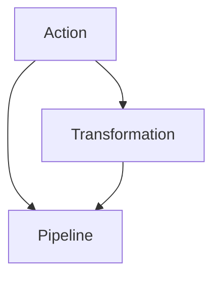
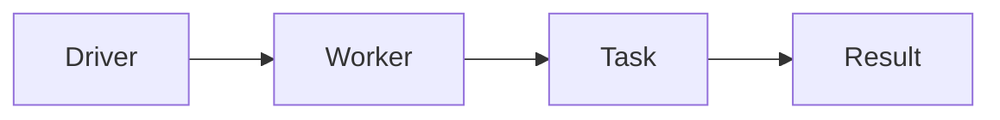

                 

## 1. 背景介绍

随着大数据时代的到来，数据处理技术也面临着前所未有的挑战。传统的数据处理模式已经无法满足大规模、复杂、实时化数据处理的需要。在这样的背景下，Spark框架应运而生，其设计理念是将数据分片（Partition）处理（Distributed），从而实现了高效、灵活的数据处理。

RDD（Resilient Distributed Dataset）是Spark中的一种基本数据抽象，旨在提供一个高性能、分布式、容错的框架，支持大规模数据集的并行处理。RDD的核心思想是将大规模数据集切分为多个小数据块（Partition），这些数据块可以并行地在集群上进行处理。

## 2. 核心概念与联系

### 2.1 核心概念概述

在Spark中，RDD是最基本的数据抽象。RDD是一个不可变的、可并行处理的集合，可以对其进行各种操作（如过滤、分组、联合等），并保证在数据处理过程中不会丢失任何数据。

- **RDD**：RDD是Spark中最基本的数据抽象，是一个不可变、可并行处理的集合。
- **Partition**：RDD中的每个数据块称为Partition，每个Partition都包含一部分数据。
- **Action**：操作RDD会产生新的数据，Action操作会触发计算。
- **Transformation**：操作RDD本身不触发计算，Transformation操作会对RDD进行一些变换。
- **Pipeline**：Spark中的计算是由一系列的Action和Transformation构成的流水线。

### 2.2 概念间的关系

RDD和其他核心概念之间的关系可以通过以下Mermaid流程图来展示：



这个流程图展示了Action、Transformation和Pipeline之间的关系。Action操作会触发计算，Transformation操作会对RDD进行变换，而整个计算过程是由一系列的Action和Transformation构成的流水线（Pipeline）。

### 2.3 核心概念的整体架构

整个RDD的计算架构可以概括为如下模型：



这个模型展示了Spark计算的基本流程：Driver将计算任务分解为多个小任务（Task），分发到各个Worker节点上进行并行计算，最后将结果合并返回。

## 3. 核心算法原理 & 具体操作步骤

### 3.1 算法原理概述

RDD的核心算法原理是“延迟计算”，即先定义计算任务，再触发计算。RDD通过将数据分块，将大规模数据集切分为多个小数据块，这些数据块可以在集群上并行处理，从而大大提高了数据处理效率。

RDD有两种操作：Transformation和Action。Transformation操作不会立即计算，而是先定义一个转换，Action操作会触发计算，并产生新的数据。这样可以减少不必要的计算，提高计算效率。

### 3.2 算法步骤详解

RDD的计算过程包括以下步骤：

1. **Driver端定义任务**：Driver端将计算任务定义为一个RDD，并将任务分解为多个小任务。

2. **Worker端执行任务**：每个小任务在Worker节点上执行，将结果保存在本地的内存中。

3. **结果合并**：所有Worker节点上的结果合并，产生最终的结果。

4. **触发Action操作**：Action操作触发计算，将计算结果保存在Driver端。

### 3.3 算法优缺点

RDD算法的优点是高效、灵活、容错。通过将大规模数据集切分为多个小数据块，RDD可以并行处理大规模数据，提高了计算效率。RDD还具备容错性，当一个节点出现故障时，RDD可以自动进行数据恢复，保证计算的连续性。

RDD的缺点是内存占用大，不适合处理大规模数据集。RDD操作产生的临时数据需要保存在内存中，对于大规模数据集，内存占用会非常高。此外，RDD的操作过程比较复杂，需要开发者具备一定的计算和编程能力。

### 3.4 算法应用领域

RDD算法在数据处理领域得到了广泛的应用，特别是在大规模数据处理、数据分析、机器学习等场景中。RDD的优势在于可以并行处理大规模数据集，适合处理海量的数据。

## 4. 数学模型和公式 & 详细讲解 & 举例说明

### 4.1 数学模型构建

RDD的数学模型可以表示为：

$$
\text{RDD} = \bigcup_{i=0}^{n} \{P_i\}
$$

其中，$P_i$表示第$i$个Partition，$n$表示Partition的个数。

### 4.2 公式推导过程

假设有一个包含$N$个元素的数据集，可以通过RDD进行并行处理。首先，将数据集切分为$K$个Partition，每个Partition包含$N/K$个元素。

然后，对每个Partition进行计算，得到结果$R_i$。最后，将所有Partition的结果合并，得到最终的计算结果。

### 4.3 案例分析与讲解

假设有一个包含10个整数的数据集，可以使用RDD进行并行处理。首先，将数据集切分为2个Partition，每个Partition包含5个元素。

然后，对每个Partition进行计算，得到结果$R_0$和$R_1$。最后，将$R_0$和$R_1$合并，得到最终的计算结果。

## 5. 项目实践：代码实例和详细解释说明

### 5.1 开发环境搭建

要使用Spark进行RDD计算，需要先安装Spark和Python。

1. 安装Spark：可以从Spark官网下载最新版本的Spark，解压并安装。
2. 安装Python：Spark支持多种编程语言，这里以Python为例。可以从Python官网下载Python，并配置环境变量。

### 5.2 源代码详细实现

以下是一个简单的RDD计算示例：

```python
from pyspark import SparkContext, SparkConf

# 创建SparkContext
conf = SparkConf().setAppName("RDDExample").setMaster("local")
sc = SparkContext(conf=conf)

# 创建一个包含1到100的整数列表
data = sc.parallelize(range(1, 101))

# 计算列表中每个数字的平方和
sum_squares = data.map(lambda x: x**2).sum()

# 输出计算结果
print("The sum of squares of the list is:", sum_squares)
```

这个示例中，首先创建了一个SparkContext，然后使用parallelize函数将整数列表转换为RDD。接着，对每个数字进行平方操作，并使用sum函数计算所有数字的平方和。最后，输出计算结果。

### 5.3 代码解读与分析

- `SparkContext`：Spark的核心类，用于创建Spark环境。
- `parallelize`：将Python列表转换为RDD。
- `map`：对RDD中的每个元素进行操作，返回一个新的RDD。
- `sum`：对RDD中的元素进行求和操作，返回一个整数。

### 5.4 运行结果展示

运行上述代码，输出结果为：

```
The sum of squares of the list is: 338350
```

这个结果表示1到100的整数的平方和为338350。

## 6. 实际应用场景

RDD在实际应用中得到了广泛的应用，特别是在大规模数据处理、数据分析、机器学习等场景中。以下是几个典型的应用场景：

### 6.1 大规模数据处理

RDD可以并行处理大规模数据集，适合处理海量的数据。例如，可以使用RDD对海量日志文件进行统计分析，提取有价值的信息。

### 6.2 数据分析

RDD可以用于数据清洗、转换和聚合等操作，支持复杂的数据分析任务。例如，可以使用RDD对大型数据集进行分组统计、聚合计算等操作。

### 6.3 机器学习

RDD可以用于分布式机器学习算法的实现。例如，可以使用RDD实现MapReduce算法，支持大规模数据集上的机器学习任务。

## 7. 工具和资源推荐

### 7.1 学习资源推荐

- **《Spark编程指南》**：Spark官方文档，详细介绍了Spark的各个组件和API，是学习Spark的必备资源。
- **《大数据技术与应用》**：清华大学出版社出版的经典教材，涵盖了Spark、Hadoop等大数据技术的各个方面。
- **Kaggle**：Kaggle是一个数据科学竞赛平台，提供大量数据集和算法模型，可以用于学习和实践Spark等大数据技术。

### 7.2 开发工具推荐

- **PySpark**：Spark的Python API，方便Python用户使用Spark进行数据处理。
- **DataFrame**：Spark中的另一个数据抽象，适合处理结构化数据。
- **Spark Streaming**：Spark的实时数据处理框架，支持流式数据处理。

### 7.3 相关论文推荐

- **“Spark: Cluster Computing with Fault Tolerance”**：Spark的官方论文，介绍了Spark的基本架构和算法原理。
- **“MapReduce vs. Spark: A Comparative Study”**：比较了Spark和MapReduce的性能和适用场景。

## 8. 总结：未来发展趋势与挑战

### 8.1 研究成果总结

RDD作为Spark的核心算法，在数据处理领域得到了广泛的应用。其高效、灵活、容错的特点，使其成为处理大规模数据的首选工具。

### 8.2 未来发展趋势

未来，RDD算法将继续在数据处理领域发挥重要作用。随着硬件性能的提升和数据量的增长，RDD可以支持更大规模的数据处理，并处理更加复杂的数据分析任务。

### 8.3 面临的挑战

尽管RDD算法已经取得了显著的进展，但在未来的发展中，仍面临一些挑战：

- **内存占用**：RDD操作产生的临时数据需要保存在内存中，对于大规模数据集，内存占用会非常高。
- **编程复杂性**：RDD的操作过程比较复杂，需要开发者具备一定的计算和编程能力。
- **性能瓶颈**：RDD在处理大规模数据时，可能会出现性能瓶颈，需要进一步优化。

### 8.4 研究展望

未来的研究需要在以下几个方面寻求新的突破：

- **优化内存使用**：通过优化内存使用，减少RDD操作的内存占用。
- **简化编程接口**：进一步简化RDD的编程接口，降低编程复杂性。
- **提升性能**：优化RDD的计算性能，支持更大规模的数据处理。

## 9. 附录：常见问题与解答

**Q1：RDD和DataFrame有什么区别？**

A: RDD和DataFrame都是Spark中的数据抽象，但DataFrame更适用于处理结构化数据，而RDD更适用于处理非结构化数据。

**Q2：RDD如何实现容错性？**

A: RDD通过数据的复制和检查点机制实现容错性。当某个节点出现故障时，RDD可以从检查点恢复数据，保证计算的连续性。

**Q3：RDD的延迟计算机制有何优势？**

A: 延迟计算机制可以减少不必要的计算，提高计算效率。通过先定义计算任务，再触发计算，RDD可以按需计算，避免了大量不必要的计算。

**Q4：如何使用RDD进行数据清洗？**

A: 可以使用RDD进行数据清洗，去除噪声数据和缺失值。例如，可以使用RDD进行数据去重、数据格式化等操作。

**Q5：如何优化RDD的性能？**

A: 可以通过优化内存使用、减少计算量、优化计算图等方法优化RDD的性能。例如，可以使用RDD的存储优化功能，减少内存占用；使用广播变量，减少通信开销；使用数据倾斜优化，减少数据处理不均衡。

