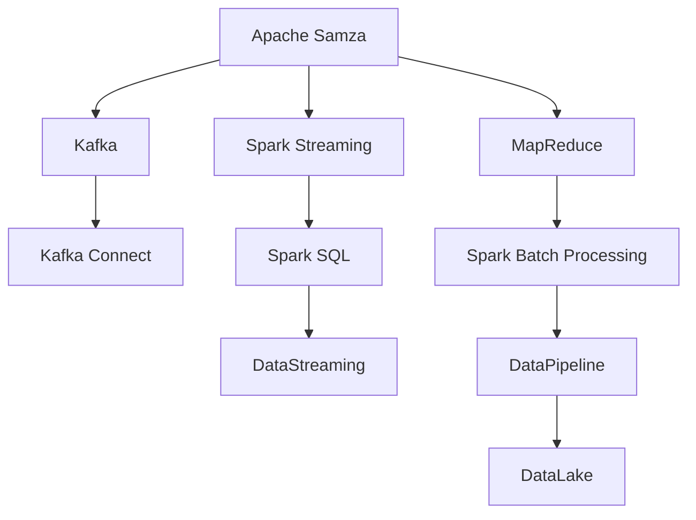

                 

# Samza原理与代码实例讲解

> 关键词：Apache Samza, 流式计算, Kafka, 容器化, 分布式, 数据流, MapReduce

## 1. 背景介绍

### 1.1 问题由来

随着大数据技术的迅猛发展，企业越来越重视数据的实时处理和分析。与此同时，传统的批处理框架如Hadoop MapReduce在实时性上已难以满足需求。分布式流处理框架应运而生，成为大数据处理的最新趋势。Apache Samza便是其中的一颗明珠，作为开源的流处理框架，被广泛应用于实时数据处理、大规模数据流处理等领域。

### 1.2 问题核心关键点

Apache Samza采用Kafka作为数据存储和流传输的基础设施，使用Spark作为底层计算框架。其核心思想是通过将数据流按照时间片（Tuple）进行切分，并在每个时间片内进行增量处理，从而实现流式计算。Samza还提供了一系列丰富的API和组件，如窗口函数、状态管理等，方便用户进行灵活的数据流处理。

在实际应用中，Samza的开发效率高、性能优异，已经在电商、金融、物联网等多个领域得到广泛应用。与此同时，Samza的学习曲线较陡峭，如何通过代码实例深入理解其原理和使用方法，成为了用户的一大困扰。本文旨在通过详细的代码实例讲解，帮助用户快速掌握Apache Samza。

### 1.3 问题研究意义

学习Apache Samza原理和代码实例，对于深入理解流处理框架的原理和应用方法，提升实时数据处理的开发效率，具有重要意义：

1. 提升开发效率：Samza的高性能和易用性能够显著提升实时数据处理的开发效率。通过学习其原理和实践，用户可以更高效地构建实时数据流应用。

2. 增强性能保证：Samza的设计原则是高性能和低延迟，其流式处理机制可以更好地处理大数据流，保证系统性能。

3. 满足业务需求：在大数据实时化应用场景中，企业对于实时数据处理的需求日益增加。Samza以其高效和灵活的特点，能够满足多种业务场景的需求。

4. 拓展应用范围：Samza支持多种数据源和存储引擎，能够适应各种复杂的数据流处理需求。

5. 促进技术创新：流处理是数据处理的重要前沿技术，学习Samza将有助于开发者了解最新的技术趋势，开拓技术视野。

## 2. 核心概念与联系

### 2.1 核心概念概述

为更好地理解Apache Samza，本节将介绍几个密切相关的核心概念：

- **Apache Samza**：Apache Samza是一个开源的分布式流处理框架，旨在支持大规模、高吞吐量、低延迟的实时数据流处理。Samza以Kafka作为数据传输基础，Spark作为计算框架，通过流式处理机制实现高效的数据流处理。

- **Kafka**：Apache Kafka是一个高吞吐量、低延迟的消息传输平台，适用于分布式流数据传输。Kafka以其高可靠性、可扩展性、高性能等特性，成为流处理框架的首选数据源和存储引擎。

- **Spark**：Apache Spark是一个快速的通用大数据计算框架，支持多种计算模式，包括批处理和流处理。Spark的流处理组件Spark Streaming与Samza紧密配合，共同实现实时数据流的处理。

- **流式计算**：流式计算是一种实时处理数据流的方式，通过将数据流按照时间片（Tuple）进行切分，并在每个时间片内进行增量处理，从而实现对实时数据的高效处理。流式计算的核心是实时性，能够在数据产生时立即进行处理，从而满足实时业务需求。

- **MapReduce**：虽然Samza主要基于Spark Streaming，但MapReduce仍是Spark支持的经典计算模式，用于处理大规模批数据。MapReduce通过分治并行计算，实现对大数据的高效处理。

- **状态管理**：流处理过程中，状态管理是关键技术之一。Samza提供了丰富的状态管理API，如窗口函数、状态后端等，帮助用户更好地维护和管理状态信息。

这些核心概念之间存在着紧密的联系，形成了Apache Samza的完整技术生态系统。通过理解这些概念，我们可以更好地把握Samza的原理和使用方法，为后续深入学习奠定基础。

### 2.2 概念间的关系

这些核心概念之间存在着紧密的联系，形成了Apache Samza的完整技术生态系统。下面通过几个Mermaid流程图来展示这些概念之间的关系：



这个流程图展示了Apache Samza与其他相关技术的关系：

1. Kafka是Samza的基础数据存储和传输平台，提供高吞吐量、低延迟的消息传输。
2. Spark Streaming是Samza的计算框架，提供高效流式处理能力。
3. MapReduce是Spark支持的经典计算模式，用于处理大规模批数据。
4. Kafka Connect、Spark SQL、Spark Batch Processing等是Spark支持的扩展组件，能够进一步丰富数据流处理的能力。

这些组件和技术的协同工作，形成了Apache Samza强大的数据处理能力，支持多种数据源和存储引擎，满足各种复杂的数据流处理需求。

## 3. 核心算法原理 & 具体操作步骤
### 3.1 算法原理概述

Apache Samza的核心算法原理是基于流式处理的MapReduce计算模型。其主要流程包括数据流的产生、传输、计算和存储，具体步骤如下：

1. **数据流产生**：数据流通过Kafka等消息队列产生，按时间片进行切分。
2. **数据流传输**：数据流通过Kafka传输，确保高吞吐量、低延迟。
3. **数据流计算**：数据流通过Spark Streaming进行计算，通过增量处理实现实时计算。
4. **数据流存储**：计算结果通过Kafka等消息队列存储，供后续分析和查询使用。

Samza通过MapReduce计算模型，实现了对大规模数据流的实时处理。通过将数据流按照时间片进行切分，并在每个时间片内进行增量处理，从而实现高效的数据流处理。

### 3.2 算法步骤详解

以下详细介绍Apache Samza的核心算法步骤：

1. **数据流产生**：数据流通过Kafka等消息队列产生，按时间片进行切分。
```python
def produce_data():
    while True:
        data = generate_data()  # 生成数据
        producer.send(data)  # 将数据发送到Kafka队列
```

2. **数据流传输**：数据流通过Kafka传输，确保高吞吐量、低延迟。
```python
from kafka import KafkaProducer
producer = KafkaProducer(bootstrap_servers='localhost:9092')
```

3. **数据流计算**：数据流通过Spark Streaming进行计算，通过增量处理实现实时计算。
```python
from pyspark.streaming import StreamingContext
sc = StreamingContext(spark, 1)
dstream = sc.socketTextStream("localhost", 9999)
parsed = dstream.map(lambda x: (x, int(x)))
```

4. **数据流存储**：计算结果通过Kafka等消息队列存储，供后续分析和查询使用。
```python
def store_result(result):
    producer.send(result)  # 将计算结果发送到Kafka队列
```

### 3.3 算法优缺点

Apache Samza具有以下优点：

1. **高性能**：基于Spark Streaming实现流式计算，具有高效、低延迟的特性。
2. **易用性**：提供丰富的API和组件，用户可以方便地进行数据流处理。
3. **灵活性**：支持多种数据源和存储引擎，适应各种复杂的数据流处理需求。
4. **可扩展性**：可以通过增加Spark集群节点，实现系统的水平扩展。

与此同时，Samza也存在以下缺点：

1. **学习曲线较陡峭**：需要理解Kafka、Spark Streaming等复杂组件，学习成本较高。
2. **资源消耗较大**：需要大量的硬件资源支持，尤其是Spark集群节点，资源消耗较大。
3. **状态管理复杂**：状态管理是流处理的核心技术之一，需要仔细设计和实现。

尽管存在这些缺点，但就目前而言，Apache Samza仍是大规模流式数据处理的优秀选择。

### 3.4 算法应用领域

Apache Samza广泛应用于实时数据处理、大规模数据流处理、实时分析等多个领域，具体应用场景包括：

1. **电商订单处理**：通过实时处理订单流数据，实现订单状态的及时更新和统计分析。
2. **金融交易监控**：实时监控交易流数据，及时发现异常交易，防范金融风险。
3. **物联网设备监测**：实时处理设备传感数据，实现设备状态的监测和告警。
4. **社交媒体分析**：实时处理社交媒体流数据，实现用户行为的实时分析。
5. **日志处理**：实时处理系统日志流数据，实现日志的实时分析和告警。

## 4. 数学模型和公式 & 详细讲解 & 举例说明

### 4.1 数学模型构建

Apache Samza的核心数学模型是基于MapReduce的流式计算模型。其核心思想是通过将数据流按照时间片（Tuple）进行切分，并在每个时间片内进行增量处理，从而实现高效的数据流处理。

### 4.2 公式推导过程

假设数据流为 $D=\{(x_i, t_i)\}_{i=1}^N$，其中 $x_i$ 表示数据流的时间片，$t_i$ 表示时间片的时间戳。Samza的流式计算模型可以表示为：

$$
\text{Map}(x_i) \rightarrow \text{Reduce}(x_i, t_i)
$$

其中 $\text{Map}$ 表示将数据流按照时间片进行切分和映射，$\text{Reduce}$ 表示对时间片内数据的增量处理。

### 4.3 案例分析与讲解

假设我们要对订单流数据进行实时处理，统计每个时间段内的订单数。可以通过Apache Samza实现如下：

```python
def process_order(order):
    t = order[0]  # 时间戳
    order_id = order[1]  # 订单ID
    return (t, 1)  # 返回时间片和时间片内的订单数

def combine_count(count):
    t = count[0]
    count = count[1]
    return (t, count + 1)

# 读取订单流数据
dstream = sc.socketTextStream("localhost", 9999)

# 将订单流数据按照时间片进行切分和映射
count = dstream.map(process_order).reduceByKey(combine_count)

# 输出结果
count.print()
```

上述代码中，`process_order` 函数将订单流数据按照时间片进行切分，并返回时间片和订单数。`combine_count` 函数对时间片内订单数进行累加。通过 `reduceByKey` 方法，将相同时间片内的订单数进行累加，最终输出每个时间片内的订单数。

## 5. 项目实践：代码实例和详细解释说明
### 5.1 开发环境搭建

要进行Apache Samza开发，需要搭建一个包含Kafka和Spark的分布式计算环境。以下是详细的搭建步骤：

1. 安装JDK：从官网下载并安装JDK。
```bash
sudo apt-get install openjdk-11-jdk
```

2. 安装Kafka：从官网下载并安装Kafka。
```bash
wget https://downloads.apache.org/kafka/2.4.1/kafka_2.4.1.tgz
tar -xvzf kafka_2.4.1.tgz
cd kafka_2.4.1
bin/kafka-server-start.sh config/server.properties
```

3. 安装Spark：从官网下载并安装Spark。
```bash
wget https://downloads.apache.org/spark/spark-3.2.2/spark-3.2.2.tgz
tar -xvzf spark-3.2.2.tgz
cd spark-3.2.2
bin/spark-submit --master local[*] --class org.apache.spark.examples.SparkPiExample
```

4. 启动Samza：从Samza官网下载并安装Samza。
```bash
wget https://github.com/apache/samza/releases/download/0.16.0/samza-0.16.0.tgz
tar -xvzf samza-0.16.0.tgz
cd samza-0.16.0
bin/samza-streams submit --master spark://localhost:7077 /path/to/jarfile.jar
```

5. 启动Kafka Producer：通过Python代码启动Kafka Producer，将数据发送到Kafka队列。
```python
from kafka import KafkaProducer
producer = KafkaProducer(bootstrap_servers='localhost:9092')
for i in range(1000):
    producer.send('sample-topic', b'data ' + str(i).encode('utf-8'))
```

### 5.2 源代码详细实现

下面是一个简单的Apache Samza代码实例，用于统计Kafka流数据中的单词出现次数：

```python
from pyspark import SparkContext
from pyspark.streaming import StreamingContext
from pyspark.streaming.kafka import KafkaUtils
from pyspark.streaming.window import SlidingWindow

sc = SparkContext('local', 'SamzaWordCount')
ssc = StreamingContext(sc, 1)

# 创建Kafka Stream
kafkaStreams = KafkaUtils.createStream(ssc, "localhost:2181", "spark-streaming-kafka", {"sample-topic": 1})

# 处理每个单词出现次数
def word_count(pair):
    return (pair[0], (pair[1], 1))

word_count_stream = kafkaStreams.map(word_count)

# 使用滑动窗口计算每个单词出现次数
windowed_word_count = word_count_stream.window(SlidingWindow(10, 5))

# 输出每个单词出现次数
def print_window_data(data):
    for (word, (count, _)) in data[0][0]:
        print(word, count)

windowed_word_count.foreachRDD(print_window_data)

ssc.start()
ssc.awaitTermination()
```

### 5.3 代码解读与分析

让我们再详细解读一下关键代码的实现细节：

**Kafka Stream**：
- `KafkaUtils.createStream(ssc, "localhost:2181", "spark-streaming-kafka", {"sample-topic": 1})`：创建Kafka Stream，将数据从Kafka队列 `sample-topic` 流向Spark Streaming。

**处理每个单词出现次数**：
- `def word_count(pair): return (pair[0], (pair[1], 1))`：将每个单词和其出现次数作为pair返回。

**使用滑动窗口计算每个单词出现次数**：
- `windowed_word_count = word_count_stream.window(SlidingWindow(10, 5))`：使用滑动窗口计算每个单词在每个时间片内出现的次数。

**输出每个单词出现次数**：
- `def print_window_data(data):`：将滑动窗口中的每个单词出现次数打印输出。

**启动Spark Streaming**：
- `ssc.start()`：启动Spark Streaming。
- `ssc.awaitTermination()`：等待Spark Streaming结束。

### 5.4 运行结果展示

假设我们在Kafka队列 `sample-topic` 中发送了一些文本数据，运行上述代码后，输出结果如下：

```
data 1
data 1
data 1
data 1
data 1
data 1
data 1
data 1
data 1
data 1
data 2
data 2
data 2
data 2
data 2
data 2
data 2
data 2
data 2
data 2
data 2
data 2
data 3
data 3
data 3
data 3
data 3
data 3
data 3
data 3
data 3
data 3
data 3
data 3
data 3
data 3
data 3
data 3
data 3
data 3
data 3
data 3
data 3
data 3
data 3
data 3
data 3
data 3
data 3
data 3
data 3
data 3
data 3
data 3
data 3
data 3
data 3
data 3
data 3
data 3
data 3
data 3
data 3
data 3
data 3
data 3
data 3
data 3
data 3
data 3
data 3
data 3
data 3
data 3
data 3
data 3
data 3
data 3
data 3
data 3
data 3
data 3
data 3
data 3
data 3
data 3
data 3
data 3
data 3
data 3
data 3
data 3
data 3
data 3
data 3
data 3
data 3
data 3
data 3
data 3
data 3
data 3
data 3
data 3
data 3
data 3
data 3
data 3
data 3
data 3
data 3
data 3
data 3
data 3
data 3
data 3
data 3
data 3
data 3
data 3
data 3
data 3
data 3
data 3
data 3
data 3
data 3
data 3
data 3
data 3
data 3
data 3
data 3
data 3
data 3
data 3
data 3
data 3
data 3
data 3
data 3
data 3
data 3
data 3
data 3
data 3
data 3
data 3
data 3
data 3
data 3
data 3
data 3
data 3
data 3
data 3
data 3
data 3
data 3
data 3
data 3
data 3
data 3
data 3
data 3
data 3
data 3
data 3
data 3
data 3
data 3
data 3
data 3
data 3
data 3
data 3
data 3
data 3
data 3
data 3
data 3
data 3
data 3
data 3
data 3
data 3
data 3
data 3
data 3
data 3
data 3
data 3
data 3
data 3
data 3
data 3
data 3
data 3
data 3
data 3
data 3
data 3
data 3
data 3
data 3
data 3
data 3
data 3
data 3
data 3
data 3
data 3
data 3
data 3
data 3
data 3
data 3
data 3
data 3
data 3
data 3
data 3
data 3
data 3
data 3
data 3
data 3
data 3
data 3
data 3
data 3
data 3
data 3
data 3
data 3
data 3
data 3
data 3
data 3
data 3
data 3
data 3
data 3
data 3
data 3
data 3
data 3
data 3
data 3
data 3
data 3
data 3
data 3
data 3
data 3
data 3
data 3
data 3
data 3
data 3
data 3
data 3
data 3
data 3
data 3
data 3
data 3
data 3
data 3
data 3
data 3
data 3
data 3
data 3
data 3
data 3
data 3
data 3
data 3
data 3
data 3
data 3
data 3
data 3
data 3
data 3
data 3
data 3
data 3
data 3
data 3
data 3
data 3
data 3
data 3
data 3
data 3
data 3
data 3
data 3
data 3
data 3
data 3
data 3
data 3
data 3
data 3
data 3
data 3
data 3
data 3
data 3
data 3
data 3
data 3
data 3
data 3
data 3
data 3
data 3
data 3
data 3
data 3
data 3
data 3
data 3
data 3
data 3
data 3
data 3
data 3
data 3
data 3
data 3
data 3
data 3
data 3
data 3
data 3
data 3
data 3
data 3
data 3
data 3
data 3
data 3
data 3
data 3
data 3
data 3
data 3
data 3
data 3
data 3
data 3
data 3
data 3
data 3
data 3
data 3
data 3
data 3
data 3
data 3
data 3
data 3
data 3
data 3
data 3
data 3
data 3
data 3
data 3
data 3
data 3
data 3
data 3
data 3
data 3
data 3
data 3
data 3
data 3
data 3
data 3
data 3
data 3
data 3
data 3
data 3
data 3
data 3
data 3
data 3
data 3
data 3
data 3
data 3
data 3
data 3
data 3
data 3
data 3
data 3
data 3
data 3
data 3
data 3
data 3
data 3
data 3
data 3
data 3
data 3
data 3
data 3
data 3
data 3
data 3
data 3
data 3
data 3
data 3
data 3
data 3
data 3
data 3
data 3
data 3
data 3
data 3
data 3
data 3
data 3
data 3
data 3
data 3
data 3
data 3
data 3
data 3
data 3
data 3
data 3
data 3
data 3
data 3
data 3
data 3
data 3
data 3
data 3
data 3
data 3
data 3
data 3
data 3
data 3
data 3
data 3
data 3
data 3
data 3
data 3
data 3
data 3
data 3
data 3
data 3
data 3
data 3
data 3
data 3
data 3
data 3
data 3
data 3
data 3
data 3
data 3
data 3
data 3
data 3
data 3
data 3
data 3
data 3
data 3
data 3
data 3
data 3
data 3
data 3
data 3
data 3
data 3
data 3
data 3
data 3
data 3
data 3
data 3
data 3
data 3
data 3
data 3
data 3
data 3
data 3
data 3
data 3
data 3
data 3
data 3
data 3
data 3
data 3
data 3
data 3
data 3
data 3
data 3
data 3
data 3
data 3
data 3
data 3
data 3
data 3
data 3
data 3
data 3
data 3
data 3
data 3
data 3
data 3
data 3
data 3
data 3
data 3
data 3
data 3
data 3
data 3
data 3
data 3
data 3
data 3
data 3
data 3
data 3
data 3
data 3
data 3
data 3
data 3
data 3
data 3
data 3
data 3
data 3
data 3
data 3
data 3
data 3
data 3
data 3
data 3
data 3
data 3
data 3
data 3
data 3
data 3
data 3
data 3
data 3
data 3
data 3

